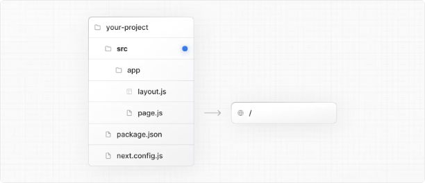

# src 디렉토리

프로젝트의 루트에 특별한 Next.js 앱이나 페이지 디렉토리를 갖는 대신, Next.js는 일반적인 패턴으로 애플리케이션 코드를 src 디렉토리 아래에 배치하는 것도 지원합니다.

이는 프로젝트의 대부분이 루트에 위치하는 프로젝트 구성 파일을 애플리케이션 코드와 분리함으로써, 일부 개인 및 팀에서 선호하는 방식입니다.

src 디렉토리를 사용하려면, 앱 라우터 폴더를 src/app로 또는 페이지 라우터 폴더를 src/pages로 이동시키세요.

<!-- ui-log 수평형 -->

<ins class="adsbygoogle"
      style="display:block"
      data-ad-client="ca-pub-4877378276818686"
      data-ad-slot="9743150776"
      data-ad-format="auto"
      data-full-width-responsive="true"></ins>
<component is="script">
(adsbygoogle = window.adsbygoogle || []).push({});
</component>

> 알아두면 좋은 사항
> /public 디렉토리는 프로젝트의 루트에 있어야 합니다.
> package.json, next.config.js 및 tsconfig.json과 같은 구성 파일은 프로젝트의 루트에 있어야 합니다.
> .env.* 파일은 프로젝트의 루트에 있어야 합니다.
> src/app 또는 src/pages는 루트 디렉토리에 app 또는 pages가 있는 경우 무시됩니다.
> src를 사용하는 경우, /components 또는 /lib와 같은 기타 애플리케이션 폴더를 옮기는 것이 좋습니다.
> Middleware를 사용하는 경우 src 디렉토리 내에 배치해야 합니다.
> Tailwind CSS를 사용하는 경우 tailwind.config.js 파일의 내용 섹션에 /src 접두사를 추가해야 합니다.
> TypeScript 경로를 사용하여 @/*와 같은 import를 하는 경우, tsconfig.json의 paths 오브젝트를 src/를 포함하도록 업데이트해야 합니다.

<!-- ui-log 수평형 -->

<ins class="adsbygoogle"
      style="display:block"
      data-ad-client="ca-pub-4877378276818686"
      data-ad-slot="9743150776"
      data-ad-format="auto"
      data-full-width-responsive="true"></ins>
<component is="script">
(adsbygoogle = window.adsbygoogle || []).push({});
</component>
