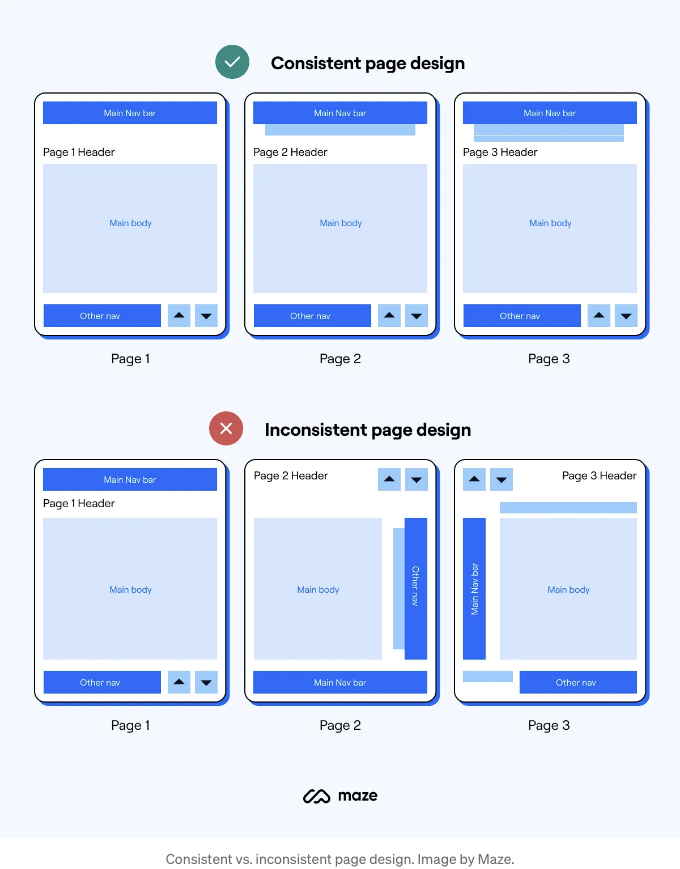
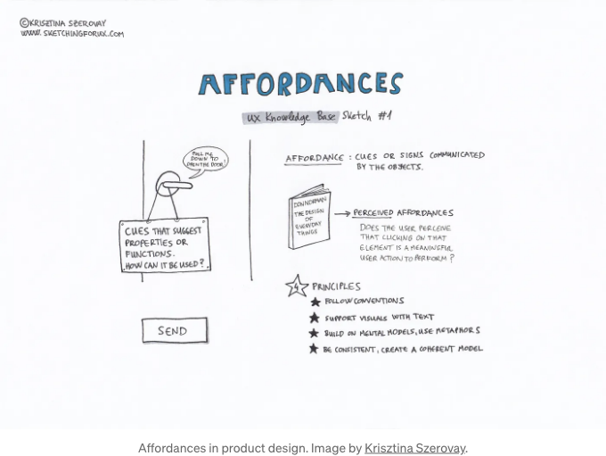
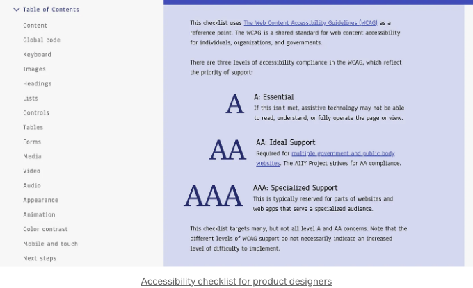
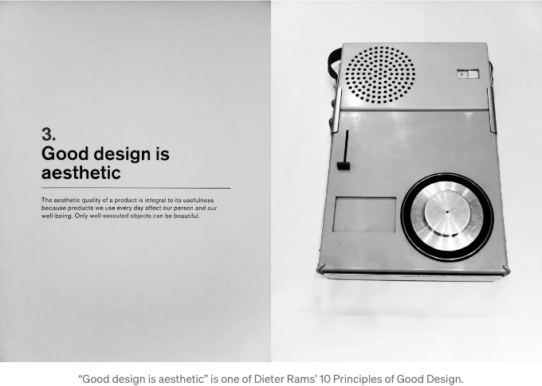
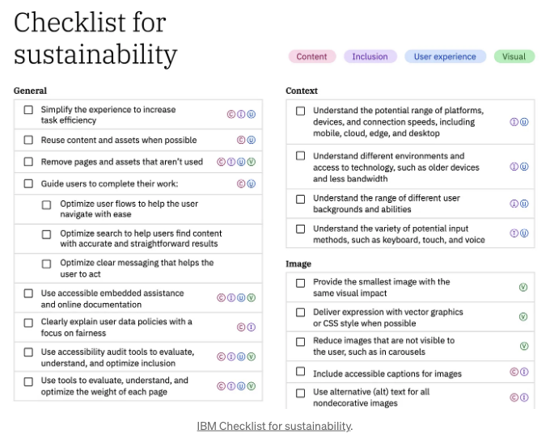
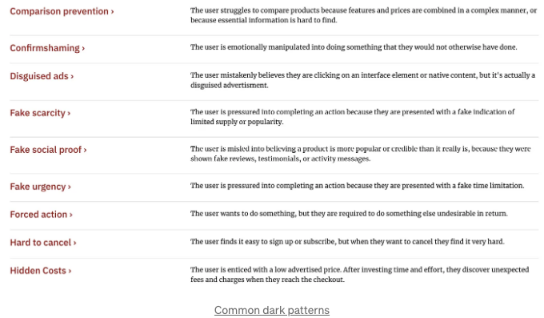

## 1. 간결함

디자인을 간단하게 유지하세요. 복잡성은 최소화되어야 하며 사용성과 이해하기 쉽도록 해야 합니다.

사람들이 어떻게 생각하고 행동하는지 이해하는 것은 사용자가 원하는 행동으로 이끄는 경험을 만드는 데 도움이 될 수 있습니다.

<!-- ui-log 수평형 -->
<ins class="adsbygoogle"
  style="display:block"
  data-ad-client="ca-pub-4877378276818686"
  data-ad-slot="9743150776"
  data-ad-format="auto"
  data-full-width-responsive="true"></ins>
<component is="script">
(adsbygoogle = window.adsbygoogle || []).push({});
</component>

혁신과 익숙함의 균형을 유지하세요. 혁신은 중요하지만 익숙한 패턴에서 너무 벗어나면 사용자가 혼란스러워할 수 있습니다. 새로운 솔루션을 도입하면서 청중을 소왈할 수 있도록 적절한 균형을 찾으세요.

## 2. 일관성

제품 전반에 걸쳐 시각적 및 기능적 일관성을 유지하세요. 이는 사용자가 제품을 더 효율적으로 배우고 상호작용할 수 있게 도와줍니다.

<!-- ui-log 수평형 -->
<ins class="adsbygoogle"
  style="display:block"
  data-ad-client="ca-pub-4877378276818686"
  data-ad-slot="9743150776"
  data-ad-format="auto"
  data-full-width-responsive="true"></ins>
<component is="script">
(adsbygoogle = window.adsbygoogle || []).push({});
</component>

대규모 생태계 내에서 귀하의 제품이 어떻게 맞는지 이해하세요. 다른 제품, 서비스 및 환경과의 상호 작용을 고려하세요.

## 3. 사용 효율성

귀하의 제품을 위한 효과적인 정보 아키텍처를 설계하세요.

경험 많은 사용자와 경험 부족한 사용자 모두를 고려하세요.

<!-- ui-log 수평형 -->
<ins class="adsbygoogle"
  style="display:block"
  data-ad-client="ca-pub-4877378276818686"
  data-ad-slot="9743150776"
  data-ad-format="auto"
  data-full-width-responsive="true"></ins>
<component is="script">
(adsbygoogle = window.adsbygoogle || []).push({});
</component>

Affordances 원칙을 활용하세요. 디자인 요소는 사용 방법을 시사해야 하며, 상호 작용이 직관적이어야 합니다.

## 4. 접근성

사용자 베이스의 다양성을 인식하고 고려하세요. 모든 능력을 갖춘 사람들에게 접근 가능한 제품을 디자인하세요.

<!-- ui-log 수평형 -->
<ins class="adsbygoogle"
  style="display:block"
  data-ad-client="ca-pub-4877378276818686"
  data-ad-slot="9743150776"
  data-ad-format="auto"
  data-full-width-responsive="true"></ins>
<component is="script">
(adsbygoogle = window.adsbygoogle || []).push({});
</component>

## 5. 확장성

디자인을 할 때 미래의 성장과 변화를 고려하세요. 확장 가능한 디자인을 만들면 제품의 진화에 따라 시간과 자원을 절약하고 일관성을 보장할 수 있습니다. 제품에 영향을 줄 수 있는 미래의 트렌드와 기술을 예측해보세요.

## 6. 기억에 남는 디자인

<!-- ui-log 수평형 -->
<ins class="adsbygoogle"
  style="display:block"
  data-ad-client="ca-pub-4877378276818686"
  data-ad-slot="9743150776"
  data-ad-format="auto"
  data-full-width-responsive="true"></ins>
<component is="script">
(adsbygoogle = window.adsbygoogle || []).push({});
</component>

제품을 더 친근하게 만들고 기억에 남도록 만드세요. 사용자 이용 흐름을 분석하고 이야기 기법을 활용하여 정보를 전달하십시오. 매력적인 서술은 제품의 목적과 가치를 전달하는 데 도움을 주며 사용자들의 감정적인 차원에서 참여할 수 있습니다.

## 7. 심미적이고 최소주의적 디자인

심미적인 디자인은 사람들의 두뇌에서 긍정적인 반응을 일으키고 디자인이 실제로 더 잘 작동한다고 믿게 합니다.

<!-- ui-log 수평형 -->
<ins class="adsbygoogle"
  style="display:block"
  data-ad-client="ca-pub-4877378276818686"
  data-ad-slot="9743150776"
  data-ad-format="auto"
  data-full-width-responsive="true"></ins>
<component is="script">
(adsbygoogle = window.adsbygoogle || []).push({});
</component>

인터페이스에는 관련 없거나 드물게 필요한 정보가 들어 있으면 안 됩니다. 추가 정보는 관련 있는 정보와 경쟁하며 상대적인 가시성을 낮춥니다.

## 8. 지속가능성

제품 디자인에 사용된 재료와 공정의 환경 영향을 고려하십시오. 제품 수명 주기 전반에 걸쳐 지속 가능성을 목표로 합니다.

<!-- ui-log 수평형 -->
<ins class="adsbygoogle"
  style="display:block"
  data-ad-client="ca-pub-4877378276818686"
  data-ad-slot="9743150776"
  data-ad-format="auto"
  data-full-width-responsive="true"></ins>
<component is="script">
(adsbygoogle = window.adsbygoogle || []).push({});
</component>

## 9. 감성적인 디자인

디자인을 통해 긍정적인 감정을 일으키도록 노력하세요. 사용자가 감성적인 연결을 형성하는 제품은 사용자 참여도와 충성도를 높일 수 있습니다.

## 10. 윤리적인 디자인

<!-- ui-log 수평형 -->
<ins class="adsbygoogle"
  style="display:block"
  data-ad-client="ca-pub-4877378276818686"
  data-ad-slot="9743150776"
  data-ad-format="auto"
  data-full-width-responsive="true"></ins>
<component is="script">
(adsbygoogle = window.adsbygoogle || []).push({});
</component>

너의 디자인이 개인정보 보호와 개인의 복지에 미치는 보다 폭넓은 영향을 고려해보세요. 효과적일 뿐만 아니라 책임감 있고 윤리적인 제품을 디자인하기 위해 노력해보세요. 사용자 경험이나 신뢰를 손상시킬 수 있는 어두운 패턴과 조작적 전술을 피하세요.

# 제품 디자인을 전문적으로 습득하고 싶나요?

Interaction Design Foundation을 한 번 살펴보세요. 이 사이트는 제품 디자인의 전반적인 스펙트럼을 다루는 온라인 디자인 코스를 제공합니다. 초급부터 고급 수준까지 모두 포괄적으로 다루고 있습니다.

<!-- ui-log 수평형 -->
<ins class="adsbygoogle"
  style="display:block"
  data-ad-client="ca-pub-4877378276818686"
  data-ad-slot="9743150776"
  data-ad-format="auto"
  data-full-width-responsive="true"></ins>
<component is="script">
(adsbygoogle = window.adsbygoogle || []).push({});
</component>

이 게시물에는 제휴 링크가 포함되어 있습니다.