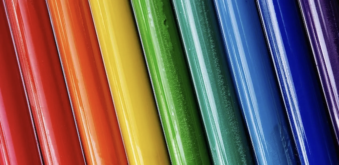


색상은 UI 내에서 사용자의 주의를 끌기 위한 가장 강력한 도구 중 하나입니다. 생동감 넘치는 색조는 자연스럽게 인간의 시각을 인터페이스 요소로 이끕니다. 색상은 또한 인터페이스 내에서 무게와 크기에 대한 사용자 인식에 영향을 미칠 수 있습니다. 보다 따뜻한 색조일수록 더 무거워 보이고 더 중요하게 느껴집니다.

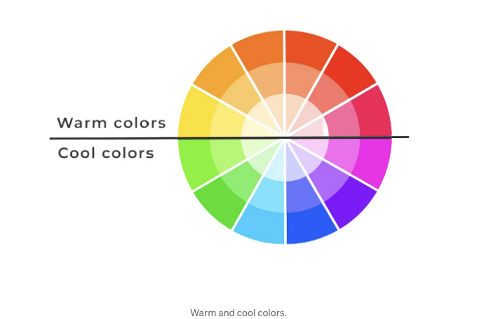

<!-- ui-log 수평형 -->
<ins class="adsbygoogle"
  style="display:block"
  data-ad-client="ca-pub-4877378276818686"
  data-ad-slot="9743150776"
  data-ad-format="auto"
  data-full-width-responsive="true"></ins>
<component is="script">
(adsbygoogle = window.adsbygoogle || []).push({});
</component>

```markdown


사용자는 제품에 대해 무의식적 판단을 90초 내에 내리며, 그 평가의 90%가 색상만을 기반으로 합니다.

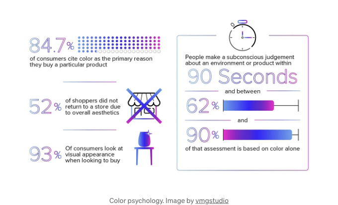


```

<!-- ui-log 수평형 -->
<ins class="adsbygoogle"
  style="display:block"
  data-ad-client="ca-pub-4877378276818686"
  data-ad-slot="9743150776"
  data-ad-format="auto"
  data-full-width-responsive="true"></ins>
<component is="script">
(adsbygoogle = window.adsbygoogle || []).push({});
</component>

대략 남성 중 8%와 여성 중 0.5%가 색각 이상자입니다 (~ 남성 12명 중 1명, 여성 200명 중 1명), 따라서 적절한 색 대비는 매우 중요한 고려 사항입니다.

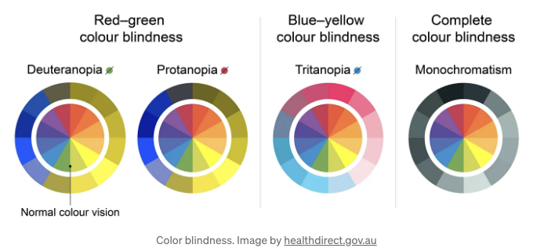


빨강과 주황색과 같은 따뜻한 색상은 서늘한 색조와 비교해 외부 시야에서 사용자에게 더 쉽게 인지됩니다.

<!-- ui-log 수평형 -->
<ins class="adsbygoogle"
  style="display:block"
  data-ad-client="ca-pub-4877378276818686"
  data-ad-slot="9743150776"
  data-ad-format="auto"
  data-full-width-responsive="true"></ins>
<component is="script">
(adsbygoogle = window.adsbygoogle || []).push({});
</component>

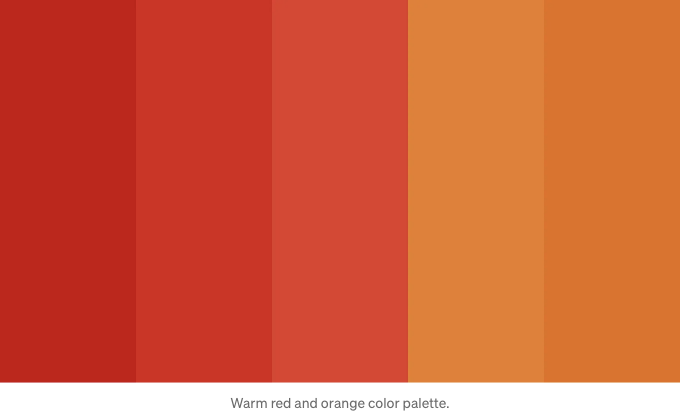


파란색은 웹 인터페이스와 소프트웨어에서 문화, 성별 및 연령 그룹을 가리지 않고 가장 선호되는 색 중 하나입니다. 보통 사용자들은 파란색 기반의 색 구성을 가진 객체 및 웹사이트를 더 믿을 만하고 안전하게 여기는 경향이 있습니다.

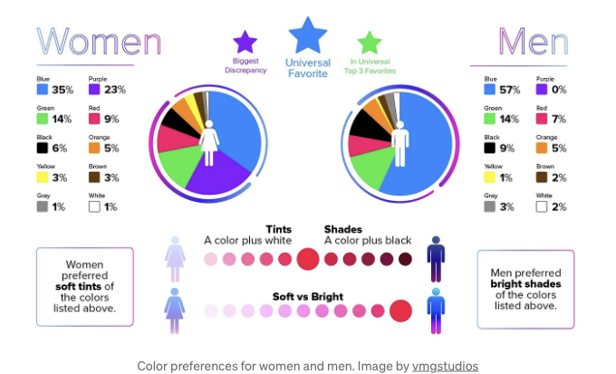

<!-- ui-log 수평형 -->
<ins class="adsbygoogle"
  style="display:block"
  data-ad-client="ca-pub-4877378276818686"
  data-ad-slot="9743150776"
  data-ad-format="auto"
  data-full-width-responsive="true"></ins>
<component is="script">
(adsbygoogle = window.adsbygoogle || []).push({});
</component>

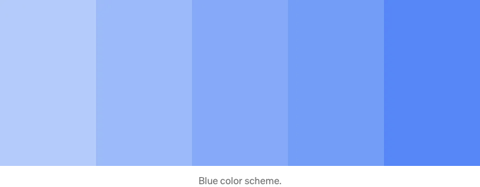


색상은 사용자가 정보를 빠르게 이해하는 능력에 영향을 미칠 수 있으며, 따뜻한 색상은 쓰여진 내용을 더 잘 이해하도록 돕습니다.

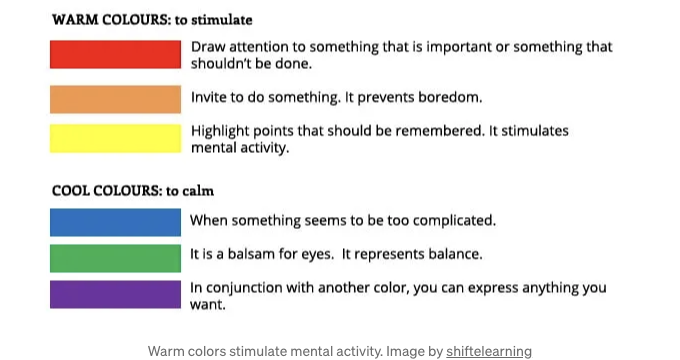

<!-- ui-log 수평형 -->
<ins class="adsbygoogle"
  style="display:block"
  data-ad-client="ca-pub-4877378276818686"
  data-ad-slot="9743150776"
  data-ad-format="auto"
  data-full-width-responsive="true"></ins>
<component is="script">
(adsbygoogle = window.adsbygoogle || []).push({});
</component>


화려한 강조색은 어두운 색상보다 사용자가 인터페이스 내에서 원하는 작업으로 더 효과적으로 안내되는 데 도움을 줍니다. 빨간색이나 주황색과 같이 채도가 높은 화려한 색상은 사용자에게 긴급함을 느끼게 하여 빠른 행동이나 구매를 유도할 수 있습니다.

채도가 줄어든 어두운 색상은 사용자에게 덜 자극을 줌으로써 독서나 집중 작업에 적합한 조용한 시청 경험을 촉진합니다.

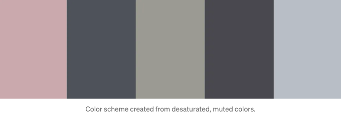

<!-- ui-log 수평형 -->
<ins class="adsbygoogle"
  style="display:block"
  data-ad-client="ca-pub-4877378276818686"
  data-ad-slot="9743150776"
  data-ad-format="auto"
  data-full-width-responsive="true"></ins>
<component is="script">
(adsbygoogle = window.adsbygoogle || []).push({});
</component>

```markdown


사람들은 텍스트 내용을 읽기 전에 시각 자료를 처리하기 때문에 즉각적인 이해를 위해 전략적인 색상 선택이 중요합니다.

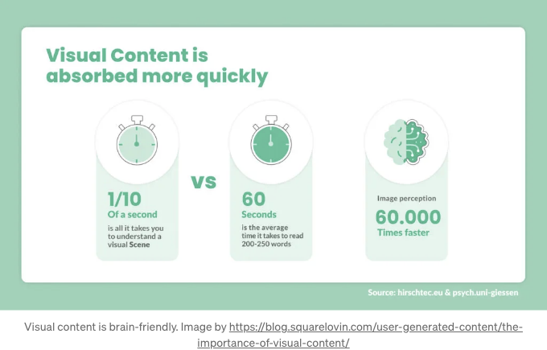


```

<!-- ui-log 수평형 -->
<ins class="adsbygoogle"
  style="display:block"
  data-ad-client="ca-pub-4877378276818686"
  data-ad-slot="9743150776"
  data-ad-format="auto"
  data-full-width-responsive="true"></ins>
<component is="script">
(adsbygoogle = window.adsbygoogle || []).push({});
</component>

색의 의미는 문화에 따라 다를 수 있기 때문에 전 세계 제품 디자인에서 지역화된 색상 연상을 고려해야 합니다.

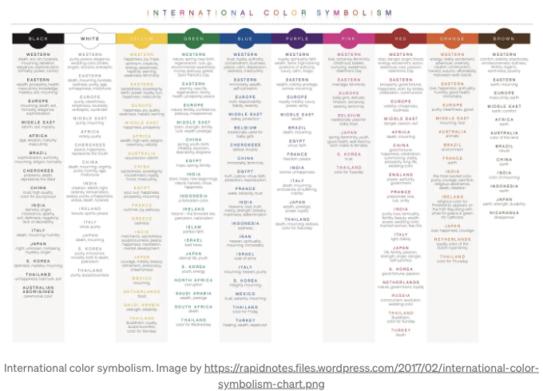


트렌드가 색상 선호도에 영향을 미치지만, 사용자들은 간단하고 일관된 UI 색상 구성에 가장 잘 반응합니다:

<!-- ui-log 수평형 -->
<ins class="adsbygoogle"
  style="display:block"
  data-ad-client="ca-pub-4877378276818686"
  data-ad-slot="9743150776"
  data-ad-format="auto"
  data-full-width-responsive="true"></ins>
<component is="script">
(adsbygoogle = window.adsbygoogle || []).push({});
</component>

- UI에 주목을 끌 수 있도록 너무 많은 선명하고 생생한 강조 색상이 경쟁하면 사용자에게 혼란, 스트레스, 그리고 이해력 감소를 초래할 수 있습니다.
- 일관되게 사용된 색상 힌트는 사용자의 기억을 기능적 요소에 대해서 반복적으로 응용 사용함으로써 향상시킬 수 있습니다.

# 제품 디자인을 숙달하고 싶으신가요?

Interaction Design Foundation을 사용해보세요. 이 사이트는 제품 디자인의 모든 영역을 다루는 온라인 디자인 코스를 제공합니다. 기초부터 고급 수준까지 다루는 코스도 있습니다.

본 문서에는 제휴 링크가 포함되어 있습니다.