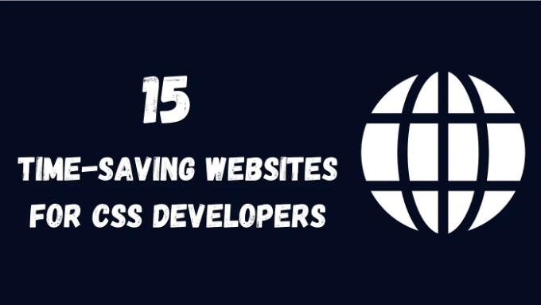

안녕하세요! 이 게시물에서는 CSS 개발에 많은 시간을 절약하고 경험을 향상시킬 수 있는 15가지 웹사이트를 소개해 드릴 거에요.

# CSS 버튼

CSS 버튼을 사용하면 버튼 디자인 프로세스를 간편화할 수 있어요. 이 웹사이트는 맞춤형 버튼 스타일을 제공하며 해당하는 CSS 코드도 함께 제공해서 작업을 빠르게 처리할 수 있게 도와줍니다.

<!-- ui-log 수평형 -->
<ins class="adsbygoogle"
  style="display:block"
  data-ad-client="ca-pub-4877378276818686"
  data-ad-slot="9743150776"
  data-ad-format="auto"
  data-full-width-responsive="true"></ins>
<component is="script">
(adsbygoogle = window.adsbygoogle || []).push({});
</component>

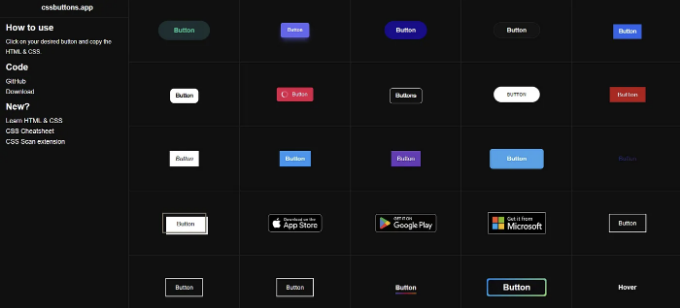

# Neumorphism.io

뉴모피즘 또는 Soft UI를 사용하여 뉴모피즘 요소를 생성하고 요소에 물리적 물체의 외관을 제공하는 CSS 코드를 얻을 수 있습니다.

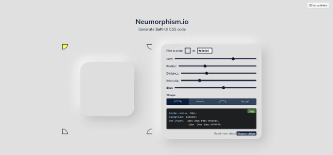

<!-- ui-log 수평형 -->
<ins class="adsbygoogle"
  style="display:block"
  data-ad-client="ca-pub-4877378276818686"
  data-ad-slot="9743150776"
  data-ad-format="auto"
  data-full-width-responsive="true"></ins>
<component is="script">
(adsbygoogle = window.adsbygoogle || []).push({});
</component>

# CSS 스트립 생성기

CSS 스트립 생성기를 사용하면 줄무늬 배경을 만들어 디자인을 더욱 풍부하게 만들 수 있어요.

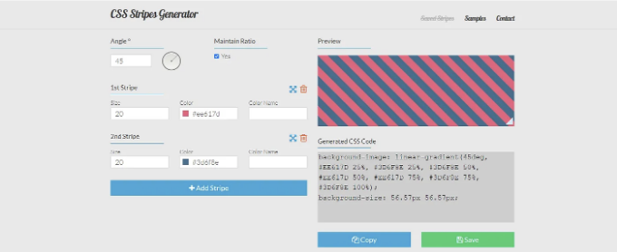

# 구글 폰트

<!-- ui-log 수평형 -->
<ins class="adsbygoogle"
  style="display:block"
  data-ad-client="ca-pub-4877378276818686"
  data-ad-slot="9743150776"
  data-ad-format="auto"
  data-full-width-responsive="true"></ins>
<component is="script">
(adsbygoogle = window.adsbygoogle || []).push({});
</component>

Google Fonts를 사용하면 다양하고 무료인 오픈 소스 글꼴 컬렉션을 활용하여 웹 사이트의 타이포그래피를 향상시킬 수 있습니다. Google Fonts를 사용하여 프로젝트에 글꼴을 쉽게 통합할 수 있습니다.

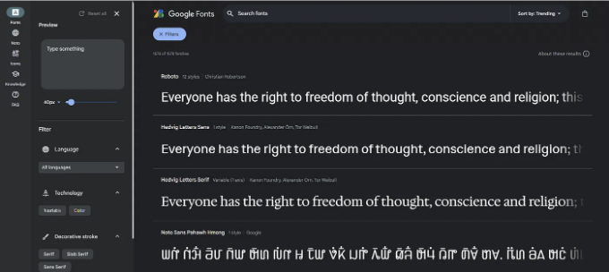

## 파도 모양 얻기

Get Waves는 웹 사이트에 동적인 요소를 추가하기 위해 화려한 SVG 파도 패턴을 생성하는 데 사용할 수 있습니다.

<!-- ui-log 수평형 -->
<ins class="adsbygoogle"
  style="display:block"
  data-ad-client="ca-pub-4877378276818686"
  data-ad-slot="9743150776"
  data-ad-format="auto"
  data-full-width-responsive="true"></ins>
<component is="script">
(adsbygoogle = window.adsbygoogle || []).push({});
</component>

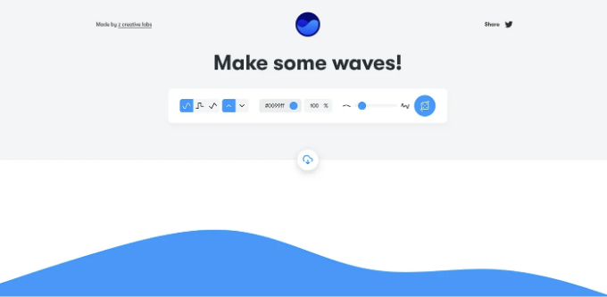

# Can I Use

CSS를 작성할 때 브라우저 호환성을 알아야 합니다. 최신 브라우저 지원 표를 얻으려면 Can I Use를 사용할 수 있습니다.

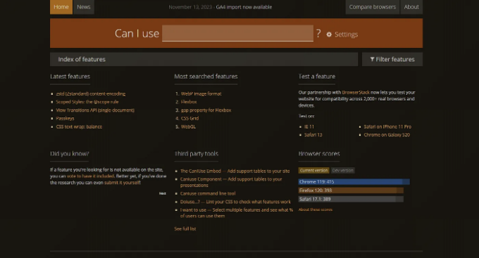

<!-- ui-log 수평형 -->
<ins class="adsbygoogle"
  style="display:block"
  data-ad-client="ca-pub-4877378276818686"
  data-ad-slot="9743150776"
  data-ad-format="auto"
  data-full-width-responsive="true"></ins>
<component is="script">
(adsbygoogle = window.adsbygoogle || []).push({});
</component>

# ColorSpace

당신의 웹사이트를 시각적으로 매력적으로 만들기 위해 올바른 색 팔레트를 선택하는 것이 중요합니다. ColorSpace를 이용하여 색상을 입력함으로써 프로젝트에 완벽한 색상을 선택할 수 있습니다.

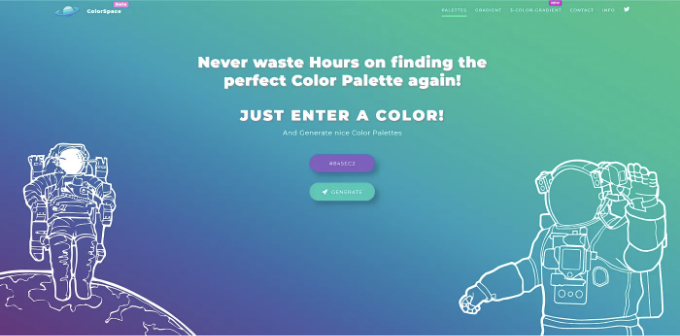

# CSS 그리드 생성기

<!-- ui-log 수평형 -->
<ins class="adsbygoogle"
  style="display:block"
  data-ad-client="ca-pub-4877378276818686"
  data-ad-slot="9743150776"
  data-ad-format="auto"
  data-full-width-responsive="true"></ins>
<component is="script">
(adsbygoogle = window.adsbygoogle || []).push({});
</component>

CSS Grid Generator는 복잡한 그리드 레이아웃을 만들고 해당하는 CSS 코드를 생성하는 데 좋은 도구입니다.

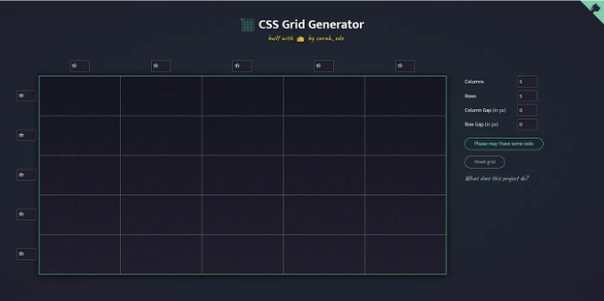

# BEM Cheat Sheet

BEM Cheat Sheet를 사용하면 BEM 네이밍 규칙에 대한 빠른 참고용으로 사용할 수 있습니다.

<!-- ui-log 수평형 -->
<ins class="adsbygoogle"
  style="display:block"
  data-ad-client="ca-pub-4877378276818686"
  data-ad-slot="9743150776"
  data-ad-format="auto"
  data-full-width-responsive="true"></ins>
<component is="script">
(adsbygoogle = window.adsbygoogle || []).push({});
</component>

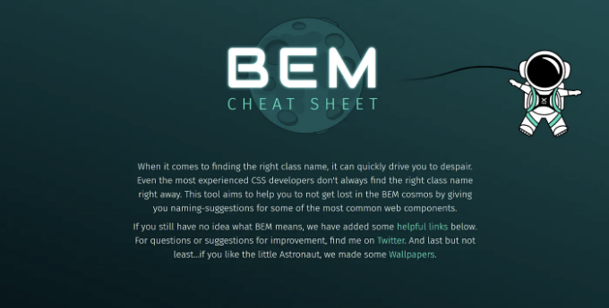

# Blobmaker

Blobmaker는 배경, 일러스트 또는 다른 그래픽 요소에 사용할 수 있는 사용자 정의 가능한 SVG 블랍을 생성하는 데 사용될 수 있습니다.

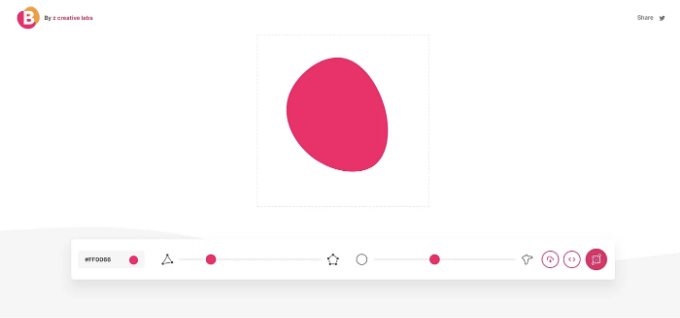

<!-- ui-log 수평형 -->
<ins class="adsbygoogle"
  style="display:block"
  data-ad-client="ca-pub-4877378276818686"
  data-ad-slot="9743150776"
  data-ad-format="auto"
  data-full-width-responsive="true"></ins>
<component is="script">
(adsbygoogle = window.adsbygoogle || []).push({});
</component>

# CSS 그라디언트 생성기

CSS 그라디언트 생성기를 사용하면 복잡한 CSS 그라디언트를 쉽게 생성할 수 있습니다. 또한 해당하는 CSS 코드도 제공합니다.

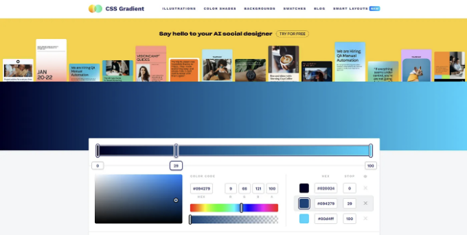

# Animate .css

<!-- ui-log 수평형 -->
<ins class="adsbygoogle"
  style="display:block"
  data-ad-client="ca-pub-4877378276818686"
  data-ad-slot="9743150776"
  data-ad-format="auto"
  data-full-width-responsive="true"></ins>
<component is="script">
(adsbygoogle = window.adsbygoogle || []).push({});
</component>

프로젝트에 쉽게 통합할 수 있는 다양한 애니메이션을 제공하는 Animate.css를 사용할 수 있습니다.

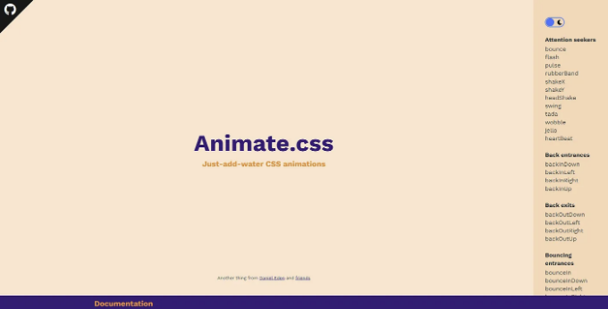

# Glassmorphism

Glassmorphism을 사용하여 유리처럼 보이는 요소를 생성하고 인기 있는 퍼스트 유리 효과를 구현하기 위해 투명도, 흐림 효과 및 색상을 사용자 정의할 수 있습니다.

<!-- ui-log 수평형 -->
<ins class="adsbygoogle"
  style="display:block"
  data-ad-client="ca-pub-4877378276818686"
  data-ad-slot="9743150776"
  data-ad-format="auto"
  data-full-width-responsive="true"></ins>
<component is="script">
(adsbygoogle = window.adsbygoogle || []).push({});
</component>

```markdown
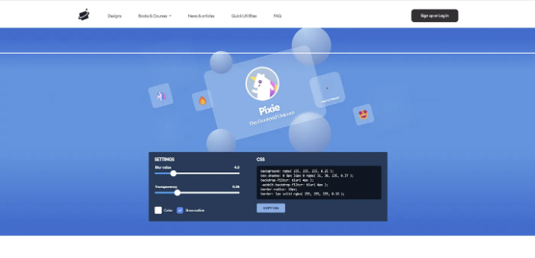

# Clippy — CSS Clip-Path Maker

Clippy — CSS Clip-Path Maker를 사용하면 쉽게 복잡한 모양을 만들 수 있어요.

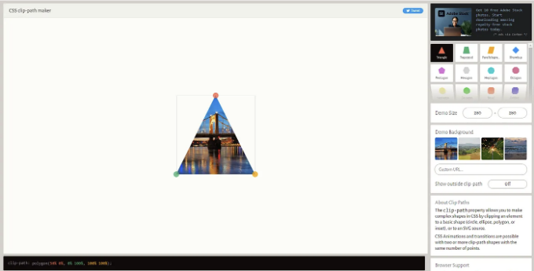
```

<!-- ui-log 수평형 -->
<ins class="adsbygoogle"
  style="display:block"
  data-ad-client="ca-pub-4877378276818686"
  data-ad-slot="9743150776"
  data-ad-format="auto"
  data-full-width-responsive="true"></ins>
<component is="script">
(adsbygoogle = window.adsbygoogle || []).push({});
</component>

# CSS Validator

CSS Validator는 CSS 코드가 웹의 규칙을 따르는지 확인하는 데 사용할 수 있어요. W3C의 CSS Validator는 스타일 시트를 살펴 코드 작성 방식에 오류가 있는지 확인하고 CSS의 표준을 준수하는지 확인해요.

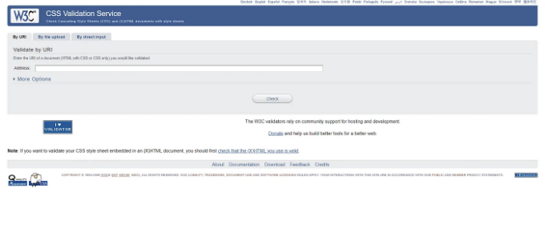

오늘은 여기까지에요.

<!-- ui-log 수평형 -->
<ins class="adsbygoogle"
  style="display:block"
  data-ad-client="ca-pub-4877378276818686"
  data-ad-slot="9743150776"
  data-ad-format="auto"
  data-full-width-responsive="true"></ins>
<component is="script">
(adsbygoogle = window.adsbygoogle || []).push({});
</component>

작업이 도움이 되었기를 바랍니다.

읽어 주셔서 감사합니다.

더 많은 유용한 콘텐츠를 보시려면 여기를 클릭하세요.

웹 개발 일일 팁을 받으려면 X(Twitter)에서 제 계정을 팔로우해 주세요.

<!-- ui-log 수평형 -->
<ins class="adsbygoogle"
  style="display:block"
  data-ad-client="ca-pub-4877378276818686"
  data-ad-slot="9743150776"
  data-ad-format="auto"
  data-full-width-responsive="true"></ins>
<component is="script">
(adsbygoogle = window.adsbygoogle || []).push({});
</component>

계속 코딩해요!!


# Stackademic

끝까지 읽어주셔서 감사합니다. 떠나시기 전에:

<!-- ui-log 수평형 -->
<ins class="adsbygoogle"
  style="display:block"
  data-ad-client="ca-pub-4877378276818686"
  data-ad-slot="9743150776"
  data-ad-format="auto"
  data-full-width-responsive="true"></ins>
<component is="script">
(adsbygoogle = window.adsbygoogle || []).push({});
</component>

- 작가를 박수 치시고 팔로우해주세요! 👏
- 트위터(X)나 링크드인, 유튜브에서 팔로우해주세요.
- 전세계에서 프로그래밍 교육을 무료로 보급하고 있는 Stackademic.com을 방문해보세요.