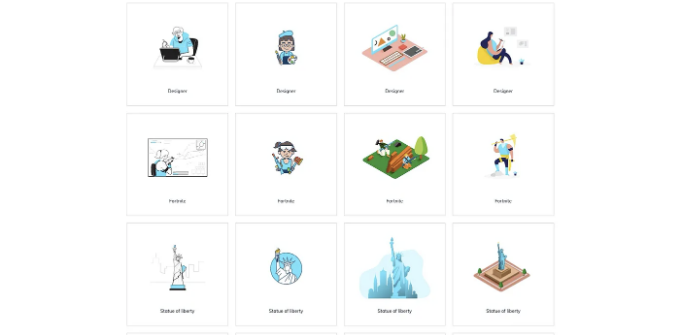

# 서문

당신과 함께 공유하고 싶은 몇 가지 유용한 웹 사이트가 있어요. 이 웹사이트들은 생산성을 향상시키는 데 도움이 되며, 몇 가지는 기사 작성을 돕고, 몇 가지는 디자인에 도움을 줄 수도 있어요. 지금 함께 살펴보세요.

# 1. 소스 코드용 아름다운 이미지를 만들고 공유하세요

<!-- ui-log 수평형 -->
<ins class="adsbygoogle"
  style="display:block"
  data-ad-client="ca-pub-4877378276818686"
  data-ad-slot="9743150776"
  data-ad-format="auto"
  data-full-width-responsive="true"></ins>
<component is="script">
(adsbygoogle = window.adsbygoogle || []).push({});
</component>

링크

Carbon을 사용하여 소스 코드의 아름다운 이미지를 만들고 공유하세요. 다양한 코드 스타일과 테마를 제공합니다.

# 2. JavaScript 정규 표현식 시각화기

<!-- ui-log 수평형 -->
<ins class="adsbygoogle"
  style="display:block"
  data-ad-client="ca-pub-4877378276818686"
  data-ad-slot="9743150776"
  data-ad-format="auto"
  data-full-width-responsive="true"></ins>
<component is="script">
(adsbygoogle = window.adsbygoogle || []).push({});
</component>

링크

정규 표현식을 배우고 싶지 않은 사람이신가요? 복잡해 보여서 그럴 수 있습니다. 걱정 마세요, 저도 예전에는 같았지만 더는 그렇지 않아요. 시각화 도구를 사용하면 정규 표현식을 이해하기 쉬워집니다.

### 3. 무작위 이미지

<!-- ui-log 수평형 -->
<ins class="adsbygoogle"
  style="display:block"
  data-ad-client="ca-pub-4877378276818686"
  data-ad-slot="9743150776"
  data-ad-format="auto"
  data-full-width-responsive="true"></ins>
<component is="script">
(adsbygoogle = window.adsbygoogle || []).push({});
</component>

링크

인터넷에서 자유롭게 사용할 수 있는 이미지의 원천입니다. 여기에는 전 세계의 크리에이터가 참여하고 있습니다.

# 4. 스마트 WebP, PNG 및 JPEG 압축

<!-- ui-log 수평형 -->
<ins class="adsbygoogle"
  style="display:block"
  data-ad-client="ca-pub-4877378276818686"
  data-ad-slot="9743150776"
  data-ad-format="auto"
  data-full-width-responsive="true"></ins>
<component is="script">
(adsbygoogle = window.adsbygoogle || []).push({});
</component>

링크

이미지를 자주 압축해야 할 때가 있습니다. tinypng는 무료로 사용할 수 있으며 압축된 이미지는 고화질입니다.

# 5. CodePen

<!-- ui-log 수평형 -->
<ins class="adsbygoogle"
  style="display:block"
  data-ad-client="ca-pub-4877378276818686"
  data-ad-slot="9743150776"
  data-ad-format="auto"
  data-full-width-responsive="true"></ins>
<component is="script">
(adsbygoogle = window.adsbygoogle || []).push({});
</component>

링크

CodePen을 사용하면 매우 편리하게 미디엄에 데모 코드를 삽입할 수 있습니다. 이 예시처럼요.

# 6. 오픈 소스 아이콘

링크

<!-- ui-log 수평형 -->
<ins class="adsbygoogle"
  style="display:block"
  data-ad-client="ca-pub-4877378276818686"
  data-ad-slot="9743150776"
  data-ad-format="auto"
  data-full-width-responsive="true"></ins>
<component is="script">
(adsbygoogle = window.adsbygoogle || []).push({});
</component>

아이오닉에서는 웹, iOS, 안드로이드 및 데스크톱 앱에 사용할 수 있는 프리미엄 디자인 아이콘을 포함한 필요한 아이콘을 찾을 수 있어요. SVG 및 웹 폰트를 지원합니다. 완전히 오픈 소스인 아이오닉.

# 7. 실용적인 팔레트

링크

<!-- ui-log 수평형 -->
<ins class="adsbygoogle"
  style="display:block"
  data-ad-client="ca-pub-4877378276818686"
  data-ad-slot="9743150776"
  data-ad-format="auto"
  data-full-width-responsive="true"></ins>
<component is="script">
(adsbygoogle = window.adsbygoogle || []).push({});
</component>

당신이 디자인할 때 적절한 색상을 찾지 못했나요? Color Hunt가 도와줄 거에요.

# 8. Can I use?

링크

<!-- ui-log 수평형 -->
<ins class="adsbygoogle"
  style="display:block"
  data-ad-client="ca-pub-4877378276818686"
  data-ad-slot="9743150776"
  data-ad-format="auto"
  data-full-width-responsive="true"></ins>
<component is="script">
(adsbygoogle = window.adsbygoogle || []).push({});
</component>

프론트엔드 엔지니어들은 종종 브라우저 호환성을 확인해야 합니다. Can I use 웹사이트는 다양한 인기 브라우저에서 CSS와 JavaScript의 기능 및 호환성을 조회할 수 있는 사이트입니다.

# 9. GitHub 데스크톱

링크

<!-- ui-log 수평형 -->
<ins class="adsbygoogle"
  style="display:block"
  data-ad-client="ca-pub-4877378276818686"
  data-ad-slot="9743150776"
  data-ad-format="auto"
  data-full-width-responsive="true"></ins>
<component is="script">
(adsbygoogle = window.adsbygoogle || []).push({});
</component>

만일 git에 익숙하지 않다면, 아주 좋아하실 거예요.

(컴퓨터) Git과 싸우느라 시간을 낭비하는 대신 중요한 것에 집중하세요. Git에 익숙하든, 경험이 많든 상관없이 GitHub Desktop은 개발 워크플로우를 간편하게 만들어줍니다.

# 10. Animate.css

<!-- ui-log 수평형 -->
<ins class="adsbygoogle"
  style="display:block"
  data-ad-client="ca-pub-4877378276818686"
  data-ad-slot="9743150776"
  data-ad-format="auto"
  data-full-width-responsive="true"></ins>
<component is="script">
(adsbygoogle = window.adsbygoogle || []).push({});
</component>

링크

프론트엔드 개발자로서 자주 애니메이션을 작성해야 하나요? 아! 나는 애니메이션에 대한 장점이 없어, 다행히도 Animate.css가 대부분의 문제를 해결하는 데 도움이 됩니다.

여기서 많은 흥미로운 유용한 애니메이션 클립을 찾을 수 있습니다.

<!-- ui-log 수평형 -->
<ins class="adsbygoogle"
  style="display:block"
  data-ad-client="ca-pub-4877378276818686"
  data-ad-slot="9743150776"
  data-ad-format="auto"
  data-full-width-responsive="true"></ins>
<component is="script">
(adsbygoogle = window.adsbygoogle || []).push({});
</component>

# 11. boardmix.com

이 사이트가 정말 좋아요! 여기서 마인드 맵, 플로우차트 및 모든 그래픽 관련 작업을 할 수 있어요.

# 12. Web Gradients

<!-- ui-log 수평형 -->
<ins class="adsbygoogle"
  style="display:block"
  data-ad-client="ca-pub-4877378276818686"
  data-ad-slot="9743150776"
  data-ad-format="auto"
  data-full-width-responsive="true"></ins>
<component is="script">
(adsbygoogle = window.adsbygoogle || []).push({});
</component>

링크

당신의 웹사이트에 멋진 그래디언트를 추가할 수 있는 곳입니다.

## 13. 3D 아이콘

<!-- ui-log 수평형 -->
<ins class="adsbygoogle"
  style="display:block"
  data-ad-client="ca-pub-4877378276818686"
  data-ad-slot="9743150776"
  data-ad-format="auto"
  data-full-width-responsive="true"></ins>
<component is="script">
(adsbygoogle = window.adsbygoogle || []).push({});
</component>

링크

(3D 아이콘에서) 아름답게 제작된 오픈 소스 3D 아이콘들
상업 및 개인용으로 100% 무료로 CC0 하에 사용 가능

## 14. 표준 이력서

<!-- ui-log 수평형 -->
<ins class="adsbygoogle"
  style="display:block"
  data-ad-client="ca-pub-4877378276818686"
  data-ad-slot="9743150776"
  data-ad-format="auto"
  data-full-width-responsive="true"></ins>
<component is="script">
(adsbygoogle = window.adsbygoogle || []).push({});
</component>

링크

일자리를 바꾸려고 할 때마다, 이 웹 사이트를 이용해서 아름다우며 반응형 이력서를 만들어냅니다.

## 15. codetogo

<!-- ui-log 수평형 -->
<ins class="adsbygoogle"
  style="display:block"
  data-ad-client="ca-pub-4877378276818686"
  data-ad-slot="9743150776"
  data-ad-format="auto"
  data-full-width-responsive="true"></ins>
<component is="script">
(adsbygoogle = window.adsbygoogle || []).push({});
</component>

링크

Codetogo는 웹사이트 개발 중 일어날 수 있는 일반적인 문제들을 빠르고 효율적으로 찾아주는데 도움이 됩니다. 예를 들어: "JavaScript에서 배열 항목의 합을 구하는 방법은?"

# 16. 개발자를 위한 최고의 코드 생성기

<!-- ui-log 수평형 -->
<ins class="adsbygoogle"
  style="display:block"
  data-ad-client="ca-pub-4877378276818686"
  data-ad-slot="9743150776"
  data-ad-format="auto"
  data-full-width-responsive="true"></ins>
<component is="script">
(adsbygoogle = window.adsbygoogle || []).push({});
</component>

링크

우리는 HTML, CSS 등을 생성하는 데 사용할 수 있어요.

## 17. 사용되지 않은 CSS

<!-- ui-log 수평형 -->
<ins class="adsbygoogle"
  style="display:block"
  data-ad-client="ca-pub-4877378276818686"
  data-ad-slot="9743150776"
  data-ad-format="auto"
  data-full-width-responsive="true"></ins>
<component is="script">
(adsbygoogle = window.adsbygoogle || []).push({});
</component>

링크

사용되지 않은 CSS를 제거하여 쉽게 사용되지 않는 CSS 규칙을 정리하세요.

# 18. 멋진 배경

<!-- ui-log 수평형 -->
<ins class="adsbygoogle"
  style="display:block"
  data-ad-client="ca-pub-4877378276818686"
  data-ad-slot="9743150776"
  data-ad-format="auto"
  data-full-width-responsive="true"></ins>
<component is="script">
(adsbygoogle = window.adsbygoogle || []).push({});
</component>

링크

아름다운 배경 사진을 만드는 데 도움을 줄 수 있어요.

# 19. DevDocs

<!-- ui-log 수평형 -->
<ins class="adsbygoogle"
  style="display:block"
  data-ad-client="ca-pub-4877378276818686"
  data-ad-slot="9743150776"
  data-ad-format="auto"
  data-full-width-responsive="true"></ins>
<component is="script">
(adsbygoogle = window.adsbygoogle || []).push({});
</component>

링크

이 웹사이트에는 다양한 프로젝트에 대한 문서가 있으며 오프라인 사용도 지원합니다.

### 20. cdnjs

<!-- ui-log 수평형 -->
<ins class="adsbygoogle"
  style="display:block"
  data-ad-client="ca-pub-4877378276818686"
  data-ad-slot="9743150776"
  data-ad-format="auto"
  data-full-width-responsive="true"></ins>
<component is="script">
(adsbygoogle = window.adsbygoogle || []).push({});
</component>

링크

때로는 프로그래밍 연습을 위해 온라인 자료가 필요합니다. cdnjs는 거의 모든 오픈 소스 라이브러리를 찾아주는 데 도움이 될 수 있습니다.

# 21. 이미지 배경 제거

<!-- ui-log 수평형 -->
<ins class="adsbygoogle"
  style="display:block"
  data-ad-client="ca-pub-4877378276818686"
  data-ad-slot="9743150776"
  data-ad-format="auto"
  data-full-width-responsive="true"></ins>
<component is="script">
(adsbygoogle = window.adsbygoogle || []).push({});
</component>

링크

이 웹사이트를 통해 이미지 배경을 100% 자동으로 무료로 삭제할 수 있어요.

# 22. Readme

<!-- ui-log 수평형 -->
<ins class="adsbygoogle"
  style="display:block"
  data-ad-client="ca-pub-4877378276818686"
  data-ad-slot="9743150776"
  data-ad-format="auto"
  data-full-width-responsive="true"></ins>
<component is="script">
(adsbygoogle = window.adsbygoogle || []).push({});
</component>

링크

README 파일을 만드는 가장 쉬운 방법은 이 간단한 편집기를 사용하는 것입니다. 프로젝트 readme에 필요한 모든 섹션을 빠르게 추가하고 사용자 정의할 수 있습니다.

## 23. 웹 사이트가 얼마나 빠르게 로드되나요?

<!-- ui-log 수평형 -->
<ins class="adsbygoogle"
  style="display:block"
  data-ad-client="ca-pub-4877378276818686"
  data-ad-slot="9743150776"
  data-ad-format="auto"
  data-full-width-responsive="true"></ins>
<component is="script">
(adsbygoogle = window.adsbygoogle || []).push({});
</component>

링크

당신의 웹사이트가 어떻게 성능을 발휘하는지 확인하고, 왜 느린지 찾아내며, 최적화 기회를 발견하세요.

# 24. 온라인에서 사진 편집

<!-- ui-log 수평형 -->
<ins class="adsbygoogle"
  style="display:block"
  data-ad-client="ca-pub-4877378276818686"
  data-ad-slot="9743150776"
  data-ad-format="auto"
  data-full-width-responsive="true"></ins>
<component is="script">
(adsbygoogle = window.adsbygoogle || []).push({});
</component>

링크

기사를 작성할 때 사진이 필요하신가요? 이미지는 이 웹 사이트를 통해 온라인으로 디자인할 수 있어요.

# 25. 무료 일러스트 이미지

<!-- ui-log 수평형 -->
<ins class="adsbygoogle"
  style="display:block"
  data-ad-client="ca-pub-4877378276818686"
  data-ad-slot="9743150776"
  data-ad-format="auto"
  data-full-width-responsive="true"></ins>
<component is="script">
(adsbygoogle = window.adsbygoogle || []).push({});
</component>

링크

디자인을 더욱 빛내줄 2,500개 이상의 로열티 프리 일러스트레이션.

# 마지막으로

<!-- ui-log 수평형 -->
<ins class="adsbygoogle"
  style="display:block"
  data-ad-client="ca-pub-4877378276818686"
  data-ad-slot="9743150776"
  data-ad-format="auto"
  data-full-width-responsive="true"></ins>
<component is="script">
(adsbygoogle = window.adsbygoogle || []).push({});
</component>

감사합니다. 제 팔로우를 기다리고 더 많은 고품질 기사를 읽는 것을 기대하고 있어요.