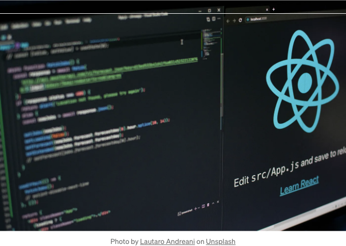

친구들아, 만약 이 4가지 React 훅을 더 일찍 배웠더라면, 아마 더 아름다운 코드를 쓸 수 있었을지도 몰라요.

이 훅들은 제 작업 효율을 크게 향상시켜주었고, 코드의 확장성과 가독성을 향상시켜주었어요. 여러분도 이 훅들을 배우고 싶을 거예요?

# 1. useMount

<!-- ui-log 수평형 -->
<ins class="adsbygoogle"
  style="display:block"
  data-ad-client="ca-pub-4877378276818686"
  data-ad-slot="9743150776"
  data-ad-format="auto"
  data-full-width-responsive="true"></ins>
<component is="script">
(adsbygoogle = window.adsbygoogle || []).push({});
</component>

과거에는 이 스타일의 코드를 자주 작성했었고, 컴포넌트가 처음 렌더링될 때 요청을 보내거나 다른 로직을 수행해야 했던 것 같아요.

정말 간단하죠, 그렇지 않나요? 하지만 하나 큰 단점이 있는데, 심지어 빈 배열을 전달하더라도 의미가 충분히 명확하지 않습니다.

그래서 컴포넌트가 처음 렌더링될 때에만 콜백 함수를 실행하도록 하는 useMount라는 훅을 사용자 정의할 수 있습니다.

소스 코드

<!-- ui-log 수평형 -->
<ins class="adsbygoogle"
  style="display:block"
  data-ad-client="ca-pub-4877378276818686"
  data-ad-slot="9743150776"
  data-ad-format="auto"
  data-full-width-responsive="true"></ins>
<component is="script">
(adsbygoogle = window.adsbygoogle || []).push({});
</component>

예제

컴포넌트가 다시 렌더링될 때 useMount가 다시 실행되지 않아 좋네요!


## 2. useUnmount

<!-- ui-log 수평형 -->
<ins class="adsbygoogle"
  style="display:block"
  data-ad-client="ca-pub-4877378276818686"
  data-ad-slot="9743150776"
  data-ad-format="auto"
  data-full-width-responsive="true"></ins>
<component is="script">
(adsbygoogle = window.adsbygoogle || []).push({});
</component>

컴포넌트가 언마운트되어 로직을 트리거하려고 할 때 타이머를 지우는 것과 같은 코드를 작성해야 합니다:

당연히 컴포넌트가 언로드될 때 실행되는지 직접적으로 확인할 수 없습니다.

그래서 컴포넌트가 언마운트 될 때 콜백 함수가 실행되도록 표시할 수 있는 useUnmount 훅을 디자인해야 합니다.

소스 코드

<!-- ui-log 수평형 -->
<ins class="adsbygoogle"
  style="display:block"
  data-ad-client="ca-pub-4877378276818686"
  data-ad-slot="9743150776"
  data-ad-format="auto"
  data-full-width-responsive="true"></ins>
<component is="script">
(adsbygoogle = window.adsbygoogle || []).push({});
</component>

정말 이렇게 간단한 거예요? 사용 방법을 살펴보죠.

예시

"Child" 구성 요소가 파괴될 때, "useUnmount" 콜백 함수가 실제로 실행되지만, count 값이 초기 값 0이 아니라 10이어야 하는데 왜 그럴까요?

이것은 useEffect 내에서의 클로저 메커니즘 때문에 발생합니다. 컴포넌트가 처음 렌더링될 때 언로드될 때 전달된 함수의 경우, 실시간 상태를 얻기 위해 useRef를 사용해야 합니다.

<!-- ui-log 수평형 -->
<ins class="adsbygoogle"
  style="display:block"
  data-ad-client="ca-pub-4877378276818686"
  data-ad-slot="9743150776"
  data-ad-format="auto"
  data-full-width-responsive="true"></ins>
<component is="script">
(adsbygoogle = window.adsbygoogle || []).push({});
</component>


좋아요, 컴포넌트가 소멸될 때 count의 값을 정확하게 얻을 수도 있어요.

# 3. useUpdateEffect

때로는 의존성이 변경된 후에만 논리 코드를 실행하고 싶을 때가 있습니다. 우리가 이렇게 작성하면 목표를 달성할 수 있을까요?

<!-- ui-log 수평형 -->
<ins class="adsbygoogle"
  style="display:block"
  data-ad-client="ca-pub-4877378276818686"
  data-ad-slot="9743150776"
  data-ad-format="auto"
  data-full-width-responsive="true"></ins>
<component is="script">
(adsbygoogle = window.adsbygoogle || []).push({});
</component>

```markdown


죄송하지만 'count'가 구성 요소가 마운트되자마자 '0'으로 출력됩니다. 'count'가 변경된 후에 콜백 함수를 어떻게 실행할 수 있을까요?


좋아요, 이게 정말 유용한 훅입니다.
```

<!-- ui-log 수평형 -->
<ins class="adsbygoogle"
  style="display:block"
  data-ad-client="ca-pub-4877378276818686"
  data-ad-slot="9743150776"
  data-ad-format="auto"
  data-full-width-responsive="true"></ins>
<component is="script">
(adsbygoogle = window.adsbygoogle || []).push({});
</component>

# 4. useSetState

클래스 컴포넌트를 작성할 때, 컴포넌트의 데이터를 조작하기 위해 this.setState를 사용하며, setState는 객체 유형의 데이터를 조작할 때 더 편리합니다.

setPerson 작업을 간단하게 만들기 위해 useSetState 훅을 구현할 수 있을까요? 매우 쉽습니다. useState 주변에 간단한 래퍼를 만들어주세요.

예시

<!-- ui-log 수평형 -->
<ins class="adsbygoogle"
  style="display:block"
  data-ad-client="ca-pub-4877378276818686"
  data-ad-slot="9743150776"
  data-ad-format="auto"
  data-full-width-responsive="true"></ins>
<component is="script">
(adsbygoogle = window.adsbygoogle || []).push({});
</component>


# 마지막으로

읽어 주셔서 감사합니다. 제 팔로우와 높은 품질의 더 많은 글을 읽는 것을 기대합니다.