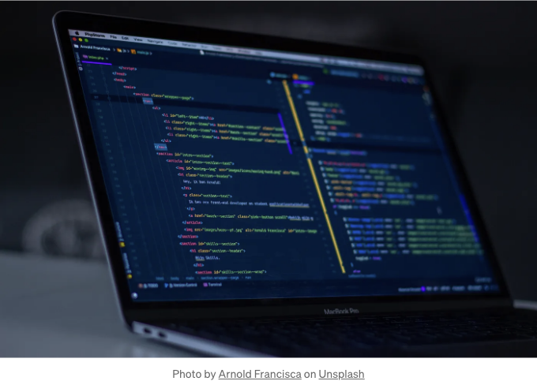

useState은 React에서 널리 사용되는 훅입니다. React에서 개발하는 거의 모든 컴포넌트는 상태를 포함합니다. 이 포스트에서는 useState 훅의 네 가지 다른 사용 사례를 보여드릴 거에요.

React와 상태에 대한 기본 지식이 있다고 가정합니다. 그렇지 않은 경우 시작하려면 문서를 방문해주세요.

# 상태 초기화하기

<!-- ui-log 수평형 -->
<ins class="adsbygoogle"
  style="display:block"
  data-ad-client="ca-pub-4877378276818686"
  data-ad-slot="9743150776"
  data-ad-format="auto"
  data-full-width-responsive="true"></ins>
<component is="script">
(adsbygoogle = window.adsbygoogle || []).push({});
</component>

앞서 말씀드린 대로, 상태를 초기화하는 방법에 대해 설명해 드리겠습니다. 먼저 useState를 import한 다음, 다음과 같은 방식으로 상태 변수를 선언하십시오.

```js
import { useState } from 'react'
const [name, setName] = useState('kunal')
```

setName은 상태인 name을 설정하는 데 사용되는 함수입니다. 기본값이 지정되어 있습니다.

상태를 직접 설정하지 말고 항상 함수를 사용해 주세요. 왜 그런지 알고 싶으시면 이 글을 읽어보세요.

<!-- ui-log 수평형 -->
<ins class="adsbygoogle"
  style="display:block"
  data-ad-client="ca-pub-4877378276818686"
  data-ad-slot="9743150776"
  data-ad-format="auto"
  data-full-width-responsive="true"></ins>
<component is="script">
(adsbygoogle = window.adsbygoogle || []).push({});
</component>

자, 사용 사례 몇 가지를 살펴봅시다.

## 1. 조건부 렌더링

어떤 애플리케이션이 사용자를 가지고 있고, 사용자가 관리자인지에 따라 무언가를 표시하고 싶다고 가정해 봅시다. 이런 경우, 조건부 렌더링을 사용할 수 있습니다.

이 예제에서는 모든 사용자가 볼 수 있는 레코드 세트가 있습니다. 그러나 관리자 사용자는 각 레코드를 편집할 수 있는 옵션이 있습니다. 먼저 사용자를 상태로 정의하세요.

<!-- ui-log 수평형 -->
<ins class="adsbygoogle"
  style="display:block"
  data-ad-client="ca-pub-4877378276818686"
  data-ad-slot="9743150776"
  data-ad-format="auto"
  data-full-width-responsive="true"></ins>
<component is="script">
(adsbygoogle = window.adsbygoogle || []).push({});
</component>

```js
const [user, setUser] = useState({
    name: 'kunal',
    isAdmin: false
})  
```

이제 레코드를 렌더링하겠습니다. tableData에 표시할 레코드가 있습니다.

```js
return (
  <div>
      | id | First Name | City | {user.isAdmin && 'Action' } |
      | --- | --- | --- | --- |
      {tableData.map(data => (
              | {data.id} | {data.first_name} | {data.city} | {user.isAdmin &&   <button> Edit </button> } |
      ))}
  </div>
)
```

여기서 일반 사용자는 처음 세 열만 볼 수 있습니다. 그러나 관리자 사용자는 편집 버튼을 포함한 4번째 열도 볼 수 있습니다.

<!-- ui-log 수평형 -->
<ins class="adsbygoogle"
  style="display:block"
  data-ad-client="ca-pub-4877378276818686"
  data-ad-slot="9743150776"
  data-ad-format="auto"
  data-full-width-responsive="true"></ins>
<component is="script">
(adsbygoogle = window.adsbygoogle || []).push({});
</component>

isAdmin 속성이 false인 경우에는 해당 열이 표시되지 않습니다.

또 다른 예를 살펴보겠습니다. 두 개의 테이블이 있고 한 번에 하나만 렌더링하려고 합니다.

어떤 테이블을 표시할지 결정하는 상태 toggleTable이 있습니다. 버튼 클릭으로 테이블 간에 전환할 수 있습니다.

```js
const [toggleTables, setToggleTables] = useState(false)
```

<!-- ui-log 수평형 -->
<ins class="adsbygoogle"
  style="display:block"
  data-ad-client="ca-pub-4877378276818686"
  data-ad-slot="9743150776"
  data-ad-format="auto"
  data-full-width-responsive="true"></ins>
<component is="script">
(adsbygoogle = window.adsbygoogle || []).push({});
</component>

두 개의 테이블은 다른 데이터를 보여주며 조건문을 사용하여 상태 값에 따라 렌더링할 수 있습니다.

```js
return (
    <div>
        <div>
            <button onClick={handleClick}>
                다른 테이블 보기
            </button>
        </div>
        <div>
            {
                toggleTables ?
                    | id  | 이름   | 성     | 도시   |
                    | ---- | ------ | ----- | ----- |
                    {TableData1.map(data => (
                        | {data.id} | {data.first_name} | {data.last_name} | {data.city} |
                    ))}
                :  
                    | id  | 이름   | 도시   | Bitcoin 주소 | 신용 카드 | 카드 종류 | 통화 |
                    | ---- | ------ | ----- | ------------ | --------- | -------- | ---- |
                    {TableData2.map(data => (
                        | {data.id} | {data.first_name} | {data.city} | {data.bitcoin_address} | {data.credit_card} | {data.card_type} | {data.currency} |
                    ))}
            } 
        </div>                 
    </div>
)
```

그리고 상태를 변경하는 handleClick 함수는 다음과 같습니다.

```js
const handleClick = () => {
    setToggleTables(!toggleTables);
}
```

<!-- ui-log 수평형 -->
<ins class="adsbygoogle"
  style="display:block"
  data-ad-client="ca-pub-4877378276818686"
  data-ad-slot="9743150776"
  data-ad-format="auto"
  data-full-width-responsive="true"></ins>
<component is="script">
(adsbygoogle = window.adsbygoogle || []).push({});
</component>

## 2. 카운터

상태는 카운터를 구현하는 데도 사용할 수 있어요. 이를 구현하려면 이전 상태를 추적해야 해요. 먼저, 초기값이 0인 상태로 count를 만들어요.

```js
const [count, setCount] = useState(0)
```

그런 다음, 동일한 작업을 렌더링하고 onClick 핸들러와 함께 증가 및 감소 버튼 두 개를 만들어주세요.

<!-- ui-log 수평형 -->
<ins class="adsbygoogle"
  style="display:block"
  data-ad-client="ca-pub-4877378276818686"
  data-ad-slot="9743150776"
  data-ad-format="auto"
  data-full-width-responsive="true"></ins>
<component is="script">
(adsbygoogle = window.adsbygoogle || []).push({});
</component>

```js
<h2> {count} </h2>
<div>
    <button onClick={() => { setCounter(-1) } > Decrement </button>
    <button onClick={() => { setCounter(1) }> Increment </button>
</div>
```

핸들러 함수를 구현해 보겠습니다.

```js
function setCounter(value) {
    setCount(count+value);
}
```

카운터를 증가 또는 감소시킬 양을 제어하는 입력 필드도 추가해 보겠습니다.```

<!-- ui-log 수평형 -->
<ins class="adsbygoogle"
  style="display:block"
  data-ad-client="ca-pub-4877378276818686"
  data-ad-slot="9743150776"
  data-ad-format="auto"
  data-full-width-responsive="true"></ins>
<component is="script">
(adsbygoogle = window.adsbygoogle || []).push({});
</component>

```js
<div>
    <form onSubmit={handleSubmit}>
        <label> 값을 입력하여 증가시킬 값 입력 </label>
        <input type='number' />
        <button type='submit' > 제출하기 </button>
    </form>
</div>
```

핸들러 함수를 구현하세요. 사용자가 제공한 값에 따라 상태 값을 설정하는 동일한 setCounter 함수를 사용하세요.

```js
const handleSubmit = (event) => {
    event.preventDefault();
    setCounter(parseInt(event.target[0].value));
}
```

양식을 제출할 때 event.preventDefault()를 사용하세요. 자세한 내용은 [여기](링크)에서 확인하세요. 
```

<!-- ui-log 수평형 -->
<ins class="adsbygoogle"
  style="display:block"
  data-ad-client="ca-pub-4877378276818686"
  data-ad-slot="9743150776"
  data-ad-format="auto"
  data-full-width-responsive="true"></ins>
<component is="script">
(adsbygoogle = window.adsbygoogle || []).push({});
</component>

## 3. Form Handling

폼 처리는 useState 훅의 매우 중요한 사용 사례입니다. 이것은 여러분이 어디서나 만날 수 있는 기능입니다.

다음 필드를 가지는 기본 폼을 만들어 보겠습니다. 각 필드를 필수 필드로 만들어 주세요.

```js
 <form onSubmit={handleSubmit}>
        <input placeholder='이름을 입력하세요' 
               onChange={(e) => {setName(e.target.value)} 
               value={name} required/>        
        <br/>
        <input type='email' placeholder='이메일을 입력하세요' value={email}
                 onChange={(e) => {setEmail(e.target.value)} required/>
        <br/>
        <input type='password' placeholder='비밀번호를 입력하세요' value={password}
                 onChange={(e) => {setPassword(e.target.value)} required/>
        <br/>
        <label>성별</label>
        <select onChange={(e) => {setGender(e.target.value)} value={gender}
                required>
            <option>남성</option>
            <option>여성</option>
        </select>
        <br/>

        <button type='submit'>제출</button>

</form>
```

<!-- ui-log 수평형 -->
<ins class="adsbygoogle"
  style="display:block"
  data-ad-client="ca-pub-4877378276818686"
  data-ad-slot="9743150776"
  data-ad-format="auto"
  data-full-width-responsive="true"></ins>
<component is="script">
(adsbygoogle = window.adsbygoogle || []).push({});
</component>

동일한 상태 변수를 정의하세요.

```js
const [name, setName] = useState('')
const [email, setEmail] = useState('')
const [password, setPassword] = useState('')
const [gender, setGender] = useState('')
```

이 상태 변수들은 폼 필드의 값들을 담고 있습니다. 사용자 입력과 함께 이를 업데이트하고 싶습니다. 이는 입력 요소의 onChange 속성을 사용하여 수행됩니다.

실시간 응용 프로그램에서는 폼 제출이 일정 시간이 걸릴 수 있습니다. 사용자에게 폼이 제출되고 있다는 것을 알리는 것이 중요합니다. 또 다른 상태 변수를 사용하여 그것을 수행할 수 있습니다.

<!-- ui-log 수평형 -->
<ins class="adsbygoogle"
  style="display:block"
  data-ad-client="ca-pub-4877378276818686"
  data-ad-slot="9743150776"
  data-ad-format="auto"
  data-full-width-responsive="true"></ins>
<component is="script">
(adsbygoogle = window.adsbygoogle || []).push({});
</component>

```js
const [isSubmitting, setIsSubmitting] = useState(false)
```

제출 버튼을 클릭하면 즉시 isSubmitting을 true로 설정한 다음 제출 후에 false로 설정하십시오. 그 사이에 사용자에게 메시지를 표시하세요. 여기에서는 양식 제출을 지연시키는 것이 없기 때문에 메시지를 볼 수 없습니다.

이 동작을 모의로 실행해 봅시다.

```js
const handleSubmit = (event) => {
    event.preventDefault();
    
    setIsSubmitting(true)
    setTimeout(() => {
        setIsSubmitting(false);
        alert("양식이 제출되었습니다!")
    }, 3000);
}
```

<!-- ui-log 수평형 -->
<ins class="adsbygoogle"
  style="display:block"
  data-ad-client="ca-pub-4877378276818686"
  data-ad-slot="9743150776"
  data-ad-format="auto"
  data-full-width-responsive="true"></ins>
<component is="script">
(adsbygoogle = window.adsbygoogle || []).push({});
</component>

```js
// 폼 제출 전에 몇 초를 기다리기 위해 setTimeout을 사용하세요. 제출 버튼 바로 아래에 메시지를 표시하세요.

setTimeout(() => {
    {isSubmitting && '제출 중...'}
}, 3000); 
```

## 4. 할 일 목록

useState 훅의 가장 간단한 사용 사례 중 하나는 간단한 할 일 목록입니다. 추가, 업데이트 및 삭제 기능을 구현하는 방법을 보여드리겠습니다.

<!-- ui-log 수평형 -->
<ins class="adsbygoogle"
  style="display:block"
  data-ad-client="ca-pub-4877378276818686"
  data-ad-slot="9743150776"
  data-ad-format="auto"
  data-full-width-responsive="true"></ins>
<component is="script">
(adsbygoogle = window.adsbygoogle || []).push({});
</component>

먼저 작업을 추가할 수 있는 입력 필드와 버튼이 필요해요. 사용자의 입력 내용은 상태로 유지해줘요.

```js
const [taskInput, setTaskInput] = useState('')
```

```js
<input type='text' placeholder="할 일을 입력해주세요" value={taskInput}
                    onChange={(e) => { setTaskInput(e.target.value) }/>
<button onClick={handleSubmit} >항목 추가</button>
```

또한, 전체 할 일 목록을 유지할 상태가 필요해요.

<!-- ui-log 수평형 -->
<ins class="adsbygoogle"
  style="display:block"
  data-ad-client="ca-pub-4877378276818686"
  data-ad-slot="9743150776"
  data-ad-format="auto"
  data-full-width-responsive="true"></ins>
<component is="script">
(adsbygoogle = window.adsbygoogle || []).push({});
</component>

```js
const [todoList, setTodoList] = useState([])
```

이제, Add 버튼의 handleClick 함수를 구현하세요.

```js
const handleSubmit = () => {
    const newTodo = {
        id: new Date().getTime(),
        task: taskInput,
        updateFlag: false
    }
    setTodoList([...todoList, newTodo]);
    setTaskInput('')
}
```

현재 타임스탬프를 id로 하는 새로운 할 일 객체를 생성하세요. updateFlag 필드는 현재 항목이 업데이트되고 있는지를 나타냅니다. 이제, 업데이트 및 삭제 옵션을 포함한 리스트를 표시하세요.

<!-- ui-log 수평형 -->
<ins class="adsbygoogle"
  style="display:block"
  data-ad-client="ca-pub-4877378276818686"
  data-ad-slot="9743150776"
  data-ad-format="auto"
  data-full-width-responsive="true"></ins>
<component is="script">
(adsbygoogle = window.adsbygoogle || []).push({});
</component>

```js
<ul>
  {todoList.map(todo => (
      <li key={todo.id}>
          {todo.task}
          <button onClick={() => {handleUpdate(todo.id)}>수정</button>
          <button onClick={() => {handleDelete(todo.id)}>삭제</button>
      </li>
  ))}
</ul>
```

handleDelete에 대해 id를 기반으로 상태 배열에서 요소를 제거하기 위해 filter 메서드를 사용합니다 (고유해야 합니다).

```js
function handleDelete(id) {
     setTodoList(todoList.filter(todo =>  todo.id !== id));
}
```

요소를 업데이트하려면 사용자가 업데이트된 값을 입력할 수 있는 입력 필드가 필요합니다. 따라서 updateFlag를 사용하여 항목을 표시 및 업데이트 간 전환합니다. 목록의 각 항목에 대해 다음을 수행합니다:```

<!-- ui-log 수평형 -->
<ins class="adsbygoogle"
  style="display:block"
  data-ad-client="ca-pub-4877378276818686"
  data-ad-slot="9743150776"
  data-ad-format="auto"
  data-full-width-responsive="true"></ins>
<component is="script">
(adsbygoogle = window.adsbygoogle || []).push({});
</component>

```js
{todo.updateFlag == true
    ? <input type='text' defaultValue={todo.task} 
            onChange={(e) => { setUpdateTaskInput(e.target.value) }/>
    : todo.task
}
```

그리고 업데이트된 입력 값이 저장되는 또 다른 상태 변수를 추가하세요.

```js
const [updateTaskInput, setUpdateTaskInput] = useState()
```

만약 updateFlag가 true인 경우, 항목은 새 값 입력을 위한 폼이 표시됩니다.

<!-- ui-log 수평형 -->
<ins class="adsbygoogle"
  style="display:block"
  data-ad-client="ca-pub-4877378276818686"
  data-ad-slot="9743150776"
  data-ad-format="auto"
  data-full-width-responsive="true"></ins>
<component is="script">
(adsbygoogle = window.adsbygoogle || []).push({});
</component>

이제 handleUpdate 함수를 구현해보세요. 이 함수는 할 일의 id를 매개변수로 받습니다. 만약 업데이트된 값이 비어있다면 함수를 종료합니다.

```js
function handleUpdate(id) {
    if(updateTaskInput == '') return;
          ...
}
```

여기서 업데이트는 객체의 개별 필드를 변경하는 것을 의미합니다. 먼저 id를 사용하여 목록에서 요소를 가져오고 해당 요소를 필터링하여 새 목록을 만듭니다.

```js
const todo = todoList.find(todo => todo.id === id)
const updatedList = todoList.filter(todo =>  todo.id !== id)
```

<!-- ui-log 수평형 -->
<ins class="adsbygoogle"
  style="display:block"
  data-ad-client="ca-pub-4877378276818686"
  data-ad-slot="9743150776"
  data-ad-format="auto"
  data-full-width-responsive="true"></ins>
<component is="script">
(adsbygoogle = window.adsbygoogle || []).push({});
</component>

이제, updateFlag가 false인 경우 입력 필드를 표시하도록 true로 설정하십시오.

```js
if(todo.updateFlag == false) {
    updatedList.push({...todo, updateFlag: true})
    setTodoList(updatedList)
    return;
}
```

이제 새 값을 입력한 후 사용자가 다시 업데이트 버튼을 클릭합니다. 동일한 함수에서 작업 이름을 업데이트하지만 반대 조건에서 동작합니다.

```js
updatedList.push({...todo, 
    task: updateTaskInput,
    updateFlag: false
})

setTodoList(updatedList);

setUpdateTaskInput('') 
```

<!-- ui-log 수평형 -->
<ins class="adsbygoogle"
  style="display:block"
  data-ad-client="ca-pub-4877378276818686"
  data-ad-slot="9743150776"
  data-ad-format="auto"
  data-full-width-responsive="true"></ins>
<component is="script">
(adsbygoogle = window.adsbygoogle || []).push({});
</component>

내 Git 저장소에서 코드를 찾을 수 있어요.

# 결론

이 글에서는 useState 훅을 사용하는 다양한 예제를 보여드렸어요. React 프로젝트에서 자주 만나는 처음 세 가지 사용 사례를 경험할 거예요.

네 번째는 상태 업데이트를 다양한 시나리오에서 처리하는 매우 일반적인 예제에요. 뭔가 틀린 부분이 있으면 알려주세요.

<!-- ui-log 수평형 -->
<ins class="adsbygoogle"
  style="display:block"
  data-ad-client="ca-pub-4877378276818686"
  data-ad-slot="9743150776"
  data-ad-format="auto"
  data-full-width-responsive="true"></ins>
<component is="script">
(adsbygoogle = window.adsbygoogle || []).push({});
</component>

만약 내용을 이해하지 못하거나 설명이 만족스럽지 않다고 느끼신다면 아래에 의견을 남겨주세요. 새로운 아이디어는 언제나 환영입니다! 이 게시물이 마음에 들었다면 손뼉을 몇 번 치세요. 매주 업데이트되는 콘텐츠를 위해 구독하고 팔로우해주세요. 무엇이든 토론하고 싶다면 LinkedIn을 통해 메시지를 보내주세요. 그동안 안녕히 계세요!

# 코딩 실력 향상

우리 커뮤니티의 일원이 되어주셔서 감사합니다! 떠나시기 전에:

- 👏 이 글에 박수를 치고 글쓴이를 팔로우해주세요 👉
- 📰 "코딩 실력 향상" 게시물에서 더 많은 콘텐츠를 보세요
- 🔔 팔로우하기: Twitter | LinkedIn | 뉴스레터

<!-- ui-log 수평형 -->
<ins class="adsbygoogle"
  style="display:block"
  data-ad-client="ca-pub-4877378276818686"
  data-ad-slot="9743150776"
  data-ad-format="auto"
  data-full-width-responsive="true"></ins>
<component is="script">
(adsbygoogle = window.adsbygoogle || []).push({});
</component>

🚀👉 레벨 업 탤런트 컬렉티브에 가입하여 멋진 직업을 찾아보세요!