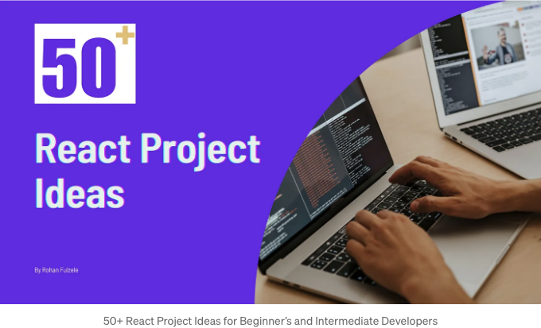

다음은 실력을 향상시키고 연습할 수 있는 50여 가지 초급 및 중급 레벨의 리액트 프로젝트 아이디어 목록입니다:

# 🧙🏻‍♀️초급 레벨 프로젝트

1. 할 일 목록 앱: 할 일을 추가하고 완료로 표시하고 삭제할 수 있는 간단한 할 일 목록 앱을 만들어보세요.

<!-- ui-log 수평형 -->
<ins class="adsbygoogle"
  style="display:block"
  data-ad-client="ca-pub-4877378276818686"
  data-ad-slot="9743150776"
  data-ad-format="auto"
  data-full-width-responsive="true"></ins>
<component is="script">
(adsbygoogle = window.adsbygoogle || []).push({});
</component>

2. 카운터 앱: 버튼을 클릭할 때 값이 증가하거나 감소하는 카운터 애플리케이션을 만드세요.

3. 계산기: 사용자 입력에 대해 산술 연산을 수행하는 기본 계산기를 개발하세요.

4. 랜덤 명언 생성기: API에서 가져온 랜덤 명언을 표시하는 앱을 만드세요.

5. 날씨 앱: 사용자 입력 위치를 기반으로 날씨 데이터를 가져오는 앱을 만드세요.

<!-- ui-log 수평형 -->
<ins class="adsbygoogle"
  style="display:block"
  data-ad-client="ca-pub-4877378276818686"
  data-ad-slot="9743150776"
  data-ad-format="auto"
  data-full-width-responsive="true"></ins>
<component is="script">
(adsbygoogle = window.adsbygoogle || []).push({});
</component>

6. 이미지 갤러리: 사용자가 이미지를 볼 수 있고 검색할 수 있는 갤러리를 디자인해 보세요.

7. BMI 계산기: 사용자 입력에 따라 체질량 지수를 계산하는 BMI 계산기를 개발해 보세요.

8. 타이머/스톱워치: 시작, 일시정지 및 재설정 기능을 갖춘 타이머 또는 스톱워치 애플리케이션을 만들어 보세요.

9. 간단한 블로그: 사용자가 게시물을 읽고 쓸 수 있는 기본 블로그 플랫폼을 만들어 보세요.

<!-- ui-log 수평형 -->
<ins class="adsbygoogle"
  style="display:block"
  data-ad-client="ca-pub-4877378276818686"
  data-ad-slot="9743150776"
  data-ad-format="auto"
  data-full-width-responsive="true"></ins>
<component is="script">
(adsbygoogle = window.adsbygoogle || []).push({});
</component>

10. 레시피 앱: 재료와 조리 방법을 포함한 레시피를 표시하는 앱을 개발해보세요.

## 🧙🏻‍♀️중급 레벨 프로젝트

11. 이커머스 웹사이트: 제품 목록, 장바구니, 결제 기능 등이 있는 온라인 상점을 구축해보세요.

12. 채팅 애플리케이션: Firebase나 WebSocket과 같은 라이브러리를 사용하여 실시간 채팅 앱을 만들어보세요.

<!-- ui-log 수평형 -->
<ins class="adsbygoogle"
  style="display:block"
  data-ad-client="ca-pub-4877378276818686"
  data-ad-slot="9743150776"
  data-ad-format="auto"
  data-full-width-responsive="true"></ins>
<component is="script">
(adsbygoogle = window.adsbygoogle || []).push({});
</component>

13. 영화/TV 프로그램 데이터베이스: 영화 또는 TV 프로그램 정보를 가져와서 표시하는 앱을 개발해보세요.

14. 업무 관리 앱: 카테고리, 레이블, 기한이 있는 더 발전된 업무 관리 앱을 만들어보세요.

15. 소셜 미디어 대시보드: 소셜 미디어 분석 및 통계를 보여주는 대시보드를 디자인해보세요.

16. 포트폴리오 웹사이트: 프로젝트와 기술을 전시하는 개인 포트폴리오 웹사이트를 만들어보세요.

<!-- ui-log 수평형 -->
<ins class="adsbygoogle"
  style="display:block"
  data-ad-client="ca-pub-4877378276818686"
  data-ad-slot="9743150776"
  data-ad-format="auto"
  data-full-width-responsive="true"></ins>
<component is="script">
(adsbygoogle = window.adsbygoogle || []).push({});
</component>

17. 지출 추적기: 시간이 경과함에 따라 개인 지출을 추적하고 시각화하는 앱을 개발하세요.

18. 온라인 퀴즈 앱: 사용자에게 퀴즈를 제시하고 끝에서 점수를 제공하는 앱을 만드세요.

19. 음악 플레이어: 재생, 일시정지, 건너뛰기 및 볼륨 제어가 가능한 기본 음악 플레이어를 만드세요.

20. 구인 게시판: 고용주가 직업을 게시하고 사용자가 지원할 수 있는 플랫폼을 디자인하세요.

<!-- ui-log 수평형 -->
<ins class="adsbygoogle"
  style="display:block"
  data-ad-client="ca-pub-4877378276818686"
  data-ad-slot="9743150776"
  data-ad-format="auto"
  data-full-width-responsive="true"></ins>
<component is="script">
(adsbygoogle = window.adsbygoogle || []).push({});
</component>

21. 노트 작성 앱: 다양한 서식 옵션을 제공하는 노트를 생성하고 관리하는 앱을 개발합니다.

22. 날씨 예보 앱: 현재 날씨뿐만 아니라 예보도 표시하는 앱을 구축합니다.

23. 예약 시스템: 약속, 예약 또는 티켓을 예약하는 앱을 만듭니다.

24. Trello 클론: 드래그 앤 드롭 기능을 갖춘 Trello와 유사한 작업 관리 앱을 개발합니다.

<!-- ui-log 수평형 -->
<ins class="adsbygoogle"
  style="display:block"
  data-ad-client="ca-pub-4877378276818686"
  data-ad-slot="9743150776"
  data-ad-format="auto"
  data-full-width-responsive="true"></ins>
<component is="script">
(adsbygoogle = window.adsbygoogle || []).push({});
</component>

25. 온라인 Markdown 편집기 : 실시간 미리보기가 가능한 온라인 Markdown 편집기 디자인하기.

26. 환율 변환기 : 실시간 환율을 사용하여 통화를 변환하는 앱 만들기.

27. 언어 학습 앱 : 퀴즈나 플래시카드를 통해 사용자들이 새로운 언어를 배울 수 있도록 도와주는 앱 만들기.

28. 피트니스 추적 앱 : 사용자들이 운동 및 피트니스 진행 상황을 추적할 수 있는 앱 개발하기.

<!-- ui-log 수평형 -->
<ins class="adsbygoogle"
  style="display:block"
  data-ad-client="ca-pub-4877378276818686"
  data-ad-slot="9743150776"
  data-ad-format="auto"
  data-full-width-responsive="true"></ins>
<component is="script">
(adsbygoogle = window.adsbygoogle || []).push({});
</component>

29. 레시피 공유 플랫폼: 사용자들이 자신의 좋아하는 레시피를 공유할 수 있는 플랫폼을 설계합니다.

30. 부동산 목록: 필터와 세부 정보가 포함된 부동산 목록을 표시하는 부동산 앱을 구축합니다.

31. 작업 일정 관리자: 특정 시간이나 간격에 따라 작업을 예약하는 앱을 개발합니다.

32. 비용 공유 앱: 그룹 내에서 공유된 비용을 분할하고 추적할 수 있는 앱을 생성합니다.

<!-- ui-log 수평형 -->
<ins class="adsbygoogle"
  style="display:block"
  data-ad-client="ca-pub-4877378276818686"
  data-ad-slot="9743150776"
  data-ad-format="auto"
  data-full-width-responsive="true"></ins>
<component is="script">
(adsbygoogle = window.adsbygoogle || []).push({});
</component>

33. 여행 일정표 플래너: 사용자가 여행 일정을 계획하고 정리할 수 있는 플랫폼 구축하기.

34. 음악 스트리밍 앱: 사용자 선호도에 따라 노래를 재생하는 음악 스트리밍 앱 디자인하기.

35. 취업 신청 추적기: 채용 신청, 면접 및 제안을 추적할 수 있는 앱 개발하기.

36. 언어 번역 앱: 다른 언어 사이에서 텍스트를 번역하는 앱 구축하기.

<!-- ui-log 수평형 -->
<ins class="adsbygoogle"
  style="display:block"
  data-ad-client="ca-pub-4877378276818686"
  data-ad-slot="9743150776"
  data-ad-format="auto"
  data-full-width-responsive="true"></ins>
<component is="script">
(adsbygoogle = window.adsbygoogle || []).push({});
</component>

37. 온라인 마켓플레이스: 사용자가 온라인에서 물품을 구매하고 판매할 수 있는 플랫폼을 만들어보세요.

38. 피트니스 클래스 예약: 지역 헬스장이나 스튜디오에서 피트니스 클래스를 예약할 수 있는 앱을 개발해보세요.

39. 대화형 지도: 사용자 정의 마커와 정보가 표시되는 대화형 지도를 보여주는 앱을 만들어보세요.

40. 투표 앱: 투표와 설문 조사를 만들고 참여할 수 있는 앱을 디자인해보세요.

<!-- ui-log 수평형 -->
<ins class="adsbygoogle"
  style="display:block"
  data-ad-client="ca-pub-4877378276818686"
  data-ad-slot="9743150776"
  data-ad-format="auto"
  data-full-width-responsive="true"></ins>
<component is="script">
(adsbygoogle = window.adsbygoogle || []).push({});
</component>

41. 협업 코드 편집기 : 여러 사용자가 실시간으로 협업할 수 있는 온라인 코드 편집기를 개발하세요.

42. 가상 이벤트 플랫폼 : 가상 이벤트, 웨비나 및 콘퍼런스를 주최하는 앱을 만드세요.

43. 개인 재무 대시보드 : 개인 재무 데이터와 트렌드를 시각화하는 앱을 디자인하세요.

44. 레시피 추천 앱 : 사용자 기호에 따라 레시피를 추천하는 앱을 만드세요.

<!-- ui-log 수평형 -->
<ins class="adsbygoogle"
  style="display:block"
  data-ad-client="ca-pub-4877378276818686"
  data-ad-slot="9743150776"
  data-ad-format="auto"
  data-full-width-responsive="true"></ins>
<component is="script">
(adsbygoogle = window.adsbygoogle || []).push({});
</component>

45. 건강 모니터링 앱: 사용자가 걸음 수 및 칼로리와 같은 건강 지표를 추적할 수 있는 앱을 개발합니다.

46. 작업 자동화 앱: 사용자가 정의한 규칙과 트리거를 사용하여 작업을 자동화하는 앱을 만듭니다.

47. 퀴즈 게임: 다양한 카테고리와 난이도 수준을 갖춘 퀴즈 게임을 만듭니다.

48. 도서 리뷰 플랫폼: 사용자가 읽은 책을 리뷰하고 평가할 수 있는 플랫폼을 디자인합니다.

<!-- ui-log 수평형 -->
<ins class="adsbygoogle"
  style="display:block"
  data-ad-client="ca-pub-4877378276818686"
  data-ad-slot="9743150776"
  data-ad-format="auto"
  data-full-width-responsive="true"></ins>
<component is="script">
(adsbygoogle = window.adsbygoogle || []).push({});
</component>

49. 협업 그림 앱: 여러 사용자가 실시간으로 함께 그림을 그릴 수 있는 앱을 개발해보세요.

50. 개인 일기 앱: 서식이 있는 풍부한 텍스트와 미디어 지원이 가능한 디지턀 일기 앱을 만들어보세요.

51. 이러닝 플랫폼: 온라인 강좌, 강의 및 퀴즈를 제공하는 플랫폼을 구축해보세요.

52. 캠핑 여행 계획앱: 사용자가 캠핑 여행을 계획하고 조직하는 데 도움을 주는 앱을 디자인해보세요.

<!-- ui-log 수평형 -->
<ins class="adsbygoogle"
  style="display:block"
  data-ad-client="ca-pub-4877378276818686"
  data-ad-slot="9743150776"
  data-ad-format="auto"
  data-full-width-responsive="true"></ins>
<component is="script">
(adsbygoogle = window.adsbygoogle || []).push({});
</component>

53. 홈 자동화 제어: 스마트 홈 장치를 제어하고 모니터링할 수 있는 앱을 개발해보세요.

54. 언어 교환 앱: 원어민과 언어 실력을 연습할 수 있는 플랫폼을 만들어보세요.

55. 렌탈 마켓 플레이스: 도구, 장비, 파티 용품 등을 렌탈할 수 있는 앱을 만들어보세요.

이 중급 수준의 프로젝트 아이디어는 ReactJS의 다양한 측면을 탐색하고 API를 통합하며 데이터베이스를 활용하며 동적이고 매력적인 사용자 경험을 만들 수 있는 다양한 기회를 제공할 수 있습니다. 이러한 프로젝트를 구축하면서 스스로에게 도전하고 즐겁게 시도해 보세요!

<!-- ui-log 수평형 -->
<ins class="adsbygoogle"
  style="display:block"
  data-ad-client="ca-pub-4877378276818686"
  data-ad-slot="9743150776"
  data-ad-format="auto"
  data-full-width-responsive="true"></ins>
<component is="script">
(adsbygoogle = window.adsbygoogle || []).push({});
</component>

행복한 코딩! 😎

만약 이 글이 도움이 되었다면 친구들과 공유하고 박수를 치는 것도 잊지 마세요. 👏

Rohan Fulzele를 팔로우하고 더 많은 멋진 콘텐츠를 만나보세요. ♥️