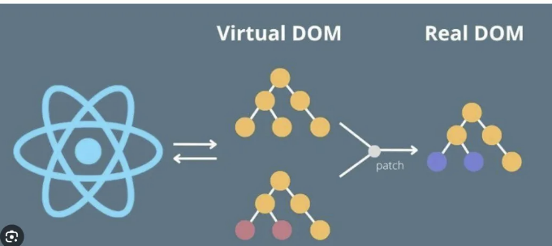
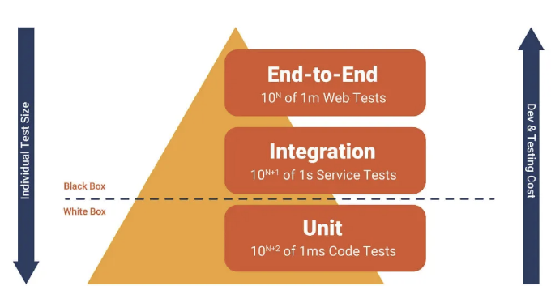
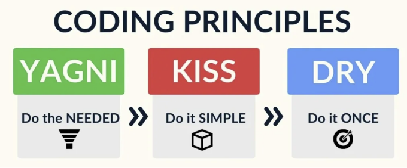
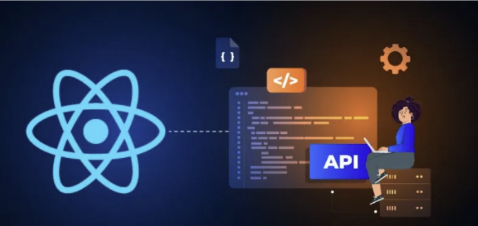

시니어 프론트엔드 개발자를 위한 React JS 관련 상위 질문들 — 고급 기능, 성능 최적화, 보안, 훅, 컨텍스트, 패턴, 테스팅, 그리고 에코시스템.


# 파트 1 질문:

- React JS에서 Virtual DOM이란 무엇이며 왜 필요한가요?
- React를 기반으로 한 테스트 피라미드에 대해 설명해주세요.
- React를 기반으로 한 KISS, YAGNI, DRY 개발 원리를 설명해주세요.
- 큰 규모의 React 애플리케이션에서 상태 관리는 어떻게 처리하나요?
- React 애플리케이션에서 비동기 작업을 처리하는 방법은 무엇인가요?

<!-- ui-log 수평형 -->
<ins class="adsbygoogle"
  style="display:block"
  data-ad-client="ca-pub-4877378276818686"
  data-ad-slot="9743150776"
  data-ad-format="auto"
  data-full-width-responsive="true"></ins>
<component is="script">
(adsbygoogle = window.adsbygoogle || []).push({});
</component>

# 1. React JS에서 Virtual DOM은 무엇이며 왜 필요한가요?



React의 Virtual DOM은 실제 DOM의 메모리 내 표현입니다. React는 실제 DOM을 업데이트하기 전에 모든 요소와 상태를 유지하는 가벼운 복사본입니다. 이 접근 방식은 React가 DOM의 직접 조작을 최소화할 수 있도록 하며, 이는 성능상으로 손해가 많은 작업입니다. React는 Virtual DOM을 업데이트 전에 촬영한 스냅샷과 비교하고 (일명 "diffing" 과정으로 알려져 있음) 실제 DOM을 업데이트하는 가장 효율적인 방법을 계산합니다.

예시:

<!-- ui-log 수평형 -->
<ins class="adsbygoogle"
  style="display:block"
  data-ad-client="ca-pub-4877378276818686"
  data-ad-slot="9743150776"
  data-ad-format="auto"
  data-full-width-responsive="true"></ins>
<component is="script">
(adsbygoogle = window.adsbygoogle || []).push({});
</component>

```js
function MyComponent() {
  return <div>Hello, World!</div>;
}
```

이 예시에서 React는 `div`와 그 내용의 가상 DOM 표현을 생성합니다. 컴포넌트가 업데이트되면 React는 새로운 결과물을 이전 결과물과 비교하여 어떤 부분이 다른지 찾아 실제 DOM에 적용합니다.

# 2. React를 기반으로한 테스팅 피라미드를 설명하세요

피라미드는 세 개의 계층으로 나누어집니다:```

<!-- ui-log 수평형 -->
<ins class="adsbygoogle"
  style="display:block"
  data-ad-client="ca-pub-4877378276818686"
  data-ad-slot="9743150776"
  data-ad-format="auto"
  data-full-width-responsive="true"></ins>
<component is="script">
(adsbygoogle = window.adsbygoogle || []).push({});
</component>



- Unit tests: 유닛 테스트는 테스트 피라미드의 기초입니다. 이것은 개별 기능과 애플리케이션의 구성요소를 유효성 검사하는 가장 작고 빠른 종류의 테스트입니다. React에서 Jest와 Enzyme과 같은 도구를 사용하여 개별 구성요소 및 그들의 동작을 고립시켜 유닛 테스트를 작성할 수 있습니다.
- 통합 테스트: 통합 테스트는 다른 구성요소 간의 상호작용 및 함께 작동하는 방식을 유효성 검사합니다. React에서 통합 테스트는 Enzyme, React Testing Library 및 Cypress와 같은 도구를 사용하여 함께 작동하는 여러 구성 요소의 동작을 테스트할 수 있습니다.
- 엔드 투 엔드 테스트: 엔드투엔드 테스트는 외부 종속성 및 API와의 상호작용을 포함하여 전체 애플리케이션의 유효성을 검사합니다. React에서 엔드투엔드 테스트는 Cypress 또는 Selenium과 같은 도구를 사용하여 사용자 상호작용을 시뮬레이션하고 전체 애플리케이션을 테스트할 수 있습니다.

테스트 피라미드는 테스트 전략이 통합 테스트보다는 유닛 테스트가 더 많아야 하고, 통합 테스트보다는 엔드 투 엔드 테스트가 더 많아야 함을 제안합니다. 이는 유닛 테스트가 더 빠르고 저렴하며 신뢰성이 더 높기 때문입니다. 통합 테스트는 유닛 테스트보다 비용이 많이 들고 실행하는 데 더 오래 걸리지만, 구성요소 간의 상호작용을 테스트하는 데 중요합니다.

<!-- ui-log 수평형 -->
<ins class="adsbygoogle"
  style="display:block"
  data-ad-client="ca-pub-4877378276818686"
  data-ad-slot="9743150776"
  data-ad-format="auto"
  data-full-width-responsive="true"></ins>
<component is="script">
(adsbygoogle = window.adsbygoogle || []).push({});
</component>

엔드 투 엔드 테스트는 가장 느리고 비용이 많이 드는 테스트 유형이지만, 전체 애플리케이션이 예상대로 작동하는지 확인하는 데 중요합니다.

테스팅 피라미드를 따르면 포괄적인 커버리지를 제공하면서도 효율적이고 비용 효율적인 테스트 전략을 만들 수 있습니다.

# 3. React를 기반으로 하는 KISS, YAGNI 및 DRY 개발 원칙을 설명하세요



<!-- ui-log 수평형 -->
<ins class="adsbygoogle"
  style="display:block"
  data-ad-client="ca-pub-4877378276818686"
  data-ad-slot="9743150776"
  data-ad-format="auto"
  data-full-width-responsive="true"></ins>
<component is="script">
(adsbygoogle = window.adsbygoogle || []).push({});
</component>

## KISS: Keep It Simple, Stupid

KISS 원칙은 개발자들이 간단하고 이해하기 쉬운 코드를 작성하도록 권장합니다. React 개발 환경에서는 이는 코드베이스에서 불필요한 복잡성을 피하는 것을 의미합니다. 예를 들어, 컴포넌트를 디자인할 때, 컴포넌트의 책임을 집중시키고 너무 많은 기능이나 기능을 넣지 않는 것이 중요합니다. 이렇게 하면 코드가 더 가독성이 좋아지고 오랜 시간 유지보수하기 쉬워집니다.

## YAGNI: You Ain’t Gonna Need It

YAGNI 원칙은 현재 필요하지 않은 기능을 구현하는 것을 피하도록 개발자들에게 조언합니다. React 개발 환경에서는 즉시 필요하지 않은 기능이나 구성 요소를 개발하는 유혹을 피해야 합니다. 대신 최소 기능 제품(MVP)을 구축하고 필요할 때 새로운 기능을 추가해야 합니다. 이는 코드베이스에서 불필요한 복잡성과 유지보수 문제를 피하는 데 도움이 됩니다.

<!-- ui-log 수평형 -->
<ins class="adsbygoogle"
  style="display:block"
  data-ad-client="ca-pub-4877378276818686"
  data-ad-slot="9743150776"
  data-ad-format="auto"
  data-full-width-responsive="true"></ins>
<component is="script">
(adsbygoogle = window.adsbygoogle || []).push({});
</component>

## DRY: Don’t Repeat Yourself

DRY 원칙은 개발자들에게 코드베이스 전체에 걸쳐 코드를 중복해서 작성하지 않도록 권장합니다. React 개발의 맥락에서는 재사용 가능한 컴포넌트와 함수를 만들어 애플리케이션 전반에 걸쳐 사용하는 것을 의미합니다. 이를 통해 코드의 중복을 줄이고 시간이 지남에 따라 코드베이스를 더 쉽게 유지보수할 수 있습니다. 예를 들어, 여러 컴포넌트가 동일한 기능이 필요하다면, 여러 컴포넌트에 동일한 코드를 중복해서 작성하는 것보다 애플리케이션 전반에 걸쳐 사용할 수 있는 별도의 컴포넌트나 함수를 만드는 것이 좋습니다.

# 4. 대규모 React 애플리케이션에서 상태 관리를 어떻게 다루시나요?


<!-- ui-log 수평형 -->
<ins class="adsbygoogle"
  style="display:block"
  data-ad-client="ca-pub-4877378276818686"
  data-ad-slot="9743150776"
  data-ad-format="auto"
  data-full-width-responsive="true"></ins>
<component is="script">
(adsbygoogle = window.adsbygoogle || []).push({});
</component>

대규모 React 애플리케이션에서는 여러 컴포넌트 간에 상태를 공유하고 동기화해야 하는 필요로 인해 상태 관리가 복잡해질 수 있습니다. 이 복잡성을 해결하기 위해 개발자들은 종종 상태 관리 라이브러리나 구조를 사용하여 상태를 더 구조적이고 확장 가능하게 관리하는 접근 방식을 채택합니다. 여기에는 일반적인 전략들이 있습니다:

- Context API: React에 내장된 Context API는 모든 앱 전반에 걸쳐 전역 상태를 공유할 수 있도록 해주며 수동으로 매번 props를 수동으로 넘겨주지 않아도 됩니다. 중형 애플리케이션에 적합하며 많은 컴포넌트 간에 상태를 공유해야 할 때 유용합니다.
- Redux: 애플리케이션 상태를 관리하기 위한 인기 있는 라이브러리인 Redux는 앱의 모든 상태에 대한 중앙 집중식 저장소를 제공하며 상태를 언제 어떻게 업데이트할지에 엄격한 규칙을 적용합니다. 매우 확장 가능하며 예측 가능성과 강력한 개발 도구로 대형 애플리케이션에서 자주 사용됩니다.
- MobX: MobX는 상태 관리를 위한 또 다른 라이브러리로 간결함과 확장 가능성에 초점을 맞춥니다. MobX는 관찰 가능한 상태와 반응을 사용하여 의존성 및 다시 렌더링을 자동으로 관리하여 Redux보다 직관적이고 부자연스럽지 않은 상태 관리를 제공합니다.
- Zustand: 최신 라이브러리인 Zustand는 최소한의 API를 사용하여 상태 관리 프로세스를 간소화합니다. 여러 저장소를 만들 수 있으며 응용 프로그램 전체에서 상태에 쉽게 액세스하고 업데이트할 수 있는 간편한 방법을 제공하며 간결함과 성능에 중점을 두고 있습니다.

이러한 각 방법은 대규모 애플리케이션에서 효율적으로 상태를 관리하는 메커니즘을 제공하며, 이들 사이의 선택은 종종 프로젝트의 구체적인 요구 사항에 따라 다릅니다. 예를 들어, 확장 가능성, 간결함 또는 상태에 대한 세밀한 제어가 필요한지 등이 있습니다.

# 5. React 애플리케이션에서 비동기 작업을 어떻게 처리하나요?

<!-- ui-log 수평형 -->
<ins class="adsbygoogle"
  style="display:block"
  data-ad-client="ca-pub-4877378276818686"
  data-ad-slot="9743150776"
  data-ad-format="auto"
  data-full-width-responsive="true"></ins>
<component is="script">
(adsbygoogle = window.adsbygoogle || []).push({});
</component>



한 가지 방법은 async 및 await 키워드를 사용하는 것인데, 이를 사용하면 비동기 코드를 동기적으로 작성할 수 있습니다.

다음은 async 및 await를 사용하여 비동기 API 호출을 하는 컴포넌트의 예시입니다:

```js
import React, { useState, useEffect } from 'react';

function MyComponent() {
  const [data, setData] = useState(null);
  useEffect(() => {
    async function fetchData() {
      const response = await fetch('https://..../endpoint');
      const data = await response.json();
      setData(data);
    }
    fetchData();
  }, []);
  return (
    <div>
      {data ? (
        <div>{data.message}</div>
      ) : (
        <div>Loading...</div>
      )}
    </div>
  );
}
```

<!-- ui-log 수평형 -->
<ins class="adsbygoogle"
  style="display:block"
  data-ad-client="ca-pub-4877378276818686"
  data-ad-slot="9743150776"
  data-ad-format="auto"
  data-full-width-responsive="true"></ins>
<component is="script">
(adsbygoogle = window.adsbygoogle || []).push({});
</component>

React에서 비동기 함수를 처리하는 또 다른 방법은 axios나 fetch와 같은 라이브러리를 사용하여 API 호출을하는 것입니다.axios를 사용한 예제입니다:

```js
import React, { useState, useEffect } from 'react';
import axios from 'axios';

function MyComponent() {
  const [data, setData] = useState(null);
  useEffect(() => {
    async function fetchData() {
      const response = await axios.get('https://my-api.com/endpoint');
      setData(response.data);
    }
    fetchData();
  }, []);
  return (
    <div>
      {data ? (
        <div>{data.message}</div>
      ) : (
        <div>Loading...</div>
      )}
    </div>
  );
}
```

🚀 고급 기능 및 성능 최적화를 다루는 월간 React JS 심화 질문: Senior Front-End 개발자를 위한 🚀

🛠 발간배경 및 성능 최적화 커버하기:

<!-- ui-log 수평형 -->
<ins class="adsbygoogle"
  style="display:block"
  data-ad-client="ca-pub-4877378276818686"
  data-ad-slot="9743150776"
  data-ad-format="auto"
  data-full-width-responsive="true"></ins>
<component is="script">
(adsbygoogle = window.adsbygoogle || []).push({});
</component>

- React의 고급 기능을 활용하여 고성능 웹 애플리케이션을 구축하는 방법은 무엇인가요?
- 컴포넌트 렌더링을 최적화하기 위해 구현하는 전략은 무엇인가요?
- React.memo, PureComponent 및 shouldComponentUpdate의 사용을 통해 성능 향상을 설명해주실 수 있나요?

🔒 보안 인사이트:

- React 애플리케이션의 보안을 강화하기 위해 취하는 조치는 무엇인가요?
- React에서 Cross-Site Scripting (XSS) 취약점을 어떻게 처리하시나요?

🪝 Hooks 및 Context Magic:

<!-- ui-log 수평형 -->
<ins class="adsbygoogle"
  style="display:block"
  data-ad-client="ca-pub-4877378276818686"
  data-ad-slot="9743150776"
  data-ad-format="auto"
  data-full-width-responsive="true"></ins>
<component is="script">
(adsbygoogle = window.adsbygoogle || []).push({});
</component>

- 훅이 React에서 상태와 부수 효과를 관리하는 방식을 어떻게 변화시켰나요?
- useContext가 응용 프로그램 아키텍처를 개선한 시나리오를 자세히 설명해 주실 수 있을까요?

🧩 패턴 및 권장 사항:

- React 개발에서 가장 효과적인 디자인 패턴은 무엇이며, 그 이유는 무엇인가요?
- 확장성과 유지 관리성을 위해 React 프로젝트를 어떻게 구조화하시나요?

🧪 테스팅 마스터리:

<!-- ui-log 수평형 -->
<ins class="adsbygoogle"
  style="display:block"
  data-ad-client="ca-pub-4877378276818686"
  data-ad-slot="9743150776"
  data-ad-format="auto"
  data-full-width-responsive="true"></ins>
<component is="script">
(adsbygoogle = window.adsbygoogle || []).push({});
</component>

- 리액트 컴포넌트를 테스트하는 방법은 무엇인가요? 선호하는 라이브러리나 도구가 있나요?
- 테스트를 통해 리액트 애플리케이션이 강건하고 오류가 없는지 어떻게 확인하나요?

🌳 생태계 탐험:

- 리액트 생태계에서 어떤 라이브러리나 도구가 필수적이라고 생각하시나요? 이들이 개발 워크플로우를 어떻게 향상시키나요?
- 리액트 생태계의 끊임없는 변화와 어떻게 따라가시나요?

## ❤️ 제 작업을 좋아하셨다면 팔로우와 구독 부탁드립니다 ❤️

<!-- ui-log 수평형 -->
<ins class="adsbygoogle"
  style="display:block"
  data-ad-client="ca-pub-4877378276818686"
  data-ad-slot="9743150776"
  data-ad-format="auto"
  data-full-width-responsive="true"></ins>
<component is="script">
(adsbygoogle = window.adsbygoogle || []).push({});
</component>

- 팔로우해 주세요
- 구독하기
- LinkedIn
- Front-end World를 방문하고 구독하기.

# Stackademic 🎓

끝까지 읽어 주셔서 감사합니다. 떠나시기 전에:

- 박수를 치고 글쓴이를 팔로우해 주세요! 👏
- 팔로우하기 X | LinkedIn | YouTube | Discord
- 다른 플랫폼 방문하기: In Plain English | CoFeed | Venture | Cubed
- 더 많은 콘텐츠는 Stackademic.com에서 확인하세요.