조건부 렌더링은 리액트의 강력한 기능 중 하나로, 특정 조건에 따라 컴포넌트의 표시를 제어할 수 있습니다. 이는 동적이고 인터랙티브한 사용자 인터페이스를 만드는 데 중요한 역할을 합니다. 그러나 리액트에서 조건부 렌더링이 어떻게 작동하는지 이해하고 구현하는 것은 특히 이 프레임워크에 익숙하지 않은 개발자들에게 도전일 수 있습니다.

그래서 이 포괄적인 안내서가 여기 있습니다. 당신이 초보자이든, 숙련된 개발자이든, 이 기사는 리액트에서의 조건부 렌더링에 대한 상세한 설명을 제공하고, 이를 숙달하는 데 도움이 되는 실용적인 예제를 제시할 것입니다. 그래서 함께 더 깊이 들어가서 리액트에서 조건부 렌더링의 전체 잠재력을 펼쳐 보는 것은 어떨까요?

더 알아보기 전에, 저의 개인 웹사이트에서 웹 개발에 대한 보다 심층적인 기사를 살펴보세요:

<!-- ui-log 수평형 -->
<ins class="adsbygoogle"
  style="display:block"
  data-ad-client="ca-pub-4877378276818686"
  data-ad-slot="9743150776"
  data-ad-format="auto"
  data-full-width-responsive="true"></ins>
<component is="script">
(adsbygoogle = window.adsbygoogle || []).push({});
</component>

## React에서 조건부 렌더링 이해하기

조건부 렌더링은 특정 조건에 따라 컴포넌트를 선택적으로 렌더링하는 과정입니다. 이를 통해 개발자들은 더 다이나믹하고 반응적인 사용자 인터페이스를 만들 수 있습니다.

React에서는 React 앱 내에서 조건부 렌더링을 다루는 여러 가지 방법이 있습니다.

- If/Else 문
- 삼항 연산자 (?)
- 논리 AND (&&)
- 널 병합 연산자 (??)
- switch case 문
- 에러 경계
- 고차 컴포넌트 (HOCs)
- 렌더 프롭스

<!-- ui-log 수평형 -->
<ins class="adsbygoogle"
  style="display:block"
  data-ad-client="ca-pub-4877378276818686"
  data-ad-slot="9743150776"
  data-ad-format="auto"
  data-full-width-responsive="true"></ins>
<component is="script">
(adsbygoogle = window.adsbygoogle || []).push({});
</component>

각 접근 방식에 대한 설명을 자세히 살펴봅시다.

## If/Else문

전통적인 if/else문은 분기 논리에 사용됩니다. 이들은 조건이 참 또는 거짓인지에 따라 코드의 특정 부분을 실행하는 데 도움을 줍니다. 이는 조건에 따라 흐름을 제어하는 간단한 방법입니다.

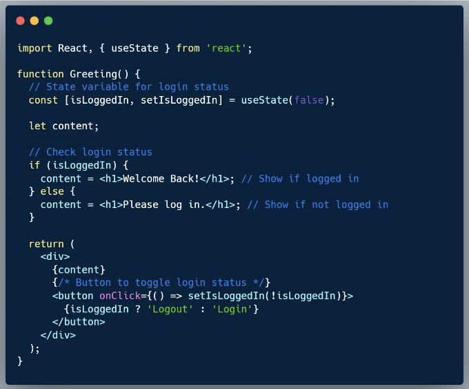

<!-- ui-log 수평형 -->
<ins class="adsbygoogle"
  style="display:block"
  data-ad-client="ca-pub-4877378276818686"
  data-ad-slot="9743150776"
  data-ad-format="auto"
  data-full-width-responsive="true"></ins>
<component is="script">
(adsbygoogle = window.adsbygoogle || []).push({});
</component>

if/else 문은 조건을 확인합니다: 조건이 참이면 `if` 블록 내의 코드가 실행됩니다. 그렇지 않으면 `else` 블록이 실행됩니다.

## 삼항 연산자 (?)

삼항 연산자는 'if-else' 문을 한 줄로 대체하는 것입니다. 이는 조건을 확인하고 참이면 한 가지 값을 반환하고, 거짓이면 다른 값을 반환합니다. 코드가 간결하며 JSX에서 간단한 조건부 렌더링에 이상적입니다.

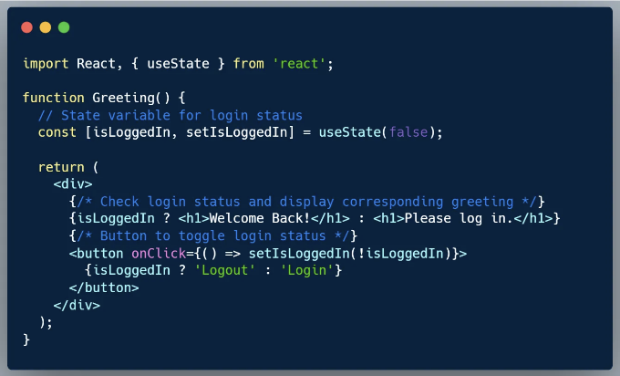

<!-- ui-log 수평형 -->
<ins class="adsbygoogle"
  style="display:block"
  data-ad-client="ca-pub-4877378276818686"
  data-ad-slot="9743150776"
  data-ad-format="auto"
  data-full-width-responsive="true"></ins>
<component is="script">
(adsbygoogle = window.adsbygoogle || []).push({});
</component>

## 논리 AND (&&):

논리 && 연산자는 첫 번째 피연산자가 참이면 두 번째 피연산자를 반환하고, 그렇지 않으면 첫 번째 피연산자를 반환합니다. React에서는 조건이 참인 경우에만 요소를 포함하는 데 유용합니다.

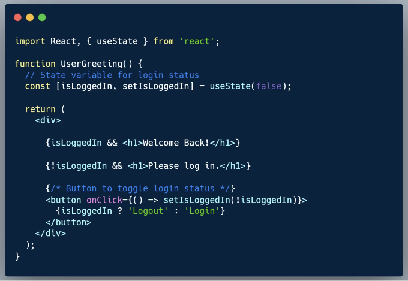

## 널 병합 연산자 (??)

<!-- ui-log 수평형 -->
<ins class="adsbygoogle"
  style="display:block"
  data-ad-client="ca-pub-4877378276818686"
  data-ad-slot="9743150776"
  data-ad-format="auto"
  data-full-width-responsive="true"></ins>
<component is="script">
(adsbygoogle = window.adsbygoogle || []).push({});
</component>

널 병합 연산자 (??)는 널 또는 정의되지 않은 피연산자에 기본값을 제공합니다. React에서는 후속 콘텐츠나 값 설정에 유용하며, 컴포넌트가 데이터가 누락되어 망가지는 것을 방지할 수 있습니다.

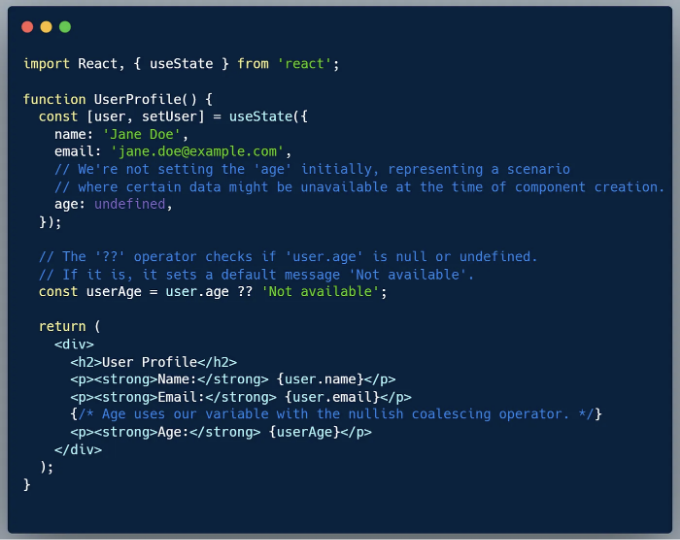

여기서 useState 훅을 사용하여 사용자 상태를 초기화합니다. 사용자가 나이를 정의하지 않은 채로 두었는데, 이는 특정 정보가 즉시 제공되지 않거나 누락된 경우를 나타냅니다.

컴포넌트 내에서 널 병합 연사자 (??)를 사용하여 나이가 널이거나 정의되지 않은 경우를 처리합니다. 사용자 나이가 없는 경우, userAge 변수가 `사용할 수 없음`으로 기본 설정되며, 렌더링된 출력에 사용됩니다. 이를 통해 나이 데이터가 없더라도 컴포넌트가 이를 우아하게 처리하고 대체값을 제공하여 완전하고 사용자 친화적인 인터페이스를 유지할 수 있습니다.

<!-- ui-log 수평형 -->
<ins class="adsbygoogle"
  style="display:block"
  data-ad-client="ca-pub-4877378276818686"
  data-ad-slot="9743150776"
  data-ad-format="auto"
  data-full-width-responsive="true"></ins>
<component is="script">
(adsbygoogle = window.adsbygoogle || []).push({});
</component>

## 스위치 케이스 문장:

'switch' 문은 표현식을 평가하고 표현식의 값과 일치하는 'case' 블록을 실행합니다. React에서 서로 다른 렌더를 유도하는 여러 조건에 대해 사용할 때 훌륭한 기능입니다. 구성이 잘 되고 가독성이 높은 코드를 보장합니다.

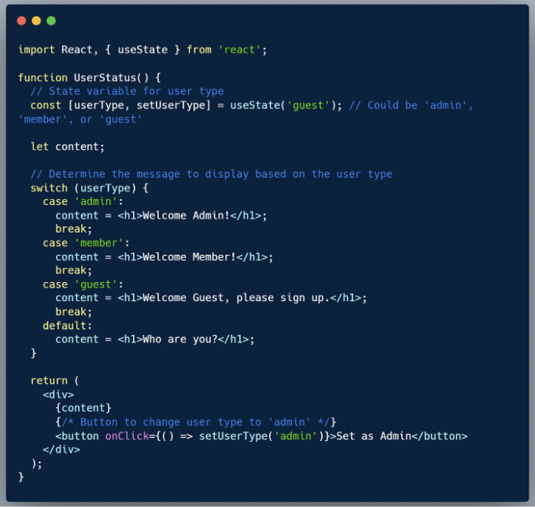

# 고급 조건부 렌더링 기술

<!-- ui-log 수평형 -->
<ins class="adsbygoogle"
  style="display:block"
  data-ad-client="ca-pub-4877378276818686"
  data-ad-slot="9743150776"
  data-ad-format="auto"
  data-full-width-responsive="true"></ins>
<component is="script">
(adsbygoogle = window.adsbygoogle || []).push({});
</component>

기본적인 방법을 마스터한 후, 더 복잡한 해결책이 필요한 상황에 직면할 수 있습니다. 이러한 고급 기술은 일반적으로 더 큰 애플리케이션이나 더 높은 추상화 수준이 필요한 특정 상황에서 사용됩니다:

## 에러 바운더리:

에러 바운더리는 자식 컴포넌트 트리에서 어디서나 JavaScript 에러를 잡고 해당 에러를 로깅하며 컴포넌트 트리가 충돌한 대신 대체 백업 UI를 표시하는 컴포넌트입니다. 이들은 컴포넌트용 catch 블록과 같습니다.

조건부 렌더링에서의 역할: 에러 바운더리는 컴포넌트 하위 트리에서 오류가 발생할 때 대체 백업 UI를 조건부로 렌더링합니다. 전체 애플리케이션이 충돌하고 흰 화면이 표시되는 대신 오류가 있는 컴포넌트 하위 트리만 사용자 정의 대체 백업 UI로 대체됩니다.

<!-- ui-log 수평형 -->
<ins class="adsbygoogle"
  style="display:block"
  data-ad-client="ca-pub-4877378276818686"
  data-ad-slot="9743150776"
  data-ad-format="auto"
  data-full-width-responsive="true"></ins>
<component is="script">
(adsbygoogle = window.adsbygoogle || []).push({});
</component>

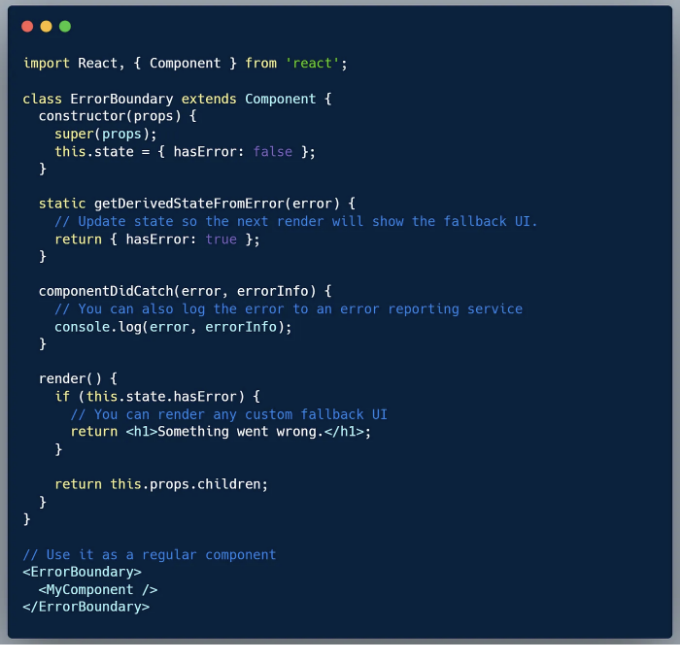

## Higher-Order Components (HOCs):

HOCs는 컴포넌트를 감싸는 함수로, 컴포넌트 로직을 재사용할 수 있게 해줍니다. HOCs는 받은 props에 따라 조건적으로 컴포넌트를 렌더링할 수 있어서 컴포넌트 간 로직을 유연하게 공유할 수 있는 방법을 제공합니다.

프리미엄 계정을 가진 사용자만 볼 수 있는 기능이 있는 경우를 상상해보세요. 사용자의 계정 유형을 확인하고 해당에 따라 조건적으로 컴포넌트를 렌더링하는 HOC를 만들 것입니다.

<!-- ui-log 수평형 -->
<ins class="adsbygoogle"
  style="display:block"
  data-ad-client="ca-pub-4877378276818686"
  data-ad-slot="9743150776"
  data-ad-format="auto"
  data-full-width-responsive="true"></ins>
<component is="script">
(adsbygoogle = window.adsbygoogle || []).push({});
</component>

- 우선, 우리는 고유의 파일(withPremiumFeature.js와 같은)에 HOC (Higher-Order Component)인 withPremiumFeature를 정의합니다:

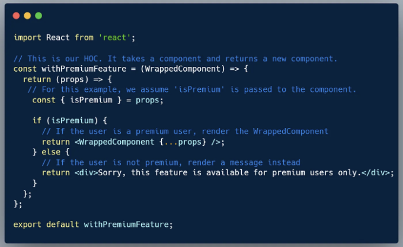

이제 사용자의 프리미엄 상태에 따라 조건부 렌더링하려는 컴포넌트를 생성할 것입니다. 이는 특정 기능 컴포넌트일 수 있습니다 - 예를 들어, SpecialFeature.js.

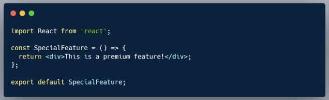

<!-- ui-log 수평형 -->
<ins class="adsbygoogle"
  style="display:block"
  data-ad-client="ca-pub-4877378276818686"
  data-ad-slot="9743150776"
  data-ad-format="auto"
  data-full-width-responsive="true"></ins>
<component is="script">
(adsbygoogle = window.adsbygoogle || []).push({});
</component>

다음으로, 특별기능(SpecialFeature) 컴포넌트를 withPremiumFeature HOC로 강화하여 사용자 계정 유형에 기반한 조건부 렌더링 기능을 추가할 것입니다.

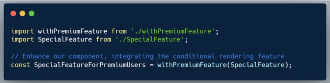

## 렌더 프롭(Render Props):

이 패턴은 컴포넌트에 전달된 함수를 사용하여 React 요소를 반환합니다. 이는 컴포넌트 간 렌더링 로직을 공유하기 위해 사용되며, 렌더 프롭 내에 포함된 상태, 프롭 또는 로직에 따라 UI의 다른 부분을 조건부로 렌더링할 수 있도록 합니다.

<!-- ui-log 수평형 -->
<ins class="adsbygoogle"
  style="display:block"
  data-ad-client="ca-pub-4877378276818686"
  data-ad-slot="9743150776"
  data-ad-format="auto"
  data-full-width-responsive="true"></ins>
<component is="script">
(adsbygoogle = window.adsbygoogle || []).push({});
</component>

재사용 가능한 컴포넌트를 만들고 싶은 시나리오를 고려해 봅시다. 이 컴포넌트는 사용자의 온라인 상태를 추적하고 해당 상태에 따라 콘텐츠를 조건부로 렌더링합니다.

먼저 UserOnlineStatus 컴포넌트를 만들어 봅시다. 이 컴포넌트는 스스로 렌더링하는 대신 `render` prop으로 함수를 받아 이 함수에 렌더링 책임을 위임합니다. 또한 `isOnline` 상태를 해당 함수에 전달할 것입니다.

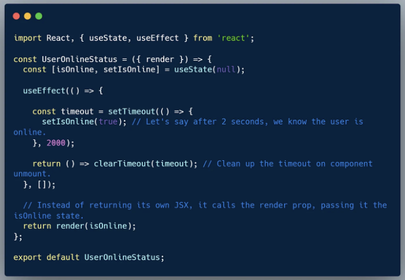

이제 부모 컴포넌트에서 UserOnlineStatus를 사용하고 해당 사용자 온라인 상태를 기반으로 원하는 콘텐츠를 렌더링하기 위해 함수를 전달할 수 있습니다.

<!-- ui-log 수평형 -->
<ins class="adsbygoogle"
  style="display:block"
  data-ad-client="ca-pub-4877378276818686"
  data-ad-slot="9743150776"
  data-ad-format="auto"
  data-full-width-responsive="true"></ins>
<component is="script">
(adsbygoogle = window.adsbygoogle || []).push({});
</component>

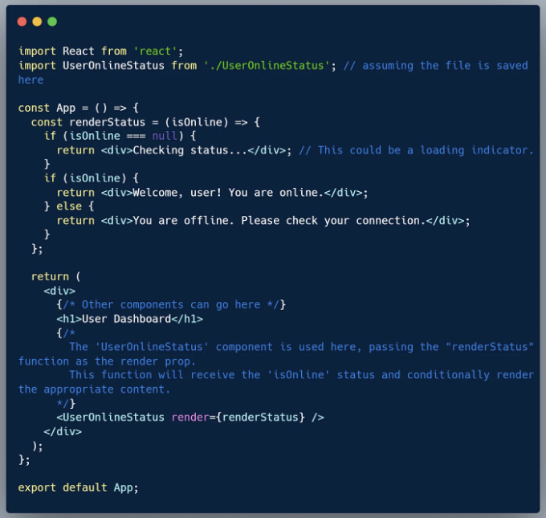

이 예제에서 UserOnlineStatus 컴포넌트는 사용자의 온라인 상태를 결정하지만 UI를 직접 렌더링하지는 않습니다. 그 대신 렌더링을 부모 컴포넌트(App)에서 전달된 함수(prop)인 렌더 프롭(render prop)에 위임합니다. 이 함수(renderStatus)는 온라인 상태를 가져와 이 정보에 따라 렌더링할 내용을 결정합니다.

## React에서 조건부 렌더링을 위한 최상의 관행

다양한 조건부 렌더링 기술을 이해하는 것이 중요하지만, React 애플리케이션에서 언제 어떤 기술을 사용해야 하는지 알아내는 것도 중요합니다. 여기에는 의사결정 프로세스를 이끌어낼 수 있는 몇 가지 최상의 관행이 있습니다:

<!-- ui-log 수평형 -->
<ins class="adsbygoogle"
  style="display:block"
  data-ad-client="ca-pub-4877378276818686"
  data-ad-slot="9743150776"
  data-ad-format="auto"
  data-full-width-responsive="true"></ins>
<component is="script">
(adsbygoogle = window.adsbygoogle || []).push({});
</component>

- If/Else 문: 단일 조건에 따라 컴포넌트를 렌더링하는 간단한 분기 로직에 전통적인 if/else 문을 사용하세요. 이 방식은 직관적이고 읽기 쉽습니다. 조건이 간단하고 한정적인 경우, if/else 문을 선택하는 것이 좋습니다.
- 삼항 연산자 (?): 삼항 연산자는 한 가지 조건에 따라 두 가지 컴포넌트 중 하나를 렌더링할 때 간결하고 효율적입니다. JSX를 깔끔하고 읽기 쉽게 유지하고 싶을 때 훌륭합니다.
- 논리 AND (&&): 조건이 참일 때에만 컴포넌트를 렌더링하고 싶을 때, 논리 AND 연산자를 청결하고 효율적인 선택입니다. 그러나 숫자나 빈 문자열과 같이 거짓일 수 있는 값과 관련된 경우 주의해야 합니다.
- 널 병합 연산자 (??): 널 병합 연산자를 사용하여 null 또는 정의되지 않은 피연산자에 대한 기본값을 제공하세요. 데이터가 누락되어도 컴포넌트가 깨지지 않도록 보장해야 할 때 특히 유용합니다. 이 기법은 데이터가 없을 때에도 견고한 렌더링을 보장합니다.
- Switch Case 문: 여러 조건이 다른 렌더링으로 이어지는 경우에 switch case 문을 사용하세요. 이 방식은 코드를 조직화하고 읽기 쉽게 유지하며, 여러 조건 분기가 있는 복잡한 시나리오에 우수한 선택지입니다.

특정 사용 사례에 대한 고급 기법:

- 에러 경계: JavaScript 오류를 정상적으로 처리하고 전체 응용 프로그램이 충돌하지 않도록 해야 하는 경우 에러 경계가 빛을 발합니다. 특정 컴포넌트 하위 트리에 대한 대체 UI 렌더링 및 조건부 렌더링이 필요한 경우 고려해보세요. 에러 경계는 오류에도 부드러운 사용자 경험을 유지하는 데에 도움이 됩니다.
- 고차 컴포넌트 (HOCs): HOCs는 컴포넌트 로직을 캡슐화하고 재사용하기에 효과적이며, 프로퍼티 또는 사용자별 조건에 따라 조건부 렌더링을 원하는 시나리오에서 뛰어납니다. 예를 들어 HOCs를 사용하여 프리미엄 사용자에게만 사용 가능한 기능을 렌더링할 수 있습니다. 컴포넌트 간에 로직을 공유하는 유연한 방법을 제공하며 코드베이스를 깔끔하게 유지할 수 있습니다.
- 렌더 프롭스: 렌더 프롭스 패턴은 렌더링을 세밀하게 제어하고 컴포넌트 간에 렌더링 로직을 공유해야 하는 경우에 적합합니다. 상태, 프로퍼티 또는 렌더 프롭 함수 내에 포함된 복잡한 로직에 기반한 UI의 다른 부분을 조건부로 렌더링해야 하는 시나리오에 적합합니다.

위의 모범 사례를 따르면 React 애플리케이션에서 조건부 렌더링을 구현할 때 신중한 결정을 내릴 수 있습니다. 각 기술에는 각각의 강점이 있으며, 적절한 기법을 선택하면 더 깨끗하고 유지보수가 쉬운 코드를 작성하고 더 나은 사용자 경험을 제공할 수 있습니다.

<!-- ui-log 수평형 -->
<ins class="adsbygoogle"
  style="display:block"
  data-ad-client="ca-pub-4877378276818686"
  data-ad-slot="9743150776"
  data-ad-format="auto"
  data-full-width-responsive="true"></ins>
<component is="script">
(adsbygoogle = window.adsbygoogle || []).push({});
</component>

## 조건부 렌더링에서의 유용한 팁, 트릭 및 흔한 함정들

리액트에서의 조건부 렌더링에 대한 풍경을 탐험하는 것은 처음 보기에는 간단해 보일 수 있습니다. 그러나 숙련된 개발자들은 이 여정이 오해되면 버그와 비효율적인 렌더링으로 이어질 수 있는 세부 사항들로 가득하다는 것을 알고 있습니다. 아래에는 주목해야 할 몇 가지 전문가용 팁과 흔한 함정이 소개되어 있습니다:

## 1. 삼항 연산자의 남용:

- 팁: 삼항 연산자 (condition ? true : false)는 간결함으로 유명하지만 복잡하고 중첩된 조건에서는 가독성을 해치기도 합니다. 간단한 조건에 사용하세요.
- 함정: 삼항 연산자를 중첩해서 사용하는 것을 피하세요. 이를 발견하면 별도의 구성 요소로 리팩터링하거나 if 문이나 특정 렌더링 함수를 사용하는 것이 더 적합한 접근 방식임을 나타냅니다.

<!-- ui-log 수평형 -->
<ins class="adsbygoogle"
  style="display:block"
  data-ad-client="ca-pub-4877378276818686"
  data-ad-slot="9743150776"
  data-ad-format="auto"
  data-full-width-responsive="true"></ins>
<component is="script">
(adsbygoogle = window.adsbygoogle || []).push({});
</component>

## 2. 논리 && 연산자의 남용:

- 팁: 논리 && 연산자는 조건이 true 일 때 컴포넌트를 깔끔하게 렌더링하는 좋은 방법입니다. 그러나 조건이 false 일 때 의도치 않게 렌더링되지 않도록 주의하세요. 특히 숫자 (0은 falsy)와 문자열에 대해 주의가 필요합니다.
- 함정: 숫자를 처리할 때 주의하세요. 예를 들어, {count && `Component /`}는 count가 0 일 때 `Component /`를 렌더링하지 못합니다. 왜냐하면 0은 JavaScript에서 falsy 값이기 때문입니다.

## 3. Nullish Coalescing Operator ??의 오용:

- 팁: nullish coalescing 연산자 (??)는 null 또는 undefined 값에 대한 대체 콘텐츠를 렌더링하고 싶을 때 사용하세요. 모든 falsy 값에 대해 사용하지 마세요.
- 함정: 논리 || 연산자와 혼동하지 마세요. expression 값 ?? alternative는 "value"가 null 또는 undefined일 때만 "alternative"를 보여주지만, value || alternative는 모든 falsy 값 (예: ``, 0, false)에 대해 "alternative"를 보여줍니다.

<!-- ui-log 수평형 -->
<ins class="adsbygoogle"
  style="display:block"
  data-ad-client="ca-pub-4877378276818686"
  data-ad-slot="9743150776"
  data-ad-format="auto"
  data-full-width-responsive="true"></ins>
<component is="script">
(adsbygoogle = window.adsbygoogle || []).push({});
</component>

## 결론

React에서 조건부 렌더링을 마스터하는 것은 동적이고 상호작용적인 사용자 인터페이스를 만들고자 하는 개발자들에게 필수적인 기술입니다. 이 안내서에서 다룬 개념과 기술을 잘 이해하면 React 프로젝트에서 복잡한 렌더링 문제에 대처할 준비가 될 것입니다. 즐거운 코딩하세요!