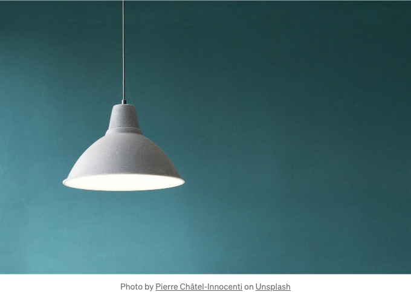

미니멀리즘은 우리가 하는 선택을 더 의식하고 자제하는 삶의 방식입니다.

시간과 에너지를 통제할 수 있는 강력한 삶의 방식입니다.

우리의 삶을 단순화함으로써, 우리는 작업을 더 효율적으로 처리하고 불필요한 작업으로부터 시간을 확보해 하루 중에서 최대한 많은 것을 이룰 수 있도록 도와줍니다. 그렇게 하면 스트레스를 적게 받고 더 많은 삶을 즐길 수 있게 됩니다.

<!-- ui-log 수평형 -->
<ins class="adsbygoogle"
  style="display:block"
  data-ad-client="ca-pub-4877378276818686"
  data-ad-slot="9743150776"
  data-ad-format="auto"
  data-full-width-responsive="true"></ins>
<component is="script">
(adsbygoogle = window.adsbygoogle || []).push({});
</component>

아래는 시간을 절약할 수 있는 아홉 가지 미니멀리즘 습관입니다:

한 번 살펴보겠습니다!

## 1.) 매일 한 가지 물건 버리기

게임 계획은 다음과 같습니다: 하루에 한 가지 항목을 골라보세요. 무거운 무게를 견디지 못하거나 기쁨을 주지 않거나 현재의 분위기와 어울리지 않는 항목을 버려보세요.

<!-- ui-log 수평형 -->
<ins class="adsbygoogle"
  style="display:block"
  data-ad-client="ca-pub-4877378276818686"
  data-ad-slot="9743150776"
  data-ad-format="auto"
  data-full-width-responsive="true"></ins>
<component is="script">
(adsbygoogle = window.adsbygoogle || []).push({});
</component>

그러면, 이제 이것을 작별하죠.

당신이 수락한다면 실행할 미션: 매일 한 가지씩 버림으로 초점을 맞춰보세요. 이것은 당신의 소지품을 위한 일일 클렌징과 같습니다.

왜냐하면, 솔직히 말해서 대부분의 사람들은 편안함과 가치를 약속하지만 종종 실망하게 하는 "물건"의 바다에 빠져 있기 때문입니다.

이러한 물건들에 작별을 공표할 때, 마법같은 변화가 일어납니다:

<!-- ui-log 수평형 -->
<ins class="adsbygoogle"
  style="display:block"
  data-ad-client="ca-pub-4877378276818686"
  data-ad-slot="9743150776"
  data-ad-format="auto"
  data-full-width-responsive="true"></ins>
<component is="script">
(adsbygoogle = window.adsbygoogle || []).push({});
</component>

- 당신의 공간은 평화와 조화의 오아시스로 변하며 닌자처럼 집중력과 정신적 명확성이 발휘됩니다.
- 갑자기, 당신은 소비하는 것에 대해 명심하게 되며 구매를 반성하며 중요한 질문을 던집니다: "이것이 내 인생에서 정말 필요하거나 가치 있는 것인가요?"

친구와 함께 친구와 함께 친밀한 경쟁으로 만들어 보고 싶지 않나요? 도전으로 만들어 보세요 - 하루를 건너뛴 첫 번째 사람이 지는 것입니다.

## 2.) 캡슐 워드로브 만들기

이렇게 상상해보세요: 간결하고 명확하게 선택된 옷장, 시즌 내지는 전체 연도 동안 매끄럽게 함께 작동할 수 있도록 신중하게 선택된 옷장.

<!-- ui-log 수평형 -->
<ins class="adsbygoogle"
  style="display:block"
  data-ad-client="ca-pub-4877378276818686"
  data-ad-slot="9743150776"
  data-ad-format="auto"
  data-full-width-responsive="true"></ins>
<component is="script">
(adsbygoogle = window.adsbygoogle || []).push({});
</component>

양보다는 질을 중시하는 게 중요해요. 옷장을 정리하고 매일 아침 스트레스 없이 준비하세용.

자, 이제 통계에 대해 이야기해볼까요? Marks & Spencer에 따르면, 평균 사람은 무려 17분을 매일 옷을 고르느라 소비한다고 해요. 하루에 4일 또는 단지 옷을 고르는 데 6개월의 시간을 보낼 정도랍니다.

생각도 못했죠?

그래서, 캡슐 코디로 넘어가 봅시다. 여기가 게임 플랜입니다:

<!-- ui-log 수평형 -->
<ins class="adsbygoogle"
  style="display:block"
  data-ad-client="ca-pub-4877378276818686"
  data-ad-slot="9743150776"
  data-ad-format="auto"
  data-full-width-responsive="true"></ins>
<component is="script">
(adsbygoogle = window.adsbygoogle || []).push({});
</component>

- 조각 수를 결정하세요 (25개에서 50개까지).
- 소유하고 있는 것들을 검토하세요.
- 멋진 컬러 팔레트를 선택하세요.
- 필수적이고 다용도로 사용할 수 있는 아이템은 유지하세요.
- 기준에 맞지 않는 것은 기부하세요.

### 3.) 고품질 제품 구매하기

돈에 관한 규칙에 대해 이야기해보죠. 저는 10가지 규칙을 지키는데, 여기에 Rule #3이 있습니다: "가장 좋은 것을 사서 최대한 오래 사용하세요."

믿으시기 어렵겠지만, 저렴한 제품은 거의 항상 더 비싵니다. 자세히 설명해드릴게요. 

<!-- ui-log 수평형 -->
<ins class="adsbygoogle"
  style="display:block"
  data-ad-client="ca-pub-4877378276818686"
  data-ad-slot="9743150776"
  data-ad-format="auto"
  data-full-width-responsive="true"></ins>
<component is="script">
(adsbygoogle = window.adsbygoogle || []).push({});
</component>

- 숨겨진 비용. 싸고 저렴한 제품은 종종 품질이 낮아서 자주 수리해야 할 수도 있어요. 반면에 고품질 제품은 오래 가는 것이 특징이며, 종종 보증 기간과 신뢰할 만한 고객 서비스를 제공해 일정한 수리 필요성을 줄여줘요.
- 성능은 중요해요. 가격이 저렴한 제품은 사양을 절약하여 일상 업무 효율성을 낮출 수 있어요. 고품질 제품은? 뛰어난 성능으로 더 부드럽고 생산적인 경험을 제공해줄 거예요.
- 빈번한 교체. 싸고 저렴한 제품은 빨리 마모되어 교체가 더 많이 필요해지며, 그 결과 시간이 지남에 따라 더 높은 비용을 초래할 수 있어요. 고품질 제품은 마모와 파손을 견뎌내며 장수하고 교체가 적어요.
- 고객 서비스. 저렴한 제품은 종종 부족한 지원을 제공하여 분노를 유발하고 소중한 시간을 낭비하게 해요. 고품질 제품은 신뢰할 수 있는 업체로부터 안정적인 고객 서비스를 받아요.

그럼, 동일 브랜드의 32개 옷장 아이템에 어떻게 적용될까요? 그들은 제일 싸지 않을 수도 있지만, 꾸준한 품질, 편안함, 그리고 장수에 투자하고 있어요.

확실히 처음에 더 많은 비용을 들였겠지만, 장기적으로는 현명한 재정적 선택이에요. 현명하게 투자하고 더 많이 절약하세요.

# 4.) 이메일 구독 취소

<!-- ui-log 수평형 -->
<ins class="adsbygoogle"
  style="display:block"
  data-ad-client="ca-pub-4877378276818686"
  data-ad-slot="9743150776"
  data-ad-format="auto"
  data-full-width-responsive="true"></ins>
<component is="script">
(adsbygoogle = window.adsbygoogle || []).push({});
</component>

평균적으로 하루 업무시간의 28%를 이메일 처리에 할애하고 있습니다. 하루에 약 120 통의 이메일을 다루며, 약 1시간에 11회 정도 이메일함을 확인하고 있습니다.

일반적인 업무일 동안 88회 확인하게 됩니다.

그럼, 이제 진짜 질문입니다: 당신의 이메일함은 가치를 더해주고 있는 건가요, 아니면 시간을 훔치고 있는 건가요? 조금 더 면밀히 살펴보는 시간입니다.

- 각 이메일마다, "이건 유용하고 필요한 내용인가요?"라고 물어보세요. 
- 만약 답이 '아니요'라면, 구독 취소 버튼을 눌러보세요.
- 이메일을 그냥 열어둔 채 두거나 삭제한다고 해결이 미루어지는 것은 아니니 가상 공간을 깨끗하게 유지하세요.

<!-- ui-log 수평형 -->
<ins class="adsbygoogle"
  style="display:block"
  data-ad-client="ca-pub-4877378276818686"
  data-ad-slot="9743150776"
  data-ad-format="auto"
  data-full-width-responsive="true"></ins>
<component is="script">
(adsbygoogle = window.adsbygoogle || []).push({});
</component>

구독 취소는 쓸모없는 이메일의 노예 사슬에서 해방시켜주어 진정으로 중요한 것에 집중할 수 있는 공간을 더 많이 제공합니다.

그러니 준비를 마치고 '구독 취소' 버튼을 클릭해보세요. 이메일 고통에서 자유롭게 되어 한 번에 한 번 클릭해보세요.

# 5.) 재정을 효율적으로 관리하세요

재정에 관한 마법 지팡이는 없지만 게임 체인저가 있습니다: 자동화입니다. 서커스 공연자처럼 빌을 넘기는 대신에 돈을 무겁게 들어주는 일을 돈을 하게 해줘서 멘탈 공간을 확보합시다.

<!-- ui-log 수평형 -->
<ins class="adsbygoogle"
  style="display:block"
  data-ad-client="ca-pub-4877378276818686"
  data-ad-slot="9743150776"
  data-ad-format="auto"
  data-full-width-responsive="true"></ins>
<component is="script">
(adsbygoogle = window.adsbygoogle || []).push({});
</component>

아니요, 완전 자율적인 방식을 취하지는 않을 거예요; 오히려 돌이킬 수도 있습니다. 아이디어는 모든 페니를 적극적으로 다뤄오던 방식에서 멀리서 지켜보는 방향으로 전환하는 겁니다.

여기가 해답입니다:

- 매월 결제를 자동화하세요.
- 사용하지 않는 구독을 중단하세요.
- 투자에 자동 기부를 설정하세요.
- 월급의 일부가 저축으로 손쉽게 이동하게 해보세요.

이런 마법이 어떻게 이루어질까요? 복잡한 스프레드시트는 잊어버리세요.

<!-- ui-log 수평형 -->
<ins class="adsbygoogle"
  style="display:block"
  data-ad-client="ca-pub-4877378276818686"
  data-ad-slot="9743150776"
  data-ad-format="auto"
  data-full-width-responsive="true"></ins>
<component is="script">
(adsbygoogle = window.adsbygoogle || []).push({});
</component>

왜 이게 중요할까요? 인식력입니다. 금융의 놀이터에 뛰어들기 전에, 땅의 구석구석을 이해해야 합니다.

가져야 할 정보를 습득하면 다음과 같은 금융 이동들을 자동화하고 조정할 수 있습니다:

- 청구서 납부일 통합
- 자동 납부 설정
- 예산 자동화

전체 공개: 제 금융 활동은 완전히 자동화되어 있습니다. 설정하고 잊어버리세요. 청구서부터 투자까지, 전략을 세우려고 하는데, 금융 관리와 잡히고 싶지 않아요.

<!-- ui-log 수평형 -->
<ins class="adsbygoogle"
  style="display:block"
  data-ad-client="ca-pub-4877378276818686"
  data-ad-slot="9743150776"
  data-ad-format="auto"
  data-full-width-responsive="true"></ins>
<component is="script">
(adsbygoogle = window.adsbygoogle || []).push({});
</component>

# 6.) 기기의 무기화 해제하기

우리의 믿음직한 친구인 휴대전화에 대해 이야기해봅시다 — 휴머니즘 없는 시간 낭비 마수가 될 수 있습니다. 이 거대 기술을 어떻게 무기화 해제할지 준비되셨나요?

전투 계획은 다음과 같습니다:

- 화면 시간 제한 설정: 몬스터를 제어하여 그가 먹잇감으로 사는 시간을 제한하세요.
- 그레이스케일 모드: 생동감 넘치는 색상의 매력을 줄이고 덜 매력적으로 만드세요.
- 비긴급 알림 비활성화: 주의를 요하는 알림을 중지시킵니다.
- 'one sec'와 같은 애플리케이션과 마찰 생성: 무책임하게 관여하는 데 약간 더 어렵게 만드세요.
- 시간 낭비 앱 삭제: 가치를 추가하지 않는 앱은 삭제하세요.
- 폴더에 앱 정리: 그들의 목적에 따라 정리하세요.
- 특정 앱에 대한 시간 제한 설정: 소셜 미디어 사용에 신중하게 대해주세요.
- '방해 금지' 모드 활용: 불필요한 알림을 조용히 합니다.
- 물리적 거리 유지: 필요하지 않을 때는 휴대전화를 멀리 둬주세요.

<!-- ui-log 수평형 -->
<ins class="adsbygoogle"
  style="display:block"
  data-ad-client="ca-pub-4877378276818686"
  data-ad-slot="9743150776"
  data-ad-format="auto"
  data-full-width-responsive="true"></ins>
<component is="script">
(adsbygoogle = window.adsbygoogle || []).push({});
</component>

개인적으로 나는 소셜 미디어에 대한 일일 시간 제한을 설정하고, 그것들을 폴더에 감추고, '방해 금지' 모드를 분별적으로 사용하고 있어. 우리의 핸드폰이 우리를 방해하는 것이 아니라 우리를 위해 일하도록 만들어 보자.

# 7.) 할 일 목록을 정리해보세요

사업가 Tim Collins가 말한 대로: "만약 세 가지 이상의 우선 순위가 있다면, 그것은 실제로 아무것도 없다는 뜻이다."

지금 세 가지는 매우 적어보일 수 있지만, 그 핵심은 매우 중요하다 - 우선 순위를 명확하게 유지하세요. 너무 많은 것을 한꺼번에 처리하면 노력을 흩뿌리는 위험이 높아질 수 있어.

<!-- ui-log 수평형 -->
<ins class="adsbygoogle"
  style="display:block"
  data-ad-client="ca-pub-4877378276818686"
  data-ad-slot="9743150776"
  data-ad-format="auto"
  data-full-width-responsive="true"></ins>
<component is="script">
(adsbygoogle = window.adsbygoogle || []).push({});
</component>

죽이는 투두 리스트를 만들어보세요:

- 간결하게 유지하세요 (3-6개 항목).
- 가장 중요한 것에 초점을 맞추세요.
- 일정에 통합하세요.

도움이 필요하다고요? 아이비 리 메소드를 활용해보세요. 여기에 간략히 정리한 버전이 있습니다:

- 내일을 위해 가장 중요한 6가지 작업을 나열하세요.
- 우선순위를 정하세요.
- 한 번에 한 가지씩 순서대로 처리하세요.
- 몇 가지가 남아 있다면 내일로 미루세요.

<!-- ui-log 수평형 -->
<ins class="adsbygoogle"
  style="display:block"
  data-ad-client="ca-pub-4877378276818686"
  data-ad-slot="9743150776"
  data-ad-format="auto"
  data-full-width-responsive="true"></ins>
<component is="script">
(adsbygoogle = window.adsbygoogle || []).push({});
</component>

# 8.) 2분 룰을 활용해보세요

2분 룰에 대해 들어봤나요? 이것은 게임 체인저입니다.

이것이 황금 규칙입니다: 작업이 2분 이내로 끝난다면, 지금바로 처리하세요. 왜냐하면 우리가 미룰수록 작업들은 거대한 산으로 변신하는 마법 같은 성향을 가지고 있기 때문이죠.

오늘은 우리의 에너지 수준, 작업량, 그리고 한계를 알고 있어서 운전대를 잡고 있습니다. 하지만, 내일은 알 수 없는 일이에요.

<!-- ui-log 수평형 -->
<ins class="adsbygoogle"
  style="display:block"
  data-ad-client="ca-pub-4877378276818686"
  data-ad-slot="9743150776"
  data-ad-format="auto"
  data-full-width-responsive="true"></ins>
<component is="script">
(adsbygoogle = window.adsbygoogle || []).push({});
</component>

잠 못 이루는 밤? 긴급 회의? 갑작스러운 병에 시달리는 중? 삶은 때로는 우리의 컬러 코드된 달력을 신경 쓰지 않고 펼쳐집니다.

그래서, 오늘 빨리 처리해야 할 작업들에 도전해 내일이 작은 일들의 연쇄로 침 몰리는 것을 막아보세요.

생산성의 배관을 자유롭게 유지하면서 중요한 일을 가리지 않는데 작은 할 일들의 무더기가 중요한 일들을 앙갚음 할 수 있으니까요.

## 9. 아이디어 수집 시스템 구축

<!-- ui-log 수평형 -->
<ins class="adsbygoogle"
  style="display:block"
  data-ad-client="ca-pub-4877378276818686"
  data-ad-slot="9743150776"
  data-ad-format="auto"
  data-full-width-responsive="true"></ins>
<component is="script">
(adsbygoogle = window.adsbygoogle || []).push({});
</component>

우리 마음 속을 Charlie의 초콜릿 공장 스타일로 관광할 수 있다면 어떨까요? 그것은 창조의 공장이며, 문제 해결 기계들과 창의력 프레스, 그리고 아이디어 프린터들이 북돋아 활동하는 곳입니다.

하지만 이런 점이 중요한데요: 우리의 '마음 공장'은 아이디어를 가지고 있는 곳이 아니라, 아이디어를 가지고 있기 위한 곳입니다. 아이디어를 계속해서 가지고 있다면 우리의 생산 능력이 방해받게 됩니다.

이런 재앙을 피하기 위해서는, 흥미롭고 활기차며 에너지를 주는 어떤 생각이든 잡아내세요. 어떻게요? Notion과 같은 도구나 핸드폰의 메모 앱을 사용해보세요.

# 결론

<!-- ui-log 수평형 -->
<ins class="adsbygoogle"
  style="display:block"
  data-ad-client="ca-pub-4877378276818686"
  data-ad-slot="9743150776"
  data-ad-format="auto"
  data-full-width-responsive="true"></ins>
<component is="script">
(adsbygoogle = window.adsbygoogle || []).push({});
</component>

여기 9가지 미니멀리스트 습관이 있습니다. 이것들은 여러분에게 시간을 절약해 줄 것입니다. 이 가이드의 예시와 정의가 미니멀리즘의 해방력을 받아들이는 데 도움이 되기를 바랍니다.