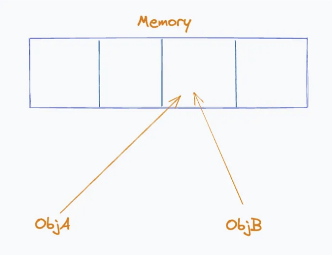
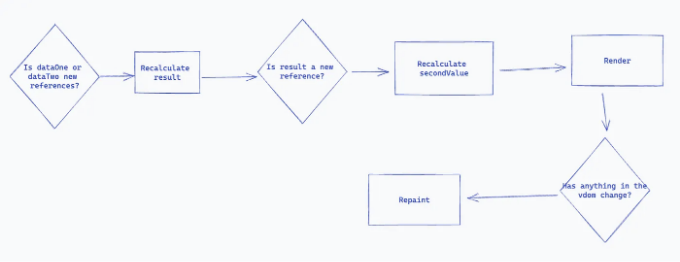
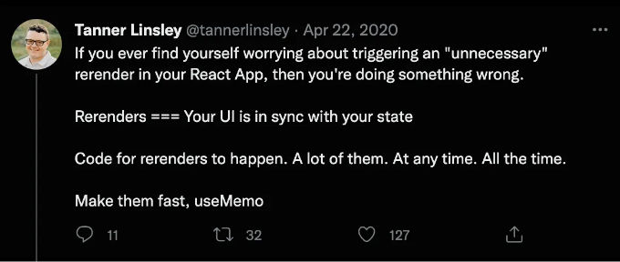

우선, 이 게시물은 Kent C. Dodds의 'When to useMemo and useCallback' 게시물에 기술된 사실에 대한 논점이 아닙니다. 대신, 이는 그것의 일반화된 적용에 대한 논점입니다. 특히, 이 글이 발표된 것을 실감할 수 있다는 것이 정말 미친 일이에요. 다른 글들은 못 봤지만요. 지난 3년 동안 회사들, 프로그래머들, 리뷰어들을 거치면서 가장 많이 인용된 글입니다. 조금이 아니라 기가 막히게!

그리고 보통 잘못 적용됩니다.

자세히 살펴보기 전에 원본 글을 꼭 읽기를 강력히 추천합니다. 정말 유용한 정보를 담은 훌륭한 글입니다. "반대" 주장이라고 부르기보다는 "이 정보는 좋지만..."에 더 가까운 주장입니다.

<!-- ui-log 수평형 -->
<ins class="adsbygoogle"
  style="display:block"
  data-ad-client="ca-pub-4877378276818686"
  data-ad-slot="9743150776"
  data-ad-format="auto"
  data-full-width-responsive="true"></ins>
<component is="script">
(adsbygoogle = window.adsbygoogle || []).push({});
</component>

너무 흔한 시나리오를 함께 살펴보자. 어느 날 직장에서 일하고 있는데, 미팅이 끝났다. 티켓에 즉시 착수할 수는 없는데 또 다음 미팅이 있어서 얼마 남지 않았다. 사실 한 시간이나 남았지만, 지금 거리적으로 너무 가깝다. 바로 무언가에 집중했다가 곧 멈춰야 할 것 같지 않으려고 한다.

동료가 슬랙에서 메시지를 보내와서 pull request를 스크럽할 때 도와달라고 한다. 그냥 승인을 해 달라는 거겠지만, 코드를 빠르게 훑어보기로 결정했고, 새로운 컴포넌트를 발견했다. 이렇게 생긴 것 같다:

```js
function List({items}) {
  const activateItem = () => {
  // 여기서 무언가를 실행
 };
  return(
    {items.map(item => 
      <Item onClick={activateItem}>{item.name}</Item>
    )}
  )
}
```
지나가면서 activateItem 함수에 주석을 달았다. 함수에 useCallback으로 감싸야 한다는 작성자에게 알려주는 내용이다. 코드를 계속 훑어보며 다른 부분을 발견했다.

<!-- ui-log 수평형 -->
<ins class="adsbygoogle"
  style="display:block"
  data-ad-client="ca-pub-4877378276818686"
  data-ad-slot="9743150776"
  data-ad-format="auto"
  data-full-width-responsive="true"></ins>
<component is="script">
(adsbygoogle = window.adsbygoogle || []).push({});
</component>

```js
function Body() {
  const {cats} = useCats();
  const catsWithLongFur = cats.filter(cat => cat.hasLongFur);
  return (<List items={catsWithLongFur} />);
}
```

쉽게 알아차릴 수 있는 곳이야, 개발자에게 catsWithLongFur 필터를 useMemo해야 한다는 것을 알려주는 편지를 추가한 거야.

피드백 완료! 그런데 안타깝게도, 동료가 다시 연락을 했다. 메시지 내용은 “네 피드백에 답변했어요”야.

저런. 

<!-- ui-log 수평형 -->
<ins class="adsbygoogle"
  style="display:block"
  data-ad-client="ca-pub-4877378276818686"
  data-ad-slot="9743150776"
  data-ad-format="auto"
  data-full-width-responsive="true"></ins>
<component is="script">
(adsbygoogle = window.adsbygoogle || []).push({});
</component>

이 시나리오는 여러 차례 발생했고, 거의 매번 답변은 같은 논란을 다룹니다. 동료로부터 useMemo 및 useCallback이 이러한 경우에는 필요하지 않다는 메시지를 받는 경우가 많은데, 이는 너가 일찍 최적화하려고 한다는 것이죠. 이러한 경우의 거의 90%에서는 상기한 Kent C. Dodds의 글이 추가 독서를 위해 링크됩니다.

당신은 어떤 쪽에 서 있나요? 그들이 옳은가요?

여기에 이 글의 문제점이 있습니다. Kenny D가 사용하는 대부분의 예는 매우 간단하지만, 이러한 유형의 예를 선택하는 것은 저자가 한 중요한 구분을 숨기는데 도움이 되기도 합니다. 그의 예들 중 어느 것도 다른 React 컴포넌트를 통과하지 않습니다. 두 예제 모두 "잎" 컴포넌트임을 알 수 있습니다. 여기서는 단순히 의미론적 HTML을 사용하고 다른 컴포넌트 대신에 사용하는 경우입니다. 그리고 이것은 합리적입니다. 이것은 간단한 안내서로 의도되었기 때문입니다. 그러나 이것은 구조적 문제를 숨기게 됩니다.

왜 이것이 중요한가요? 간단히 말하면, useMemo 또는 useCallback에는 실제로 두 가지 기능이 있습니다:


<!-- ui-log 수평형 -->
<ins class="adsbygoogle"
  style="display:block"
  data-ad-client="ca-pub-4877378276818686"
  data-ad-slot="9743150776"
  data-ad-format="auto"
  data-full-width-responsive="true"></ins>
<component is="script">
(adsbygoogle = window.adsbygoogle || []).push({});
</component>

- 최적화
- 참조 동등성

# 최적화

첫 번째 이유는 최적화입니다. `useMemo`를 사용한 명확한 예시입니다. 렌더링할 때마다 업데이트가 필요하지 않은 데이터에 대해 비싼 계산을 수행하는 경우, 데이터를 메모이징하는 것이 매우 편리할 수 있습니다.

다음 예시를 살펴보세요:

<!-- ui-log 수평형 -->
<ins class="adsbygoogle"
  style="display:block"
  data-ad-client="ca-pub-4877378276818686"
  data-ad-slot="9743150776"
  data-ad-format="auto"
  data-full-width-responsive="true"></ins>
<component is="script">
(adsbygoogle = window.adsbygoogle || []).push({});
</component>

```js
import { generate } from './utils';
import { useDataOne, useDataTwo } from './stores';
function Example() {
  const { dataOne } = useDataOne(); // Only queries on component init
  const { dataTwo } = useDataTwo(); // Only queries on component init
  const result = useMemo(() => generate(dataOne, dataTwo), [dataOne, dataTwo]);
  return (
    <div>
      {data.map(x => <div>{x.result}</div>
    </div>
  )
}
```

위의 generate 함수 호출을 메모이제이션했습니다. 해당 함수의 종속성이 거의 또는 전혀 변경되지 않을 것을 알기 때문입니다. 이렇게 하지 않았다면 구성 요소에 대한 변경이 발생할 때마다 계산이 다시 실행될 것입니다.

이제 위의 계산이 저렴하다면 메모이제이션을 사용하는 것이 이득이 없을 수도 있습니다. 또한 dataOne 또는 dataTwo가 업데이트마다 데이터를 다시 수집해야 하는 경우가 있을 수 있습니다. 이것이 발생하면 useMemo 호출의 종속성으로, 모든 렌더링이 generate 함수를 다시 실행하게 하므로 메모이제이션이 필요하지 않을 수 있습니다. React는 상당히 성능이 우수하며, 필요하지 않은 메모이제이션을 갖는 것은 코드의 성능 오버헤드와 복잡성을 둘 다 늘리는 것입니다.

그리고 위의 글이 그것에 대한 것입니다. 최적화가 가치 있는지 이해하고 거기서 선택을 하는 것입니다. 이것은 좋은 조언입니다. 그러나 우리가 이러한 리액트 훅을 사용하기로 결정하는 선택을 하는 데 고려해야 할 두 번째 요인이 있습니다.

<!-- ui-log 수평형 -->
<ins class="adsbygoogle"
  style="display:block"
  data-ad-client="ca-pub-4877378276818686"
  data-ad-slot="9743150776"
  data-ad-format="auto"
  data-full-width-responsive="true"></ins>
<component is="script">
(adsbygoogle = window.adsbygoogle || []).push({});
</component>

하지만 이 기사에서 언급되지 않은 것은 무엇일까요?

# 참조 동등성

먼저 간단한 용어로 참조 동등성이 의미하는 바를 설명한 후, 컴포넌트에 대한 의미와 대규모 응용 프로그램의 경우 인지해야 할 패턴을 확장해 보겠습니다. 참조 동등성은 두 개체가 메모리 상의 동일한 개체를 가리키는 것을 의미합니다. 아주 간단한 예제를 코딩해 보겠습니다.

```js
const objA = { test: 'hi' } 
const objB = { test: 'hi' }
objA === objB // false 값을 반환
```

<!-- ui-log 수평형 -->
<ins class="adsbygoogle"
  style="display:block"
  data-ad-client="ca-pub-4877378276818686"
  data-ad-slot="9743150776"
  data-ad-format="auto"
  data-full-width-responsive="true"></ins>
<component is="script">
(adsbygoogle = window.adsbygoogle || []).push({});
</component>


위의 예에서 objA와 objB 변수는 메모리의 두 개 다른 위치를 가리키고 있습니다. 우리 관점에서는 "같은" 객체처럼 보이지만, 참조적으로는 두 가지 다른 것이기 때문에 그들의 동일성을 테스트하려고 하면 false를 반환합니다. 만약 objA를 변경한다면, objB는 해당 변경을받지 않습니다. 반면에:

```js
const objA = { test: 'hi' } 
const objB = objA
objA === objB // true를 반환
```



<!-- ui-log 수평형 -->
<ins class="adsbygoogle"
  style="display:block"
  data-ad-client="ca-pub-4877378276818686"
  data-ad-slot="9743150776"
  data-ad-format="auto"
  data-full-width-responsive="true"></ins>
<component is="script">
(adsbygoogle = window.adsbygoogle || []).push({});
</component>

이 객체들은 동일하며 한 변수를 변경하면 다른 변수도 변경됩니다. 이러한 변수들은 메모리에서 동일한 곳을 가리키기 때문에 참조적으로 동일합니다. 이 유형의 동등성 확인을 사용하면 React 및 다른 많은 라이브러리에서 객체의 상태 변경을 추적하는 매우 간단하고 저렴한 방법입니다.

그렇다면 useMemo에 대해 말할 때 참조 동등성이 무엇을 의미하는 걸까요? 이전 예제를 기반으로 파생된 계산을 사용해보겠습니다:

```js
import { generate } from './utils';
import { useDataOne, useDataTwo } from './stores';
function Example() {
  const { dataOne } = useDataOne(); // 컴포넌트 초기화시에만 쿼리
  const { dataTwo } = useDataTwo(); // 컴포넌트 초기화시에만 쿼리
  const result = useMemo(() => generate(dataOne, dataTwo), [dataOne, dataTwo]);
  const secondValue = useMemo(() => data.filter(item => item.isValid), [data]);
  return (
    <div>
      {secondValue.map(x => <div>{x.result}</div>)}
    </div>
  );
}
```

그러니까, 의존성 배열에 익숙하지 않다면 해당 주제에 대해 깊이 파고든 다른 블로그 포스트가 있습니다. 그런데 위 예제에서 논리 체인이 다음 단계를 따릅니다:

<!-- ui-log 수평형 -->
<ins class="adsbygoogle"
  style="display:block"
  data-ad-client="ca-pub-4877378276818686"
  data-ad-slot="9743150776"
  data-ad-format="auto"
  data-full-width-responsive="true"></ins>
<component is="script">
(adsbygoogle = window.adsbygoogle || []).push({});
</component>



- dataOne 또는 dataTwo가 새로운 참조인가요 (즉, 메모리에서 동일한 위치를 가리키고 있나요)? 그렇다면 generate 메소드를 실행하여 결과를 다시 계산해주세요.
- result가 새로운 참조인가요 (즉, 위의 경우가 발생했나요)? 그렇다면 secondValue를 다시 계산해주세요.

이 예제에서 dataOne이 새로운 참조를 받는다면, 결과가 다시 계산되고 그 후 secondValue도 다시 계산됩니다. 이것은 예상된 동작입니다.

그러나 dataOne과 dataTwo가 참조를 변경하지 않는다면, 우리는 사실상 render 호출로 건너뛰어서 두 번의 계산을 건너뛸 수 있습니다. 그러나 이것이 무료거나 보장된 것은 아닙니다. 우리는 참조적 검사를 수행하여 이것이 우리가 원하는 동작인지 확인하고, 메모이제이션에 필요한 데이터를 유지 및 반환하고 있습니다. 언제든지 React가 이 메모이제이션이 저장된 메모리를 지울 수 있으므로 다시 계산될 수 있습니다. 이것이 언제 이득인지를 결정하는 것은 당신이 개발자로서 할 일입니다. 블로그에서 자세히 다루겠습니다.

<!-- ui-log 수평형 -->
<ins class="adsbygoogle"
  style="display:block"
  data-ad-client="ca-pub-4877378276818686"
  data-ad-slot="9743150776"
  data-ad-format="auto"
  data-full-width-responsive="true"></ins>
<component is="script">
(adsbygoogle = window.adsbygoogle || []).push({});
</component>

위치 대신에 마크다운 형식으로 표를 변경하십시오.

<!-- ui-log 수평형 -->
<ins class="adsbygoogle"
  style="display:block"
  data-ad-client="ca-pub-4877378276818686"
  data-ad-slot="9743150776"
  data-ad-format="auto"
  data-full-width-responsive="true"></ins>
<component is="script">
(adsbygoogle = window.adsbygoogle || []).push({});
</component>

💡 혹시 문자열, 부울 또는 숫자에 대해 이야기하지 않은 이유가 궁금할 수도 있습니다. 이러한 것들은 변경을 결정하는 데 참조적 동일성에 의존하지 않는 기본 유형들입니다. 7 === 7와 같이 매우 싼 등가성 확인으로 변경을 확인할 수 있기 때문입니다.

# 여러 구성 요소 간 최적화

함수/객체 참조가 변경되더라도 상위 구성 요소 예시가 다시 렌더링될 때, 자식 구성 요소 목록은 항상 다시 렌더링됩니다. 여기서 참조적 동일성을 유지하는 것은 자식의 렌더링을 제한하는 데 영향을 미치지 않습니다. 그럼에도 불구하고, 제 경험상 useMemo와 useCallback을 구현하는 가장 흔한 이유이거나 그 반대로 사용하지 말아야 하는 가장 흔한 이유 중 하나입니다.

useMemo 또는 useCallback이 자식 구성 요소의 다시 렌더링을 멈추는 유일한 경우는 자식 구성 요소가 React.memo 로 메모이제이션된 경우입니다 (또는 우리 부머들에게는 순수 구성 요소). 죄송합니다, React.memo는 메모이제이션의 다른 형태입니다 (메모 vs 메모이제 블로그 게시물을 읽고 싶다면 하나 더 있습니다) 약간만 논의해야 할 것이 있습니다. 코드에서 확인해 봅시다:

<!-- ui-log 수평형 -->
<ins class="adsbygoogle"
  style="display:block"
  data-ad-client="ca-pub-4877378276818686"
  data-ad-slot="9743150776"
  data-ad-format="auto"
  data-full-width-responsive="true"></ins>
<component is="script">
(adsbygoogle = window.adsbygoogle || []).push({});
</component>

```js
import { generate } from './utils';
import { useDataOne, useDataTwo } from './stores';
function Example() {
  const { dataOne } = useDataOne(); // Only queries on component init
  const { dataTwo } = useDataTwo(); // Only queries on component init
  const result = useMemo(generate(dataOne, dataTwo), [dataOne, dataTwo]);
 // const onChange = () => { //doSomething }
  return (
    <List items={data} />
  )
}
// This component only rerenders if the data object reference changes
const List = React.memo(({data}) => {
  return (
   <ul>
     {data.map(item => <li>{item.name}</li>)}
   </ul>
  )
})
```

위 예시에서 List 컴포넌트는 result가 변경될 때에만 다시 렌더링됩니다. 만약 useMemo를 사용하지 않았다면, React.memo와 관계없이 Example 컴포넌트의 각 렌더링마다 List 컴포넌트가 다시 렌더링되었을 것입니다. 왜냐하면 result는 항상 새로운 참조가 되기 때문입니다. React.memo 기능이 정확히 어떻게 작동하는 지에 대해 자세히 다루긴 시간이 없습니다 (또는 비슷한 PureComponent 클래스 기반의 대안). 하지만 저의 가장 좋은 제안은, 꼭 필요한 경우가 아니라면 사용하지 말아야 한다는 것입니다. Tanner Linsley의 이 트윗이 가장 잘 설명한다고 생각합니다. 선택의 여지가 주어졌을 때, 각 렌더가 속도를 최적화하는 것이 아니라 "불필요한" 렌더를 막아야 합니다.



그렇다면 useMemo와 useCallback을 사용하는 방법에 대한 우리의 사용 방식에 대해 어떤 의미가 있을까요? React.memo를 사용하지 않으려고 결정했으므로 최적화가 다시 렌더링을 중지하지는 않을 것입니다. 그렇다면 느린 계산을 최적화하는 용도로만 사용해야 할까요?

<!-- ui-log 수평형 -->
<ins class="adsbygoogle"
  style="display:block"
  data-ad-client="ca-pub-4877378276818686"
  data-ad-slot="9743150776"
  data-ad-format="auto"
  data-full-width-responsive="true"></ins>
<component is="script">
(adsbygoogle = window.adsbygoogle || []).push({});
</component>

답은 아니지만 중요한 점이 있어요. 일단 useCallback과 useMemo을 무시하지 말아야 하는 이유에 대해 최악의 시나리오를 살펴보고, 메모할 때 내가 일반적으로 따르는 절차를 마친 후에 우리가 왜 이 두 가지를 무시하지 말아야 하는지 살펴볼게요.

# 지뢰를 설치하지 마세요

그래서 문제를 일으킬 수 있는 매우 간단한 예제를 상상해봅시다. 이 문제를 인지할 수 있는지 확인할 거예요. 예제는 매우 인위적일 수 있지만, 간단한 문제가 얼마나 미끄럽게 발생할 수 있는지 캡쳐하는 것이 목표에요. 우리의 예제에서는 DataModal 컴포넌트를 만들어보는데, 이 컴포넌트는 일반적인 List 컴포넌트를 사용해 구현하는 것을 목표로 합니다.

```js
function useData() {
  return [{name: 'John'}, {name: 'Paul'}, {name: 'Ringo'}, {name: 'George'}]
}
function DataModal(props) {
  const {data} = useData();
  const { metric } = useMetrics();
  return (
    <div className={styles.modal}>
      <List items={data} />
  </div>
  )
}
```

<!-- ui-log 수평형 -->
<ins class="adsbygoogle"
  style="display:block"
  data-ad-client="ca-pub-4877378276818686"
  data-ad-slot="9743150776"
  data-ad-format="auto"
  data-full-width-responsive="true"></ins>
<component is="script">
(adsbygoogle = window.adsbygoogle || []).push({});
</component>

그리고 기본 List 컴포넌트:

```js
function List(props) {
  const { items, onChange } = props;
  return (
    <ul>
      {items.map(item => (<li>{item.name}</li>))}
    </ul>
  )
}
```

이제 몇 달 후에 다른 개발자가 새로운 기능을 받았습니다: 전달된 데이터를 대규모 데이터 세트로 매핑합니다. 이것은 명백히 간단하게 유지하기 위해 만들어졌지만, 이러한 일들이 발생합니다. 특히 아키텍처 결정이 여러 팀에 걸쳐 매우 분산된 대규모 응용프로그램에서는 많이 발생합니다. 그래서 그들은 다음과 같이하기로 결정했습니다:

```js
function List(props) {
  const { items, onChange } = props;
  const { selected, setSelected } = useState(null);
  const { urlParam } = useRouter();
  const { data } = useBigData();
 
  const dataSet = mapToLargeDataSet(items, data);
  return (
    <ul>
      {items.map(item => (<li onClick={onClick}>{item.song}</li>))}
    </ul>
  )
}
```

<!-- ui-log 수평형 -->
<ins class="adsbygoogle"
  style="display:block"
  data-ad-client="ca-pub-4877378276818686"
  data-ad-slot="9743150776"
  data-ad-format="auto"
  data-full-width-responsive="true"></ins>
<component is="script">
(adsbygoogle = window.adsbygoogle || []).push({});
</component>

하지만 그들은 빠르게 깨닫게 됩니다 — "이것은 비용이 많이 드는 계산이군요. memoization을 적용하겠어요" 하고 const dataSet = useMemo(() =` mapToLargeDataSet(items, data), [items, data])를 추가합니다. 그러나 여기 문제가 있습니다. items 객체는 매 렌더링마다 항상 다른 객체입니다. 개발자분들이 이를 알아차리기를 바라겠지만, 이제 데이터가 각 렌더링마다 변경되는지 알아내기 위해 상위 체인을 타고 올라가야 합니다. 소규모 팀에게는 사소한 문제처럼 보일 수 있지만, 대규모 기업 팀에서는 이 문제가 당신의 팀에게 있을 수도 있고, 더 나쁜 경우에는 이 변경을 지금 제안할 수 없을 수도 있습니다. 왜냐하면 다른 팀들이 지금이 문제에 의존하는지 확신할 수 없기 때문이죠.

이것은 데이터 메모이제이션 외에도 발생할 수 있습니다. 함수에 사이드 이펙트가 있는 경우를 상상해보세요:

```js
import { subscribeToExternalLibrary, unsubscribeToExternalLibrary} from 'someplace';
function Example({onChange}) {
  useEffect(() => {
    window.addEventListener('scroll', onChange);
      return () => {
        window.removeEventListener('scroll', onChange);
      };
  }, [onChange]);
  <button onClick={onChange}>Click me</button>
}
<Example onChange={() => console.log('hello')} />
```

위 예시에서는 함수를 useCallback으로 감싸지 않았기 때문에 실제로 매 렌더링마다 구독을 해제하고 다시 등록합니다. 효과가 사용되는 목적에 따라, 이것은 무한한 다시 렌더링을 유발하거나, 타사 라이브러리를 다시 초기화하게 할 수 있으며(일반적으로 이로 인해 오작동), 또는 지속적인 연결 재시도로 성능에 영향을 줄 수 있습니다.

<!-- ui-log 수평형 -->
<ins class="adsbygoogle"
  style="display:block"
  data-ad-client="ca-pub-4877378276818686"
  data-ad-slot="9743150776"
  data-ad-format="auto"
  data-full-width-responsive="true"></ins>
<component is="script">
(adsbygoogle = window.adsbygoogle || []).push({});
</component>

여러분은 아마도 이것을 보고 "이 useEffect가 추가되면 호출 함수를 useCallback으로 업데이트할 수 있다"고 생각할 수도 있습니다. 하지만 이런 생각은 피하는 편이 좋습니다. 코드베이스와 팀이 성장함에 따라 이런 유지 보수 작업은 더욱 비싸고 까다로워집니다. 더구나 몇몇 개발자가 이를 잘못된 방향으로 "의존"할 수도 있습니다. 과거 우리는 이를 지뢰를 설치한다고 언급했었습니다.

개발자는 부작용을 만들었거나 미래에 잘못된 부작용을 만들 수 있는 기회를 만들었습니다.

예를 들어, 위의 예제 컴포넌트에서 스크롤 효과가 없었다고 상상해보십시오. 이제 만약 누군가가 이 컴포넌트를 사용할 때 onChange을 useCallback으로 감싸지 않았고 다른 개발자가 그 스크롤 효과를 추가하기로 결정한다면, 그들은 이제 다른 기능을 망가뜨렸습니다. 그들이 인식하지 못한 기능입니다. 이것이 바로 지뢰를 설치하는 이유입니다.

# useCallback 또는 useMemo를 사용하는 시점

<!-- ui-log 수평형 -->
<ins class="adsbygoogle"
  style="display:block"
  data-ad-client="ca-pub-4877378276818686"
  data-ad-slot="9743150776"
  data-ad-format="auto"
  data-full-width-responsive="true"></ins>
<component is="script">
(adsbygoogle = window.adsbygoogle || []).push({});
</component>

그래서 문제가 우리 앞에 펼쳐졌습니다. useCallback과 useMemo를 적절히 적용해야 할 때의 흐름을 개요로 살펴보아야 합니다.

# useCallback 적용의 논리적 흐름

가장 간단하게 정의하는 것이 가장 쉽습니다. 언제 useCallback을 사용해야 하는지에 대한 흐름을 분석해봅시다. 처음에는 복잡해 보일 수 있지만, 이것은 간단히 따라가기 좋은 규칙들의 집합입니다.

<!-- ui-log 수평형 -->
<ins class="adsbygoogle"
  style="display:block"
  data-ad-client="ca-pub-4877378276818686"
  data-ad-slot="9743150776"
  data-ad-format="auto"
  data-full-width-responsive="true"></ins>
<component is="script">
(adsbygoogle = window.adsbygoogle || []).push({});
</component>

주요 목표는 언제나 자신에게 이 함수를 별도 파일로 분리하거나 컴포넌트 외부에 위치시킬 수 있는지 묻는 것입니다.

함수가 반드시 컴포넌트에 존재해야 하는 경우, 필요한 훅으로 함수를 격리할 수 있는지 여부를 고려할 수 있을까요? 기본적으로 우리는 코드를 깔끔하게 유지할 수 있는지 생각할 필요가 있습니다. 이 모든 접근법이 실패하면 useCallback으로 함수를 감싸야 합니다.

useMemo 흐름에서 볼 때, 우리는 성능에 대해 걱정하지 않습니다. 몇몇 사람들에게 혼란을 주는 부분이지만, 콜백의 메모이화된 버전을 생성하는 것은 성능에 영향을 미치지 않습니다. 그 목표는 다른 컴포넌트나 의존성 사이에서 참조 동등성을 유지하는 데 있습니다.

# useMemo 적용에 대한 논리적 흐름

<!-- ui-log 수평형 -->
<ins class="adsbygoogle"
  style="display:block"
  data-ad-client="ca-pub-4877378276818686"
  data-ad-slot="9743150776"
  data-ad-format="auto"
  data-full-width-responsive="true"></ins>
<component is="script">
(adsbygoogle = window.adsbygoogle || []).push({});
</component>

일반적인 논리적 흐름을 살펴보고 몇 가지 주요 영역에 대해 논의해 봅시다. 유의해야 할 점은 이것이 따라야 하는 정해진 규칙이 아니라는 것입니다. 대신, 메모이제이션하기 전에 따르는 일반적인 단계에 대해 어느 정도 통찰력을 제공해야 합니다. 메모이제이션 밖에서 문제를 해결할 수 있다면 기본적으로 그 방법을 따르는 것이 좋습니다. 그러니 함께 살펴보겠습니다:


# 계산이 재사용 가능한 훅에 있나요?

훅에서 데이터를 반환할 때 다른 개발자가 이를 어떻게 사용할 지 항상 고려해야 합니다.

<!-- ui-log 수평형 -->
<ins class="adsbygoogle"
  style="display:block"
  data-ad-client="ca-pub-4877378276818686"
  data-ad-slot="9743150776"
  data-ad-format="auto"
  data-full-width-responsive="true"></ins>
<component is="script">
(adsbygoogle = window.adsbygoogle || []).push({});
</component>

API를 디자인할 때 공감을 느끼며 배우는 것은 개발자가 습득할 수 있는 가장 강력한 기술 중 하나입니다.

만약 당신의 hook이 hook 내부에서 생성된 함수를 반환한다면, 이는 useCallback으로 감싸야 합니다. 마찬가지로, 객체는 렌더링 사이에 참조적으로 동일해야 하며 무언가가 변경되지 않는 한 그대로여야 합니다.

# 플랫하게 만들거나 선택하거나, 더 작용적인 컴포넌트를 만들 수 있을까요?

다른 컴포넌트로 props를 전달할 때 지양하는 방법은 객체를 전달하는 것입니다. 더 나은 컴포넌트 디자인으로 이를 해결할 수 있는 몇 가지 방법이 있습니다.

<!-- ui-log 수평형 -->
<ins class="adsbygoogle"
  style="display:block"
  data-ad-client="ca-pub-4877378276818686"
  data-ad-slot="9743150776"
  data-ad-format="auto"
  data-full-width-responsive="true"></ins>
<component is="script">
(adsbygoogle = window.adsbygoogle || []).push({});
</component>

- 의심의 여지없이, 가장 확실한 해결책은 컴포넌트를 더 구성 가능하게 만드는 것입니다. 컴포넌트가 자주 단말 컴포넌트(즉, 자식 요소를 수락하지 않는)인 경우, 컴포넌트 구조를 다시 생각해야 합니다. 구성 가능한 컴포넌트를 만드는 것은 책임을 상위 컴포넌트 체인으로 넘기고 흐름을 더 쉽게 읽을 수 있게 하며, 재사용 가능한 컴포넌트를 생성하는 데 도움이 됩니다.
- 컴포넌트 목록 내에서 결과 집합을 쿼리할 수 있나요? 이 작업은 react-query나 redux와 같은 다양한 라이브러리에서 수행할 수 있습니다.
- 데이터 집합을 매핑하고 각 항목을 컴포넌트로 전달하는 경우, 해당 데이터를 컴포넌트 속성으로 펼칠 수 있을까요? 이렇게 하면 데이터를 기본 유형으로 제한할 수 있어 참조적 동등성을 훨씬 쉽게 설정할 수 있습니다.
- 마찬가지로, 데이터 집합을 매핑하는 경우(2번과 유사한)에는 전달된 ID를 사용하여 데이터 저장소에서 각 항목을 가져올 수도 있습니다. 이 방법을 선호하는 사람도 있고, 싫어하는 사람도 있지만, 선택사항입니다.

# 결론: 공감을 갖고 API 디자인하기

실제 세계에서 Kent C Dodds의 기사와 같은 예를 들 때 가장 큰 도전 중 하나는 바로 그겁니다: 매우 작은 예입니다.

그는 긴 설명, 특이 케이스 및 매우 중요한 정보를 제외하여 기사를 간단하고 이해하기 쉽게 만들어야 했습니다. 사실, useMemo와 React.memo 간의 차이를 설명하려는 매우 큰 섹션으로 이 블로그를 처음에 썼습니다. 그러나 이러한 것들은 아주 강령이자 정보를 전달하는 데 잘라내어야 하는 부분입니다.

<!-- ui-log 수평형 -->
<ins class="adsbygoogle"
  style="display:block"
  data-ad-client="ca-pub-4877378276818686"
  data-ad-slot="9743150776"
  data-ad-format="auto"
  data-full-width-responsive="true"></ins>
<component is="script">
(adsbygoogle = window.adsbygoogle || []).push({});
</component>

그리고 당연히 그것이 작동했습니다. 이 기사는 게재된 이후 거의 매달 어떤 방식으로든 나에게 연결되며, 그 이유가 좋습니다. 이 주제에 대해 약간의 지식을 제공하는 환상적인 기사입니다. 그러나 더 큰 웹 애플리케이션으로 확장할 때, 해당 결정에는 미묘한 점이 있다는 것을 이해해야 합니다. 이 결정이 어떻게 앞으로 개발자들을 반영하는지 이해해야 하며, 때로는 최적화 선택 대신 DX(Developer Experience) 선택을 해야 합니다.

API를 설계할 때 목표는 프로세스를 Marie Kondo의 방식으로 처리하는 것입니다. 작동하는 API를 만드는 것뿐만 아니라 해당 API를 사용하는 개발자에게 기쁨을 줄 수 있는 것을 원합니다. 간단한 API를 만드는 것과 더 복잡한 프로세스에 대한 탈출구를 제공하는 사이에 놀라운 균형이 필요합니다. 이 기능을 언젠가 확장해야 할 수도 있다고 생각하면서도 중요한 경로에는 단축키가 필요하지 않도록 해야 합니다. 마지막으로, 목표 중 하나는 항상 함정을 피하는 API를 만드는 것이어야 합니다. 이러한 상황을 처리하고 싶은 이유는 언젠가 며칠, 몇 주, 몇 달, 아니면 몇 년이 지난 뒤 어떤 개발자가 문제와 함께 고민하며 시계를 보고 있을 것이라는 것입니다. 데모가 1시간 뒤에 있고, 제 페이지가 무한로딩되는 이유를 이해하려고 코드를 거슬러 올라가며 며칠을 보내고 있던 것입니다. 이것은 useCallback으로 함수를 감싸기를 귀찮아했기 때문일 것입니다.