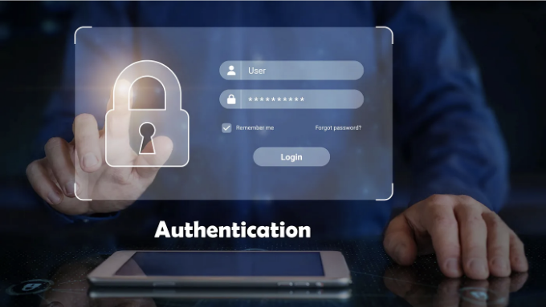
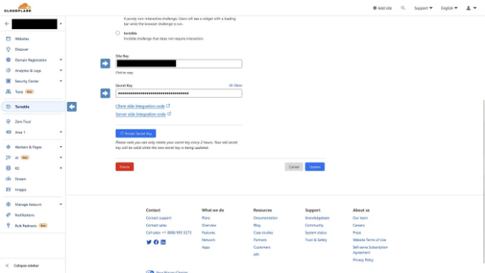

현재의 디지털 세계에서 보안이 최우선 사항인 만큼, 효과적인 인증 전략을 이해하고 구현하는 것은 웹 개발자에게 필수적입니다. 이 안내서는 Next.js 14에서의 인증에 대한 복잡성을 해결하기 위한 종합 가이드로, 귀하의 애플리케이션을 안전하고 사용자 친화적으로 만드는 것을 목표로 합니다.

먼저 JSON Web Tokens (JWT)을 사용하여 자격 증명을 안전하게 쿠키로 저장하는 방법을 알아보겠습니다. 이 방법은 보안을 강화하는 데 도움이 되는 동시에 세션 상태를 매끄럽게 유지함으로써 사용자 경험을 향상시킵니다. 그 다음으로, userData 객체를 쿠키로 저장하는 방법에 대해 논의할 것인데, 이 기술은 보안을 손상시키지 않고 공개 사용자 정보에 쉽게 액세스할 수 있게 합니다.

Next.js 14에서 JSON Web Tokens (JWT)을 활용하는 인증 시스템은 상당한 성능 이점을 제공합니다. 우리 애플리케이션의 미들웨어는 사용자의 브라우저에 쿠키로 저장된 JWT를 해독할 수 있습니다. 이 과정을 통해 우리는 데이터베이스를 계속해서 쿼리하지 않고도 빠르게 사용자 신원을 확인하고 액세스 권한을 부여할 수 있습니다. JWT에 의존함으로써 데이터베이스 요청의 수를 줄여 응답 시간을 단축하고 더 효율적인 애플리케이션을 만들 수 있습니다. 이 접근 방식은 성능을 향상시키는 것 뿐만 아니라 사용자 경험을 향상시켜 Next.js 애플리케이션을 더 반응적이고 확장 가능하게 만듭니다.

<!-- ui-log 수평형 -->
<ins class="adsbygoogle"
  style="display:block"
  data-ad-client="ca-pub-4877378276818686"
  data-ad-slot="9743150776"
  data-ad-format="auto"
  data-full-width-responsive="true"></ins>
<component is="script">
(adsbygoogle = window.adsbygoogle || []).push({});
</component>

미들웨어는 인증 시스템의 중심 요소이며, 인증이 필요한 경로를 보호하는 데 사용됩니다. 이를 구현함으로써 특정 애플리케이션 부분에 액세스할 수 있는 사용자가 인증된 사용자뿐임을 보장하여 민감한 정보와 사용자의 개인 정보를 보호할 수 있습니다.

또한, Cloudflare Turnstile을 통합하여 로그인 양식을 무차별 대입 공격에 대비합니다. Cloudflare Turnstile은 자동화된 위협을 감지하고 완화하는 데 사용되는 보안 도구로, 웹 양식의 일반적인 취약점인 무차별 대입 공격을 포함합니다. Turnstile을 배포함으로써, 합법적인 사용자와 악의적인 봇을 구별하여 뒷 배경에서 원활하게 작동하는 추가적인 보호층을 추가합니다.

마지막으로, 주기적으로 데이터베이스를 확인하여 사용자 계정이 여전히 활성 상태인지 확인하는 것의 중요성을 살펴볼 것입니다. 이 단계는 사용자 기반의 무결성을 유지하고 무단 액세스를 방지하는 데 중요합니다.

참고: Sequelize를 ORM으로 사용하는 보일러플레이트 스타터 앱을 만들었으며, 시더와 도커 구성 파일이 함께 제공됩니다. 링크는 아래에 있습니다.

끝.

<!-- ui-log 수평형 -->
<ins class="adsbygoogle"
  style="display:block"
  data-ad-client="ca-pub-4877378276818686"
  data-ad-slot="9743150776"
  data-ad-format="auto"
  data-full-width-responsive="true"></ins>
<component is="script">
(adsbygoogle = window.adsbygoogle || []).push({});
</component>

네, 코드로 들어가 봅시다!

## 종속 항목 설치

인증 전략을 구현하기 위해 몇 가지 종속 항목이 필요합니다:

- jose 라이브러리는 JWT 서명 및 해독을 간단하게 합니다.
- react-turnstile 라이브러리는 React용 CloudFlare Turnstile 컴포넌트입니다.

<!-- ui-log 수평형 -->
<ins class="adsbygoogle"
  style="display:block"
  data-ad-client="ca-pub-4877378276818686"
  data-ad-slot="9743150776"
  data-ad-format="auto"
  data-full-width-responsive="true"></ins>
<component is="script">
(adsbygoogle = window.adsbygoogle || []).push({});
</component>

이미 CloudFlare 계정이 없다면, 만들기를 강력히 추천합니다. 그들은 무수히 많은 무료 서비스를 제공하는데요, 그 중에는 Turnstile이라는 무료, 개인 정보 우선, 그리고 무엇보다 간단한 CAPTCHA 솔루션이 포함되어 있습니다.



## 우리의 JWT 시크릿 키 만들기

이제, 서버만 액세스 할 수 있는 시크릿 키를 생성해야 합니다. 일반적으로 키는 32바이트 길이여야 합니다. 보안이 확보된 랜덤 키를 생성하려면, 어떤 posix 환경에서라도 openssl 명령어를 사용할 수 있습니다.

<!-- ui-log 수평형 -->
<ins class="adsbygoogle"
  style="display:block"
  data-ad-client="ca-pub-4877378276818686"
  data-ad-slot="9743150776"
  data-ad-format="auto"
  data-full-width-responsive="true"></ins>
<component is="script">
(adsbygoogle = window.adsbygoogle || []).push({});
</component>

```js
openssl rand -base64 32
```

만약 Windows를 사용 중이라면, 동일한 작업을 수행하기 위해 노드를 사용할 수 있어요:

```js
node -e "console.log(require('crypto').randomBytes(32).toString('base64'))"
```

만약 Unix와 유사한 환경을 원하지만 Windows 사용자이신 경우 (제가 그렇기 때문에), 이전 글인 윈도우 및 Visual Studio Code에서 Unix와 유사한 터미널 환경을 설정하는 방법이라는 저의 이전 글을 꼭 확인해 보시기를 강력히 권해드립니다. 링크는 페이지 하단에 있어요.```

<!-- ui-log 수평형 -->
<ins class="adsbygoogle"
  style="display:block"
  data-ad-client="ca-pub-4877378276818686"
  data-ad-slot="9743150776"
  data-ad-format="auto"
  data-full-width-responsive="true"></ins>
<component is="script">
(adsbygoogle = window.adsbygoogle || []).push({});
</component>

중요사항: 이 키를 반드시 개인 유지하고 서버만 액세스할 수 있도록 보호해야 합니다. dotenv 공급업체를 사용하거나 안전한 위치에 보관할 수 있습니다. Next.js에서는 NEXT_PUBLIC 접두사 없이 설정해야 합니다. 그러나 키를 실수로 클라이언트에 노출시키면 공격자가 마음대로 로그인 자격 증명에 위조 키를 사용하여 플랫폼에 완전한 액세스권한을 얻을 수 있습니다!

그러나 이 공격이 발생해도 데이터베이스에 대한 보조적인 확인을 여전히 구현할 것입니다. 계속 읽어보세요.

최종 .env 파일은 다음과 같아야 합니다:

```js
TURNSTILE_SECRET_KEY="개인 비밀 키 입력"
NEXT_PUBLIC_TURNSTILE_SITE_KEY="사이트의 공개 키 입력"
JWT_SECRET="안전하게 생성된 32바이트 키 입력"
```

<!-- ui-log 수평형 -->
<ins class="adsbygoogle"
  style="display:block"
  data-ad-client="ca-pub-4877378276818686"
  data-ad-slot="9743150776"
  data-ad-format="auto"
  data-full-width-responsive="true"></ins>
<component is="script">
(adsbygoogle = window.adsbygoogle || []).push({});
</component>

## 도우미 함수 만들기

우선, 삶을 조금 더 쉽게 만들기 위해 도우미 함수를 만들어 보겠습니다:

다음은 userData 및 authPayload 객체의 유형입니다:

그리고 이것을 index.d.ts에 추가해 주세요:

<!-- ui-log 수평형 -->
<ins class="adsbygoogle"
  style="display:block"
  data-ad-client="ca-pub-4877378276818686"
  data-ad-slot="9743150776"
  data-ad-format="auto"
  data-full-width-responsive="true"></ins>
<component is="script">
(adsbygoogle = window.adsbygoogle || []).push({});
</component>

두 가지 다른 객체를 사용하는 이유는 authPayload 객체는 클라이언트로부터 수신 및 디코딩한 것이기 때문입니다. 우리는 이를 사용하여 데이터베이스를 쿼리하고 해당 데이터를 인증하고 쿠키로 저장합니다. userData 객체에는 JWT보다 훨씬 더 많은 정보(프로필 정보와 같은)가 포함되어 있습니다.

## 로그인 API 경로 생성하기

이제 로그인 양식을 위한 로그인 엔드포인트를 만들어봅시다:

개인적으로 ORM으로 sequelize를 사용합니다. 이를 설정하는 방법에 대해 자세히 설명하지는 않겠지만, 여기에는 제 구현에서 관련된 메서드들이 있습니다:

<!-- ui-log 수평형 -->
<ins class="adsbygoogle"
  style="display:block"
  data-ad-client="ca-pub-4877378276818686"
  data-ad-slot="9743150776"
  data-ad-format="auto"
  data-full-width-responsive="true"></ins>
<component is="script">
(adsbygoogle = window.adsbygoogle || []).push({});
</component>

## 미들웨어를 사용하여 라우트 보호하기

이제 src 디렉토리의 루트에 middleware.ts를 생성해야 합니다. 이 미들웨어는 모든 라우트 변경 시에 JWT를 확인할 것입니다. 우리 앱을 보호 및 공개 라우트로 나눌 것입니다.

중요: 로그인 양식과 인증 로그인 라우트를 보호된 디렉토리 외부에 유지하여 무한 루프가 생성되지 않도록해야 합니다. 제가 로그인 라우트를 src/app/auth에 유지합니다.

## 로그인 양식 만들기

<!-- ui-log 수평형 -->
<ins class="adsbygoogle"
  style="display:block"
  data-ad-client="ca-pub-4877378276818686"
  data-ad-slot="9743150776"
  data-ad-format="auto"
  data-full-width-responsive="true"></ins>
<component is="script">
(adsbygoogle = window.adsbygoogle || []).push({});
</component>

간략하게 하기 위해 로그인 폼을 만드는 방법에 대한 자세한 안내는 제공하지 않겠습니다. 이미 알고 있다고 가정합니다. 하지만 react-turnstile을 폼에 구현하는 방법은 다음과 같습니다:

참고: isLoading 상태가 false일 때에만 Turnstile을 조건부 렌더링합니다. 이렇게 하면 사용자가 잘못된 암호를 입력할 경우 Turnstile이 새로 고쳐지고 새 토큰이 생성됩니다. 토큰은 한 번만 사용할 수 있습니다.

## 앱 컨텍스트 만들기

일반적으로 앱에 클라이언트 컨텍스트를 만드는 것이 좋습니다. 이렇게 하면 인증 함수와 사용자 데이터에 사이트 전체에서 액세스할 수 있습니다. 이를 위해 React의 createContext API를 사용하겠습니다:

<!-- ui-log 수평형 -->
<ins class="adsbygoogle"
  style="display:block"
  data-ad-client="ca-pub-4877378276818686"
  data-ad-slot="9743150776"
  data-ad-format="auto"
  data-full-width-responsive="true"></ins>
<component is="script">
(adsbygoogle = window.adsbygoogle || []).push({});
</component>

이 문맥에서 중요한 기능은 loadUserDataFromServer 함수입니다. 이 함수는 데이터베이스에서 사용자를 가져와서 확인하는 엔드포인트를 핑합니다. 사용자가 여전히 존재하는지, 그리고 사용자가 여전히 액세스 권한이 있는지(차단되지 않았거나 활성화되지 않은지) 확인합니다. 사용자가 더 이상 액세스 할 수 없는 경우 API 경로에서 토큰 및 userData 쿠키를 삭제하여 사용자를 로그 아웃 처리합니다. 데이터범이 내려서 데이터베이스에 부하를 줄이기 위해 매 5분마다 이 작업을 수행합니다.

또한 이 작업을 비동기적으로 부작용으로 수행하므로 블로킹되는 fetch 요청을 만들지 않습니다.

여기 /api/auth 엔드포인트의 코드입니다:

그리고 궁금하신 분들을 위해 여기 sequelize 모델에서 관련 메서드 코드가 있습니다:

<!-- ui-log 수평형 -->
<ins class="adsbygoogle"
  style="display:block"
  data-ad-client="ca-pub-4877378276818686"
  data-ad-slot="9743150776"
  data-ad-format="auto"
  data-full-width-responsive="true"></ins>
<component is="script">
(adsbygoogle = window.adsbygoogle || []).push({});
</component>

## 로그아웃 엔드포인트 만들기

로그아웃은 쿠키를 삭제하는 것만큼 간단합니다:

## 결론

효율적인 사용자 인증을 위한 JWT 사용, 빠른 액세스를 위해 쿠키에 사용자 데이터를 저장하는 방법, 그리고 라우트 보호를 위한 사용자 정의 미들웨어의 중요성에 대해 다루었습니다. 또한, Cloudflare Turnstile 통합을 통해 로그인 양식을 무차별 공격으로부터 보호하여 보안을 크게 향상시킬 수 있는 방법도 살펴보았습니다.

<!-- ui-log 수평형 -->
<ins class="adsbygoogle"
  style="display:block"
  data-ad-client="ca-pub-4877378276818686"
  data-ad-slot="9743150776"
  data-ad-format="auto"
  data-full-width-responsive="true"></ins>
<component is="script">
(adsbygoogle = window.adsbygoogle || []).push({});
</component>

안녕하세요! 보안과 효율적인 인증에 대한 여정은 계속되고 끊임없이 진화하고 있습니다. 우리가 논의한 전략과 도구는 현재의 최상의 실천 방법을 선도하며, Next.js 애플리케이션에 견고한 기반을 제공합니다. 그러나 웹 보안의 세계는 변화무쌍하므로 최신 동향과 업데이트를 계속해서 파악하는 것이 중요합니다.

이 안내서가 여러분이 프로젝트에서 이러한 인증 기술을 구현하는 데 도움이 되길 바라며, 당신의 애플리케이션이 안전할 뿐만 아니라 사용자 친화적이기도 함을 보장합니다. 여러분의 사용 가능한 도구와 지식으로, 계속 발전하는 디지턈 위협에 당당히 맞설 수 있는 원활한 사용자 경험을 제공할 수 있게 되었습니다. 즐거운 코딩되세요!

## 더 많은 읽을거리

- 유닉스 스타일 터미널 환경 가져오기: Windows 및 Visual Studio Code에서
- Turnstile: Next.js / React에서 CloudFlare의 새로운 reCaptcha 대체품

<!-- ui-log 수평형 -->
<ins class="adsbygoogle"
  style="display:block"
  data-ad-client="ca-pub-4877378276818686"
  data-ad-slot="9743150776"
  data-ad-format="auto"
  data-full-width-responsive="true"></ins>
<component is="script">
(adsbygoogle = window.adsbygoogle || []).push({});
</component>

자원

- nextjs14-auth-sequelize-starter

제 글을 읽어 주셔서 감사합니다. 유용했기를 바랍니다 (적어도 조금이라도 즐거웠으면 좋겠어요). 웹 개발, 시스템 관리 및 클라우드 컴퓨팅에 대한 훌륭한 정보가 더 필요하시다면 Designly 블로그를 읽어보세요. 댓글도 남겨주세요! 제 독자들의 생각을 듣는 걸 좋아합니다.

만약 저를 지원하고 싶다면, Spotify에서도 팔로우해 주세요!

<!-- ui-log 수평형 -->
<ins class="adsbygoogle"
  style="display:block"
  data-ad-client="ca-pub-4877378276818686"
  data-ad-slot="9743150776"
  data-ad-format="auto"
  data-full-width-responsive="true"></ins>
<component is="script">
(adsbygoogle = window.adsbygoogle || []).push({});
</component>

웹 개발자를 찾고 계신가요? 저를 고용하실 수 있어요! 궁금한 점이나 문의사항이 있으시면 연락 양식을 작성해주세요.