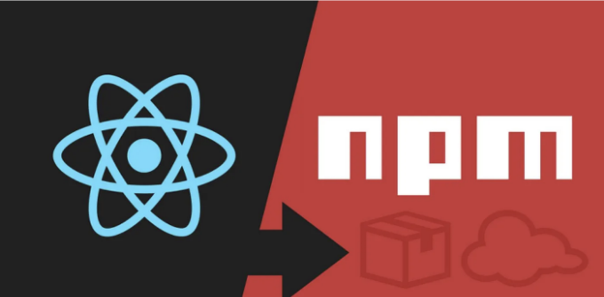

# 1. 리액트 앱 만들기

당신의 React npm 패키지를 위해 다음과 같은 파일 구조를 만드세요:

my-react-package/
├── src/
│ ├── components/
│ │ ├── MyComponent.js
│ ├── index.js 
│ └── styles.css
├── package.json
├── README.md
└── .gitignore

<!-- ui-log 수평형 -->
<ins class="adsbygoogle"
  style="display:block"
  data-ad-client="ca-pub-4877378276818686"
  data-ad-slot="9743150776"
  data-ad-format="auto"
  data-full-width-responsive="true"></ins>
<component is="script">
(adsbygoogle = window.adsbygoogle || []).push({});
</component>

# 2. 다음 내용으로 `package.json` 파일을 만들어주세요:

```js
{
  "name": "my-react-package",
  "version": "1.0.0",
  "description": "여러분의 React 패키지에 대한 설명",
  "main": "src/index.js",
  "scripts": {
    "build": "babel src -d dist",
    "prepublishOnly": "npm run build"
  },
  "keywords": ["react", "component", "npm"],
  "author": "여러분의 이름",
  "license": "MIT",
  "peerDependencies": {
    "react": "^16.0.0",
    "react-dom": "^16.0.0"
  }
}
```

# 3. 컴포넌트 만들기

컴포넌트 디렉토리에 새 파일을 만들고 컴포넌트 코드를 작성해주세요. 여기에 간단한 함수 기반 컴포넌트의 예시가 있습니다:

<!-- ui-log 수평형 -->
<ins class="adsbygoogle"
  style="display:block"
  data-ad-client="ca-pub-4877378276818686"
  data-ad-slot="9743150776"
  data-ad-format="auto"
  data-full-width-responsive="true"></ins>
<component is="script">
(adsbygoogle = window.adsbygoogle || []).push({});
</component>

```markdown
```js
import React from 'react';
const MyComponent=(props)=> {
  const {label} = props;
  return (
    <div>
      <button>{label}</button>
    </div>
  );
}
export default MyComponent;
```

## 4. `.gitignore` 파일 추가

루트 디렉토리에 `.gitignore` 파일을 추가하여 버전 관리에 커밋되지 말아야 할 파일 및 디렉토리를 지정합니다. `node_modules/` 및 `dist/` 같은 일반적인 항목을 포함할 수 있습니다.

## 5. babel 종속성 설치 및 `.babelrc` 파일 생성
```

<!-- ui-log 수평형 -->
<ins class="adsbygoogle"
  style="display:block"
  data-ad-client="ca-pub-4877378276818686"
  data-ad-slot="9743150776"
  data-ad-format="auto"
  data-full-width-responsive="true"></ins>
<component is="script">
(adsbygoogle = window.adsbygoogle || []).push({});
</component>

필요한 빌드 종속성이 설치되어 있는지 확인하세요. 다음 명령어를 실행하여 필요한 종속성을 설치할 수 있습니다: npm install — save-dev @babel/cli @babel/preset-env @babel/preset-react.

```js
{
 "presets": ["@babel/preset-react", "@babel/preset-env"]
}
```

.babelrc 파일에 preset을 추가하세요.

# 6. 패키지 빌드하기

<!-- ui-log 수평형 -->
<ins class="adsbygoogle"
  style="display:block"
  data-ad-client="ca-pub-4877378276818686"
  data-ad-slot="9743150776"
  data-ad-format="auto"
  data-full-width-responsive="true"></ins>
<component is="script">
(adsbygoogle = window.adsbygoogle || []).push({});
</component>

패키지를 빌드하려면 패키지의 루트 디렉토리에서 npm run build를 실행하세요. 이 작업은 Babel을 사용하여 React 컴포넌트를 변환하고 결과물을 `dist` 디렉토리에 배치할 것입니다.

# 7. 패키지를 게시합니다

게시하려면 루트 디렉토리에서 npm publish를 실행하세요. npm 계정이 있고 로그인되어 있는지 확인해주세요.

# 이를 React 프로젝트에서 사용하려면 다음 단계를 따르세요:

<!-- ui-log 수평형 -->
<ins class="adsbygoogle"
  style="display:block"
  data-ad-client="ca-pub-4877378276818686"
  data-ad-slot="9743150776"
  data-ad-format="auto"
  data-full-width-responsive="true"></ins>
<component is="script">
(adsbygoogle = window.adsbygoogle || []).push({});
</component>

- 프로젝트 디렉토리에서 다음 명령어를 사용하여 npm에서 발행된 컴포넌트를 설치하세요.

```js
npm install my-react-package
```

2. 컴포넌트를 가져와 사용하세요.

```js
import { MyComponent } from 'my-react-package';

const App = () =>{
return(
  <div>
   <MyComponent label={'제출하기'}/>
  </div>
 )
}
```

<!-- ui-log 수평형 -->
<ins class="adsbygoogle"
  style="display:block"
  data-ad-client="ca-pub-4877378276818686"
  data-ad-slot="9743150776"
  data-ad-format="auto"
  data-full-width-responsive="true"></ins>
<component is="script">
(adsbygoogle = window.adsbygoogle || []).push({});
</component>

3. 파일을 저장하고 React 애플리케이션을 실행합니다. 이제 게시된 컴포넌트가 앱 내에서 렌더링되어야 합니다.

계속 읽고 저와 제 팀을 팔로우하여 최신 기술 블로그를 업데이트 받아보세요.