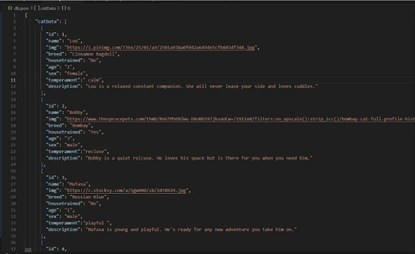
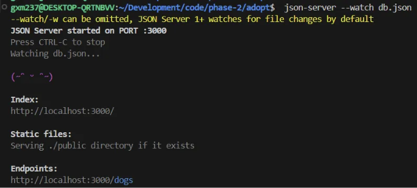
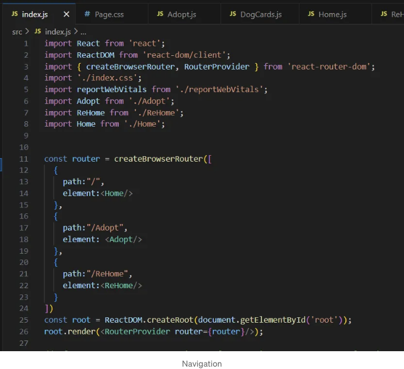
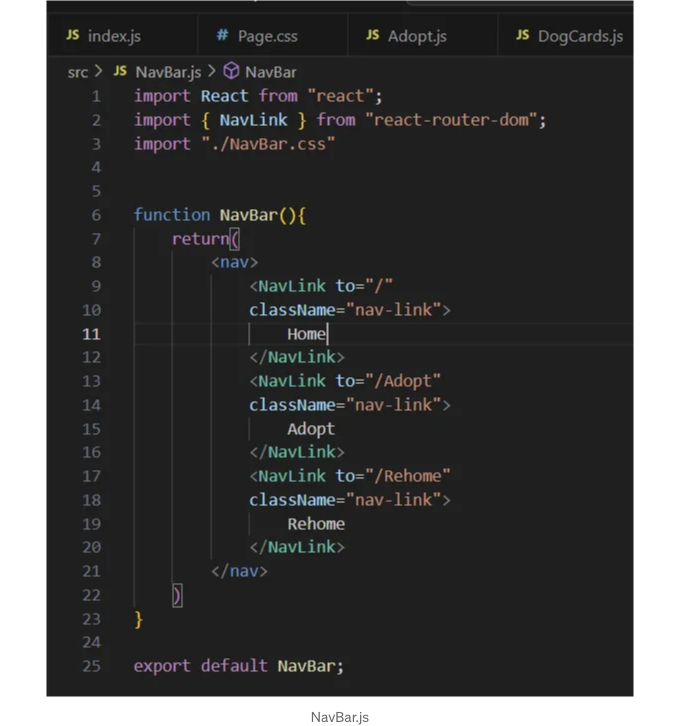
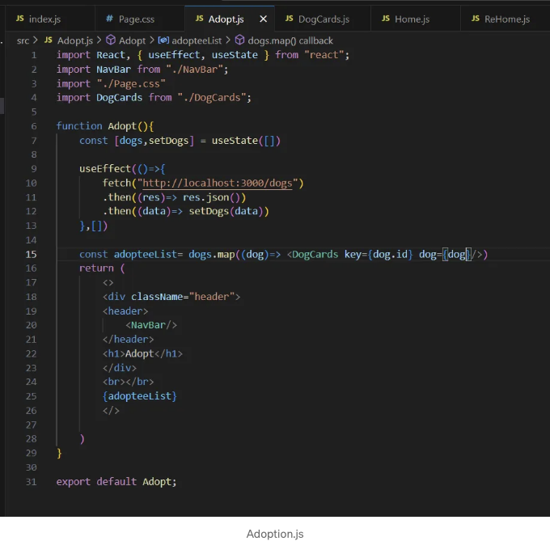
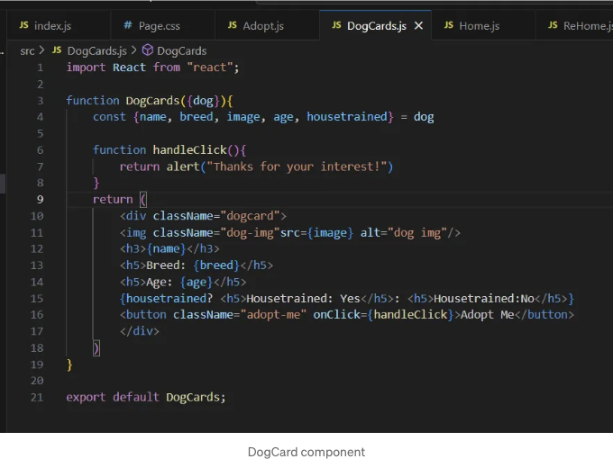

지난 두 달 동안은 멋진 학습 기회로 가득 찼습니다. 이번에는 React였어요. 제 프로젝트는 강아지 입양 앱을 만들었어요.

우분투를 열고 다음을 입력하여 시작했어요:

npx create-react-app your-app-name --use-npm

이 단계가 완료되면 JSON 파일을 만들었어요:

<!-- ui-log 수평형 -->
<ins class="adsbygoogle"
  style="display:block"
  data-ad-client="ca-pub-4877378276818686"
  data-ad-slot="9743150776"
  data-ad-format="auto"
  data-full-width-responsive="true"></ins>
<component is="script">
(adsbygoogle = window.adsbygoogle || []).push({});
</component>

db.json 파일을 만들어주세요.



db.json 파일을 설정한 후 다음 명령을 실행하세요:

```
json-server --watch db.json
```

<!-- ui-log 수평형 -->
<ins class="adsbygoogle"
  style="display:block"
  data-ad-client="ca-pub-4877378276818686"
  data-ad-slot="9743150776"
  data-ad-format="auto"
  data-full-width-responsive="true"></ins>
<component is="script">
(adsbygoogle = window.adsbygoogle || []).push({});
</component>

위의 메시지가 나타나면 좋겠어요:



db.json 파일은 제 API로 작동합니다. 여기서 내비게이션을 시작했어요. 할 일은 먼저 React Router를 다운로드하는 것인데요:

```bash
npm install react-router-dom@6
```

<!-- ui-log 수평형 -->
<ins class="adsbygoogle"
  style="display:block"
  data-ad-client="ca-pub-4877378276818686"
  data-ad-slot="9743150776"
  data-ad-format="auto"
  data-full-width-responsive="true"></ins>
<component is="script">
(adsbygoogle = window.adsbygoogle || []).push({});
</component>

버전 6을 사용 중입니다. 다른 버전을 사용 중이라면 약간 다를 수 있습니다.

그럼 index.js에서 라우터 변수를 만들었어요.



createBrowserRouter와 RouterProvider를 import해야 합니다. createBrowserRouter는 라우터를 만드는 데 사용되고, RouterProvider는 우리 애플리케이션을 위해 만든 라우터를 제공합니다. 라우터에서 우리는 이동할 수 있는 경로와 엘리먼트를 만들어요.

<!-- ui-log 수평형 -->
<ins class="adsbygoogle"
  style="display:block"
  data-ad-client="ca-pub-4877378276818686"
  data-ad-slot="9743150776"
  data-ad-format="auto"
  data-full-width-responsive="true"></ins>
<component is="script">
(adsbygoogle = window.adsbygoogle || []).push({});
</component>

다음으로 내 내비게이션 바를 만들었습니다.



'React'에서 React를 import하고, 'react-router-dom'에서 NavLink를 import하고, 스타일링 CSS를 import하는 것을 잊지 마세요. 여기서 모든 페이지에서 접근할 수 있는 링크를 제공합니다. NavLink는 href 속성처럼 작동하지만 클릭했을 때 사용자를 이동시킬 링크의 엔드포인트를 to= prop을 사용하여 지시합니다.

이제 채용 페이지로 넘어가보겠습니다.

<!-- ui-log 수평형 -->
<ins class="adsbygoogle"
  style="display:block"
  data-ad-client="ca-pub-4877378276818686"
  data-ad-slot="9743150776"
  data-ad-format="auto"
  data-full-width-responsive="true"></ins>
<component is="script">
(adsbygoogle = window.adsbygoogle || []).push({});
</component>



먼저, 필요한 컴포넌트를 가져오는 것으로 시작합니다. 이 페이지의 목표는 처음로드될 때 입양을 위해 제공된 개를 표시하는 것입니다. useState()를 사용하여 개 변수의 변경 사항을 추적합니다. 그런 다음, useEffect()를 사용하여 fetch 요청을 생성합니다. useEffect() 없이는 fetch가 무한히 실행됩니다. 빈 대괄호 []는 useEffect()가 로드될 때만 실행하도록 지시합니다. fetch GET 요청은 소스에서 객체 배열을 가져와 작동합니다. 이 경우에는 json 파일에서 정보를 요청합니다. 그런 다음 해당 정보가 res.json()에서 다시 포맷됩니다. 이제 시스템은 json 파일에서 수집한 정보를 올바르게 사용할 수 있습니다. useState() 훅으로 돌아가서, fetch에서 얻은 객체 배열을 개로 설정합니다. fetch GET 요청에서 개 데이터를 가져오면 각 개 객체를 .map()하여 DogCards 컴포넌트를 사용하여 카드를 만들 수 있습니다. .map()에서 DogCard로 정보를 전달할 때 key를 포함했음을 주목하세요. React에서 배열을 매핑할 때는 각 개체를 추적하기 위해 key를 사용해야 합니다. 최상의 키는 각 객체에 고유한 ID이기 때문에 ID를 선택하는 것이 좋습니다. ID가 없는 경우에는 이름과 같은 고유한 특성을 선택하십시오.



이 컴포넌트에서는 개 객체를 이름, 종, 이미지, 나이 및 훈련 여부로 구조화하여 정리했습니다. 이 정보를 사용하여 각 개 카드를 작성할 필요한 변수를 가져옵니다. 위의 db.json 파일에서, 훈련 여부는 true 또는 false 값으로 표시됩니다. 조건부 렌더링을 사용해야 했습니다. 훈련 여부가 true이면 Housetrained: Yes라는 h5를 반환하고, 그렇지 않으면 Housetrained: No라는 h5가 나타납니다.

<!-- ui-log 수평형 -->
<ins class="adsbygoogle"
  style="display:block"
  data-ad-client="ca-pub-4877378276818686"
  data-ad-slot="9743150776"
  data-ad-format="auto"
  data-full-width-responsive="true"></ins>
<component is="script">
(adsbygoogle = window.adsbygoogle || []).push({});
</component>

마지막 단계는 폼 구성 요소를 생성하는 것입니다.

이 단계에는 더 많은 작은 단계가 있습니다. 먼저, useState()를 사용하여 폼에서 받은 정보를 추적합니다. 그리고 각 입력 필드는 값이 변경되는 방식을 알려주어야 합니다. 저는 전반적인 handleChange 함수를 만들어서 입력이 텍스트인지 체크박스인지를 확인하도록 했습니다. 그 다음, 입양 목록에 새로운 강아지를 추가하는 방법이 필요합니다. 이 문제를 해결하기 위해 fetch POST를 생성합니다. 이것은 우리의 GET 요청과 비슷하지만 이제 데이터를 보내고 있습니다. 먼저, 새 데이터를 보낼 위치를 fetch에 알려줍니다. 그런 다음 fetch 요청이 데이터를 가져 오는 것이 아니라 데이터를 보내는 것이라는 것을 알려줍니다. 두 번째 .then()에서는 이 페이지에 새로운 정보를 표시하지 않기 때문에 console.log를 유지하고 데이터와 특별히 처리할 것이 없습니다. handleSbumit 함수 내에 fetch가 있기 때문에 제출할 때 두 번째 .then()에서 navigate를 사용하여 페이지가 자동으로 Adopt 페이지로 다시 이동하도록합니다.

놀랍게도, React는 새로운 가능성을 제공하는 것 같습니다. React는 JSX를 사용하여 코드를 어떻게 변환해야 하는지 자동으로 파악하므로 .addEventListener()나 document.querySelector()와 같은 것들을 수동으로 하나씩 추가해야 하는 수고를 덜 수 있습니다.