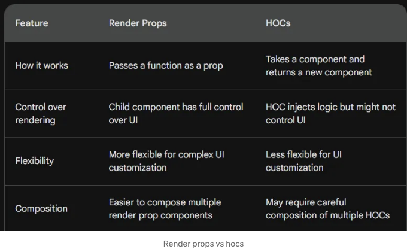

# 렌더 프롭스와 고차 컴포넌트 (HOCs)

# 소개

복잡한 리액트 애플리케이션을 구축하는 것은 종종 코드 재사용성과 관심사 분리에 도전할 수 있습니다. 우리는 다른 컴포넌트 간에 유사한 코드 조각을 작성하는 상황에 직면할 수 있습니다. 이는 코드베이스가 혼잡해지고 변경 사항을 유지하기 어렵게 만들 수 있습니다.

<!-- ui-log 수평형 -->
<ins class="adsbygoogle"
  style="display:block"
  data-ad-client="ca-pub-4877378276818686"
  data-ad-slot="9743150776"
  data-ad-format="auto"
  data-full-width-responsive="true"></ins>
<component is="script">
(adsbygoogle = window.adsbygoogle || []).push({});
</component>

여기서는 React에서 코드의 재사용성과 관심사의 분리를 촉진하는 두 가지 강력한 패턴인 Render Props와 Higher-Order Components (HOCs)를 살펴보겠습니다.

# Render Props

Render Props란 무엇인가요?

Render Props는 함수를 prop으로 컴포넌트에 전달하는 것을 의미합니다. 이 함수는 부모 컴포넌트로부터 데이터나 prop을 받아와 해당 데이터를 기반으로 UI를 렌더링하는 역할을 합니다. 본질적으로 부모 컴포넌트는 렌더링 로직을 render prop을 통해 자식 컴포넌트에 위임합니다.

<!-- ui-log 수평형 -->
<ins class="adsbygoogle"
  style="display:block"
  data-ad-client="ca-pub-4877378276818686"
  data-ad-slot="9743150776"
  data-ad-format="auto"
  data-full-width-responsive="true"></ins>
<component is="script">
(adsbygoogle = window.adsbygoogle || []).push({});
</component>

Render Props의 장점:

- 유연성: Render Props를 사용하면 UI를 렌더링하는 방법에 대해 최대한 유연하게 조절할 수 있습니다. 자식 컴포넌트는 렌더링 로직을 완전히 제어할 수 있습니다.
- 조립성: Render Props는 코드 조립을 장려합니다. 여러 Render Props 컴포넌트를 쉽게 결합하여 더 복잡한 UI 요소를 구축할 수 있습니다.

예: Render Props로 사용자 지정 Form 컴포넌트

렌더 프롭 함수를 허용하는 사용자 정의 Input 컴포넌트를 상상해보세요. 이 함수는 현재 값과 onChange 핸들러를 props로 받습니다. 자식 컴포넌트는 이를 기반으로 입력 요소 (텍스트, 선택 등)를 사용자 정의할 수 있습니다.

<!-- ui-log 수평형 -->
<ins class="adsbygoogle"
  style="display:block"
  data-ad-client="ca-pub-4877378276818686"
  data-ad-slot="9743150776"
  data-ad-format="auto"
  data-full-width-responsive="true"></ins>
<component is="script">
(adsbygoogle = window.adsbygoogle || []).push({});
</component>

```js
import React, { useState } from "react";

// 입력 로직을 위한 별도의 컴포넌트
const InputLogic = ({ value, onChange, onKeyPress }) => {
  const handleKeyDown = (e) => {
    if (e.key === "Enter") {
      onKeyPress?.(); // Enter 키를 눌렀을 때의 옵셔널 콜백
    }
  };

  return (
    <div>
      <input
        type="text"
        value={value}
        onChange={onChange}
        onKeyDown={handleKeyDown}
        placeholder="이름을 입력하세요"
      />
    </div>
  );
};

// 렌더 프롭을 사용하는 입력 컴포넌트
const Input = ({ value, onChange, render }) => {
  return render({ value, onChange, InputLogic });
};

const WelcomeMessage = ({ name, ...otherProps }) => (
  name && <p {...otherProps}>환영합니다, {name}님!</p>
);

const App = () => {
  const [name, setName] = useState("");
  const [nameEntered, setNameEntered] = useState(false);

  const handleNameChange = (e) => setName(e.target.value);

  const handleKeyPress = () => {
    setNameEntered(true);
  };

  const handleDelete = () => {
    setName("");
    setNameEntered(false);
  };

  const handleEdit = () => {
    setNameEntered(false);
  };

  const renderInput = () => (
    <form>
      <Input
        value={name}
        onChange={handleNameChange}
        render={({ value, onChange, InputLogic }) => (
          <InputLogic value={value} onChange={onChange} onKeyPress={handleKeyPress} />
        )}
      />
    </form>
  );

  const renderWelcomeMessage = () => (
    <WelcomeMessage name={name} style={{ color: "green" }} /> // WelcomeMessage에 대한 추가 속성 예시
  );

  return (
    <div>
      {nameEntered ? (
        <>
          {renderWelcomeMessage()}
          <button onClick={handleDelete}>삭제</button>
          <button onClick={handleEdit}>편집</button>
        </>
      ) : (
        renderInput()
      )}
    </div>
  );
};

export default App;
```

여기서 MyForm 컴포넌트는 Input 컴포넌트를 렌더 프롭 함수와 함께 사용하여 실제 입력 요소와 해당 동작을 정의합니다.

# 고차 컴포넌트 (HOC)

HOC는 무엇인가요?```

<!-- ui-log 수평형 -->
<ins class="adsbygoogle"
  style="display:block"
  data-ad-client="ca-pub-4877378276818686"
  data-ad-slot="9743150776"
  data-ad-format="auto"
  data-full-width-responsive="true"></ins>
<component is="script">
(adsbygoogle = window.adsbygoogle || []).push({});
</component>

고차 컴포넌트(Higher-Order Components, HOCs)는 컴포넌트를 가져와서 새로운 컴포넌트를 반환하는 함수입니다. 새 컴포넌트는 원래 컴포넌트의 기능을 상속받고 추가적인 기능을 추가할 수도 있습니다. HOCs는 컴포넌트를 감싸서 공통 로직이나 동작을 삽입하는 방법입니다.

HOCs의 장단점:

- 장점: 공통 로직을 별도의 HOC에 캡슐화하여 코드 재사용성을 촉진합니다.
- 단점: 사용에 조심하지 않으면 복잡한 컴포넌트 계층 구조와 잠재적인 네이밍 충돌을 일으킬 수 있습니다.

예시: 인증을 위한 withAuth HOC

<!-- ui-log 수평형 -->
<ins class="adsbygoogle"
  style="display:block"
  data-ad-client="ca-pub-4877378276818686"
  data-ad-slot="9743150776"
  data-ad-format="auto"
  data-full-width-responsive="true"></ins>
<component is="script">
(adsbygoogle = window.adsbygoogle || []).push({});
</component>

withAuth HOC를 만들어서 래핑된 컴포넌트를 렌더링하기 전에 사용자 인증을 확인하는 방법을 알아보겠습니다:

```js
const withAuth = (WrappedComponent) => (props) => {
  const isAuthenticated = useAuthHook(); // 가정한 인증 훅 사용

  return isAuthenticated ? <WrappedComponent {...props} /> : <Redirect to="/login" />;
};

// 사용 예시
const MyProtectedPage = () => {
  return (
    <div>
      <h1>보호된 페이지에 오신 것을 환영합니다!</h1>
    </div>
  );
};

const AuthProtectedPage = withAuth(MyProtectedPage);
```

여기서 withAuth HOC는 컴포넌트(MyProtectedPage)를 가져와 인증을 확인한 후 원본 컴포넌트를 렌더링하기 전 새로운 컴포넌트를 반환합니다.

# 비교: 렌더 프롭스 vs HOCs

<!-- ui-log 수평형 -->
<ins class="adsbygoogle"
  style="display:block"
  data-ad-client="ca-pub-4877378276818686"
  data-ad-slot="9743150776"
  data-ad-format="auto"
  data-full-width-responsive="true"></ins>
<component is="script">
(adsbygoogle = window.adsbygoogle || []).push({});
</component>

Both render props and HOCs promote code reusability. Here’s a breakdown of their key differences:



Choosing the Right Approach:

- Use render props when you need fine-grained control over the UI rendering within the child component.
- Use HOCs when you want to inject common logic or behavior without modifying the wrapped component’s UI structure too much.

<!-- ui-log 수평형 -->
<ins class="adsbygoogle"
  style="display:block"
  data-ad-client="ca-pub-4877378276818686"
  data-ad-slot="9743150776"
  data-ad-format="auto"
  data-full-width-responsive="true"></ins>
<component is="script">
(adsbygoogle = window.adsbygoogle || []).push({});
</component>

선택은 종종 특정 사용 사례와 UI 렌더링에 대한 희망하는 제어 수준에 따라 달라집니다.

## 여기는 주방 비유를 사용한 요약입니다

주방을 짓고 있는 상상을 해보세요.

- 기본 React 패턴은 개별 재료(속성)를 사용하고 간단한 레시피(컴포넌트 조합)를 따라 작은 요리를 만드는 것과 같습니다. 이것은 기본 식사(소규모 프로젝트)에 적합합니다.
- 그러나 대규모 축제(복잡한 애플리케이션)를 위해서는 그것이 엉망이 됩니다! 동일한 재료(데이터)를 많은 요리사(컴포넌트)에게 전달해야 할 수도 있습니다. 이는 프롭스 드릴링이며 이는 레시피(코드)를 이해하고 업데이트하기 어렵게 만듭니다.
- 고급 React 패턴은 고급 조리 기술과 같습니다. 이것들은 대규모 식사를 위한 더 나은 주방(애플리케이션) 구축을 도와줍니다.
- 렌더 프롭스: 쉐프(컴포넌트)가 다른 쉐프에게 요리 일부를 준비하는 방법에 대한 특별한 지시(함수)를 제공하는 것과 같습니다. 이렇게 하면 쉐프들이 혼란스럽지 않고 지시사항(코드)을 공유할 수 있습니다. 이것은 요리(컴포넌트) 사이에서 복잡한 레시피(로직 또는 데이터)를 공유하는 데 좋습니다.
- 고차 컴포넌트(HOC): 어떤 요리(컴포넌트)에 추가적인 맛(기능)을 주기 위해 어떤 특별 제조 스파이스 믹스(HOC)를 추가할 수 있는 것을 상상해보세요. 이러한 스파이스 믹스는 여러 요리에서 재사용할 수 있습니다. 이것은 많은 요리(컴포넌트)에 소금(보안)이나 미리 채취된 야채(데이터 가져오기)와 같은 공통 기능을 추가하는 데 좋습니다.

<!-- ui-log 수평형 -->
<ins class="adsbygoogle"
  style="display:block"
  data-ad-client="ca-pub-4877378276818686"
  data-ad-slot="9743150776"
  data-ad-format="auto"
  data-full-width-responsive="true"></ins>
<component is="script">
(adsbygoogle = window.adsbygoogle || []).push({});
</component>

## 올바른 패턴을 선택하는 것은 요리에 따라 다릅니다:

- Render Props: 복잡한 레시피나 재료를 공유합니다.
- HOCs: 여러 요리에 일반적인 맛을 더합니다.

이러한 기술을 이해함으로써, 당신은 대마스터 셰프(React 개발자)가 되어 놀라운 잔치(애플리케이션)를 만들 수 있습니다!

The Context API and useContext in React

<!-- ui-log 수평형 -->
<ins class="adsbygoogle"
  style="display:block"
  data-ad-client="ca-pub-4877378276818686"
  data-ad-slot="9743150776"
  data-ad-format="auto"
  data-full-width-responsive="true"></ins>
<component is="script">
(adsbygoogle = window.adsbygoogle || []).push({});
</component>

리액트 애플리케이션이 성장함에 따라 전역 상태를 효과적으로 관리하는 것이 중요해집니다. 이 글은 프롭 드릴링 없이 컴포넌트 간 데이터를 공유하는 강력한 도구인 Context API를 탐구합니다.

더 자세히 알아보려면 Context API에 대한 제 포괄적인 가이드를 확인해보세요:

# 에러 바운더리와 서스펜스.

## 리액트에서의 에러 처리

<!-- ui-log 수평형 -->
<ins class="adsbygoogle"
  style="display:block"
  data-ad-client="ca-pub-4877378276818686"
  data-ad-slot="9743150776"
  data-ad-format="auto"
  data-full-width-responsive="true"></ins>
<component is="script">
(adsbygoogle = window.adsbygoogle || []).push({});
</component>

전통적으로 React 오류 처리는 componentDidMount와 같은 라이프사이클 메서드를 사용합니다. 기능적으로는 괜찮지만, 이 접근 방식은 예기치 못한 충돌로 인해 사용자 경험에 방해가 될 수 있습니다.

## 오류 경계: 우아한 저하

오류 경계(Error Boundaries)는 자신의 하위 트리(모든 하위 컴포넌트 포함)에서 발생한 JavaScript 오류를 잡는 React 컴포넌트입니다. 오류가 발생하면 Error Boundary가 전체 애플리케이션을 크래시시키지 않고 대신 예비 UI를 렌더링하여 더 우아한 사용자 경험을 제공합니다.

## 오류 경계 작동 방식 설명: 기능성:

<!-- ui-log 수평형 -->
<ins class="adsbygoogle"
  style="display:block"
  data-ad-client="ca-pub-4877378276818686"
  data-ad-slot="9743150776"
  data-ad-format="auto"
  data-full-width-responsive="true"></ins>
<component is="script">
(adsbygoogle = window.adsbygoogle || []).push({});
</component>

- 에러 처리하기: 에러 바운더리는 componentDidCatch 라이프사이클 메서드를 구현합니다. 이 메서드는 에러 바운더리 하위에서 오류가 발생할 때 트리거되며, 이를 통해 에러 바운더리가 오류를 처리하고 대체 UI를 표시하여 오류가 상위 트리로 전파되어 전체 애플리케이션이 충돌하는 것을 방지할 수 있습니다.
- 대체 UI: componentDidCatch 내에서 에러 바운더리는 오류 정보에 액세스하여 선택적으로 대체 UI(예: 오류 메시지 또는 로딩 인디케이터)를 렌더링할 수 있습니다. 일반 콘텐츠 대신에 표시할 수 있습니다.

React 컴포넌트에 에러 바운더리를 구현하려면 componentDidCatch 메서드를 가진 클래스 컴포넌트를 정의해야 합니다:

```js
import React, { useState, useEffect } from 'react';

const ErrorBoundary = ({ children }) => {
  const [hasError, setHasError] = useState(false);
  const [error, setError] = useState(null);
  const [errorInfo, setErrorInfo] = useState(null);

  const handleError = (error, errorInfo) => {
    setHasError(true);
    setError(error);
    setErrorInfo(errorInfo);
    // 에러를 에러 보고 서비스에 기록
    console.error(error, errorInfo);
  };

  useEffect(() => {
    // 컴포넌트 마운트 시에 한 번만 에러 핸들러를 추가
    window.addEventListener('error', handleError);

    return () => {
      // 컴포넌트 언마운트 시에 이벤트 리스너 정리
      window.removeEventListener('error', handleError);
    };
  }, []);

  return (
    hasError ? (
      // 대체 UI 렌더링
      <div>
        <h2>문제가 발생했습니다.</h2>
        <details>
          {error && <p>{error.toString()}</p>}
          {errorInfo && <p>{errorInfo.componentStack}</p>}
        </details>
      </div>
    ) : (
      children
    )
  );
};

export default ErrorBoundary;
```

최상의 실천법:

<!-- ui-log 수평형 -->
<ins class="adsbygoogle"
  style="display:block"
  data-ad-client="ca-pub-4877378276818686"
  data-ad-slot="9743150776"
  data-ad-format="auto"
  data-full-width-responsive="true"></ins>
<component is="script">
(adsbygoogle = window.adsbygoogle || []).push({});
</component>

- 전략적 배치: 에러 경계를 컴포넌트 계층 구조의 상위 수준에 배치하여 애플리케이션의 큰 부분에서 발생하는 오류를 잡을 수 있습니다.
- 경계 특정성: Error Boundary 내에서 특정 기능 또는 섹션에 초점을 맞추어 보다 세부적인 오류 처리를 할 수 있습니다.

예시: API에서 데이터를 가져오는 컴포넌트를 상상해보세요. 네트워크 문제가 발생할 경우를 대비하여 해당 컴포넌트를 Error Boundary로 감쌀 수 있어서 대체 메시지를 표시할 수 있습니다.

# Suspense: 비동기 콘텐츠 및 코드 분할

React 애플리케이션은 종종 데이터를 가져오거나 외부 컴포넌트를 비동기적으로로드하는 작업을 포함합니다. 이는 일부 UI가 데이터를 렌더링하기 전에 기다려야 하는 상황을 야기할 수 있어서 지연이 발생합니다. Suspense는 비동기 작업을 처리하고 콘텐츠를로드하는 동안 대체 UI를 표시하는 방법을 도입함으로써 이 문제에 대처합니다.

<!-- ui-log 수평형 -->
<ins class="adsbygoogle"
  style="display:block"
  data-ad-client="ca-pub-4877378276818686"
  data-ad-slot="9743150776"
  data-ad-format="auto"
  data-full-width-responsive="true"></ins>
<component is="script">
(adsbygoogle = window.adsbygoogle || []).push({});
</component>

Suspense는 무엇인가요?

Suspense는 컴포넌트가 비동기 데이터가 완료될 때까지 기다리고 있다는 것을 나타내는 매커니즘입니다. Suspense 컴포넌트와 fallback 속성을 사용합니다.

## 리액트 애플리케이션에서 Suspense의 장점 논의:

- 선언적 데이터 가져오기: Suspense를 사용하면 개발자들은 컴포넌트 트리 내에서 데이터 종속성을 직접 선언할 수 있어 코드를 더 읽기 쉽고 유지보수하기 쉽게 만듭니다.
- 간편화된 오류 처리: Suspense는 컴포넌트가 오류 경계를 지정하고 로딩 및 오류 상태를 선언적으로 처리할 수 있도록 하여 오류 처리를 간편화합니다.
- 향상된 사용자 경험: Suspense를 사용하면 로딩, 오류 및 데이터 준비 상태간의 부드러운 전환을 가능하게 하여 전반적인 사용자 경험을 향상시킵니다.
- 코드 분할: Suspense는 코드 분할 기술과 함께 사용하여 응용 프로그램의 일부를 필요에 따라 로드하는데 활용될 수 있어 초기 로드 시간을 최적화합니다.

<!-- ui-log 수평형 -->
<ins class="adsbygoogle"
  style="display:block"
  data-ad-client="ca-pub-4877378276818686"
  data-ad-slot="9743150776"
  data-ad-format="auto"
  data-full-width-responsive="true"></ins>
<component is="script">
(adsbygoogle = window.adsbygoogle || []).push({});
</component>

작동 방식:

- 비동기 작업: 컴포넌트는 데이터를 가져오거나 외부 컴포넌트를 로드하기 위해 프로미스나 비동기 함수를 활용할 수 있습니다.
- Suspense 컴포넌트: 비동기 작업을 Suspense 컴포넌트로 감쌉니다.
- 대체 UI: Suspense 컴포넌트에 대체(prop)를 제공합니다. 이는 비동기 작업이 완료될 때까지 표시되는 UI를 정의합니다.

데이터 가져오기에 Suspense를 사용하는 방법을 보여주는 구현 예시:

```js
import React, { useState, useEffect } from 'react';

// 훅을 사용하는 ErrorBoundary 컴포넌트
const ErrorBoundary = ({ children }) => {
  const [hasError, setHasError] = useState(false);
  const [error, setError] = useState(null);

  const handleError = (error) => {
    setHasError(true);
    setError(error);
    console.error(error); // 디버깅을 위해 에러를 기록
  };

  useEffect(() => {
    window.addEventListener('error', handleError);

    return () => window.removeEventListener('error', handleError);
  }, []);

  return (
    hasError ? (
      <div>
        <h2>문제가 발생했습니다.</h2>
        <p>에러: {error?.message}</p>
      </div>
    ) : (
      children
    )
  );
};

// 에러 처리가 포함된 데이터 가져오기 함수
const fetchData = async () => {
  try {
    const response = await fetch('https://api.example.com/users/1');
    if (!response.ok) {
      throw new Error(`사용자 데이터 가져오기 실패: ${response.statusText}`);
    }
    const data = await response.json();
    return data;
  } catch (error) {
    throw error; // Suspense가 잡을 에러를 다시 던집니다
  }
};

// 데이터 가져오기에 Suspense를 사용하는 컴포넌트
const UserData = () => {
  const userData = useSuspense(fetchData());

  try {
    return (
      <div>
        <h2>사용자 데이터</h2>
        <p>이름: {userData.name}</p>
        <p>나이: {userData.age}</p>
      </div>
    );
  } catch (error) {
    return <div>사용자 데이터 가져오기 에러: {error.message}</div>;
  }
};

// Suspense 및 Error Boundary 사용 예시
const App = () => {
  return (
    <div>
      <ErrorBoundary>
        <Suspense fallback={<div>로딩 중...</div>}>
          <UserData />
        </Suspense>
      </ErrorBoundary>
    </div>
  );
};

export default App;
```

<!-- ui-log 수평형 -->
<ins class="adsbygoogle"
  style="display:block"
  data-ad-client="ca-pub-4877378276818686"
  data-ad-slot="9743150776"
  data-ad-format="auto"
  data-full-width-responsive="true"></ins>
<component is="script">
(adsbygoogle = window.adsbygoogle || []).push({});
</component>

이 예제에서 fetchData 함수는 사용자 데이터를 비동기적으로 가져오는 것을 모방합니다. UserData 컴포넌트는 데이터를 가져오는 동안 렌더링을 일시 정지하기 위해 useSuspense 훅을 사용합니다. Suspense 컴포넌트는 로딩 대체 UI를 지정하는 데 사용되며, ErrorBoundary 컴포넌트가 추가되어 데이터 가져오기 중에 발생할 수있는 오류를 처리합니다.

React.lazy 및 Suspense를 사용한 동적 가져오기를 보여주는 간단한 React 애플리케이션

1. SpecialIngredients.jsx (Pantry):

```js
import React from 'react';

const RecipeDetails = () => {
  // RecipeDetails 컴포넌트를 위한 코드
  // ... (레시피에 관한 상세 정보를 표시)
};

export const LazyRecipeDetails = React.lazy(() => import('./RecipeDetails'));
```

<!-- ui-log 수평형 -->
<ins class="adsbygoogle"
  style="display:block"
  data-ad-client="ca-pub-4877378276818686"
  data-ad-slot="9743150776"
  data-ad-format="auto"
  data-full-width-responsive="true"></ins>
<component is="script">
(adsbygoogle = window.adsbygoogle || []).push({});
</component>

2. RecipeList.jsx (메인 주방 공간):

```js
import React, { useState, Suspense } from 'react';
import { LazyRecipeDetails } from './SpecialIngredients';

const RecipeList = () => {
  const [selectedRecipe, setSelectedRecipe] = useState(null);
  const recipes = [
    { id: 1, name: '초콜릿 칩 쿠키' },
    { id: 2, name: '라자냐' },
    { id: 3, name: '타이 커리' },
  ];

  const handleRecipeClick = (recipeId) => {
    setSelectedRecipe(recipes.find((recipe) => recipe.id === recipeId));
  };

  return (
    <div>
      <h1>우리의 맛있는 요리 레시피</h1>
      <ul>
        {recipes.map((recipe) => (
          <li key={recipe.id}>
            <button onClick={() => handleRecipeClick(recipe.id)}>
              {recipe.name}
            </button>
          </li>
        ))}
      </ul>
      {selectedRecipe && (
        <Suspense fallback={<div>레시피 정보 가져오는 중...</div>}>
          <LazyRecipeDetails recipe={selectedRecipe} />
        </Suspense>
      )}
    </div>
  );
};

export default RecipeList;
```

3. App.jsx (주요 애플리케이션):

```js
import React from 'react';
import RecipeList from './RecipeList';

const App = () => {
  return (
    <div className="App">
      <RecipeList />
    </div>
  );
};

export default App;
```

<!-- ui-log 수평형 -->
<ins class="adsbygoogle"
  style="display:block"
  data-ad-client="ca-pub-4877378276818686"
  data-ad-slot="9743150776"
  data-ad-format="auto"
  data-full-width-responsive="true"></ins>
<component is="script">
(adsbygoogle = window.adsbygoogle || []).push({});
</component>

설명:

- SpecialIngredients.jsx 파일에는 React.lazy를 사용하여 RecipeDetails 컴포넌트를 보관합니다.
- RecipeList.jsx 파일에는 레시피 목록을 관리하고 레시피를 선택할 수 있는 기능이 있으며, Suspense를 사용하여 팬트리(pantry)에서 LazyRecipeDetails를 조건부로 렌더링합니다.
- App.jsx 파일은 애플리케이션의 진입점으로서 RecipeList 컴포넌트를 렌더링합니다.

## 리액트 애플리케이션에서 코드 분할하기:

- LargeComponent.jsx (분할할 대규모 컴포넌트):

<!-- ui-log 수평형 -->
<ins class="adsbygoogle"
  style="display:block"
  data-ad-client="ca-pub-4877378276818686"
  data-ad-slot="9743150776"
  data-ad-format="auto"
  data-full-width-responsive="true"></ins>
<component is="script">
(adsbygoogle = window.adsbygoogle || []).push({});
</component>

```jsx
import React from 'react';

const LargeComponent = () => {
  // 어떤 복잡한 로직 또는 데이터 가져오는 것을 모방합니다
  console.log('대규모 컴포넌트 로드됨');
  return (
    <div>
      <h1>이것은 대규모 컴포넌트입니다</h1>
      <p>복잡한 로직 또는 데이터를 포함합니다.</p>
    </div>
  );
};

export default LargeComponent;
```

2. App.jsx (메인 애플리케이션):

```jsx
import React, { useState, Suspense, lazy } from 'react';

const LazyLargeComponent = lazy(() => import('./LargeComponent')); // 동적 import

const App = () => {
  const [showLargeComponent, setShowLargeComponent] = useState(false);

  const handleShowLargeComponent = () => {
    setShowLargeComponent(!showLargeComponent);
  };

  return (
    <div>
      <button onClick={handleShowLargeComponent}>
        {showLargeComponent ? '대규모 컴포넌트 숨기기' : '대규모 컴포넌트 보이기'}
      </button>
      {showLargeComponent && (
        <Suspense fallback={<div>Loading...</div>}>
          <LazyLargeComponent />
        </Suspense>
      )}
    </div>
  );
};

export default App;
```

설명:
```

<!-- ui-log 수평형 -->
<ins class="adsbygoogle"
  style="display:block"
  data-ad-client="ca-pub-4877378276818686"
  data-ad-slot="9743150776"
  data-ad-format="auto"
  data-full-width-responsive="true"></ins>
<component is="script">
(adsbygoogle = window.adsbygoogle || []).push({});
</component>

- LargeComponent.jsx는 느리게 로드될 수 있는 큰 컴포넌트입니다.
- App.jsx는 React의 lazy를 사용하여 LargeComponent를 필요할 때만 동적으로 불러옵니다.
- showLargeComponent 상태 변수는 lazy로드된 컴포넌트를 렌더링할지 여부를 제어합니다.
- 버튼을 클릭하면 handleShowLargeComponent이 상태를 토글하고, 조건부로 Suspense로 감싼 LazyLargeComponent를 렌더링합니다.
- Suspense는 큰 컴포넌트를 비동기적으로 가져올 때 "로딩 중..."과 같은 대체 UI를 제공합니다.

장점:

- 초기 로드 시간 개선: 사용자가 주 앱 콘텐츠를 빠르게 볼 수 있습니다.
- 번들 크기 감소: 초기 번들에 큰 컴포넌트가 포함되지 않습니다.
- 메모리 관리 개선: 큰 컴포넌트는 필요할 때만 로드됩니다.

기억하세요:

<!-- ui-log 수평형 -->
<ins class="adsbygoogle"
  style="display:block"
  data-ad-client="ca-pub-4877378276818686"
  data-ad-slot="9743150776"
  data-ad-format="auto"
  data-full-width-responsive="true"></ins>
<component is="script">
(adsbygoogle = window.adsbygoogle || []).push({});
</component>

- 빌드 도구(Webpack 등)를 구성하여 코드 분할을 효과적으로 처리해야 합니다.
- 더 고급 코드 분할 시나리오를 위해 react-loadable과 같은 라이브러리를 고려해 보세요.

## 렌더 프롭(Render Props)과 고차 함수 컴포넌트(HOCs)에 대한 주요 포인트:

1. **패턴 소개**: React 개발은 종종 코드 재사용성과 관심사 분리에 관한 도전을 포함합니다. 렌더 프롭과 고차 함수 컴포넌트는 이러한 도전에 대한 해결책을 제공합니다.

2. **렌더 프롭 정의**: 렌더 프롭은 함수를 prop으로 컴포넌트에 전달하여 유연한 UI 렌더링과 코드 구성을 가능하게 합니다.

<!-- ui-log 수평형 -->
<ins class="adsbygoogle"
  style="display:block"
  data-ad-client="ca-pub-4877378276818686"
  data-ad-slot="9743150776"
  data-ad-format="auto"
  data-full-width-responsive="true"></ins>
<component is="script">
(adsbygoogle = window.adsbygoogle || []).push({});
</component>

3. **Render Props의 장점**: Render Props는 유연성과 합성을 제공하여 컴포넌트가 렌더링 로직을 제어하고 코드 재사용을 촉진할 수 있습니다.

4. **커스텀 폼 컴포넌트 예제**: 제공된 예시는 Render Props를 사용하여 커스텀 폼 컴포넌트를 만드는 방법을 보여줍니다. 이는 그 유연성과 합성성을 강조합니다.

5. **하이어오더 컴포넌트 정의**: 하이어오더 컴포넌트(HOCs)는 컴포넌트를 가져와 새로운 컴포넌트를 반환하는 함수로, 일반적인 로직이나 동작을 캡슐화할 수 있습니다.

6. **HOCs의 장단점**: HOCs는 코드 재사용을 촉진하지만, 사용이 적절하지 않으면 복잡한 컴포넌트 계층 구조와 네이밍 충돌을 일으킬 수 있습니다.

<!-- ui-log 수평형 -->
<ins class="adsbygoogle"
  style="display:block"
  data-ad-client="ca-pub-4877378276818686"
  data-ad-slot="9743150776"
  data-ad-format="auto"
  data-full-width-responsive="true"></ins>
<component is="script">
(adsbygoogle = window.adsbygoogle || []).push({});
</component>

7. **인증 예제**: HOC(고차 컴포넌트)를 사용한 인증 예제는 마치 인증과 같은 일반적인 기능이 컴포넌트에 주입되는 방식을 보여줍니다.

8. **Render Props와 HOCs 비교**: 두 패턴 모두 코드 재사용성을 촉진하지만, 사용할 패턴은 UI 렌더링 및 로직 주입에 대한 희망하는 수준에 따라 다릅니다.

9. **주방 개념을 활용한 비유**: 주방 개념을 활용한 비유는 레시피를 공유하는 Render Props와 요리에 공통적인 맛을 더하는 HOC을 설명합니다.

10. **적절한 접근 방식 선택**: Render Props와 HOCs 중 어떤 것을 선택할지는 특정 사용 사례와 UI 렌더링 및 로직 주입에 대한 희망하는 수준에 달렸습니다.

<!-- ui-log 수평형 -->
<ins class="adsbygoogle"
  style="display:block"
  data-ad-client="ca-pub-4877378276818686"
  data-ad-slot="9743150776"
  data-ad-format="auto"
  data-full-width-responsive="true"></ins>
<component is="script">
(adsbygoogle = window.adsbygoogle || []).push({});
</component>

이러한 고급 React 패턴 및 최적화 기술을 통해 함께하는 여정에 참여해 주셔서 감사합니다! 🚀

# 스택데믹 🎓

끝까지 읽어 주셔서 감사합니다. 가기 전에:

- 박수를 치시고 작가를 팔로우해 주시면 감사하겠습니다! 👏
- 저희를 팔로우해 주세요 X | LinkedIn | YouTube | Discord
- 다른 플랫폼에서도 만나보세요: In Plain English | CoFeed | Venture | Cubed
- Stackademic.com에서 더 많은 콘텐츠를 확인해 보세요