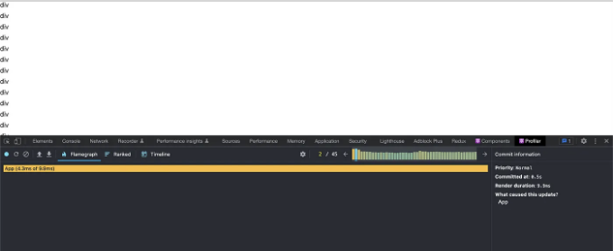
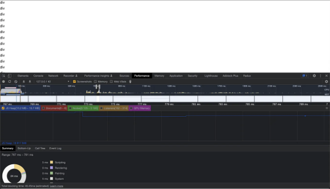
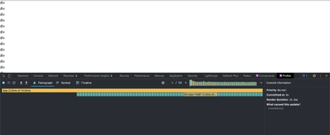
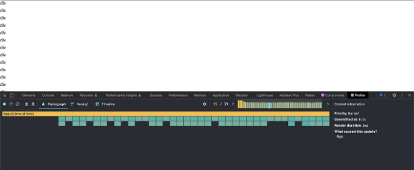
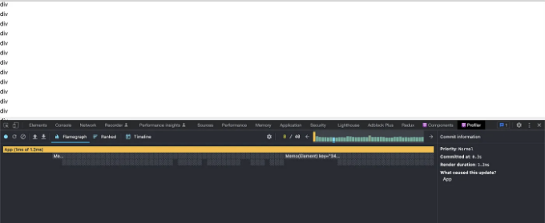

예상대로, 특정 예시에 많은 관심이 기울어졌습니다. 이 중 일부 비판은 타당하지만, 이 글의 요점은 구체적으로 나온 행동에 있는 것이 아닙니다. 오히려, 이 글은 React를 통해 엄청난 수의 요소를 렌더링하는 비용을 보여주고, React가 제공하는 자동 렌더링을 취소하기 위해 추가적인 레이어를 얼마나 더 더해야 하는지를 보여주는 것입니다. 더 나은 예시를 찾게 된다면 후속 글을 작성할 수 있을 것입니다.

<!-- ui-log 수평형 -->
<ins class="adsbygoogle"
  style="display:block"
  data-ad-client="ca-pub-4877378276818686"
  data-ad-slot="9743150776"
  data-ad-format="auto"
  data-full-width-responsive="true"></ins>
<component is="script">
(adsbygoogle = window.adsbygoogle || []).push({});
</component>

이 문서의 코드는 여기서 찾을 수 있어요.

웹 개발을 처음 시작했을 때는 주로 Python/Django로 시작했어요. 모든 것이 서버 쪽에서 렌더링되고 "렌더링 성능"에 대해 한 번도 생각해보지 않았어요. 10년이 지난 지금, 컴퓨터가 적어도 두 배 빨라졌다고 해도, 렌더링 성능은 이전보다 더 큰 문제가 되었어요. Single Page Apps (SPAs)와 React와 같은 프론트엔드 라이브러리는 매우 동적인 웹 페이지를 촉진하고 가능하게 했어요. 그러나 제 경험상 React 코드를 작성하는 기본 권장 방법은 실제로 매우 동적인 페이지를 잘 지원하지 않아요.

이 글에서는 표준 React 코드에서 발생하는 문제, React 성능을 개선하는 권장 옵션, 그리고 JavaScript 예제를 통해 이에 대응하는 방법을 탐색해볼 거에요.

## 무엇을 구축할 것인가

<!-- ui-log 수평형 -->
<ins class="adsbygoogle"
  style="display:block"
  data-ad-client="ca-pub-4877378276818686"
  data-ad-slot="9743150776"
  data-ad-format="auto"
  data-full-width-responsive="true"></ins>
<component is="script">
(adsbygoogle = window.adsbygoogle || []).push({});
</component>

간결한 예시를 만드는 것은 쉽지 않습니다. 실제 프로젝트의 복잡성이 모든 것이 어떻게 함께 작동하는지 더 잘 보여주기 때문입니다. 이 글에서는 상태가 자주 변경될 때 React가 어떻게 작동하는지 강조하는 기본적인 "동적" 예시를 소개합니다. 이 예시는 500개의 텍스트 div가 있고 이 중 하나를 마우스 오버했을 때 배경색이 업데이트되는 예시입니다. 각 변경 후에 React가 렌더링하는 데 얼마나 많은 시간을 소비하는지 보여주기 위해 소스 코드와 프로파일러의 스크린샷도 포함할 것입니다.

## Create React App을 사용하여 프로젝트 초기화

이 코드의 초기 기반은 create-react-app typescript 템플릿에서 온 것입니다. 여러분의 예시 중 App.tsx 파일만 변경하여 한눈에 모든 변경 사항을 쉽게 볼 수 있도록 했습니다.

```js
npx create-react-app react-overreact --template typescript
```

<!-- ui-log 수평형 -->
<ins class="adsbygoogle"
  style="display:block"
  data-ad-client="ca-pub-4877378276818686"
  data-ad-slot="9743150776"
  data-ad-format="auto"
  data-full-width-responsive="true"></ins>
<component is="script">
(adsbygoogle = window.adsbygoogle || []).push({});
</component>

## 단순한 리액트 솔루션

이 첫 번째 예제에서는 현재 마우스를 갖다 대는 요소를 상태로 캡처하고 이를 사용하여 요소의 배경색을 업데이트합니다. 이 hover 상태가 CSS :hover로 간단히 수행될 수 있다고 지적하기 전에, 이 hover 상태가 다른 무언가에 필요하며 우리는 상태 변경을 시각화하기 위해 backgroundColor 속성을 사용하고 있다고 상상해보십시오.

다음은 이 코드가 어떻게 보이는지에 대한 내용입니다.

```js
// App.tsx
import React, { useState } from "react";
import "./App.css";

function App() {
  const [hoveredElementId, setHoveredElementId] = useState("");

  const elements = [];

  for (let i = 0; i < 500; i++) {
    const elementId = String(i);
    const isHovered = hoveredElementId === elementId;

    elements.push(
      <div 
        key={i}
        style={ { marginBottom: 8, backgroundColor: isHovered ? "#eee" : "" } }
        onMouseEnter={() => {
          setHoveredElementId(elementId);
        }
        onMouseLeave={()=> {
          if (elementId == hoveredElementId) {
            setHoveredElementId("");
          }
        }
      >
        div
      </div>
    );
  }

  return <>{elements}</>;
}

export default App;
```

<!-- ui-log 수평형 -->
<ins class="adsbygoogle"
  style="display:block"
  data-ad-client="ca-pub-4877378276818686"
  data-ad-slot="9743150776"
  data-ad-format="auto"
  data-full-width-responsive="true"></ins>
<component is="script">
(adsbygoogle = window.adsbygoogle || []).push({});
</component>

# 프로파일러



M1 맥북 프로에서 한 번의 렌더링이 3ms에서 9ms 사이에 소요됩니다. 또한, 새로운 요소를 호버할 때마다 새로운 렌더링이 트리거됩니다. 10ms 미만으로 들린다면 꽤 빠르게 느껴질 수 있는데, M1 칩은 현재 사용 가능한 가장 빠른 싱글 스레드 성능 CPU 중 하나라는 것을 기억해 주세요. 그보다 두 배 느릴 수 있는 오래된 기기들도 있을 수 있다는 생각을 하면 쉽게 상상이 됩니다. 또한, 이는 가장 간단한 텍스트 요소만 사용한 것입니다. 반복된 요소 내에 몇 가지 요소만 더 추가하더라도 추가적인 밀리초의 렌더링 시간이 추가될 것입니다.

"개발 빌드를 사용하는 것으로 인해 '일부' 오버헤드가 발생할 것으로 생각되지만, 제가 예상하기로는 프로덕션 모드를 켜는 것이 이 예시에 상당한 영향을 줄 것으로는 기대하지 않습니다."

<!-- ui-log 수평형 -->
<ins class="adsbygoogle"
  style="display:block"
  data-ad-client="ca-pub-4877378276818686"
  data-ad-slot="9743150776"
  data-ad-format="auto"
  data-full-width-responsive="true"></ins>
<component is="script">
(adsbygoogle = window.adsbygoogle || []).push({});
</component>

이번에는 프로덕션 프로파일링을 몇 가지 다른 방법으로 시도해봤는데, 결국 같은 결론을 얻었어요. 이 기사 끝부분의 최종 예제와 가장 공평한 비교는 전체 프로덕션 빌드(yarn build)와 Chrome Performance 탭을 사용한 방법입니다.

## Chrome Performance 탭

아래에서 어떤 추가적인 React 개발적 부담도 없는 숫자들이 React Dev Tools이 보여주는 것과 매우 유사하다는 것을 알 수 있어요.

<!-- ui-log 수평형 -->
<ins class="adsbygoogle"
  style="display:block"
  data-ad-client="ca-pub-4877378276818686"
  data-ad-slot="9743150776"
  data-ad-format="auto"
  data-full-width-responsive="true"></ins>
<component is="script">
(adsbygoogle = window.adsbygoogle || []).push({});
</component>



난 게임 개발 배경에서 왔어. 거기서 당신에게 주어진 프레임은 16ms 이내에 처리를 끝내야 60프레임을 유지할 수 있다는 걸 꼭 알게 되더라구. React에서든 이미 500개의 요소만 사용해도 이 임계점을 거의 능가했어. 한 프레임이 16ms 이상 걸리면 버벅거림이 눈에 띄게 되고 렌더가 기다리는 동안 끔찍한 사용자 경험을 야기하게 돼.

## React에서 성능 최적화하기

React의 성능 최적화 페이지에 따르면 "많은 애플리케이션에서 React를 사용하면 성능을 특별히 최적화하기 위해 많은 작업을 하지 않아도 빠른 사용자 인터페이스를 얻을 수 있습니다." 내 의견엔, 이건 "대부분의 애플리케이션에서는 React의 기본적인 과도한 렌더링을 걱정할만한 요소가 충분하지 않을 것"으로 다시 표현돼야 한다고 생각해.

<!-- ui-log 수평형 -->
<ins class="adsbygoogle"
  style="display:block"
  data-ad-client="ca-pub-4877378276818686"
  data-ad-slot="9743150776"
  data-ad-format="auto"
  data-full-width-responsive="true"></ins>
<component is="script">
(adsbygoogle = window.adsbygoogle || []).push({});
</component>

이 목록에서의 첫 번째 제안 중 하나는 Virtualize Long Lists입니다. 그들의 문서에 따르면 "앱이 많은 데이터 목록(수백 또는 수천 개의 행)을 렌더링하는 경우 "윈도잉"이라고 알려진 기술을 사용하는 것을 권장합니다." 이것은 무한 목록의 세계에서 의미가 있지만, 수백 개의 요소 이하에서는 사실 가만히 두어도 충분할 수 있습니다. 이 기사로 이어진 실제 예시에서는 매우 중첩된 구성 요소들이 있었고, 때로는 하나의 요소가 매우 간단하며 때로는 하나의 요소에는 여러 다른 구성 요소가 있을 수 있습니다. 이러한 경우 윈도잉을 사용하면 아마도 모든 요소의 동적 높이를 계산해야 하기 때문에 모든 요소를 첫 번째에 모두 표시하는 것보다 더 나쁜 성능을 가져올 수도 있습니다.

다음 예제에서는 조화를 피하라고 제안합니다. 기본적으로, props가 변경되지 않았다면 컴포넌트를 다시 렌더링하지 않도록 컴포넌트를 업데이트하도록 제안합니다. 이것을 처음 배울 때 이중 체크해야 했습니다. React의 전체 목적이 props가 변경되지 않았다면 컴포넌트에서 작업을 수행할 필요가 없다고 생각했었는데, 부모의 prop이 변경되면 React가 전체 서브트리를 맹목적으로 다시 렌더링한다는 것을 알게 되었습니다.

이전에 이를 제안한 유용한 페이지를 기억하시나요? 사실 함수형 컴포넌트를 사용하는 방법에 대한 정보는 아무런 정보를 제공하지 않습니다. React 웹 사이트의 성능 최적화를 위해 마련된 유일한 페이지는 React를 사용하는 권장 방법인 훅을 사용하여 최적화하는 방법에 대한 정보를 제공하지 않습니다. 대신, 훅 최적화에 대한 세부 정보는 이미 너무 늦었을 때 찾을 수 있도록 훅 FAQ에 감춰져 있습니다.

## React.memo를 사용하여 (또는 사용하지 않고) 조화 피하기

<!-- ui-log 수평형 -->
<ins class="adsbygoogle"
  style="display:block"
  data-ad-client="ca-pub-4877378276818686"
  data-ad-slot="9743150776"
  data-ad-format="auto"
  data-full-width-responsive="true"></ins>
<component is="script">
(adsbygoogle = window.adsbygoogle || []).push({});
</component>

```js
import React, { useState } from "react";
import "./App.css";

type ElementProps = {
  id: string;
  hoveredElementId: string;
  onMouseEnter: (id: string) => void;
  onMouseLeave: (id: string) => void;
};

function Div(props: ElementProps) {
  const isHovered = props.hoveredElementId === props.id;

  return (
    <div
      style={ { marginBottom: 8, backgroundColor: isHovered ? "#eee" : "" } }
      onMouseEnter={() => {
        props.onMouseEnter(props.id);
      }}
      onMouseLeave={() => {
        props.onMouseLeave(props.id);
      }}
    >
      div
    </div>
  );
}

function App() {
  const [hoveredElementId, setHoveredElementId] = useState("");

  const handleMouseEnter = (id: string) => {
    setHoveredElementId(id);
  };

  const handleMouseLeave = (id: string) => {
    if (id == hoveredElementId) {
      setHoveredElementId("");
    }
  };

  const elements = [];

  for (let i = 0; i < 500; i++) {
    elements.push(
      <Div
        key={i}
        id={String(i)}
        hoveredElementId={hoveredElementId}
        onMouseEnter={handleMouseEnter}
        onMouseLeave={handleMouseLeave}
      />
    );
  }

  return <>{elements}</>;
}

export default App;
```

먼저 내부 요소를 자체 React 컴포넌트로 추출하여 다시 렌더링을 방지할 수 있는 이점을 얻습니다. 기능적으로 이것은 우리가 처음 시작한 첫 번째 코드 블록과 거의 동일해야 합니다. 프로파일러를 사용하면 4ms~16ms까지 도달했음을 확인할 수 있습니다. 이 마지막 숫자는 익숙해야 할 것입니다... 기본 div를 래핑하는 React 컴포넌트를 도입하면 이미 60fps 아래로 떨어질 위험이 있습니다(내부 컴포넌트가 자체적으로 여러 자식을 가질 때가 어떻게 작동하는지 상상할 수 있습니다).

## 프로파일러


```

<!-- ui-log 수평형 -->
<ins class="adsbygoogle"
  style="display:block"
  data-ad-client="ca-pub-4877378276818686"
  data-ad-slot="9743150776"
  data-ad-format="auto"
  data-full-width-responsive="true"></ins>
<component is="script">
(adsbygoogle = window.adsbygoogle || []).push({});
</component>

위의 코드는 호버된 요소 id가 변경될 때마다 전체 렌더링을 발생시킵니다. 이는 우리가 hoveredElementId를 요소에 전달하기 때문에 각 하위 요소의 속성이 변경되어 호버된 요소가 변경될 때마다 모든 것을 다시 렌더링하게 됩니다.

## propsAreEqual 콜백과 함께 React.memo 사용

요소는 현재 요소가 hoveredElementId인 경우에만 다시 렌더링되어야 합니다 (이 경우 배경색을 업데이트해야 함) 또는 이전 hoveredElementId가 현재 요소와 일치하는 경우 (이 경우에는 배경색 스타일을 제거해야 함).

아래 코드에서는 prevProps.hoveredElementId 또는 nextProps.hoveredElementId가 요소의 id와 일치하는지 확인합니다. 일치하는 경우 컴포넌트가 다시 렌더링되어야 함을 나타내기 위해 false를 반환합니다. 또한 다른 속성에 대한 변경이 다시 렌더링을 트리거하도록 필요합니다. 따라서 lodash의 isEqual을 사용하여 나머지 속성에 대한 동일성 확인을 수행하도록 합니다. 기본적으로 React.memo는 얕은 비교를 수행하지만, 알기로는 직접 얕은 비교를 수행할 수있는 편리한 함수를 노출하지는 않습니다.

<!-- ui-log 수평형 -->
<ins class="adsbygoogle"
  style="display:block"
  data-ad-client="ca-pub-4877378276818686"
  data-ad-slot="9743150776"
  data-ad-format="auto"
  data-full-width-responsive="true"></ins>
<component is="script">
(adsbygoogle = window.adsbygoogle || []).push({});
</component>

```js
import _ from "lodash";
import React, { useState } from "react";
import "./App.css";

type ElementProps = {
  id: string;
  hoveredElementId: string;
  onMouseEnter: (id: string) => void;
  onMouseLeave: (id: string) => void;
};

function Element(props: ElementProps) {
  const isHovered = props.hoveredElementId === props.id;

  return (
    <div
      style={ { marginBottom: 8, backgroundColor: isHovered ? "#eee" : "" } }
      onMouseEnter={() => {
        props.onMouseEnter(props.id);
      }}
      onMouseLeave={() => {
        props.onMouseLeave(props.id);
      }}
    >
      div
    </div>
  );
}

const MemoedElement = React.memo(Element, (prevProps, nextProps) => {
  const { hoveredElementId: oldHoveredElementId, ...oldProps } = prevProps;
  const { hoveredElementId: newHoveredElementId, ...newProps } = nextProps;

  if (oldHoveredElementId === nextProps.id) {
    return false;
  }
  if (newHoveredElementId === nextProps.id) {
    return false;
  }
  return _.isEqual(oldProps, newProps);
});

function App() {
  const [hoveredElementId, setHoveredElementId] = useState("");

  const handleMouseEnter = (id: string) => {
    setHoveredElementId(id);
  };

  const handleMouseLeave = (id: string) => {
    if (id === hoveredElementId) {
      setHoveredElementId("");
    }
  };

  const elements = [];

  for (let i = 0; i < 500; i++) {
    elements.push(
      <MemoedElement
        key={i}
        id={String(i)}
        hoveredElementId={hoveredElementId}
        onMouseEnter={handleMouseEnter}
        onMouseLeave={handleMouseLeave}
      />
    );
  }

  return <>{elements}</>;
}

export default App;
```

## Profiler



이 첫 번째 시도는 안타깝게도 실패했습니다. 그 이유는 굉장히 명백하지 않습니다. hoveredElementId 상태가 변경되면 App 컴포넌트를 다시 렌더링합니다. handleMouseEnter와 handleMouseLeave 콜백이 각 렌더링마다 재정의됩니다. 이는 MemoedElement에 다시 전달될 때 동일한 참조가 아니기 때문에 MemoedElement가 다시 완전히 자체를 다시 렌더링하게 됩니다.```

<!-- ui-log 수평형 -->
<ins class="adsbygoogle"
  style="display:block"
  data-ad-client="ca-pub-4877378276818686"
  data-ad-slot="9743150776"
  data-ad-format="auto"
  data-full-width-responsive="true"></ins>
<component is="script">
(adsbygoogle = window.adsbygoogle || []).push({});
</component>

리액트 내부 동작을 학습하기 위해 노력했어요. 그런데 이걸 처음 개발자에게 설명하는 게 라이브러리가 이런 것들을 간단하게 처리해야 한다는 원칙을 벗어난 것 같아요.

## useCallback을 활용해서 불필요한 렌더링을 방지하세요

Hooks FAQ를 통해 "렌더링 시 함수 생성으로 인해 Hooks가 느린가요"라는 항목을 확인해 보았어요.

여기서 리액트는 기본적으로 함수 컴포넌트 내의 콜백이 기본적으로 고장난다는 사실을 인정하고 있어요. 아래 코드에서 제 콜백을 마법같은 useCallback으로 감쌌어요.

<!-- ui-log 수평형 -->
<ins class="adsbygoogle"
  style="display:block"
  data-ad-client="ca-pub-4877378276818686"
  data-ad-slot="9743150776"
  data-ad-format="auto"
  data-full-width-responsive="true"></ins>
<component is="script">
(adsbygoogle = window.adsbygoogle || []).push({});
</component>

```js
import _ from "lodash";
import React, { useCallback, useState } from "react";
import "./App.css";

type ElementProps = {
  id: string;
  hoveredElementId: string;
  onMouseEnter: (id: string) => void;
  onMouseLeave: (id: string) => void;
};

function Element(props: ElementProps) {
  const isHovered = props.hoveredElementId === props.id;

  return (
    <div
      style={ { marginBottom: 8, backgroundColor: isHovered ? "#eee" : "" } }
      onMouseEnter={() => {
        props.onMouseEnter(props.id);
      }
      onMouseLeave={() => {
        props.onMouseLeave(props.id);
      }
    >
      div
    </div>
  );
}

const MemoedElement = React.memo(Element, (prevProps, nextProps) => {
  const { hoveredElementId: oldHoveredElementId, ...oldProps } = prevProps;
  const { hoveredElementId: newHoveredElementId, ...newProps } = nextProps;

  if (oldHoveredElementId === nextProps.id) {
    return false;
  }
  if (newHoveredElementId === nextProps.id) {
    return false;
  }
  return _.isEqual(oldProps, newProps);
});

function App() {
  const [hoveredElementId, setHoveredElementId] = useState("");

  const handleMouseEnter = useCallback((id: string) => {
    setHoveredElementId(id);
  }, [setHoveredElementId]);

  const handleMouseLeave = useCallback((id: string) => {
    if (id === hoveredElementId) {
      setHoveredElementId("");
    }
  }, [setHoveredElementId]);

  const elements = [];

  for (let i = 0; i < 500; i++) {
    elements.push(
      <MemoedElement
        key={i}
        id={String(i)}
        hoveredElementId={hoveredElementId}
        onMouseEnter={handleMouseEnter}
        onMouseLeave={handleMouseLeave}
      />
    );
  }

  return <>{elements}</>;
}

export default App;
```

## 프로파일러



프로파일러 스크린샷을 보면 이것이 모든 새로운 호버마다 모든 컴포넌트를 다시 렌더링하지 않는 목표를 성공적으로 달성했음을 확인할 수 있습니다.```

<!-- ui-log 수평형 -->
<ins class="adsbygoogle"
  style="display:block"
  data-ad-client="ca-pub-4877378276818686"
  data-ad-slot="9743150776"
  data-ad-format="auto"
  data-full-width-responsive="true"></ins>
<component is="script">
(adsbygoogle = window.adsbygoogle || []).push({});
</component>

이 작업이 제대로 작동하려면, 존재하는 콜백은 모두 useCallback으로 감싸야 합니다. 그 종속성 배열에서 놓친 부분이 있으면 이상한 동작을 발견할 수 있으니 조심하세요.

```js
const handleMouseEnter = useCallback((id: string) => {
  setHoveredElementId(id);
}, [setHoveredElementId]);
```

프로그래밍에서 "일찍 최적화하는 것은 모든 악의 근원"이라고 자주 말합니다. 이는 종종 사실이며, 문제가 발생한 경우에만 프로파일링하고 문제가 있는 부분만을 명확하게 대상으로 삼는 것이 제안되는 접근 방식입니다.

React 코드를 작성할 때도 이것이 참으로 유효해야 하지만, React에서 사후 최적화하는 과정은 최선이 아닙니다. 성능이 문제라는 것을 알 때까지 이미 여러 다른 컴포넌트가 모두 각각 메모이제이션되어야 합니다. 이 작업을 마치면 콜백이 문제를 일으키는 모든 경우를 찾아내야 합니다.

<!-- ui-log 수평형 -->
<ins class="adsbygoogle"
  style="display:block"
  data-ad-client="ca-pub-4877378276818686"
  data-ad-slot="9743150776"
  data-ad-format="auto"
  data-full-width-responsive="true"></ins>
<component is="script">
(adsbygoogle = window.adsbygoogle || []).push({});
</component>

코드를 마무리하면서는 여전히 따르긴 꽤 합리적이지만, 의존성 배열과 arePropsEqual의 미묘한 부분들은 새로운 문제를 쉽게 도입할 수 있습니다. "그냥 하나 더" 추가하면 쉽게 메모이제이션을 망가뜨려, 최악의 성능 문제로 돌아가는 경우가 생길 수 있습니다.

FAQ에서는 여러 컴포넌트 사이에서 콜백을 전달해야 하는 번거로움을 피하기 위해 useReducer를 제안합니다. 이 기사에서는 이에 대한 구체적인 내용을 다루지 않겠지만 (다음 기사에서 다룰 수도 있습니다).

## 우리는 정말 React가 필요한가요?

이 기사를 통해 적어도 3가지의 주요 React 개념(React.memo, arePropsEqual 및 useCallback)들을 소개했는데, 이것을 통해 기본적으로 기대해야 할 성능을 얻는 데에 들어가야 하는 노력이 상당합니다(그리고 솔직히 말해 500개 요소에 1밀리초는 여전히 꽤 부끄럽습니다). 나는 오랫동안 React가 실제로 나에게 무엇을 제공하는지 의문을 품어왔고, 성능 영역에서 경험한 이러한 좌절은 매우 실망스럽습니다.

<!-- ui-log 수평형 -->
<ins class="adsbygoogle"
  style="display:block"
  data-ad-client="ca-pub-4877378276818686"
  data-ad-slot="9743150776"
  data-ad-format="auto"
  data-full-width-responsive="true"></ins>
<component is="script">
(adsbygoogle = window.adsbygoogle || []).push({});
</component>

미래의 글에서는 React를 벗어나는 데 사용한 몇 가지 실험을 탐구하고 공유하고 싶습니다. 하지만, 예고편으로 아래는 일반적인 JavaScript 예제로 비슷한 코드를 제공하겠습니다.

```js
const root = document.createElement("div");
document.body.appendChild(root);

for (let i = 0; i < 500; i++) {
  const element = document.createElement('div');
  element.style.marginBottom = "8px";
  element.innerText = "div";

  element.addEventListener("mouseenter", () => {
    element.style.backgroundColor = "#eee"
  });

  element.addEventListener("mouseleave", () => {
    element.style.backgroundColor = ""
  });
  
  root.appendChild(element);
}
```

## 프로파일러


<!-- ui-log 수평형 -->
<ins class="adsbygoogle"
  style="display:block"
  data-ad-client="ca-pub-4877378276818686"
  data-ad-slot="9743150776"
  data-ad-format="auto"
  data-full-width-responsive="true"></ins>
<component is="script">
(adsbygoogle = window.adsbygoogle || []).push({});
</component>

리액트 프로파일러는 더 이상 사용할 수 없지만 Chrome 성능 탭을 통해 최악의 프레임이 2ms의 스크립팅이었음을 확인할 수 있습니다. 다른 모든 것들은 0ms로 나타납니다.

## 결론

리액트 지지자들은 이것이 부당한 표현이라고 주장할 것이며, 리액트의 이점은 프로젝트가 커질수록 나타납니다. 시간이 흐르면 위의 간단한 코드가 어떻게 대형 프로젝트를 문제없이 유지하는 데 사용될 수 있는지 공유할 것입니다.

리액트의 복잡한 컴포넌트 라이프사이클 주변 작업을 배우는 대신 직접 이를 관리하는 방법을 배울 수 있습니다. 나는 지난 몇 달 동안 나만의 프로젝트에서 이를 계속해 왔으며 뒤로 돌아가려고하지 않을 것 같습니다.

<!-- ui-log 수평형 -->
<ins class="adsbygoogle"
  style="display:block"
  data-ad-client="ca-pub-4877378276818686"
  data-ad-slot="9743150776"
  data-ad-format="auto"
  data-full-width-responsive="true"></ins>
<component is="script">
(adsbygoogle = window.adsbygoogle || []).push({});
</component>

# Level Up 코딩

우리 커뮤니티의 일원이 되어 주셔서 감사합니다! 떠나시기 전에:

- 👏 이야기에 박수를 보내고 작가를 팔로우해주세요 👉
- 📰 Level Up 코딩 게시물에서 더 많은 콘텐츠를 확인해주세요
- 🔔 팔로우하기: 트위터 | 링크드인 | 뉴스레터

🚀👉 Level Up 인재 모임에 참여해서 멋진 직업을 찾아보세요