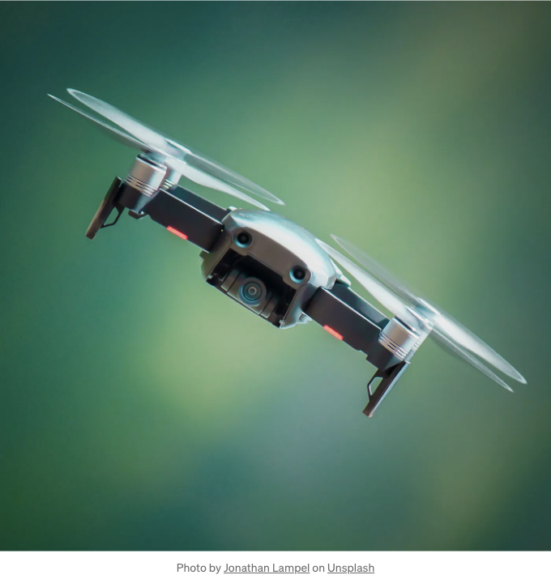
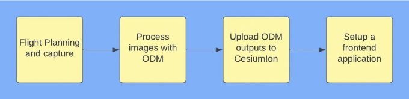
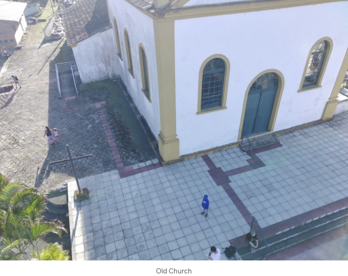
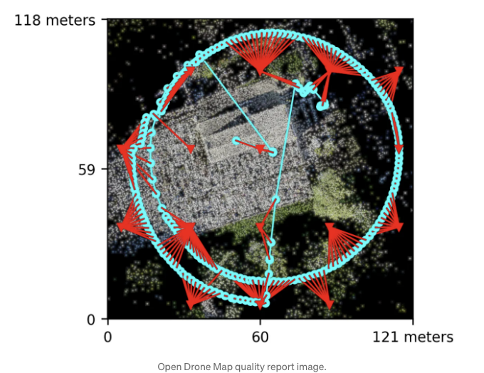
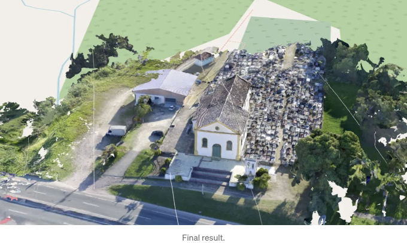

## 드론 사진을 3D 모델로 변환하고 결과물을 지도상에 표시해보세요



# 소개

위키피디아에 따르면:

<!-- ui-log 수평형 -->
<ins class="adsbygoogle"
  style="display:block"
  data-ad-client="ca-pub-4877378276818686"
  data-ad-slot="9743150776"
  data-ad-format="auto"
  data-full-width-responsive="true"></ins>
<component is="script">
(adsbygoogle = window.adsbygoogle || []).push({});
</component>

먼저 전문가가 아닌 것을 언급하고 싶습니다. 드론을 활용하여 더 흥미로운 일을 하려는 개발자일 뿐입니다. 그렇지만 포토그래미터리를 사용하여 3D 모델을 만들기 위해서는 서로 겹치는 많은 사진이 필요합니다.

이것이 최종 결과물이 될 것입니다. 그리고 여기에 코드가 있습니다.

코드는 꽤 간단합니다만, 목표를 달성하기 위해 멋진 라이브러리와 서비스 집합이 필요합니다. 단계는 다음과 같습니다:



<!-- ui-log 수평형 -->
<ins class="adsbygoogle"
  style="display:block"
  data-ad-client="ca-pub-4877378276818686"
  data-ad-slot="9743150776"
  data-ad-format="auto"
  data-full-width-responsive="true"></ins>
<component is="script">
(adsbygoogle = window.adsbygoogle || []).push({});
</component>

# 비행 계획

모든 드론은 고유의 모바일 앱을 함께 제공하며 그 안에 지능적인 비행 모드 옵션이 있습니다. 저는 FIMI X8S2를 가지고 있고, 여기서는 그 앱을 참조로 사용할 것이지만, 모든 드론에 대해 옵션은 거의 동일합니다.

먼저 목표를 선택해야 합니다. 여기서는 제 동네의 오래된 교회를 선택하겠습니다.



<!-- ui-log 수평형 -->
<ins class="adsbygoogle"
  style="display:block"
  data-ad-client="ca-pub-4877378276818686"
  data-ad-slot="9743150776"
  data-ad-format="auto"
  data-full-width-responsive="true"></ins>
<component is="script">
(adsbygoogle = window.adsbygoogle || []).push({});
</component>

아이디어는 타겟의 겹친 사진을 다양한 각도에서 촬영하는 것입니다. 그 작업을 하기 위해 두 가지 다른 비행 모드를 사용할 수 있어요: Orbit 또는 Waypoints. Waypoints가 가장 많이 사용되는 모드이지만, 저는 더 직관적인 Orbit 모드를 선택했어요. Orbit 모드에서는 드론을 타겟의 중심에 위치시키고 반지름을 선택해야 해요. 카메라는 항상 타겟을 향하고 있어야 합니다.

비행 계획이 설정되면 카메라 옵션으로 이동하여 "Lapse, 2 seconds"를 선택하세요. 또다른 중요한 설정은 비행 중 드론의 속도입니다. 저는 3m/s를 선택했어요. 속도와 랩스의 조합은 겹쳐진 사진을 얻을 수 있게 해줄 거에요. 이에 대한 멋진 계산법은 있지만, 이 기본값들도 꽤 괜찮아요.

그래, 드론을 날려보세요, 사진 촬영 버튼을 누르고 카메라 각도에 주의를 기울이세요. 그리고 덧붙이자면, 사진을 많이 찍을수록 좋아요. 저는 241장의 사진을 찍었어요.

# OpenDroneMap (ODM)을 사용한 이미지 처리

<!-- ui-log 수평형 -->
<ins class="adsbygoogle"
  style="display:block"
  data-ad-client="ca-pub-4877378276818686"
  data-ad-slot="9743150776"
  data-ad-format="auto"
  data-full-width-responsive="true"></ins>
<component is="script">
(adsbygoogle = window.adsbygoogle || []).push({});
</component>

ODM은 놀라운 오픈소스 도구이며, 드론 사진을 가져와 유용한 출력물을 많이 생성합니다.

ODM을 실행하는 데 필요한 유일한 것은 도커입니다. ODM에는 꼭 읽을 가치가 있는 훌륭한 문서가 있습니다. GitHub 링크를 여기에 남겨두겠습니다. 그곳에서 더 자세한 지침을 찾을 수 있을 거예요.

그래서 컴퓨터에 SD 카드를 넣고 이미지를 자세히 살펴보세요. 타겟을 향하지 않은 이미지는 삭제하세요. 프로젝트를 위해 두 개의 폴더를 생성하는 것이 필요합니다. 이렇게요:

```js
├── church
│   ├── images
```

<!-- ui-log 수평형 -->
<ins class="adsbygoogle"
  style="display:block"
  data-ad-client="ca-pub-4877378276818686"
  data-ad-slot="9743150776"
  data-ad-format="auto"
  data-full-width-responsive="true"></ins>
<component is="script">
(adsbygoogle = window.adsbygoogle || []).push({});
</component>

교회 폴더 안에서 다음 명령을 실행해주세요:

```js
docker run -ti - rm -v .:/datasets/code opendronemap/odm - project-path /datasets
```

이 명령은 완료까지 시간이 오래 걸릴 거예요. 이 곳에서는 1시간 이상 걸렸어요. 명령이 끝나면, 교회 폴더 안에 docs에서 언급된 파일들이 나타날 거에요. odm_report 폴더에는 생성된 데이터에 대한 다양한 정보와 미리보기가 많이 포함되어 있어요.

아래 이미지에서 제 오비트 비행 모드와 카메라 촬영 위치를 확인할 수 있어요:

<!-- ui-log 수평형 -->
<ins class="adsbygoogle"
  style="display:block"
  data-ad-client="ca-pub-4877378276818686"
  data-ad-slot="9743150776"
  data-ad-format="auto"
  data-full-width-responsive="true"></ins>
<component is="script">
(adsbygoogle = window.adsbygoogle || []).push({});
</component>



3D 모델은 odm_texturing 폴더에 있습니다. Blender와 같은 소프트웨어를 사용하여 렌더링할 수 있지만, 다음 섹션에서는 CesiumIon에서 생성된 모델을 볼 것입니다.

# CesiumIon에 데이터 업로드

우리는 CesiumIon을 사용하여 모델을 적절히 호스팅하고 제공할 것입니다. 모델은 3D 타일로 제공될 것입니다. Cesium 계정을 만들어주세요. 개발자용으로 무료입니다. 모델을 CesiumIon에 업로드하는 과정은 매우 간단하며 다음 튜토리얼에서 다룹니다:

<!-- ui-log 수평형 -->
<ins class="adsbygoogle"
  style="display:block"
  data-ad-client="ca-pub-4877378276818686"
  data-ad-slot="9743150776"
  data-ad-format="auto"
  data-full-width-responsive="true"></ins>
<component is="script">
(adsbygoogle = window.adsbygoogle || []).push({});
</component>

odm-texturing 폴더의 모든 파일을 업데이트하는 걸 잊지 마세요. 다만 문제가 있었어요. Cesium이 지구 상에 모델 위치를 찾지 못해서 수동으로 설정해야 했어요. Cesium에는 이에 대한 튜토리얼도 있어요.

여기서 한 드론 사진의 좌표를 가져왔어요. 이미지 메타데이터에서 좌표를 찾을 수 있어요.

# 코딩

네, 이제 코딩을 해볼까요? 이 모델을 지도에 렌더링하기 위해 다양한 라이브러리를 사용할 거에요, 하지만 최종 코드는 매우 간단할 거에요. 이것들은 사용할 라이브러리들이에요:

<!-- ui-log 수평형 -->
<ins class="adsbygoogle"
  style="display:block"
  data-ad-client="ca-pub-4877378276818686"
  data-ad-slot="9743150776"
  data-ad-format="auto"
  data-full-width-responsive="true"></ins>
<component is="script">
(adsbygoogle = window.adsbygoogle || []).push({});
</component>

- Vite — 프로젝트를 부트스트랩합니다
- react-map-gl — React 방식으로 베이스 맵을 렌더링합니다
- maplibre — react-map-gl에서 사용되며 mapbox-gl을 대체합니다
- deck.gl — 3D 모델을 렌더링합니다
- loaders.gl — 3D 모델을 로드합니다

또한 Tailwind를 사용 중인데, 그냥 습관일 뿐입니다. 이 프로젝트의 CSS는 매우 간단합니다. 현재 pnpm을 사용하고 있지만 npm 또는 yarn도 괜찮습니다. 프로젝트를 생성하는 것부터 시작해 봅시다.

React 및 TypeScript 프로젝트를 부트스트랩하려면:

```js
pnpm create vite your-project-name --template react-ts
```

<!-- ui-log 수평형 -->
<ins class="adsbygoogle"
  style="display:block"
  data-ad-client="ca-pub-4877378276818686"
  data-ad-slot="9743150776"
  data-ad-format="auto"
  data-full-width-responsive="true"></ins>
<component is="script">
(adsbygoogle = window.adsbygoogle || []).push({});
</component>

프로젝트 폴더로 이동하여 의존성을 설치하세요:

```js
cd your-project-name
pnpm add @deck.gl/core @deck.gl/layers @deck.gl/react @deck.gl/mesh-layers @deck.gl/geo-layers @deck.gl/mapbox @loaders.gl/3d-tiles react-map-gl maplibre-gl 
```

이제 컴포넌트를 보관할 폴더를 만들어봅시다:

```js
cd src
mkdir components
touch components/Loading.tsx components/ChurchMap.tsx
```

<!-- ui-log 수평형 -->
<ins class="adsbygoogle"
  style="display:block"
  data-ad-client="ca-pub-4877378276818686"
  data-ad-slot="9743150776"
  data-ad-format="auto"
  data-full-width-responsive="true"></ins>
<component is="script">
(adsbygoogle = window.adsbygoogle || []).push({});
</component>

app.css 파일과 App.tsx의 모든 보일러플레이트 코드를 삭제할 수 있어요. 그 다음 main.tsx로 이동해서 app.css import를 삭제하고 maplibre CSS import를 추가하세요. 이 CSS는 기본 지도를 올바르게 렌더링하게 해줄 거에요.

```js
import React from "react";
import ReactDOM from "react-dom/client";
import App from "./App.tsx";
import "./index.css";
import "maplibre-gl/dist/maplibre-gl.css";

ReactDOM.createRoot(document.getElementById("root") as HTMLElement).render(
  <React.StrictMode>
    <App />
  </React.StrictMode>
);
```

나중에 오류를 피하기 위해, 먼저 기본 지도만 렌더링합시다. 여기에는 raster base map을 사용하고 있습니다. 벡터 지도가 더 나은데 유료이죠. react-map-gl에서 반드시 mapbox-style 객체가 필요하므로 해당 파일을 만들어 보관합시다.

```js
touch src/mapHelpers.tsx
```

<!-- ui-log 수평형 -->
<ins class="adsbygoogle"
  style="display:block"
  data-ad-client="ca-pub-4877378276818686"
  data-ad-slot="9743150776"
  data-ad-format="auto"
  data-full-width-responsive="true"></ins>
<component is="script">
(adsbygoogle = window.adsbygoogle || []).push({});
</component>

이 코드는 Mapbox 스타일 객체입니다. 맵 소스를 지정하고 스타일을 적용하는 등 다양한 작업을 수행할 수 있습니다.

```js
// src/mapHelpers.tsx
import { MapboxStyle } from "react-map-gl";

export const mapStyle: MapboxStyle = {
  version: 8,
  sources: {
    osm: {
      type: "raster",
      tiles: ["https://a.tile.openstreetmap.org/{z}/{x}/{y}.png"],
      tileSize: 256,
      attribution: "&copy; OpenStreetMap Contributors",
      maxzoom: 19,
    },
  },
  layers: [
    {
      id: "osm",
      type: "raster",
      source: "osm",
    },
  ],
};
```

이제 맵을 생성해봅시다. 먼저 베이스 맵만 렌더링할 것입니다.

```js
// src/components/ChurchMap.tsx
import Map, { NavigationControl, useControl, MapRef } from "react-map-gl";
import maplibregl from "maplibre-gl";
import { mapStyle } from "../mapHelpers";

const INITIAL_VIEW_STATE = {
  longitude: -48.5495,
  latitude: -27.5969,
  zoom: 9,
};

export default function ChurchMap() {
  return (
    <Map
      mapLib={maplibregl}
      mapStyle={mapStyle}
      initialViewState={INITIAL_VIEW_STATE}
      style={{ width: "100vw", height: "100vh" }}
    >
      <NavigationControl />
    </Map>
  );
}
```

<!-- ui-log 수평형 -->
<ins class="adsbygoogle"
  style="display:block"
  data-ad-client="ca-pub-4877378276818686"
  data-ad-slot="9743150776"
  data-ad-format="auto"
  data-full-width-responsive="true"></ins>
<component is="script">
(adsbygoogle = window.adsbygoogle || []).push({});
</component>

작동 중인 베이스 맵이 있으면, Deck.gl을 추가할 수 있어요. Deck.gl은 다른 라이브러리와 통합하는 방법을 가르쳐 주는 좋은 문서가 있어요. 우리의 경우에는 react-map-gl이죠, 그런데 문제가 있어요. 그들의 예시들 중 많은 것들이 react-map-gl의 오래된 버전을 사용하고 있어요. 이 두 라이브러리를 올바르게 통합하려면 다음의 예시를 사용해야 해요:

내 예시에서, CesiumIon 계정에서 asset-id와 access-token을 가져와요. accessToken을 저장할 .env.local 파일을 만들어보세요.

```js
touch .env.local
```

```js
# .env.local
VITE_CESIUM = yourAccessToken
```

<!-- ui-log 수평형 -->
<ins class="adsbygoogle"
  style="display:block"
  data-ad-client="ca-pub-4877378276818686"
  data-ad-slot="9743150776"
  data-ad-format="auto"
  data-full-width-responsive="true"></ins>
<component is="script">
(adsbygoogle = window.adsbygoogle || []).push({});
</component>

ChurchMap.tsx 컴포넌트를 Deck.gl과 CesiumIon 데이터로 업데이트해보세요.

```js
import { Tile3DLayer } from "@deck.gl/geo-layers/typed";
import { CesiumIonLoader } from "@loaders.gl/3d-tiles";
import { MapboxOverlay, MapboxOverlayProps } from "@deck.gl/mapbox/typed";
import Map, { NavigationControl, useControl, MapRef } from "react-map-gl";
import maplibregl from "maplibre-gl";

import { mapStyle } from "../mapHelpers";
import { useRef, useState } from "react";

// CESIUM 데이터로 변경해주세요
const CESIUM_CONFIG = {
  assetId: 1691493,
  tilesetUrl: "https://assets.ion.cesium.com/1691493/tileset.json",
  token: import.meta.env.VITE_CESIUM,
};

const INITIAL_VIEW_STATE = {
  longitude: -48.5495,
  latitude: -27.5969,
  zoom: 9,
};

function DeckGLOverlay(
  props: MapboxOverlayProps & {
    interleaved?: boolean;
  }
) {
  const overlay = useControl<MapboxOverlay>(() => new MapboxOverlay(props));
  overlay.setProps(props);
  return null;
}

export default function ChurchMap() {
  const mapRef = useRef<MapRef>(null);

  const layer3D = new Tile3DLayer({
    id: "layer-3d",
    pointSize: 2,
    data: CESIUM_CONFIG.tilesetUrl,
    loader: CesiumIonLoader,
    loadOptions: {
      "cesium-ion": {
        accessToken: CESIUM_CONFIG.token,
      },
    },
    onTilesetLoad(tile) {
      const { cartographicCenter } = tile;
      if (cartographicCenter) {
        mapRef.current?.flyTo({
          center: [cartographicCenter[0], cartographicCenter[1]],
          zoom: 19,
          bearing: -80,
          pitch: 80,
        });
      }
    },
  });
  return (
    <Map
      mapLib={maplibregl}
      mapStyle={mapStyle}
      initialViewState={INITIAL_VIEW_STATE}
      style={{ width: "100vw", height: "100vh" }}
      ref={mapRef}
    >
      <DeckGLOverlay layers={[layer3D]} />
      <NavigationControl />
    </Map>
  );
}
```

모델이 로드되기까지 시간이 걸리므로 로딩 지시기를 추가했어요.



<!-- ui-log 수평형 -->
<ins class="adsbygoogle"
  style="display:block"
  data-ad-client="ca-pub-4877378276818686"
  data-ad-slot="9743150776"
  data-ad-format="auto"
  data-full-width-responsive="true"></ins>
<component is="script">
(adsbygoogle = window.adsbygoogle || []).push({});
</component>

이상입니다, 모두 여러분. 읽어 주셔서 감사합니다.