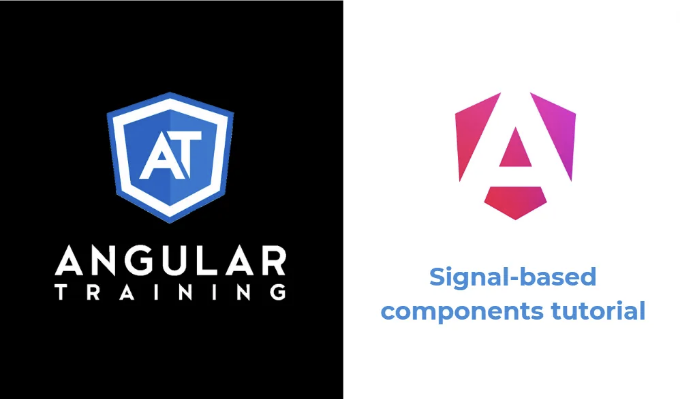

Angular 17.3가 출시되면서 시그널 기반 컴포넌트가 현실이 되었습니다. 시그널 기반 컴포넌트는 모든 데이터 입력, 출력 및 쿼리가 RxJs와 독립적이며 Angular Signals를 대신 사용하는 컴포넌트입니다.

다시 말해서, 우리가 이전에 Angular 컴포넌트를 작성했던 방식은 다음과 같습니다:

```js
import { AsyncPipe } from '@angular/common';
import { Component, EventEmitter, Input, Output, ViewChild } from '@angular/core';

@Component({
//...
})
export class HelloComponent {

  @Input()
  name = 'World';

  @Output()
  greetingClicked = new EventEmitter<string>();

  @ViewChild(ProfileComponent)
  profileComponent: ProfileComponent;
```

<!-- ui-log 수평형 -->
<ins class="adsbygoogle"
  style="display:block"
  data-ad-client="ca-pub-4877378276818686"
  data-ad-slot="9743150776"
  data-ad-format="auto"
  data-full-width-responsive="true"></ins>
<component is="script">
(adsbygoogle = window.adsbygoogle || []).push({});
</component>

아래는 시그널 기반 접근 방식을 사용한 동일한 컴포넌트의 모습입니다:

```js
import { AsyncPipe } from '@angular/common';
import { Component, input, output, viewChild } from '@angular/core';

@Component({
//...
})
export class HelloComponent {

  name = input<string>('World');

  greetingClicked = output<string>();

  profileComponent = viewChild(ProfileComponent);
```

가장 큰 차이점은 모든 데코레이터(@Input, @Output, @ViewChild, @ContentChild, @ViewChildren, @ContentChildren)가 이제 함수로 대체될 수 있다는 점입니다.

또한 입력과 출력 둘 다 가능한 model() 함수가 추가되었습니다. 이 함수는 양방향 데이터 바인딩에 완벽합니다. model()에 대한 간단한 튜토리얼은 여기에서 찾아볼 수 있어요.

<!-- ui-log 수평형 -->
<ins class="adsbygoogle"
  style="display:block"
  data-ad-client="ca-pub-4877378276818686"
  data-ad-slot="9743150776"
  data-ad-format="auto"
  data-full-width-responsive="true"></ins>
<component is="script">
(adsbygoogle = window.adsbygoogle || []).push({});
</component>


# 시그널 기반 컴포넌트의 이유는 무엇인가요?

간단히 말해서, 더 나은 성능과 변경 감지를 위해서입니다. 시그널 기반 컴포넌트를 사용하면 Angular가 어떤 뷰(컴포넌트 템플릿의 일부분)가 어떤 시그널에 의존하는지 알 수 있습니다. 이는 시그널의 값을 업데이트하면 Angular가 정확히 어떤 부분을 업데이트할지 알려줍니다. 전체 컴포넌트 트리를 통과하고 모든 것을 확인할 필요가 없습니다!

변경 감지가 작동하는 방식에 대해 더 알아보려면 이 설명을 참고해보세요.

<!-- ui-log 수평형 -->
<ins class="adsbygoogle"
  style="display:block"
  data-ad-client="ca-pub-4877378276818686"
  data-ad-slot="9743150776"
  data-ad-format="auto"
  data-full-width-responsive="true"></ins>
<component is="script">
(adsbygoogle = window.adsbygoogle || []).push({});
</component>

추가 혜택 중 하나는 Angular 학습의 가장 어려운 부분이었던 RxJs에 대한 의존성이 줄어든다는 것입니다. 시그널 기반 컴포넌트는 구독, 서브젝트, 연산자 등 없이 작성할 수 있습니다. 이것은 Angular 팀의 다음 목표 중 하나로, ng-conf 2024에서 발표되었습니다: Zone.js와 RxJs 없이 Angular의 미래를 제공하는 것입니다.


# 시그널 기반 컴포넌트를 어떻게 구현할까요?

Angular의 현재 상태에서 시그널 기반 컴포넌트를 활성화하는 첫 번째 단계는 서비스를 Observable과 Subject 대신 시그널을 노출하도록 만드는 것입니다. 이러한 가이드라인과 최고의 실천 방법을 사용하여 서비스에서 시그널을 안전하게 노출할 수 있습니다.

<!-- ui-log 수평형 -->
<ins class="adsbygoogle"
  style="display:block"
  data-ad-client="ca-pub-4877378276818686"
  data-ad-slot="9743150776"
  data-ad-format="auto"
  data-full-width-responsive="true"></ins>
<component is="script">
(adsbygoogle = window.adsbygoogle || []).push({});
</component>

두 번째 단계는 구성 요소에서 사용 중인 모든 데코레이터를 새로운 시그널 기반 옵션으로 바꾸는 것입니다:

- @Input은 input()으로 바뀝니다.
- @ViewChild는 viewChild()로, @ContentChild는 contentChild()로 바뀝니다.
- @Output은 output()으로 바뀝니다.

input()과 달리 output() 함수는 시그널을 반환하지 않는다는 점에 유의해야 합니다. 대신, 이 함수는 RxJs에 대한 의존성을 격리시키는데, Angular의 EventEmitter는 RxJs Observable을 확장하지만 여전히 .emit() 메서드에 의존합니다.

다음과 같은 output 선언이 Typescript 컴포넌트 코드에 있다고 가정해 봅시다:

<!-- ui-log 수평형 -->
<ins class="adsbygoogle"
  style="display:block"
  data-ad-client="ca-pub-4877378276818686"
  data-ad-slot="9743150776"
  data-ad-format="auto"
  data-full-width-responsive="true"></ins>
<component is="script">
(adsbygoogle = window.adsbygoogle || []).push({});
</component>

```js
greetingClicked = output<string>();
```

그런 다음, 다음과 같이 출력 값을 발생시킵니다:

```js
greetingClicked.emit('일부 값')
```

Rxjs 코드 및 레거시 데코레이터가 컴포넌트에서 완전히 제거되면 최종 단계는 컴포넌트의 변경 감지 전략을 OnPush로 변경하는 것입니다. 이는 곧 변경될 수 있지만 현재는 우리의 전체 컴포넌트 트리를 무조건 통과할 기본 전략을 비활성화하는 가장 쉬운 방법입니다.```

<!-- ui-log 수평형 -->
<ins class="adsbygoogle"
  style="display:block"
  data-ad-client="ca-pub-4877378276818686"
  data-ad-slot="9743150776"
  data-ad-format="auto"
  data-full-width-responsive="true"></ins>
<component is="script">
(adsbygoogle = window.adsbygoogle || []).push({});
</component>

```js
@Component({
  selector: 'app-hello',
  templateUrl: './hello.component.html',
  standalone: true,
  changeDetection: ChangeDetectionStrategy.OnPush,
})
export class HelloComponent {
```

이렇게 하면 시그널 기반 구성 요소를 가져올 수 있고, 변경 감지가 향상되며 RxJs에 대한 독립성이 향상됩니다!

Stackblitz에서 작동하는 완전한 예제를 찾을 수 있습니다.

# RxJs에 대해서 어떻게 생각하십니까?

<!-- ui-log 수평형 -->
<ins class="adsbygoogle"
  style="display:block"
  data-ad-client="ca-pub-4877378276818686"
  data-ad-slot="9743150776"
  data-ad-format="auto"
  data-full-width-responsive="true"></ins>
<component is="script">
(adsbygoogle = window.adsbygoogle || []).push({});
</component>

신호는 RxJs와 상호 운용할 수 있도록 여러 함수를 통해 설계되었습니다:

- toObservable()은 신호를 Observable로 변환합니다.
- toSignal()은 Observable을 신호로 변환합니다.
- outputToObservable()은 OutputRef(ouput() 함수에 의해 반환된 새 객체)를 Observable로 변환합니다.
- outputFromObservable()은 Observable을 출력으로 변환합니다.

RxJs를 계속 사용할 수 있습니다. 특히, 서비스가 복잡한 연산자 체인을 가지고 있는 경우입니다. 단지 결과를 컴포넌트에 대한 신호로 변환하면 됩니다.