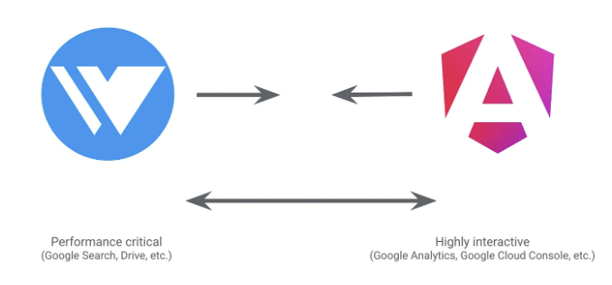

앵귤러와 위즈는 수천 명의 엔지니어들과 구글 내부의 앱들에서 사용되고 있어요.

# 구글은 두 개의 프레임워크를 가지고 있어요: 앵귤러 & 위즈

1. 앵귤러

앵귤러는 높은 상호작용성 앱을 제공하고, 개발자 경험을 우선으로 하며 복잡한 UI를 빠르게 전달하는 데 초점을 맞추고 있어요. 예를 들어, Gemini와 Google Analytics 같은 앱들이 좋은 예시에요.

<!-- ui-log 수평형 -->
<ins class="adsbygoogle"
  style="display:block"
  data-ad-client="ca-pub-4877378276818686"
  data-ad-slot="9743150776"
  data-ad-format="auto"
  data-full-width-responsive="true"></ins>
<component is="script">
(adsbygoogle = window.adsbygoogle || []).push({});
</component>

- 오픈 소스
- 구글 앱에서 사용: (Google Analytics, Google Cloud Console, Firebase Console)

## 2. WIZ

Wiz은 성능에 중점을 둔 앱에 초점을 맞추고 있습니다. 이에 대표적인 예로 구글 검색이 있으며, 가능한 빨리 결과를 렌더링하고 비교적 낮은 상호 작용성을 가지고 있습니다.

- 구글 내부 전용
- 구글 앱에서 사용 (Google Search, Photos, Payments)

<!-- ui-log 수평형 -->
<ins class="adsbygoogle"
  style="display:block"
  data-ad-client="ca-pub-4877378276818686"
  data-ad-slot="9743150776"
  data-ad-format="auto"
  data-full-width-responsive="true"></ins>
<component is="script">
(adsbygoogle = window.adsbygoogle || []).push({});
</component>

# Wiz에 대해 알아보기

- Wiz는 초기로드 지연 및 JavaScript 사용량을 최소화하는 느린 네트워크/하위 장치에 최적화되어 있습니다.
- 서버 측 렌더링(SSR)을 통해 모든 것에 대한 대화형 구성 요소를 스트리밍 솔루션을 통해 이용합니다.
- 페이지에서 필요한 구성 요소에 필요한 JavaScript 로드만을 제한합니다.
- 사용자 이벤트를 캐치하고 재생하는 작은 라이브러리를 사용하여 손실을 방지합니다.
- 최종 사용자에게 높은 성능을 제공하지만 대화형 앱 개발자에게는 복잡성을 추가합니다.

# Angular과 WIZ를 선택한 이유

- Angular-Wiz 파트너십은 구글의 최고의 웹 개발 사례를 통합하여 웹 앱 개발 신뢰를 강화하고자 합니다.
- 오픈 소스화 및 개발자 경험을 향상하는 게 핵심 목표입니다.
- Angular에서 Wiz에 영향을 받아 변경 가능한 뷰 및 부분 수분화를 포함한 점진적 개선이 이루어졌습니다.
- Wiz는 이제 Angular의 신호를 사용하여 세세한 UI 업데이트를 향상시켜 중요한 플랫폼인 YouTube를 향상시킵니다.
- 이 신호에서의 변화가 성능을 현저히 개선시켰습니다.
- 이러한 발전들은 Angular과 Wiz의 협업의 상호 이익을 보여주며, Google 검색 및 Gmail과 같은 주요 사이트를 향상시킬 잠재력을 가지고 있습니다.

<!-- ui-log 수평형 -->
<ins class="adsbygoogle"
  style="display:block"
  data-ad-client="ca-pub-4877378276818686"
  data-ad-slot="9743150776"
  data-ad-format="auto"
  data-full-width-responsive="true"></ins>
<component is="script">
(adsbygoogle = window.adsbygoogle || []).push({});
</component>

# 앵귤러의 미래 전망은?

- Angular와 Wiz의 점진적이고 책임있는 통합.
- Angular를 통해 오픈 소스 Wiz 기능을 제공하여 오픈 개발을 받아들임.
- 로드맵을 형성하기 위해 공개 RFC 프로세스를 통한 커뮤니티 입력.
- 피드백을 기반으로 앵귤러 기능 강화.
- 웹 플랫폼에 대한 서버 측 렌더링 (SSR)의 중요성 강조.
- 구글의 주요 라이브러리를 활용하여 커뮤니티가 혁신에 참여할 수 있는 초대장.

# 결론

결론적으로 안귤러와 Wiz 간 계속되는 통합은 성능과 상호작용성을 조화롭게 하기 위한 전망에 기반을 두고 있습니다. 각 프레임워크의 장점을 활용하여, 구글은 개발 경험을 통합할 수 있는 통합 개발 환경을 제공하여 웹 애플리케이션의 효율성과 기능성을 높일 것으로 기대됩니다. 이는 개발자와 최종 사용자들에게 혜택을 주게 될 것입니다.

<!-- ui-log 수평형 -->
<ins class="adsbygoogle"
  style="display:block"
  data-ad-client="ca-pub-4877378276818686"
  data-ad-slot="9743150776"
  data-ad-format="auto"
  data-full-width-responsive="true"></ins>
<component is="script">
(adsbygoogle = window.adsbygoogle || []).push({});
</component>

