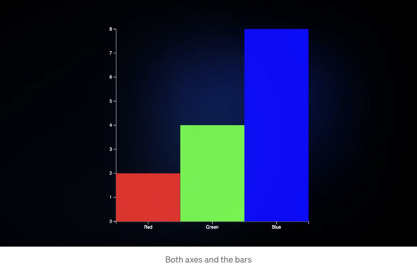

이전 글에서는 D3.js의 핵심 개념과 데이터 주도 요소를 만들기 위해 해당 API를 사용하는 방법에 대해 논의했습니다. 이 글에서는 D3.js를 사용한 애니메이션 효과가 있는 막대 차트를 그리는 개념을 설명하고 React 기반 웹 앱에서의 코드 예제를 보여드리겠습니다.

간략히 요약하면:

- 차트를 컨테이너, 축, 그리고 막대로 개별 구성 요소로 분해합니다.
- 이러한 구성 요소를 그리기 위해 SVG와 D3.js를 사용합니다.
- React 콜백 ref를 사용하여 DOM에 렌더링합니다.

<!-- ui-log 수평형 -->
<ins class="adsbygoogle"
  style="display:block"
  data-ad-client="ca-pub-4877378276818686"
  data-ad-slot="9743150776"
  data-ad-format="auto"
  data-full-width-responsive="true"></ins>
<component is="script">
(adsbygoogle = window.adsbygoogle || []).push({});
</component>

# D3로 차트 작성은 레고 조립과 비슷해요


D3.js로 차트를 그릴 때, 레고 블록을 조립하는 것과 비슷한 느낌일 거예요. 여러 독립 구성 요소를 작업한 다음에 이를 함께 조합하여 최종 차트를 만들어요. 이 개념은 모든 종류의 차트에 적용됩니다.

막대 차트의 예를 살펴보죠. 우리는 이를 여러 구성 요소로 분해할 수 있어요.

<!-- ui-log 수평형 -->
<ins class="adsbygoogle"
  style="display:block"
  data-ad-client="ca-pub-4877378276818686"
  data-ad-slot="9743150776"
  data-ad-format="auto"
  data-full-width-responsive="true"></ins>
<component is="script">
(adsbygoogle = window.adsbygoogle || []).push({});
</component>


- Y 축: 세로 스케일입니다.
- X 축: 가로 스케일입니다.
- 막대: 데이터의 시각적 표현입니다.
- 컨테이너: 모든 이 요소들이 함께 모이는 그림판입니다.

마찬가지로 선 그래프의 경우, 구성 요소에는 X 축, Y 축, 선 자체의 경로, 그리고 물론 컨테이너가 포함됩니다.

이제 D3.js와 React를 사용하여 가장 일반적인 차트 유형 중 하나인 막대 차트를 만드는 단계를 살펴보겠습니다.

<!-- ui-log 수평형 -->
<ins class="adsbygoogle"
  style="display:block"
  data-ad-client="ca-pub-4877378276818686"
  data-ad-slot="9743150776"
  data-ad-format="auto"
  data-full-width-responsive="true"></ins>
<component is="script">
(adsbygoogle = window.adsbygoogle || []).push({});
</component>

# 1. 리액트 컴포넌트에서 설정

리액트에서 DOM을 조작하는 여러 가지 방법이 있습니다. 바닐라 자바스크립트를 통해 DOM 노드에 접근하거나, 리액트에서는 ref (useRef)를 사용할 수 있습니다. Ref를 사용하여 useEffect 내에서 새로운 DOM 요소를 추가하거나, useCallback 훅을 사용하여 콜백 ref 접근 방식을 선택할 수 있습니다. 제 의견으로는, 콜백 ref 방식이 여기서 가장 좋은 선택인데, useEffect와 달리 현재 렌더링 중인 DOM 요소를 걱정할 필요가 없습니다. Ref는 이것을 보장할 것입니다. 또한, React Strict Mode에서 컴포넌트가 두 번 렌더링되는 것을 방지합니다.

```js
const plotChart = () => {
 // 여기에 차트 그리기
 // 콜백 ref로 노드 반환
}

const ref = useCallback(
  (node) => {
    if (node !== null) {
      const plot = plotChart()
      node.append(plot)
    }
  },
  []
)

return <div ref={ref} />
```

이제, plotChart() 함수에서 차트를 그리는 논리를 추가하기 시작합니다.

<!-- ui-log 수평형 -->
<ins class="adsbygoogle"
  style="display:block"
  data-ad-client="ca-pub-4877378276818686"
  data-ad-slot="9743150776"
  data-ad-format="auto"
  data-full-width-responsive="true"></ins>
<component is="script">
(adsbygoogle = window.adsbygoogle || []).push({});
</component>

# 2. 컨테이너

먼저 컨테이너를 설정해야 합니다. 이는 차트를 그릴 그리기 공간으로 작용합니다. SVG로 폭과 높이가 500px인 컨테이너를 설정해 봅시다. viewBox 속성을 사용하여 그림판을 브라우저 뷰포트에 반응하도록 만들 수 있습니다. viewBox에 대해 더 알아보세요.

```js
const WIDTH = 500
const HEIGHT = 500

const selection = d3.create('svg')
 .attr('viewBox', `0 0 ${WIDTH} ${HEIGHT}`)
 .style('width', '100%')
 .style('height', 'auto')
```

대량의 데이터를 처리해야 할 때는 SVG보다 성능이 더 좋은 캔버스 요소를 사용할 수도 있습니다. SVG는 대량 데이터셋으로 인해 성능이 저하될 수 있습니다.

<!-- ui-log 수평형 -->
<ins class="adsbygoogle"
  style="display:block"
  data-ad-client="ca-pub-4877378276818686"
  data-ad-slot="9743150776"
  data-ad-format="auto"
  data-full-width-responsive="true"></ins>
<component is="script">
(adsbygoogle = window.adsbygoogle || []).push({});
</component>

# 3. 척도

D3에서 척도에 대해 이해해야 할 세 가지 주요 용어가 있습니다:

- **Domain (도메인)**: 가능한 입력 값 데이터 세트입니다.
- **Range (범위)**: 가능한 출력 값의 최소값과 최대값입니다.
- **Scale Function (척도 함수)**: 이 함수는 도메인의 입력 값을 범위 내에서 시각적으로 출력 값으로 매핑합니다.

D3의 다양한 차트에 대한 척도 함수가 있습니다. 그 중 일부는 특정 사용 사례에 대해 매우 일반적입니다.

<!-- ui-log 수평형 -->
<ins class="adsbygoogle"
  style="display:block"
  data-ad-client="ca-pub-4877378276818686"
  data-ad-slot="9743150776"
  data-ad-format="auto"
  data-full-width-responsive="true"></ins>
<component is="script">
(adsbygoogle = window.adsbygoogle || []).push({});
</component>


바 차트의 X 및 Y 축을 위한 축척을 만들어 봅시다. 다음과 같은 데이터가 있다고 가정해 봅시다:

```js
const DATA = [
 {
  category: 'Red',
  value: 2,
  color: '#ff0000',
 },
 {
  category: 'Green',
  value: 4,
  color: '#00ff00',
 },
 {
  category: 'Blue',
  value: 8,
  color: '#0000ff',
 },
]
```

## X-축 축척

<!-- ui-log 수평형 -->
<ins class="adsbygoogle"
  style="display:block"
  data-ad-client="ca-pub-4877378276818686"
  data-ad-slot="9743150776"
  data-ad-format="auto"
  data-full-width-responsive="true"></ins>
<component is="script">
(adsbygoogle = window.adsbygoogle || []).push({});
</component>

저희 목표는 각 카테고리를 표시하고 차트의 너비(500픽셀)에 걸쳐 X 축에 고르게 분배하는 것입니다.

그러나 틱이 잘려 보이지 않도록 축 주변에 약간의 여백을 추가해야 합니다. 여백 때문에 축의 크기가 축소되므로 범위를 설정할 때 여백을 고려해야 합니다.

각 측면에 40픽셀 여백을 가정하면 축은 이제 40픽셀부터 460픽셀에 그려질 것입니다.

따라서 X 축의 도메인 및 범위는 다음과 같을 것입니다:

<!-- ui-log 수평형 -->
<ins class="adsbygoogle"
  style="display:block"
  data-ad-client="ca-pub-4877378276818686"
  data-ad-slot="9743150776"
  data-ad-format="auto"
  data-full-width-responsive="true"></ins>
<component is="script">
(adsbygoogle = window.adsbygoogle || []).push({});
</component>

- 도메인: ["빨강", "초록", "파랑"]
- 범위: [40, 460]

```js
const MARGIN_TOP = 40
const MARGIN_RIGHT = 40
const MARGIN_BOTTOM = 40
const MARGIN_LEFT = 40

const xScale = d3.scaleBand()
 .domain(["빨강", "초록", "파랑"])
 .range([MARGIN_LEFT, WIDTH - MARGIN_RIGHT])

selection
 .append('g')
 .call(d3.axisBottom(xScale))
 .attr('transform', `translate(0, ${HEIGHT - MARGIN_BOTTOM})`)
```

scaleBand() 함수를 사용하여 범위를 도메인의 길이인 'n' 개의 밴드로 나눕니다. scaleBand() 함수는 각 막대의 X 축 위치를 결정합니다. 매핑은 다음과 같이 테이블로 나타낼 수 있습니다:


<!-- ui-log 수평형 -->
<ins class="adsbygoogle"
  style="display:block"
  data-ad-client="ca-pub-4877378276818686"
  data-ad-slot="9743150776"
  data-ad-format="auto"
  data-full-width-responsive="true"></ins>
<component is="script">
(adsbygoogle = window.adsbygoogle || []).push({});
</component>

그럼, 우리는 주어진 스케일 함수를 사용하여 아래쪽으로 방향을 향한 축 라인을 반환하는 축 생성기인 axisBottom()함수를 호출합니다. 여백에 따라 요소를 변환 추가하여 위치를 위로 이동해야 합니다.

결과적으로 X 축은 다음과 같이 보일 것입니다.


## Y 축 척도

<!-- ui-log 수평형 -->
<ins class="adsbygoogle"
  style="display:block"
  data-ad-client="ca-pub-4877378276818686"
  data-ad-slot="9743150776"
  data-ad-format="auto"
  data-full-width-responsive="true"></ins>
<component is="script">
(adsbygoogle = window.adsbygoogle || []).push({});
</component>

비슷한 개념이 Y 축에도 적용됩니다. 막대 차트의 Y 축에서는 숫자 데이터 값을 시각적 요소에 매핑해야 합니다. 여기서는 막대의 높이에서 여백을 뺀 값입니다. 우리 카테고리에 해당하는 데이터 값은 [2, 4, 8]입니다. 이 값들을 사용하여 Y 축의 범위와 영역을 설정할 것입니다.

- 범위: [0, 8]
- 영역: [460, 40]

차트의 높이가 500px이고 여백이 40px인 경우, 바가 차트의 밑바닥에 놓이도록 460(차트의 아래)부터 40(위쪽)까지 범위를 설정할 것입니다. 이것은 역직관적으로 보일 수 있지만, D3.js를 비롯한 많은 그래픽 표현에서 Y 좌표는 위에서 시작하여 아래쪽으로 증가합니다.

```js
const yScale = d3.scaleLinear()
 .domain([0, 8])
 .range([HEIGHT - MARGIN_BOTTOM, MARGIN_TOP])

selection
 .append('g')
 .call(d3.axisLeft(yScale))
 .attr('transform', `translate(${MARGIN_LEFT}, 0)`)
```

<!-- ui-log 수평형 -->
<ins class="adsbygoogle"
  style="display:block"
  data-ad-client="ca-pub-4877378276818686"
  data-ad-slot="9743150776"
  data-ad-format="auto"
  data-full-width-responsive="true"></ins>
<component is="script">
(adsbygoogle = window.adsbygoogle || []).push({});
</component>

우리는 데이터 값을 Y 축의 픽셀 값에 비례하도록 매핑하기 위해 scaleLinear()를 사용합니다.


그런 다음, 주어진 스케일 함수로 왼쪽으로 정렬된 축 선을 반환하는 축 생성기 인 axisLeft() 함수를 호출합니다. 다시 한 번, 마진에 따라 요소에 변환을 추가하여 위치를 안쪽으로 이동해야 합니다.

두 축을 추가한 후에는 이제 다음과 같이 보입니다.

<!-- ui-log 수평형 -->
<ins class="adsbygoogle"
  style="display:block"
  data-ad-client="ca-pub-4877378276818686"
  data-ad-slot="9743150776"
  data-ad-format="auto"
  data-full-width-responsive="true"></ins>
<component is="script">
(adsbygoogle = window.adsbygoogle || []).push({});
</component>


## 컬러 스케일

마지막으로, 카테고리에 따라 색상을 매핑하는 스케일 함수를 구현하려고 합니다. 우리는 위에서 정의한 scaleOrdinal()을 사용할 것입니다: 이 함수는 이산값(색상 문자열)을 다른 이산값(카테고리 문자열)에 매핑합니다. 이 개념은 축에 사용되는 스케일 함수와 유사합니다.

- 도메인: ["빨강", "초록", "파랑"]
- 레인지: [`#ff0000`, `#00ff00`, `#0000ff`]

<!-- ui-log 수평형 -->
<ins class="adsbygoogle"
  style="display:block"
  data-ad-client="ca-pub-4877378276818686"
  data-ad-slot="9743150776"
  data-ad-format="auto"
  data-full-width-responsive="true"></ins>
<component is="script">
(adsbygoogle = window.adsbygoogle || []).push({});
</component>

```js
const colorScale = d3
    .scaleOrdinal()
    .domain(DATA.map((d) => d.category))
    .range(DATA.map((d) => d.color));
```

이 색상 스케일 함수는 다음 단계에서 막대의 색상을 채우는 데 사용될 것입니다.

# 4. 막대

스케일이 설정되면, 다음 단계는 데이터를 나타내는 막대를 생성하고 그것을 SVG 컨테이너에 배치하는 것입니다.

<!-- ui-log 수평형 -->
<ins class="adsbygoogle"
  style="display:block"
  data-ad-client="ca-pub-4877378276818686"
  data-ad-slot="9743150776"
  data-ad-format="auto"
  data-full-width-responsive="true"></ins>
<component is="script">
(adsbygoogle = window.adsbygoogle || []).push({});
</component>

```js
selection
.selectAll('.bar')
.data(DATA)
.enter()
.append('rect')
.attr('class', 'bar')
.attr('x', (d) => xScale(d.category))
.attr('y', (d) => yScale(d.value))
.attr('width', xScale.bandwidth())
.attr('height', (d) => yScale(0) - yScale(d.value))
.attr('fill', (d) => colorScale(d.category))
```

이 코드에서 하는 일은 다음과 같습니다:

- 먼저 bar 클래스 이름을 가진 요소를 선택합니다. 초기에는 해당 요소가 없습니다.
- 데이터를 선택에 바인딩합니다.
- enter 선택을 선택합니다. 요소가 없으므로 enter 선택은 비어 있습니다. Enter, Update, Exit의 개념을 이해하려면 이전 문서를 참조하세요.
- DATA를 순환하면서 배열인 경우 각 반복에 대해 다음을 수행합니다:

- 직사각형 모양인 `rect`를 추가합니다.
- 클래스 bar를 추가합니다.
- X 좌표를 이전에 정의한 xScale() 함수로 설정합니다.
- Y 좌표를 이전에 정의한 yScale() 함수로 설정합니다.
- 각 밴드(bar)의 너비를 반환하는 xScale.bandwidth() 함수로 막대의 너비를 설정합니다.
- 막대의 높이를 가장 낮은 값인 yScale(0)에서 시작하여 yScale() 함수로 설정합니다.
- 이전에 정의한 colorScale() 함수로 막대의 색상을 설정합니다.

<!-- ui-log 수평형 -->
<ins class="adsbygoogle"
  style="display:block"
  data-ad-client="ca-pub-4877378276818686"
  data-ad-slot="9743150776"
  data-ad-format="auto"
  data-full-width-responsive="true"></ins>
<component is="script">
(adsbygoogle = window.adsbygoogle || []).push({});
</component>

결과는:

```


# 5. Polish it!

축 눈금의 스타일을 사용자 정의하고, 막대를 애니메이션하는 등의 작업으로 차트를 개선할 수 있습니다!

<!-- ui-log 수평형 -->
<ins class="adsbygoogle"
  style="display:block"
  data-ad-client="ca-pub-4877378276818686"
  data-ad-slot="9743150776"
  data-ad-format="auto"
  data-full-width-responsive="true"></ins>
<component is="script">
(adsbygoogle = window.adsbygoogle || []).push({});
</component>

여기서 할 일은 다음과 같아요:

- 막대 사이에 공백 추가하기.
- 각 라벨의 눈금선과 눈금 숨기기.
- 점선 격자 선 추가하기.
- x 축 라벨의 글꼴을 약간 크게 만들기.
- 각 y 축 라벨에 "cm" 단위 추가.
- 막대를 바닥부터 자라도록 애니메이션 효과 추가.

아래는 사용자 정의 스타일 및 애니메이션을 사용하여 구성하고 향상된 애니메이션 막대 차트의 전체 코드입니다.

```js
const plotChart = () => {
  const WIDTH = 500
  const HEIGHT = 500
  const MARGIN_TOP = 40
  const MARGIN_RIGHT = 40
  const MARGIN_BOTTOM = 40
  const MARGIN_LEFT = 40

  const DATA = [
    {
      category: 'Red',
      value: 2,
      color: '#ff0000',
    },
    {
      category: 'Green',
      value: 4,
      color: '#00ff00',
    },
    {
      category: 'Blue',
      value: 8,
      color: '#0000ff',
    },
  ]

  const categories = DATA.map((d) => d.category)

  const values = DATA.map((d) => d.value)

  const maxValue = Math.max(...values)

  const selection = d3.create('svg')
    .attr('viewBox', `0 0 ${WIDTH} ${HEIGHT}`)
    .style('width', '100%')
    .style('height', 'auto')

  const xScale = d3
    .scaleBand()
    .domain(categories)
    .range([MARGIN_LEFT, WIDTH - MARGIN_RIGHT])
    .padding(0.2) // 막대 사이의 공백

  selection
    .append('g')
    .call(d3.axisBottom(xScale).tickSize(0).tickPadding(12)) // x 축 라벨과 막대 사이 간격
    .attr('transform', `translate(0, ${HEIGHT - MARGIN_BOTTOM})`)
    .call((g) => g.select('.domain').remove()) // x 축 선 제거
    .call((g) => g.selectAll('.tick text').style('font-size', 14)) // x 축 라벨의 글꼴 크기

  const yScale = d3
    .scaleLinear()
    .domain([0, maxValue])
    .range([HEIGHT - MARGIN_BOTTOM, MARGIN_TOP])

  selection
    .append('g')
    .call(
      d3
        .axisLeft(yScale)
        .tickSize(-WIDTH) // 격자 선
        .tickPadding(12) // 격자 선과 라벨 사이 간격
        .tickFormat((d) => `${d} cm`), // 라벨 형식 지정
    )
    .attr('transform', `translate(${MARGIN_LEFT}, 0)`)
    .call((g) => g.select('.domain').remove()) // y 축 선 제거
    .call((g) => g.style('stroke-dasharray', 5).style('stroke-opacity', 0.2)) // y 축 격자 선

  const colorOrdinal = d3
    .scaleOrdinal()
    .domain(DATA.map((d) => d.category))
    .range(DATA.map((d) => d.color))

  selection
    .selectAll('.bar')
    .data(DATA)
    .enter()
    .append('rect')
    .attr('class', 'bar')
    .attr('x', (d) => xScale(d.category))
    .attr('width', xScale.bandwidth())
    .attr('y', yScale(0)) // 막대는 처음에 차트의 맨 아래에서 시작합니다 - 0px
    .transition() // 애니메이션
    .duration(1000) // 애니메이션 지속 시간
    .ease(d3.easeCubic) // 애니메이션 효과
    .attr('y', (d) => yScale(d.value))
    .attr('height', (d) => yScale(0) - yScale(d.value))
    .attr('fill', (d) => colorOrdinal(d.category))

  return selection.node()
}

const ref = useCallback(
  (node) => {
    if (node !== null) {
      const plot = plotChart()
      node.append(plot)
    }
  },
  []
)

return <div ref={ref} />
```

<!-- ui-log 수평형 -->
<ins class="adsbygoogle"
  style="display:block"
  data-ad-client="ca-pub-4877378276818686"
  data-ad-slot="9743150776"
  data-ad-format="auto"
  data-full-width-responsive="true"></ins>
<component is="script">
(adsbygoogle = window.adsbygoogle || []).push({});
</component>

최종 결과:


# 결론

마무리하면 D3.js로 차트를 만들어내는 것은 레고 블록을 조합하는 것과 비슷합니다. 서로 다른 부분들 - 축과 막대 등 - 을 하나의 주요 컨테이너 안에 배치합니다. 중요한 것은 이러한 부분들을 척도와 데이터 바인딩을 올바르게 연결하여 모든 것을 올바르게 정렬하는 것입니다.

<!-- ui-log 수평형 -->
<ins class="adsbygoogle"
  style="display:block"
  data-ad-client="ca-pub-4877378276818686"
  data-ad-slot="9743150776"
  data-ad-format="auto"
  data-full-width-responsive="true"></ins>
<component is="script">
(adsbygoogle = window.adsbygoogle || []).push({});
</component>

D3는 매우 유연합니다. 차트를 만드는 유일한 방법은 없습니다. 이 안내서는 기본 템플릿을 제공하지만 D3를 더 익숙해지면 더 많은 작업을 할 수 있습니다. 더 자세한 스타일링이나 다양한 상호 작용을 위한 이벤트 핸들러 구현 등이 가능합니다.