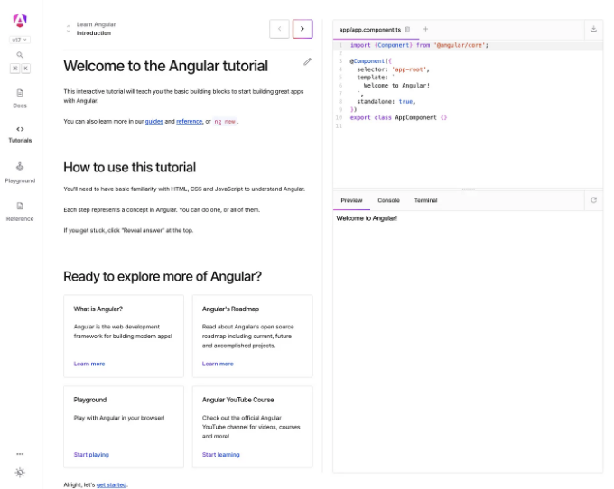
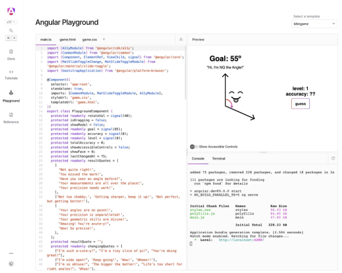

![Angular 개발자들을 도와주는 방법으로 2016년에 최초로 출시된 Angular입니다. Angular의 역사를 통해 수백만 명의 개발자들이 성공을 거두고 있습니다.

지난 몇 버전의 업데이트에서는 최신 웹 환경에서의 성능 및 개발자 경험 향상에 중점을 두었습니다. 우리의 발전 정도에는 Angular의 반응성 시스템 개편, SSR, 그리고 다양한 기능들이 포함되어 있습니다.

이번 주 안에는 Angular v17을 출시할 예정이며, 지연된 뷰, 내장 제어 흐름, 뷰 전환 API 지원, SSR 향상들과 같은 추가 기능들이 포함될 예정입니다. 이러한 혁신은 우리 팀이 지속적으로 추구하는 속도와 안정성을 대변하는 현대적인 모습이 필요합니다. ]

<!-- ui-log 수평형 -->
<ins class="adsbygoogle"
  style="display:block"
  data-ad-client="ca-pub-4877378276818686"
  data-ad-slot="9743150776"
  data-ad-format="auto"
  data-full-width-responsive="true"></ins>
<component is="script">
(adsbygoogle = window.adsbygoogle || []).push({});
</component>

# Angular.dev — 앵귤러 개발의 미래를 위한 새로운 공간

새로운 문서... 누구세요?

Angular.dev는 앵귤러 개발을 위한 새로운 사이트, 도메인 및 홈페이지가 될 것입니다. 오늘의 런칭에는 앵귤러의 최신 기능을 활용하여 개발자들이 더 나은 앵귤러 애플리케이션을 만들 수 있도록 도와줄 새로운 튜토리얼, 업데이트된 문서 및 가이던스가 포함되어 있습니다.

<!-- ui-log 수평형 -->
<ins class="adsbygoogle"
  style="display:block"
  data-ad-client="ca-pub-4877378276818686"
  data-ad-slot="9743150776"
  data-ad-format="auto"
  data-full-width-responsive="true"></ins>
<component is="script">
(adsbygoogle = window.adsbygoogle || []).push({});
</component>

앞으로 몇 달 동안 계속해서 피드백을 수집하고 사이트를 개선할 계획이에요. 많은 향상들이 계획되어 있으니 기대해 주세요.

Angular.io는 v17까지 문서 자료로써 계속해서 지원될 것이며, 모든 예전 링크가 정상적으로 작동하도록 보장할 것이에요. v18에서는 피드백을 수집하고 사이트를 계속해서 안정화시킨 후에 Angular 개발을 위한 공식 홈으로 Angular.dev를 만들 계획입니다.

# 새로운 내장된 자습서

새 문서의 기반 중 하나인 내장된 자습서는 Angular를 브라우저에서 직접 배우는 새로운 방법이에요. WebContainers로 작성된 자습서는 이제 Angular의 핵심 개념을 배우는 데 (또는 나중에 다시 보는 데 😉) 도움이 되는 단계별 작은 단계와 코드 실행 예제를 제공해줘요.

<!-- ui-log 수평형 -->
<ins class="adsbygoogle"
  style="display:block"
  data-ad-client="ca-pub-4877378276818686"
  data-ad-slot="9743150776"
  data-ad-format="auto"
  data-full-width-responsive="true"></ins>
<component is="script">
(adsbygoogle = window.adsbygoogle || []).push({});
</component>

오늘 새로운 튜토리얼은 Angular 시작하는 두 가지 방법을 포함하고 있어요:

- Angular.dev/tutorials/learn-angular는 Angular의 핵심 개념 중 하나 또는 모두를 빠르게 브라우저에서 배울 수 있는 방법이에요.
- Angular.dev/tutorials/first-app은 Hello World!에서 CLI를 사용하여 처음으로 완전한 Angular 앱을 만드는 방법을 가르쳐주며, 저희 Angular YouTube 채널의 전체 비디오 코스도 포함하고 있어요.

그리고 아마도 이미 알아차렸겠지만, 우리는 튜토리얼에서 멈추지 않았어요...

<!-- ui-log 수평형 -->
<ins class="adsbygoogle"
  style="display:block"
  data-ad-client="ca-pub-4877378276818686"
  data-ad-slot="9743150776"
  data-ad-format="auto"
  data-full-width-responsive="true"></ins>
<component is="script">
(adsbygoogle = window.adsbygoogle || []).push({});
</component>

"Hello World"로 시작하거나 템플릿 중 하나를 선택하여 Control Flow, Signals 등의 최신 기능을 탐색해보세요. v17 런칭을 기념해 미니 게임도 추가했어요. Angular에 대해 얼마나 잘 아시나요?

# 새로운 문서와 모든 개발자 수준을 위한 향상된 사용자 경험

Angular.dev은 현대적인 Angular 개발을 처음부터 가르칩니다.

<!-- ui-log 수평형 -->
<ins class="adsbygoogle"
  style="display:block"
  data-ad-client="ca-pub-4877378276818686"
  data-ad-slot="9743150776"
  data-ad-format="auto"
  data-full-width-responsive="true"></ins>
<component is="script">
(adsbygoogle = window.adsbygoogle || []).push({});
</component>

일부 하이라이트는 다음과 같습니다:

- 📕 초보자를 위한 Angular 핵심 개념에 초점을 맞춘 새 콘텐츠 구조 및 고급 개발자를 위한 깊이 있는 안내서
- 🧱 모든 문서 및 예제는 단순화된 개발을 위한 독립 실행형 API로 작성되었으며, 완전히 재작성된 컴포넌트 가이드 포함
- ⚡️ Chrome의 Aurora 팀과 협력하여 작성된 핵심 웹 핵심 요소 안내서, 이미지 최적화 및 성능 최적화 가이드를 포함
- 🌊 SSR 및 Hydration을 위한 새로운 안내서, 기본적으로 더 나은 앱 성능을 위함
- 🔭 더 많은 유용한 API 참조 및 CLI 참조(개발 중)
- ⚒️ 튜토리얼에서 Vite 개발 서버를 사용한 빠른 편집/새로 고침
- 🚗 최신 공개 로드맵
- 🔍 더 나은 검색
- 그리고 그 외 여러 가지!

저희 팀은 프레임워크의 신뢰성의 중심인 안정성과 하위 호환성에 헌신하고 있습니다. 업데이트를 유지하는 방법 및 NgModules에 대한 가이드를 업데이트하여 Angular.dev가 모든 팀에 유용하도록 보장하고 있습니다. 앞으로의 계획은 update.angular.io를 Angular.dev로 통합하고 문서를 계속 개선하여 가장 최신의 모범 사례와 권장 사항을 보다 잘 대표할 수 있도록 하는 것입니다.

# 오픈 소스 문서

<!-- ui-log 수평형 -->
<ins class="adsbygoogle"
  style="display:block"
  data-ad-client="ca-pub-4877378276818686"
  data-ad-slot="9743150776"
  data-ad-format="auto"
  data-full-width-responsive="true"></ins>
<component is="script">
(adsbygoogle = window.adsbygoogle || []).push({});
</component>

Angular.dev은 v17 기술을 사용하여 제작된 제품 앱입니다. 그 가이드에서는 Standalone APIs, Angular Signals, 프리랜더링, 하이드레이션, SSR/SSG, 라우터의 뷰 전환, 제어 흐름, 지연된 뷰, 그리고 ESBuild와 Vite로 새로운 응용 프로그램 빌더를 사용하는 것을 추천합니다. 또한, 우리는 앱을 사용하여 존리스 하이드레이션과 같은 미래의 Angular 솔루션을 테스트했습니다. 저희 팀은 오픈 소스의 힘을 믿습니다.

## 기여할 수 있을까요?

✨ 네, 환영합니다! ✨ 새로운 사이트를 향한 저희의 노력에 도움을 주시면 감사하겠습니다.

이 정도 규모의 새로운 사이트를 발표함에 따라, 저희 팀은 많은 버그와 사이트 및 문서를 개선할 수 있는 기회가 있다고 예상합니다. 오픈 소스에 관심이 있다면, 이 프로젝트는 시작하기에 좋은 프로젝트입니다.

<!-- ui-log 수평형 -->
<ins class="adsbygoogle"
  style="display:block"
  data-ad-client="ca-pub-4877378276818686"
  data-ad-slot="9743150776"
  data-ad-format="auto"
  data-full-width-responsive="true"></ins>
<component is="script">
(adsbygoogle = window.adsbygoogle || []).push({});
</component>

의견이나 버그 신고, 또는 문서/기능 요청이 있으시면 GitHub에서 이슈를 열어주세요.

기여하고 싶으신가요? 시작하는 방법에 대한 가이드라인을 확인하거나 GitHub에서 문서 페이지의 연필 아이콘을 클릭하여 직접 수정을 제안해주세요. 단, 사이트를 오픈 소스로 전환하는 PR이 병합되면 기능이 활성화될 예정이니 참고해주세요.

# 다음 단계

저희 팀은 v18 사이트를 개선하기 위해 오픈 소스 프로젝트를 계속해서 진행할 예정입니다. 주요 초점은 내장된 플레이그라운드의 안정성을 향상시키고 새로운 참조 인프라를 개선하는 것입니다.

<!-- ui-log 수평형 -->
<ins class="adsbygoogle"
  style="display:block"
  data-ad-client="ca-pub-4877378276818686"
  data-ad-slot="9743150776"
  data-ad-format="auto"
  data-full-width-responsive="true"></ins>
<component is="script">
(adsbygoogle = window.adsbygoogle || []).push({});
</component>

앞으로는 새로운 내장 플레이그라운드를 활용하여 추가 가이드와 튜토리얼 쿡북을 만들 계획입니다. 또한, 다른 웹 프레임워크의 개념을 Angular 개념으로 매핑하는 데 도움이 되는 튜토리얼을 작성하는 기회를 찾고 있습니다. 😉

현재 우리의 공개 도로맵에서 우리의 현재 중요 사항에 대해 더 많이 알아보세요. 계속해서 성장하는 것에 기대되어요!

# 새로운 외관, 같은 프레임워크

Angular.dev에 대한 새로운 변화가 여기에 있어요...

<!-- ui-log 수평형 -->
<ins class="adsbygoogle"
  style="display:block"
  data-ad-client="ca-pub-4877378276818686"
  data-ad-slot="9743150776"
  data-ad-format="auto"
  data-full-width-responsive="true"></ins>
<component is="script">
(adsbygoogle = window.adsbygoogle || []).push({});
</component>

많은 개발자들이 처음 나온 AngularJS 실드를 기억할 것입니다. 그것은 당시의 원래 HTML5, CSS3 및 JavaScript 실드 로고와 결합된 것을 참조했습니다. HTML5 표준이 처음 출시된 이후로 많은 변화가 있었는데, 그 중에 우리도 포함되어 있습니다.

새로운 Angular 로고는 저희 프레임워크의 미래를 상징하는 것으로, Angular가 현대적인 프레임워크로 진화하는 것을 의미하도록 디자인되었습니다. Angular의 로드맵은 안정성과 속도에 대한 우리의 약속 및 개발자 경험 및 성능 향상을 위한 작업을 자세히 나타내었는데, 이는 대규모로 채택된 프레임워크의 강력함을 바탕으로 합니다. Angular는 웹 플랫폼에서 탐색하고 혁신을 지속하면서, 이 새로운 로고는 우리의 현재 노력과 미래 우선 순위를 더 잘 나타낼 것입니다.

# Angular의 전진 동력에 참여하세요

Angular의 성공은 우리의 커뮤니티와 깊은 연관이 있습니다. 우리는 많은 커뮤니티, 밋업, 컨퍼런스, 블로그, 웹사이트, YouTube 채널 및 개발자들이 우리를 기반으로 자신의 브랜드를 구축했음을 알고 있습니다. 이 로고는 우리와 우리의 커뮤니티를 위한 것이며, 여러분도 귀하의 브랜드를 업데이트하면서 우리에게 참여할 수 있어야 합니다.

<!-- ui-log 수평형 -->
<ins class="adsbygoogle"
  style="display:block"
  data-ad-client="ca-pub-4877378276818686"
  data-ad-slot="9743150776"
  data-ad-format="auto"
  data-full-width-responsive="true"></ins>
<component is="script">
(adsbygoogle = window.adsbygoogle || []).push({});
</component>

우리의 새로운 프레스 킷을 방문하고 새로운 로고를 직접 적용하는 방법에 대한 가이드를 따라보세요. 새로운 로고를 적용하거나 자체 로고를 업데이트하는 데 궁금한 점이 있으면 추가 도움이 필요할 때에는 devrel@angular.io로 이메일을 보내주세요. 여러분이 어떤 것을 만드는지 기대할 수가 없어요!

Angular 부활을 환영합니다!

Angular.dev를 론칭하는 데 도움을 주신 개발자 커뮤니티에 진심으로 감사드립니다.

새로운 브랜드와 정체성을 만들어준 Monogram (Claudio, DJ, Jordan, Leo, Oli, Patrick, Pawel, Sami, TJ) 팀에 감사의 말씀을 전합니다. Angular 코어 팀 (Andrew K., Alan, Amy, Andrew J., Alex R., Alex B., Andrew S., Ben, Christina, Charles, Doug, Dylan, Emma, Jens, Jeremy, Jessica, Joey, Joost, Kevin, Kristiyan, Madleina, Mark, Minko, Miles, Paul, Pawel, Simona, Wagner, Zach)에 대한 감사를 전합니다. 그들은 문서의 다음 세대를 구축했기 때문입니다. 업과 이상으로 기여한 초기 기여자 Matthieu에게 감사드립니다. 새로운 놀이터 미니 게임을 만들어준 IfThenCreate (Reagan) 팀에게 감사 드립니다. 또한 초기 피드백, 테스트, 기능 및 버그 수정을 위한 열정적인 오픈 소스 기여자, 동료 Googlers 및 Angular Google Developer 전문가 (Amanda, Cassandra, Christian, Dima, Enea, Fatima, Jess, Jana, Jordan, Iulian, Mariia, Marissa, Mikhail, Olga, Raúl, Richie, Simon) 에게 감사드립니다.