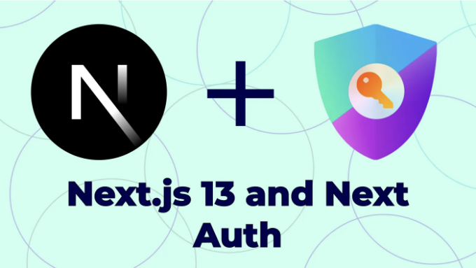
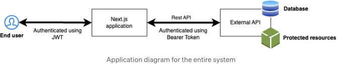
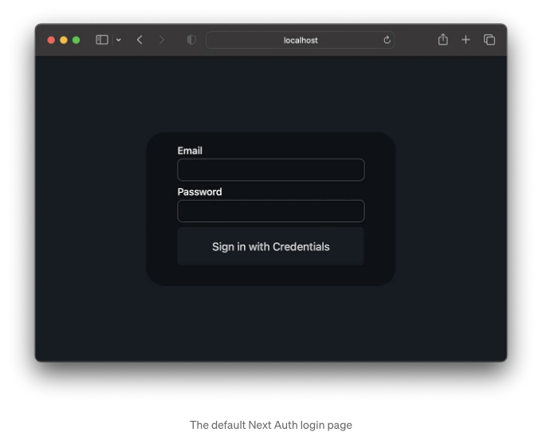

Next.js는 강력한 SSR 프레임워크로, 서버 측 렌더링과 정적 사이트 생성을 제공하여 성능을 향상시킵니다. Next Auth와 결합하면 다양한 인증 솔루션을 제공하여 안전한 사용자 인증을 위한 강력한 동반자를 갖게 됩니다.

오늘은 사용자를 외부 API에 인증하는 로그인 흐름을 생성하는 방법을 살펴보겠습니다. 사용자는 이메일 주소와 비밀번호를 사용하여 로그인하고 JWT가 생성됩니다. JWT는 쿠키로 저장되어 모든 다음 요청과 함께 전송됩니다 (말 그대로 다음 요청과 함께). Next Auth를 사용하여 권한 부여 및 인증을 정책으로 적용하는 방법은 여러 가지가 있습니다. 미들웨어 수준에서 적용하거나 Next AuthgetServerSession을 사용하여 서버 구성 요소에서 적용하거나 심지어 Next Auth의 useSession을 사용하여 클라이언트 측에서 적용할 수도 있습니다.

Next Auth는 Next.js 13 앱 라우터 구조와 페이지 라우터를 모두 지원합니다. 이 게시물에서는 앱 라우터 경로를 사용할 것입니다. 응용 프로그램 구조는 다음과 같습니다.

<!-- ui-log 수평형 -->
<ins class="adsbygoogle"
  style="display:block"
  data-ad-client="ca-pub-4877378276818686"
  data-ad-slot="9743150776"
  data-ad-format="auto"
  data-full-width-responsive="true"></ins>
<component is="script">
(adsbygoogle = window.adsbygoogle || []).push({});
</component>



이 기사에서는 사용자 정의 외부 API를 사용한 비교적 구체적인 사용 사례만 탐구할 것입니다. 하지만 Next Auth는 FusionAuth, Google Sign-in, OAuth 등과 같은 다양한 인증 기술을 지원합니다.

## 외부 API 구조

외부 API에는 사용자 이름과 비밀번호 쌍을 요청 본문에서 받아들이는 인증 엔드포인트인 POST /api/auth/login이 있습니다. 인증이 성공하면 외부 API에 대한 요청이 200 상태 응답을 보내고, 그렇지 않으면 4xx 응답을 보냅니다.

<!-- ui-log 수평형 -->
<ins class="adsbygoogle"
  style="display:block"
  data-ad-client="ca-pub-4877378276818686"
  data-ad-slot="9743150776"
  data-ad-format="auto"
  data-full-width-responsive="true"></ins>
<component is="script">
(adsbygoogle = window.adsbygoogle || []).push({});
</component>

성공적인 인증 요청의 JSON 응답 본문에는 다음과 같이 사용자 객체와 토큰 객체가 포함됩니다.

```js
{
    "user": {
        "id": 1,
        "username": "john.doe@mailinator.com",
        "email": "john.doe@mailinator.com",
        "fullname": "John Doe",
        "role": "SUPER",
        "createdAt": "2021-05-30T06:45:19.000Z",
        "name": "John Doe"
    },
    "token": "ey..."
}
```

외부 API로의 모든 후속 응답은 Authorization 헤더에 Bearer 토큰으로 토큰을 포함해야 합니다.

이제 충분한 컨텍스트가 마련되었으니, 코드로 넘어갑시다!(드디어!)

<!-- ui-log 수평형 -->
<ins class="adsbygoogle"
  style="display:block"
  data-ad-client="ca-pub-4877378276818686"
  data-ad-slot="9743150776"
  data-ad-format="auto"
  data-full-width-responsive="true"></ins>
<component is="script">
(adsbygoogle = window.adsbygoogle || []).push({});
</component>

# Next Auth 설치하기

첫 번째 단계는 Next Auth NPM 패키지를 프로젝트에 추가하는 것입니다. yarn add next-auth 또는 npm install next-auth 를 실행할 수 있습니다.

다음으로는 환경 파일에 비밀 값을 추가해야 합니다. 개발 중에는 비어 둘 수 있지만, 프로덕션 단계에서는 오류가 발생할 수 있습니다. 이 값을 추가하는 방법에 대한 자세한 정보는 공식 Next Auth 문서에서 확인할 수 있습니다.

# 자격 증명 공급자

<!-- ui-log 수평형 -->
<ins class="adsbygoogle"
  style="display:block"
  data-ad-client="ca-pub-4877378276818686"
  data-ad-slot="9743150776"
  data-ad-format="auto"
  data-full-width-responsive="true"></ins>
<component is="script">
(adsbygoogle = window.adsbygoogle || []).push({});
</component>

Next Auth를 사용하면 사용자에게 자격 증명 로그인 및 소셜 로그인 등 하나 이상의 로그인 옵션을 제공할 수 있어요. 각 로그인 방법은 해당 제공자를 사용하여 활성화되어요. 우리는 자격 증명 제공자를 사용할 거에요. 이 제공자는 이미 사용자를 인증할 외부 API가 있는 경우 유용해요.

Next Auth를 사용하여 인증 플로우를 구현하는 것은 정말 쉬워요. /app/api/auth/[...nextauth]/route.ts 파일을 생성하세요. [...nextauth]는 /api/auth/*로 시작하는 요청에 대한 일종의 캐치올 루트에요. 내용은 다음과 같아야 해요:

```js
import { authenticate } from "@/services/authService"
import NextAuth from "next-auth"
import type { AuthOptions } from "next-auth"
import CredentialsProvider from "next-auth/providers/credentials"

export const authOptions: AuthOptions = {
  providers: [
    CredentialsProvider({
      name: 'Credentials',
      credentials: {
        email: { label: "이메일", type: "text" },
        password: { label: "비밀번호", type: "password" }
      },
      async authorize (credentials, req) {
        if (typeof credentials !== "undefined") {
          const res = await authenticate(credentials.email, credentials.password)
          if (typeof res !== "undefined") {
            return { ...res.user, apiToken: res.token }
          } else {
            return null
          }
        } else {
          return null
        }
      }
    })
  ],
  session: { strategy: "jwt" }
}

const handler = NextAuth(authOptions)

export { handler as GET, handler as POST }
```

우리는 providers: [] 배열에 필요한 경우 다수의 로그인 방법을 추가할 수 있지만, 여기에는 몇 가지 구성만 한 자격 증명 제공자만 추가했어요. credentials 객체는 로그인 화면에 표시되는 필드를 결정해요. 그리고 네, Next Auth는 `당신의 Next.js 서버`/api/auth/signin에서 접근 가능한 간단한 기본 로그인 화면이 내장되어 있어요.

<!-- ui-log 수평형 -->
<ins class="adsbygoogle"
  style="display:block"
  data-ad-client="ca-pub-4877378276818686"
  data-ad-slot="9743150776"
  data-ad-format="auto"
  data-full-width-responsive="true"></ins>
<component is="script">
(adsbygoogle = window.adsbygoogle || []).push({});
</component>



크리덴셜 객체 내의 키는 입력 필드의 이름으로 사용됩니다. 다른 HTML 속성(ex: label 및 type)도 필드별로 제공할 수 있습니다. 완전히 사용자 정의 페이지를 만들어야 하는 경우에도 걱정하지 마세요. Next Auth 문서에서 설명된대로 자신의 페이지를 정의할 수 있습니다.

다음으로 주목해야 할 점은 authorize(credentials, req) 콜백입니다. 크리덴셜 객체는 제출된 폼의 키-값 매핑을 포함할 것입니다(이 경우 credentials.email 및 credentials.password를 통해 접근 가능합니다). req 객체에는 요청에 대한 세부 정보가 포함되므로 승인 프로세스 중에 IP 주소 또는 사용자 에이전트를 확인할 수도 있습니다. 인증 프로세스가 외부 API에 요청을 보내고 실패했을 경우 undefined를 반환하거나 성공 응답(이전에 제공된 것)을 반환합니다. authorize() 메서드가 null을 반환하면 Next Auth는 인증이 실패했다고 해석하고 로그인 폼에 메시지를 표시합니다.

크리덴셜 프로바이더를 사용하려면 세션 전략을 jwt로 설정해야 합니다. 어쨌든 세션 메커니즘으로 JWT가 필요하므로 모든 것이 잘 작동합니다!

<!-- ui-log 수평형 -->
<ins class="adsbygoogle"
  style="display:block"
  data-ad-client="ca-pub-4877378276818686"
  data-ad-slot="9743150776"
  data-ad-format="auto"
  data-full-width-responsive="true"></ins>
<component is="script">
(adsbygoogle = window.adsbygoogle || []).push({});
</component>

# 다음 Auth 미들웨어

지금 로그인 페이지가 준비되었으니, 우리는 로그인 흐름을 테스트하기 위한 보호된 경로를 만들 것입니다. 우리는 이것을 미들웨어 수준에서 어떻게 강제할 수 있는지 먼저 살펴볼 것입니다.

다음 Auth에 내장된 withAuth 미들웨어가 있습니다. 이를 사용하려면 루트에 middleware.ts라는 새 파일을 만들고 아래 내용을 추가하세요:

```js
import { withAuth } from "next-auth/middleware"

// 미들웨어는 모든 경로에 적용되며, 선택을 위해 조건문을 사용하세요

export default withAuth(
  function middleware (req) {
  },
  {
    callbacks: {
      authorized: ({ req, token }) => {
        if (
          req.nextUrl.pathname.startsWith('/protected') &&
          token === null
        ) {
          return false
        }
        return true
      }
    }
  }
)
```

<!-- ui-log 수평형 -->
<ins class="adsbygoogle"
  style="display:block"
  data-ad-client="ca-pub-4877378276818686"
  data-ad-slot="9743150776"
  data-ad-format="auto"
  data-full-width-responsive="true"></ins>
<component is="script">
(adsbygoogle = window.adsbygoogle || []).push({});
</component>

권한 부여된 콜백은 사용자가 인가되었는지를 확인하기 위해 호출됩니다 (당연하지!). 이는 req 및 token 정보를 기반으로 우리만의 규칙을 추가할 수 있음을 의미합니다. 이 사용 사례에서 사용자는 인증되었을 때에만 (/protected로 시작하는 경로에만) 접근할 수 있습니다 (구체적으로는 토큰이 있는 경우). 우리가 false를 반환하면 미들웨어가 로그인 페이지로 리디렉션을 수행할 것이며 (특히 이전에 `your Next.js server`/api/auth/signin 경로로 이동할 것입니다. 사용자가 사용자 정의 경로를 정의하지 않은 경우), 나중에 우리는 어떻게 사용자 객체를 외부 API에서 토큰에 첨부하여 역할 기반의 접근 제어를 수행할 수 있는지 알아볼 것입니다!

# 서버 측 컴포넌트에서 세션에 액세스하기

만약 페이지에 로그인 버튼을 표시하고 싶다면 어떻게 해야할까요? 컴포넌트 수준 (서버 컴포넌트 수준)에서 인증 상태를 얻을 수 있어야 합니다. 다음 코드와 함께 /app/public/page.tsx 페이지를 만들 수 있습니다:

```js
import { getServerSession } from "next-auth/next"
import type { NextRequest } from "next/server"
import { authOptions } from "@/app/api/auth/[...nextauth]/route"

export default async function Protected (req: NextRequest): Promise<any> {
  const session = await getServerSession(authOptions)

  return (
    <div className='grid grid-cols-2 text-white p-4'>
      <div>
        {
          session !== null
            ? <h1 className='leading-loose text-[15rem] font-extrabold text-accent'>
                안녕 {session?.user.name}님!
              </h1>
            : <a className='btn btn-primary' href='/api/auth/signin'>로그인</a>
        }
      </div>
    </div>
  )
}
```

<!-- ui-log 수평형 -->
<ins class="adsbygoogle"
  style="display:block"
  data-ad-client="ca-pub-4877378276818686"
  data-ad-slot="9743150776"
  data-ad-format="auto"
  data-full-width-responsive="true"></ins>
<component is="script">
(adsbygoogle = window.adsbygoogle || []).push({});
</component>

이 URL은 `/protected`로 시작하지 않기 때문에, 이전에 사용한 Next Auth 미들웨어에 영향을 받지 않습니다. getServerSession을 사용하면 현재 세션을 가져올 수 있습니다 (사용자가 로그인하지 않은 경우 null을 반환합니다). 이렇게 하면, 사용자가 로그인하지 않았을 때 '로그인' 버튼을 표시하거나 사용자가 로그인한 경우 사용자의 이름으로 인사말을 표시할 수 있습니다.

# 클라이언트 측 컴포넌트에서 세션에 액세스하기

Next Auth는 클라이언트 측에서 세션 데이터와 인증 상태를 가져오는 useSession 훅을 제공합니다. 이 훅을 사용하기 전에 컴포넌트를 SessionProvider로 래핑해야 합니다. 내부적으로 React Context를 사용하기 때문입니다.

다음 내용을 갖는 `/app/context/client-provider.tsx` 파일을 생성할 수 있습니다:

<!-- ui-log 수평형 -->
<ins class="adsbygoogle"
  style="display:block"
  data-ad-client="ca-pub-4877378276818686"
  data-ad-slot="9743150776"
  data-ad-format="auto"
  data-full-width-responsive="true"></ins>
<component is="script">
(adsbygoogle = window.adsbygoogle || []).push({});
</component>

```js
'사용자 클라이언트'

import { SessionProvider } from "next-auth/react"

export default function Provider ({
  children,
  session
}: {
  children: React.ReactNode
  session: any
}): React.ReactNode {
  return <SessionProvider session={session}>
    {children}
  </SessionProvider>
}
```

우리는 이제 서버 측 구성 요소(아마도 루트 layout.tsx)에서 이를 사용할 수 있습니다.

```js
import '@/app/globals.css'
import React from 'react'
import { Montserrat } from 'next/font/google'
import Provider from "@/app/context/client-provider"
import { getServerSession } from "next-auth/next"
import { authOptions } from "@/app/api/auth/[...nextauth]/route"

const montserrat = Montserrat({ subsets: ['latin'] })

export const metadata = {
  title: 'Create Next App',
  description: 'Generated by create next app'
}

export default async function RootLayout ({
  children
}: {
  children: React.ReactNode
}): React.ReactNode {
  const session = await getServerSession(authOptions)

  return (
    <html lang="en">
      <body className={`${montserrat.className} bg-primary min-h-screen min-w-screen`}>
        <Provider session={session}>
          {children}
        </Provider>
      </body>
    </html>
  )
}
```

왜 layout.tsx 안에 SessionProvider 자체를 감쌀 수 없는 걸까요? SessionProvider는 React Context를 사용하기 때문에("use client"를 사용하여 경계를 정의하지 않았기 때문에) 서버 측 구성 요소로 가져올 수 없습니다. 그러면 왜 클라이언트 구성 요소에서 사용하지 않을까요? SessionProvider에는 오로지 getServerSession을 통해서만 얻을 수 있는 세션 객체이어야 합니다. 이것도 모르는게 아닙니다. getServerSession()을 통해 가져온 세션을 session prop으로 전달해야 합니다. 이런 상황에서 따를 수 있는 패턴은 이렇습니다. 이 경우에서는 서버 측 객체가 전달될 새로운 클라이언트 측 구성 요소(client-provider.tsx)를 만들어서 prop으로 전달합니다. 그 후, 이 새로운 구성 요소를 서버 측인 layout.tsx로 가져와서 getServerSession()에서 얻은 세션을 session prop으로 전달해주세요!

<!-- ui-log 수평형 -->
<ins class="adsbygoogle"
  style="display:block"
  data-ad-client="ca-pub-4877378276818686"
  data-ad-slot="9743150776"
  data-ad-format="auto"
  data-full-width-responsive="true"></ins>
<component is="script">
(adsbygoogle = window.adsbygoogle || []).push({});
</component>

이제 모두 처리되었으니 클라이언트 컴포넌트 내에서 useSession을 사용할 수 있습니다:

```js
'use client'

import { useSession } from "next-auth/react"
import React, { useState } from "react"

export default function ClientSideRoot (): any {
  const { data: session } = useSession()

  const [shown, setShown] = useState<boolean>(false)
  const clickHandler = (): void => {
    setShown(!shown)
  }

  return (
    <div className='grid grid-cols-2 text-white p-4'>
      <div>
        <h1 className='leading-loose text-[15rem] font-extrabold text-accent'>
          안녕 {session?.user.name}님!
        </h1>
      </div>
      <div>
        <p>보호된 클라이언트 페이지</p>
        <button className="btn btn-primary" onClick={clickHandler}>전환</button>
        {shown
          ? <pre>{JSON.stringify(session, null, 2)}</pre>
          : null
        }
      </div>
    </div>
  )
}
```

# 세션 토큰 콘텐츠 사용자 정의

기본적으로 세션 토큰에는 기본적인 이름과 이메일이 포함됩니다. 그러나 우리의 경우엔 세션에 지속되어야 하는 다른 데이터(역할 및 외부 API 토큰 같은)가 있습니다. Next Auth는 커스터마이즈 가능하며 세션 콘텐츠를 수정하기 위한 콜백을 제공합니다. /app/api/auth/[...nextauth]/route.ts의 Next Auth 구성을 편집할 수 있습니다.```

<!-- ui-log 수평형 -->
<ins class="adsbygoogle"
  style="display:block"
  data-ad-client="ca-pub-4877378276818686"
  data-ad-slot="9743150776"
  data-ad-format="auto"
  data-full-width-responsive="true"></ins>
<component is="script">
(adsbygoogle = window.adsbygoogle || []).push({});
</component>

```js
  // ... 
  session: { strategy: "jwt" },
  callbacks: {
    async session ({ session, token, user }) {
      const sanitizedToken = Object.keys(token).reduce((p, c) => {
        // 불필요한 속성 제거
        if (
          c !== "iat" &&
          c !== "exp" &&
          c !== "jti" &&
          c !== "apiToken"
        ) {
          return { ...p, [c]: token[c] }
        } else {
          return p
        }
      }, {})
      return { ...session, user: sanitizedToken, apiToken: token.apiToken }
    },
    async jwt ({ token, user, account, profile }) {
      if (typeof user !== "undefined") {
        // 사용자가 처음으로 로그인했으므로 사용자 객체가 채워짐
        return user as JWT
      }
      return token
    }
  }
}
```

jwt() 콜백은 사용자가 처음으로 로그인할 때 사용자와 함께 호출됩니다. 사용자 객체는 authorize 함수에서 반환된 객체로 채워집니다. jwt 콜백에서 반환된 객체가 세션 쿠키에 저장됩니다.

session() 콜백은 세션 쿠키 콘텐츠를 token 매개변수로 받습니다. 이 콜백에서 반환하는 내용이 useSession 또는 getServerSession을 호출할 때 제공됩니다.

이렇게 하면 토큰 콘텐츠를 사용자 정의할 수 있습니다. 이제 서버 측과 클라이언트 측에서 모두 apiToken에 액세스할 수 있으므로 양쪽 컨텍스트에서 인증된 fetch 요청을 시작할 유연성이 제공됩니다.