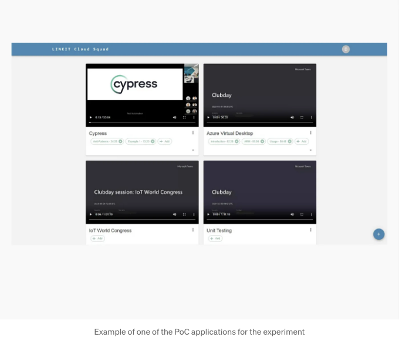
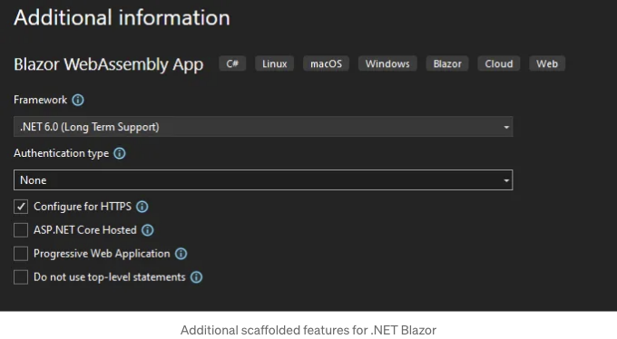
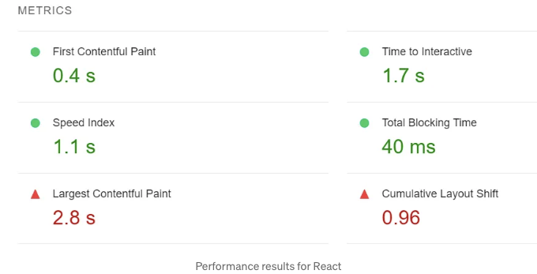
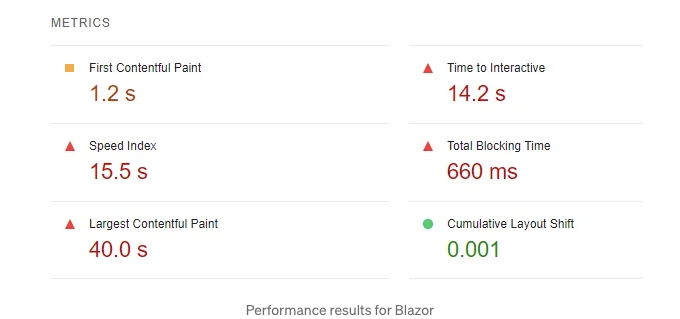
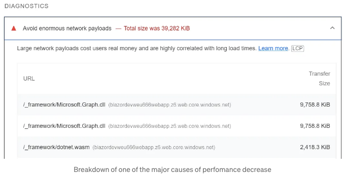
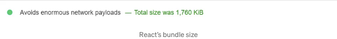
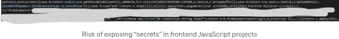
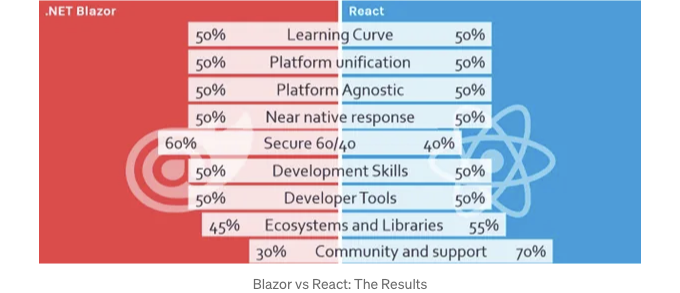

프론트엔드 기술로, 저희 팀은 여전히 서버 측 웹 페이지를 생성하는 .NET 라이브러리인 Razor를 사용하고 있었어요. 안타깝게도, Razor가 페이지를 렌더링하고 클라이언트로 보내는 속도는 요즘 원하는 성능을 갖고 있지 않아요. 고대적인 서버 측 요청/응답 모델 대신, 최신 프론트엔드 프레임워크로 개발된 웹 페이지는 페이지 콘텐츠를 업데이트하기 위해 더 클라이언트 측 접근 방식을 사용해요. 더 현대적인 프론트엔드 기술을 선택하기 위해, 우리는 Razor Pages의 후손인 .NET Blazor와 인기 있는 JavaScript 라이브러리인 React를 비교해서 어떤 것이 우리 팀에 더 적합한지 결정하려고 했어요. 이 기술들을 조금 더 잘 이해해보고 좋은 비교를 할 수 있도록 해봐요.

## Blazor

.NET Blazor는 Microsoft에서 2018년에 만든 오픈 소스 웹 개발 프레임워크에요. 이 프레임워크는 .NET과 C#을 사용하여 인터랙티브한 클라이언트 측 웹 UI를 구축하는 데 사용돼요. 이는 이전에 완전한 스택 .NET 개발을 위해 MVC 접근 방식으로 사용되었던 Razor Pages의 후손이라고 볼 수 있어요.

Blazor는 현대적인 웹 개발을 염두에 두고 만들어졌으며, 몇 가지 다른 시나리오를 지원해요:

<!-- ui-log 수평형 -->
<ins class="adsbygoogle"
  style="display:block"
  data-ad-client="ca-pub-4877378276818686"
  data-ad-slot="9743150776"
  data-ad-format="auto"
  data-full-width-responsive="true"></ins>
<component is="script">
(adsbygoogle = window.adsbygoogle || []).push({});
</component>

- 웹소켓을 통해 DOM 차이 업데이트를 전달하여 서버 측 렌더링
- WebAssembly (WASM)에서 실행하고 JS 상호 운용성을 통해 DOM을 업데이트하여 클라이언트 측 렌더링
- Blazor를 네이티브 데스크톱 및 모바일 프레임워크 MAUI 또는 WPF와 통합하여 하이브리드 구현

Blazor는 가장 인기있는 현대 브라우저에서 지원됩니다.

## 약속

Blazor의 주요 약속은 JavaScript 한 줄도 쓰지 않고 풀 스택 웹 앱을 구축할 수 있는 것입니다.

<!-- ui-log 수평형 -->
<ins class="adsbygoogle"
  style="display:block"
  data-ad-client="ca-pub-4877378276818686"
  data-ad-slot="9743150776"
  data-ad-format="auto"
  data-full-width-responsive="true"></ins>
<component is="script">
(adsbygoogle = window.adsbygoogle || []).push({});
</component>

또한, 다음과 같은 것들을 약속합니다:

- 어디서나 실행 가능 — Microsoft는 Blazor 구성 요소를 쉽게 호스팅할 수 있으며, 웹어셈블리를 통해 브라우저에서, ASP.NET Core에서 서버 측에서, 그리고 네이티브 앱에서도 사용할 수 있다고 주장합니다.
- 플랫폼 통합 — 여러 데스크톱 및 모바일 플랫폼을 위한 하나의 응용 프로그램을 생성합니다.
- 거의 네이티브 반응 — 특히 웹어셈블리에서 Blazor를 실행할 때, 서버로의 왕복이 제거되어 응답이 빠르게 이루어집니다.
- 학습과 커뮤니티 지원이 풍부 — Microsoft Learn을 활용하여 Microsoft의 성숙한 학습 자료 모음 및 다양한 MVP 개발자로 인해, Blazor 학습 및 문제 해결에 충분한 안내를 제공합니다.

## 작동 방식

본질적으로 모든 Blazor 앱은 구성 요소 기반입니다. 즉 사용자 인터페이스 내의 요소가 모달, 폼 또는 표와 같은 작은 재사용 가능한 구성 요소로 분리된다는 것을 의미합니다.

<!-- ui-log 수평형 -->
<ins class="adsbygoogle"
  style="display:block"
  data-ad-client="ca-pub-4877378276818686"
  data-ad-slot="9743150776"
  data-ad-format="auto"
  data-full-width-responsive="true"></ins>
<component is="script">
(adsbygoogle = window.adsbygoogle || []).push({});
</component>

이 컴포넌트들은 예전부터 Razor 페이지에 사용되던 Razor 마크업으로 작성되었습니다. 이 문법을 사용하면 C#과 HTML 마크업을 쉽게 전환할 수 있습니다. Blazor는 옛날 방식인 요청 및 응답 모델에 의존하지 않고, 대신 현대적인 JavaScript UI 프레임워크에서 사용하는 기술을 채용하여 클라이언트 측 디자인 및 논리 구현에 컴포넌트만 사용합니다.

Blazor 컴포넌트는 어셈블리 내/외에서 재사용할 수 있습니다. 동일 프로젝트 내에서는 중첩하여 재사용하거나 클래스 라이브러리 또는 NuGet 패키지로 다른 프로젝트에서 사용할 수 있습니다.

Blazor 서버 렌더링 옵션을 사용하는 경우에도 Blazor는 동작이 트리거될 때마다 완전한 웹 페이지를 매번 전송하지 않습니다. 대신 자체 DOM 버전과 브라우저의 DOM을 비교하여 차이/차이를 추출하고 이 작은 하위 집합만 SignalR을 통해 다시 전송합니다. 이렇게 함으로써 사용자 상호작용마다 부분/전체 페이지 다시로드를 수행하여 웹사이트가 느려지고 느리게 느껴지는 것을 방지합니다.

Blazor WebAssembly(WASM)에도 유사한 기술이 사용됩니다. 매우 간단히 요약하면 WASM은 JavaScript 이외의 프로그래밍 언어를 컴파일할 수 있는 스택 기반 가상 머신에서 실행할 수 있는 이진 명령 형식입니다. 기본적으로 모든 네 가지 현대 브라우저(Chrome, Firefox, Edge 및 Safari)에는 브라우저에 통합된 이러한 가상 머신이 있어 JavaScript 이외의 프로그래밍 언어를 컴파일할 수 있도록 합니다. 이것은 Docker가 작동하는 방식과 약간 비교할 수 있으며 모듈을 실행할 수 있는 안전한 메모리 환경을 제공합니다. 이 WASM 샌드박스를 통해 Blazor는 자체 DOM의 복사본을 만들고 차이 비교를 수행하여 브라우저 DOM에 변경 사항이 발생할 경우 브라우저 DOM을 수정할 수 있습니다.

<!-- ui-log 수평형 -->
<ins class="adsbygoogle"
  style="display:block"
  data-ad-client="ca-pub-4877378276818686"
  data-ad-slot="9743150776"
  data-ad-format="auto"
  data-full-width-responsive="true"></ins>
<component is="script">
(adsbygoogle = window.adsbygoogle || []).push({});
</component>

## 왜 Blazor가 좋은 선택일까요?

Blazor은 저희 팀이 이미 C#과 .NET 기술을 사용하는 데 익숙하기 때문에 우수한 기술이 될 수 있습니다. Blazor는 Razor Pages에 접근 방식적으로 비슷하지만 우리가 익숙해져야 할 새로운 개념들을 소개합니다. 비교적 성숙한 기술이며 문서와 커뮤니티 지원이 있습니다.

# React

React는 자바스크립트 라이브러리로, 순수 자바스크립트에 기반합니다. Facebook(지금은 Meta)이 2013년에 무료 오픈 소스 라이브러리로 처음 출시했습니다. React의 핵심은 매우 기본적이며, 기본적으로 라우팅 및 데이터 가져오기와 같은 기능을 기본적으로 포함하지 않으며 대신 본인만의 유연성을 제공하거나 이를 위해 제3자 솔루션을 구현할 수 있도록 합니다.

<!-- ui-log 수평형 -->
<ins class="adsbygoogle"
  style="display:block"
  data-ad-client="ca-pub-4877378276818686"
  data-ad-slot="9743150776"
  data-ad-format="auto"
  data-full-width-responsive="true"></ins>
<component is="script">
(adsbygoogle = window.adsbygoogle || []).push({});
</component>

다른 라이브러리를 사용하여 React를 실행할 수 있습니다:

- 예를 들어 서버 측에서 Next.js를 사용하는 것
- 클라이언트 측에서는 React만 사용하여 달성할 수 있습니다
- React Native를 사용하여 네이티브 모바일 애플리케이션을 개발할 수 있습니다

## Promise

React는 쉽게 설계하고 빠르게 로딩할 수 있는 컴포넌트 기반 시스템을 약속합니다. Next.js나 Remix와 같은 추가 프레임워크를 사용하여 React에서 풀 스택 애플리케이션을 구축할 수 있는 가능성을 제공합니다.

<!-- ui-log 수평형 -->
<ins class="adsbygoogle"
  style="display:block"
  data-ad-client="ca-pub-4877378276818686"
  data-ad-slot="9743150776"
  data-ad-format="auto"
  data-full-width-responsive="true"></ins>
<component is="script">
(adsbygoogle = window.adsbygoogle || []).push({});
</component>

그 외에도 이것이 약속하는 것은:

- 플랫폼 통합 — 여러 데스크톱 및 모바일 플랫폼을 위한 하나의 애플리케이션을 만듭니다.
- 강력한 제작 초점 — React는 개발과 새로운 기능 수용에 있어 높은 기준을 가지고 있다고 주장하며, 새로운 이터레이션을 철저히 테스트하여 제작 준비가 되었는지 확인합니다.
- 배우기 쉽고 커뮤니티 지원 — React에는 많은 문서가 제공되며 JavaScript 커뮤니티 중에서 가장 큰 개발 커뮤니티 중 하나입니다.

## 작동 방식은 무엇인가요?

React 애플리케이션은 컴포넌트 기반으로 작동합니다. 이는 블레이저와 마찬가지로 애플리케이션이 재사용 가능한 작은 컴포넌트(예: 버튼 또는 폼)로 구성되는 것을 의미합니다.

<!-- ui-log 수평형 -->
<ins class="adsbygoogle"
  style="display:block"
  data-ad-client="ca-pub-4877378276818686"
  data-ad-slot="9743150776"
  data-ad-format="auto"
  data-full-width-responsive="true"></ins>
<component is="script">
(adsbygoogle = window.adsbygoogle || []).push({});
</component>

이러한 구성 요소를 설명하는 것은 JSX (JavaScript Syntax Extension)라는 특별한 마크업 언어로 이루어집니다. 이는 HTML과 React 로직을 쉽게 섞어 사용할 수 있게 해줍니다. React를 사용하면 구성 요소의 상태를 관리할 수 있습니다. 이는 구성 요소 내부에 상태를 로컬로 호스팅하거나, 더 복잡한 시나리오에서는 context와 같은 전역 상태 저장소를 사용하여 수행할 수 있습니다. 이 상태는 React에 의해 관리되며 해당 UI 트리 내의 올바른 노드와 연관시킵니다.

React가 구성 요소 내부의 상태 변경에 응답하는 방식은 해당 구성 요소 및 모든 하위 요소를 다시 렌더링하는 것입니다. 이는 일관된 및 최신 상태의 UI를 유지하기 위해 수행됩니다. 이 UI 상태는 가상 DOM에 유지되며, 이는 실제 DOM의 가벼운 버전입니다. 또한, React는 또 다른 가상 DOM을 유지하고 둘을 계속 비교하여 새로운 변경 사항이 발생할 때 사용합니다. 이 차이의 결과는 실제 DOM을 업데이트하는 데 사용됩니다. 이 프로세스는 가상 DOM이 DOM 트리의 청사진만 포함하지만 렌더링되지 않으므로 DOM을 업데이트하는 데 시간과 자원을 절약합니다. React는 이 기술을 "Reconciliation"이라고 부릅니다. React의 렌더링 전략에 대해 더 알고 싶다면 이 훌륭한 기사를 확인해보세요.

##왜 잘 어울릴까요?

React는 이미 프런트엔드 개발에 일부 JavaScript를 사용하는 데 편안한 팀에게 적합할 수 있습니다. 이는 가장 인기 있는 프런트엔드 UI 라이브러리이며 Blazor와 비교해 더 대중적인 기술입니다. 이 기술은 매우 성숙하고 (10년 이상) 많은 문서와 커뮤니티 지원이 제공됩니다.

<!-- ui-log 수평형 -->
<ins class="adsbygoogle"
  style="display:block"
  data-ad-client="ca-pub-4877378276818686"
  data-ad-slot="9743150776"
  data-ad-format="auto"
  data-full-width-responsive="true"></ins>
<component is="script">
(adsbygoogle = window.adsbygoogle || []).push({});
</component>

# 전투 준비

이러한 기술에 대한 정보와 경험을 기반으로, 이 두 기술을 사용하는 실용적인 작업 느낌을 얻고 싶었기 때문에 React 및 Blazor WASM에 대한 두 개의 개념 증명 프로젝트를 생성하는 실험을 실행했습니다. 저희는 개발 팀을 동일한 그룹으로 나누어 약 20일 동안 애플리케이션을 개발했습니다.

좋은 비교를 위해 일반적인 제한 사항과 요구 사항을 설정했습니다. 예를 들어, 양쪽 모두 애노테이션 및 비디오 시청을 위한 애플리케이션을 개발해야 했습니다. 특정 기능이 필요하게 명시되었으며 제한 사항으로 어플리케이션 클라이언트 측만 허용되었습니다.



<!-- ui-log 수평형 -->
<ins class="adsbygoogle"
  style="display:block"
  data-ad-client="ca-pub-4877378276818686"
  data-ad-slot="9743150776"
  data-ad-format="auto"
  data-full-width-responsive="true"></ins>
<component is="script">
(adsbygoogle = window.adsbygoogle || []).push({});
</component>

# 프로세스와 경험

두 팀 모두 기술에 더 익숙해지는 경험을 즐기고 있다고 보고했습니다. Blazor 팀의 모든 구성원은 이미 C#/.NET에서 프로그래밍을 할 수 있었고 학습 곡선이 비교적 낮다고 느꼈습니다. 반면 그들은 그림자 DOM과 변경된 애플리케이션 라이프사이클과 같은 더 복잡한 시스템들을 편안해질 때 까지 조금 더 어려웠다고 느꼈습니다.

한편 React 팀도 자바스크립트를 사용하는 데 편안했고 프레임워크가 매우 직관적이며 학습 곡선이 낮았다고 느꼈습니다. 전역 스토어를 사용하는 등 더 복잡한 상태 기술을 마스터하는 것이 조금 더 어려웠습니다.

# 비교

<!-- ui-log 수평형 -->
<ins class="adsbygoogle"
  style="display:block"
  data-ad-client="ca-pub-4877378276818686"
  data-ad-slot="9743150776"
  data-ad-format="auto"
  data-full-width-responsive="true"></ins>
<component is="script">
(adsbygoogle = window.adsbygoogle || []).push({});
</component>

Blazor와 React의 이점과 단점을 직접 체험한 것을 기반으로 비교해보겠습니다:

## 구성 요소

Blazor와 React는 둘 다 구성 요소 사용을 지원하여 응용 프로그램을 매우 모듈식으로 만들 수 있습니다. 이로써 개발자들이 실제 디자인에 더 많은 초점을 두고 구현 세부 사항에 대해 덜 걱정할 수 있게끔 많은 추상화를 제공합니다. 예를 들어, 아래에 있는 React 구성 요소를 보세요. 이것은 특정 비디오에 대한 모든 비디오 컨트롤을 포함하는 예시입니다:
```js
type VideoCardProps = {
  video: Video;
  handleEditOpen: (video: any) => void;
  setRefresh: Dispatch<SetStateAction<boolean>>;
};

export default function VideoCard({ video, handleEditOpen, setRefresh }: VideoCardProps) {
  const { createdOn, presenter, description, videoOptions, name } = video;
  const [expanded, setExpanded] = useState<boolean>(false);
  const ref = useRef<HTMLVideoElement>(null);

  return (
    <Card>
      <CardMedia ref={ref} component="video" src={videoOptions.video} controls width="100%" height="100%">
        <track src={videoOptions.track} kind="captions" default srcLang="en" />
      </CardMedia>
      <CardContent sx={ paddingBottom: 0 }>
        <Typography variant="h5" component="div" sx={ display: "flex", justifyContent: "space-between" }>
          {name}
          <span>
            <MoreVert onClick={() => handleEditOpen(video)} />
          </span>
        </Typography>
        <TagComponent video={video} videoRef={ref} setRefresh={setRefresh} />
      </CardContent>
      <CardActions sx={ paddingTop: 0 }>
        <ExpandMoreComponent
          expand={expanded}
          onClick={() => setExpanded((state) => !state)}
          aria-expanded={expanded}
          aria-label="show more"
        >
          <ArrowDropDownIcon />
        </ExpandMoreComponent>
      </CardActions>
      <Collapse in={expanded} timeout="auto" unmountOnExit>
        <CardContent>
          <Typography
            sx={ display: "flex", flexDirection: "column", justifyContent: "space-between" }
            color="text.secondary"
            variant="body1"
            component="div"
          >
            <span>{`생성 날짜: ${dayjs(createdOn).format("DD-MM-YYYY HH:mm") ?? ""}`}</span>
            <span>{`발표자: ${presenter ?? ""}`}</span>
            <span>{description ? `설명: ${description ?? ""}` : ""}</span>
          </Typography>
        </CardContent>
      </Collapse>
    </Card>
  );
}
```

<!-- ui-log 수평형 -->
<ins class="adsbygoogle"
  style="display:block"
  data-ad-client="ca-pub-4877378276818686"
  data-ad-slot="9743150776"
  data-ad-format="auto"
  data-full-width-responsive="true"></ins>
<component is="script">
(adsbygoogle = window.adsbygoogle || []).push({});
</component>

별도의 화면 구성 요소 내에서는 컴포넌트를 가져와 필요한 매개변수를 전달하여 추상화할 수 있습니다. 특히 동일한 컴포넌트를 다양한 입력값으로 여러 번 렌더링할 때 유용합니다:

```js
<div>
  { currentVideos.map((video: Video) => 
        <VideoCard video={video} handleEditOpen={handleEditOpen} setRefresh={setRefresh} />
    )) }
</div>
```

Blazor의 경우, 컴포넌트를 생성한 후 아래와 같이 사용할 수 있습니다:

```js
@foreach (var video in _videos)
{
  <VideoController Video="@video" Url="@_url"></VideoController>
}
``` 

<!-- ui-log 수평형 -->
<ins class="adsbygoogle"
  style="display:block"
  data-ad-client="ca-pub-4877378276818686"
  data-ad-slot="9743150776"
  data-ad-format="auto"
  data-full-width-responsive="true"></ins>
<component is="script">
(adsbygoogle = window.adsbygoogle || []).push({});
</component>

또한, Blazor은 데이터 바인딩 및 속성을 지원하여 개발을 쉽게 만들어 줍니다. 이는 특히 양식 유효성 검사에 유용합니다. 다음과 같이 모델에 속성을 주석 처리하여 사용할 수 있습니다:

```js
<EditForm Model="@Model" OnValidSubmit="@Submit">
    <DataAnnotationsValidator />
    <ValidationSummary />
    <div>
        <label>
            제목:
            <InputText @bind-Value="Model!.Title" />
        </label>
        <label>
            설명 (옵션):
            <InputTextArea @bind-Value="Model!.Description" />
        </label>
    </div>
    <div>
        <button type="submit">제출</button>
    </div>
</EditForm>

@code {
    public Video? Model {get; set;}

    private void Submit()
    {
        // ...제출 로직 실행
    }

    private class Video
    {
        [Required]
        [MinLength(2, ErrorMessage = "비디오 제목은 최소 2자 이상이어야 합니다.")]
        public string Title { get; set; } 

        [Required]
        [MaxLength(140, ErrorMessage = "설명은 최대 140자여야 합니다.")]
        public string Description { get; set; }
    }
}
```

`bind-Value` 속성을 사용하면 model 속성의 값을 설정할 수 있습니다. DOM 이벤트 발생 시 값을 변경할 수도 있습니다. 또한 `@bind:event` 속성을 사용하여 이벤트를 변경할 수도 있습니다. React에서도 이와 같은 유효성 검사가 가능하지만, 추가적인 외부 라이브러리 설치나 사용자 지정 솔루션을 작성해야 합니다.

## 컴포넌트 생명주기

<!-- ui-log 수평형 -->
<ins class="adsbygoogle"
  style="display:block"
  data-ad-client="ca-pub-4877378276818686"
  data-ad-slot="9743150776"
  data-ad-format="auto"
  data-full-width-responsive="true"></ins>
<component is="script">
(adsbygoogle = window.adsbygoogle || []).push({});
</component>

Blazor과 React는 모두 컴포넌트 라이프사이클을 활용하여 컴포넌트를 초기 렌더링하고 상태 변경에 따른 재렌더링을 처리하며, 더 이상 필요하지 않을 때 컴포넌트를 파괴하는 역할을 합니다. Blazor의 경우 Razor Pages의 라이프사이클과는 크게 다르며, 적절한 지식 없이 사용하면 부작용과 다른 문제를 발생시킬 수 있습니다. 특히 JavaScript 상호 운용과 관련된 문제에서 Blazor 팀은 DOM 동기화 문제에 부딪혔습니다.

React도 비슷한 도전을 겪습니다. 더 현대적인 React Hooks를 사용하든, 클래스 기반 컴포넌트의 라이프사이클 메서드를 사용하든, 컴포넌트 라이프사이클을 이해하지 못하고 사용하면 무한 재랜더링, 경쟁 조건 및 다른 원치 않는 부작용이 발생할 수 있습니다. React 팀에게도 React hooks 내에서 상태를 처리하는 것이 많은 어려움을 줬습니다. 예를 들어, 상태 변수와 업데이트 메서드를 하나의 useEffect 훅 안에서 함께 사용하려고 시도할 때, 매우 일반적인 안티 패턴이기 때문에 문제가 발생할 수 있습니다.

컴포넌트 라이프사이클에 대해 충분히 이해하는 것이 중요하며, 양쪽 기술을 시작하기 전에 깊이 있는 이해가 필요합니다. 특히 이 개념이 새로운 팀에게는 이러한 개념을 완전히 이해하는 것이 좀 노력이 필요할 수 있습니다.

<!-- ui-log 수평형 -->
<ins class="adsbygoogle"
  style="display:block"
  data-ad-client="ca-pub-4877378276818686"
  data-ad-slot="9743150776"
  data-ad-format="auto"
  data-full-width-responsive="true"></ins>
<component is="script">
(adsbygoogle = window.adsbygoogle || []).push({});
</component>

## 준비된 템플릿

React와 Blazor 둘 다 어느 정도 준비된 템플릿을 제공합니다. Blazor 개발에서는 Visual Studio를 사용할 때 완전히 뼈대가 잡힌 템플릿을 가져오기 위해 마법사를 따라갈 수도 있습니다:



이런 옵션들은 개별 계정을 기반으로 하는 인증 또는 Microsoft Identity Platform을 사용할 수도 있습니다. Visual Studio 내에서 연결 서비스를 사용하면 즉시 응용 프로그램 등록을 생성하고 설정할 수도 있는데, 이를 통해 Azure를 통한 인증을 포함한 사용 준비된 응용 프로그램을 만들 수 있습니다. 또한, Blazor를 위한 사용자 정의 Visual Studio 템플릿을 만들 수도 있습니다. Blazor 팀은 인증과 Progressive Web App (PWA) 지원을 포함하는 표준 템플릿을 사용하여 응용 프로그램을 시작했습니다.

<!-- ui-log 수평형 -->
<ins class="adsbygoogle"
  style="display:block"
  data-ad-client="ca-pub-4877378276818686"
  data-ad-slot="9743150776"
  data-ad-format="auto"
  data-full-width-responsive="true"></ins>
<component is="script">
(adsbygoogle = window.adsbygoogle || []).push({});
</component>

리액트는 반면에 템플릿을 제공합니다 (react-scripts@3.3.0이상 버전) npx create-react-app my-app-name --template cra-template-`name`를 실행하여. 리액트 팀은 JavaScript 및 TypeScript를 위한 두 가지 기본 템플릿을 제공합니다. cra-template- 접두어가 있는 템플릿은 NPM에서 커뮤니티에서 제공됩니다. 또한 Create React App 튜토리얼을 따라 사용자 정의 템플릿을 구축할 수도 있습니다. 이 방법의 단점은 응용 프로그램에서 사용하는 추가 라이브러리에 따라 온라인에서 좋은 오픈 소스 템플릿을 찾기 어려울 수 있으며, 이 경우 팀이 자체 사용자 정의 템플릿을 작성하려는 추가 시간 소요가 발생할 수 있습니다. 리액트 팀은 후자를 선택하고, PWA 지원이 포함된 React TypeScript를 기반으로 사용자 정의 템플릿을 만들었습니다.

## 성능

초기로드 성능을 측정하기 위해 Lighthouse 성능 분석을 두 페이지 모두에 적용했습니다:



<!-- ui-log 수평형 -->
<ins class="adsbygoogle"
  style="display:block"
  data-ad-client="ca-pub-4877378276818686"
  data-ad-slot="9743150776"
  data-ad-format="auto"
  data-full-width-responsive="true"></ins>
<component is="script">
(adsbygoogle = window.adsbygoogle || []).push({});
</component>



Blazor의 초기로드 시간이 React와 비교했을 때 훨씬 느린 것을 확인할 수 있습니다. 웹 페이지가 처음으로 로드될 때 클라이언트로 대용량 dll 파일이 다운로드되어 WebAssembly에서 실행하기 위해 필요합니다. 그러나 후속 방문에서는 이러한 파일이 로컬로 캐시되어 성능이 훨씬 빨라지며, React의 로딩 시간과 유사한 속도에 도달할 수 있습니다. 제품용 빌드에서는 Microsoft가 성능을 개선하기 위한 추가적인 모베스트 프랙티스를 제공합니다.



React의 초기 렌더링이 Blazor와 비교했을 때 매우 빠릅니다. 효율적인 번들링과 tree-shaking을 통해 기본으로 푸시되는 파일이 상대적으로 작아져 처음 로드가빠릅니다.

<!-- ui-log 수평형 -->
<ins class="adsbygoogle"
  style="display:block"
  data-ad-client="ca-pub-4877378276818686"
  data-ad-slot="9743150776"
  data-ad-format="auto"
  data-full-width-responsive="true"></ins>
<component is="script">
(adsbygoogle = window.adsbygoogle || []).push({});
</component>



참고: 두 프로젝트 모두 간단한 PoC이기 때문에 프로덕션 빌드에서 성능 최적화에 크게 초점을 맞추지 않았다는 점을 언급해야 합니다.

## 보안

Blazor는 JavaScript보다 약간 더 안전한 것으로 간주될 수 있습니다. Blazor는 대부분의 프로세스를 WASM에서 실행하기 때문에 메모리 안전 환경에서 실행됩니다. WASM은 독립적인 샌드박스 환경에서만 애플리케이션이 실행되도록 설계되었으며, 의도된 API를 통해서만 외부와 통신할 수 있습니다. WASM이 브라우저에서 실행될 때 데이터 흐름도 동일 출처 정책을 통해 제한됩니다. 이로 인해 WASM 샌드박스 내에서 실행되는 코드를 변조하기가 더 어렵습니다. 그러나 이것은 WASM이 100% 안전하다는 것을 의미하지는 않습니다. 여전히 고려해야 할 취약성이 있습니다. 예를 들어 측면 채널 공격이나 경합 조건에 따른 일부 취약성이 있습니다. Blazor 서버에서 클라이언트로 전송되는 DLL은 JavaScript 코드보다 디컴파일하기 어렵습니다. 게다가 Babel Obfuscator와 같은 타사 난독화 도구를 사용하여 DLL의 디컴파일을 더 어렵게 만드는 것도 가능합니다. 난독화만으로는 안전하지 않다는 점을 유의해야 합니다.

<!-- ui-log 수평형 -->
<ins class="adsbygoogle"
  style="display:block"
  data-ad-client="ca-pub-4877378276818686"
  data-ad-slot="9743150776"
  data-ad-format="auto"
  data-full-width-responsive="true"></ins>
<component is="script">
(adsbygoogle = window.adsbygoogle || []).push({});
</component>

자바스크립트 프론트엔드 파일은 정의상 안전하지 않다고 여겨지는데요. 왜냐하면 모든 파일이 클라이언트로 푸시되어 있고, 파일을 해석하지 않고도 접근할 수 있기 때문입니다. 민감한 값을 다룰 때 환경 변수를 사용하면 코드에 하드코딩될 수 있다는 예를 보여드리겠습니다:



위에서 언급한대로, 클라이언트 사이드 프레임워크는 본질적으로 안전하지 않습니다. 하지만 Blazor는 WASM에서 실행되고 더 많은 난독화를 적용하기 때문에 약간 더 안전하다고 볼 수 있습니다.

참고: 프론트엔드 애플리케이션에 관한 것은 어떤 기술을 사용하든 항상 불안전하다고 생각해야 합니다. 왜냐하면 실행에 필요한 모든 파일이 클라이언트로 푸시되어, 포함된 비밀 정보나 민감한 정보가 노출될 수 있기 때문입니다. 또한, 클라이언트 측에서 발생하는 프로세스에 개입할 수도 있습니다. 어떤 기능을 프론트엔드에 구현할지 결정할 때 이 사항을 항상 고려하는 것이 중요합니다. 이상적으로는 사용자 인터페이스(UI)를 처리하는 데 책임이 있는 로직만이 프론트엔드에 존재해야 합니다. 백엔드 서버에 처리를 위임하는 모든 정보는 항상 검증되어야 하며, 인증 및 권한 부여는 항상 백엔드에서 또는 Microsoft Identity Framework 같은 전용 식별 서비스를 통해 이루어져야 합니다.

<!-- ui-log 수평형 -->
<ins class="adsbygoogle"
  style="display:block"
  data-ad-client="ca-pub-4877378276818686"
  data-ad-slot="9743150776"
  data-ad-format="auto"
  data-full-width-responsive="true"></ins>
<component is="script">
(adsbygoogle = window.adsbygoogle || []).push({});
</component>

## 커뮤니티 지원

Blazor는 Microsoft 제품이기 때문에 커뮤니티의 성장에 대한 지속적인 투자와 지원이 보장됩니다. 이 기술을 중심으로 한 개발 커뮤니티를 더욱 성숙하게 만들기 위해 많은 노력이 기울여지고 있습니다. 그러나 Blazor 팀이 더 구체적인 문제를 해결하기 위해 온라인에서 답변을 찾기 어려웠다고 합니다.

반면, React는 10년 이상의 오랜 기간동안 사용되어온 기술이며 많은 포춘 500 대기업에서 사용되고 있습니다. 또한, React는 JS 상태(State of JS)와 같은 대규모 설문 조사에서 개발자 만족도와 커뮤니티 사용에 대해 높은 점수를 받고 있습니다. 이는 React 팀의 경험과 일치하는데, React 팀은 어떠한 복잡한 문제에 부딪쳐도 모든 문제에 대한 다양한 해답을 찾을 수 있었습니다.

## 서드파티 라이브러리

<!-- ui-log 수평형 -->
<ins class="adsbygoogle"
  style="display:block"
  data-ad-client="ca-pub-4877378276818686"
  data-ad-slot="9743150776"
  data-ad-format="auto"
  data-full-width-responsive="true"></ins>
<component is="script">
(adsbygoogle = window.adsbygoogle || []).push({});
</component>

모든 NuGet 라이브러리가 Blazor를 지원하는 것은 아닙니다. 저희 실험에서 Blazor 팀은 Azure SDK 중 일부가 아직 Blazor WASM을 지원하지 않는 문제에 직면했습니다. 이는 Azure REST API를 이용해 자체 구현을 작성하거나 JavaScript 라이브러리를 사용하고 Blazor에서 JavaScript 상호 운용을 통해 호출해야 하는 선택을 내리도록 만들었습니다.

React 팀은 대부분의 JavaScript 타사 라이브러리를 제공하는 NPM 저장소에 의존해야 했습니다. 안타깝게도, 많은 타사 라이브러리가 다시 다른 타사 라이브러리에 의존하며, 이는 보안 취약점을 다루기 어렵게 만듭니다. React 팀은 웹팩 종속성 체인의 한 패키지에서 처리할 수 없는 고위험 취약성 경고들에 대처하기 어려웠습니다. 이 패키지는 버전이 업데이트되지 않았고 따라서 취약한 종속성을 업데이트하지 못했습니다. 이 문제의 해결책은 웹팩 커뮤니티가 문제를 해결할 때까지 기다리거나 적절한 수정 사항이 있는 라이브러리 프로젝트에 직접 기여하는 것뿐입니다. 반면에 React 팀은 개발 속도를 높이기 위해 추가 오픈 소스 타사 라이브러리를 쉽게 찾을 수 있었습니다.

# 결론

이 연구를 종합하여, 팀은 장단점을 모아 최종 개요로 결론 내리려고 합니다:

<!-- ui-log 수평형 -->
<ins class="adsbygoogle"
  style="display:block"
  data-ad-client="ca-pub-4877378276818686"
  data-ad-slot="9743150776"
  data-ad-format="auto"
  data-full-width-responsive="true"></ins>
<component is="script">
(adsbygoogle = window.adsbygoogle || []).push({});
</component>



결과에서 볼 수 있듯이, 두 기술 모두 서로 비슷한 점수를 보유하고 있습니다. 각각 다른 영역에서 강점을 가지고 있습니다. 이 지식은 팀으로서 매우 유용한데, 특정 도구를 선택할 시나리오를 고려할 수 있게 해줍니다. 고객이 C#/.NET만 사용하고 보안에 대한 우려가 높을 경우 Blazor를 기술로 선호할 것이고, 이미 JavaScript가 생태계의 일부이며 신속한 개발이 더 중요한 경우 React가 더 나은 선택일 것입니다. 저희 팀은 C#에서 뛰어난 역량을 가지고 있기 때문에 선호하는 기술로 선택했지만, 특정 시나리오에서는 React도 수용하고 있습니다. 예를 들어, 고객이 JavaScript/TypeScript 프론트엔드를 선호할 경우 해당 기술이 현재 스택과 잘 맞기 때문입니다. 팀으로서의 다음 단계는 각 기술을 언제 사용해야 하는지에 대한 보다 자세한 플로차트를 작성하는 것입니다.

마지막으로, 기술을 선택할 때 항상 염두에 둬야 할 중요한 점은 비교하기 전에 특정 기술에 대한 요구 사항과 이를 해결하려는 문제가 명확히 정해져 있어야 합니다. 또한, 도구와 기술에 대한 결정을 내릴 때 전체 팀을 항상 포함시켜야 하며, 기술을 적극적으로 도입하려는 의지를 높이는 데 도움이 됩니다.