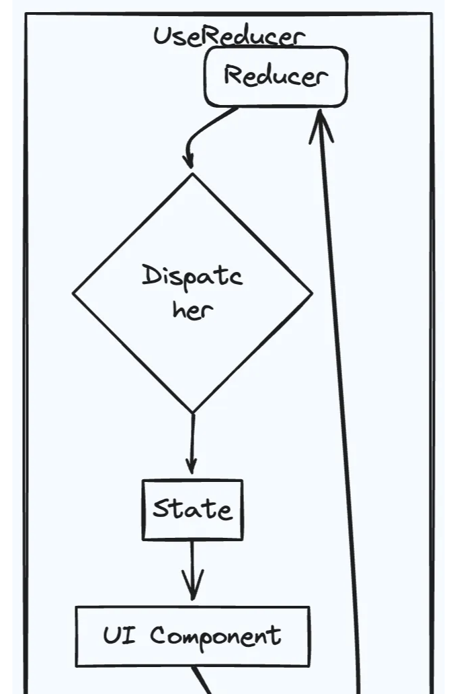
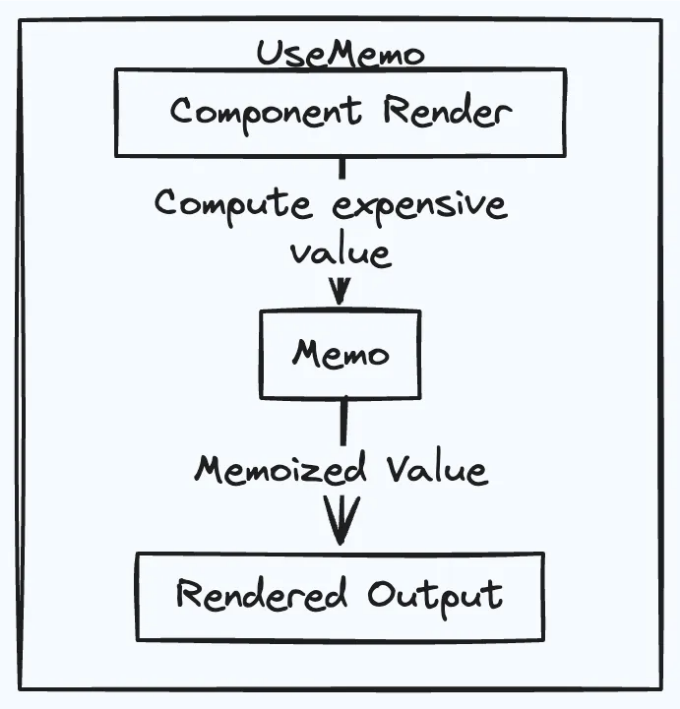
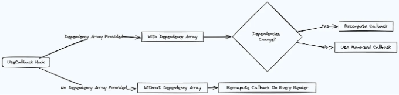

useReducer, useMemo 및 useCallback을 활용한 "최적 개발"

강력한 능력을 갖춘 React Native은 모바일 애플리케이션 개발 방식을 혁신했습니다. React Native 훅은 방대한 생태계 속에서 개발 워크플로우를 최적화하고 코드 가독성을 향상시키며 재사용성을 촉진하는 효율적인 도구로 두드러집니다. useState 및 useEffect와 같은 흔히 알려진 훅이 인기를 끌고 있는 반면, 여러 다른 훅들은 여전히 적게 활용되고 있습니다. 이 글에서는 두 가지 잘 알려지지 않은 React Native 훅인 useReducer와 useMemo에 대해 자세히 살펴보고, 현대 앱 개발에서의 중요성을 밝히겠습니다.

- useReducer 이해하기: 복잡한 상태 로직 관리

useState와 대비적으로 useReducer은 종종 빛을 발하지 못하지만, 컴포넌트 내에서 복잡한 상태 로직을 관리할 때 빛을 발합니다. 서로 다른 액션에 대한 여러 업데이트가 필요한 상태 객체에게 특히 유용합니다. 실용적인 예시를 살펴보겠습니다:

<!-- ui-log 수평형 -->
<ins class="adsbygoogle"
  style="display:block"
  data-ad-client="ca-pub-4877378276818686"
  data-ad-slot="9743150776"
  data-ad-format="auto"
  data-full-width-responsive="true"></ins>
<component is="script">
(adsbygoogle = window.adsbygoogle || []).push({});
</component>

```js
import React, { useReducer } from 'react';
import { View, TextInput, Button } from 'react-native';

const initialState = {
  firstName: '',
  lastName: '',
  email: '',
};

function reducer(state, action) {
  switch (action.type) {
    case 'SET_FIELD':
      return { ...state, [action.field]: action.value };
    case 'RESET':
      return initialState;
    default:
      return state;
  }
}

const SinglePageForm = () => {
  const [state, dispatch] = useReducer(reducer, initialState);

  const handleChange = (field, value) => {
    dispatch({ type: 'SET_FIELD', field, value });
  };

  const handleSubmit = () => {
    console.log('Form submitted with data:', state);
  };

  const handleReset = () => {
    dispatch({ type: 'RESET' });
  };

  return (
    <View>
      <TextInput
        value={state.firstName}
        onChangeText={(value) => handleChange('firstName', value)}
        placeholder="First Name"
      />
      <TextInput
        value={state.lastName}
        onChangeText={(value) => handleChange('lastName', value)}
        placeholder="Last Name"
      />
      <TextInput
        value={state.email}
        onChangeText={(value) => handleChange('email', value)}
        placeholder="Email"
      />
      <Button onPress={handleSubmit} title="Submit" />
      <Button onPress={handleReset} title="Reset" />
    </View>
  );
};

export default SinglePageForm;
```



하지만 useState로도 충분히 처리 가능한 간단한 상태 관리 시나리오에서 useReducer를 과도하게 사용하는 것은 피해야 합니다. useReducer의 남용은 불필요하게 복잡한 코드로 이어질 수 있습니다.

2. useMemo를 활용한 성능 최적화: 비용이 많이 드는 계산 결과를 메모화하기```

<!-- ui-log 수평형 -->
<ins class="adsbygoogle"
  style="display:block"
  data-ad-client="ca-pub-4877378276818686"
  data-ad-slot="9743150776"
  data-ad-format="auto"
  data-full-width-responsive="true"></ins>
<component is="script">
(adsbygoogle = window.adsbygoogle || []).push({});
</component>

`useMemo`은 다른 소중한 훅으로, 비싼 계산을 메모이징하여 성능을 크게 최적화할 수 있는 점에서 과소평가되고 있습니다. 자주 컴포넌트를 렌더링하거나 무거운 계산이 필요한 상황에서 값어치가 있습니다. 다음 예시를 고려해보세요:

```js
import React, { useMemo } from 'react';
import { View, Text } from 'react-native';

function ExpensiveComponent({ data }) {
  const memoizedData = useMemo(() => {
    // 데이터에 대한 비싼 계산 수행
    return computeData(data);
  }, [data]); // 의존성 배열

  return (
    <View>
      <Text>{memoizedData}</Text>
    </View>
  );
}
```



`useMemo`은 강력하지만, 모든 계산에 사용하는 것을 피하는 것이 중요합니다. 특히 작고 사소한 계산에 대해 사용할 때 주의해야 합니다. 정확한 메모이제이션을 보장하기 위해 의존성 배열에 올바른 의존성을 지정하는 것이 중요합니다. `useMemo`을 과도하게 사용하면 조기 최적화와 불필요한 복잡성으로 이어질 수 있습니다.

<!-- ui-log 수평형 -->
<ins class="adsbygoogle"
  style="display:block"
  data-ad-client="ca-pub-4877378276818686"
  data-ad-slot="9743150776"
  data-ad-format="auto"
  data-full-width-responsive="true"></ins>
<component is="script">
(adsbygoogle = window.adsbygoogle || []).push({});
</component>

3. useCallback을 사용하여 효율성 향상: 콜백 함수 메모화

useReducer와 useMemo에 추가로 useCallback을 사용하면 함수를 메모화하여 컴포넌트에서 불필요한 다시 렌더링을 방지할 수 있습니다. 특히 자식 컴포넌트에 콜백을 전달할 때 성능을 최적화하는 데 유용합니다. 사용법을 설명해보겠습니다:

```js
import React, { useCallback } from 'react';
import { View, TouchableOpacity, Text } from 'react-native';

function ParentComponent() {
  const handleClick = useCallback(() => {
    // 클릭 로직 처리
  }, []);

  return <ChildComponent onClick={handleClick} />;
}

function ChildComponent({ onClick }) {
  return (
    <View>
      <TouchableOpacity onPress={onClick}>
        <Text>클릭</Text>
      </TouchableOpacity>
    </View>
  );
}

export default ParentComponent;
```



<!-- ui-log 수평형 -->
<ins class="adsbygoogle"
  style="display:block"
  data-ad-client="ca-pub-4877378276818686"
  data-ad-slot="9743150776"
  data-ad-format="auto"
  data-full-width-responsive="true"></ins>
<component is="script">
(adsbygoogle = window.adsbygoogle || []).push({});
</component>

일반적으로 모든 콜백 함수에 useCallback을 적용하는 것은 피하세요. 모든 콜백 함수가 메모화의 이점을 누리지는 않습니다. 특히 다시 렌더링을 유발하지 않는 경우에는 더욱 그렇습니다. useCallback을 사용할 때는 의존성 배열에서 의도치 않은 동작을 피하기 위해 신중하게 의존성을 고려해야 합니다.

요약하자면, React Native 훅스는 효율성, 유지보수성, 성능 측면에서 모바일 애플리케이션을 최적화하는 강력한 도구 상자를 제공합니다. useReducer, useMemo, useCallback과 같은 잘 알려지지 않은 훅을 프로젝트에 통합함으로써 React Native 애플리케이션을 더 견고하고 효율적으로 구축할 수 있습니다. 이러한 훅을 탐색하고 활용하여 개발 방법을 향상시키고 뛰어난 사용자 경험을 만들어봅시다.