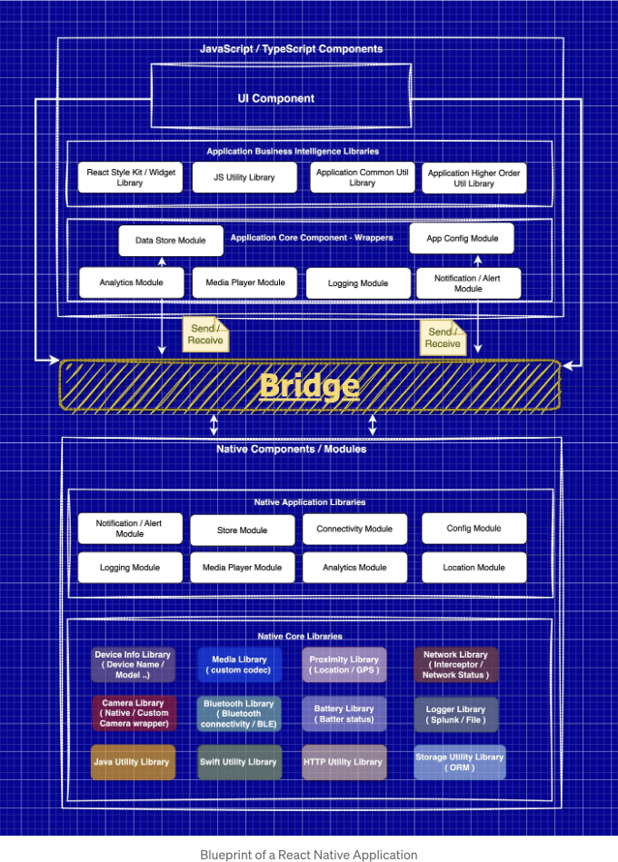
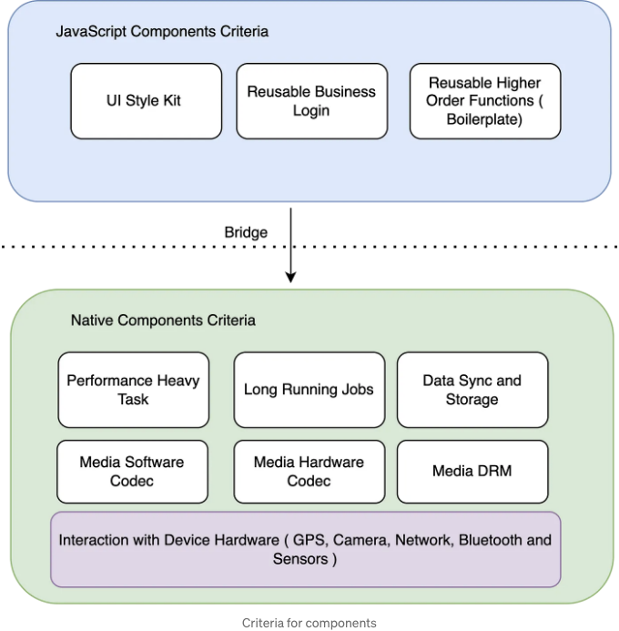
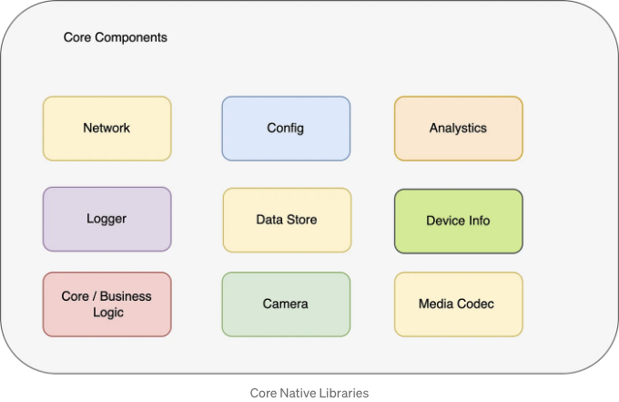
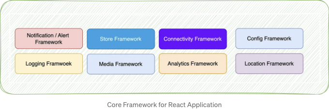
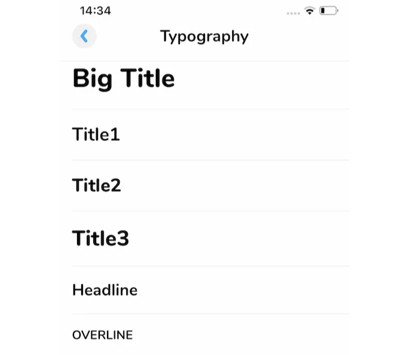
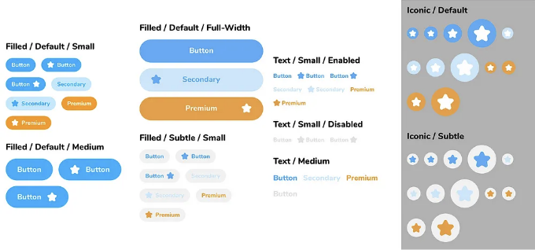
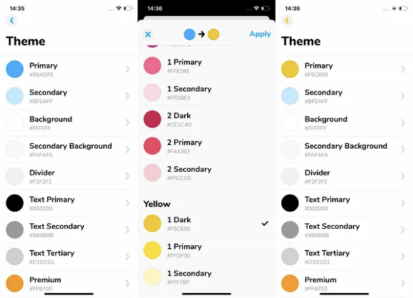
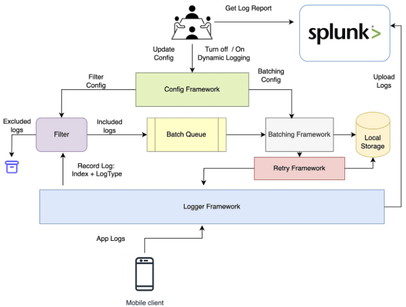
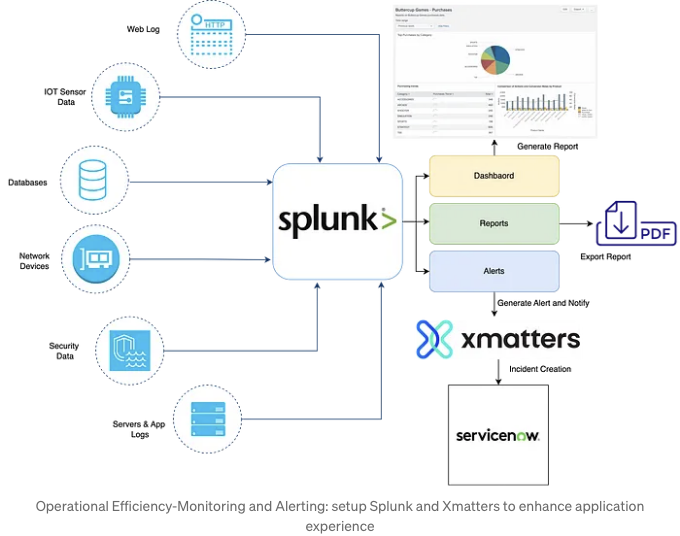

이전 글에서는 React Native 프레임워크가 내부적으로 어떻게 작동하는지와 커뮤니티의 안내에 따라 프레임워크 업그레이드에서 개선할 부분에 대해 논의했습니다.

이번 글에서는 주로 확장성, 계층 분리, 재사용성 및 안정성을 염두에 두고 현대 앱을 위해 디자인 패턴을 채택하는 방법에 초점을 맞출 것입니다.

# 계층 분리

<!-- ui-log 수평형 -->
<ins class="adsbygoogle"
  style="display:block"
  data-ad-client="ca-pub-4877378276818686"
  data-ad-slot="9743150776"
  data-ad-format="auto"
  data-full-width-responsive="true"></ins>
<component is="script">
(adsbygoogle = window.adsbygoogle || []).push({});
</component>

제품 요구 사항을 기술적 설계로 번역할 때 제품이나 애플리케이션이 해결하고자 하는 다양한 과제의 측면을 분석하고 이해하는 것이 중요합니다. 이는 문제를 해결하거나 특정 기능을 충족시키는 데 기여하는 각각 독립적인 우려 영역을 식별하고 분류하는 것을 포함합니다.

애플리케이션이 처리해야 하는 필수적인 고려 사항은 무엇이며, 이에 따라 우리는 분리 또는 우려 사항을 구축할 계획을 세워야 합니다.

기본적인 뼈대 구조는 잘 정의된 고려 사항을 가진 기본 구성 요소일 것입니다.

- 사용자 상호작용
- 비즈니스 로직
- 데이터 동기화 및 저장
- 네트워크 트랜잭션
- 계측(Instrumentation)

<!-- ui-log 수평형 -->
<ins class="adsbygoogle"
  style="display:block"
  data-ad-client="ca-pub-4877378276818686"
  data-ad-slot="9743150776"
  data-ad-format="auto"
  data-full-width-responsive="true"></ins>
<component is="script">
(adsbygoogle = window.adsbygoogle || []).push({});
</component>

분류는 구성 요소가 Native인지 JavaScript 기반인지를 결정하는 데 일부 기준을 따라 달성할 수 있습니다.



## Native Core Libraries

Native Core 라이브러리는 제품의 다양한 사용 사례를 고려하여 구현할 수 있으며, 애플리케이션의 기초를 설계할 때 일부 기본 네이티브 라이브러리를 모바일 플랫폼 제공의 일부로 구축할 수 있습니다.

<!-- ui-log 수평형 -->
<ins class="adsbygoogle"
  style="display:block"
  data-ad-client="ca-pub-4877378276818686"
  data-ad-slot="9743150776"
  data-ad-format="auto"
  data-full-width-responsive="true"></ins>
<component is="script">
(adsbygoogle = window.adsbygoogle || []).push({});
</component>

코어 기반 라이브러리:

- 분석
- 네트워크
- 데이터 저장
- 메트릭
- 코어 / 비즈니스 로직
- 로거



# 모듈식 및 재사용 가능

<!-- ui-log 수평형 -->
<ins class="adsbygoogle"
  style="display:block"
  data-ad-client="ca-pub-4877378276818686"
  data-ad-slot="9743150776"
  data-ad-format="auto"
  data-full-width-responsive="true"></ins>
<component is="script">
(adsbygoogle = window.adsbygoogle || []).push({});
</component>

모든 이 기본 구성 요소는 조직 내에서 공유할 수 있는 모듈식이고 재사용 가능한 저장소가 될 수 있습니다. 이는 모든 다른 제품들 간에 공유될 수 있습니다.



# UI / 스타일 킷 — 프레임워크

조직의 디자인 언어와 일치하는 UI 스타일 킷 프레임워크를 구축할 수 있습니다. 이는 버튼, 텍스트, 입력란, 타이포그래피와 같은 모든 UI 위젯들의 저장소가 될 수 있습니다.

<!-- ui-log 수평형 -->
<ins class="adsbygoogle"
  style="display:block"
  data-ad-client="ca-pub-4877378276818686"
  data-ad-slot="9743150776"
  data-ad-format="auto"
  data-full-width-responsive="true"></ins>
<component is="script">
(adsbygoogle = window.adsbygoogle || []).push({});
</component>

```markdown


샘플 위젯 라이브러리

디자이너들이 어떤 종류의 버튼을 디자인했고 이를 세 가지로 나누었습니다.

- 채워진 버튼
- 텍스트 버튼
- 아이콘 버튼
```

<!-- ui-log 수평형 -->
<ins class="adsbygoogle"
  style="display:block"
  data-ad-client="ca-pub-4877378276818686"
  data-ad-slot="9743150776"
  data-ad-format="auto"
  data-full-width-responsive="true"></ins>
<component is="script">
(adsbygoogle = window.adsbygoogle || []).push({});
</component>

```markdown


위젯 라이브러리를 패키지로 확장하여, 팀이 애플리케이션에서 이러한 번들을 재사용할 수 있도록 도와줄 수 있습니다.

```js
export const ThemeContext = React.createContext(defaultTheme);

export function useTheme() {
  const theme = React.useContext(ThemeContext);
  return theme;
}
```

```js
import * as React from "react";
import { ColorValue } from "react-native";
import colors from "./colors";

export interface Theme {
  primary: ColorValue;
  secondary: ColorValue;
  // 사용자 인터페이스의 주요 배경색.
  background: ColorValue;
}

export const defaultTheme: Theme = {
  primary: colors.brand.blue,
  secondary: colors.blue.secondary1,
  background: colors.mono.white,
};
```

<!-- ui-log 수평형 -->
<ins class="adsbygoogle"
  style="display:block"
  data-ad-client="ca-pub-4877378276818686"
  data-ad-slot="9743150776"
  data-ad-format="auto"
  data-full-width-responsive="true"></ins>
<component is="script">
(adsbygoogle = window.adsbygoogle || []).push({});
</component>

```markdown


# 확장성 및 실시간

확장성 측면에서, 일부의 설계 패턴을 통해 실현 가능한 연속적인 사용자 경험 사례 중 하나를 살펴볼 수 있습니다.

오프라인 우선 설계와 연결 불안정 처리
```

<!-- ui-log 수평형 -->
<ins class="adsbygoogle"
  style="display:block"
  data-ad-client="ca-pub-4877378276818686"
  data-ad-slot="9743150776"
  data-ad-format="auto"
  data-full-width-responsive="true"></ins>
<component is="script">
(adsbygoogle = window.adsbygoogle || []).push({});
</component>

사용자가 앱과 상호작용하는 모든 내용을 기록하는 로거 모듈을 사용할 수 있습니다. 또한 실시간 디버깅 또는 경고 및 모니터링을 통해 앱의 높은 신뢰성을 유지할 수 있습니다.

<!-- ui-log 수평형 -->
<ins class="adsbygoogle"
  style="display:block"
  data-ad-client="ca-pub-4877378276818686"
  data-ad-slot="9743150776"
  data-ad-format="auto"
  data-full-width-responsive="true"></ins>
<component is="script">
(adsbygoogle = window.adsbygoogle || []).push({});
</component>



- 저희 규모가 확장됨에 따라, 문제의 근본 원인을 식별하고 문제의 범위와 심각성을 평가하며 이를 해결하는 소요시간을 최소화하기 위해 중요합니다.
- 모바일 애플리케이션 내에서 문제를 디버깅할 때는 사용자 상호작용, 제어 및 데이터 흐름, 네트워크 통신(예: API 호출), 애플리케이션 상태, 기기 정보, 사용자 및 앱 메타데이터를 포함한 다양한 데이터 포인트를 분석하는 것이 중요합니다.



위에서 소개한 솔루션은 Splunk와 같은 모니터링 도구에서 알림을 받을 때 데이터를 수집할 수 있도록 합니다.

<!-- ui-log 수평형 -->
<ins class="adsbygoogle"
  style="display:block"
  data-ad-client="ca-pub-4877378276818686"
  data-ad-slot="9743150776"
  data-ad-format="auto"
  data-full-width-responsive="true"></ins>
<component is="script">
(adsbygoogle = window.adsbygoogle || []).push({});
</component>

또한, 앱 내장 결함 탐지 메커니즘에서 보고된 문제를 캡처합니다. 이는 중요한 프로세스나 우리 운영팀이 식별한 문제에 해당합니다. 수집된 로그와 실시간 메트릭(자세한 내용은 아래에 나와 있음)을 사용하여 우리 팀은 데이터를 신속히 분석하여 문제 해결을 가속화할 수 있습니다.

React Native 대신 Native 배포를 선택하는 것과 같은 기술적 선택사항은 주관적으로 보일 수 있지만, 각 프레임워크의 고유한 장점을 활용하기 위해 해당 선택이 이루어졌습니다.