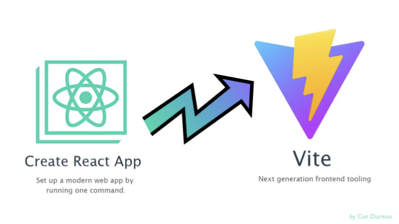

웹 개발의 끊임없이 진화하는 환경에서는 성능이 매우 중요합니다. 개발자로써, 우리는 계속해서 워크플로우를 최적화하고 사용자 경험을 향상시키는 방법을 찾고 있습니다. Edstruments에서는 뛰어난 성과에 대한 헌신으로, Create-React-App에서 Vite로 응용 프로그램을 이주하는 여정에 나섰습니다. Vite는 빠른 개발 및 배포 시간을 약속하는 빌드 도구로, 우리의 응용 프로그램을 이주하고 놀라운 성능 개선을 이뤘습니다. 이 글에서는 마이그레이션 과정과 달성한 놀라운 성능 향상에 대해 살펴보겠습니다.

## 왜 마이그레이션을 해야 할까요?

Create-React-App은 React 응용 프로그램을 시작하는 데 유용한 미리 구성된 설정을 제공하여 안정적인 도구였습니다. 그러나 응용 프로그램이 복잡해지면서 개발 및 배포 중 성능 병목 현상에 직면했습니다. 긴 빌드 시간과 둔한 개발 서버 시작이 생산성에 방해가 되고 있었습니다. Vite는 최신 ES Module 가져오기를 기반으로 한 빌드 도구로, 전례없는 속도를 자랑합니다.

<!-- ui-log 수평형 -->
<ins class="adsbygoogle"
  style="display:block"
  data-ad-client="ca-pub-4877378276818686"
  data-ad-slot="9743150776"
  data-ad-format="auto"
  data-full-width-responsive="true"></ins>
<component is="script">
(adsbygoogle = window.adsbygoogle || []).push({});
</component>

## 이주 과정

Create-React-App에서 Vite로 마이그레이션하는 것은 개발자 효율성과 최종 사용자 경험을 개선하기 위한 전략적인 결정이었습니다. 이제 진행된 단계에 대해 간단히 소개하겠습니다:

- 평가 및 계획: 기존 프로젝트 구조와 종속성을 분석하여 잠재적인 어려움과 최적화할 부분을 식별하는 것으로 시작했습니다.
- Vite 설정: Vite를 설치하고 기존 React 프로젝트와 원활하게 작동하도록 구성하는 것은 비교적 간단했습니다. Vite의 직관적인 설정으로 전환이 원활하게 이뤄졌고 구성 변경이 최소한으로 필요했습니다.
- 리팩터링: Vite와의 호환성을 이해하면서 전환이 원활했지만, 구성 및 도구에 일부 차이가 있었습니다. 따라서 코드베이스를 리팩터링하여 Vite의 모듈 기반 시스템과 호환되도록 보장했습니다.
- 빌드 프로세스 최적화: 마이그레이션의 주된 동기 중 하나는 빌드 시간을 줄이는 것이었습니다. Vite의 빠른 빌드 프로세스로 인해 컴파일 속도가 크게 개선되어 빠른 반복 및 배포가 가능해졌습니다.

## 성능 향상

<!-- ui-log 수평형 -->
<ins class="adsbygoogle"
  style="display:block"
  data-ad-client="ca-pub-4877378276818686"
  data-ad-slot="9743150776"
  data-ad-format="auto"
  data-full-width-responsive="true"></ins>
<component is="script">
(adsbygoogle = window.adsbygoogle || []).push({});
</component>

Vite로의 마이그레이션은 저희 개발 작업의 여러 가면에서 현저한 성능 향상을 가져왔어요:

- 배포 시간: 이전에는 배포 과정이 약 15분이 걸렸어요. Vite로 전환하면서 배포 시간이 놀라운 속도로 단축되어 3분 미만으로 줄었어요. 이 급속한 향상은 귀중한 시간을 절약하는 데 그치지 않고, 빠르게 업데이트를 반복하고 배포할 수 있는 능력을 향상시켰어요.
- 개발 서버 시작: 개발 서버의 느린 시작 시간은 우리 팀에게 고통스럽고 생산성을 감소시키는 골칫거리였어요. Vite로 전환하면 개발 서버 시작 시간이 300밀리초 미만으로 대폭 줄어들었어요. 1분 이상이었던 이전 대기 시간과 비교했을 때 상당한 향상이 있었죠. 이 거의 즉각적인 서버 시작은 개발 작업 흐름을 원활하게 만들어주어 코드 변경과 실시간 피드백을 가능케 했어요.

결론: Create-React-App에서 Vite로의 마이그레이션은 Edstruments에서 우리에게 혁명을 일으켰어요. 생산성을 방해하던 성능 병목 현상을 해결할 뿐만 아니라, 개발 작업 흐름을 효율적으로 끌어올렸어요. 배포 시간과 개발 서버 시작에서의 현저한 향상은 우리 팀이 이전보다 더 빠르게 고품질 소프트웨어를 제공할 수 있도록 했어요. 프로세스를 혁신하고 최적화하는 동안, Vite와 다른 최신 도구가 가져다주는 가능성에 대해 기대되죠.