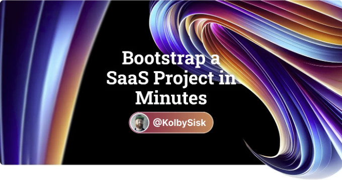
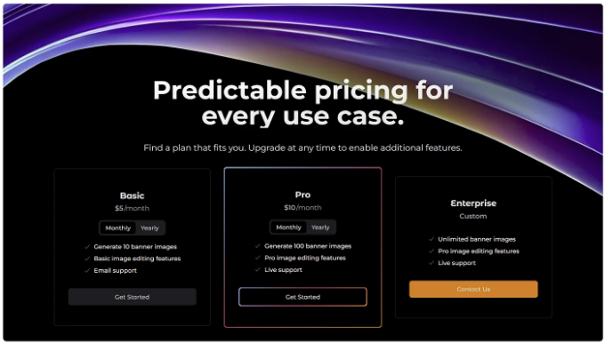
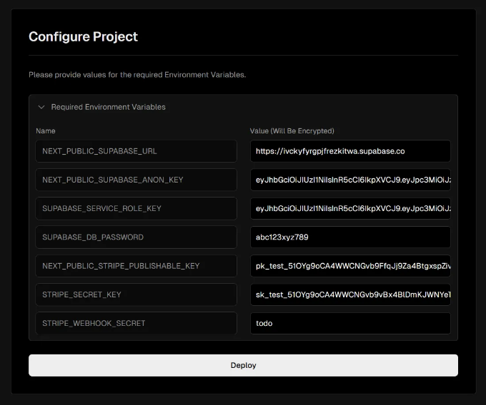
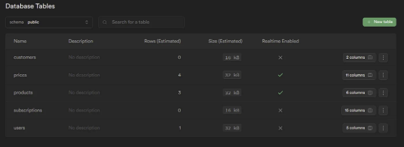
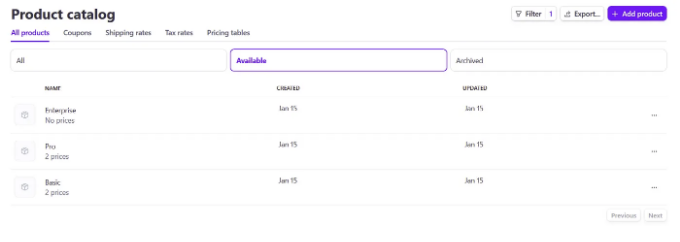

# TL;DR

# Overview

Bootstrap a SaaS with a modern tech stack built to move quickly. In just a few minutes you can deploy a SaaS project that includes:

<!-- ui-log 수평형 -->
<ins class="adsbygoogle"
  style="display:block"
  data-ad-client="ca-pub-4877378276818686"
  data-ad-slot="9743150776"
  data-ad-format="auto"
  data-full-width-responsive="true"></ins>
<component is="script">
(adsbygoogle = window.adsbygoogle || []).push({});
</component>

- Supabase — 포스트그레스 데이터베이스 및 사용자 인증
- Stripe — 체크아웃, 구독 및 고객 포턜
- Tailwindcss — CSS 프레임워크
- shadcn/ui — 사전 구축 가능한 접근성 구성 요소
- 웹훅을 사용하여 Stripe와 Supabase를 자동으로 동기화
- 제품 데이터를 부트스트랩하는 Stripe 픽스처
- 데이터베이스 스키마를 부트스트랩하고 관리하기 위한 Supabase 마이그레이션
- 반응형, 성능 및 접근성이 우수한 사전 구축된 페이지
- 애니메이션 버튼 테두리! 이제 당신의 사이트는 멋져보일 수 있어요! 너드들이 너무 늦게 출시했다고 말하지 않습니다 😄

# 시작하기

## 단계 1: Supabase 설정

<!-- ui-log 수평형 -->
<ins class="adsbygoogle"
  style="display:block"
  data-ad-client="ca-pub-4877378276818686"
  data-ad-slot="9743150776"
  data-ad-format="auto"
  data-full-width-responsive="true"></ins>
<component is="script">
(adsbygoogle = window.adsbygoogle || []).push({});
</component>

- supabase.com으로 이동하여 프로젝트를 생성하세요.
- Project Settings → Database → Database password로 이동하여 데이터베이스 비밀번호를 재설정하고 새 비밀번호를 생성하세요. (이미 생성한 비밀번호가 있지만, CLI에서 특수 문자를 사용한 비밀번호를 사용할 때 발생하는 버그를 해결할 수 있습니다)
- 이 비밀번호를 어딘가에 저장해 두세요. 상자를 닫으면 비밀번호를 확인할 수 없습니다.

## 단계 2: Stripe 설정

- stripe.com으로 이동하여 프로젝트를 생성하세요.
- Customer Portal Settings로 이동하여 Active test link 버튼을 클릭하세요.

## 단계 3: 배포

<!-- ui-log 수평형 -->
<ins class="adsbygoogle"
  style="display:block"
  data-ad-client="ca-pub-4877378276818686"
  data-ad-slot="9743150776"
  data-ad-format="auto"
  data-full-width-responsive="true"></ins>
<component is="script">
(adsbygoogle = window.adsbygoogle || []).push({});
</component>

- 이 링크를 클릭하세요: Vercel로 배포하기
- 양식에서 새로운 저장소를 생성하고 Supabase 통합을 추가하세요.
- 사용 가능한 환경 변수를 추가하세요. Stripe 웹훅 시크릿에 임의의 값만 넣어주세요. 웹훅을 구성한 후에 이 값을 업데이트할 것입니다.
- 배포를 클릭하세요.
- 기다리는 동안 새 저장소를 복제하고 코드 편집기에서 엽니다. 그 후 .env.local이라는 파일을 만들어주세요. .env.local.example의 내용을 이 파일에 복사하여 올바른 값들을 추가하세요. 위에서 추가한 값과 동일해야 합니다.

## 단계 4: Stripe 웹훅

- 배포한 후 Vercel 대시보드로 이동하여 Vercel URL을 찾으세요.
- 다음으로 Stripe 대시보드로 이동해서 상단 네비게이션에서 개발자를 클릭하고 그 다음 웹훅 탭을 클릭하세요.
- 엔드포인트를 추가하세요. Vercel URL 뒤에 /api/webhooks을 입력하세요.
- 이벤트 선택을 클릭하세요.
- 모든 이벤트 선택을 체크하세요.
- 페이지 아래로 스크롤하여 엔드포인트 추가를 클릭하세요.
- 서명 비밀 키를 확인하여 복사하세요.
- Vercel 프로젝트 설정으로 이동하여 환경 변수를 업데이트하세요.
- 새로 획득한 웹훅 시크릿으로 STRIPE_WEBHOOK_SECRET 환경 변수의 값을 업데이트하세요. 저장을 눌러주세요.

<!-- ui-log 수평형 -->
<ins class="adsbygoogle"
  style="display:block"
  data-ad-client="ca-pub-4877378276818686"
  data-ad-slot="9743150776"
  data-ad-format="auto"
  data-full-width-responsive="true"></ins>
<component is="script">
(adsbygoogle = window.adsbygoogle || []).push({});
</component>

## 단계 5: Supabase 마이그레이션 실행하기

이제 초기 Supabase 마이그레이션을 실행하여 데이터베이스 테이블을 만들어봅시다.

- npx supabase login 명령을 실행하세요.
- npx supabase init 명령을 실행하세요.
- package.json 파일을 열고 UPDATE_THIS_WITH_YOUR_SUPABASE_PROJECT_ID 문자열을 사용자의 Supabase 프로젝트 ID로 각각 업데이트하세요.
- npm run supabase:link 명령을 실행하세요.
- npm run migration:up 명령을 실행하세요.

💥새로운 데이터베이스가 준비되었습니다! 이제 시작해봐요.

<!-- ui-log 수평형 -->
<ins class="adsbygoogle"
  style="display:block"
  data-ad-client="ca-pub-4877378276818686"
  data-ad-slot="9743150776"
  data-ad-format="auto"
  data-full-width-responsive="true"></ins>
<component is="script">
(adsbygoogle = window.adsbygoogle || []).push({});
</component>

## 단계 6: Stripe Fixture 실행

Stripe fixtures는 Stripe UI에서 꼬이지 않고 제품 오퍼링을 구성하는 간편한 방법입니다.

- Stripe CLI를 설치하세요. 맥에서는 간단히 실행하면 됩니다: brew install stripe/stripe-cli/stripe (Homebrew가 있다고 가정하며, 설치되어 있지 않다면 설치하세요)
- stripe fixtures ./stripe-fixtures.json — api-key UPDATE_THIS_WITH_YOUR_STRIPE_SK 명령을 실행하세요
(Stripe SK로 명령어를 업데이트해야 합니다)

<!-- ui-log 수평형 -->
<ins class="adsbygoogle"
  style="display:block"
  data-ad-client="ca-pub-4877378276818686"
  data-ad-slot="9743150776"
  data-ad-format="auto"
  data-full-width-responsive="true"></ins>
<component is="script">
(adsbygoogle = window.adsbygoogle || []).push({});
</component>

💥 새로운 Stripe 제품을 사용할 준비가 되었습니다! 그게 아니라, Stripe에서 변경 사항이 발생하면 웹훅이 배포된 API를 호출합니다. API 핸들러는 Stripe에서 변경된 데이터를 가져와 Supabase 데이터베이스와 동기화합니다.

## Step 7: 마지막 단계

- 코드 에디터에서 UPDATE_THIS_로 검색하고 .env.local.example을 제외한 모든 인스턴스를 관련 값으로 업데이트합니다.
- delete-me 디렉토리를 삭제하세요.

<!-- ui-log 수평형 -->
<ins class="adsbygoogle"
  style="display:block"
  data-ad-client="ca-pub-4877378276818686"
  data-ad-slot="9743150776"
  data-ad-format="auto"
  data-full-width-responsive="true"></ins>
<component is="script">
(adsbygoogle = window.adsbygoogle || []).push({});
</component>

## 단계 8: 확인해보세요!

🎉 잘 했어요! 이제 Stripe 대시 보드에서 제품을 확인할 수 있고, 동일한 데이터가 Supabase 데이터베이스에도 채워졌을 것입니다. 이제 모든 것을 테스트해 보겠습니다.

- npm i 실행
- npm run dev 실행
- 로컬 앱으로 이동하고 무료로 시작을 클릭하세요 — 이것은 로그인 페이지로 이동합니다
- 아직 인증 제공 업체를 구성하지 않았으므로 지금은 이메일로 계속 클릭하고 이메일 주소를 제출합니다
- 이메일로 받은 링크를 클릭하면 앱으로 리디렉션됩니다 — 인증됨
- 요금제 중 하나를 선택하고 시작 클릭하세요. 이것은 Stripe 체크아웃 페이지로 이동합니다 (테스트 모드에서)
- 신용 카드 번호로 4242424242424242를 입력하세요. 나머지 양식은 유효한 데이터로 채우고 구독을 클릭하세요
- 그럼 계정 페이지로 리디렉션되어 활성 구독을 볼 수 있습니다
- 구독 관리 버튼을 클릭하여 구독을 관리할 수 있는 Stripe 고객 포털로 리디렉션됩니다

# 결과

<!-- ui-log 수평형 -->
<ins class="adsbygoogle"
  style="display:block"
  data-ad-client="ca-pub-4877378276818686"
  data-ad-slot="9743150776"
  data-ad-format="auto"
  data-full-width-responsive="true"></ins>
<component is="script">
(adsbygoogle = window.adsbygoogle || []).push({});
</component>

짧은 설정 작업 후에는 작동하는 데이터베이스, 구성된 스트라이프 제품, 결제, 구독, 고객 포털, Stripe와 Supabase를 동기화하는 웹훅, 현대적인 기술 스택을 사용한 아름다운 코드베이스가 준비되었습니다. 이제 제품을 구축하는 데 집중할 수 있습니다.

새로운 코드베이스에서 코딩하는 가이드를 찾으려면 레포지토리로 이동하고 다음 링크를 통해 더 많은 정보를 알아보세요:

- 인증 제공자 설정에 대해 더 알아보기
- Supabase 마이그레이션에 대해 더 알아보기
- shadcn/ui 컴포넌트에 대해 더 알아보기
- shadcn/ui로 테마 설정에 대해 더 알아보기
- Tailwindcss 테마 구성에 대해 더 알아보기

설정이나 코드베이스에서 개발하는 데 도움이 필요하면 언제든지 트위터 @kolbysisk에서 저에게 연락해 주세요. 도와드릴 수 있는 것을 기쁘게 도와드리겠습니다. ❤️