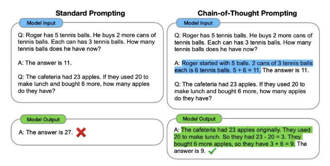
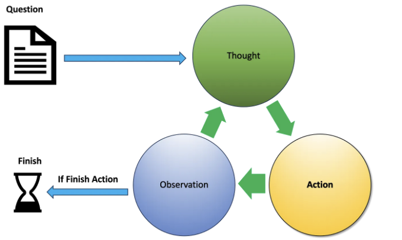
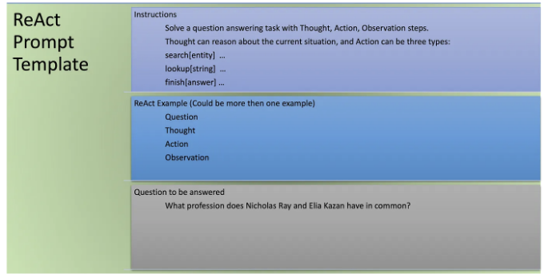

<table>
  <tr>
    <th>이미지</th>
  </tr>
  <tr>
    <td></td>
  </tr>
</table>

대부분의 사람들은 LLM을 언어에 대한 좋은 이해력을 갖고 있으며 인터넷 데이터를 사용하여 구축된 지식 소스로 보고 있습니다. 따라서 사람들은 몇 가지 질문을 할 수 있고 LLM은 답변을 반환할 수 있습니다. 그러나 LLM의 흥미로운 점 중 하나는 추론 엔진으로 사용될 수 있다는 것입니다. LLM은 추론을 수행하고 다양한 기술을 통해 조치를 취할 수 있습니다.

복잡한 추론은 LLM에게 어려울 수 있으며 이는 특히 다단계를 포함하는 경우입니다. 이러한 추론은 다른 많은 작업에서 매우 좋은 성능을 보이는 대규모 모델 (GPT4)에게도 도전적일 수 있습니다. 복잡한 추론 LLM의 문제를 해결하는 한 가지 방법은 'Chain-Of-Thought Prompting'을 사용하는 것입니다. Google Brain 팀의 관련 연구 논문도 참고할 수 있습니다.

# Chain-of-Thought Prompting

<!-- ui-log 수평형 -->
<ins class="adsbygoogle"
  style="display:block"
  data-ad-client="ca-pub-4877378276818686"
  data-ad-slot="9743150776"
  data-ad-format="auto"
  data-full-width-responsive="true"></ins>
<component is="script">
(adsbygoogle = window.adsbygoogle || []).push({});
</component>

Chain of thought prompting은 복잡한 산술, 상식, 및 상징적 추론 작업을 해결할 수 있게 해줍니다. 아래 이미지를 확인해보세요.



위 이미지를 참고하면 chain-of-thought prompting이 표준 프롬프팅을 능가한다는 것을 알 수 있습니다. 표준 프롬프팅에서는 한 번의 추론을 사용하여도 모델 출력이 올바르지 않습니다. 이미지 오른쪽에서 chain-of-thought prompting은 프롬프팅을 할 때 한 번의 추론을 사용하지만 예시에서 추론을 사용합니다 (파란색으로 강조된 부분 참조). 우리가 다중 단계의 수학 문제를 해결할 때와 같이 복잡한 추론 작업을 수행할 때 고려하는 생각의 과정을 생각해보자. 문제를 중간 단계로 분해하여 매 단계를 해결한 후 최종 답변을 제공하는 것이 일반적입니다. 이것이 chain-of-thought prompting이 하는 일입니다. 문제를 여러 단계로 분할하고 문제를 해결합니다. 이는 모델이 인간처럼 생각할 수 있도록 돕습니다. 오른쪽 결과를 보면 모델이 이제 올바르고 명확한 이유를 설명하는 정답을 출력했습니다. 이것은 한 번의 예시와 유사한 구조를 따르며 작업을 추론하는 방법을 모델에 가르치는 것입니다. 모델은 이제 아홉 개의 사과가 남아 있다는 것을 올바르게 결정했습니다. 문제를 고려하며 생각하는 과정이 모델이 올바른 답변에 도달하는 것을 도왔습니다. 우리는 다른 유형의 문제에 대한 추론력을 향상시키기 위해 chain of thought prompting을 사용할 수 있습니다.

대부분의 응용 프로그램에서는 LLM이 추론을 수행하는 것뿐만 아니라 추론 단계에서 여러 외부 데이터 소스 및 응용프로그램을 호출해야하는 경우가 있습니다. 이러한 추론 단계를 계획하고 실행할 수 있는 기술 또는 프레임워크 중 하나를 소개합니다. 이를 ReAct(Reasoning and actions)라고 합니다.

<!-- ui-log 수평형 -->
<ins class="adsbygoogle"
  style="display:block"
  data-ad-client="ca-pub-4877378276818686"
  data-ad-slot="9743150776"
  data-ad-format="auto"
  data-full-width-responsive="true"></ins>
<component is="script">
(adsbygoogle = window.adsbygoogle || []).push({});
</component>

# ReAct

ReAct은 LLMs가 추론을 수행하고 과제별 조치를 취할 수 있는 기술입니다. 사고 체인 추론을 행동 계획과 결합합니다. 이를 통해 LLMs는 추론 추적 및 과제별 조치를 생성할 수 있으며 두 가지 간의 시너지를 활용합니다. 이 접근 방식은 환영과 오류 전파와 같은 문제를 극복하며 다양한 작업에서 기존 방법을 능가하는 우수한 성능을 보여줍니다.

해결해야 할 질문이 있고 이를 해결하는 데 고급 추론과 여러 단계가 필요할 수 있습니다. LLM은 이 질문을 통해 추론하고 해결책에 한 걸음 더 다가갈 수 있는 조치를 취할 수 있습니다. React 프레임워크에서는 주어진 질문을 해결하기 위해 LLM이 솔루션을 찾아내기 위한 반복적인 과정을 거칩니다. 특정 질문에 대해 먼저 LLM은 문제에 대한 생각을 생성합니다. 생각은 문제에 접근할 방법을 식별하고 취해야 할 조치를 확인하는 추론 단계입니다. 생각에 따라 LLM은 몇 가지 조치를 취할 수 있습니다. 조치는 허용된 조치 세트에서 외부 작업이며, Wikipedia API를 호출하여 데이터를 검색하는 등의 작업일 수 있습니다. 조치 결과로 제공된 새 정보를 기반으로 LLM은 결과를 관찰합니다. LLM이 답을 얻었다고 판단하면 질문을 마치고, 그렇지 않으면 관찰에 따라 LLM은 새로운 생각을 생성하고 프로세스를 계속합니다. 이 프로세스는 LLM이 답을 얻을 때까지 계속됩니다. 아래 다이어그램을 참조해주세요.



<!-- ui-log 수평형 -->
<ins class="adsbygoogle"
  style="display:block"
  data-ad-client="ca-pub-4877378276818686"
  data-ad-slot="9743150776"
  data-ad-format="auto"
  data-full-width-responsive="true"></ins>
<component is="script">
(adsbygoogle = window.adsbygoogle || []).push({});
</component>

ReAct 프레임워크에서 LLM은 LLM의 질문 프롬프트 텍스트 앞에 추가된 일련의 지시 사항에 의해 정의된 한정된 수의 작업을 선택할 수 있습니다.

예를 들어, React 연구논문에서는 세 가지 작업 영역을 다룬다. 세 가지 유형의 작업을 지원하는 간단한 Wikipedia 웹 API를 설계했습니다.

- search[entity]: 해당 엔티티 위키피디아 페이지의 처음 5문장을 반환하거나, 없을 경우 위키피디아 검색 엔진에서 상위 5개 유사 엔티티를 제안합니다.
- lookup[string]: string을 포함하는 페이지의 다음 문장을 반환하여 브라우저에서의 Ctrl+F 기능을 시뮬레이트합니다.
- finish[answer]: 현재 작업을 answer로 완료합니다.

예를 통해 이해해보겠습니다.

<!-- ui-log 수평형 -->
<ins class="adsbygoogle"
  style="display:block"
  data-ad-client="ca-pub-4877378276818686"
  data-ad-slot="9743150776"
  data-ad-format="auto"
  data-full-width-responsive="true"></ins>
<component is="script">
(adsbygoogle = window.adsbygoogle || []).push({});
</component>

질문: 아미타브 바찬과 샤룩 칸이 공통으로 가지고 있는 직업은 무엇인가요?

# ReAct 프롬프트 템플릿

우리는 쿼리에 대한 ReAct의 표준 템플릿을 만들 수 있습니다. 지시사항과 몇 가지 예제가 포함된 LLM 내부에 질문을 하고 있습니다.



<!-- ui-log 수평형 -->
<ins class="adsbygoogle"
  style="display:block"
  data-ad-client="ca-pub-4877378276818686"
  data-ad-slot="9743150776"
  data-ad-format="auto"
  data-full-width-responsive="true"></ins>
<component is="script">
(adsbygoogle = window.adsbygoogle || []).push({});
</component>

# ReAct 실행 흐름

모델은 제공된 예제를 학습함으로써 실행을 시작할 수 있습니다. 첫 번째 생각을 가져가는 방식으로 프로세스를 시작할 수 있습니다.

생각1: 나는 아미타브 바첸과 샤룩 칸을 검색하여 그들의 직업을 찾고, 그들이 공통으로 가지고 있는 직업을 찾아야 합니다.

동작1: [아미타브 바첸]을 검색합니다.

<!-- ui-log 수평형 -->
<ins class="adsbygoogle"
  style="display:block"
  data-ad-client="ca-pub-4877378276818686"
  data-ad-slot="9743150776"
  data-ad-format="auto"
  data-full-width-responsive="true"></ins>
<component is="script">
(adsbygoogle = window.adsbygoogle || []).push({});
</component>

이 작업으로 Amitabh Bachchan와 관련된 내용을 가져오기 위해 Wikipedia API를 호출할 것입니다.

관찰1 Amitabh Bachchan ([əmɪˈt̪ɑːbʱ ˈbətːʃən]으로 발음; Amitabh Srivastava로 태어남; 1942년 10월 11일)은 인도 배우, 영화 프로듀서, TV 호스트, 가끔 플레이백 가수이자, 이전 정치인으로서 힌디 시네마에 활발히 참여하고 있습니다. 5십년에 걸친 영화적 여정을 통해 그는 200편 이상의 영화에서 중요한 역할을 연기했습니다. …………….

이 관찰을 기반으로 모델은 새로운 생각을 제시할 수 있습니다.

생각2 Amitabh Bachchan의 직업은 배우, 영화 프로듀서, TV 호스트입니다. 그 다음으로 Shahrukh Khan을 찾아 그의 직업을 찾아봐야겠네요.

<!-- ui-log 수평형 -->
<ins class="adsbygoogle"
  style="display:block"
  data-ad-client="ca-pub-4877378276818686"
  data-ad-slot="9743150776"
  data-ad-format="auto"
  data-full-width-responsive="true"></ins>
<component is="script">
(adsbygoogle = window.adsbygoogle || []).push({});
</component>

행동2: [Shahrukh Khan]을 검색합니다.

관찰2: 샤룝 칸(Shah Rukh Khan, 발음: [ˈʃɑːɦɾʊx xɑːn]; 1965년 11월 2일 출생)은 SRK라는 줄임말로도 알려진 인도 배우이자 힌디어 영화 프로듀서입니다. 언론에서는 \”발리우드의 황제\”와 \”킹 칸\”으로 불린 그는 90편 이상의 영화에 출연하였으며, 14회의 필름페어상을 포함한 수많은 영예를 안았습니다. 인도 정부로부터 팜마 쉬리상을 수여받았습니다...

생각3: 샤룝 칸의 직업은 배우와 영화 프로듀서입니다. 그래서 아미타브 바치칸과 샤룝 칸이 공통으로 가지고 있는 직업은 배우와 영화 프로듀서입니다.

행동3: [배우와 영화 프로듀서]로 완료합니다.

<!-- ui-log 수평형 -->
<ins class="adsbygoogle"
  style="display:block"
  data-ad-client="ca-pub-4877378276818686"
  data-ad-slot="9743150776"
  data-ad-format="auto"
  data-full-width-responsive="true"></ins>
<component is="script">
(adsbygoogle = window.adsbygoogle || []).push({});
</component>

마지막 답변 - 배우이자 영화 프로듀서.

ReAct 프레임워크는 LLM을 활용하여 추론 및 행동 계획을 통해 응용 프로그램을 구동하는 하나의 방법을 보여줍니다. 우리는 이 전략을 확장하여 응용 프로그램에 다양한 사례를 만들어 적용할 수 있습니다. 이를 통해 응용 프로그램에서 발생할 수 있는 의사 결정과 행동을 처리할 수 있습니다.

# Langchain

이제 일들을 해보겠습니다. 다행히도, 이미 우리를 돕는 각종 응용 프로그램 개발을 위한 오픈 소스 프레임워크가 있습니다. 그중 하나가 Langchain입니다. LangChain 프레임워크는 LLM과 작업하기 위해 필요한 구성 요소를 포함하는 모듈식 조각들을 제공합니다. 이러한 구성 요소에는 다양한 사용 사례를 위한 프롬프트 템플릿뿐만 아니라 외부 데이터 세트 및 다양한 API에 대한 호출을 포함한 다양한 작업을 실행할 수 있도록 하는 미리 제작된 도구도 포함되어 있습니다. 이러한 개별 구성 요소를 선택하여 연결하면 체인이 형성됩니다. LangChain에는 또 다른 개념인 '에이전트'가 있습니다. 사용자 입력을 해석하고 작업을 완료하기 위해 어떤 도구 또는 도구를 사용해야 하는지 결정하는 데 사용할 수 있는 요소입니다.

<!-- ui-log 수평형 -->
<ins class="adsbygoogle"
  style="display:block"
  data-ad-client="ca-pub-4877378276818686"
  data-ad-slot="9743150776"
  data-ad-format="auto"
  data-full-width-responsive="true"></ins>
<component is="script">
(adsbygoogle = window.adsbygoogle || []).push({});
</component>

좋은 소식은 Langchain에 현재 ReAct 에이전트가 포함되어 있다는 것입니다.

# ReAct 구현

블로그에서는 OPENAI ChatGPT 모델을 사용할 것입니다. 우리는 OPENAI가 제공하는 API를 사용하여 ChatGPT 모델을 응용 프로그램에 통합할 수 있습니다. API에 액세스하려면 OPENAI에 등록하고 동일한 API 키를 받아야 합니다. 아래 코드를 실행하기 전에 두 가지 사항을 염두에 두세요.

1-) OPENAI는 API를 사용할 때 요금을 청구합니다. 더 많은 세부 정보를 여기서 찾을 수 있습니다.

<!-- ui-log 수평형 -->
<ins class="adsbygoogle"
  style="display:block"
  data-ad-client="ca-pub-4877378276818686"
  data-ad-slot="9743150776"
  data-ad-format="auto"
  data-full-width-responsive="true"></ins>
<component is="script">
(adsbygoogle = window.adsbygoogle || []).push({});
</component>

2-) 당신이 OPENAI API와 Wikipedia API에 접근할 수 있는 인터넷 연결도 필요합니다.

Langchain 프레임워크와 파이썬 코드를 살펴보기 위해 사용할 것입니다. 이 코드를 여러분의 어플리케이션에 사용할 수 있습니다. 또한 더 많은 코드 참고를 위해 Langchain 사이트를 방문할 수도 있습니다. 코드를 실행하기 위해 아래 필요한 파이썬 라이브러리를 설치해야 합니다.

```js
pip install openai
pip install langchain
pip install wikipedia
```

그럼, 어플리케이션을 만들기 시작해봅시다.

<!-- ui-log 수평형 -->
<ins class="adsbygoogle"
  style="display:block"
  data-ad-client="ca-pub-4877378276818686"
  data-ad-slot="9743150776"
  data-ad-format="auto"
  data-full-width-responsive="true"></ins>
<component is="script">
(adsbygoogle = window.adsbygoogle || []).push({});
</component>

1-) 먼저 환경 변수에서 키를로드하고 openai에 설정해야 합니다. OPENAI에 등록하면이 키를 얻을 수 있습니다.

```js
import openai
import os
openai.api_key = os.getenv('OPENAI_API_KEY')
```

2-) Langchain에는 Agent 개념이 있습니다. 에이전트의 핵심 아이디어는 언어 모델을 사용하여 취할 조치 시퀀스를 선택하는 것입니다. 에이전트에서 언어 모델은 어떤 조치를 취할지 및 어떤 순서로 취해야 하는지를 결정하는 추론 엔진으로 사용됩니다. Langchain에는 Wikipedia 사용 사례에 대해 원래 ReAct 연구 논문과 일치하는 기능을 갖춘 내장형 Agent 인 DocStore Explorer Agent가 있습니다.

DocStore Explorer Agent는 문서 저장 시스템(예: Wikipedia)과 상호 작용하여 두 가지 특정 도구 인 검색 도구와 조회 도구를 사용합니다. 검색 도구는 문서를 찾는 데 책임이 있고, 조회 도구는 가장 최근에 발견된 문서에서 용어를 검색합니다. 이 문서 저장소를 Wikipedia로 초기화할 수 있습니다.

<!-- ui-log 수평형 -->
<ins class="adsbygoogle"
  style="display:block"
  data-ad-client="ca-pub-4877378276818686"
  data-ad-slot="9743150776"
  data-ad-format="auto"
  data-full-width-responsive="true"></ins>
<component is="script">
(adsbygoogle = window.adsbygoogle || []).push({});
</component>

```js
from langchain.agents.react.base import DocstoreExplorer
from langchain.docstore import Wikipedia
docstore = DocstoreExplorer(Wikipedia())
```

3. 또 한 가지 Langchain이 제공하는 개념은 도구입니다. 도구는 에이전트가 외부 세계와 상호 작용하는 데 사용할 수 있는 인터페이스입니다. Wikipedia API에 대한 우리만의 도구를 만들 수 있습니다. 도구 사양에서 우리는 에이전트가 외부 세계와 상호 작용하기 위해 호출해야 하는 함수를 지정할 수 있습니다.

```js
from langchain.agents import Tool
tools = [
    Tool(
        name="Search",
        func=docstore.search,
        description="search할 때 사용됩니다.",
    ),
    Tool(
        name="Lookup",
        func=docstore.lookup,
        description="lookup할 때 사용됩니다.",
    ),
]
```

4. 애플리케이션에 LLM으로 GPT-4 모델을 사용합시다.

<!-- ui-log 수평형 -->
<ins class="adsbygoogle"
  style="display:block"
  data-ad-client="ca-pub-4877378276818686"
  data-ad-slot="9743150776"
  data-ad-format="auto"
  data-full-width-responsive="true"></ins>
<component is="script">
(adsbygoogle = window.adsbygoogle || []).push({});
</component>

```js
from langchain.chat_models import ChatOpenAI
llm = ChatOpenAI(model_name="gpt-4")
```

5-) 모든 정보와 함께 도구 및 에이전트를 사용하여 에이전트를 초기화해 봅시다.

```js
from langchain.agents import AgentType, initialize_agent
react = initialize_agent(tools, llm, agent=AgentType.REACT_DOCSTORE, verbose=True)
```

6-) 우리의 ReAct 에이전트에 질문을 전달할 수 있습니다. 배경에서, 에이전트는 OPENAI 모델과 상호 작용하는 API를 사용하여 작업을 수행합니다. 또한 모델에 도구 정보(함수 설명)를 추가 인수로 전달합니다(OPENAI의 경우 OPENAI 함수라고 함)와 프롬프트와 함께. 모델이 검색 또는 조회 작업을 수행해야 하는 경우 함수 설명과 함수 인수(있는 경우)를 에이전트에 반환합니다. 그런 다음 에이전트는 해당 도구를 사용하여 해당 함수를 호출하고 그 정보를 다시 모델에 전달합니다. 이러한 과정은 상기와 같이 반복적으로 수행됩니다. 모든 이러한 마법은 에이전트가 우리를 대신해 해 줍니다.

<!-- ui-log 수평형 -->
<ins class="adsbygoogle"
  style="display:block"
  data-ad-client="ca-pub-4877378276818686"
  data-ad-slot="9743150776"
  data-ad-format="auto"
  data-full-width-responsive="true"></ins>
<component is="script">
(adsbygoogle = window.adsbygoogle || []).push({});
</component>

```js
질문 = "아미타브 박첸과 샤룩 칸이 공통으로 가진 직종은 무엇인가요?"
결과 = react.run(질문)
```

Langchain이 생성한 로그를 통해 내부 동작을 이해할 수도 있습니다.

7-) 우리는 마침내 답을 얻을 수 있습니다.

```js
배우 및 영화 프로듀서
```

<!-- ui-log 수평형 -->
<ins class="adsbygoogle"
  style="display:block"
  data-ad-client="ca-pub-4877378276818686"
  data-ad-slot="9743150776"
  data-ad-format="auto"
  data-full-width-responsive="true"></ins>
<component is="script">
(adsbygoogle = window.adsbygoogle || []).push({});
</component>

이 블로그를 읽어주셔서 감사합니다. ReAct를 이해하는 데 도움이 될 것을 희망합니다. 이 블로그의 소스 코드는 제 Git 저장소에서 다운로드할 수 있습니다.

참고 —

1-) [Python LangChain 문서 - 시작하기](https://python.langchain.com/docs/get_started/introduction.html)

2-) [Deep Learning.AI - Functions Tools Agents LangChain](https://learn.deeplearning.ai/functions-tools-agents-langchain)

<!-- ui-log 수평형 -->
<ins class="adsbygoogle"
  style="display:block"
  data-ad-client="ca-pub-4877378276818686"
  data-ad-slot="9743150776"
  data-ad-format="auto"
  data-full-width-responsive="true"></ins>
<component is="script">
(adsbygoogle = window.adsbygoogle || []).push({});
</component>

3-) [링크](https://www.coursera.org/learn/generative-ai-with-llms/)

4-) Chain of Thought 연구 논문 — [링크](https://arxiv.org/pdf/2201.11903.pdf)

5-) ReAct 연구 논문 — [링크](https://arxiv.org/pdf/2210.03629.pdf)