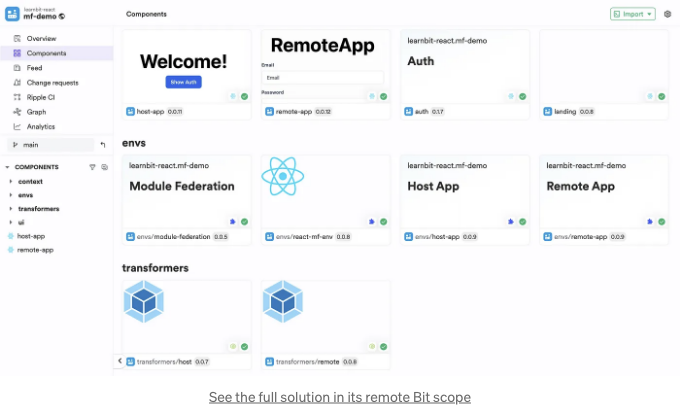

마이크로프론트엔드는 응용 프로그램을 구축하는 접근 방식으로, 프론트 엔드가 작고 독립적인 부분으로 나뉘어 각각이 자체 사용자 인터페이스와 기능을 갖도록 되어 있습니다. 이 독립적인 부분은 결합되어 완전한 응용 프로그램을 형성합니다.

이 블로그는 웹팩 모듈 페더레이션을 사용하여 React MFE 아키텍처를 구현하는 단계를 설명합니다. 컴포넌트 기반의 MFE와 전통적인 방식의 두 가지 대안을 나열합니다.

# 컴포넌트 기반의 MFE 접근 방식

<!-- ui-log 수평형 -->
<ins class="adsbygoogle"
  style="display:block"
  data-ad-client="ca-pub-4877378276818686"
  data-ad-slot="9743150776"
  data-ad-format="auto"
  data-full-width-responsive="true"></ins>
<component is="script">
(adsbygoogle = window.adsbygoogle || []).push({});
</component>

MFEs 아키텍처는 구성 요소 중심 개발에서 자연스럽게 발전하며, 두 가지 모두 자율적인 팀이 느슨하게 결합되고 유지 관리하기 쉬운 코드베이스를 개발하고 기능을 빠르고 독립적으로 제공할 수 있도록 하는 것을 목표로 합니다.

이 섹션에서는 React MFEs 솔루션을 생성하기 위해 Bit 스타터를 사용합니다 (Module Federation을 사용하여 구현됨).

다음을 실행하여 Bit을 설치합니다:

```js
npx @teambit/bvm install
```

<!-- ui-log 수평형 -->
<ins class="adsbygoogle"
  style="display:block"
  data-ad-client="ca-pub-4877378276818686"
  data-ad-slot="9743150776"
  data-ad-format="auto"
  data-full-width-responsive="true"></ins>
<component is="script">
(adsbygoogle = window.adsbygoogle || []).push({});
</component>

다음을 실행하여 Module Federation을 사용한 React MFE에 대한 완전한 컴포넌트 기반 솔루션을 갖춘 Bit 워크스페이스를 생성하세요:

```js
bit new module-federation-react my-mf-workspace --env learnbit.module-federation/mf-react-env
```

🎊 축하합니다! Bit를 사용하여 컴포넌트 기반 Micro Frontend (MFE) 솔루션을 성공적으로 설정했습니다. 🎊

이 컴포넌트 기반 솔루션은 독립적인 Bit 컴포넌트의 구성으로 구현되어 있습니다. 호스트 앱, 원격 앱, UI 컴포넌트, 심지어 웹팩 구성도 — 모두 git 저장소나 프로젝트 빌드 설정과는 독립적으로 유지 및 전달할 수 있는 Bit 컴포넌트입니다.

<!-- ui-log 수평형 -->
<ins class="adsbygoogle"
  style="display:block"
  data-ad-client="ca-pub-4877378276818686"
  data-ad-slot="9743150776"
  data-ad-format="auto"
  data-full-width-responsive="true"></ins>
<component is="script">
(adsbygoogle = window.adsbygoogle || []).push({});
</component>



프로젝트를 구성하고 추가 구성 요소 및 앱 구성 요소를 확장하는 방법에 대해 알아보려면 이 블로그를 읽어보세요:

## 컴포넌트 기반 접근 방식을 사용하는 이유

MFE(Micro Frontends)는 종종 동일한 Bit 구성 요소를 사용하여 모든 앱에서 동일한 "룩 앤 필"을 유지합니다. 이러한 구성 요소에 대한 변경 사항은 모든 MFE에 자동으로 전파되며 쉽게 테스트하고 확인할 수 있습니다.

<!-- ui-log 수평형 -->
<ins class="adsbygoogle"
  style="display:block"
  data-ad-client="ca-pub-4877378276818686"
  data-ad-slot="9743150776"
  data-ad-format="auto"
  data-full-width-responsive="true"></ins>
<component is="script">
(adsbygoogle = window.adsbygoogle || []).push({});
</component>

Bit 구성 요소는 개발, 빌드 및 배달을 위해 재사용 가능한 개발 환경을 사용합니다. 공유 환경을 사용하면 개발 및 빌드 프로세스가 모든 구성 요소 및 모든 MFE에 걸쳐 일관성 있게 유지됩니다. 공유 환경을 통해 동등한 수준의 품질과 일관성을 유지하면서 독립적으로 개발할 수 있습니다.

# MFE에 대한 전통적 접근 방식

## 1. React 마이크로프런트엔드 프로젝트 설정

첫 번째 마이크로프런트엔드를 구축하기 위해 React와 웹팩 모듈 연합을 사용하겠습니다.

<!-- ui-log 수평형 -->
<ins class="adsbygoogle"
  style="display:block"
  data-ad-client="ca-pub-4877378276818686"
  data-ad-slot="9743150776"
  data-ad-format="auto"
  data-full-width-responsive="true"></ins>
<component is="script">
(adsbygoogle = window.adsbygoogle || []).push({});
</component>

- 마이크로프론트엔드 프로젝트 디렉토리를 생성하세요. 이름은 micro-host로 지어주세요.
- 아래 명령어를 실행하여 프로젝트를 시작하고 모든 종속 항목을 설치하세요:

```js
npm init -y
npm install react react-dom --save
npm install @babel/core @babel/preset-env @babel/preset-react babel-loader css-loader html-webpack-plugin sass sass-loader style-loader webpack webpack-cli webpack-dev-server --save-dev
```

- package.json 파일을 열고 아래 npm 스크립트를 복사하여 붙여넣으세요:

```js
"scripts": {
  "build": "webpack",
  "start": "webpack serve --watch-files ./src"
}
```

<!-- ui-log 수평형 -->
<ins class="adsbygoogle"
  style="display:block"
  data-ad-client="ca-pub-4877378276818686"
  data-ad-slot="9743150776"
  data-ad-format="auto"
  data-full-width-responsive="true"></ins>
<component is="script">
(adsbygoogle = window.adsbygoogle || []).push({});
</component>

- 아래 구성을 붙여넣어 babel.config.json 파일을 생성하세요:

```js
{
  "presets": [
    "@babel/preset-env",
    "@babel/preset-react"
  ]
}
```

- 아래 구성을 붙여넣어 webpack.config.js 파일을 생성하세요:

```js
const HtmlWebpackPlugin = require("html-webpack-plugin");
const path = require("path");
const ModuleFederationPlugin = require("webpack/lib/container/ModuleFederationPlugin");
const deps = require("./package.json").dependencies;

module.exports = {
  mode: "development",
  resolve: {
    extensions: [".css", ".scss", ".js", ".jsx"],
  },
  module: {
    rules: [
      {
        test: /\.s?css$/,
        use: [
          "style-loader",
          {
            loader: "css-loader",
            options: {
              url: {
                filter: (url) => {
                  if (url.startsWith("data:")) {
                    return false;
                  }
                  return true;
                },
              },
            },
          },
          "sass-loader",
        ],
      },
      {
        test: /\.jsx?$/,
        use: ["babel-loader"],
        exclude: /node_modules/,
      },
      {
        test: /\.(png|svg|jpg|jpeg|gif)$/i,
        type: "asset/resource",
      },
    ],
  },
  plugins: [
    new HtmlWebpackPlugin({
      template: path.resolve(__dirname, "public", "index.html"),
    }),
    new ModuleFederationPlugin({
      name: "FIRST_APP",
      filename: "remoteEntry.js",
      exposes: {
        "./app": "./src/components/App",
      },
    }),
  ],
};
```

<!-- ui-log 수평형 -->
<ins class="adsbygoogle"
  style="display:block"
  data-ad-client="ca-pub-4877378276818686"
  data-ad-slot="9743150776"
  data-ad-format="auto"
  data-full-width-responsive="true"></ins>
<component is="script">
(adsbygoogle = window.adsbygoogle || []).push({});
</component>

위의 구성에서 우리는 마이크로프론트엔드를 FIRST_APP이라고 이름 짓었습니다. App 컴포넌트를 공개하여 원격 URL을 통해 직접 통합할 수 있습니다.

- public 디렉토리를 생성하고 public/index.html 파일을 만들어 아래 코드를 붙여넣으세요:

```js
<!DOCTYPE html>
<html lang="en">
  <head>
    <meta charset="UTF-8" />
    <title>Micro App</title>
  </head>
  <body>
    <div id="container"></div>
  </body>
</html>
```

이 파일은 React 웹 애플리케이션의 구조를 만듭니다. 다른 React 애플리케이션을 사용하는 것처럼 앱은 "container" div 내에 렌더링됩니다.

<!-- ui-log 수평형 -->
<ins class="adsbygoogle"
  style="display:block"
  data-ad-client="ca-pub-4877378276818686"
  data-ad-slot="9743150776"
  data-ad-format="auto"
  data-full-width-responsive="true"></ins>
<component is="script">
(adsbygoogle = window.adsbygoogle || []).push({});
</component>

- `src` 디렉터리를 생성하고 `src/index.js` 파일을 만들어 아래 코드를 붙여넣으세요:

```js
import React from 'react';
import { StrictMode } from "react";
import { createRoot } from "react-dom/client";
import MainApp from './components/Main';

const rootElement = document.getElementById("container");
const root = createRoot(rootElement);

root.render(
  <StrictMode>
    <MainApp />
  </StrictMode>
);
```

여기서는 React 18을 사용하며, MainApp 컴포넌트는 웹 브라우저에서 애플리케이션을 바로 사용할 수 있도록 만들어졌습니다.

- `src/components` 디렉터리를 생성하고 `App.js` 파일을 만들어 아래 코드를 붙여넣으세요:

<!-- ui-log 수평형 -->
<ins class="adsbygoogle"
  style="display:block"
  data-ad-client="ca-pub-4877378276818686"
  data-ad-slot="9743150776"
  data-ad-format="auto"
  data-full-width-responsive="true"></ins>
<component is="script">
(adsbygoogle = window.adsbygoogle || []).push({});
</component>

```js
import * as React from 'react';
import "./styles.css";

export default function App({ onChange }) {
  return (
    <div className="MicroApp">
      <h1>Micro App</h1>
      <input onChange={onChange} type="text" placeholder="Enter your name" />
    </div>
  );
}
```

위의 App 컴포넌트는 프로젝트에서 노출할 주요 마이크로프론트엔드입니다. 비슷하게 더 많은 컴포넌트를 작성하고 webpack.config.js를 사용하여 노출할 수 있습니다.

- src/components/Main.js 파일을 생성하고 아래 코드를 붙여넣기하세요:

```js
import * as React from 'react';
import App from './App';
import "./styles.css";

export default function MainApp() {
  const [name, setName] = React.useState(null);
  return (
    <>
      <h3 style={{ textAlign: 'center' }}>{name ? <p>Your name is: {name}</p> : null}</h3>
      <App onChange={(e) => setName(e.target.value)} />
    </>
  );
}
```

<!-- ui-log 수평형 -->
<ins class="adsbygoogle"
  style="display:block"
  data-ad-client="ca-pub-4877378276818686"
  data-ad-slot="9743150776"
  data-ad-format="auto"
  data-full-width-responsive="true"></ins>
<component is="script">
(adsbygoogle = window.adsbygoogle || []).push({});
</component>

MainApp 컴포넌트는 앱을 다른 React 앱처럼 사용할 수 있도록 하는 용도로만 사용됩니다.

- src/components/styles.css 파일을 생성하고 아래 코드를 붙여넣기하세요:

```js
.MicroApp {
    box-sizing: border-box;
    margin: auto;
    margin-top: 100px;
    padding: 30px;
    width: 95%;
    border: 2px solid black;
    border-radius: 12px;
    font-family: sans-serif;
    text-align: center;
}

.MicroApp input {
  height: 32px;
  border-radius: 8px;
  border: 2px solid gray;
  width: 350px;
  padding-left: 10px;
  padding-right: 10px;
}
```

## 2. 첫 번째 마이크로프론트앱 부팅하기

<!-- ui-log 수평형 -->
<ins class="adsbygoogle"
  style="display:block"
  data-ad-client="ca-pub-4877378276818686"
  data-ad-slot="9743150776"
  data-ad-format="auto"
  data-full-width-responsive="true"></ins>
<component is="script">
(adsbygoogle = window.adsbygoogle || []).push({});
</component>

당신의 마이크로프론트엔드 앱 서버를 시작하려면 아래 명령을 실행하세요:

```js
npm start
```

앱 서버는 8080 포트에서 시작됩니다. 마이크로프론트엔드 앱을 열어보려면 http://localhost:8080/을 방문하세요.


<!-- ui-log 수평형 -->
<ins class="adsbygoogle"
  style="display:block"
  data-ad-client="ca-pub-4877378276818686"
  data-ad-slot="9743150776"
  data-ad-format="auto"
  data-full-width-responsive="true"></ins>
<component is="script">
(adsbygoogle = window.adsbygoogle || []).push({});
</component>

## 3. React에서 MicroFrontend 통합하기

리액트에서 다른 마이크로프론트앤드 앱을 통합하는 것은 매우 간단합니다. 마이크로프론트앤드 앱은 포트 8080에서 호스팅되며 두 번째 앱은 웹팩을 통해 노출된 원격 URL을 통합합니다.

- 프로젝트 디렉토리를 생성하세요. 예를 들어: micro-client.
- 아래 명령어를 실행하여 프로젝트를 초기화하고 의존성을 모두 설치하세요:

```js
npm init -y
npm install react react-dom --save
npm install @babel/core @babel/preset-env @babel/preset-react babel-loader css-loader html-webpack-plugin sass sass-loader style-loader webpack webpack-cli webpack-dev-server --save-dev
```

<!-- ui-log 수평형 -->
<ins class="adsbygoogle"
  style="display:block"
  data-ad-client="ca-pub-4877378276818686"
  data-ad-slot="9743150776"
  data-ad-format="auto"
  data-full-width-responsive="true"></ins>
<component is="script">
(adsbygoogle = window.adsbygoogle || []).push({});
</component>

- package.json 파일을 열고 아래 npm 스크립트를 복사하여 붙여넣기하세요:

```js
"scripts": {
  "build": "webpack",
  "start": "webpack serve --watch-files ./src"
}
```

- babel.config.json 파일을 생성하고 아래 구성을 붙여넣기하세요:

```js
{
  "presets": [
    "@babel/preset-env",
    "@babel/preset-react"
  ]
}
```

<!-- ui-log 수평형 -->
<ins class="adsbygoogle"
  style="display:block"
  data-ad-client="ca-pub-4877378276818686"
  data-ad-slot="9743150776"
  data-ad-format="auto"
  data-full-width-responsive="true"></ins>
<component is="script">
(adsbygoogle = window.adsbygoogle || []).push({});
</component>

- `webpack.config.js` 파일을 생성하고 아래 구성을 붙여넣으세요:

```js
const HtmlWebpackPlugin = require("html-webpack-plugin");
const path = require("path");
const ModuleFederationPlugin = require("webpack/lib/container/ModuleFederationPlugin");
const deps = require("./package.json").dependencies;

module.exports = {
  mode: "development",
  resolve: {
    extensions: [".css", ".scss", ".js", ".jsx"],
  },
  module: {
    rules: [
      {
        test: /\.s?css$/,
        use: [
          "style-loader",
          {
            loader: "css-loader",
            options: {
              url: {
                filter: (url) => {
                  if (url.startsWith("data:")) {
                    return false;
                  }
                  return true;
                },
              },
            },
          },
          "sass-loader",
        ],
      },
      {
        test: /\.jsx?$/,
        use: ["babel-loader"],
        exclude: /node_modules/,
      },
    ],
  },
  plugins: [
    new HtmlWebpackPlugin({
      template: path.resolve(__dirname, "public", "index.html"),
    }),
    new ModuleFederationPlugin({
      name: "MICRO",
      remotes: {
        FIRST_APP: "FIRST_APP@http://localhost:8080/remoteEntry.js",
      },
    }),
  ],
};
```

위의 구성에서는 우리의 마이크로프론트앱의 원격 FIRST_APP을 설정하고 있습니다.

- `public` 디렉토리를 생성하고 `public/index.html` 파일을 생성하고 아래 코드를 붙여넣으세요:

<!-- ui-log 수평형 -->
<ins class="adsbygoogle"
  style="display:block"
  data-ad-client="ca-pub-4877378276818686"
  data-ad-slot="9743150776"
  data-ad-format="auto"
  data-full-width-responsive="true"></ins>
<component is="script">
(adsbygoogle = window.adsbygoogle || []).push({});
</component>

```js
<!DOCTYPE html>
<html lang="en">
  <head>
    <meta charset="UTF-8" />
    <title>Micro App</title>
  </head>
  <body style="width: 100%; height: 100%">
    <div id="container"></div>
  </body>
</html>
```

- src 디렉토리를 만들고 src/index.js 파일을 생성하여 아래 코드를 붙여넣어주세요:

```js
import React from 'react';
import { StrictMode } from "react";
import { createRoot } from "react-dom/client";

import App from "./App";

const rootElement = document.getElementById("container");
const root = createRoot(rootElement);

root.render(
  <StrictMode>
    <App />
  </StrictMode>
);
```

- src 디렉토리를 만들고 src/App.js 파일을 생성하여 아래 코드를 붙여넣어주세요:``` 

<!-- ui-log 수평형 -->
<ins class="adsbygoogle"
  style="display:block"
  data-ad-client="ca-pub-4877378276818686"
  data-ad-slot="9743150776"
  data-ad-format="auto"
  data-full-width-responsive="true"></ins>
<component is="script">
(adsbygoogle = window.adsbygoogle || []).push({});
</component>

```js
import React, { lazy, Suspense } from "react";
import "./styles.css";

const FirstApp = lazy(() => import("FIRST_APP/app"));

const App = () => {
  const [name, setName] = React.useState(null);

  return (
    <div className="App">
      <h1>두 번째 앱입니다</h1>
      <h2>마이크로 호스트 앱이 여기에 통합되어 있습니다</h2>
      { name ? <p>당신의 이름은: {name}</p> : null }
      <div>
        <Suspense fallback={<span>로딩 중...</span>}>
          <FirstApp onChange={(e) => setName(e.target.value)} />
        </Suspense>
      </div>
    </div>
  );
};

export default App;
```

- src/components/styles.css 파일을 생성하고 아래 코드를 붙여넣으세요:

```js
.App {
  font-family: sans-serif;
  text-align: center;
}
```

아래 명령어로 두 번째 앱을 시작하세요:
```bash
npm start
```

<!-- ui-log 수평형 -->
<ins class="adsbygoogle"
  style="display:block"
  data-ad-client="ca-pub-4877378276818686"
  data-ad-slot="9743150776"
  data-ad-format="auto"
  data-full-width-responsive="true"></ins>
<component is="script">
(adsbygoogle = window.adsbygoogle || []).push({});
</component>

```js
npm start
```

이 명령어를 입력하면 앱이 8081 포트에서 시작됩니다. 애플리케이션을 열어서 확인하려면 http://localhost:8081/을 방문하세요.


두 번째 React 앱에서는 원격 URL을 사용하여 마이크로프론트엔드 앱을 로드합니다.

<!-- ui-log 수평형 -->
<ins class="adsbygoogle"
  style="display:block"
  data-ad-client="ca-pub-4877378276818686"
  data-ad-slot="9743150776"
  data-ad-format="auto"
  data-full-width-responsive="true"></ins>
<component is="script">
(adsbygoogle = window.adsbygoogle || []).push({});
</component>

이 자습서의 코드는 여기에서 찾을 수 있습니다.

# 결론

요약하면, 재사용 가능하고 미래 지향적인 애플리케이션을 구축하는 것은 선행하는 어떠한 비즈니스나 조직에게 필수적입니다. React 및 Webpack Module Federation을 사용하여 마이크로 프론트엔드를 구축하는 것은 이 목표를 달성하는 훌륭한 방법입니다.

프론트엔드를 더 작고 독립적인 구성 요소로 분해함으로써, 보다 유연하고 모듈식 애플리케이션을 만들 수 있습니다. 이를 통해 애플리케이션을 유지보수하고 업데이트하기가 더 쉬워지며, 또한 작성해야 하는 중복 코드의 양을 줄일 수도 있습니다.

<!-- ui-log 수평형 -->
<ins class="adsbygoogle"
  style="display:block"
  data-ad-client="ca-pub-4877378276818686"
  data-ad-slot="9743150776"
  data-ad-format="auto"
  data-full-width-responsive="true"></ins>
<component is="script">
(adsbygoogle = window.adsbygoogle || []).push({});
</component>

## 더 알아보기: