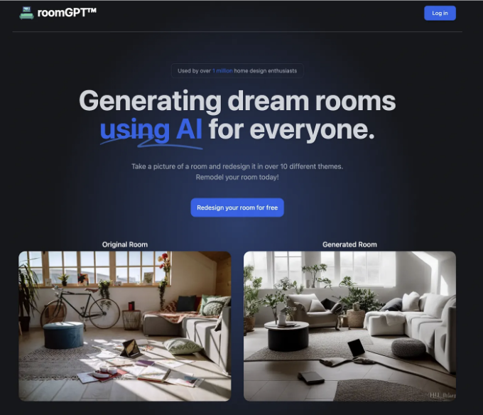
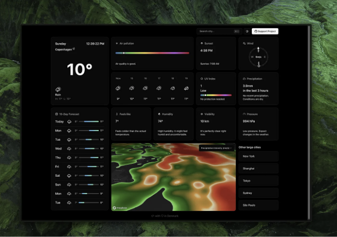
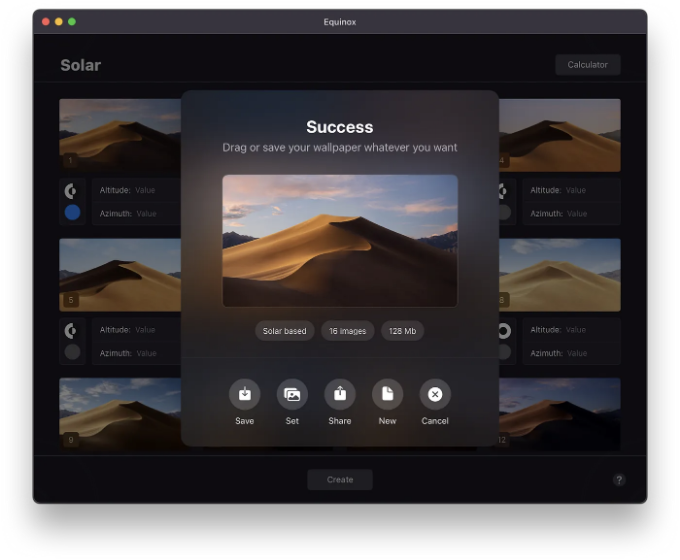
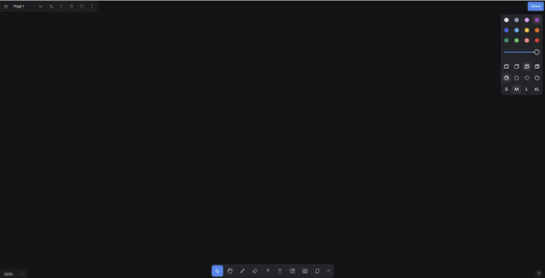
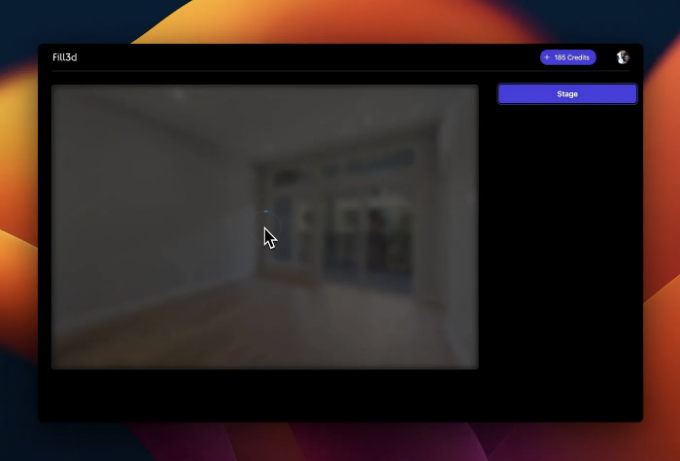
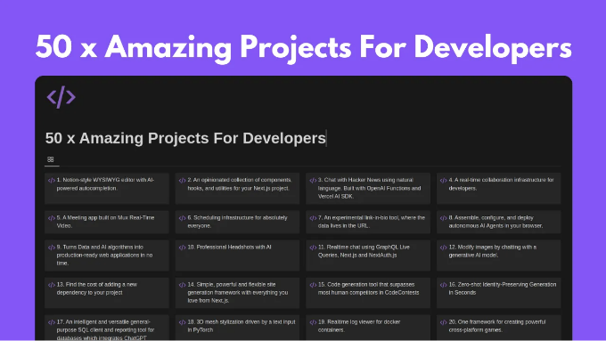

개발자의 역할은 사용자들이 사랑하고 중독적으로 사용하는 제품을 만드는 것입니다. 이러한 제품을 만들기 위해선 어떻게 하는지 배워야 합니다. 본 문서에서는 스타트업을 창업하거나 개발자로 취업하거나 어떠한 SaaS를 구축하더라도 좋은 프로젝트를 만드는 방법을 보여주는 다섯 가지 예제를 제공하겠습니다.

만약 이 다섯 프로젝트들이 부족하다면, 글 아래쪽에 50가지의 멋진 프로젝트를 더 살펴볼 수 있는 링크도 제공했습니다.

자, 리스트를 시작해볼까요?

## 1. RoomGpt

<!-- ui-log 수평형 -->
<ins class="adsbygoogle"
  style="display:block"
  data-ad-client="ca-pub-4877378276818686"
  data-ad-slot="9743150776"
  data-ad-format="auto"
  data-full-width-responsive="true"></ins>
<component is="script">
(adsbygoogle = window.adsbygoogle || []).push({});
</component>

이 앱은 개인이 만들었고 오픈 소스로 공개되었으며 200만 명의 사용자까지 확장되었습니다. 짧은 시간에 앱을 수백만 명의 사용자들에게 확장하는 방법을 배울 수 있는 훌륭한 레포지토리를 제공합니다.

GitHub 링크

## 2. 멋진 날씨 웹 앱

<!-- ui-log 수평형 -->
<ins class="adsbygoogle"
  style="display:block"
  data-ad-client="ca-pub-4877378276818686"
  data-ad-slot="9743150776"
  data-ad-format="auto"
  data-full-width-responsive="true"></ins>
<component is="script">
(adsbygoogle = window.adsbygoogle || []).push({});
</component>

이 날씨 앱은 다이나믹 컴퍼스, 10일 예보, 기압, 대기 오염 측정, 그리고 인터랙티브 맵과 같은 기능들을 포함한 사용자 친화적 인터페이스를 제공합니다. 이 프로젝트를 통해 여러 기능을 한 페이지에 통합하는 방법을 배울 수 있습니다.

GitHub 링크

## 3. Equinox ~ macOS용 동적 배경 화면 생성

<!-- ui-log 수평형 -->
<ins class="adsbygoogle"
  style="display:block"
  data-ad-client="ca-pub-4877378276818686"
  data-ad-slot="9743150776"
  data-ad-format="auto"
  data-full-width-responsive="true"></ins>
<component is="script">
(adsbygoogle = window.adsbygoogle || []).push({});
</component>

썬더레이스는 macOS용 동적 배경화면을 만드는 무료 오픈소스 앱입니다. macOS Mojave부터 "동적 데스크톱" 및 "밝은/어두운 데스크톱" 유형의 배경화면이 포함되어 감탄스러운 것들이 있습니다. 썬더레이스 앱을 사용하면 몇 번의 클릭으로 이러한 배경화면을 쉽게 만들 수 있습니다.

GitHub 링크

## 4. tldraw

<!-- ui-log 수평형 -->
<ins class="adsbygoogle"
  style="display:block"
  data-ad-client="ca-pub-4877378276818686"
  data-ad-slot="9743150776"
  data-ad-format="auto"
  data-full-width-responsive="true"></ins>
<component is="script">
(adsbygoogle = window.adsbygoogle || []).push({});
</component>

tldraw은 무한 캔버스 경험을 만들기 위한 React 라이브러리로, tldraw.com 디지털 화이트보드를 구동하는 데 사용됩니다.

GitHub 링크

## 5. Fill3d

<!-- ui-log 수평형 -->
<ins class="adsbygoogle"
  style="display:block"
  data-ad-client="ca-pub-4877378276818686"
  data-ad-slot="9743150776"
  data-ad-format="auto"
  data-full-width-responsive="true"></ins>
<component is="script">
(adsbygoogle = window.adsbygoogle || []).push({});
</component>

웹에서 발견한 간단하면서 창의적인 제품입니다. 빈 방의 사진을 업로드하고 직사각형을 그려서 원하는 가구를 설명하고, 실사 이미지를 1분 안에 렌더링합니다. 현실적인 결과, 1분 안에 생성, 고해상도 및 무한한 세밀함. 

GitHub 링크

## 추가 혜택: 개발자로 더 나아지기 위한 놀라운 50개 이상의 프로젝트( AI 앱, 복잡한 웹 앱, 기타 멋진 프로젝트 포함 )

<!-- ui-log 수평형 -->
<ins class="adsbygoogle"
  style="display:block"
  data-ad-client="ca-pub-4877378276818686"
  data-ad-slot="9743150776"
  data-ad-format="auto"
  data-full-width-responsive="true"></ins>
<component is="script">
(adsbygoogle = window.adsbygoogle || []).push({});
</component>

읽어 주셔서 감사합니다. 이와 같은 프로젝트를 더 원하신다면, 박수를 치셔서 더 많이 발행할 수 있도록 도와주세요.