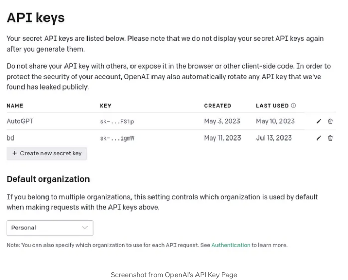
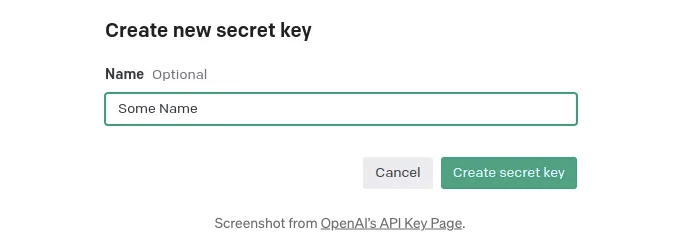
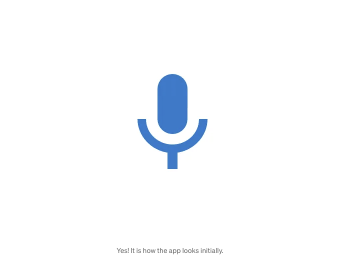
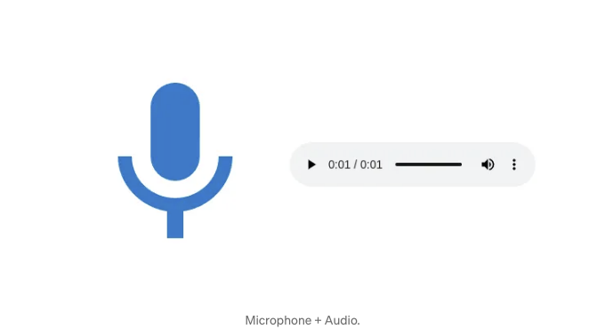

나는 AI 음성 챗봇 붐을 이용하려고 해.

이유는 많아:

- 말하기가 타이핑보다 쉬워.
- 듣기가 읽기보다 쉬워.
- 사람들이 타이핑 대신 말하기로 전환 중.
- 모바일 기기에서 타이핑하는 것은 시간이 많이 걸려.

<!-- ui-log 수평형 -->
<ins class="adsbygoogle"
  style="display:block"
  data-ad-client="ca-pub-4877378276818686"
  data-ad-slot="9743150776"
  data-ad-format="auto"
  data-full-width-responsive="true"></ins>
<component is="script">
(adsbygoogle = window.adsbygoogle || []).push({});
</component>

스마트폰의 경우, 음성 비서가 기본 선택 사항이 될 것입니다!

그래서 나는 나의 첫 번째 풀 스택 애플리케이션을 순전히 음성으로 사용하기로 결정했어요 (리포 및 데모 확인하세요). 이를 구축하기 위해 OpenAI 모델 패키지를 선택했어요:

- Whisper (음성에서 텍스트로). 내 음성을 텍스트로 전사하는 데 사용됩니다.
- GPT-4 또는 GPT-3.5 (대형 언어 모델). Whisper의 텍스트에 대한 응답을 생성합니다.
- TTS (텍스트에서 음성으로). GPT-4의 응답을 mp3와 같은 오디오로 합성합니다.

그리고 내 앱이 현재 작동 중인데, 지금 당신에게 같은 작업을 어떻게 할 수 있는지 가르치러 여기 있어요. 우리는 다음 기술을 사용할 거에요:

<!-- ui-log 수평형 -->
<ins class="adsbygoogle"
  style="display:block"
  data-ad-client="ca-pub-4877378276818686"
  data-ad-slot="9743150776"
  data-ad-format="auto"
  data-full-width-responsive="true"></ins>
<component is="script">
(adsbygoogle = window.adsbygoogle || []).push({});
</component>

- 백엔드 부분에는 Flask를 사용합니다.
- 프론트엔드 부분에는 ReactJS를 사용합니다.
- 양방향 통신을 위해 WebSocket을 사용합니다.

그래서 ReactJS와 Flask를 사용하여 견고한 풀 스택 애플리케이션을 구축하는 방법을 배우게 될 거에요 (Streamlit 이나 Gradio만이 아니라)!

참고: 이 기술들에 익숙하지 않다면 걱정하지 마세요. 앱을 만들기 위해 필요한 모든 것을 제공해 드릴 거에요.

준비됐나요?

<!-- ui-log 수평형 -->
<ins class="adsbygoogle"
  style="display:block"
  data-ad-client="ca-pub-4877378276818686"
  data-ad-slot="9743150776"
  data-ad-format="auto"
  data-full-width-responsive="true"></ins>
<component is="script">
(adsbygoogle = window.adsbygoogle || []).push({});
</component>

코드로 빠져들어볼까요!

# 요구 사항.

OpenAI API를 사용하려면 두 가지가 필요해요: OpenAI API 키와 openai를 설치해야 해요. 아래에 설명할게요.

## OpenAI API 키 생성 및 .env 파일에 저장하기.

<!-- ui-log 수평형 -->
<ins class="adsbygoogle"
  style="display:block"
  data-ad-client="ca-pub-4877378276818686"
  data-ad-slot="9743150776"
  data-ad-format="auto"
  data-full-width-responsive="true"></ins>
<component is="script">
(adsbygoogle = window.adsbygoogle || []).push({});
</component>

오픈에이아이의 API 키 페이지로 이동하여 새 API 키를 생성하세요.

먼저, "+ 새 비밀 키 생성"을 클릭하세요.



그런 다음, 이름을 지정하고 "비밀 키 생성"을 누르세요.

<!-- ui-log 수평형 -->
<ins class="adsbygoogle"
  style="display:block"
  data-ad-client="ca-pub-4877378276818686"
  data-ad-slot="9743150776"
  data-ad-format="auto"
  data-full-width-responsive="true"></ins>
<component is="script">
(adsbygoogle = window.adsbygoogle || []).push({});
</component>



그런 다음 생성된 키를 복사하여 곧 만들 .env 파일에 붙여넣으세요.

.env 파일은 환경 변수를 관리하는 간단하고 효과적인 방법입니다.

프로젝트 디렉토리에 .env 파일을 생성하고 API 키를 넣으세요. 다음과 같이 보이게 됩니다:

<!-- ui-log 수평형 -->
<ins class="adsbygoogle"
  style="display:block"
  data-ad-client="ca-pub-4877378276818686"
  data-ad-slot="9743150776"
  data-ad-format="auto"
  data-full-width-responsive="true"></ins>
<component is="script">
(adsbygoogle = window.adsbygoogle || []).push({});
</component>

```js
OPENAI_API_KEY=sk-11111111111111111111111
```

우리는 이 키를 사용하여 OpenAI의 API에 인증합니다.

## Python 라이브러리 설치하기.

백엔드 애플리케이션을 실행하려면 여러 Python 라이브러리가 필요합니다. 콘솔에서 다음 스크립트를 실행하여 설치할 수 있습니다:

<!-- ui-log 수평형 -->
<ins class="adsbygoogle"
  style="display:block"
  data-ad-client="ca-pub-4877378276818686"
  data-ad-slot="9743150776"
  data-ad-format="auto"
  data-full-width-responsive="true"></ins>
<component is="script">
(adsbygoogle = window.adsbygoogle || []).push({});
</component>

```js
pip install Flask flask-cors flask-socketio python-dotenv openai
```

# **플라스크(Flask)로 백엔드(back-end) 개발하기**

## **단계 1: 플라스크(Flask) 앱 설정하기**

먼저 플라스크(Flask) 애플리케이션을 설정해 보세요.

<!-- ui-log 수평형 -->
<ins class="adsbygoogle"
  style="display:block"
  data-ad-client="ca-pub-4877378276818686"
  data-ad-slot="9743150776"
  data-ad-format="auto"
  data-full-width-responsive="true"></ins>
<component is="script">
(adsbygoogle = window.adsbygoogle || []).push({});
</component>

앱을 초기화하고 세션용 비밀 키를 설정하고 Cross-Origin Resource Sharing (CORS)를 활성화하여 프론트 엔드가 백 엔드와 통신할 수 있도록합니다.

```python
from flask import Flask
from flask_cors import CORS
from flask_socketio import SocketIO

app = Flask(__name__)
CORS(app)
app.config["SECRET_KEY"] = "secret!"
socketio = SocketIO(app, cors_allowed_origins="*")
```

다음은 단계별 설명입니다:

- 앱 = Flask(__name__)은 앱을 초기화합니다.
- app.config["SECRET_KEY”]은 세션용 비밀 키를 설정합니다.
- CORS(app)은 Cross-Origin Resource Sharing (CORS)를 활성화합니다. 이를 통해 프론트 엔드가 백 엔드와 통신할 수 있습니다.
- socketio = SocketIO(app, cors_allowed_origins="*")은 지속적이고 양방향 통신을 위한 WebSocket을 사용합니다.

<!-- ui-log 수평형 -->
<ins class="adsbygoogle"
  style="display:block"
  data-ad-client="ca-pub-4877378276818686"
  data-ad-slot="9743150776"
  data-ad-format="auto"
  data-full-width-responsive="true"></ins>
<component is="script">
(adsbygoogle = window.adsbygoogle || []).push({});
</component>

자, 이제 OpenAI 모델을 사용할 시간입니다.

## 단계 2: OpenAI API 통합하기

이미 openai를 설치했으므로 OpenAI API를 사용할 준비가 되었습니다.

OpenAI 클라이언트를 초기화해 봅시다:

<!-- ui-log 수평형 -->
<ins class="adsbygoogle"
  style="display:block"
  data-ad-client="ca-pub-4877378276818686"
  data-ad-slot="9743150776"
  data-ad-format="auto"
  data-full-width-responsive="true"></ins>
<component is="script">
(adsbygoogle = window.adsbygoogle || []).push({});
</component>

```js
openai 모델을 사용하기 시작할 준비가 끝났어요.
```

<!-- ui-log 수평형 -->
<ins class="adsbygoogle"
  style="display:block"
  data-ad-client="ca-pub-4877378276818686"
  data-ad-slot="9743150776"
  data-ad-format="auto"
  data-full-width-responsive="true"></ins>
<component is="script">
(adsbygoogle = window.adsbygoogle || []).push({});
</component>

이전에 말씀드렸던 대로, 3가지 모델을 사용할 것입니다:

- 속삭임.
- GPT-4.
- TTS.

첫 번째 모델로 이동해 봅시다.

## 단계 3: 오디오 데이터 및 전사 처리.

<!-- ui-log 수평형 -->
<ins class="adsbygoogle"
  style="display:block"
  data-ad-client="ca-pub-4877378276818686"
  data-ad-slot="9743150776"
  data-ad-format="auto"
  data-full-width-responsive="true"></ins>
<component is="script">
(adsbygoogle = window.adsbygoogle || []).push({});
</component>

우리는 수신된 오디오 데이터를 처리하는 엔드포인트가 필요합니다.

다음은 해당 코드 스니펫입니다:

```js
from flask_socketio import emit
from io import BytesIO

@socketio.on("audio_data")
def handle_audio(data):
    try:
        audio_bytes_io = BytesIO(data)
        file_tuple = ("audio.webm", audio_bytes_io, "audio/webm")
        transcription = client.audio.transcriptions.create(model="whisper-1", file=file_tuple)
        emit("transcription", {"text": transcription.text})
        # 전사(transcription)를 처리하여 응답을 생성하고 응답을 합성합니다
    except Exception as e:
        print("An error occurred: ", str(e))
```

위 코드에 관한 내용:

<!-- ui-log 수평형 -->
<ins class="adsbygoogle"
  style="display:block"
  data-ad-client="ca-pub-4877378276818686"
  data-ad-slot="9743150776"
  data-ad-format="auto"
  data-full-width-responsive="true"></ins>
<component is="script">
(adsbygoogle = window.adsbygoogle || []).push({});
</component>

- 오디오 블롭을 받아옵니다 (React 부분에서 생성할 것입니다),
- OpenAI API가 처리할 수 있는 형식으로 변환합니다,
- 그리고 전사를 위해 Whisper 모델을 사용합니다.

## 단계 4: 텍스트 응답 생성 및 발신

이 시점에서, 우리는 prompt 변수에 전사된 텍스트가 있습니다. 이를 다음과 같이 우리의 GPT-4 모델에 전달하고 싶습니다:

```js
def get_response(prompt):
    completion = client.chat.completions.create(
        model="gpt-4-turbo",
        messages=[
            {"role": "system", "content": "당신은 도움이 되는 어시스턴트입니다. 매우 간결하게 해주세요."},
            {"role": "user", "content": prompt},
        ],
    )
    response = completion.choices[0].message.content
    return response
```

<!-- ui-log 수평형 -->
<ins class="adsbygoogle"
  style="display:block"
  data-ad-client="ca-pub-4877378276818686"
  data-ad-slot="9743150776"
  data-ad-format="auto"
  data-full-width-responsive="true"></ins>
<component is="script">
(adsbygoogle = window.adsbygoogle || []).push({});
</component>

오픈에이아이 API를 사용할 때 표준적인 호출 방법입니다.

- 저희는 Large Language Model을 호출하기 위해 client.chat.completions.create()를 사용합니다.
- model="gpt-4-turbo"으로 모델을 지정합니다. 비용 절감과 더 빠른 응답을 위해 "gpt-3.5-turbo"로 변경해도 됩니다.
- "role": "system", "content": "도움이 되는 어시스턴트이다. 간결하게 해주세요"로 시스템 역할을 초기화합니다.
- "role": "user", "content": prompt를 통해 모델에 쿼리를 전달합니다.
- completion.choices[0].message.content에서 응답을 받습니다.

## Step 5: 음성 합성 및 서비스

다음 단계는 텍스트 응답에서 음성을 합성하고 음성 파일로 서비스하는 것입니다. 이를 위해 audio.speech.create 메서드를 사용하고 출력을 파일로 저장하여 프론트 엔드에서 액세스할 수 있도록 합니다.

<!-- ui-log 수평형 -->
<ins class="adsbygoogle"
  style="display:block"
  data-ad-client="ca-pub-4877378276818686"
  data-ad-slot="9743150776"
  data-ad-format="auto"
  data-full-width-responsive="true"></ins>
<component is="script">
(adsbygoogle = window.adsbygoogle || []).push({});
</component>

```python
@app.route("/audio/<filename>")
def serve_audio(filename):
    return send_from_directory("static/audio", filename)

def synthesize_audio(text, audio_filename):
    audio = client.audio.speech.create(
        model="tts-1",
        voice="alloy",
        input=text,
    )
    audio_url = os.path.join("static", "audio", audio_filename)
    audio.stream_to_file(audio_url)
    return audio_url
```

# ReactJS로 프론트엔드 개발.

중요 노트: React가 어떻게 작동하는지에 대해 자세히 다루지 않겠습니다. 그렇지 않으면 이 기사는 4배 더 길어질 것입니다. 그러나 ReactJS에 대해 더 알고 싶다면 댓글에서 알려주세요!

## 단계 0: React 앱 초기화하기.

<!-- ui-log 수평형 -->
<ins class="adsbygoogle"
  style="display:block"
  data-ad-client="ca-pub-4877378276818686"
  data-ad-slot="9743150776"
  data-ad-format="auto"
  data-full-width-responsive="true"></ins>
<component is="script">
(adsbygoogle = window.adsbygoogle || []).push({});
</component>

이 글을 조금 짧게 유지하려면, 첫 번째 React 앱을 실행하는 필수 단계를 안내해 드리겠습니다.

그런 다음 다음과 같이 몇 가지 패키지를 설치해야 합니다:

```js
npm install @emotion/react @emotion/styled @mui/icons-material @mui/material react-audio-voice-recorder socket.io socket.io-client
```

## 단계 1: React 앱 설정하기

<!-- ui-log 수평형 -->
<ins class="adsbygoogle"
  style="display:block"
  data-ad-client="ca-pub-4877378276818686"
  data-ad-slot="9743150776"
  data-ad-format="auto"
  data-full-width-responsive="true"></ins>
<component is="script">
(adsbygoogle = window.adsbygoogle || []).push({});
</component>

MaterialUI에서 필요한 React 컴포넌트를 가져와 시작하겠습니다. MaterialUI는 수백 가지의 미리 만들어진 그래픽 요소를 제공합니다.

```js
import React, { useEffect, useState } from 'react';
import { useAudioRecorder } from 'react-audio-voice-recorder';
import IconButton from '@mui/material/IconButton';
import MicIcon from '@mui/icons-material/Mic';
import StopIcon from '@mui/icons-material/Stop';
```

우리는 이러한 요소들을 사용하여:

- 오디오 녹음을 위한 UI를 처리합니다.
- 시작/중지 녹음 버튼을 표시합니다.
- 합성된 응답을 재생합니다.

<!-- ui-log 수평형 -->
<ins class="adsbygoogle"
  style="display:block"
  data-ad-client="ca-pub-4877378276818686"
  data-ad-slot="9743150776"
  data-ad-format="auto"
  data-full-width-responsive="true"></ins>
<component is="script">
(adsbygoogle = window.adsbygoogle || []).push({});
</component>

## 단계 2: 오디오 녹음 및 상태 처리

녹음 시작 및 중지 기능을 구현하고, 녹음 상태를 관리하기 위해 useAudioRecorder 훅을 사용하세요:

```js
export default function App() {
  const { startRecording, stopRecording, recordingBlob, isRecording } = useAudioRecorder();
  const [audioUrl, setAudioUrl] = useState('');
  // 여기에 추가 기능과 효과를 추가하세요
}
```

또한, 합성된 GPT-4 응답의 오디오가 있는 URL을 저장하는 변수를 생성합니다.

<!-- ui-log 수평형 -->
<ins class="adsbygoogle"
  style="display:block"
  data-ad-client="ca-pub-4877378276818686"
  data-ad-slot="9743150776"
  data-ad-format="auto"
  data-full-width-responsive="true"></ins>
<component is="script">
(adsbygoogle = window.adsbygoogle || []).push({});
</component>

## 단계 3: 오디오 데이터 송수신하기.

오디오 녹음을 완료한 후에, 오디오 블롭을 백엔드로 전송합니다.

통신 채널을 항상 열어두기 위해 HTTP 요청 대신 WebSocket을 사용할 것입니다.

준비할 것들이 많이 필요합니다:

<!-- ui-log 수평형 -->
<ins class="adsbygoogle"
  style="display:block"
  data-ad-client="ca-pub-4877378276818686"
  data-ad-slot="9743150776"
  data-ad-format="auto"
  data-full-width-responsive="true"></ins>
<component is="script">
(adsbygoogle = window.adsbygoogle || []).push({});
</component>

```js
import { io } from "socket.io-client";

const host = 'http://localhost:5000/';
const socket = io(host);

export default function App() {
  // 이전 단계에서 상태를 사용합니다.
  useEffect(() => {
    socket.on('connect', () => {
      console.log('WebSocket 서버에 연결되었습니다.');
    });
    socket.on('transcription', (data) => {
      console.log('전사:', data.text);
      // 선택적으로 전사를 보여주는 UI를 업데이트합니다.
    });
    socket.on('response', (data) => {
      console.log('응답 텍스트:', data.text);
      // 선택적으로 응답 텍스트를 보여주는 UI를 업데이트합니다.
    });
    socket.on('audio_url', (data) => {
      setAudioUrl(host + data.url);
      setAudioKey(Date.now()); // 오디오 플레이어를 강제로 새로고침하기 위해 키를 업데이트합니다.
      console.log('받은 오디오 URL:', host + data.url);
    });
    return () => {
      // 컴포넌트가 해제될 때 소켓 연결을 정리합니다.
      socket.off('connect');
      socket.off('transcription');
      socket.off('response');
      socket.off('audio_url');
    };
  }, []);
  useEffect(() => {
    // 새 녹음을 시작할 때 audioUrl을 재설정합니다.
    if (isRecording) {
      setAudioUrl('');
    }
  }, [isRecording]);
  useEffect(() => {
    // 새로운 recordingBlob이 사용 가능할 때 서버로 전송합니다.
    if (recordingBlob) {
      console.log('오디오 blob을 서버로 전송 중', recordingBlob);
      const reader = new FileReader();
      reader.onload = function (event) {
        const arrayBuffer = event.target.result;
        socket.emit('audio_data', arrayBuffer);
      };
      reader.readAsArrayBuffer(recordingBlob);
    }
  }, [recordingBlob]);
}
```

이제 WebSocket 리스너들을 설정하여 다음을 받을 수 있도록했습니다:

- 전사,
- 텍스트 응답,
- 합성된 오디오의 URL.

## 단계 4: UI 표시하기

<!-- ui-log 수평형 -->
<ins class="adsbygoogle"
  style="display:block"
  data-ad-client="ca-pub-4877378276818686"
  data-ad-slot="9743150776"
  data-ad-format="auto"
  data-full-width-responsive="true"></ins>
<component is="script">
(adsbygoogle = window.adsbygoogle || []).push({});
</component>

마지막으로, 애플리케이션의 UI를 만들어보겠습니다:

```js
return (
  <div
    style={
      display: 'flex',
      justifyContent: 'center',
      alignItems: 'center',
      height: '100vh',
    }
  >
    <IconButton
      sx={ padding: '20px', fontSize: '40px', height: 'auto', width: 'auto' }
      color="primary"
      onClick={isRecording ? handleStopRecording : startRecording}
      aria-label={isRecording ? "녹음 중지" : "녹음 시작"}
    >
      {isRecording ? <StopIcon sx={ fontSize: '15rem' } /> : <MicIcon sx={ fontSize: '15rem' } />}
    </IconButton>
    {audioUrl && <audio key={audioKey} src={audioUrl} controls autoPlay />}
  </div>
);
```

UI를 가능한 간단하게 구성했어요. 그래서 이 UI에는 다음과 같은 요소만 있어요:

- 녹음을 시작하고 중지하는 버튼
- 합성된 응답을 재생하는 오디오 플레이어

<!-- ui-log 수평형 -->
<ins class="adsbygoogle"
  style="display:block"
  data-ad-client="ca-pub-4877378276818686"
  data-ad-slot="9743150776"
  data-ad-format="auto"
  data-full-width-responsive="true"></ins>
<component is="script">
(adsbygoogle = window.adsbygoogle || []).push({});
</component>

그게 다야.

준비 끝났어!

## 앱 실행하기.

Flask 백엔드 시작하기:

<!-- ui-log 수평형 -->
<ins class="adsbygoogle"
  style="display:block"
  data-ad-client="ca-pub-4877378276818686"
  data-ad-slot="9743150776"
  data-ad-format="auto"
  data-full-width-responsive="true"></ins>
<component is="script">
(adsbygoogle = window.adsbygoogle || []).push({});
</component>

```js
python app.py
```

이 명령을 실행하면 http://localhost:5000에서 애플리케이션이 실행됩니다.

React 프런트엔드를 시작합니다 (프런트엔드 디렉토리에 있는지 확인하세요):

```js
npm start
```

<!-- ui-log 수평형 -->
<ins class="adsbygoogle"
  style="display:block"
  data-ad-client="ca-pub-4877378276818686"
  data-ad-slot="9743150776"
  data-ad-format="auto"
  data-full-width-responsive="true"></ins>
<component is="script">
(adsbygoogle = window.adsbygoogle || []).push({});
</component>

http://localhost:3000에 접속하면 가장 간단한 앱이 표시됩니다:



그러나 쿼리를 녹음한 후에는 음성으로 답변이 표시됩니다:



<!-- ui-log 수평형 -->
<ins class="adsbygoogle"
  style="display:block"
  data-ad-client="ca-pub-4877378276818686"
  data-ad-slot="9743150776"
  data-ad-format="auto"
  data-full-width-responsive="true"></ins>
<component is="script">
(adsbygoogle = window.adsbygoogle || []).push({});
</component>

# 다음은 무엇인가요?

이 앱은 완전 기능을 갖추고 있지만 아직은 그다지 실용적이지는 않아요!

하지만 다른 AI 솔루션들과 통합할 거예요:

- 맞춤형 AI 챗봇
- AI 기술을 활용한 웹 앱
- 다양한 RAG 애플리케이션들!

<!-- ui-log 수평형 -->
<ins class="adsbygoogle"
  style="display:block"
  data-ad-client="ca-pub-4877378276818686"
  data-ad-slot="9743150776"
  data-ad-format="auto"
  data-full-width-responsive="true"></ins>
<component is="script">
(adsbygoogle = window.adsbygoogle || []).push({});
</component>

그것을 스마트폰에서 사용할 때 매우 강력해질 거예요!

# 결론

축하해요!

탄탄한 AI 풀스택 애플리케이션을 만드는 방법을 배웠어요!

<!-- ui-log 수평형 -->
<ins class="adsbygoogle"
  style="display:block"
  data-ad-client="ca-pub-4877378276818686"
  data-ad-slot="9743150776"
  data-ad-format="auto"
  data-full-width-responsive="true"></ins>
<component is="script">
(adsbygoogle = window.adsbygoogle || []).push({});
</component>

리액트 부분이 조금 복잡할 수 있어요 (특히 자바스크립트를 배운 적이 없다면).

내 이름은 Kris이고, AI 엔지니어 & 컨설턴트입니다. 저는 중소기업이 AI를 활용하는 것을 도와드려요.

그래서 비즈니스에 AI를 통합하고 싶다면 (하지만 시작하는 방법을 모른다면), LinkedIn에서 DM 보내주세요.

유용한 자료:

<!-- ui-log 수평형 -->
<ins class="adsbygoogle"
  style="display:block"
  data-ad-client="ca-pub-4877378276818686"
  data-ad-slot="9743150776"
  data-ad-format="auto"
  data-full-width-responsive="true"></ins>
<component is="script">
(adsbygoogle = window.adsbygoogle || []).push({});
</component>

- 어플리케이션을 포함한 GitHub 리포지토리.