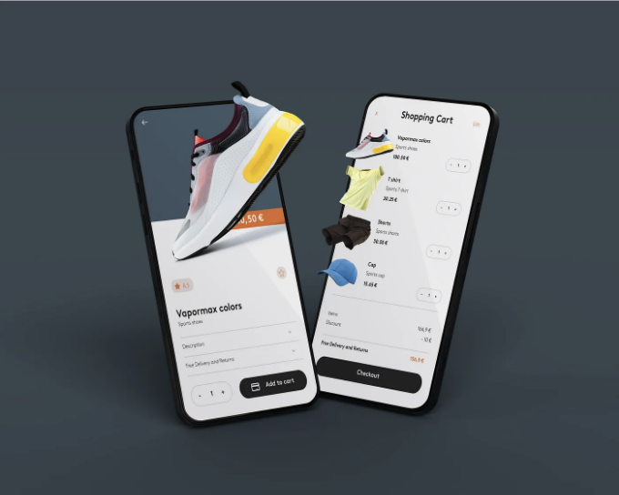

우리는 모두 웹 애플리케이션에 장바구니 기능을 추가하는 것이 보다 어렵다는 것을 알고 있습니다. 이를 수행하는 여러 가지 방법이 있지만, 사용자와 연결된 장바구니를 저장할 수 있는 가장 빠르고 효율적인 방법이 하나 있습니다. 이제 그 방법을 보여드릴게요.

Vercel KV와 Next-Auth를 이용해 서버 액션을 사용하여 사용자와 연결된 쇼핑 카트를 생성할 것입니다.

이 기능을 복잡한 프로젝트에 구현한 전자 상거래 사이트를 확인하고 그 빠른 처리 속도를 확인해보세요.

<!-- ui-log 수평형 -->
<ins class="adsbygoogle"
  style="display:block"
  data-ad-client="ca-pub-4877378276818686"
  data-ad-slot="9743150776"
  data-ad-format="auto"
  data-full-width-responsive="true"></ins>
<component is="script">
(adsbygoogle = window.adsbygoogle || []).push({});
</component>

저는 일자리를 찾고 있어요! 제 포트폴리오를 확인하고 연락주세요.

이 문서의 코드:

## 0. 프로젝트 설정 및 종속성 설치

Next.js 프로젝트를 설정하는 방법을 시작해봅시다. 다음 단계를 따라 폴더 구조를 만들어주세요.

<!-- ui-log 수평형 -->
<ins class="adsbygoogle"
  style="display:block"
  data-ad-client="ca-pub-4877378276818686"
  data-ad-slot="9743150776"
  data-ad-format="auto"
  data-full-width-responsive="true"></ins>
<component is="script">
(adsbygoogle = window.adsbygoogle || []).push({});
</component>

터미널을 열고 다음 명령어를 실행하세요:

```js
npx create-next-app@latest
```

프로젝트 이름을 입력하고 다음 질문에 답해주세요:

- TypeScript를 사용하시겠습니까? (예)
- ESLint를 사용하시겠습니까? (예)
- Tailwind CSS를 사용하시겠습니까? (예)
- src/ 디렉토리를 사용하시겠습니까? (예)
- App Router를 사용하시겠습니까? (예, 권장)
- 기본 import 별칭(@/*)을 사용자 정의하시겠습니까? (예)

<!-- ui-log 수평형 -->
<ins class="adsbygoogle"
  style="display:block"
  data-ad-client="ca-pub-4877378276818686"
  data-ad-slot="9743150776"
  data-ad-format="auto"
  data-full-width-responsive="true"></ins>
<component is="script">
(adsbygoogle = window.adsbygoogle || []).push({});
</component>

계속하기 전에 애플리케이션을 위한 몇 가지 종속성을 설치해보겠습니다:

```js
npm install @vercel/kv next-auth
```

# 1. 사용자 인증 설정

이 섹션에서는 Next-Auth를 사용하여 사용자와 사용자의 쇼핑 카트를 연결할 것입니다. 이미 이 라이브러리를 사용하는 방법에 대해 더 깊이 알아볼 수 있는 기사가 있습니다. 그러나 이제는 구글 로그인만 허용할 것입니다.

<!-- ui-log 수평형 -->
<ins class="adsbygoogle"
  style="display:block"
  data-ad-client="ca-pub-4877378276818686"
  data-ad-slot="9743150776"
  data-ad-format="auto"
  data-full-width-responsive="true"></ins>
<component is="script">
(adsbygoogle = window.adsbygoogle || []).push({});
</component>

## 1.1 환경 변수 설정

이 섹션에 필요한 환경 변수를 추가합니다:

```js
GOOGLE_CLIENT_ID="당신의_클라이언트_ID"
GOOGLE_CLIENT_SECRET="당신의_시크릿_ID"
NEXTAUTH_SECRET="NEXTAUTH_시크릿"
```

Google 인증 키를 어떻게 얻을지 모르겠다면 여기를 클릭하세요.

<!-- ui-log 수평형 -->
<ins class="adsbygoogle"
  style="display:block"
  data-ad-client="ca-pub-4877378276818686"
  data-ad-slot="9743150776"
  data-ad-format="auto"
  data-full-width-responsive="true"></ins>
<component is="script">
(adsbygoogle = window.adsbygoogle || []).push({});
</component>

Next-Auth 시크릿 키를 얻으려면 터미널에서 다음을 실행하면 무작위 키가 생성됩니다.

```js
npx auth secret
```

## 1.2 인증 로직 구현

다음으로 필요한 폴더와 파일을 생성하여 인증 로직을 설정하겠습니다.

<!-- ui-log 수평형 -->
<ins class="adsbygoogle"
  style="display:block"
  data-ad-client="ca-pub-4877378276818686"
  data-ad-slot="9743150776"
  data-ad-format="auto"
  data-full-width-responsive="true"></ins>
<component is="script">
(adsbygoogle = window.adsbygoogle || []).push({});
</component>

## 1.2.1 NextAuth 설정 구성하기

app/api/auth/[...nextauth] 폴더 내에 route.ts라는 파일을 생성하세요:

```js
import NextAuth from "next-auth";
import type { NextApiRequest, NextApiResponse } from "next";
import { NextAuthOptions } from "next-auth";
import GoogleProvider from "next-auth/providers/google";

const options: NextAuthOptions = {
  // Google을 인증 제공자로 구성
  providers: [
    GoogleProvider({
      // 환경 변수에서 얻은 Google OAuth 클라이언트 ID 설정
      clientId: process.env.GOOGLE_CLIENT_ID as string,
      // 환경 변수에서 얻은 Google OAuth 클라이언트 비밀 설정
      clientSecret: process.env.GOOGLE_CLIENT_SECRET as string
    }),
  ],
  // 로그인 페이지와 같은 인증 페이지를 사용자 정의
  pages: {
    signIn: "/login",
  },
};

// 인증 요청을 처리하는 핸들러 함수 정의
const handler = (req: NextApiRequest, res: NextApiResponse) => NextAuth(req, res, options);

// GET 및 POST 요청을 모두 처리하기 위해 핸들러 함수 내보내기
export { handler as GET, handler as POST };
```

## 1.2.2 로그인 페이지 생성하기

<!-- ui-log 수평형 -->
<ins class="adsbygoogle"
  style="display:block"
  data-ad-client="ca-pub-4877378276818686"
  data-ad-slot="9743150776"
  data-ad-format="auto"
  data-full-width-responsive="true"></ins>
<component is="script">
(adsbygoogle = window.adsbygoogle || []).push({});
</component>

앱/login 폴더 안에 page.tsx라는 파일을 만들어주세요:

```js
import React from 'react';
import { getServerSession } from "next-auth/next";
import { authOptions } from "@/libs/auth";
import { Session } from "next-auth";
import { redirect } from 'next/navigation';
import Signin from '@/components/Signin';

const Login = async () => {
  // 서버에서 사용자 세션 정보를 가져옵니다
  const session: Session | null = await getServerSession(authOptions);

  // 이미 로그인한 사용자는 add-to-cart 페이지로 리디렉션하고, 아닌 경우에는 Signin 컴포넌트를 표시합니다
  if (session) {
    redirect('/add-to-cart');
  } else {
    return (
      <Signin />
    )
  }
}

export default Login;
```

src/components 폴더 안에 Signin이라는 컴포넌트를 만들어주세요:

```js
"use client"; // 클라이언트 컴포넌트

import React, { useEffect } from "react"; 
import { signIn } from "next-auth/react"; 
import Link from "next/link"; 
import { useSession } from 'next-auth/react';

const Signin = () => {
  // useSession 훅을 사용하여 사용자 세션 정보를 가져옵니다
  const { data: session } = useSession();

  // useEffect 훅을 사용하여 사용자 세션이 감지되면 페이지를 다시로드합니다
  useEffect(() => {
    if (session?.user) {
      window.location.reload();
    }
  }, [session]);

  return (
    <section className="flex items-center justify-center w-full h-screen px-4">
      <form
        className="p-6 xs:p-10 w-full max-w-[350px] flex flex-col justify-between items-center gap-2.5 bg-white rounded text-black"
      >
        <h1 className="w-full my-5 text-2xl font-bold">Welcome back</h1>
        
        {/* 구글로 로그인하는 버튼 */}
        <button
          className="w-full h-10 justify-center flex py-1.5 px-4 text-sm align-middle items-center rounded text-999 bg-[#F4F4F5] transition duration-150 ease hover:bg-gray-200 gap-3"
          onClick={(e) => {
            e.preventDefault();
            signIn("google"); // "google" 제공자로 signIn 함수 호출
          }}>
          <svg
            data-testid="geist-icon"
            height="24"
            strokeLinejoin="round"
            viewBox="0 0 16 16"
            width="24"
            style={{ color: 'currentColor' }}
          >
            <path
              d="M8.15991 6.54543V9.64362H12.4654C12.2763 10.64 11.709 11.4837 10.8581 12.0509L13.4544 14.0655C14.9671 12.6692 15.8399 10.6182 15.8399 8.18188C15.8399 7.61461 15.789 7.06911 15.6944 6.54552L8.15991 6.54543Z"
              fill="#4285F4"
            ></path>
            <!-- 나머지 SVG path 생략 -->
          </svg>
          구글로 로그인
        </button>
        <Link href="/register" className="text-sm text-gray-500 transition duration-150 ease hover:text-black">
          아직 계정이 없으신가요?
        </Link>
      </form>
    </section>
  );
}

export default Signin;
```

<!-- ui-log 수평형 -->
<ins class="adsbygoogle"
  style="display:block"
  data-ad-client="ca-pub-4877378276818686"
  data-ad-slot="9743150776"
  data-ad-format="auto"
  data-full-width-responsive="true"></ins>
<component is="script">
(adsbygoogle = window.adsbygoogle || []).push({});
</component>

이 섹션에서는 NextAuth를 사용하여 Google 로그인을 통한 사용자 인증 인프라를 설정했습니다.

# 2. 사용자 링크된 쇼핑 카트 통합

이 섹션에서는 쇼핑 카트 기능을 사용자 인증과 연결합니다. 필요한 환경 변수를 구성하는 것부터 시작해봅시다.

## 2.1 환경 변수 설정

<!-- ui-log 수평형 -->
<ins class="adsbygoogle"
  style="display:block"
  data-ad-client="ca-pub-4877378276818686"
  data-ad-slot="9743150776"
  data-ad-format="auto"
  data-full-width-responsive="true"></ins>
<component is="script">
(adsbygoogle = window.adsbygoogle || []).push({});
</component>

`.env.local` 파일을 만들고 다음 변수를 추가해주세요:

```js
KV_URL="YOUR_KV_URL"
KV_REST_API_URL="YOUR_KV_API_URL"
KV_REST_API_TOKEN="YOUR_API_TOKEN"
KV_REST_API_READ_ONLY_TOKEN="YOUR_READ_ONLY_TOKEN"
```

환경 변수를 어떻게 얻을지에 대해 의문이 있으면 여기를 클릭해주세요.

## 2.2.1 장바구니 페이지 설정

<!-- ui-log 수평형 -->
<ins class="adsbygoogle"
  style="display:block"
  data-ad-client="ca-pub-4877378276818686"
  data-ad-slot="9743150776"
  data-ad-format="auto"
  data-full-width-responsive="true"></ins>
<component is="script">
(adsbygoogle = window.adsbygoogle || []).push({});
</component>

로직 사용자 인증이 완료되면 장바구니 로직을 시작해 보겠습니다. add-to-cart라는 경로를 생성하고 이 미완료 코드를 넣을 page.tsx 파일을 만들 것입니다.

```js
import { getServerSession } from "next-auth/next";
import { authOptions } from "@/libs/auth";
import { Session } from "next-auth";
import { redirect } from "next/navigation";

// Product 객체에 대한 유형 정의
export type Product = {
    id: number,
    name: string,
    price: number
}

// 제품 배열
export const products: Product[] = [
    {
        id: 1,
        name: "아메리카노",
        price: 40
    },
    {
        id: 2,
        name: "에스프레소",
        price: 20
    },
    {
        id: 3,
        name: "아라비카",
        price: 10
    }
];

export default async function AddToCart() {
    // 서버 세션 가져오기
    const session: Session | null = await getServerSession(authOptions);

    // 세션이 없으면 로그인 페이지로 리다이렉트
    if (!session) {
        redirect('/login');
    }
    
    return (
        <main className="flex flex-col items-center min-h-screen p-24">
   
        </main>
    )
}
```

## 2.2.2 쇼핑 카트 액션 로직

add-to-cart 폴더 내에 action.ts라는 파일을 생성할 것입니다. 여기에는 모든 쇼핑 카트 로직이 위치합니다.

<!-- ui-log 수평형 -->
<ins class="adsbygoogle"
  style="display:block"
  data-ad-client="ca-pub-4877378276818686"
  data-ad-slot="9743150776"
  data-ad-format="auto"
  data-full-width-responsive="true"></ins>
<component is="script">
(adsbygoogle = window.adsbygoogle || []).push({});
</component>

```js
'start server'

import { kv } from "@vercel/kv";
import { revalidatePath } from "next/cache";
import { products, type Product } from "./page";

// 카트 객체 유형 정의
export type Cart = {
    userId: string;
    items: Array<{
        id: number,
        name: string,
        price: number,
        quantity: number
    }>
}

// 카트에 아이템 추가하는 함수
export async function addItem(userId: string, productId: number) {
    // 사용자 ID를 기반으로 카트 검색
    let cart: Cart | null = await kv.get(`testcart-${userId}`);

    // 제품 배열에서 선택한 제품 찾기
    const selectedProduct: Product | undefined = products.find(product => product.id === productId);

    // 선택한 제품이 없는 경우 처리
    if (!selectedProduct) {
        console.error(`ID가 ${productId}인 제품을 찾을 수 없습니다.`);
        return;
    }

    // 카트가 비어있거나 존재하지 않는 경우 새로운 카트 객체 생성
    let myCart = {} as Cart;

    if (!cart || !cart.items) {
        myCart = {
            userId: userId,
            items: [
                {
                    ...selectedProduct,
                    quantity: 1
                }
            ]
        };
    } else {
        // 아이템이 이미 카트에 있는지 확인
        let itemFound = false;

        // 기존 아이템의 수량을 업데이트하거나 새로운 아이템을 카트에 추가
        myCart.items = cart.items.map(item => {
            if (item.id === productId) {
                itemFound = true;
                item.quantity += 1;
            }
            return item;
        }) as Cart['items'];

        if (!itemFound) {
            console.log('새로운 아이템을 카트에 추가합니다.');
            myCart.items.push({
                ...selectedProduct,
                quantity: 1,
            });
        }
    }

    // 업데이트된 카트 기록
    console.log('업데이트된 카트:', myCart);

    // 업데이트된 카트를 KV 저장소에 저장
    await kv.set(`testcart-${userId}`, myCart);
    
    // '/add-to-cart' 페이지를 재검증
    revalidatePath('/add-to-cart');
}

// 카트에서 아이템 삭제하는 함수
export async function delItem(userId: string, productId: number) {
    // 사용자 ID를 기반으로 카트 검색
    let cart: Cart | null = await kv.get(`testcart-${userId}`);

    // 카트와 아이템이 있는지 확인
    if (cart && cart.items) {
        // 삭제할 아이템을 카트에서 필터링
        const updatedCart = {
            userId: userId,
            items: cart.items.filter(item => item.id !== productId),
        };

        // 업데이트된 카트를 KV 저장소에 저장
        await kv.set(`testcart-${userId}`, updatedCart);
        
        // '/add-to-cart' 페이지를 재검증
        revalidatePath('/add-to-cart');
    }
}

// 카트에서 아이템 하나 삭제하는 함수
export async function delOneItem(userId: string, productId: number) {
    // 사용자 ID를 기반으로 카트 검색
    let cart: Cart | null = await kv.get(`testcart-${userId}`);

    // 카트와 아이템이 있는지 확인
    if (cart && cart.items) {
        // 아이템의 수량을 업데이트하거나 수량이 0이 되면 제거
        const updatedCart = {
            userId: userId,
            items: cart.items.map(item => {
                if (item.id === productId) {
                    if (item.quantity > 1) {
                        item.quantity -= 1;
                    } else {
                        return null;
                    }
                }
                return item;
            }).filter(Boolean) as Cart['items'],
        };

        // 업데이트된 카트를 KV 저장소에 저장
        await kv.set(`testcart-${userId}`, updatedCart);
        
        // '/add-to-cart' 페이지를 재검증
        revalidatePath('/add-to-cart');
    }
}
```

<!-- ui-log 수평형 -->
<ins class="adsbygoogle"
  style="display:block"
  data-ad-client="ca-pub-4877378276818686"
  data-ad-slot="9743150776"
  data-ad-format="auto"
  data-full-width-responsive="true"></ins>
<component is="script">
(adsbygoogle = window.adsbygoogle || []).push({});
</component>

```javascript
"use client" // 클라이언트 컴포넌트

import { formatNumber } from "@/utils/format";
import { useTransition } from "react";
import { delItem, delOneItem } from "@/app/add-to-cart/action";

// CartItem 컴포넌트에 전달되는 props에 대한 유형 정의
type CartItemProps = {
    no: number,
    id: number,
    userId: string,
    name: string,
    quantity: number,
    price: number,
}

export default function CartItem({
    no, id, userId, name, quantity, price
}: CartItemProps) {
    // 보류 중인 전환을 위한 상태 선언
    let [isPending, startTransition] = useTransition()

    return <div className="flex justify-between text-slate-900">
        <div className="w-[40%] flex gap-2 items-center">
            <span className="text-sm text-slate-600">{no}</span>
            <span>{name}</span>
        </div>
        <div className="w-[30%] text-center">{quantity}</div>
        <div className="w-[30%] text-right">{formatNumber(quantity * price)}</div>
        <button
            className="text-sm font-semibold hover:text-slate-600"
            onClick={() => {
                // 이 유형의 모든 항목을 장바구니에서 삭제하기 위한 전환 시작
                startTransition(() => delItem(userId, id));
            }
        >
            모든 항목 삭제
        </button>
        <button
            className="text-sm font-semibold hover:text-slate-600"
            onClick={() => {
                // 이 유형의 한 항목을 장바구니에서 삭제하기 위한 전환 시작
                startTransition(() => delOneItem(userId, id));
            }
        >
            항목 삭제
        </button>
    </div>
}
```

애플리케이션을 완성하기 위해 add-to-cart 내의 page.tsx 파일을 수정하여 애플리케이션의 제품 및 등록된 사용자의 장바구니를 전달할 두 개의 새 컴포넌트를 추가하겠습니다.

```javascript
import ProductCard from "@/components/ProductCard";
import CartItem from "@/components/CartItem";
import { type Cart } from "./action"; // 장바구니에 대한 유형 가져오기
import { kv } from "@vercel/kv";
import { getServerSession } from "next-auth/next";
import { authOptions } from "@/libs/auth";
import { Session } from "next-auth";
import { redirect } from "next/navigation";

export type Product = {
    id: number,
    name: string,
    price: number
}

export const products: Product[] = [
    {
        id: 1,
        name: "아메리카노",
        price: 40
    },
    {
        id: 2,
        name: "에스프레소",
        price: 20
    },
    {
        id: 3,
        name: "아라비카",
        price: 10
    }
];

export default async function AddToCart() {
    const session: Session | null = await getServerSession(authOptions);

    if (!session) {
        redirect('/login');
    }
    
    // 세션에서 사용자 ID 추출
    const userId = session.user._id;

    // KV 저장소에서 사용자의 장바구니 검색
    const cart: Cart | null = await kv.get(`testcart-${userId}`);

    // 장바구니에 있는 항목의 총 수량 계산
    const total = cart?.items.reduce((sum, item) => sum + item.quantity, 0) || 0;

    return (
        <main className="flex flex-col items-center min-h-screen p-24">
            {/* 제품 표시를 위한 섹션 */}
            <div className="w-full">
                <h1 className="mb-6 text-xl font-semibold text-left text-slate-900">제품: </h1>
                <div className="flex gap-6">
                    {/* 제품 배열을 매핑하고 각 제품에 대해 ProductCard 컴포넌트 렌더링 */}
                    {products.map(product =>
                        <ProductCard key={product.id}
                            id={product.id}
                            userId={userId}
                            name={product.name}
                            price={product.price}
                        />
                    )}
                </div>
            </div>

            {/* 장바구니 표시를 위한 섹션 */}
            <div className="w-full mt-6">
                <h1 className="text-xl font-semibold text-slate-900">장바구니: </h1>
                <div className="flex flex-col gap-2 px-6 py-4 mt-2 border rounded-xl border-slate-700">
                    {/* 카트 내의 각 항목에 대해 CartItem 컴포넌트 렌더링 */}
                    {cart?.items ? cart.items.map((item, index) =>
                        <CartItem key={item.id}
                            no={index + 1}
                            id={item.id}
                            userId={userId}
                            name={item.name}
                            price={item.price}
                            quantity={item.quantity}
                        />
                    ) :
                        <span className="text-sm text-slate-600">아이템 없음</span>
                    }
                </div>

                {/* 장바구니에 있는 항목의 총 수량을 표시하는 섹션 */}
                <div className="flex justify-between px-6 mt-4 font-semibold text-slate-900">
                    <div>총 수량</div>
                    <div>{total}</div>
                </div>
            </div>
        </main>
    )
}
```

## 마무리 및 결론```

<!-- ui-log 수평형 -->
<ins class="adsbygoogle"
  style="display:block"
  data-ad-client="ca-pub-4877378276818686"
  data-ad-slot="9743150776"
  data-ad-format="auto"
  data-full-width-responsive="true"></ins>
<component is="script">
(adsbygoogle = window.adsbygoogle || []).push({});
</component>

다음은 Next.js 14에서 Vercel KV와 Next-Auth를 사용하여 사용자와 연결된 쇼핑 카트를 만드는 방법입니다. 꽤 쉽죠?

지금까지 따라오셔서 정말 감사합니다. 유용하게 찾으셨다면 GitHub에서 박수와 스타를 남겨주세요 ❤.

# 간단하게 설명 🚀

In Plain English 커뮤니티에 참여해 주셔서 감사합니다! 계속 진행하기 전에:

<!-- ui-log 수평형 -->
<ins class="adsbygoogle"
  style="display:block"
  data-ad-client="ca-pub-4877378276818686"
  data-ad-slot="9743150776"
  data-ad-format="auto"
  data-full-width-responsive="true"></ins>
<component is="script">
(adsbygoogle = window.adsbygoogle || []).push({});
</component>

- 작가를 칭찬하고 팔로우하는 것을 잊지 마세요! 👏️
- 팔로우하기: X | LinkedIn | YouTube | Discord | 뉴스레터
- 다른 플랫폼 방문하기: Stackademic | CoFeed | Venture | Cubed
- 더 많은 콘텐츠: PlainEnglish.io