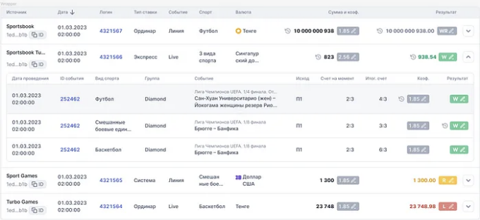
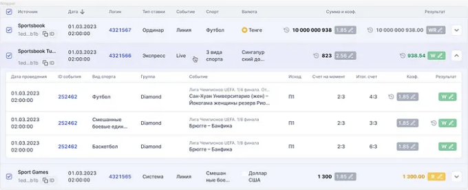

## 당신이 필요로 할 마지막 테이블 컴포넌트

최근에, 프로젝트 UI 킷을 위한 새로운 테이블 컴포넌트를 만들라는 업무를 맡게 되었어. 나는 곧이어 행동에 나서 코드를 작성하기 시작했지만, 곧이어 그보다 더 복잡한 어려움이 숨어 있다는 것을 깨닫게 되었어.

결국, 재사용 가능하고 견고한 컴포넌트를 만들 수 있었지만, 막대한 양의 시간과 노력을 들였어. 내가 만든 것을 나누고 싶어서 이야기하고 싶은데, 아마 이것이 당신에게 시간을 절약해 줄 수 있길 희망해.

이 글에서는 우리는 내가 만든 컴포넌트를 처음부터 만들어가면서 검토해 볼 거야. 시작하기 전에, 이 해결방안을 더 나아지게 할 여지가 아직 있다는 것과, 당신이 도움을 줄 수 있다는 점을 말씀드리고 싶어. 만약 제안이나 생각이 있다면, 댓글에서 자유롭게 공유해 주세요!

<!-- ui-log 수평형 -->
<ins class="adsbygoogle"
  style="display:block"
  data-ad-client="ca-pub-4877378276818686"
  data-ad-slot="9743150776"
  data-ad-format="auto"
  data-full-width-responsive="true"></ins>
<component is="script">
(adsbygoogle = window.adsbygoogle || []).push({});
</component>

# 디자인 개요 및 기능

이 글에서는 스타일에 중점을 두지는 않지만, 디자인에서 몇 가지 스크린샷을 보여드리려고 합니다. 이렇게 하면 우리가 만들고 있는 것에 대략적인 그림을 볼 수 있을 것입니다.



테이블에서 행을 선택하는 내용을 보여주는 또 다른 한 장면입니다.

<!-- ui-log 수평형 -->
<ins class="adsbygoogle"
  style="display:block"
  data-ad-client="ca-pub-4877378276818686"
  data-ad-slot="9743150776"
  data-ad-format="auto"
  data-full-width-responsive="true"></ins>
<component is="script">
(adsbygoogle = window.adsbygoogle || []).push({});
</component>



처음에는 간단한 컴포넌트처럼 보일지 모르지만 너무 서두르지 마세요. 특히 공유 컴포넌트를 만들고 싶을 때는 세부 사항에 주의해야 합니다. 이 컴포넌트가 가지고 있는 기능 목록을 전체적으로 살펴보겠습니다:

- 행과 열의 기본 렌더링
- 행 확장
- 행 선택
- 정렬 및 필터링
- 무한 스크롤(하단 스크롤 감지)
- 행 가상화

# 사용할 라이브러리

<!-- ui-log 수평형 -->
<ins class="adsbygoogle"
  style="display:block"
  data-ad-client="ca-pub-4877378276818686"
  data-ad-slot="9743150776"
  data-ad-format="auto"
  data-full-width-responsive="true"></ins>
<component is="script">
(adsbygoogle = window.adsbygoogle || []).push({});
</component>

우리 컴포넌트에 필수 라이브러리는 Tanstack Table입니다. 이 패키지는 유연성과 맞춤 설정으로 유명하며, 지금까지 발견한 최고의 솔루션 중 하나입니다.

Tanstack 생태계가 익숙하지 않다면, 이들이 무엇을 만들고 있는지 꼭 확인하시기를 권장합니다. 거기에 많은 유용한 것들을 찾을 수 있을 거예요.

테이블의 나머지 기능에 대해서는, 두 라이브러리만 필요합니다: react-bottom-scroll-listener로 하단 스크롤을 추적하고, react-virtual로 행 렌더링을 최적화합니다.

또한, 언제든지 소스 코드를 여기서 찾으실 수 있습니다.

<!-- ui-log 수평형 -->
<ins class="adsbygoogle"
  style="display:block"
  data-ad-client="ca-pub-4877378276818686"
  data-ad-slot="9743150776"
  data-ad-format="auto"
  data-full-width-responsive="true"></ins>
<component is="script">
(adsbygoogle = window.adsbygoogle || []).push({});
</component>

# 행과 열의 기본 렌더링

우선 테이블에 대한 속성을 정의해 봅시다. 현재로서는 매우 기본적인 내용입니다.

```js
import type {TableOptions} from '@tanstack/react-table';

// 라이브러리에서 필수적인 속성만 선택합니다
export type TableProps<D extends Record<string, any>> = Pick<
  // 더 나은 타입을 얻기 위해 제네릭을 사용하고 싶습니다
  TableOptions<D>,
  'columns' | 'data'
> & {
  // 필수는 아니지만 가지고 있는 것이 좋습니다. 테이블의 컨테이너에 적용될 것입니다
  className?: string
};
```

이제 컴포넌트로 변경하여 기본 기능을 작성해 봅시다.

<!-- ui-log 수평형 -->
<ins class="adsbygoogle"
  style="display:block"
  data-ad-client="ca-pub-4877378276818686"
  data-ad-slot="9743150776"
  data-ad-format="auto"
  data-full-width-responsive="true"></ins>
<component is="script">
(adsbygoogle = window.adsbygoogle || []).push({});
</component>

```js
import {flexRender, getCoreRowModel, useReactTable} from '@tanstack/react-table';
import React from 'react';
import {Flex} from 'reflexbox';

// 소스 코드에서 스타일을 찾을 수 있어요 :)
import {
  StyledTable,
  StyledTableBody,
  StyledTableBodyCell,
  StyledTableBodyRow,
  StyledTableHead,
  StyledTableHeadCell,
  StyledTableWrap,
} from './styled';
import {TableSpinner} from './TableSpinner';
import type {TableProps} from './types';
import {getTableCellStyle} from '../../lib';
export {type TableProps};
export {TableSpinner};

// 다시 한 번, 프롭스에 제네릭을 전달해야 해요
export function Table<D extends Record<string, any>>({
  className,
  data,
  columns,
}: TableProps<D>) {
  // 라이브러리에서 기본 코드
  const {getHeaderGroups, getRowModel} = useReactTable({
    data,
    columns,
    getCoreRowModel: getCoreRowModel(),
  });

  return (
    <StyledTableWrap className={className}>
      <StyledTable>
        <StyledTableHead>
          {getHeaderGroups().map(headerGroup => (
            <Flex key={headerGroup.id} alignItems="center">
              {headerGroup.headers.map(header => {
                // 이러한 프롭스들은 라이브러리에 정의되어 있고
                // 컬럼 크기를 조절하는 데 사용돼요
                const {size, minSize, maxSize} = header.column.columnDef;
                return (
                  // getTableCellStyleNew은 값들을 CSS 속성으로 재매핑하는 역할을 해요
                  // 아래 코드를 보면 알 수 있을 거예요
                  <StyledTableHeadCell key={header.id} style={getTableCellStyle({size, maxSize, minSize})}>
                    // flexRender를 사용하는 것이 좋은 습관이에요
                    // 아래에서 왜 그런지 설명할게요
                    {flexRender(header.column.columnDef.header, header.getContext())}
                  </StyledTableHeadCell>
                );
              })}
            </Flex>
          ))}
        </StyledTableHead>
        // 여기서도 같은 로직이 적용돼요
        <StyledTableBody>
          {getRowModel().rows.map(row => (
            <StyledTableBodyRow key={row.id}>
              <Flex>
                {row.getVisibleCells().map(cell => {
                  const {size, maxSize, minSize} = cell.column.columnDef;
                  return (
                    <StyledTableBodyCell key={cell.id} style={getTableCellStyle({size, maxSize, minSize})}>
                      {flexRender(cell.column.columnDef.cell, cell.getContext())}
                    </StyledTableBodyCell>
                  );
                })}
              </Flex>
            </StyledTableBodyRow>
          ))}
        </StyledTableBody>
      </StyledTable>
    </StyledTableWrap>
  );
}
```

그래서, flexRender는 셀 컴포넌트를 렌더링하는 데 도움이 되는 작은 유틸리티에요. React Table에서 셀을 React 컴포넌트, 문자열 또는 숫자로 정의할 수 있어요. 이 함수는 컴포넌트인 경우 props를 전달하거나 간단히 원시값을 반환해요.

아래 소스 코드를 보고 모든 것을 이해할 수 있어요. 개발자들의 원래 코멘트를 주목해보세요.

```js
// 만약 사용자 정의 마크업으로 헤더, 셀 또는 푸터를 렌더링한다면,
// `cell.getValue()`나 `cell.renderValue()` 대신 flexRender를 사용해야 해요.
export function flexRender<TProps extends object>(
  Comp: Renderable<TProps>,
  props: TProps
): React.ReactNode | JSX.Element {
  return !Comp ? null : isReactComponent<TProps>(Comp) ? (
    <Comp {...props} />
  ) : (
    Comp
  )
}
```

<!-- ui-log 수평형 -->
<ins class="adsbygoogle"
  style="display:block"
  data-ad-client="ca-pub-4877378276818686"
  data-ad-slot="9743150776"
  data-ad-format="auto"
  data-full-width-responsive="true"></ins>
<component is="script">
(adsbygoogle = window.adsbygoogle || []).push({});
</component>

우리는 곧 utils를 저장할 공간도 필요할 것이므로 그들을 위한 별도의 파일을 만들어 보겠습니다. 현재는 작은 getTableCellStyle 함수만 포함하게 될 것입니다.

```js
// 솔직히 말해서, 이 함수는 필수적이지 않을 수 있어요.
// 그러나 명확성을 위해 분리하는 것을 선호합니다.
export const getTableCellStyle = ({
  size,
  minSize,
  maxSize,
}: {
  size?: number | string;
  minSize?: number | string;
  maxSize?: number | string;
}): CSSProperties => ({
  width: size,
  maxWidth: maxSize,
  minWidth: minSize,
});
```

우리의 Table 컴포넌트의 기반이 마련되었습니다! 그러나 아직 한가할 시간은 아닙니다, 가장 흥미로운 부분이 곧 시작됩니다)

# 행 확장

<!-- ui-log 수평형 -->
<ins class="adsbygoogle"
  style="display:block"
  data-ad-client="ca-pub-4877378276818686"
  data-ad-slot="9743150776"
  data-ad-format="auto"
  data-full-width-responsive="true"></ins>
<component is="script">
(adsbygoogle = window.adsbygoogle || []).push({});
</component>

리액트 테이블에는 상자 밖으로 행을 확장하는 API가 내장되어 있어서 우리는 얼마나 운이 좋은지요! 그러나 제가 이해한 바로는, 이 기능은 하위 테이블을 렌더링할 때만 작동한다고 합니다. 저희 경우에는 좀 더 유연하고 예상치 못한 미래에 대비할 준비가 돼 있어야 한다고 생각했습니다. 그래서 '공식' 방법을 조금 바꾸기로 결심했습니다. 이렇게 하면 우리가 원하는 모든 것을 확장할 수 있게 될 거예요!

그래서 저는 테이블에 함수를 전달하기로 결정했습니다. 이 함수는 첫 번째 매개변수로 현재 행을받고 React 노드를 반환합니다. 이제 우리의 타입을 업데이트하겠습니다.

```js
export type TableProps<D extends Record<string, any>> = Pick<TableOptions<D>, 'columns' | 'data'> & {
  className?: string;
  // 특히 이런 상황에서 일반화가 특히 유용합니다
  renderExpandedRow?: (row: Row<D>) => ReactNode;
};
```

자, 이제 우리의 주요 컴포넌트로 넘어가보겠습니다.

<!-- ui-log 수평형 -->
<ins class="adsbygoogle"
  style="display:block"
  data-ad-client="ca-pub-4877378276818686"
  data-ad-slot="9743150776"
  data-ad-format="auto"
  data-full-width-responsive="true"></ins>
<component is="script">
(adsbygoogle = window.adsbygoogle || []).push({});
</component>

```js
export function Table<D extends Record<string, any>>({
  className,
  data,
  columns,
  renderExpandedRow
}: TableProps<D>) {
  // 컴포넌트 외부에서 이 상태에 접근할 필요가 없어요.
  // 그래서 이곳에 정의했어요. 언제든지 props로 옮길 수 있어요 :)
  const [expanded, setExpanded] = useState<ExpandedState>({});

  const {getHeaderGroups, getRowModel} = useReactTable({
    data,
    columns,
    getCoreRowModel: getCoreRowModel(),
    // 라이브러리의 API에 따른 새로운 props
    getExpandedRowModel: getExpandedRowModel(),
    onExpandedChange: setExpanded,
    state: {
      expanded,
    },
  });

  return (
    <StyledTableWrap className={className}>
      <StyledTable>
        <StyledTableHead>
          {getHeaderGroups().map(headerGroup => (
            <Flex key={headerGroup.id} alignItems="center">
              {headerGroup.headers.map(header => {
                const {size, minSize, maxSize} = header.column.columnDef;

                return (
                  <StyledTableHeadCell key={header.id} style={getTableCellStyle({size, maxSize, minSize})}>
                    {flexRender(header.column.columnDef.header, header.getContext())}
                  </StyledTableHeadCell>
                );
              })}

              // 우리의 열기 버튼이 특정 위치를 차지하기 때문에
              // 레이아웃 이동을 위해 이 자리 표시자를 배치해야 해요.
              // 더 나은 방법을 알고 계시다면 알려주세요!
              {renderExpandedRow && <StyledTableHeadCell style={width: 66, minWidth: 66} />}
            </Flex>
          ))}
        </StyledTableHead>

        <StyledTableBody>
          {getRowModel().rows.map(row => (
            <StyledTableBodyRow key={row.id}>
              <Flex>
                {row.getVisibleCells().map(cell => {
                  const {size, maxSize, minSize} = cell.column.columnDef;

                  return (
                    <StyledTableBodyCell key={cell.id} style={getTableCellStyle({size, maxSize, minSize})}>
                      {flexRender(cell.column.columnDef.cell, cell.getContext())}
                    </StyledTableBodyCell>
                  );
                })}
                
                {renderExpandedRow && (
                  <StyledTableBodyCell style={justifyContent: 'flex-end', width: 66}>
                    <Button
                      onlyIcon
                      size="s"
                      variant="secondary"
                      onClick={() => {
                        // 라이브러리의 API에 따르면
                        row.toggleExpanded();
                      }
                    >
                      // 여기서 행이 확장되면 아이콘을 회전시킵니다.
                      <StyledChevron $isExpanded={row.getIsExpanded()} />
                    </Button>
                  </StyledTableBodyCell>
                )}
              </Flex>

              {row.getIsExpanded() && renderExpandedRow && (
                <>
                  <Spacer size={12} />
                  <StyledTableBodySubRow>{renderExpandedRow(row)}</StyledTableBodySubRow>
                </>
              )}
            </StyledTableBodyRow>
          ))}
        </StyledTableBody>
      </StyledTable>
    </StyledTableWrap>
  );
}
```

여기는 renderExpandedRow를 사용하는 내 프로젝트 코드입니다.

```js
<BaseTable
  columns={columns}
  data={bets}
  renderExpandedRow={row => (
    // 여기서 행에 접근하고 원하는 내용을 반환할 수 있어요!
    <BetOutcomesTable
      bet={row.original.bet}
      tableData={getBetOutcomesTableData({
        outcomes: row.original.bet.outcomes,
        outcomeCategories,
        groups,
        sports,
        outcomeTypes,
        reasons,
      })}
      onUpdateBet={updatedBet => onUpdateBet({client: row.original.client, bet: updatedBet})}
    />
  )}
/>
```

# 행 선택```

<!-- ui-log 수평형 -->
<ins class="adsbygoogle"
  style="display:block"
  data-ad-client="ca-pub-4877378276818686"
  data-ad-slot="9743150776"
  data-ad-format="auto"
  data-full-width-responsive="true"></ins>
<component is="script">
(adsbygoogle = window.adsbygoogle || []).push({});
</component>

React Table은 기본적으로 행 선택 기능을 갖추고 있어 설정이 매우 간답합니다. 행 선택을 위한 사용자 지정 체크박스를 만들고 선택 상태를 테이블 컴포넌트로 전달하기만 하면 됩니다.

먼저 타입을 업데이트해봅시다!

```js
import type {Row, RowSelectionState, TableOptions} from '@tanstack/react-table';
import type {ReactNode, Dispatch, SetStateAction} from 'react';

export type TableProps<D extends Record<string, any>> = Pick<TableOptions<D>, 'columns' | 'data'> & {
  //...old props
  rowSelection?: RowSelectionState;
  setRowSelection?: Dispatch<SetStateAction<RowSelectionState>>;
};
```

이제 행 선택 기능을 구현해봅시다.

<!-- ui-log 수평형 -->
<ins class="adsbygoogle"
  style="display:block"
  data-ad-client="ca-pub-4877378276818686"
  data-ad-slot="9743150776"
  data-ad-format="auto"
  data-full-width-responsive="true"></ins>
<component is="script">
(adsbygoogle = window.adsbygoogle || []).push({});
</component>

```js
export function Table<D extends Record<string, any>>({
  //...동일한 코드
  rowSelection,
  setRowSelection,
}: TableProps<D>) {
  const [expanded, setExpanded] = useState<ExpandedState>({});

  // 새로운 핸들러를 추출해야 합니다.
  const {getHeaderGroups, getRowModel, getIsAllRowsSelected, toggleAllRowsSelected} = useReactTable({
    data,
    columns,
    getCoreRowModel: getCoreRowModel(),
    getExpandedRowModel: getExpandedRowModel(),
    onExpandedChange: setExpanded,
    // 문서에 따라 새로운 상태와 핸들러
    onRowSelectionChange: setRowSelection,
    state: {
      expanded,
      rowSelection,
    },
  });

  return (
    <StyledTableWrap className={className}>
      <StyledTable>
        <StyledTableHead>
          {getHeaderGroups().map(headerGroup => (
            <Flex key={headerGroup.id} alignItems="center">
              // 전역 선택 체크박스로 한 번에 모든 행 전환
              {setRowSelection && (
                <StyledTableHeadCell>
                  <Checkbox
                    checked={getIsAllRowsSelected()}
                    onCheckedChange={value => toggleAllRowsSelected(!!value)}
                  />
                </StyledTableHeadCell>
              )}

              {headerGroup.headers.map(header => {
                const {size, minSize, maxSize} = header.column.columnDef;

                return (
                  <StyledTableHeadCell key={header.id} style={getTableCellStyle({size, maxSize, minSize})}>
                    {flexRender(header.column.columnDef.header, header.getContext())}
                  </StyledTableHeadCell>
                );
              })}

              {renderExpandedRow && <StyledTableHeadCell style={{width: 66, minWidth: 66}} />}
            </Flex>
          ))}
        </StyledTableHead>

        <StyledTableBody>
          {getRowModel().rows.map(row => (
            <StyledTableBodyRow key={row.id}>
              <Flex>
                // 행 선택 체크박스
                {setRowSelection && (
                  <StyledTableBodyCell>
                    <Checkbox
                      checked={row.getIsSelected()}
                      disabled={!row.getCanSelect()}
                      onCheckedChange={value => row.toggleSelected(!!value)}
                    />
                  </StyledTableBodyCell>
                )}

                {row.getVisibleCells().map(cell => {
                  const {size, maxSize, minSize} = cell.column.columnDef;

                  return (
                    <StyledTableBodyCell key={cell.id} style={getTableCellStyle({size, maxSize, minSize})}>
                      {flexRender(cell.column.columnDef.cell, cell.getContext())}
                    </StyledTableBodyCell>
                  );
                })}

                {renderExpandedRow && (
                  <StyledTableBodyCell style={{justifyContent: 'flex-end', width: 66}}>
                    <Button
                      onlyIcon
                      size="s"
                      variant="secondary"
                      onClick={() => {
                        row.toggleExpanded();
                      }}>
                      <StyledChevron $isExpanded={row.getIsExpanded()} />
                    </Button>
                  </StyledTableBodyCell>
                )}
              </Flex>

              {row.getIsExpanded() && renderExpandedRow && (
                <>
                  <Spacer size={12} />
                  <StyledTableBodySubRow>{renderExpandedRow(row)}</StyledTableBodySubRow>
                </>
              )}
            </StyledTableBodyRow>
          ))}
        </StyledTableBody>
      </StyledTable>
    </StyledTableWrap>
  );
}
```

그래, 그래서 난 Tanstack Table을 좋아해. 너무 유연하고 거의 모든 비즈니스 시나리오에 적응할 수 있어!

# 정렬 및 필터링

당연히 React Table에는 정렬 및 필터링을 위한 API가 있지만 클라이언트 측에서만 사용할 수 있습니다. 나의 경우에는 React-Query 라이브러리를 사용하여 백엔드와 상호작용할 수 있는 시스템이 필요했어.```

<!-- ui-log 수평형 -->
<ins class="adsbygoogle"
  style="display:block"
  data-ad-client="ca-pub-4877378276818686"
  data-ad-slot="9743150776"
  data-ad-format="auto"
  data-full-width-responsive="true"></ins>
<component is="script">
(adsbygoogle = window.adsbygoogle || []).push({});
</component>

그래서, 저는 내 버전을 만들기로 결정했고 useReactTable 훅에서 meta 필드를 발견했습니다. 이 필드를 통해 원하는 메타데이터를 테이블 인스턴스로 전달할 수 있고 이 메타데이터는 사실상 모든 것이 될 수 있습니다. 우리 경우처럼 사용자 정의 동작을 구현하는 데 매우 유용합니다.

우리의 필터와 정렬기는 일반 객체에 상태를 가지게 될 것이며, 여기서 키는 특정 엔티티의 이름이고 값은 필요한 것이 될 것입니다.

그래서 Table 컴포넌트 내부에 두 가지 새로운 메서드가 있을 것입니다: 필터의 상태를 가져오기 위한 하나와 이 상태를 설정하기 위한 다른 하나입니다. 우리는 테이블 열에서 상태를 가져오고 설정할 수 있도록 이를 필요로 합니다. 하지만 먼저, 이것이 완전히 사용자 정의이며 주 패키지에는 존재하지 않기 때문에 라이브러리 인터페이스를 확장해야 합니다.

저는 custom.d.ts라는 파일을 만들었지만, 여러분은 귀하만의 이름을 생각해내실 수 있습니다.

<!-- ui-log 수평형 -->
<ins class="adsbygoogle"
  style="display:block"
  data-ad-client="ca-pub-4877378276818686"
  data-ad-slot="9743150776"
  data-ad-format="auto"
  data-full-width-responsive="true"></ins>
<component is="script">
(adsbygoogle = window.adsbygoogle || []).push({});
</component>

```js
// 여기서 모듈을 확장합니다
declare module '@tanstack/table-core' {
  // 기본 인터페이스를 확장합니다
  interface TableMeta {
    getExtraData: () => Record<string, any>;
    updateExtraData: (key: string, value: any) => void;
  }
}
```

이제 테이블의 속성에 새로운 메소드를 추가해 봅시다. 이 상태는 컴포넌트 외부에 있어야 하므로 API 요청과 연결할 수 있습니다.

```js
// 새로운 generic 타입 ED (Extra Data)를 주목하세요
export type TableProps<D extends Record<string, any>, ED extends Record<string, any>> = Pick<
  TableOptions<D>,
  'columns' | 'data'
> & {
  //...이전 속성들
  extraData?: ED;
  updateExtraData?: (key: keyof ED, value: ED[keyof ED]) => void;
};
```

또한 새로운 속성을 useReactTable 훅에 전달하여 라이브러리 코어 내에서 사용할 수 있도록 해야 합니다. 업데이트 이후 이 훅이 이렇게 보입니다:

<!-- ui-log 수평형 -->
<ins class="adsbygoogle"
  style="display:block"
  data-ad-client="ca-pub-4877378276818686"
  data-ad-slot="9743150776"
  data-ad-format="auto"
  data-full-width-responsive="true"></ins>
<component is="script">
(adsbygoogle = window.adsbygoogle || []).push({});
</component>

```js
const {getHeaderGroups, getRowModel, getIsAllRowsSelected, toggleAllRowsSelected} = useReactTable({
    //...동일한 코드
    meta: {
      getExtraData: () => extraData,
      updateExtraData,
    },
  });
```

알겠어요. 하지만 이 상태와 input을 어떻게 연결할 수 있을까요? 이 질문에 대답하기 위해서 먼저 React Table을 위한 컬럼을 어떻게 선언하는지 알아야 합니다. 한 예제를 살펴보죠.

```js
import {createColumnHelper} from '@tanstack/react-table';

// 서버에서 오는 데이터의 유형 및 테이블에 전달되는 유형
export type TypeOfData = {
  id: string;
};

// 컬럼을 생성하는 데 책임을지는 도우미 함수
const columnHelper = createColumnHelper<TypeOfData>();

const COLUMNS = [
  // 엔티티의 ID를 렌더링하는 간단한 컬럼.
  columnHelper.accessor('id', {
    header: 'ID',
    cell: ({getValue}) => getValue(),
  }),
];
```

위는 가능한 가장 간단한 컬럼 정의입니다. 필터의 예로, 이 컬럼의 헤더에 있는 id 필드별 필터를 구현하고 이를 extraData에 연결해보겠습니다.

<!-- ui-log 수평형 -->
<ins class="adsbygoogle"
  style="display:block"
  data-ad-client="ca-pub-4877378276818686"
  data-ad-slot="9743150776"
  data-ad-format="auto"
  data-full-width-responsive="true"></ins>
<component is="script">
(adsbygoogle = window.adsbygoogle || []).push({});
</component>

```js
const COLUMNS = [
  columnHelper.accessor('id', {
    header: ({table}) => {
      const nameInTheState = 'extraData 안의 필드명';

      const inputValue = table.options.meta?.getExtraData()[nameInTheState];
      const onChangeInput = (newValue: string) => {
        table.options.meta?.updateExtraData(nameInTheState, newValue);
      };

      return <Input value={inputValue} onChange={onChangeInput} />;
    },
    cell: ({getValue}) => getValue(),
  }),
];
```

이제 필터, 테이블 및 API 요청을 결합해 보겠습니다. 실제 코드는 아니지만 아이디어를 충분히 잘 보여줍니다.

```js
// 서버에서 가져오는 데이터 유형을 정의하고 테이블로 전달합니다.
export type TypeOfData = {
  id: string;
};

const columnHelper = createColumnHelper<TypeOfData>();

const COLUMNS = [
  columnHelper.accessor('id', {
    header: ({table}) => {
      const inputValue = table.options.meta?.getExtraData().id;
      const onChangeInput = (newValue: string) => {
        table.options.meta?.updateExtraData('id', newValue);
      };

      return <Input value={inputValue} onChange={onChangeInput} />;
    },
    cell: ({getValue}) => getValue(),
  }),
];

type ExtraData = {
  id: string;
};

const IdTable = () => {
  const [extraData, setExtraData] = useState({id: ''});
  const api = useApi('BetsApi');

  // 데이터는 TypeOfData의 유형임
  const {data = []} = useQuery(['bets'], () => api.getBets({betId: extraData.id}));

  const handleUpdateExtraData = (key: keyof ExtraData, value: ExtraData[keyof ExtraData]) => {
    setExtraData(x => ({
      ...x,
      [key]: value,
    }));
  };

  return (
    <Table
      columns={COLUMNS} 
      data={data}
      extraData={extraData} 
      updateExtraData={handleUpdateExtraData}
    />
  )
};
```

또한 테이블에 필터를 연결하는 로직을 별도의 유틸리티로 이동하기로 결정했습니다. 이 방법을 사용하면 훨씬 쉽습니다.```

<!-- ui-log 수평형 -->
<ins class="adsbygoogle"
  style="display:block"
  data-ad-client="ca-pub-4877378276818686"
  data-ad-slot="9743150776"
  data-ad-format="auto"
  data-full-width-responsive="true"></ins>
<component is="script">
(adsbygoogle = window.adsbygoogle || []).push({});
</component>

```js
export const getTableExtraDataModel = <D extends Record<string, any>>(table: Table<D>, name: string) => ({
  value: table.options.meta?.getExtraData()[name],
  onChange: <V extends any>(value: V) => {
    table.options.meta?.updateExtraData(name, value);
  },
});

const COLUMNS = [
  columnHelper.accessor('id', {
    header: ({table}) => {
      const {value, onChange} = getTableExtraDataModel(table, 'id');

      return <Input value={value} onChange={onChange} />;
    },
    cell: ({getValue}) => getValue(),
  }),
];
```

이제 테이블 필터를 백엔드와 유연하게 연결하는 시스템이 준비되었습니다. 정렬 예제를 살펴보지 않았지만, 쉽게 직접 구현할 수 있다고 생각합니다.

# 무한 스크롤 (맨 아래 스크롤 감지)

무한 스크롤의 구현은 대부분 백엔드와 비즈니스 요구에 따라 달라집니다. 하지만 제 경우에는 사용자가 일정 오프셋으로 테이블을 아래로 스크롤할 때 알림을 받아야 할 뿐입니다.```

<!-- ui-log 수평형 -->
<ins class="adsbygoogle"
  style="display:block"
  data-ad-client="ca-pub-4877378276818686"
  data-ad-slot="9743150776"
  data-ad-format="auto"
  data-full-width-responsive="true"></ins>
<component is="script">
(adsbygoogle = window.adsbygoogle || []).push({});
</component>

먼저, 우리는 페이지 하단 스크롤을 추적하는 데 도움을 주는 라이브러리를 설치해야 합니다. 저는 react-bottom-scroll-listener를 선택했지만, 다른 패키지를 사용하거나 이 기능을 직접 구축할 수도 있어요.

항상 그랬던 것처럼, 우리는 우선 프롭스 유형을 업데이트하는 것부터 시작할 거예요.

```js
export type TableProps<D extends Record<string, any>, ED extends Record<string, any>> = Pick<
  TableOptions<D>,
  'columns' | 'data'
> & {
  // ...이전 프롭스
  onBottom?: () => void;
  bottomOffset?: number;
  isLoadingMore?: boolean;
};
```

이제 남은 일은 새 라이브러리를 테이블에 연결하는 것 뿐이에요.

<!-- ui-log 수평형 -->
<ins class="adsbygoogle"
  style="display:block"
  data-ad-client="ca-pub-4877378276818686"
  data-ad-slot="9743150776"
  data-ad-format="auto"
  data-full-width-responsive="true"></ins>
<component is="script">
(adsbygoogle = window.adsbygoogle || []).push({});
</component>

```js
export function Table<D extends Record<string, any>, ED extends Record<string, any>>({
  //...이전에 사용된 속성
  // 이것은 설정하기 좋은 기본값입니다.
  bottomOffset = 100,
  onBottom,
  isLoadingMore,
}: TableProps<D, ED>) {
  //...동일한 코드

  const handleBottom = () => {
    // 이미 뭔가를 다운로드 중일 때는 알림을 받고 싶지 않습니다.
    if (!isLoadingMore) {
      onBottom?.();
    }
  };

  const parentRef = useBottomScrollListener<HTMLDivElement>(handleBottom, {
    offset: bottomOffset,
    debounceOptions: {
      leading: false,
    },
  });

  return (
    <StyledTableWrap
      // 주의해 주세요. ref를 wrapper에 연결해야 합니다.
      ref={parentRef}
      className={className}
    >
      <StyledTable>
        //...동일한 코드

        <StyledTableBody>
          //...동일한 코드

          // 테이블에 추가 행을 로드할 때 표시하는 간단한 스피너
          <TableSpinner isShown={isLoadingMore} scrollRef={parentRef} />
        </StyledTableBody>
      </StyledTable>
    </StyledTableWrap>
  );
}
```

React-Query와 함께 사용하는 방법입니다. 비즈니스 로직은 테이블에 대한 속성을 반환하는 후크에서 분리했습니다.

```js
export const useGetBetsTableData = () => {
  // ...코드
  const {data, isFetchingNextPage, fetchNextPage, hasNextPage} = useInfiniteQuery<
    BetWithClientList,
    unknown,
    BetWithClientList
  >(['bets'], ({pageParam = 0}) => api.getBets({offset: pageParam * 100}), {
    getNextPageParam: (lastPage, pages) => (lastPage.hasMore ? pages.length : undefined),
  });
  // ...코드

  const onLoadMore = () => {
    if (!hasNextPage) return;

    fetchNextPage();
  };

  return {
    bets: data?.pages.flatMap(page => page.items) || [],
    isLoadingRows: isFetchingNextPage,
    onLoadMore,
  };
};
```

그리고 이 후크를 메인 컴포넌트에서 이렇게 간단하게 사용하세요.

<!-- ui-log 수평형 -->
<ins class="adsbygoogle"
  style="display:block"
  data-ad-client="ca-pub-4877378276818686"
  data-ad-slot="9743150776"
  data-ad-format="auto"
  data-full-width-responsive="true"></ins>
<component is="script">
(adsbygoogle = window.adsbygoogle || []).push({});
</component>

```js
export const Bets = observer(function Bets() {
  const {bets, isLoadingRows, onLoadMore} = useGetBetsTableData();

  // ...code
  const columns = useMemo(
    () =>
      getBetsTableColumns({
        t,
        onUpdateBet,
      }),
    [t, onUpdateBet],
  );

  const handleUpdateExtraData = (key: BetsFiltersStateKey, value: BetsFiltersStateValue) => {
    betsFiltersState.set(x => ({
      ...x,
      [key]: value,
    }));
  };
  // ...code

  return (
    <div style={{padding: 16}}>
      // ...code
      <BaseTable
        columns={columns}
        data={bets}
        extraData={betsFiltersState.state}
        isLoadingRows={isLoadingRows}
        updateExtraData={handleUpdateExtraData}
        onBottom={onLoadMore}
      />
    </div>
  );
});
```

이 기능은 프로젝트마다 다를 수 있음을 반복하고 싶습니다. 그러나 어찌됐든 거의 모든 경우에 하단 스크롤을 추적하고 싶어할 것입니다.

# 행 가상화

가상화는 화면에 표시되는 목록이나 테이블의 일부분만 렌더링되는 기술입니다. 이 방법은 브라우저의 작업 부하를 줄여 사용자 경험을 빠르고 부드럽게 만들어줍니다. 스크롤할 때 보여야 할 항목만 신속하게 로드하고 나머지는 숨기는 방식으로 동작합니다.```

<!-- ui-log 수평형 -->
<ins class="adsbygoogle"
  style="display:block"
  data-ad-client="ca-pub-4877378276818686"
  data-ad-slot="9743150776"
  data-ad-format="auto"
  data-full-width-responsive="true"></ins>
<component is="script">
(adsbygoogle = window.adsbygoogle || []).push({});
</component>

일반적으로, 가상화는 테이블 구성 요소에서 수행할 수있는 최상의 최적화 중 하나입니다. 특히 무한 스크롤이 있고 테이블에 수천 개의 행이 포함 될 수있는 우리의 경우에는 더욱 그렇습니다.

물론, 이 기능을 우리가 직접 구현하지는 않을 것입니다. 코드 작성에 시간이 많이 걸리기 때문이죠. react-virtual이라는 훌륭한 패키지가 있습니다. 직접 살펴보시기 바랍니다!

가상화를 올바르게 작동하려면 테이블에 새로운 속성 하나만 전달하면 됩니다. 이 속성은 행의 대략적인 크기를 담당하며, 이 정보가 라이브러리에서 특별히 필요합니다. 아래에 사용 방법을 볼 수 있을 것입니다.

```js
export type TableProps<D extends Record<string, any>, ED extends Record<string, any>> = Pick<
  TableOptions<D>,
  'columns' | 'data'
> & {
  // ...이전 속성
  // 이 속성을 항상 정의해야 합니다.
  estimatedRowSize: number;
};
```

<!-- ui-log 수평형 -->
<ins class="adsbygoogle"
  style="display:block"
  data-ad-client="ca-pub-4877378276818686"
  data-ad-slot="9743150776"
  data-ad-format="auto"
  data-full-width-responsive="true"></ins>
<component is="script">
(adsbygoogle = window.adsbygoogle || []).push({});
</component>

테이블 내부에 적용할 변경 사항은 꽤 흥미로운데요. 먼저 코드를 살펴보고 이해할 수 있도록 설명할게요.

```js
export function Table<D extends Record<string, any>, ED extends Record<string, any>>({
  // ...동일한 props들
  estimatedRowSize,
}: TableProps<D, ED>) {
  // ...동일한 코드
  const {virtualItems, totalSize} = useVirtual({
    // useBottomScrollListener로부터 가져온 ref를 사용하는 것에 주목해주세요
    parentRef,
    size: getRowModel().rows.length,
    // 여기서는 estimatedSize를 전달합니다
    estimateSize: React.useCallback(() => estimatedRowSize, [estimatedRowSize]),
  });

  // 이 상수들을 주목해주세요
  const paddingTop = virtualItems.length > 0 ? virtualItems[0].start : 0;
  const paddingBottom = virtualItems.length > 0 ? totalSize - virtualItems[virtualItems.length - 1].end : 0;

  return (
    <StyledTableWrap ref={parentRef} className={className}>
      <StyledTable>
        // ...동일한 코드
        <StyledTableBody>
          // 여기서 계산된 패딩을 전달합니다
          <div style={paddingTop, paddingBottom}>
            // 이제 실제 행 대신 가상 행들을 반복합니다
            {virtualItems.map(virtualRow => {
              // 실제 행을 가져올 수 있는 방법입니다
              const row = getRowModel().rows[virtualRow.index];

              return (
                // 나머지 코드는 동일합니다
              );
            })}
          </div>
          <TableSpinner isShown={isLoadingMore} scrollRef={parentRef} />
        </StyledTableBody>
      </StyledTable>
    </StyledTableWrap>
  );
}
```

그렇죠, 왜 상단 및 하단 패딩을 계산해야 할까요? 렌더링되지 않은 행의 높이를 모방하여 뷰포트에 보이는 행만 표시할 수 있도록 하기 위해서입니다.

이제 우리의 테이블을 완전히 사용할 준비가 되었어요. 더 개선할 점이 있다고 생각되거나 제안 사항이 있다면, 꼭 댓글로 남겨주세요. 내용을 업데이트하고 여러분의 도움이 다른 사람들에게 도움이 될 것입니다!

<!-- ui-log 수평형 -->
<ins class="adsbygoogle"
  style="display:block"
  data-ad-client="ca-pub-4877378276818686"
  data-ad-slot="9743150776"
  data-ad-format="auto"
  data-full-width-responsive="true"></ins>
<component is="script">
(adsbygoogle = window.adsbygoogle || []).push({});
</component>

만약 데모를 자세히 살펴보고 싶다면, 소스 코드를 확인해보세요.

읽어주셔서 감사합니다!

# 더 알아보기