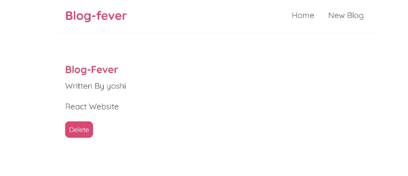
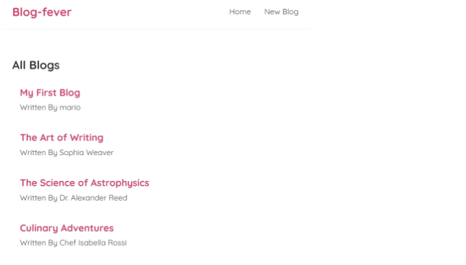
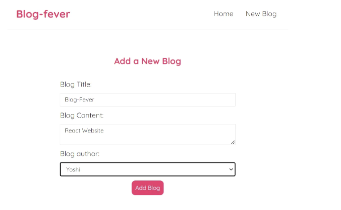

# 소개

React는 상호 작용형 웹사이트와 사용자 인터페이스를 만드는 데 사용되는 JavaScript 라이브러리로, 단일 페이지 애플리케이션(SPAs)을 개발하기 쉽게 만들어줍니다.

SPA에서는 서버가 브라우저로 단일 HTML 페이지를 보내고, React가 브라우저에서 전체 웹사이트를 관리합니다.

전통적인 웹사이트에서는 각 링크 클릭이 새로운 HTML 페이지에 대한 서버 요청을 트리거합니다. 그러나 React를 사용하면 브라우저가 서버로부터 새로운 페이지를 가져올 필요가 없습니다.

<!-- ui-log 수평형 -->
<ins class="adsbygoogle"
  style="display:block"
  data-ad-client="ca-pub-4877378276818686"
  data-ad-slot="9743150776"
  data-ad-format="auto"
  data-full-width-responsive="true"></ins>
<component is="script">
(adsbygoogle = window.adsbygoogle || []).push({});
</component>

React는 URL 경로에 따라 브라우저에서 콘텐츠를 동적으로 업데이트합니다. 결과적으로 페이지 로드가 빨라지고 사용자 경험이 원활해집니다.

현대적인 React 개발에서는 상태 관리와 사이드 이펙트 처리를 위해 useState와 useEffect와 같은 내장 훅을 사용합니다.

클래스 컴포넌트 대신 함수형 컴포넌트가 선호되며, 상태와 사이드 이펙트 관리에서 간단하고 효율적입니다. 이러한 관행은 더 깨끗하고 유지보수가 쉬운 React 코드로 이어집니다.

# 프로젝트 개요

<!-- ui-log 수평형 -->
<ins class="adsbygoogle"
  style="display:block"
  data-ad-client="ca-pub-4877378276818686"
  data-ad-slot="9743150776"
  data-ad-format="auto"
  data-full-width-responsive="true"></ins>
<component is="script">
(adsbygoogle = window.adsbygoogle || []).push({});
</component>

**BlogFever Website**는 React를 사용하여 개발된 반응형 웹 애플리케이션입니다.

주요 기능으로는 글 목록, 상세보기 및 원활한 글 관리가 포함되어 있습니다. 기능: 사용자들이 사용하기 편리한 인터페이스로 글을 나열, 삭제 및 추가할 수 있습니다.

상호작용적이고 동적인 사용자 경험을 위해 React 라우터, 데이터 가져오기 및 후크 (useState, useEffect, 사용자 정의 후크)와 같은 React 개념이 구현되어 있습니다.

이 웹사이트는 오류 처리, 로딩 상태 및 효율적인 라우팅을 포함하여 모든 기기에 반응하도록 설계되었습니다. 이 프로젝트는 React 개발 및 현대적인 웹 애플리케이션 관행에 대한 능력을 증명합니다.

<!-- ui-log 수평형 -->
<ins class="adsbygoogle"
  style="display:block"
  data-ad-client="ca-pub-4877378276818686"
  data-ad-slot="9743150776"
  data-ad-format="auto"
  data-full-width-responsive="true"></ins>
<component is="script">
(adsbygoogle = window.adsbygoogle || []).push({});
</component>

블로그열열 프로젝트를 여기에서 살펴보고 React의 세계로 함께 들어가 봐요!



## 기술 스택

- 사용된 기술: React, React Router, CSS, JSON Server(가짜 REST API용)
- 프로그래밍 언어: JavaScript, JSX
- 프레임워크와 라이브러리: Create React App (CRA), react-router-dom, Firebase

<!-- ui-log 수평형 -->
<ins class="adsbygoogle"
  style="display:block"
  data-ad-client="ca-pub-4877378276818686"
  data-ad-slot="9743150776"
  data-ad-format="auto"
  data-full-width-responsive="true"></ins>
<component is="script">
(adsbygoogle = window.adsbygoogle || []).push({});
</component>

# 구현 세부 정보

# 1. React로 시작하기

React로 시작하려면, 내 의견으로는 Create React App이라는 도구를 사용하는 것이 가장 쉬운 방법 중 하나입니다. 이 도구는 Babel과 Webpack을 포함한 모든 필수 설정 및 구성이 완료된 React 프로젝트를 생성하는 명령줄 도구입니다.

이 도구들은 React 코드와 JSX를 프로덕션에 준비된 JavaScript로 컴파일하는 데 필수적입니다.

<!-- ui-log 수평형 -->
<ins class="adsbygoogle"
  style="display:block"
  data-ad-client="ca-pub-4877378276818686"
  data-ad-slot="9743150776"
  data-ad-format="auto"
  data-full-width-responsive="true"></ins>
<component is="script">
(adsbygoogle = window.adsbygoogle || []).push({});
</component>

Create React App을 사용하지 않고 수동으로 모든 구성을 설정하는 것은 더 복잡한 작업일 것입니다.

Create React App을 사용하면 우리가 직접 구성의 복잡성을 다루지 않고 빠르게 스타터 프로젝트를 만들 수 있습니다.

# 2. 우리 앱의 구성 요소

React에서 컴포넌트는 사용자 인터페이스의 구성 요소입니다. 각 컴포넌트는 자체 로직과 표현을 캡슐화하여 모듈식이고 효율적인 개발 프로세스를 촉진합니다.

<!-- ui-log 수평형 -->
<ins class="adsbygoogle"
  style="display:block"
  data-ad-client="ca-pub-4877378276818686"
  data-ad-slot="9743150776"
  data-ad-format="auto"
  data-full-width-responsive="true"></ins>
<component is="script">
(adsbygoogle = window.adsbygoogle || []).push({});
</component>

React의 이 구성 요소 기반 아키텍처는 개발자들이 재사용 가능한 구성 요소를 조합하여 동적이고 상호작용하는 사용자 인터페이스를 생성할 수 있도록 해주는 React의 주요 기능입니다.

React 애플리케이션은 구성 요소 트리를 형성하는 구성 요소의 계층 구조로 구성됩니다.

- app.js는 루트 구성 요소로 작용하여 구성 요소 트리를 시작합니다.
- 새로운 구성 요소 navbar.js는 내비게이션 바의 구조와 동작을 처리하기 위해 소개됩니다. 이 구성 요소는 app.js에 가져와서 앱 구성 요소의 JSX 내에 통합됩니다.
- 비슷하게, home.js 구성 요소는 홈 페이지의 내용과 구조를 나타냅니다. 이것은 app.js에 가져와서 앱 구성 요소의 JSX 내에 중첩됩니다.

# 3. React State 및 useState Hook 이해하기

<!-- ui-log 수평형 -->
<ins class="adsbygoogle"
  style="display:block"
  data-ad-client="ca-pub-4877378276818686"
  data-ad-slot="9743150776"
  data-ad-format="auto"
  data-full-width-responsive="true"></ins>
<component is="script">
(adsbygoogle = window.adsbygoogle || []).push({});
</component>

상태는 특정 시점에 구성 요소에서 사용되는 데이터를 의미합니다.

useState 훅은 함수형 구성 요소에서 상태를 관리하고 업데이트하는 데 사용됩니다. React에서 제공하는 함수로 반응적인 상태 변수를 생성하고 값을 변경하는 방법입니다.

사용 예시:

```js
const [name, setName] = useState("마리오");
```

<!-- ui-log 수평형 -->
<ins class="adsbygoogle"
  style="display:block"
  data-ad-client="ca-pub-4877378276818686"
  data-ad-slot="9743150776"
  data-ad-format="auto"
  data-full-width-responsive="true"></ins>
<component is="script">
(adsbygoogle = window.adsbygoogle || []).push({});
</component>

위의 코드는 초기 값으로 "Mario"를 가진 반응성 상태 변수인 name을 생성합니다.

- 이 훅은 두 가지를 반환합니다. 초기 값(배열, 불리언, 객체, 숫자 중 하나)과 해당 값을 변경하는 함수이며, 우리는 이 두 가지 값을 추출하기 위해 배열 구조 분해를 사용합니다.
- 이 경우 초기 값은 문자열(name)이고 해당 값을 업데이트하는 함수(setName)입니다. 예를 들어 setName("Luigi")를 사용하면 name 상태를 "Luigi"로 변경할 수 있습니다.
- 상태 변수(name)는 JSX 템플릿에서 사용되며, 상태의 변경은 컴포넌트의 다시 렌더링을 유발하여 템플릿을 업데이트합니다.

# 4. 블로그를 위한 상태 생성 및 Props 사용

간단한 블로그를 구축하기 위해 useState 훅을 사용하여 블로그의 배열을 나타내는 상태를 생성합니다.

<!-- ui-log 수평형 -->
<ins class="adsbygoogle"
  style="display:block"
  data-ad-client="ca-pub-4877378276818686"
  data-ad-slot="9743150776"
  data-ad-format="auto"
  data-full-width-responsive="true"></ins>
<component is="script">
(adsbygoogle = window.adsbygoogle || []).push({});
</component>

블로그 상태는 제목, 내용, 작성자 및 ID와 같은 속성을 포함하는 블로그 객체들의 배열로 초기화됩니다.

템플릿에서 블로그 목록 출력:

- JSX 템플릿 내부에서 map 메서드를 사용하여 블로그 배열을 반복합니다.
- 각 블로그 항목마다 JSX 템플릿이 반환되며, 이 템플릿에는 제목을 위한 h2와 작성자를 위한 p가 포함됩니다.
- 각 루트 요소에 key 속성이 추가되어 React가 DOM에서 각 항목을 추적할 수 있도록 합니다.

```js
<div className="blog-list">
{blogs.map(blog => (
<div className="blog-preview" key={blog.id}>
<h2>{blog.title}</h2>
<p>작성자: {blog.author}</p>
</div>
))}
</div>
```

<!-- ui-log 수평형 -->
<ins class="adsbygoogle"
  style="display:block"
  data-ad-client="ca-pub-4877378276818686"
  data-ad-slot="9743150776"
  data-ad-format="auto"
  data-full-width-responsive="true"></ins>
<component is="script">
(adsbygoogle = window.adsbygoogle || []).push({});
</component>



실제 블로그 웹 사이트에서는 블로그 목록이 유사한 로직으로 표시되어야 하는 여러 위치가 있을 수 있습니다.

따라서 서로 다른 컴포넌트 전체에서 코드를 중복하는 대신 재사용 가능한 컴포넌트를 만드는 것이 목표입니다.

우리는 재사용 가능한 컴포넌트를 보관할 BlogList 컴포넌트를 만들었습니다.

<!-- ui-log 수평형 -->
<ins class="adsbygoogle"
  style="display:block"
  data-ad-client="ca-pub-4877378276818686"
  data-ad-slot="9743150776"
  data-ad-format="auto"
  data-full-width-responsive="true"></ins>
<component is="script">
(adsbygoogle = window.adsbygoogle || []).push({});
</component>

BlogList 컴포넌트에서 데이터를 처리하는 방법은 다음과 같습니다: 새로운 컴포넌트에서 데이터를 다시 선언하거나 props를 통해 데이터를 전달할 수 있습니다.

- Props는 한 컴포넌트에서 다른 컴포넌트로 데이터를 전달하는 방법을 제공합니다.
- Props를 사용하는 것이 재사용성을 높이고 부모 컴포넌트에서 데이터를 계속 사용할 수 있는 더 좋은 방법입니다.

## useEffect 소개:

useEffect는 React에서 컴포넌트가 렌더링될 때마다 코드를 실행하는 데 사용되는 훅입니다.

<!-- ui-log 수평형 -->
<ins class="adsbygoogle"
  style="display:block"
  data-ad-client="ca-pub-4877378276818686"
  data-ad-slot="9743150776"
  data-ad-format="auto"
  data-full-width-responsive="true"></ins>
<component is="script">
(adsbygoogle = window.adsbygoogle || []).push({});
</component>

컴포넌트가 로드될 때 최초로 실행되고, 상태 변경에 따라 다시 렌더링이 발생할 때마다 다시 실행됩니다.

useEffect는 주로 데이터를 가져오거나 인증 서비스와 상호 작용하는 등 부수 효과를 처리할 때 사용됩니다. 매 렌더링마다 실행할 함수를 인수로 취합니다.

useEffect 훅을 사용하여 데이터를 가져오는 이유는 초기 렌더링 후에 함수를 실행하고, 컴포넌트가 처음로드될 때 데이터를 가져와야 하는 경우가 많기 때문입니다.

의존성이 비어있는 배열 덕분에 한 번만 실행됩니다.

<!-- ui-log 수평형 -->
<ins class="adsbygoogle"
  style="display:block"
  data-ad-client="ca-pub-4877378276818686"
  data-ad-slot="9743150776"
  data-ad-format="auto"
  data-full-width-responsive="true"></ins>
<component is="script">
(adsbygoogle = window.adsbygoogle || []).push({});
</component>

의존성:
- 특정 상태 변화를 기반으로 useEffect 함수를 실행하려면 해당 상태를 의존성 배열에 포함할 수 있습니다.
- 예를 들어, 새로운 상태 변수 이름이 소개되었고, useEffect는 이름 상태가 변경될 때 실행되도록 설정되었습니다.
- 의존성이 감시되며, 그중 어떤 것이라도 변경되면 useEffect 함수가 실행됩니다.

```js
useEffect(() => {
    // 첫 번째 렌더링 및 'name'이 변경될 때 실행할 코드
    console.log(name);
}, [name]);
```

# 6. 로컬 데이터베이스 설정

<!-- ui-log 수평형 -->
<ins class="adsbygoogle"
  style="display:block"
  data-ad-client="ca-pub-4877378276818686"
  data-ad-slot="9743150776"
  data-ad-format="auto"
  data-full-width-responsive="true"></ins>
<component is="script">
(adsbygoogle = window.adsbygoogle || []).push({});
</component>

로컬 데이터베이스는 JSON 파일을 사용하여 생성됩니다. JSON Server는 JSON 파일을 이용해 가짜 REST API를 만들 수 있는 패키지입니다.

이를 통해 데이터베이스와 REST API를 처음부터 설정할 필요가 없어집니다.

JSON 데이터베이스 생성 방법:

- 프로젝트의 루트 디렉토리에 있는 data 폴더 내에 db.json이라는 JSON 파일을 생성합니다.
- JSON 파일에는 "blogs"라는 리소스가 포함되어 있으며, 이는 블로그 객체의 배열로 구성되어 있습니다.

<!-- ui-log 수평형 -->
<ins class="adsbygoogle"
  style="display:block"
  data-ad-client="ca-pub-4877378276818686"
  data-ad-slot="9743150776"
  data-ad-format="auto"
  data-full-width-responsive="true"></ins>
<component is="script">
(adsbygoogle = window.adsbygoogle || []).push({});
</component>

JSON Server를 실행하는 방법:

- JSON Server는 db.json 파일을 감시하고 API 엔드포인트를 생성하는 데 사용됩니다.
- 강사는 npx json-server --watch data/db.json --port 8000 명령어를 사용하여 JSON Server를 실행합니다.
- 먼저 로컬 시스템에서 포트 8000에 데이터베이스를 생성합니다.

JSON Server는 JSON 파일의 리소스를 기반으로 자동으로 엔드포인트를 생성합니다.

# 7. 로컬 데이터베이스에서 데이터를 가져오는 방법

<!-- ui-log 수평형 -->
<ins class="adsbygoogle"
  style="display:block"
  data-ad-client="ca-pub-4877378276818686"
  data-ad-slot="9743150776"
  data-ad-format="auto"
  data-full-width-responsive="true"></ins>
<component is="script">
(adsbygoogle = window.adsbygoogle || []).push({});
</component>

JSON 서버가 작동 중이며 localhost:8000/blogs에서 다양한 엔드포인트에 접근할 수 있습니다.

기존 상태가 지워지고, 블로그 상태가 null로 초기화됩니다.

데이터를 가져오기 위해 fetch API 요청이 localhost:8000/blogs로 전송되어 약속을 반환합니다. 그리고 then 메서드는 약속의 해결을 처리하여 응답 객체를 수신합니다.

데이터를 추출하기 위해 response.json()이 사용됩니다. 이 단계는 JSON 데이터를 JavaScript 객체로 변환합니다. 획득한 데이터는 콘솔에 로그를 남기고 setBlog를 사용하여 블로그 상태를 업데이트하는 데 사용됩니다.

<!-- ui-log 수평형 -->
<ins class="adsbygoogle"
  style="display:block"
  data-ad-client="ca-pub-4877378276818686"
  data-ad-slot="9743150776"
  data-ad-format="auto"
  data-full-width-responsive="true"></ins>
<component is="script">
(adsbygoogle = window.adsbygoogle || []).push({});
</component>

# 8. 오류 처리

Home 컴포넌트에서 fetch 요청을 할 때 발생하는 오류 처리에 중점을 두고 있습니다. 오류는 서버 응답이나 연결 문제로 발생할 수 있습니다.

fetch 요청에서 then 블록 뒤에 catch 블록이 추가됩니다. 이는 네트워크 오류를 잡아 콘솔에 로그를 남깁니다.

예시:

<!-- ui-log 수평형 -->
<ins class="adsbygoogle"
  style="display:block"
  data-ad-client="ca-pub-4877378276818686"
  data-ad-slot="9743150776"
  data-ad-format="auto"
  data-full-width-responsive="true"></ins>
<component is="script">
(adsbygoogle = window.adsbygoogle || []).push({});
</component>

```js
javascript복사 코드
.catch((err) => {
    console.log(err.message);
});
```

현재 catch 블록은 네트워크 오류만 캐치합니다. 다른 종류의 오류를 처리하기 위해 추가적인 체크를 도입했습니다.

응답 객체의 ok 속성을 확인합니다. ok가 false인 경우 사용자 정의 오류를 throw합니다.

예시:

<!-- ui-log 수평형 -->
<ins class="adsbygoogle"
  style="display:block"
  data-ad-client="ca-pub-4877378276818686"
  data-ad-slot="9743150776"
  data-ad-format="auto"
  data-full-width-responsive="true"></ins>
<component is="script">
(adsbygoogle = window.adsbygoogle || []).push({});
</component>

```js
javascriptCopy code
if (!response.ok) {
    throw new Error("해당 리소스의 데이터를 가져올 수 없습니다");
}
```

# 9. 사용자 지정 훅이 생성되었습니다

useFetch라는 사용자 지정 훅은 데이터 가져오기 로직을 처리하는 데 설계되었습니다. 코드를 더 모듈식으로 만들어서 다양한 구성 요소에서 재사용할 수 있도록 하는 것이 목표입니다.

src 폴더 안에 useFetch.js라는 새 파일이 있습니다. 이 파일에는 사용자 지정 훅의 로직이 포함될 것입니다.
```

<!-- ui-log 수평형 -->
<ins class="adsbygoogle"
  style="display:block"
  data-ad-client="ca-pub-4877378276818686"
  data-ad-slot="9743150776"
  data-ad-format="auto"
  data-full-width-responsive="true"></ins>
<component is="script">
(adsbygoogle = window.adsbygoogle || []).push({});
</component>

React에서 사용자 정의 훅은 일반적으로 "use"로 시작합니다.

- URL(엔드포인트)은 이제 useFetch 함수에 매개변수로 전달됩니다. 이로써 훅이 유연해지며 다양한 엔드포인트에서 다양한 유형의 데이터를 가져올 수 있습니다.
- useFetch 함수는 데이터, 로딩 상태, 그리고 잠재적인 오류를 나타내는 세 가지 속성을 포함한 객체를 반환합니다.
- 데이터를 가져와야 하는 구성 요소에서 useFetch 훅을 가져와 해당 반환 값(data, isPending, error)을 분해합니다.

# 10. React Router를 사용한 동적 라우팅

현재 응용 프로그램은 하나의 페이지만 가지고 있습니다. 대부분의 웹 사이트는 여러 페이지를 가지고 있기 때문에 새로 고치지 않고 페이지 간 이동을 처리하기 위해 라우팅이 필요합니다.

<!-- ui-log 수평형 -->
<ins class="adsbygoogle"
  style="display:block"
  data-ad-client="ca-pub-4877378276818686"
  data-ad-slot="9743150776"
  data-ad-format="auto"
  data-full-width-responsive="true"></ins>
<component is="script">
(adsbygoogle = window.adsbygoogle || []).push({});
</component>

React Router는 인기있는 라이브러리로, React 앱에서 경로를 원활하게 관리합니다.

서버에서 새 페이지를 가져오는 전통적인 사이트와는 달리, React 앱은 내부적으로 라우팅을 처리합니다.

React를 사용하면 초기 HTML 페이지가 비어 있으며, URL 변경에 따라 내용이 동적으로 주입됩니다.

React Router 설정하기:

<!-- ui-log 수평형 -->
<ins class="adsbygoogle"
  style="display:block"
  data-ad-client="ca-pub-4877378276818686"
  data-ad-slot="9743150776"
  data-ad-format="auto"
  data-full-width-responsive="true"></ins>
<component is="script">
(adsbygoogle = window.adsbygoogle || []).push({});
</component>

```js
npm install react-router-dom
```

- react-router-dom에서 BrowserRouter, Route, Switch와 같은 필수 컴포넌트를 import하세요.
- React Router 버전 5를 사용 중입니다 (버전 6 베타판 언급).

라우팅 구현하기:

- 라우팅을 가능하게 하기 위해 앱을 BrowserRouter로 감싸세요.
- 페이지 콘텐츠를 넣을 위치를 결정하세요. 종종 content와 같은 클래스를 가진 div 안에 넣습니다.
- Switch를 사용하여 한 번에 한 경로만 표시되도록 하세요.```

<!-- ui-log 수평형 -->
<ins class="adsbygoogle"
  style="display:block"
  data-ad-client="ca-pub-4877378276818686"
  data-ad-slot="9743150776"
  data-ad-format="auto"
  data-full-width-responsive="true"></ins>
<component is="script">
(adsbygoogle = window.adsbygoogle || []).push({});
</component>

라우트 생성하기:

- Route 컴포넌트를 사용하여 라우트를 정의합니다.
- 각 라우트는 표시할 경로(path)와 해당 컴포넌트를 갖습니다.

```js
<Route path="/" component={Home} />
```

- 여기서는 홈페이지를 위한 라우트를 지정하여 URL이 "/"와 일치할 때 Home 컴포넌트를 표시합니다.

<!-- ui-log 수평형 -->
<ins class="adsbygoogle"
  style="display:block"
  data-ad-client="ca-pub-4877378276818686"
  data-ad-slot="9743150776"
  data-ad-format="auto"
  data-full-width-responsive="true"></ins>
<component is="script">
(adsbygoogle = window.adsbygoogle || []).push({});
</component>

콘텐츠를 동적으로 렌더링하기:
  
- 라우트 매개변수를 사용하여 리액트 애플리케이션에서 동적 라우팅 구현.
- 라우트 매개변수를 사용하면 URL의 일부를 변경할 수 있어 동적 경로의 일부에 따라 동일한 구성요소를 렌더링하면서 다른 데이터를 표시할 수 있습니다.

예시: 블로그 세부 사항 페이지를 생각해보세요. 여기서 경로는 /blogs/123과 같이 표시됩니다. 여기서 123은 블로그의 ID입니다. ID가 123, 456 또는 다른 어떤 숫자든 관계없이 동일한 구성요소가 렌더링되어 지정된 블로그의 세부 정보가 표시되어야 합니다.

구현 단계:

<!-- ui-log 수평형 -->
<ins class="adsbygoogle"
  style="display:block"
  data-ad-client="ca-pub-4877378276818686"
  data-ad-slot="9743150776"
  data-ad-format="auto"
  data-full-width-responsive="true"></ins>
<component is="script">
(adsbygoogle = window.adsbygoogle || []).push({});
</component>

- 개별 블로그 세부 정보를 표시하기 위해 동적 라우팅을 구현하려면 먼저 BlogDetails.js라는 새 컴포넌트를 만들어야 합니다.
- 이 컴포넌트는 하나의 블로그 게시물 세부 정보를 렌더링하고 react-router-dom에서 제공하는 useParams 훅을 활용하여 라우트 매개변수(예: 블로그 게시물의 ID)를 추출할 것입니다.
- 그러고나서 주요 라우팅 파일인 App.js와 같은 파일에서 블로그 세부 정보를 위한 경로를 정의하고, 매개변수 이름 앞에 콜론을 붙여 동적 매개변수를 포함시킵니다(예: /:id). 이는 해당 경로가 ID 매개변수를 기대한다는 것을 나타냅니다.
- 블로그 목록을 표시하는 컴포넌트(e.g., BlogList) 내에서 react-router-dom의 Link 컴포넌트를 사용하여 개별 블로그 세부 정보로의 링크를 만들어 URL 경로에 블로그 게시물의 ID와 같은 동적 부분을 포함시킵니다.
- BlogDetails.js 컴포넌트 내에서 useParams 훅을 활용하여 라우트에서 제공된 동적 매개변수에 액세스합니다. 일반적으로 블로그 게시물의 ID인 이 매개변수를 사용하여 데이터 소스에서 특정 블로그 데이터를 가져오거나 해당 특정 블로그 게시물에 고유한 작업을 수행할 수 있습니다.

이러한 단계를 따라서 React 애플리케이션에서 동적 라우팅을 구현할 수 있으며 사용자가 개별 블로그 게시물로 이동하고 세부 정보를 원활하게 확인할 수 있습니다.

# 11. 새 블로그 만들기

새 블로그를 만들기 위해 React 애플리케이션에서 양식을 구현하여 사용자가 새 블로그에 대한 데이터를 입력할 수 있도록 합니다.

<!-- ui-log 수평형 -->
<ins class="adsbygoogle"
  style="display:block"
  data-ad-client="ca-pub-4877378276818686"
  data-ad-slot="9743150776"
  data-ad-format="auto"
  data-full-width-responsive="true"></ins>
<component is="script">
(adsbygoogle = window.adsbygoogle || []).push({});
</component>

Create 컴포넌트에서 블로그 세부 정보를 수집하기 위한 폼이 생성되었습니다. 폼에는 블로그 제목, 본문 내용 (textarea를 사용), 그리고 작성자 (선택 필드 사용)를 위한 입력 필드가 포함되어 있습니다.

React 상태를 사용하여 폼 요소의 값들을 관리하기 위해 제어된 입력이 사용되었습니다. 각 입력 필드마다 해당하는 상태가 생성되었습니다.

초기 상태 값이 설정되었습니다 (예: 텍스트 입력 필드에는 빈 문자열, 작성자 값에는 초기 값).

각 입력의 값 속성은 해당 상태 변수로 동적으로 설정되었습니다. 이렇게 함으로써 입력 필드가 항상 현재 상태를 반영하도록 보장됩니다. 입력 값의 변경 사항을 처리하기 위해 onChange 이벤트가 사용되었습니다.

<!-- ui-log 수평형 -->
<ins class="adsbygoogle"
  style="display:block"
  data-ad-client="ca-pub-4877378276818686"
  data-ad-slot="9743150776"
  data-ad-format="auto"
  data-full-width-responsive="true"></ins>
<component is="script">
(adsbygoogle = window.adsbygoogle || []).push({});
</component>

폼 안에 버튼을 누르면 폼 자체에서 제출 이벤트가 트리거됩니다. submit 이벤트를 처리하기 위해 handleSubmit이라는 함수가 생성됩니다.



handleSubmit 함수 내에서 블로그 객체가 생성되며, 사용자가 입력한 값을 포함합니다. 블로그 객체에는 제목, 본문, 작성자 등의 속성이 포함됩니다.

이전 폼 제출 기능을 확장하여 JSON Server에 POST 요청을 보내도록 기능을 추가합니다. useFetch 후크 대신, 이 튜토리얼에서는 handleSubmit 함수 내부에서 POST 요청을 직접 만드는 방식을 선택했습니다.

<!-- ui-log 수평형 -->
<ins class="adsbygoogle"
  style="display:block"
  data-ad-client="ca-pub-4877378276818686"
  data-ad-slot="9743150776"
  data-ad-format="auto"
  data-full-width-responsive="true"></ins>
<component is="script">
(adsbygoogle = window.adsbygoogle || []).push({});
</component>

표 태그를 마크다운 형식으로 변경해주세요.

```markdown
| 순번 | 이름 | 나이 |
|------|------|------|
| 1    | 제인 | 25   |
| 2    | 마크 | 30   |
| 3    | 리사 | 28   |
```

<!-- ui-log 수평형 -->
<ins class="adsbygoogle"
  style="display:block"
  data-ad-client="ca-pub-4877378276818686"
  data-ad-slot="9743150776"
  data-ad-format="auto"
  data-full-width-responsive="true"></ins>
<component is="script">
(adsbygoogle = window.adsbygoogle || []).push({});
</component>

블로그 등록 양식을 사용하여 새 블로그를 성공적으로 추가한 사용자는 홈페이지로 리디렉션됩니다.

이 기능은 React Router의 useHistory 훅을 사용하여 구현됩니다. 이를 통해 애플리케이션은 프로그래밍 방식으로 히스토리를 통해 탐색할 수 있습니다.

react-router-dom 패키지에서 useHistory 훅을 가져와야 합니다. 이 훅은 go, goBack, goForward 및 push와 같이 애플리케이션 히스토리를 통해 탐색할 수 있는 메서드를 제공합니다.

useHistory 훅을 호출하여 히스토리 객체를 생성한 후, 리디렉션을 위해 push를 사용할 것입니다: 원하는 경로(이 경우 홈페이지 경로인 '/')를 push 메서드에 전달하세요.

<!-- ui-log 수평형 -->
<ins class="adsbygoogle"
  style="display:block"
  data-ad-client="ca-pub-4877378276818686"
  data-ad-slot="9743150776"
  data-ad-format="auto"
  data-full-width-responsive="true"></ins>
<component is="script">
(adsbygoogle = window.adsbygoogle || []).push({});
</component>

```js
const history = useHistory();
history.push('/');
```

# 13. 삭제 기능 추가하기

블로그를 삭제하는 "삭제" 버튼을 추가하는 것은 서버에 DELETE 요청을 보내는 것을 포함합니다. 성공적으로 삭제되면 사용자가 홈 페이지로 리디렉트됩니다.

예시:

<!-- ui-log 수평형 -->
<ins class="adsbygoogle"
  style="display:block"
  data-ad-client="ca-pub-4877378276818686"
  data-ad-slot="9743150776"
  data-ad-format="auto"
  data-full-width-responsive="true"></ins>
<component is="script">
(adsbygoogle = window.adsbygoogle || []).push({});
</component>

이 함수 내부에서 적절한 엔드포인트(홈 컴포넌트에서 얻음)로 DELETE 메서드를 사용하여 fetch 요청을 만드세요.

엔드포인트에서 블로그를 삭제할 때 blog.id를 사용하세요.

```js
<button onClick={handleClick}>삭제</button>
```

```js
const handleClick = () => {
    fetch(`http://localhost:8000/blogs/${blog.id}`, {
        method: 'DELETE',
    })
    .then(() => {
        // 삭제가 성공하면 사용자를 홈 페이지로 리디렉션합니다.
        history.push('/');
    });
};
```

<!-- ui-log 수평형 -->
<ins class="adsbygoogle"
  style="display:block"
  data-ad-client="ca-pub-4877378276818686"
  data-ad-slot="9743150776"
  data-ad-format="auto"
  data-full-width-responsive="true"></ins>
<component is="script">
(adsbygoogle = window.adsbygoogle || []).push({});
</component>

# 14. 404 페이지 처리

존재하지 않는 경로를 처리하기 위해 404 페이지가 구현되어야 합니다. 이는 NotFound 컴포넌트를 생성하고 경로 구성의 끝에 catch-all route를 설정하는 것을 포함합니다. 예시:

```js
<Route path="*" component={NotFound} />
```

# 15. 실시간 Firebase 데이터베이스 통합

<!-- ui-log 수평형 -->
<ins class="adsbygoogle"
  style="display:block"
  data-ad-client="ca-pub-4877378276818686"
  data-ad-slot="9743150776"
  data-ad-format="auto"
  data-full-width-responsive="true"></ins>
<component is="script">
(adsbygoogle = window.adsbygoogle || []).push({});
</component>

저희는 확장성과 효율성을 위해 실시간 Firebase 데이터베이스를 만들었어요.

먼저 React 프로젝트에 Firebase를 설치해야 해요. 터미널에서 다음 명령어를 실행하여 간단히 npm을 사용해서 할 수 있어요:

```js
npm install firebase
```

이 명령은 Firebase JavaScript SDK를 설치하는데요, 이 SDK를 사용해서 프로젝트에서 Firebase 서비스와 상호 작용할 거예요.

<!-- ui-log 수평형 -->
<ins class="adsbygoogle"
  style="display:block"
  data-ad-client="ca-pub-4877378276818686"
  data-ad-slot="9743150776"
  data-ad-format="auto"
  data-full-width-responsive="true"></ins>
<component is="script">
(adsbygoogle = window.adsbygoogle || []).push({});
</component>

다음으로 Firebase 프로젝트를 만들어야 합니다. Firebase 콘솔로 이동하여 "프로젝트 추가" 버튼을 클릭하여 새 프로젝트를 만드세요. 화면 안내에 따라 프로젝트를 설정하세요.

프로젝트를 생성하면 Firebase 콘솔에서 "실시간 데이터베이스" 섹션으로 이동하세요. "데이터베이스 만들기" 버튼을 클릭하고 데이터베이스의 위치를 선택하세요.

데이터베이스를 설정한 후, Firebase는 React 앱을 Firebase 프로젝트에 연결하기 위해 필요한 구성을 제공할 것입니다. 이 구성에는 API 키, 인증 토큰 및 기타 세부 정보가 포함됩니다.

React 프로젝트에서 src 디렉토리에 firebase.js라는 새 파일을 만드세요. 이 파일에는 Firebase 구성 및 초기화 코드가 포함됩니다.

<!-- ui-log 수평형 -->
<ins class="adsbygoogle"
  style="display:block"
  data-ad-client="ca-pub-4877378276818686"
  data-ad-slot="9743150776"
  data-ad-format="auto"
  data-full-width-responsive="true"></ins>
<component is="script">
(adsbygoogle = window.adsbygoogle || []).push({});
</component>

```js
// firebase.js
```

```js
import firebase from 'firebase/app';
import 'firebase/database';
const firebaseConfig = {
  apiKey: "파이어베이스에서 제공하는 실제 API 키",
  authDomain: "파이어베이스에서 제공하는 실제 인증 도메인",
  databaseURL: "파이어베이스에서 제공하는 실제 데이터베이스 URL",
  projectId: "파이어베이스에서 제공하는 실제 프로젝트 ID",
  storageBucket: "파이어베이스에서 제공하는 실제 스토리지 버킷",
  messagingSenderId: "파이어베이스에서 제공하는 실제 메시징 발신자 ID",
  appId: "파이어베이스에서 제공하는 실제 앱 ID"
};
firebase.initializeApp(firebaseConfig);
export default firebase;
```

파이어베이스에서 제공하는 실제 구성으로 firebaseConfig 안의 플레이스홀더 값을 변경해주세요.

# 16. Environment Variables 사용하기
```

<!-- ui-log 수평형 -->
<ins class="adsbygoogle"
  style="display:block"
  data-ad-client="ca-pub-4877378276818686"
  data-ad-slot="9743150776"
  data-ad-format="auto"
  data-full-width-responsive="true"></ins>
<component is="script">
(adsbygoogle = window.adsbygoogle || []).push({});
</component>

보안상의 이유로 API 키 및 데이터베이스 URL과 같은 민감한 정보는 환경 변수에 저장하는 것이 가장 좋습니다.

프로젝트의 루트 디렉토리에 .env 파일을 생성하고 Firebase 구성을 환경 변수로 추가하세요.

```js
REACT_APP_FIREBASE_API_KEY=YOUR_API_KEY
REACT_APP_FIREBASE_AUTH_DOMAIN=YOUR_AUTH_DOMAIN
REACT_APP_FIREBASE_DATABASE_URL=YOUR_DATABASE_URL
REACT_APP_FIREBASE_PROJECT_ID=YOUR_PROJECT_ID
REACT_APP_FIREBASE_STORAGE_BUCKET=YOUR_STORAGE_BUCKET
REACT_APP_FIREBASE_MESSAGING_SENDER_ID=YOUR_MESSAGING_SENDER_ID
REACT_APP_FIREBASE_APP_ID=YOUR_APP_ID
```

Firebase.js 파일에서는 이러한 환경 변수에 process.env를 사용하여 액세스할 수 있습니다. 구성을 직접 하드코딩하는 대신 환경 변수를 사용하도록 파일을 수정하세요.

<!-- ui-log 수평형 -->
<ins class="adsbygoogle"
  style="display:block"
  data-ad-client="ca-pub-4877378276818686"
  data-ad-slot="9743150776"
  data-ad-format="auto"
  data-full-width-responsive="true"></ins>
<component is="script">
(adsbygoogle = window.adsbygoogle || []).push({});
</component>

```js
// firebase.js
```

```js
import firebase from 'firebase/app';
import 'firebase/database';
const firebaseConfig = {
  apiKey: process.env.REACT_APP_FIREBASE_API_KEY,
  authDomain: process.env.REACT_APP_FIREBASE_AUTH_DOMAIN,
  databaseURL: process.env.REACT_APP_FIREBASE_DATABASE_URL,
  projectId: process.env.REACT_APP_FIREBASE_PROJECT_ID,
  storageBucket: process.env.REACT_APP_FIREBASE_STORAGE_BUCKET,
  messagingSenderId: process.env.REACT_APP_FIREBASE_MESSAGING_SENDER_ID,
  appId: process.env.REACT_APP_FIREBASE_APP_ID
};
firebase.initializeApp(firebaseConfig);
export default firebase;
```

이제 React 프로젝트에서 Firebase를 설정하고 환경 변수를 구성했으므로 어플리케이션에서 실시간 데이터베이스를 사용할 수 있습니다. 구성 요소에서 데이터베이스에서 읽고 쓰기위해 Firebase SDK 메서드를 사용할 수 있습니다.

이러한 단계를 따라서 Firebase 실시간 데이터베이스를 React 프로젝트에 성공적으로 통합하여 사용성과 효율성을 향상시켰습니다.

<!-- ui-log 수평형 -->
<ins class="adsbygoogle"
  style="display:block"
  data-ad-client="ca-pub-4877378276818686"
  data-ad-slot="9743150776"
  data-ad-format="auto"
  data-full-width-responsive="true"></ins>
<component is="script">
(adsbygoogle = window.adsbygoogle || []).push({});
</component>

# 결론

React를 사용하여 블로그를 구축하는 것은 주요 개념, 도구 및 최선의 실행 방법을 결합한 작업입니다.

훅을 사용하여 상태를 관리하고 동적 라우팅을 구현하며 양식 제출을 처리하는 것 등, React는 현대적인 웹 애플리케이션을 만들기 위한 강력한 프레임워크를 제공합니다.

본 단계별 가이드를 따라가면, 개발자들은 React의 능력에 대한 깊은 이해를 얻고 매력적이고 반응형 사용자 인터페이스를 만들 수 있습니다.

<!-- ui-log 수평형 -->
<ins class="adsbygoogle"
  style="display:block"
  data-ad-client="ca-pub-4877378276818686"
  data-ad-slot="9743150776"
  data-ad-format="auto"
  data-full-width-responsive="true"></ins>
<component is="script">
(adsbygoogle = window.adsbygoogle || []).push({});
</component>

이 글에서 논의된 개념을 탐색하고 BlogFever에서 실제 경험을 해보기 위해 이 프로젝트를 확인해 보세요.

코딩해보세요!