요즘 디지털 시대에는 브라우저 확장 프로그램이 사용자 경험 및 생산성을 향상시키는 필수 도구로 자리 잡았어요. 특히 Chrome 확장 프로그램은 브라우징 경험을 맞춤화하는 작은 소프트웨어 프로그램입니다. 이를 통해 Chrome 기능과 동작을 개인의 요구사항이나 선호에 맞게 조정할 수 있어요. 이 글에서는 React를 사용하여 Chrome 확장 프로그램을 만드는 방법에 대해 알아보겠습니다.

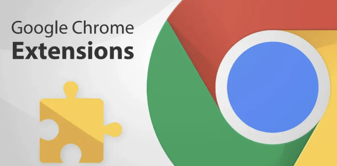

# 매니페스트 파일 이해하기

manifest.json 파일은 JSON 형식의 메타데이터 파일로, 확장 프로그램의 이름, 버전 등과 같은 속성을 포함합니다. 각 줄을 자세히 살펴보죠:

<!-- ui-log 수평형 -->
<ins class="adsbygoogle"
  style="display:block"
  data-ad-client="ca-pub-4877378276818686"
  data-ad-slot="9743150776"
  data-ad-format="auto"
  data-full-width-responsive="true"></ins>
<component is="script">
(adsbygoogle = window.adsbygoogle || []).push({});
</component>

```js
{
  "name": "확장 프로그램 이름", // 확장 프로그램의 이름입니다.
  "version": "0.1", // 확장 프로그램의 버전입니다.
  "manifest_version": 3, // Manifest 파일 형식 버전을 지정합니다. 최신 기능을 사용하려면 3을 사용하십시오.
  "permissions": ["activeTab"], // 확장 프로그램이 필요로 하는 권한 목록입니다.
  "action": {
    "default_popup": "popup.html" // 확장 프로그램 아이콘을 클릭했을 때 표시될 HTML 파일입니다.
  },
  "content_scripts": [
    {
      "matches": ["<all_urls>"], // 콘텐츠 스크립트가 실행될 URL을 지정합니다.
      "js": ["contentScript.js"] // 적용될 JavaScript 파일을 지정합니다.
    }
  ]
}
```

## 설명:

- name: 확장 프로그램의 이름입니다.
- version: 확장 프로그램의 버전으로 업데이트 시 유용합니다.
- manifest_version: Manifest 파일 형식의 버전입니다. 현재 최신 버전은 3입니다.
- permissions: 확장 프로그램이 필요로하는 권한의 배열입니다. 여기서 activeTab은 활성 탭과 상호 작용하는 권한을 부여합니다.
- action: 확장 프로그램 아이콘을 클릭했을 때 표시되는 팝업의 속성을 정의합니다.
- default_popup: 팝업에 표시될 HTML 파일입니다.
- content_scripts: 일치하는 페이지에 삽입될 JavaScript 파일을 정의하는 콘텐츠 스크립트 객체의 배열입니다.
- matches: 일치 패턴의 배열입니다. `all_urls`은 모든 URL에서 콘텐츠 스크립트가 실행됨을 의미합니다.
- js: 페이지에 주입될 JavaScript 파일의 배열입니다. 이 예시에서 contentScript.js는 실행되는 JavaScript 파일입니다. 상호작용할 웹 페이지에 확장 프로그램이 활성화된 Logic이 포함된 파일입니다.

이것이 Chrome 확장 프로그램을 위한 manifest.json 파일의 기본 구조입니다. 확장 프로그램의 요구에 따라 필드를 추가할 수 있습니다.

<!-- ui-log 수평형 -->
<ins class="adsbygoogle"
  style="display:block"
  data-ad-client="ca-pub-4877378276818686"
  data-ad-slot="9743150776"
  data-ad-format="auto"
  data-full-width-responsive="true"></ins>
<component is="script">
(adsbygoogle = window.adsbygoogle || []).push({});
</component>

# 팝업.html

우리의 팝업.html은 확장 프로그램 아이콘을 클릭했을 때 표시되는 간단한 HTML 파일입니다. 현재 "안녕 익스텐션!" 메시지가 표시됩니다.

```js
<!DOCTYPE html>
<html lang="en">
<head>
    <meta charset="UTF-8">
    <meta http-equiv="X-UA-Compatible" content="IE=edge">
    <meta name="viewport" content="width=device-width, initial-scale=1.0">
</head>
<body>
    <h1>Hello Extension!</h1>
</body>
</html>
```

그 다음으로 확장 프로그램 폴더는 다음과 같아야 합니다:

<!-- ui-log 수평형 -->
<ins class="adsbygoogle"
  style="display:block"
  data-ad-client="ca-pub-4877378276818686"
  data-ad-slot="9743150776"
  data-ad-format="auto"
  data-full-width-responsive="true"></ins>
<component is="script">
(adsbygoogle = window.adsbygoogle || []).push({});
</component>


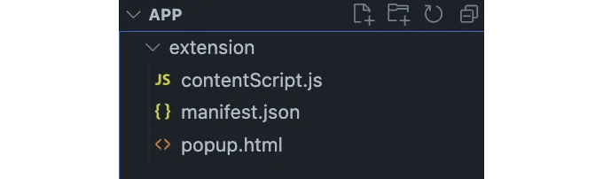

# 확장 프로그램 로드

테스트를 위해 Chrome에 언팩된 확장 프로그램을 로드하려면 다음 단계를 따르세요:

- Google Chrome을 열고 chrome://extensions/로 이동합니다.
- 오른쪽 상단에서 “개발자 모드”를 토글합니다.

<!-- ui-log 수평형 -->
<ins class="adsbygoogle"
  style="display:block"
  data-ad-client="ca-pub-4877378276818686"
  data-ad-slot="9743150776"
  data-ad-format="auto"
  data-full-width-responsive="true"></ins>
<component is="script">
(adsbygoogle = window.adsbygoogle || []).push({});
</component>

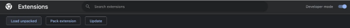

3. 나타나는 "압축 해제된 확장 프로그램을 로드합니다." 버튼을 클릭합니다.

4. 확장 프로그램 폴더로 이동하여 선택합니다.

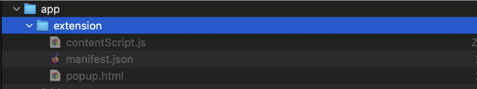

<!-- ui-log 수평형 -->
<ins class="adsbygoogle"
  style="display:block"
  data-ad-client="ca-pub-4877378276818686"
  data-ad-slot="9743150776"
  data-ad-format="auto"
  data-full-width-responsive="true"></ins>
<component is="script">
(adsbygoogle = window.adsbygoogle || []).push({});
</component>

이 단계를 완료하면 확장 프로그램이 활성화되어 크롬에서 테스트 중입니다.

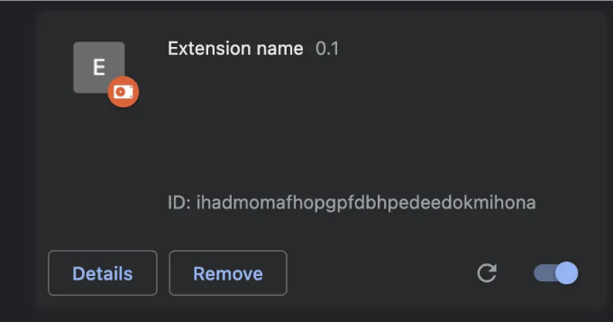

이제 확장 프로그램이 로드되었으니 열어서 작동하는 것을 확인해 보겠습니다.

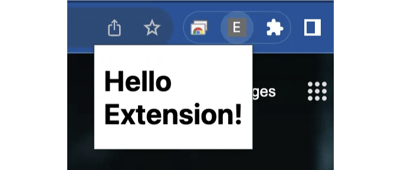

<!-- ui-log 수평형 -->
<ins class="adsbygoogle"
  style="display:block"
  data-ad-client="ca-pub-4877378276818686"
  data-ad-slot="9743150776"
  data-ad-format="auto"
  data-full-width-responsive="true"></ins>
<component is="script">
(adsbygoogle = window.adsbygoogle || []).push({});
</component>

# 동적 확장을 위한 React 통합

React의 컴포넌트 기반 아키텍처와 상태 관리 기능은 동적 및 상호 작용형 크롬 확장 프로그램을 구축하기에 탁월한 선택입니다. React를 사용하면 재사용 가능한 UI 구성 요소를 쉽게 만들고, 확장 프로그램의 다양한 부분에서 상태를 관리하며, 훅이나 컨텍스트를 사용하여 더 복잡한 로직을 처리할 수 있습니다. 이를 통해 간단한 UI 향상부터 복잡한 웹 조작까지 다양한 가능성이 열리며, 동시에 깔끔하고 관리하기 쉬운 코드베이스를 유지할 수 있습니다.

## React 설치하기

크롬 확장 프로그램에 React를 통합하기 위한 첫 번째 단계는 설치하는 것입니다. Create React App (CRA)를 사용하여 새 React 애플리케이션을 만들어야 합니다. CRA는 합리적인 기본 설정과 바로 사용 가능한 최상의 관행을 갖춘 새 React 프로젝트를 설정해줍니다.

<!-- ui-log 수평형 -->
<ins class="adsbygoogle"
  style="display:block"
  data-ad-client="ca-pub-4877378276818686"
  data-ad-slot="9743150776"
  data-ad-format="auto"
  data-full-width-responsive="true"></ins>
<component is="script">
(adsbygoogle = window.adsbygoogle || []).push({});
</component>

```js
npx create-react-app my-chrome-extension
```

이 명령을 실행한 후 my-chrome-extension이라는 새 폴더가 생성되어 React 기반의 Chrome 확장 프로그램을 시작하는 데 필요한 모든 파일이 포함됩니다.

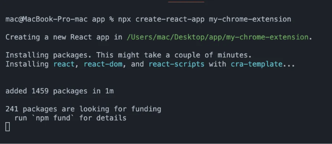

# 팝업에 React 추가하기

<!-- ui-log 수평형 -->
<ins class="adsbygoogle"
  style="display:block"
  data-ad-client="ca-pub-4877378276818686"
  data-ad-slot="9743150776"
  data-ad-format="auto"
  data-full-width-responsive="true"></ins>
<component is="script">
(adsbygoogle = window.adsbygoogle || []).push({});
</component>

이제 기본 React 앱을 설정했으니 Chrome 확장 프로그램에 통합해 봅시다. 현재 App.js 파일은 다음과 같습니다:

```js
function App() {
  return (
    <div className="App">
      <h1>Hello extension from react</h1>
    </div>
  );
}

export default App;
```

이 간단한 React 컴포넌트는 확장 프로그램 팝업의 콘텐츠로 사용될 것입니다. 이를 위해 React 앱을 빌드하고 manifest.json 파일을 빌드된 HTML 파일로 지정해야 합니다.

## React 앱 빌드하기

<!-- ui-log 수평형 -->
<ins class="adsbygoogle"
  style="display:block"
  data-ad-client="ca-pub-4877378276818686"
  data-ad-slot="9743150776"
  data-ad-format="auto"
  data-full-width-responsive="true"></ins>
<component is="script">
(adsbygoogle = window.adsbygoogle || []).push({});
</component>

먼저 React 앱을 만들어 봅시다:

```js
npm run build
```

이 명령어를 실행하면 최적화된 버전의 앱이 담긴 build 폴더가 생성됩니다.
보다 편리하게 사용하기 위해 React 프로젝트의 package.json 파일에서 build 스크립트를 수정하여 build 폴더를 직접 확장 프로젝트 폴더로 이동시킬 수 있습니다. 이렇게 하면 파일을 수동으로 옮길 필요가 없어집니다.

```js
  "build": "react-scripts build && mv build ../extension/build"
```

<!-- ui-log 수평형 -->
<ins class="adsbygoogle"
  style="display:block"
  data-ad-client="ca-pub-4877378276818686"
  data-ad-slot="9743150776"
  data-ad-format="auto"
  data-full-width-responsive="true"></ins>
<component is="script">
(adsbygoogle = window.adsbygoogle || []).push({});
</component>

## 매니페스트 파일 업데이트

이제 빌드된 HTML 파일을 가리키도록 manifest.json을 업데이트하세요:

```js
  "action": {
    "default_popup": "./build/index.html"
  },
```

저희의 폴더 구조는 다음과 같아야 합니다:

<!-- ui-log 수평형 -->
<ins class="adsbygoogle"
  style="display:block"
  data-ad-client="ca-pub-4877378276818686"
  data-ad-slot="9743150776"
  data-ad-format="auto"
  data-full-width-responsive="true"></ins>
<component is="script">
(adsbygoogle = window.adsbygoogle || []).push({});
</component>

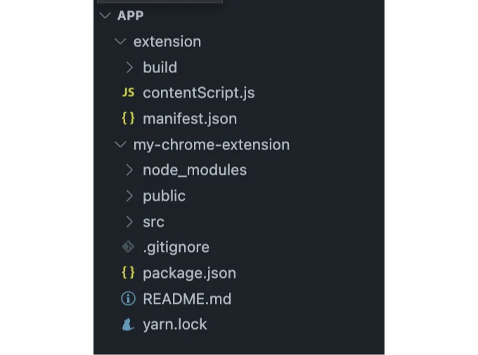

위 단계를 마치면 이제 React 앱이 Chrome 확장 프로그램의 팝업으로 작동해야 합니다. 확장 프로그램 아이콘을 클릭하면 React 앱이 표시되어야 합니다.

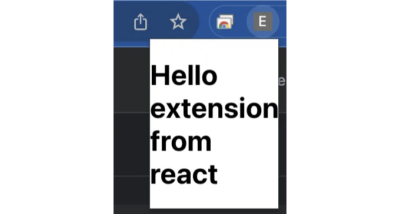

# 향상된 기능을 위한 Manifest 사용자 정의

<!-- ui-log 수평형 -->
<ins class="adsbygoogle"
  style="display:block"
  data-ad-client="ca-pub-4877378276818686"
  data-ad-slot="9743150776"
  data-ad-format="auto"
  data-full-width-responsive="true"></ins>
<component is="script">
(adsbygoogle = window.adsbygoogle || []).push({});
</component>

manifest.json 파일은 매우 유연하며 확장 프로그램의 요구에 맞게 다양한 사용자 정의를 허용합니다. 권한부터 UI 요소까지 다양한 설정을 지정하여 확장 프로그램을 우리가 원하는 대로 간단하거나 복잡하게 만들 수 있습니다.

더 자세한 내용은 공식 Google Chrome 확장 프로그램 매니페스트 문서를 참조할 수 있습니다.

## 예시: 팝업 너비와 높이 변경

가장 흔한 사용자 정의 중 하나는 팝업의 크기를 조정하는 것입니다. 우리는 manifest.json에서 팝업 창의 너비와 높이를 쉽게 변경할 수 있습니다:

<!-- ui-log 수평형 -->
<ins class="adsbygoogle"
  style="display:block"
  data-ad-client="ca-pub-4877378276818686"
  data-ad-slot="9743150776"
  data-ad-format="auto"
  data-full-width-responsive="true"></ins>
<component is="script">
(adsbygoogle = window.adsbygoogle || []).push({});
</component>

```js
  "action": {
    "default_popup": "./build/index.html",
    "default_width": 400,
    "default_height": 600
  },
```

결과:

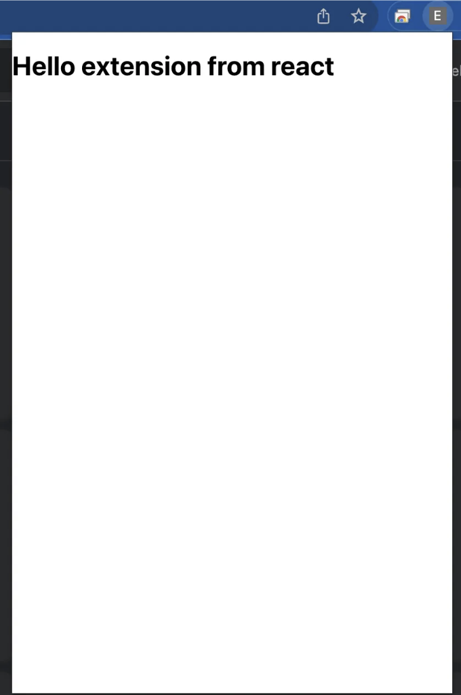

# Chrome 확장 프로그램을 사용하여 DOM 조작하기

<!-- ui-log 수평형 -->
<ins class="adsbygoogle"
  style="display:block"
  data-ad-client="ca-pub-4877378276818686"
  data-ad-slot="9743150776"
  data-ad-format="auto"
  data-full-width-responsive="true"></ins>
<component is="script">
(adsbygoogle = window.adsbygoogle || []).push({});
</component>

Chrome 확장 프로그램의 가장 강력한 기능 중 하나는 웹 페이지의 DOM과 상호작용할 수 있는 능력입니다. 이를 통해 콘텐츠를 수정하거나 스타일을 변경하거나 새로운 기능을 추가할 수 있습니다. 이 예에서는 웹 페이지의 색상을 그레이스케일로 전환하고 다시 원래대로 되돌리는 기능을 구현했습니다.

## 구현 단계별 안내

React 팝업 UI: React 앱에서 '색상 제거' 버튼을 만들어서 그레이스케일 전환을 트리거하십시오.

```js
<button onClick={toggleGrayscale}>Remove Color</button>
```

<!-- ui-log 수평형 -->
<ins class="adsbygoogle"
  style="display:block"
  data-ad-client="ca-pub-4877378276818686"
  data-ad-slot="9743150776"
  data-ad-format="auto"
  data-full-width-responsive="true"></ins>
<component is="script">
(adsbygoogle = window.adsbygoogle || []).push({});
</component>

메시징: 팝업에서 컨텐츠 스크립트로 작업을 전송하려면 Chrome의 메시징 API를 사용하세요.

```js
chrome.tabs.sendMessage(tab.id, { action: 'removeColorControl' });
```

콘텐츠 스크립트: 메시지를 수신하고 해당 기능을 실행합니다.

```js
chrome.runtime.onMessage.addListener((request, sender, sendResponse) => {
  if (request.action === 'removeColorControl') {
    removeColorControl();
  }
});
```

<!-- ui-log 수평형 -->
<ins class="adsbygoogle"
  style="display:block"
  data-ad-client="ca-pub-4877378276818686"
  data-ad-slot="9743150776"
  data-ad-format="auto"
  data-full-width-responsive="true"></ins>
<component is="script">
(adsbygoogle = window.adsbygoogle || []).push({});
</component>

DOM 조작: 그레이스케일을 토글하는 기능을 구현하세요.

```js
const newStyleElement = document.createElement("style");
newStyleElement.id = styleId;
newStyleElement.innerHTML = styleContent;
document.head.appendChild(newStyleElement);
```

## 중요성

DOM을 조작할 수 있는 능력은 크롬 확장 프로그램이 다양성을 띄는 이유입니다. 기능을 향상시키거나 접근성을 향상시키거나 새로운 기능을 제공하는 등, 이 측면을 이해하는 것은 효과적인 확장 프로그램 개발에 필수적입니다.

<!-- ui-log 수평형 -->
<ins class="adsbygoogle"
  style="display:block"
  data-ad-client="ca-pub-4877378276818686"
  data-ad-slot="9743150776"
  data-ad-format="auto"
  data-full-width-responsive="true"></ins>
<component is="script">
(adsbygoogle = window.adsbygoogle || []).push({});
</component>

React 프로젝트를 다시 빌드하여 변경 사항이 적용되었는지 확인해보세요.

전체 코드는 이렇게 생겼을 거에요:

App.js

```js
function App() {
  function toggleGrayscale() {
    chrome.tabs.query({ active: true, currentWindow: true }, (tabs) => {
      const tab = tabs[0];
      if (tab && tab.id !== undefined) {
        chrome.tabs.sendMessage(tab.id, {
          action: 'removeColorControl',
        });
      }
    });
  }

  return (
    <div className="App">
      <h1>Hello extension from react</h1>
      <button onClick={toggleGrayscale}>Remove Color</button>
    </div>
  );
}
```

<!-- ui-log 수평형 -->
<ins class="adsbygoogle"
  style="display:block"
  data-ad-client="ca-pub-4877378276818686"
  data-ad-slot="9743150776"
  data-ad-format="auto"
  data-full-width-responsive="true"></ins>
<component is="script">
(adsbygoogle = window.adsbygoogle || []).push({});
</component>

contentScript.js

```js
function removeColorControl() {
 const styleId = "un-color-display";
 const styleContent = `
        html {
          filter: grayscale(1)!important;
        }
      `;

 const styleElement = document.getElementById(styleId);

 if (styleElement) {
  document.head.removeChild(styleElement);
 } else {
  const newStyleElement = document.createElement("style");
  newStyleElement.id = styleId;
  newStyleElement.innerHTML = styleContent;
  document.head.appendChild(newStyleElement);
 }
}

chrome.runtime.onMessage.addListener((request, sender, sendResponse) => {
 if (request.action === 'removeColorControl') {
  removeColorControl();
 }
});
```

위키피디아 웹사이트에서 버튼을 클릭한 후 색상이 제거되어 페이지가 회색조로 변환되는 것을 볼 수 있습니다.

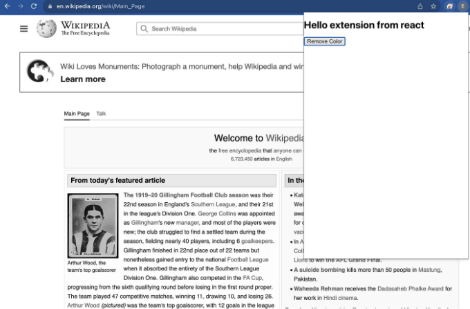

<!-- ui-log 수평형 -->
<ins class="adsbygoogle"
  style="display:block"
  data-ad-client="ca-pub-4877378276818686"
  data-ad-slot="9743150776"
  data-ad-format="auto"
  data-full-width-responsive="true"></ins>
<component is="script">
(adsbygoogle = window.adsbygoogle || []).push({});
</component>

# 결론

React를 활용한 Chrome 확장 프로그램 개발은 웹 브라우징 경험을 향상시키는 강력한 방법을 제공합니다. 팝업의 간단한 UI부터 복잡한 DOM 조작까지, 가능성은 무한합니다. 이 튜토리얼에서는 웹 페이지의 색상을 그레이스케일로 전환하고 다시 되돌릴 수 있는 Chrome 확장 프로그램을 만드는 단계를 안내했습니다. 이 예제는 React와 결합했을 때 Chrome 확장 프로그램의 유연성과 기능을 보여줍니다. 변경 사항이 있는 경우 React 프로젝트를 다시 빌드하고, 더 발전된 유용한 확장 프로그램을 만드는 길에 한 발짝 더 나아갈 수 있을 것입니다.

# 다음은?

즐거운 코딩하세요! 시리즈의 다음 부분에서는 보다 구조화된 DOM 조작에 대해 깊이 파고들 예정입니다. Chrome 확장 프로그램을 더욱 향상시키기 위한 고급 기술들을 소개할 예정이니 기대해 주세요.