GitHub 및 npm 저장소를 통해 프로젝트 간에 React 컴포넌트 라이브러리를 만들고 공유하는 방법에 대한 포괄적인 안내서.

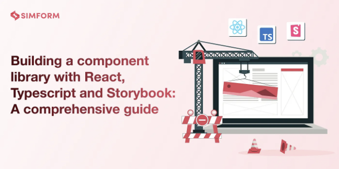

React는 확장 가능한 웹 애플리케이션을 만드는 데 가장 유명한 라이브러리 중 하나입니다. React 생태계에는 Ant Design, Material UI, Chakra UI와 같은 많은 컴포넌트 라이브러리가 있어 재사용 가능한 UI 컴포넌트를 제공합니다.

React의 유연성을 통해 고유한 요구 사항에 맞는 사용자 정의 컴포넌트 라이브러리를 빌드할 수도 있습니다. 이 글에서는 React, TypeScript, Storybook 및 몇 가지 유용한 도구를 사용하여 자체 컴포넌트 라이브러리를 만드는 방법에 대해 알아보겠습니다.

<!-- ui-log 수평형 -->
<ins class="adsbygoogle"
  style="display:block"
  data-ad-client="ca-pub-4877378276818686"
  data-ad-slot="9743150776"
  data-ad-format="auto"
  data-full-width-responsive="true"></ins>
<component is="script">
(adsbygoogle = window.adsbygoogle || []).push({});
</component>

# ESLint 및 Prettier 설정 프로젝트

git을 사용하여 React 및 TypeScript로 프로젝트를 초기화하려면 다음 명령을 실행하세요:

```js
git init
npm init -y
npm install -D react @types/react typescript
```

여기서, 라이브러리 패키지에서 일반적으로 피어 종속성으로 사용되기 때문에 React를 peerDependencies로 이동해야 합니다. 이렇게 하면 사용자가 충돌없이 React의 하나의 버전을 사용할 수 있습니다. 이를 위해 package.json에 다음 줄을 추가하고 React를 devDependencies에서 제거하세요:

<!-- ui-log 수평형 -->
<ins class="adsbygoogle"
  style="display:block"
  data-ad-client="ca-pub-4877378276818686"
  data-ad-slot="9743150776"
  data-ad-format="auto"
  data-full-width-responsive="true"></ins>
<component is="script">
(adsbygoogle = window.adsbygoogle || []).push({});
</component>

```js
"peerDependencies": {
    "react": "^18.2.0"
  },
```

## Prettier

Prettier는 의견이 강한 코드 형식 지정 도구입니다. 코드를 구문 분석하고 자체 규칙으로 다시 인쇄하여 일관된 스타일을 적용합니다.

Prettier를 설치하려면 다음 명령을 실행하세요:```

<!-- ui-log 수평형 -->
<ins class="adsbygoogle"
  style="display:block"
  data-ad-client="ca-pub-4877378276818686"
  data-ad-slot="9743150776"
  data-ad-format="auto"
  data-full-width-responsive="true"></ins>
<component is="script">
(adsbygoogle = window.adsbygoogle || []).push({});
</component>

```js
npm install -D prettier
```

프로젝트 루트에 .prettierrc 파일을 생성하고 다음과 같은 규칙을 설정하세요:

```js
{
  "printWidth": 80,
  "tabWidth": 2
}
```

프로젝트를 포맷하려면 package.json에 다음 스크립트를 추가하세요:

<!-- ui-log 수평형 -->
<ins class="adsbygoogle"
  style="display:block"
  data-ad-client="ca-pub-4877378276818686"
  data-ad-slot="9743150776"
  data-ad-format="auto"
  data-full-width-responsive="true"></ins>
<component is="script">
(adsbygoogle = window.adsbygoogle || []).push({});
</component>

```json
{
  ...
  "scripts": {
     "format": "prettier --write --parser typescript '**/*.{ts,tsx}'"
  },
  ...
}
```

## ESLint

ESLint는 JavaScript 코드를 분석하여 일반적인 문제를 확인하는 정적 코드 분석 도구입니다. 문법 오류, 형식 문제, 코드 스타일 위반 및 잠재적 버그와 같은 일반적인 문제를 확인할 수 있습니다.

ESLint 및 해당 플러그인을 설치하려면 다음 명령을 실행하세요:

<!-- ui-log 수평형 -->
<ins class="adsbygoogle"
  style="display:block"
  data-ad-client="ca-pub-4877378276818686"
  data-ad-slot="9743150776"
  data-ad-format="auto"
  data-full-width-responsive="true"></ins>
<component is="script">
(adsbygoogle = window.adsbygoogle || []).push({});
</component>

```js
npm install -D eslint @typescript-eslint/parser eslint-config-prettier eslint-plugin-prettier eslint-plugin-react eslint-plugin-react-hooks eslint-plugin-storybook @typescript-eslint/eslint-plugin
```

이제 프로젝트의 루트 디렉토리에 .eslintrc라는 ESLint를 위한 구성 파일을 만들고 다음 구성을 붙여넣으세요:

```js
{
  // 코드가 실행될 환경을 지정합니다
  "env": {
    "jest": true,       // Jest 테스트를 위해 활성화
    "browser": true     // 브라우저 환경을 활성화
  },

  // ESLint가 상위 폴더에서 구성을 검색하지 않도록 합니다
  "root": true,

  // TypeScript를 위한 파서를 지정합니다 (@typescript-eslint/parser 사용)
  "parser": "@typescript-eslint/parser", // TS ESTree를 사용하여 TypeScript를 lint하는 데 활용

  // 추가적인 규칙과 구성 옵션을 추가합니다
  "plugins": ["@typescript-eslint"],

  // 다양한 ESLint 구성 및 플러그인을 확장합니다
  "extends": [
    "eslint:recommended",                   // ESLint의 권장 규칙
    "plugin:react/recommended",             // React의 권장 규칙
    "plugin:@typescript-eslint/recommended", // TypeScript의 권장 규칙
    "plugin:@typescript-eslint/eslint-recommended", // TypeScript에 대한 ESLint 재정의
    "prettier",                             // Prettier 규칙
    "plugin:prettier/recommended",          // Prettier 플러그인 통합
    "plugin:react-hooks/recommended",       // React 훅을 위한 권장 규칙
    "plugin:storybook/recommended"          // Storybook을 위한 권장 규칙
  ],
  "rules": {
    "react/react-in-jsx-scope": "off",
  }
}
```

루트 디렉토리에 .gitignore 파일을 만들고 리포지토리에 포함되지 않아야 하는 디렉터리를 추가하세요.```

<!-- ui-log 수평형 -->
<ins class="adsbygoogle"
  style="display:block"
  data-ad-client="ca-pub-4877378276818686"
  data-ad-slot="9743150776"
  data-ad-format="auto"
  data-full-width-responsive="true"></ins>
<component is="script">
(adsbygoogle = window.adsbygoogle || []).push({});
</component>

```js
node_modules
dist

# 스토리북 빌드 디렉토리
storybook-static
```

프로젝트를 린팅하기 위해 package.json에 다음 스크립트를 추가하세요 :

```js
{
  ...
  "scripts": {
    "lint": "eslint . --ext .ts,.tsx --ignore-path .gitignore --fix"
  },
  ...
}
```

# Typescript 및 Vite 구성

<!-- ui-log 수평형 -->
<ins class="adsbygoogle"
  style="display:block"
  data-ad-client="ca-pub-4877378276818686"
  data-ad-slot="9743150776"
  data-ad-format="auto"
  data-full-width-responsive="true"></ins>
<component is="script">
(adsbygoogle = window.adsbygoogle || []).push({});
</component>

Vite는 최근 몇 년간 인기를 얻어온 현대적인 프론트엔드 도구입니다. Vite는 프로덕션 빌드에 Rollup을 사용하면서 두 도구의 장점을 결합하여 훌륭한 개발 경험과 효율적인 프로덕션 빌드를 제공합니다.

아래 구성을 가진 tsconfig.json 파일을 만들어주세요:

```js
{
  "compilerOptions": {
    "target": "ES5", // 코드를 변환할 때 대상이 되는 JavaScript 버전을 지정합니다.
    "useDefineForClassFields": true, // 클래스 필드에 'define' 사용을 허용합니다.
    "lib": ["ES2020", "DOM", "DOM.Iterable"], // 코드에서 사용 가능한 라이브러리를 지정합니다.
    "module": "ESNext", // 코드 생성에 사용할 모듈 시스템을 정의합니다.
    "skipLibCheck": true, // 선언 파일의 타입 검사를 건너뜁니다.

    /* 번들러 모드 */
    "moduleResolution": "bundler", // 번들링할 때 모듈이 어떻게 해석되는지 지정합니다.
    "allowImportingTsExtensions": true, // 확장자가 있는 TypeScript 파일을 가져오도록 허용합니다.
    "resolveJsonModule": true, // JSON 모듈을 가져오도록 설정합니다.
    "isolatedModules": true, // 각 파일을 별도의 모듈로 취급합니다.
    "noEmit": true, // TypeScript가 출력 파일을 생성하지 못하도록 합니다.
    "jsx": "react-jsx", // React용 JSX 지원을 구성합니다.

    /* 린팅 */
    "strict": true, // 엄격한 타입 확인을 활성화합니다.
    "noUnusedLocals": true, // 사용되지 않는 지역 변수를 신호로 표시합니다.
    "noUnusedParameters": true, // 사용되지 않는 함수 매개변수를 신호로 표시합니다.
    "noFallthroughCasesInSwitch": true, // switch 문의 모든 경우를 처리해야 합니다.
    "declaration": true, // TypeScript를 위한 선언 파일을 생성합니다.
  },
  "include": ["src"], // TypeScript 파일을 검색할 때 포함할 디렉토리를 지정합니다.
  "exclude": [
    "src/**/__docs__","src/**/__test__"
  ]
}
```

하나의 선언 파일을 생성하는 플러그인이 포함된 Vite를 설치하려면 다음 명령을 실행하세요:

<!-- ui-log 수평형 -->
<ins class="adsbygoogle"
  style="display:block"
  data-ad-client="ca-pub-4877378276818686"
  data-ad-slot="9743150776"
  data-ad-format="auto"
  data-full-width-responsive="true"></ins>
<component is="script">
(adsbygoogle = window.adsbygoogle || []).push({});
</component>

```js
npm install -D vite vite-plugin-dts
```

루트 디렉토리에 vite.config.ts라는 파일을 생성하고 다음 구성을 추가하세요:

```js
import { defineConfig } from "vite";
import dts from "vite-plugin-dts";
import { peerDependencies } from "./package.json";

export default defineConfig({
  build: {
    lib: {
      entry: "./src/index.ts", // 라이브러리 빌드의 진입점을 지정합니다.
      name: "vite-react-ts-button", // 생성된 라이브러리의 이름을 설정합니다.
      fileName: (format) => `index.${format}.js`, // 형식에 따라 출력 파일 이름을 생성합니다.
      formats: ["cjs", "es"], // 출력 형식 (CommonJS 및 ES 모듈)을 지정합니다.
    },
    rollupOptions: {
      external: [...Object.keys(peerDependencies)], // Rollup 번들링을 위한 외부 종속성을 정의합니다.
    },
    sourcemap: true, // 디버깅을 위해 소스 맵을 생성합니다.
    emptyOutDir: true, // 빌드하기 전에 출력 디렉터리를 지웁니다.
  },
  plugins: [dts()], // TypeScript 선언 파일(d.ts)을 생성하기 위해 'vite-plugin-dts' 플러그인을 사용합니다.
});
```

이 구성을 package.json에 추가해서 빌드 스크립트와 진입점 및 유형 정의를 정의하세요.

<!-- ui-log 수평형 -->
<ins class="adsbygoogle"
  style="display:block"
  data-ad-client="ca-pub-4877378276818686"
  data-ad-slot="9743150776"
  data-ad-format="auto"
  data-full-width-responsive="true"></ins>
<component is="script">
(adsbygoogle = window.adsbygoogle || []).push({});
</component>

```js
{
  ...
  "type": "module",
  "main": "dist/index.cjs.js",
  "module": "dist/index.es.js",
  "types": "dist/index.d.ts",
  "files": [
    "/dist"
  ],
  "scripts":{
   ...
   "build": "tsc && vite build",
  }
}
```

여기서 "main"과 "module"은 JavaScript의 다른 모듈 시스템을 위한 진입 점을 지정하는 데 사용됩니다.

- "main" 필드는 CommonJS 모듈을 위한 진입 점을 지정하는 데 사용됩니다. 일반적으로 .cjs.js 또는 .js 확장자를 가진 파일을 가리킵니다. Node.js에서 require()를 사용하여 패키지를 필요로하거나 Webpack 또는 Vite와 같은 도구로 번들링할 때 "main" 진입 지점이 사용됩니다.
- "module" 필드는 ES 모듈을 위한 진입 점을 지정하는 데 사용됩니다. 일반적으로 .es.js 또는 .mjs 확장자를 가진 파일을 가리킵니다. ES 모듈을 지원하는 현대적인 JavaScript 환경에서 import를 사용하여 패키지를 가져올 때 "module" 진입 지점이 사용됩니다.

package.json에 "main" 및 "module" 필드를 모두 지정함으로써 CommonJS 및 ES 모듈 시스템 모두에 대한 호환성을 제공할 수 있습니다.

<!-- ui-log 수평형 -->
<ins class="adsbygoogle"
  style="display:block"
  data-ad-client="ca-pub-4877378276818686"
  data-ad-slot="9743150776"
  data-ad-format="auto"
  data-full-width-responsive="true"></ins>
<component is="script">
(adsbygoogle = window.adsbygoogle || []).push({});
</component>

# 컴포넌트 생성

간단한 CSS 대신에 styled-components를 사용해 스타일링할 거에요. component-based styling, dynamic styling, css-in-js와 같은 기능들을 활용할 수 있어요.

styled-components를 추가하려면 다음 명령을 실행하세요.

```js
npm install -D styled-components
```

<!-- ui-log 수평형 -->
<ins class="adsbygoogle"
  style="display:block"
  data-ad-client="ca-pub-4877378276818686"
  data-ad-slot="9743150776"
  data-ad-format="auto"
  data-full-width-responsive="true"></ins>
<component is="script">
(adsbygoogle = window.adsbygoogle || []).push({});
</component>

루트 디렉토리에 src 폴더를 만들고, 버튼 컴포넌트를 위한 button 폴더를 생성해주세요. 이 폴더 안에 Button.tsx와 index.ts 파일을 추가하고, 아래 코드를 붙여넣어주세요:

```js
// components/button/button.tsx
import React, { MouseEventHandler } from "react";
import styled from "styled-components";

export type ButtonProps = {
  text?: string;
  primary?: boolean;
  disabled?: boolean;
  size?: "small" | "medium" | "large";
  onClick?: MouseEventHandler<HTMLButtonElement>;
};

const StyledButton = styled.button<ButtonProps>`
  border: 0;
  line-height: 1;
  font-size: 15px;
  cursor: pointer;
  font-weight: 700;
  font-weight: bold;
  border-radius: 10px;
  display: inline-block;
  color: ${(props) => (props.primary ? "#fff" : "#000")};
  background-color: ${(props) => (props.primary ? "#FF5655" : "#f4c4c4")};
  padding: ${(props) =>
    props.size === "small"
      ? "7px 25px 8px"
      : props.size === "medium"
      ? "9px 30px 11px"
      : "14px 30px 16px"};
`;

const Button: React.FC<ButtonProps> = ({
  size,
  primary,
  disabled,
  text,
  onClick,
  ...props
}) => {
  return (
    <StyledButton
      type="button"
      onClick={onClick}
      primary={primary}
      disabled={disabled}
      size={size}
      {...props}
    >
      {text}
    </StyledButton>
  );
};

export default Button;
```

```js
// components/button/index.ts
export { default as Button } from './Button';
```

그런 다음 components 폴더에 index.ts 파일을 추가해주세요. 이 파일을 통해 components 폴더의 모든 컴포넌트를 내보낼 수 있습니다.

<!-- ui-log 수평형 -->
<ins class="adsbygoogle"
  style="display:block"
  data-ad-client="ca-pub-4877378276818686"
  data-ad-slot="9743150776"
  data-ad-format="auto"
  data-full-width-responsive="true"></ins>
<component is="script">
(adsbygoogle = window.adsbygoogle || []).push({});
</component>

```js
// components/index.ts
export * from './button'; // 필요에 따라 다른 컴포넌트의 더 많은 내보내기 추가
```

'index.ts' 파일을 src 폴더에 추가하십시오. 이 파일은 라이브러리 전체의 진입점으로 작용합니다. 여기서 컴포넌트와 그들의 타입 및 유틸리티를 내보낼 수 있습니다.

```js
// src/index.ts
export * from './components'; // 이 명령은 'components' 폴더에서 모든 컴포넌트를 내보냅니다
```

컴포넌트를 추가한 후 아래 명령을 실행하십시오. 이것은 'dist' 폴더를 생성합니다.

<!-- ui-log 수평형 -->
<ins class="adsbygoogle"
  style="display:block"
  data-ad-client="ca-pub-4877378276818686"
  data-ad-slot="9743150776"
  data-ad-format="auto"
  data-full-width-responsive="true"></ins>
<component is="script">
(adsbygoogle = window.adsbygoogle || []).push({});
</component>

```js
npm run build
```

dist 폴더 안에는 라이브러리의 출력 코드가 있습니다.

# Vitest 및 React-Testing-Library로 테스트하기

Vitest는 Vite 기반의 유닛 테스트 프레임워크이며, 많은 현대적인 기능을 갖춘 훌륭한 유닛 테스트 프레임워크입니다.

<!-- ui-log 수평형 -->
<ins class="adsbygoogle"
  style="display:block"
  data-ad-client="ca-pub-4877378276818686"
  data-ad-slot="9743150776"
  data-ad-format="auto"
  data-full-width-responsive="true"></ins>
<component is="script">
(adsbygoogle = window.adsbygoogle || []).push({});
</component>

Vitest를 설치하려면 다음 명령을 실행하세요:

```js
npm install -D vitest @testing-library/react jsdom @testing-library/jest-dom
```

이제 package.json 파일에 다음 스크립트를 추가해주세요.

```js
"scripts": {
  "test": "vitest run",
  "test-watch": "vitest",
  "test:ui": "vitest --ui"
}
```

<!-- ui-log 수평형 -->
<ins class="adsbygoogle"
  style="display:block"
  data-ad-client="ca-pub-4877378276818686"
  data-ad-slot="9743150776"
  data-ad-format="auto"
  data-full-width-responsive="true"></ins>
<component is="script">
(adsbygoogle = window.adsbygoogle || []).push({});
</component>

vite.config.ts 파일의 맨 위에 다음 줄을 추가해 주세요:

```js
/// <reference types="vitest" />
```

루트 디렉토리에 setupTests.ts라는 파일을 만들고, 해당 파일에 아래 코드를 추가해 주세요:

```js
import { expect } from "vitest";
import * as matchers from "@testing-library/jest-dom/matchers";
import { TestingLibraryMatchers } from "@testing-library/jest-dom/matchers";
declare module "vitest" {
  // eslint-disable-next-line @typescript-eslint/no-explicit-any
  interface Assertion<T = any>
    extends jest.Matchers<void, T>,
      TestingLibraryMatchers<T, void> {}
}
expect.extend(matchers);
```

<!-- ui-log 수평형 -->
<ins class="adsbygoogle"
  style="display:block"
  data-ad-client="ca-pub-4877378276818686"
  data-ad-slot="9743150776"
  data-ad-format="auto"
  data-full-width-responsive="true"></ins>
<component is="script">
(adsbygoogle = window.adsbygoogle || []).push({});
</component>

이제 defineConfig 아래의 vite.config.ts 파일에 다음 구성을 추가하세요:

```js
  test: {
    globals: true,
    environment: "jsdom",
    setupFiles: "./setupTests.ts",
  },
```

버튼 폴더 내에 __test__ 디렉토리를 만들고 Button.test.tsx라는 파일을 추가하여 다음 코드로 버튼 컴포넌트를 테스트해보세요:

```js
//Button/__test__/Button.test.tsx
import React from "react";
import { describe, expect, it } from "vitest";
import { render, screen } from "@testing-library/react";
import Button from "../Button";

describe("Button component", () => {
  it("Button should render correctly", () => {
    render(<Button />);
    const button = screen.getByRole("button");
    expect(button).toBeInTheDocument();
  });
});
```

<!-- ui-log 수평형 -->
<ins class="adsbygoogle"
  style="display:block"
  data-ad-client="ca-pub-4877378276818686"
  data-ad-slot="9743150776"
  data-ad-format="auto"
  data-full-width-responsive="true"></ins>
<component is="script">
(adsbygoogle = window.adsbygoogle || []).push({});
</component>

# 스토리북과 허스키 추가하기

## 스토리북

스토리북은 UI 컴포넌트를 디자인, 테스트 및 독립적으로 쇼케이스하는 오픈 소스 개발 환경입니다.

다음 명령을 실행하여 새 스토리북 프로젝트를 초기화하세요:

<!-- ui-log 수평형 -->
<ins class="adsbygoogle"
  style="display:block"
  data-ad-client="ca-pub-4877378276818686"
  data-ad-slot="9743150776"
  data-ad-format="auto"
  data-full-width-responsive="true"></ins>
<component is="script">
(adsbygoogle = window.adsbygoogle || []).push({});
</component>

```js
npx storybook@latest init
```

이미 Vite가 설치되어 있기 때문에 Storybook에서는 러너로 감지될 것입니다. 또한 .storybook 폴더와 package.json 파일에 필요한 스크립트도 추가될 것입니다.

src 폴더 안에 stories 폴더가 생성될 것이지만, 이를 삭제할 예정입니다.

각 구성 요소는 __docs__ 디렉토리를 가지고 있으며, 그 안에 우리의 stories를 추가할 것입니다. 이를 위해 .stroybook/main.ts 파일의 stories 필드를 업데이트해야 합니다.```

<!-- ui-log 수평형 -->
<ins class="adsbygoogle"
  style="display:block"
  data-ad-client="ca-pub-4877378276818686"
  data-ad-slot="9743150776"
  data-ad-format="auto"
  data-full-width-responsive="true"></ins>
<component is="script">
(adsbygoogle = window.adsbygoogle || []).push({});
</component>

```js
stories: ["../src/**/__docs__/*.stories.tsx", "../src/**/__docs__/*.mdx"],
```

`src/button/__docs__` 디렉토리에 세 개의 파일을 생성하세요:

- Button.stories.tsx
- Example.tsx
- Button.mdx

Button.mdx 파일에 다음 내용을 추가하세요:

<!-- ui-log 수평형 -->
<ins class="adsbygoogle"
  style="display:block"
  data-ad-client="ca-pub-4877378276818686"
  data-ad-slot="9743150776"
  data-ad-format="auto"
  data-full-width-responsive="true"></ins>
<component is="script">
(adsbygoogle = window.adsbygoogle || []).push({});
</component>

```js
import { Canvas, Meta } from "@storybook/blocks";
import Example from "./Example.tsx";
import * as Button from "./Button.stories.tsx";

<Meta of={Button} title="Button" />

# Button

다양한 프롭을 가진 Button 컴포넌트입니다.

#### 예시

<Canvas of={Button.Primary} />

## 사용법

```ts
import {Button} from "sld-ui";

const Example = () => {
  return (
      <Button
        size={"small"}
        text={"Button"}
        onClick={()=> console.log("Clicked")}
        primary
      />
  );
};

export default Example;
```

#### 인수

- **text** _`() => void`_ - 버튼의 텍스트 내용을 나타내는 문자열입니다.
- **primary** - 버튼에 기본적인 스타일이 적용되어야 하는지를 나타내는 부울값입니다. 일반적으로, 기본 버튼은 사용자 인터페이스에서 주요 작업으로 강조됩니다.
- **disabled** - 버튼을 비활성 상태로 만들어야 하는지를 나타내는 부울값입니다. 비활성 상태인 버튼은 클릭하거나 상호작용할 수 없습니다.
- **size** - "small", "medium", "large" 중 하나의 값이 포함된 문자열입니다. 버튼의 사이즈나 크기를 정의합니다.
- **onClick** - 버튼을 클릭했을 때 호출되는 함수입니다. 버튼 요소에서 클릭 이벤트를 처리하기 위해 MouseEventHandler를 받습니다.
```

Example.tsx 파일에 다음 코드를 삽입하세요:

```js
import React, { FC } from "react";
import Button, { ButtonProps } from "../Button";

const Example: FC<ButtonProps> = ({
  disabled = false,
  onClick = () => {},
  primary = true,
  size = "small",
  text = "Button",
}) => {
  return (
    <div
      style={
        display: "flex",
        justifyContent: "center",
        alignItems: "center",
        height: "100%",
      }
    >
      <Button
        size={size}
        text={text}
        disabled={disabled}
        onClick={onClick}
        primary={primary}
      />
    </div>
  );
};

export default Example;
```

Button.stories.tsx 파일에 다음 코드를 삽입하세요:```

<!-- ui-log 수평형 -->
<ins class="adsbygoogle"
  style="display:block"
  data-ad-client="ca-pub-4877378276818686"
  data-ad-slot="9743150776"
  data-ad-format="auto"
  data-full-width-responsive="true"></ins>
<component is="script">
(adsbygoogle = window.adsbygoogle || []).push({});
</component>

```js
import type { Meta, StoryObj } from "@storybook/react";
import Example from "./Example";

const meta: Meta<typeof Example> = {
  title: "Button",
  component: Example,
};

export default meta;
type Story = StoryObj<typeof Example>;

export const Primary: Story = {
  args: {
    text: "Button",
    primary: true,
    disabled: false,
    size: "small",
    onClick: () => console.log("Button"),
  },
};
export const Secondary: Story = {
  args: {
    text: "Button",
    primary: false,
    disabled: false,
    size: "small",
    onClick: () => console.log("Button"),
  },
};
```

위의 변경 사항을 반영한 후 Storybook를 시작하려면 다음 명령을 실행하십시오:

```js
npm run storybook
```

Storybook에서 모든 Button UI 변형을 확인할 수 있어야 합니다.```

<!-- ui-log 수평형 -->
<ins class="adsbygoogle"
  style="display:block"
  data-ad-client="ca-pub-4877378276818686"
  data-ad-slot="9743150776"
  data-ad-format="auto"
  data-full-width-responsive="true"></ins>
<component is="script">
(adsbygoogle = window.adsbygoogle || []).push({});
</component>

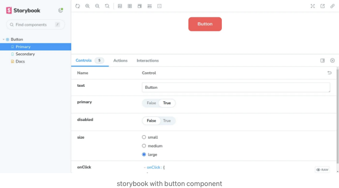

## Husky

Husky는 Git 리포지토리에서 미리 커밋 후크를 강제로 적용하도록 주로 설계되었으며, 코드 포맷팅, 테스트 실행, 린트 등과 같은 특정 작업이 허용되기 전에 수행되도록 보장합니다.

Husky를 프리 커밋 후크와 함께 구성하려면 다음 명령어를 실행하세요:

<!-- ui-log 수평형 -->
<ins class="adsbygoogle"
  style="display:block"
  data-ad-client="ca-pub-4877378276818686"
  data-ad-slot="9743150776"
  data-ad-format="auto"
  data-full-width-responsive="true"></ins>
<component is="script">
(adsbygoogle = window.adsbygoogle || []).push({});
</component>

```js
npm install -D husky lint-staged
npx husky install
```

이제 .husky 폴더 안에 pre-commit 훅이라는 파일을 생성하고 다음 내용을 추가하세요:

```js
#!/bin/sh
. "$(dirname "$0")/_/husky.sh"

npx lint-staged
```

다음 구성을 package.json 파일에 추가하세요:

<!-- ui-log 수평형 -->
<ins class="adsbygoogle"
  style="display:block"
  data-ad-client="ca-pub-4877378276818686"
  data-ad-slot="9743150776"
  data-ad-format="auto"
  data-full-width-responsive="true"></ins>
<component is="script">
(adsbygoogle = window.adsbygoogle || []).push({});
</component>

```js
"lint-staged": {
  "*.{ts,tsx}": [
    "npm run format",
    "npm run lint",
    "npm run test"
  ]
}
```

이제 우리가 git commit을 사용하여 변경 사항을 커밋할 때, Husky가 자동으로 lint-staged를 실행하고, 이에 테하여 스테이징된 파일에서 우리가 지정한 서식 지정 및 린팅 스크립트를 실행할 것입니다.

# NPM 및 GitHub 레지스트리에 라이브러리 발행하기

## GitHub에 게시하기

<!-- ui-log 수평형 -->
<ins class="adsbygoogle"
  style="display:block"
  data-ad-client="ca-pub-4877378276818686"
  data-ad-slot="9743150776"
  data-ad-format="auto"
  data-full-width-responsive="true"></ins>
<component is="script">
(adsbygoogle = window.adsbygoogle || []).push({});
</component>

프로젝트의 package.json에 GitHub 패키지 레지스트리를 레지스트리로 지정하는 publishConfig 섹션을 추가해주세요. {USER_NAME}과 {repo-name}을 귀하의 실제 GitHub 사용자 이름과 저장소 이름으로 바꿔주세요. 아래는 예시입니다:

```js
"publishConfig": {
  "registry": "https://npm.pkg.github.com/@{USER_NAME}"
},
"name": "@{user_name}/{repo-name}",
```

GITHUB_TOKEN의 권한을 수정하는 방법: GitHub 저장소로 이동하여 설정을 클릭한 후 Actions로 이동해주세요. 일반 섹션에서 읽기 및 쓰기 권한이 허용되었는지 확인한 후 저장을 클릭해주세요.

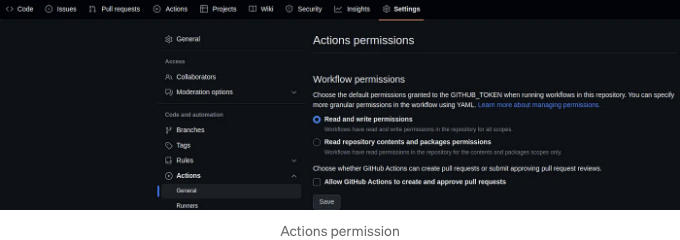

<!-- ui-log 수평형 -->
<ins class="adsbygoogle"
  style="display:block"
  data-ad-client="ca-pub-4877378276818686"
  data-ad-slot="9743150776"
  data-ad-format="auto"
  data-full-width-responsive="true"></ins>
<component is="script">
(adsbygoogle = window.adsbygoogle || []).push({});
</component>

프로젝트 루트 디렉터리에 .github/workflows 폴더가 이미 존재하지 않는 경우 생성해주세요.

해당 폴더 안에 publish-package.yml이라는 파일을 생성하세요. 아래 내용을 파일 안에 추가해주세요. 여기서 USER_NAME 자리에 자신의 사용자 이름을 넣어주세요.

여기서 GITHUB_TOKEN은 GitHub Actions에서 자동으로 제공되며, 패키지를 게시할 때 인증에 사용됩니다.

```js
name: publish on github

on:
  push:
    branches:
      - master

jobs:
  publish-gpr:
    runs-on: ubuntu-latest
    steps:
      - uses: actions/checkout@v2
      - uses: actions/setup-node@v1
        with:
          node-version: 18
          registry-url: https://npm.pkg.github.com/
          scope: "@{USER_NAME}"
      - run: npm install
      - run: npm run test
      - run: npm run build
      - run: npm publish
        env:
          NODE_AUTH_TOKEN: ${secrets.GITHUB_TOKEN}
```

<!-- ui-log 수평형 -->
<ins class="adsbygoogle"
  style="display:block"
  data-ad-client="ca-pub-4877378276818686"
  data-ad-slot="9743150776"
  data-ad-format="auto"
  data-full-width-responsive="true"></ins>
<component is="script">
(adsbygoogle = window.adsbygoogle || []).push({});
</component>

그래서 한 번 master 브랜치로 푸시하면, 이 워크플로우가 자동으로 실행되고 패키지가 게시됩니다.

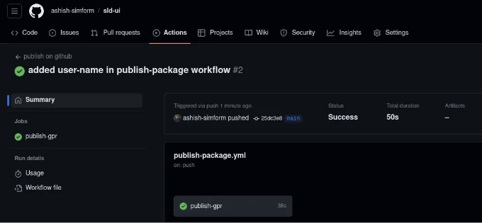

GitHub 저장소의 Packages 섹션에서 라이브러리를 찾을 수 있습니다.

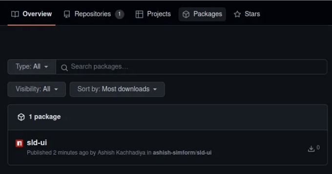

<!-- ui-log 수평형 -->
<ins class="adsbygoogle"
  style="display:block"
  data-ad-client="ca-pub-4877378276818686"
  data-ad-slot="9743150776"
  data-ad-format="auto"
  data-full-width-responsive="true"></ins>
<component is="script">
(adsbygoogle = window.adsbygoogle || []).push({});
</component>

만약 에러가 발생하면 제 깃허브를 참고해주세요.

## NPM에 발행하기

먼저 npmjs.com에서 계정을 만든 다음 프로필 설정으로 이동하여 Access Tokens을 클릭합니다.

이제 Generate Token을 클릭하고 Classic Token을 선택하세요.

<!-- ui-log 수평형 -->
<ins class="adsbygoogle"
  style="display:block"
  data-ad-client="ca-pub-4877378276818686"
  data-ad-slot="9743150776"
  data-ad-format="auto"
  data-full-width-responsive="true"></ins>
<component is="script">
(adsbygoogle = window.adsbygoogle || []).push({});
</component>

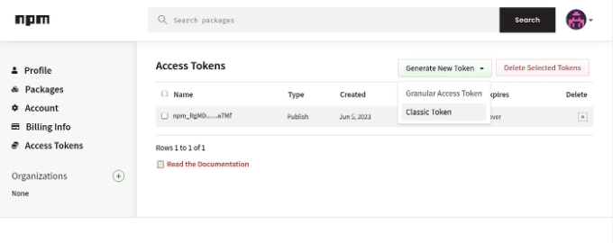

이제 토큰의 이름을 제공하고 유형을 자동화로 선택하면 토큰이 생성됩니다.

다음으로 깃허브 저장소의 설정으로 이동하고, 시크릿과 변수 섹션 내에서 Actions로 이동합니다. 새 저장소 시크릿을 클릭한 후 시크릿의 이름을 제공하세요 (이 이름은 워크플로 내에서 토큰에 액세스하는 데 사용됩니다) 그리고 추가 시크릿을 클릭하세요.

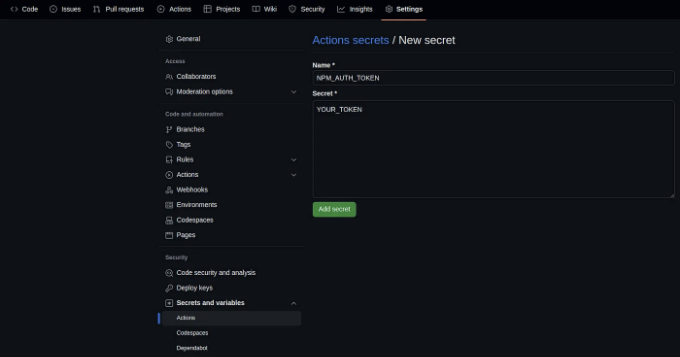

<!-- ui-log 수평형 -->
<ins class="adsbygoogle"
  style="display:block"
  data-ad-client="ca-pub-4877378276818686"
  data-ad-slot="9743150776"
  data-ad-format="auto"
  data-full-width-responsive="true"></ins>
<component is="script">
(adsbygoogle = window.adsbygoogle || []).push({});
</component>

package.json에 준비 스크립트를 추가하여 패키지를 게시 준비할 때 실행되는 명령을 지정해야 해요.

```js
{
  ...
  "scripts": {
     "prepare": "npm run build"
  },
  ...
}
```

프로젝트의 루트 디렉토리에서 .github/workflows 폴더를 생성해 주세요. 이미 존재한다면 무시하세요. 그 폴더 안에 npm-publish.yml이라는 파일을 생성하고 아래 내용을 입력해 주세요.

```js
name: publish npm

on:
  push:
    branches:
      - main

jobs:
  publish:
    runs-on: ubuntu-latest
    steps:
      - name: Checkout code
        uses: actions/checkout@v2

      - name: Setup Node.js
        uses: actions/setup-node@v2
        with:
          node-version: 18
          registry-url: https://registry.npmjs.org/

      - name: Install dependencies
        run: npm install

      - name: Publish to npm
        run: npm publish --access public
        env:
          NODE_AUTH_TOKEN: ${secrets.NPM_AUTH_TOKEN}
```

<!-- ui-log 수평형 -->
<ins class="adsbygoogle"
  style="display:block"
  data-ad-client="ca-pub-4877378276818686"
  data-ad-slot="9743150776"
  data-ad-format="auto"
  data-full-width-responsive="true"></ins>
<component is="script">
(adsbygoogle = window.adsbygoogle || []).push({});
</component>

메인 브랜치에 푸시하면이 워크플로우가 자동으로 실행되어 패키지가 게시됩니다.

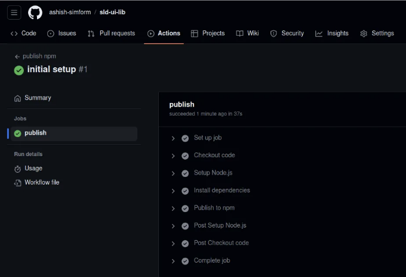

계정의 패키지 섹션을 확인하면 패키지가 표시됩니다.

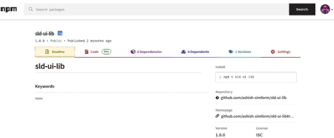

<!-- ui-log 수평형 -->
<ins class="adsbygoogle"
  style="display:block"
  data-ad-client="ca-pub-4877378276818686"
  data-ad-slot="9743150776"
  data-ad-format="auto"
  data-full-width-responsive="true"></ins>
<component is="script">
(adsbygoogle = window.adsbygoogle || []).push({});
</component>

어려움을 겪는 경우 도움을 위해 내 저장소를 참고할 수 있어요.

# 다른 프로젝트에서 테스트를 위해 로컬 라이브러리 사용하기

로컬에서 라이브러리를 테스트하려면 example이라는 디렉토리를 만들고 해당 디렉토리에서 다음 명령을 실행하여 React 앱을 초기화합니다:

```js
npm create vite@latest . -- --template react-ts
npm install
```

<!-- ui-log 수평형 -->
<ins class="adsbygoogle"
  style="display:block"
  data-ad-client="ca-pub-4877378276818686"
  data-ad-slot="9743150776"
  data-ad-format="auto"
  data-full-width-responsive="true"></ins>
<component is="script">
(adsbygoogle = window.adsbygoogle || []).push({});
</component>

지금 루트 디렉터리로 이동해서 다음 명령어로 npm 패키지를 빌드해주세요:

```js
npm run build
```

예제 앱과 동일한 React 버전을 사용하고 있는지 확인하기 위해 루트 디렉터리에서 다음 명령어를 실행해주세요:

```js
npm link "./example/node_modules/react"
```

<!-- ui-log 수평형 -->
<ins class="adsbygoogle"
  style="display:block"
  data-ad-client="ca-pub-4877378276818686"
  data-ad-slot="9743150776"
  data-ad-format="auto"
  data-full-width-responsive="true"></ins>
<component is="script">
(adsbygoogle = window.adsbygoogle || []).push({});
</component>

위 예시 앱의 디렉토리로 돌아가서 npm 패키지를 예시 앱에 연결하세요. 이때 package.json에 지정한 패키지 이름을 사용하시면 됩니다. {package-name} 부분은 패키지의 이름으로 대체해주세요.

```js
npm link {package-name}
```

아래 명령어를 사용하여 패키지가 연결되었는지 확인할 수 있습니다:

```js
npm ls --location=global --depth=0 --link=true
```

<!-- ui-log 수평형 -->
<ins class="adsbygoogle"
  style="display:block"
  data-ad-client="ca-pub-4877378276818686"
  data-ad-slot="9743150776"
  data-ad-format="auto"
  data-full-width-responsive="true"></ins>
<component is="script">
(adsbygoogle = window.adsbygoogle || []).push({});
</component>

이제 라이브러리에서 UI 컴포넌트를 가져와 로컬에서 쉽게 테스트해보세요.

```js
//App.tsx
import { Button } from "sld-ui-lib"; //라이브러리 이름으로 변경하기

function App() {
  return <Button text="버튼" />;
}

export default App;
```

npm run dev 명령을 실행한 후에 로컬로 배포된 패키지를 테스트할 수 있습니다.

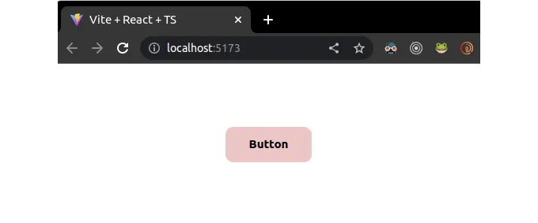

<!-- ui-log 수평형 -->
<ins class="adsbygoogle"
  style="display:block"
  data-ad-client="ca-pub-4877378276818686"
  data-ad-slot="9743150776"
  data-ad-format="auto"
  data-full-width-responsive="true"></ins>
<component is="script">
(adsbygoogle = window.adsbygoogle || []).push({});
</component>

# 다른 프로젝트에서 Published 라이브러리 사용하기

예제라는 디렉토리를 만들고 다음 명령어를 실행하여 React 앱을 초기화하세요:

```js
npm create vite@latest . -- --template react-ts
```

## Npm 레지스트리 사용하기

<!-- ui-log 수평형 -->
<ins class="adsbygoogle"
  style="display:block"
  data-ad-client="ca-pub-4877378276818686"
  data-ad-slot="9743150776"
  data-ad-format="auto"
  data-full-width-responsive="true"></ins>
<component is="script">
(adsbygoogle = window.adsbygoogle || []).push({});
</component>

npm 레지스트리에서 패키지를 설치하려면 다음 명령을 사용할 수 있어요:

```js
npm install sld-ui-lib
```

이 명령은 npm 레지스트리에서 sld-ui-lib라는 패키지를 설치합니다.

## Github 레지스트리 사용하기

<!-- ui-log 수평형 -->
<ins class="adsbygoogle"
  style="display:block"
  data-ad-client="ca-pub-4877378276818686"
  data-ad-slot="9743150776"
  data-ad-format="auto"
  data-full-width-responsive="true"></ins>
<component is="script">
(adsbygoogle = window.adsbygoogle || []).push({});
</component>

GitHub 패키지 레지스트리에서 패키지에 액세스하기 위해 GitHub에서 개인 액세스 토큰을 얻으려면 다음 단계를 따르세요:

- GitHub에 로그인하고 계정에 서명합니다.
- 오른쪽 상단 모서리에서 프로필 사진을 클릭하고 설정을 선택합니다.
- 왼쪽 사이드바에서 개발자 설정을 클릭합니다.
- 액세스 토큰 아래에 있는 개인 액세스 토큰을 클릭합니다.
- 다음으로, "새 토큰 생성" 버튼을 클릭합니다.
- 토큰 이름 필드에 토큰 이름을 제공합니다.
- 선택한 스코프에서 사용 사례에 필요한 권한을 선택합니다. GitHub 패키지 레지스트리의 패키지에 액세스하려면 일반적으로 read:packages 권한이 필요합니다.
- 설정 구성 후 페이지 하단의 "토큰 생성" 버튼을 클릭합니다.
- GitHub이 개인 액세스 토큰을 생성해줍니다.

이 개인 액세스 토큰을 사용하여 GitHub 패키지 레지스트리와 인증할 때 npm 또는 yarn 구성에서 사용할 수 있습니다.

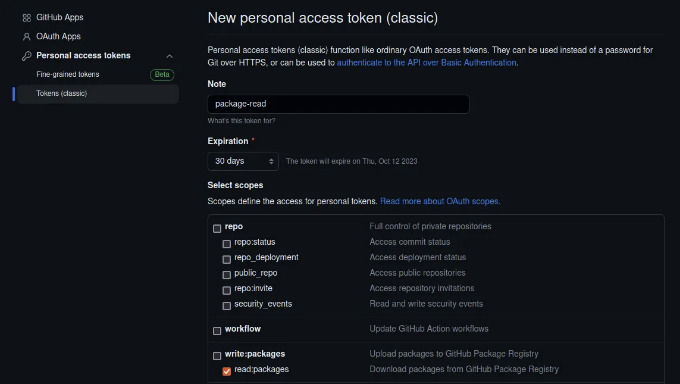

<!-- ui-log 수평형 -->
<ins class="adsbygoogle"
  style="display:block"
  data-ad-client="ca-pub-4877378276818686"
  data-ad-slot="9743150776"
  data-ad-format="auto"
  data-full-width-responsive="true"></ins>
<component is="script">
(adsbygoogle = window.adsbygoogle || []).push({});
</component>

GitHub 패키지 레지스트리에서 패키지를 설치하려면 프로젝트에 .npmrc 파일을 만들고 아래 구성을 추가하세요. 여기서 GITHUB_USER_NAME을(를) 여러분의 GitHub 사용자명으로 바꿔주세요.

```js
@GITHUB_USER_NAME:registry=https://npm.pkg.github.com
//npm.pkg.github.com/:_authToken=${NPM_TOKEN}
```

이 파일에 액세스 토큰을 직접 포함시키지 않아야 합니다. 왜냐하면 Git으로 추적될 수 있기 때문입니다. 대신 터미널을 열고 npm 토큰을 위한 환경 변수를 설정하세요. 실제 토큰을 사용하여 다음 명령을 실행하세요:

```js
export NPM_TOKEN=YOUR_TOKEN
```

<!-- ui-log 수평형 -->
<ins class="adsbygoogle"
  style="display:block"
  data-ad-client="ca-pub-4877378276818686"
  data-ad-slot="9743150776"
  data-ad-format="auto"
  data-full-width-responsive="true"></ins>
<component is="script">
(adsbygoogle = window.adsbygoogle || []).push({});
</component>

이 내용을 친절한 한국어로 번역해 드리겠습니다.

셸 프로필 (예: .bashrc, .zshrc)에 이 내보내기 명령을 추가하는 것이 좋습니다. 그러면 npm 명령을 실행할 때 ${NPM_TOKEN}을 환경 변수에서 실제 토큰으로 자동으로 대체할 수 있습니다.

GitHub 사용자 이름인 your-username과 라이브러리 이름인 package-name을 사용하여 해당 명령을 실행해 보세요. 레지스트리에서 패키지를 설치할 것입니다.

```js
npm install @your-username/package-name
```

<!-- ui-log 수평형 -->
<ins class="adsbygoogle"
  style="display:block"
  data-ad-client="ca-pub-4877378276818686"
  data-ad-slot="9743150776"
  data-ad-format="auto"
  data-full-width-responsive="true"></ins>
<component is="script">
(adsbygoogle = window.adsbygoogle || []).push({});
</component>

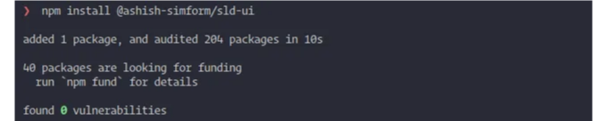

# 팀 액세스용 Storybook 배포하기

우리는 Storybook을 배포하기 위해 Netlify를 사용할 것입니다.

먼저 GitHub을 통해 Netlify에 계정을 만들고 저장소를 선택하세요. 이제 아래 이미지와 같이 구성을 추가하세요.

<!-- ui-log 수평형 -->
<ins class="adsbygoogle"
  style="display:block"
  data-ad-client="ca-pub-4877378276818686"
  data-ad-slot="9743150776"
  data-ad-format="auto"
  data-full-width-responsive="true"></ins>
<component is="script">
(adsbygoogle = window.adsbygoogle || []).push({});
</component>

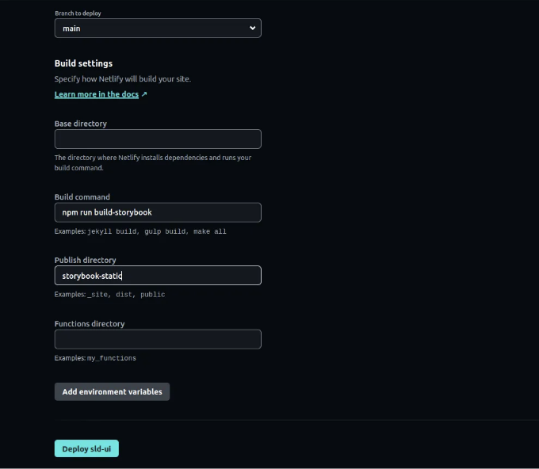

여기서 우리는 Storybook을 위한 정적 파일을 생성하기 위해 npm run build-storybook을 실행하고, 이 파일들은 storybook-static 디렉토리에 배치될 것입니다.

‘deploy’를 클릭하면, Storybook이 Netlify에 성공적으로 배포됩니다.

# 마무리

<!-- ui-log 수평형 -->
<ins class="adsbygoogle"
  style="display:block"
  data-ad-client="ca-pub-4877378276818686"
  data-ad-slot="9743150776"
  data-ad-format="auto"
  data-full-width-responsive="true"></ins>
<component is="script">
(adsbygoogle = window.adsbygoogle || []).push({});
</component>

이 포괄적인 가이드에서는 프로젝트 설정, 테스팅, 게시, 배포 및 로컬 테스트에 필요한 중요한 도구와 최상의 실천 방법에 대해 다루었습니다. 이러한 단계를 따르면 여러 프로젝트와 팀에서 사용할 수 있는 재사용 가능하고 견고한 React 컴포넌트를 만들 수 있습니다. 오픈 소스 라이브러리를 만드는 경우든 내부 UI 툴킷을 구축하는 경우든, 이제 공유 가능한 React 컴포넌트를 개발하기 위한 탄탄한 기반을 갖게 되었습니다.

이 컴포넌트 라이브러리 프로젝트의 특정 요구 사항에 맞게 이러한 방법을 적응하고 확장하는 것은 자유롭게 하세요. 즐거운 코딩되세요!