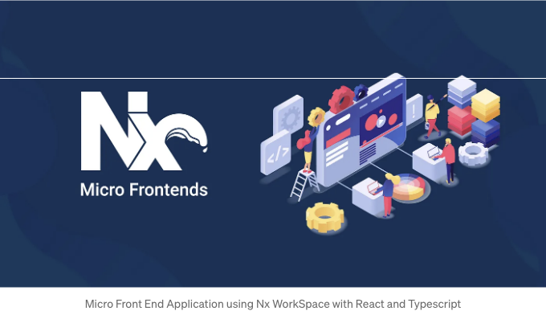
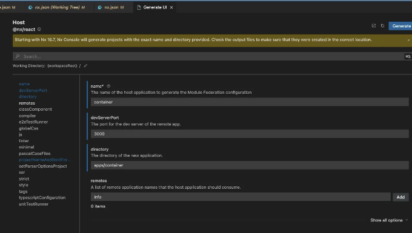
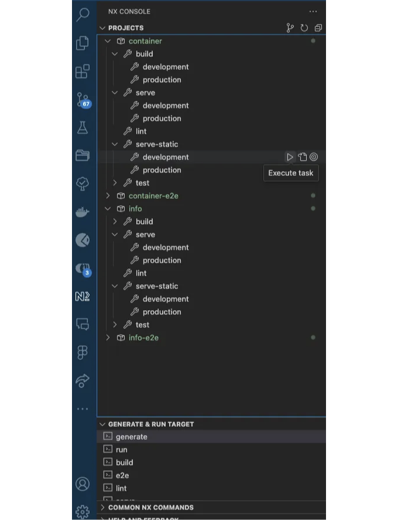

현재 개발 환경에서는 확장 가능하고 모듈식 애플리케이션을 구축하기 위한 인기 있는 접근 방식인 마이크로 프런트엔드 아키텍처를 만드는 것이 일반적입니다. Nx Workspace은 이러한 아키텍처를 효율적으로 구현할 수 있는 강력한 플랫폼을 제공합니다. 이 튜토리얼에서는 Nx Workspace를 사용하여 마이크로 프런트엔드 아키텍처를 구축하는 과정, 호스트 및 원격 응용 프로그램 생성, 그리고 그들 간에 코드 공유에 대해 안내합니다.

# 최종 구현에 대한 링크

마이크로 프런트엔드 아키텍처의 최종 구현은 다음 저장소 커밋에서 확인할 수 있습니다:

<!-- ui-log 수평형 -->
<ins class="adsbygoogle"
  style="display:block"
  data-ad-client="ca-pub-4877378276818686"
  data-ad-slot="9743150776"
  data-ad-format="auto"
  data-full-width-responsive="true"></ins>
<component is="script">
(adsbygoogle = window.adsbygoogle || []).push({});
</component>

- 마이크로 프런트 엔드 설정
- Netlify에서 프로덕션을 위한 'info' 모듈의 원격 URL 업데이트
- netlify.toml에 리디렉션 규칙 추가 및 Netlify에서 Cors 오류 수정

# 소개

이 튜토리얼은 Nx Workspace를 사용하여 마이크로 프런트 엔드 아키텍처를 생성하는 과정을 안내합니다. Nx Workspace를 사용하여 호스트 및 원격 애플리케이션을 생성하고, 애플리케이션 간에 코드를 공유하기 위해 패키지를 사용할 것입니다. 이 튜토리얼을 완료하면 마이크로 프런트 엔드 아키텍처를 만드는 방법에 대한 sol이해를 얻을 것입니다.

# 준비사항

<!-- ui-log 수평형 -->
<ins class="adsbygoogle"
  style="display:block"
  data-ad-client="ca-pub-4877378276818686"
  data-ad-slot="9743150776"
  data-ad-format="auto"
  data-full-width-responsive="true"></ins>
<component is="script">
(adsbygoogle = window.adsbygoogle || []).push({});
</component>

시작하기 전에 다음 사항을 준비해 두세요:

- ESLint, Prettier, 그리고 Husky 구성이 포함된 Nx Workspace를 생성하기 위한 베이스 리포지토리.

## 워크스페이스 설정하기

- 다음 명령어를 실행하여 apps 폴더에 있는 기존 애플리케이션을 모두 제거하세요:

<!-- ui-log 수평형 -->
<ins class="adsbygoogle"
  style="display:block"
  data-ad-client="ca-pub-4877378276818686"
  data-ad-slot="9743150776"
  data-ad-format="auto"
  data-full-width-responsive="true"></ins>
<component is="script">
(adsbygoogle = window.adsbygoogle || []).push({});
</component>

```js
rm -rf apps/*
```

- 다음과 같이 package.json 파일이 구성되어 있는지 확인하세요:

```js
{
  "name": "@mfe-tutorial/source",
  "version": "0.0.0",
  "license": "MIT",
  "scripts": {
    "lint": "pnpm exec nx run-many --target=lint --all",
    "prepare": "husky"
  },
  "private": true,
  "dependencies": {
    "react": "18.2.0",
    "react-dom": "18.2.0",
    "react-router-dom": "6.11.2",
    "tslib": "^2.3.0"
  },
  "devDependencies": {
    "@babel/core": "^7.14.5",
    "@babel/preset-react": "^7.14.5",
    ... (중략)
    "vitest": "~0.32.0"
  }
}
```

- 다음 명령어를 실행하여 종속성을 설치하세요:

<!-- ui-log 수평형 -->
<ins class="adsbygoogle"
  style="display:block"
  data-ad-client="ca-pub-4877378276818686"
  data-ad-slot="9743150776"
  data-ad-format="auto"
  data-full-width-responsive="true"></ins>
<component is="script">
(adsbygoogle = window.adsbygoogle || []).push({});
</component>

- `package-lock.json`, `yarn.lock`, `pnpm-lock.yaml`, 그리고 `node_modules` 폴더를 삭제해야 해요. 아래 명령어를 사용해서 이 파일들과 폴더를 삭제할 수 있어요.

```js
rm -rf package-lock.json yarn.lock pnpm-lock.yaml node_modules
```

- 이제 다음 명령어를 사용해서 의존성을 설치할 수 있어요.

```js
# pnpm을 사용하는 경우
pnpm install

# yarn을 사용하는 경우
yarn install

# npm을 사용하는 경우
npm install
```

<!-- ui-log 수평형 -->
<ins class="adsbygoogle"
  style="display:block"
  data-ad-client="ca-pub-4877378276818686"
  data-ad-slot="9743150776"
  data-ad-format="auto"
  data-full-width-responsive="true"></ins>
<component is="script">
(adsbygoogle = window.adsbygoogle || []).push({});
</component>

축하합니다! 종속성을 성공적으로 설치했습니다.

# 호스트 애플리케이션 생성

- 다음 명령을 실행하여 호스트 및 원격 애플리케이션을 생성해보세요:

호스트 애플리케이션은 container로, 원격 애플리케이션은 info로 지칭합니다. 이 스크립트를 따라갈 수 있습니다.

<!-- ui-log 수평형 -->
<ins class="adsbygoogle"
  style="display:block"
  data-ad-client="ca-pub-4877378276818686"
  data-ad-slot="9743150776"
  data-ad-format="auto"
  data-full-width-responsive="true"></ins>
<component is="script">
(adsbygoogle = window.adsbygoogle || []).push({});
</component>

```js
pnpm exec nx generate @nx/react:host --name=container --devServerPort=3000 --directory=apps/container --remotes=info --projectNameAndRootFormat=as-provided --no-interactive --dry-run
```



- 호스트 및 원격 애플리케이션을 생성한 후에는 다음 명령을 사용하여 린팅을 실행하십시오.

```js
// package.json
  "scripts": {
    "lint": "pnpm exec nx run-many --target=lint --all"
  },
```

<!-- ui-log 수평형 -->
<ins class="adsbygoogle"
  style="display:block"
  data-ad-client="ca-pub-4877378276818686"
  data-ad-slot="9743150776"
  data-ad-format="auto"
  data-full-width-responsive="true"></ins>
<component is="script">
(adsbygoogle = window.adsbygoogle || []).push({});
</component>

```js
pnpm run lint
# 또는
yarn lint
# 또는
npm run lint
```

```js
pnpm run lint --fix
```

축하드려요! 린트 오류와 경고를 성공적으로 수정했습니다.

# 핫 리로드 및 개발

<!-- ui-log 수평형 -->
<ins class="adsbygoogle"
  style="display:block"
  data-ad-client="ca-pub-4877378276818686"
  data-ad-slot="9743150776"
  data-ad-format="auto"
  data-full-width-responsive="true"></ins>
<component is="script">
(adsbygoogle = window.adsbygoogle || []).push({});
</component>

호스트 및 원격 애플리케이션을 실행하는 다음 단계입니다. package.json 파일에 다음 스크립트를 추가할 수 있어요.

```js
"scripts": {
  "dev:container": "pnpm exec nx run container:serve --configuration=development",
  "dev:info": "pnpm exec nx run info:serve --configuration=development",
},
```

- 이제 다음 명령어를 사용하여 호스트 및 원격 애플리케이션을 실행할 수 있어요. 원격 애플리케이션에서 개발 작업을 할 수 있다면 먼저 dev:info를 실행한 다음 호스트 애플리케이션을 위해 dev:container를 실행하세요. 변경 사항에 대한 실시간 새로고침이 자동으로 연결됩니다.

```js
pnpm run dev:info
```

<!-- ui-log 수평형 -->
<ins class="adsbygoogle"
  style="display:block"
  data-ad-client="ca-pub-4877378276818686"
  data-ad-slot="9743150776"
  data-ad-format="auto"
  data-full-width-responsive="true"></ins>
<component is="script">
(adsbygoogle = window.adsbygoogle || []).push({});
</component>

```js
pnpm run dev:container
```

# 프로덕션 빌드

호스트 및 원격 애플리케이션을 실행하는 마지막 단계입니다. package.json 파일에 다음 스크립트를 추가할 수 있습니다.

```js
"scripts": {
    "serve:container": "pnpm exec nx run container:serve-static --configuration=production",
    "serve:info": "pnpm exec nx run info:serve-static --configuration=production",
  },
```

<!-- ui-log 수평형 -->
<ins class="adsbygoogle"
  style="display:block"
  data-ad-client="ca-pub-4877378276818686"
  data-ad-slot="9743150776"
  data-ad-format="auto"
  data-full-width-responsive="true"></ins>
<component is="script">
(adsbygoogle = window.adsbygoogle || []).push({});
</component>

- 이제 다음 명령어를 사용하여 호스트 및 원격 애플리케이션을 실행할 수 있어요.

```js
pnpm run serve:info
```

```js
pnpm run serve:container
```



<!-- ui-log 수평형 -->
<ins class="adsbygoogle"
  style="display:block"
  data-ad-client="ca-pub-4877378276818686"
  data-ad-slot="9743150776"
  data-ad-format="auto"
  data-full-width-responsive="true"></ins>
<component is="script">
(adsbygoogle = window.adsbygoogle || []).push({});
</component>

🎉 축하합니다! React 애플리케이션을 성공적으로 만들었습니다.

# 결론

이 튜토리얼에서는 Nx Workspace를 사용하여 마이크로 프론트엔드 아키텍처를 만드는 방법을 배웠습니다. Nx Workspace를 사용하여 호스트 및 원격 애플리케이션을 만들고 이들 사이에 코드를 공유했습니다. 이 튜토리얼에 나열된 단계를 따라서 응용 프로그램을 위한 확장 가능하고 모듈식 마이크로 프론트엔드 아키텍처를 만들 수 있습니다.

이 튜토리얼은 Nx Workspace를 사용한 마이크로 프론트엔드 아키텍처를 구축하는 데 견고한 기반을 제공했습니다. 이제 더 많은 고급 기능과 구성을 탐색하여 마이크로 프론트엔드 아키텍처를 더욱 강화할 수 있습니다.

<!-- ui-log 수평형 -->
<ins class="adsbygoogle"
  style="display:block"
  data-ad-client="ca-pub-4877378276818686"
  data-ad-slot="9743150776"
  data-ad-format="auto"
  data-full-width-responsive="true"></ins>
<component is="script">
(adsbygoogle = window.adsbygoogle || []).push({});
</component>

감사합니다! 🚀

# 참고 자료

- Nx 워크스페이스
- Nx 모듈 연맹
- Nx 콘솔
- React
- React Router
- TypeScript
- ESLint 규칙
- Prettier 규칙
- Netlify
- Netlify Redirects
- Netlify Headers
- Netlify Functions

# 간단한 설명 🚀

<!-- ui-log 수평형 -->
<ins class="adsbygoogle"
  style="display:block"
  data-ad-client="ca-pub-4877378276818686"
  data-ad-slot="9743150776"
  data-ad-format="auto"
  data-full-width-responsive="true"></ins>
<component is="script">
(adsbygoogle = window.adsbygoogle || []).push({});
</component>

인 플레인 영어 커뮤니티의 일원이 되어 주셔서 감사합니다! 떠나시기 전에:

- 작가를 클랩(clap)하고 팔로우하세요 👏️️
- 팔로우하기: X | LinkedIn | YouTube | Discord | Newsletter
- 다른 플랫폼 방문하기: Stackademic | CoFeed | Venture | Cubed
- PlainEnglish.io에서 더 많은 콘텐츠를 확인하세요