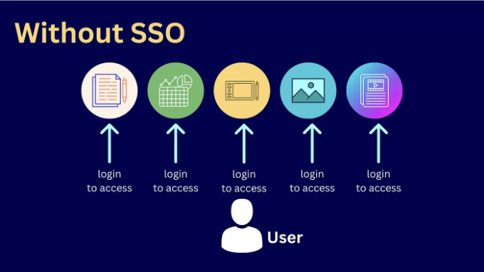
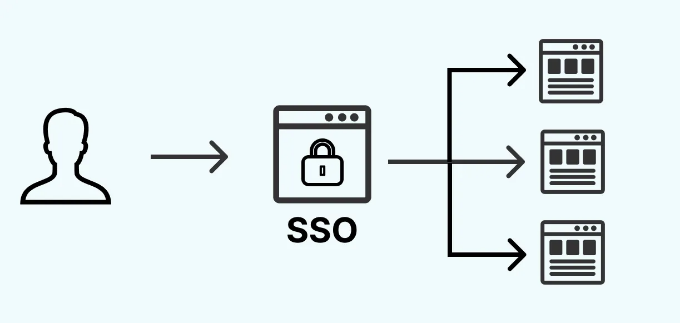

싱글 사인 온(SSO)은 현대 웹 개발에서 중요한 구성 요소로, 사용자 경험을 향상시키는 역할을 합니다. 하나의 자격 증명 집합으로 여러 애플리케이션 간에 원활한 인증을 가능하게 함으로써 사용자에게 많은 혜택을 제공합니다. React를 사용하여 인기있는 OAuth 2.0과 같은 인증 프로토콜을 활용하여 기본 SSO 애플리케이션을 만들어 봅시다.

# SSO란?

싱글 사인 온(SSO)은 사용자가 하나의 로그인 자격 증명으로 여러 애플리케이션이나 서비스에 액세스할 수 있도록 하는 인증 프로세스입니다. 기존의 인증 모델에서는 사용자가 각각의 애플리케이션에 별도로 로그인해야 했고, 각 애플리케이션마다 사용자 이름과 암호를 제공해야 했습니다. SSO는 사용자가 한 번 인증하고 반복 로그인 없이 여러 서비스에 액세스할 수 있도록 하는 방식으로 이 프로세스를 간소화합니다.

SSO의 주요 구성 요소:

<!-- ui-log 수평형 -->
<ins class="adsbygoogle"
  style="display:block"
  data-ad-client="ca-pub-4877378276818686"
  data-ad-slot="9743150776"
  data-ad-format="auto"
  data-full-width-responsive="true"></ins>
<component is="script">
(adsbygoogle = window.adsbygoogle || []).push({});
</component>

- Identity Provider (IdP): 사용자를 인증하고 신원 정보를 제공하는 주체입니다. IdP는 사용자의 신원을 증명하는 데 사용할 수있는 토큰이나 주장을 발행합니다.
- Service Provider (SP): 인증을 위해 IdP에 의존하는 응용 프로그램이나 서비스입니다. SP는 IdP가 제공한 신원 정보를 신뢰하고 해당 신뢰에 기초하여 액세스를 부여합니다.
- User: 서비스에 액세스하려는 개인입니다. 사용자는 IdP와 인증을 수행하고, IdP는 그들의 신원을 SP에 대해 보증합니다.

SSO를 구현하는 이유:

- 암호 부담 감소
- 효율적인 액세스
- 중앙화 된 인증
- 암호 공유 감소
- 사용자 관리 간소화
- 간소화 된 온보딩 및 오프보딩
- 중앙 집중식 감사
- 규정 요구 사항
- 빠른 액세스
- 다운타임 감소

SSO없이

<!-- ui-log 수평형 -->
<ins class="adsbygoogle"
  style="display:block"
  data-ad-client="ca-pub-4877378276818686"
  data-ad-slot="9743150776"
  data-ad-format="auto"
  data-full-width-responsive="true"></ins>
<component is="script">
(adsbygoogle = window.adsbygoogle || []).push({});
</component>



# 전제 조건:

시작하기 전에 다음 도구 및 기술이 설치되어 있는지 확인하십시오:

- Node.js 및 npm
- React.js
- 텍스트 편집기(예: Visual Studio Code)

<!-- ui-log 수평형 -->
<ins class="adsbygoogle"
  style="display:block"
  data-ad-client="ca-pub-4877378276818686"
  data-ad-slot="9743150776"
  data-ad-format="auto"
  data-full-width-responsive="true"></ins>
<component is="script">
(adsbygoogle = window.adsbygoogle || []).push({});
</component>

# React 앱 설정하기

```js
npx create-react-app sso-app
cd sso-app
```

# 종속성 설치하기

인증 및 라우팅을 처리하기 위한 필요한 종속성을 설치하세요.

<!-- ui-log 수평형 -->
<ins class="adsbygoogle"
  style="display:block"
  data-ad-client="ca-pub-4877378276818686"
  data-ad-slot="9743150776"
  data-ad-format="auto"
  data-full-width-responsive="true"></ins>
<component is="script">
(adsbygoogle = window.adsbygoogle || []).push({});
</component>

```js
npm install react-router-dom axios
```

# 인증 서비스 생성하기:

인증을 처리할 AuthService.js 파일을 만드세요. 이 서비스는 인증 서버와 상호 작용하고 사용자 세션을 관리할 것입니다.

```js
// AuthService.js
import axios from 'axios';

const API_URL = 'https://your-auth-server.com';

class AuthService {
  login(username, password) {
    return axios.post(`${API_URL}/login`, { username, password })
      .then(response => {
        if (response.data.accessToken) {
          localStorage.setItem('user', JSON.stringify(response.data));
        }
        return response.data;
      });
  }

  logout() {
    localStorage.removeItem('user');
  }

  getCurrentUser() {
    return JSON.parse(localStorage.getItem('user'));
  }
}

export default new AuthService();
```

<!-- ui-log 수평형 -->
<ins class="adsbygoogle"
  style="display:block"
  data-ad-client="ca-pub-4877378276818686"
  data-ad-slot="9743150776"
  data-ad-format="auto"
  data-full-width-responsive="true"></ins>
<component is="script">
(adsbygoogle = window.adsbygoogle || []).push({});
</component>

`https://your-auth-server.com` 을 귀하의 인증 서버의 실제 URL로 대체하여 주세요.

# 로그인 컴포넌트 구현

사용자 로그인을 처리하는 로그인 컴포넌트를 만들어보세요:

```js
// Login.js
import React, { useState } from 'react';
import AuthService from './AuthService';

const Login = ({ history }) => {
  const [username, setUsername] = useState('');
  const [password, setPassword] = useState('');

  const handleLogin = () => {
    AuthService.login(username, password)
      .then(() => {
        history.push('/');
      })
      .catch(error => {
        console.error('로그인 실패:', error);
      });
  };

  return (
    <div>
      <h2>로그인</h2>
      <form>
        <label>사용자명:</label>
        <input type="text" value={username} onChange={(e) => setUsername(e.target.value)} />

        <label>비밀번호:</label>
        <input type="password" value={password} onChange={(e) => setPassword(e.target.value)} />

        <button type="button" onClick={handleLogin}>로그인</button>
      </form>
    </div>
  );
};

export default Login;
```

<!-- ui-log 수평형 -->
<ins class="adsbygoogle"
  style="display:block"
  data-ad-client="ca-pub-4877378276818686"
  data-ad-slot="9743150776"
  data-ad-format="auto"
  data-full-width-responsive="true"></ins>
<component is="script">
(adsbygoogle = window.adsbygoogle || []).push({});
</component>

# 보호 구성 요소 구현하기

인증이 필요한 보호된 경로를 나타내는 'Protected' 컴포넌트를 생성해보세요:

```js
// Protected.js
import React from 'react';
import AuthService from './AuthService';

const Protected = () => {
  const user = AuthService.getCurrentUser();

  if (!user) {
    return (
      <div>
        <h2>접근 거부</h2>
        <p>이 페이지에 액세스하려면 로그인해주세요.</p>
      </div>
    );
  }

  return (
    <div>
      <h2>환영합니다, {user.username}님!</h2>
      <button onClick={AuthService.logout}>로그아웃</button>
    </div>
  );
};

export default Protected;
```

# 경로 구성하기

<!-- ui-log 수평형 -->
<ins class="adsbygoogle"
  style="display:block"
  data-ad-client="ca-pub-4877378276818686"
  data-ad-slot="9743150776"
  data-ad-format="auto"
  data-full-width-responsive="true"></ins>
<component is="script">
(adsbygoogle = window.adsbygoogle || []).push({});
</component>

App.js 파일을 수정하여 라우팅을 포함하도록 변경하였습니다:

```js
// App.js
import React from 'react';
import { BrowserRouter as Router, Route, Redirect } from 'react-router-dom';
import Login from './Login';
import Protected from './Protected';

const App = () => {
  return (
    <Router>
      <Route exact path="/login" component={Login} />
      <Route exact path="/protected" component={Protected} />
      <Redirect from="/" to="/login" />
    </Router>
  );
};

export default App;
```

위 단계를 통해 OAuth 2.0을 사용한 기본 React SSO 애플리케이션을 만들었습니다. 이 응용 프로그램에는 로그인 페이지, 보호된 경로 및 로그아웃 기능이 포함되어 있습니다. 인증 서버의 실제 엔드포인트로 플레이스홀더 URL을 교체해주시기 바랍니다.

# SSO 작동 방식:

<!-- ui-log 수평형 -->
<ins class="adsbygoogle"
  style="display:block"
  data-ad-client="ca-pub-4877378276818686"
  data-ad-slot="9743150776"
  data-ad-format="auto"
  data-full-width-responsive="true"></ins>
<component is="script">
(adsbygoogle = window.adsbygoogle || []).push({});
</component>

인증:

- 사용자는 보호된 리소스 또는 애플리케이션에 액세스를 시도합니다.
- IdP는 사용자에게 인증을 요청합니다(예: 사용자 이름과 비밀번호).
- 성공적으로 인증된 후에, IdP는 사용자의 식별을 나타내는 토큰 또는 주장을 생성합니다.

## 액세스 요청:

- 사용자는 서비스나 애플리케이션에 액세스를 시도합니다.
- SP는 인증이 필요하다는 것을 인식하고 사용자를 IdP로 리디렉션시킵니다.

<!-- ui-log 수평형 -->
<ins class="adsbygoogle"
  style="display:block"
  data-ad-client="ca-pub-4877378276818686"
  data-ad-slot="9743150776"
  data-ad-format="auto"
  data-full-width-responsive="true"></ins>
<component is="script">
(adsbygoogle = window.adsbygoogle || []).push({});
</component>

## 토큰 교환:

- SP가 사용자 토큰과 함께 IdP에 요청을 보냅니다.
- IdP는 토큰을 유효성 검사하고 SP를 위해 새로운 토큰을 발급합니다.

## 접근 승인:

- SP는 IdP로부터 받은 토큰을 기반으로 사용자에게 접근을 허용합니다.

<!-- ui-log 수평형 -->
<ins class="adsbygoogle"
  style="display:block"
  data-ad-client="ca-pub-4877378276818686"
  data-ad-slot="9743150776"
  data-ad-format="auto"
  data-full-width-responsive="true"></ins>
<component is="script">
(adsbygoogle = window.adsbygoogle || []).push({});
</component>

SSO를 이용하여



이 예제는 토큰 갱신, 역할 기반 접근 제어, 인기 있는 인증 제공업체와 통합 등과 같은 고급 기능에 대한 기초를 제공합니다. 특정 요구 사항과 보안 고려 사항에 따라 더 맞춤화해 보세요.