테이블은 데이터를 행과 열로 나란히 나열하거나 더 복잡한 구조로 정리하는 것을 의미합니다. 사용자 인터페이스의 중요한 구성 요소 중 하나입니다.

TreeTable은 테이블의 확장으로, 일반적으로 첫 번째 열에서 트리 구조의 계층 구조를 지원합니다. 부모-자식 관계에 따라 계층 구조가 결정됩니다.

저희는 정렬, 필터링, 페이지네이션, 행 선택, 무한 스크롤링 등 여러 기능을 갖춘 Ant 테이블에 대해 글을 썼습니다. 이 글에서는 중첩 테이블 기능을 이용하여 TreeTable을 만들어보려 합니다. 이를 위해서는 10단계가 필요하며, 최종 소스 코드를 보기 위해 항상 맨 아래로 스크롤할 수 있습니다.

<!-- ui-log 수평형 -->
<ins class="adsbygoogle"
  style="display:block"
  data-ad-client="ca-pub-4877378276818686"
  data-ad-slot="9743150776"
  data-ad-format="auto"
  data-full-width-responsive="true"></ins>
<component is="script">
(adsbygoogle = window.adsbygoogle || []).push({});
</component>

# 작업 환경 설정

TreeTables를 탐색하기 위해 Create React App을 기본으로 사용합니다. 아래 명령어를 사용하여 React 프로젝트를 생성합니다:

```js
% yarn create react-app react-tree-table
% cd react-tree-table
```

세 가지 추가 패키지를 설치합니다:

<!-- ui-log 수평형 -->
<ins class="adsbygoogle"
  style="display:block"
  data-ad-client="ca-pub-4877378276818686"
  data-ad-slot="9743150776"
  data-ad-format="auto"
  data-full-width-responsive="true"></ins>
<component is="script">
(adsbygoogle = window.adsbygoogle || []).push({});
</component>

```js
% yarn add antd styled-components unique-names-generator
```

- antd: Ant Design 시스템은 기업용 UI 디자인 언어 및 React UI 라이브러리의 오픈 소스 코드입니다. 우리는 antd의 Table 컴포넌트를 사용하여 TreeTable을 구축합니다.
- styled-components: 이것은 React 전용 CSS-in-JS 스타일링 솔루션으로, JavaScript에서 CSS 코드를 작성하여 컴포넌트를 스타일링합니다. 우리는 styled-components를 사용하여 TreeTable을 스타일링합니다.
- unique-names-generator: 이것은 고유하고 기억에 남는 이름 문자열을 생성하는 도구입니다. 우리는 unique-names-generator를 사용하여 TreeTable 콘텐츠를 생성합니다.

설치 후, 이러한 패키지는 package.json의 종속성 부분에 추가됩니다:

```js
"dependencies": {
  "antd": "^5.0.0",
  "styled-components": "^5.3.6",
  "unique-names-generator": "^4.7.1"
}
```

<!-- ui-log 수평형 -->
<ins class="adsbygoogle"
  style="display:block"
  data-ad-client="ca-pub-4877378276818686"
  data-ad-slot="9743150776"
  data-ad-format="auto"
  data-full-width-responsive="true"></ins>
<component is="script">
(adsbygoogle = window.adsbygoogle || []).push({});
</component>

작업 환경이 TreeTable을 구축할 준비가 되어 있습니다.

# 단계 1: 평평한 테이블 만들기

TreeTable은 먼저 테이블입니다. 다음과 같은 평평한 테이블부터 시작해 봅시다:

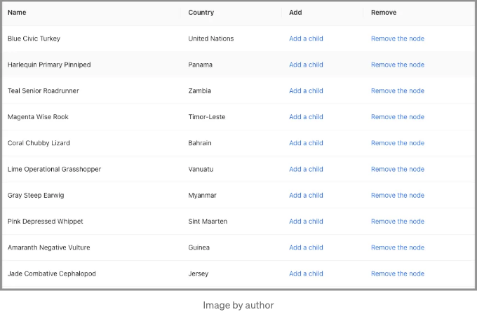

<!-- ui-log 수평형 -->
<ins class="adsbygoogle"
  style="display:block"
  data-ad-client="ca-pub-4877378276818686"
  data-ad-slot="9743150776"
  data-ad-format="auto"
  data-full-width-responsive="true"></ins>
<component is="script">
(adsbygoogle = window.adsbygoogle || []).push({});
</component>

다음은 네 개의 열이 있는 테이블입니다:

- 이름: 컬러, 형용사, 동물이 연결된 이름입니다. 이 이름은 uniqueNamesGenerator에 의해 생성됩니다.

```js
const createName = () =>
  uniqueNamesGenerator({
    dictionaries: [colors, adjectives, animals],
    style: 'capital',
    separator: ' ',
  });
```

- 국가: uniqueNamesGenerator에 의해 생성된 국가 이름입니다.

<!-- ui-log 수평형 -->
<ins class="adsbygoogle"
  style="display:block"
  data-ad-client="ca-pub-4877378276818686"
  data-ad-slot="9743150776"
  data-ad-format="auto"
  data-full-width-responsive="true"></ins>
<component is="script">
(adsbygoogle = window.adsbygoogle || []).push({});
</component>

```js
const createCountryName = () =>
  uniqueNamesGenerator({
    dictionaries: [countries],
    style: 'capital',
  });
```

- 추가: 현재 행 아래에 자식 노드를 추가하는 추가 작업입니다. 이 시점에서는 별도의 작업 없이 순수 링크입니다.

```js
render: () => <a>자식 추가</a>
```

- 삭제: 현재 행과 해당 자식을 모두 제거하는 삭제 작업입니다. 이 시점에서는 별도의 작업 없이 순수 링크입니다.

<!-- ui-log 수평형 -->
<ins class="adsbygoogle"
  style="display:block"
  data-ad-client="ca-pub-4877378276818686"
  data-ad-slot="9743150776"
  data-ad-format="auto"
  data-full-width-responsive="true"></ins>
<component is="script">
(adsbygoogle = window.adsbygoogle || []).push({});
</component>

```js
render: () => <a>노드 제거하기</a>
```

우리는 createNewRow이라는 메서드를 만들었습니다. 이 메서드는 key, name, country 세 가지 prop을 가지는 새로운 행을 생성합니다.

```js
const createNewRow = () => {
  const name = createName();
  return {
    key: name,
    name,
    country: createCountryName(),
  };
};
```

createTableData라는 메서드는 지정된 행 수 (rowCount)로 테이블 데이터를 생성하는 데 사용됩니다.

<!-- ui-log 수평형 -->
<ins class="adsbygoogle"
  style="display:block"
  data-ad-client="ca-pub-4877378276818686"
  data-ad-slot="9743150776"
  data-ad-format="auto"
  data-full-width-responsive="true"></ins>
<component is="script">
(adsbygoogle = window.adsbygoogle || []).push({});
</component>

```js
const createTableData = (rowCount) =>
  Array(rowCount)
    .fill(1)
    .map(() => createNewRow());
```

다음과 같이 src/App.js를 수정하십시오:

- 40번 줄에서 초기 Table이 열 개로 생성됩니다.
- 42-64번 줄에서 Table 열이 정의됩니다.
- 67-71번 줄에서 앱은 Table 컴포넌트를 반환하며 페이지네이션은 꺼져 있습니다(68번 줄), 열(69번 줄) 및 데이터 소스(70번 줄)가 설정됩니다.

yarn start를 실행하면 평평한 Table이 표시됩니다.

<!-- ui-log 수평형 -->
<ins class="adsbygoogle"
  style="display:block"
  data-ad-client="ca-pub-4877378276818686"
  data-ad-slot="9743150776"
  data-ad-format="auto"
  data-full-width-responsive="true"></ins>
<component is="script">
(adsbygoogle = window.adsbygoogle || []).push({});
</component>

# 단계 2: 하위 항목 추가 작업 구현

TreeTable을 사용하려면 하위 항목 추가 작업을 구현해야 합니다. 셀을 클릭하면 현재 행 아래에 자식 노드가 생성됩니다.

다음은 수정된 테이블 열입니다:

- 14–25행에서 셀에 대한 props를 설정하는 onCell 속성이 추가되었습니다. props 중 하나는 onClick 콜백 (16–23행)이 될 수 있습니다. 또한 현재 행의 레코드를 매개변수로 전달합니다 (14행).
- antd에서 테이블 행은 레코드의 children 속성이 레코드의 배열인 경우(동적 로딩의 경우 빈 배열일 수도 있음) 부모입니다.
- 18행에서 레코드가 아직 초기화되지 않았다면 record.children가 []로 설정됩니다.
- 21행에서 새로 생성된 행이 record.children에 추가됩니다. record.children를 변경하여 테이블 데이터를 변경했으므로 setTableData를 호출하여 참조를 업데이트합니다.

<!-- ui-log 수평형 -->
<ins class="adsbygoogle"
  style="display:block"
  data-ad-client="ca-pub-4877378276818686"
  data-ad-slot="9743150776"
  data-ad-format="auto"
  data-full-width-responsive="true"></ins>
<component is="script">
(adsbygoogle = window.adsbygoogle || []).push({});
</component>

yarn start를 실행하세요. 첫 번째 행의 "Add a child"를 클릭하면 + 아이콘이 표시됩니다. 이는 Tomato Outdoor Impala가 부모라는 것을 나타냅니다.

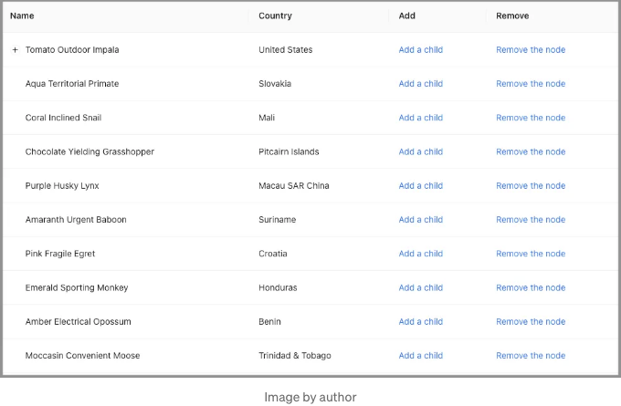

첫 번째 행의 "Add a child"를 다시 클릭하면 아무 일도 일어나지 않습니다. 새로 추가된 자식 요소는 + 아이콘 뒤에 숨겨져 있습니다.

새로 추가된 행이 보이게 하려면 부모 노드를 확장해야 합니다. 다음 단계로 넘어가겠습니다.

<!-- ui-log 수평형 -->
<ins class="adsbygoogle"
  style="display:block"
  data-ad-client="ca-pub-4877378276818686"
  data-ad-slot="9743150776"
  data-ad-format="auto"
  data-full-width-responsive="true"></ins>
<component is="script">
(adsbygoogle = window.adsbygoogle || []).push({});
</component>

# 단계 3: 활성 부모 노드 확장하기

부모 노드를 어떻게 확장할까요?

Table에는 어떤 부모 노드를 열지를 제어하는 expandable prop이 있습니다. expandable은 하위 테이블이며 독립적인 열 헤더를 가질 수도 있습니다. TreeTable의 경우, 하위 테이블의 열 헤더는 필요하지 않습니다. 대신, 다음 구성 prop이 관련됩니다:

- defaultExpandAllRows: 초기에 모든 행을 확장할지 여부를 지정하며 기본값은 false입니다.
- defaultExpandedRowKeys: 초기 확장된 행 키를 지정하며 그 유형은 string[]입니다.
- expandedRowClassName: 확장된 행의 클래스 이름을 지정하며 그 유형은 function(record, index, indent): string입니다.
- expandedRowKeys: 노드가 열려 있는 행 키를 지정하며 그 유형은 string[]입니다.
- expandIcon: 행 확장 아이콘을 사용자 정의하며 그 유형은 function({ expanded, onExpand, record }): ReactNode입니다.
- indentSize: 하위 트리의 들여쓰기 크기를 지정하며 그 유형은 숫자입니다.
- onExpand: 행 확장 아이콘이 클릭됐을 때 호출되는 콜백 함수입니다. 그 유형은 function(expanded, record)입니다.
- onExpandedRowsChange: 확장된 행이 변경되었을 때 호출되는 콜백 함수입니다. 그 유형은 function(expandedRows)입니다.

<!-- ui-log 수평형 -->
<ins class="adsbygoogle"
  style="display:block"
  data-ad-client="ca-pub-4877378276818686"
  data-ad-slot="9743150776"
  data-ad-format="auto"
  data-full-width-responsive="true"></ins>
<component is="script">
(adsbygoogle = window.adsbygoogle || []).push({});
</component>

TreeTable에서 expandedRowKeys는 트리 노드가 확장되는지를 제어하는 데 사용됩니다. expandedRowKeys에 키가 있는 행은 확장됩니다. 그렇지 않은 경우 해당 행은 축소됩니다. expandedRowKeys를 제어하는 것이므로 사용자가 행 확장 아이콘을 클릭할 때마다 그 값이 관리되어야 합니다.

```js
expandable={
  expandedRowKeys,
  onExpandedRowsChange: (expandedRows) => {
    setExpandedRowKeys(expandedRows);
  },
}
```

여기서 개선된 src/App.js가 있습니다:

- 8번째 줄에서 expandedRowKeys 상태가 생성됩니다.
- 32번째 줄에서 새로 추가된 자식의 부모 키가 expandedRowKeys에 추가됩니다.
- 52~57번 줄에서 Table의 확장 가능한 속성이 정의됩니다.

<!-- ui-log 수평형 -->
<ins class="adsbygoogle"
  style="display:block"
  data-ad-client="ca-pub-4877378276818686"
  data-ad-slot="9743150776"
  data-ad-format="auto"
  data-full-width-responsive="true"></ins>
<component is="script">
(adsbygoogle = window.adsbygoogle || []).push({});
</component>

"yarn start"을 실행해주세요. 자식을 추가할 때마다 부모 노드가 자동으로 확장됩니다.

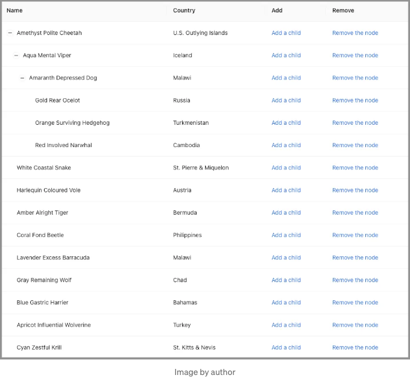

추가된 자식을 볼 수 있습니다. 그러나 여러 개의 자식을 추가한 후에는 어떤 것이 최근에 추가된 것인지 혼동될 수 있습니다. TreeTable이 추가 개선이 필요합니다.

# 단계 4: 새로 추가된 자식 강조하기

<!-- ui-log 수평형 -->
<ins class="adsbygoogle"
  style="display:block"
  data-ad-client="ca-pub-4877378276818686"
  data-ad-slot="9743150776"
  data-ad-format="auto"
  data-full-width-responsive="true"></ins>
<component is="script">
(adsbygoogle = window.adsbygoogle || []).push({});
</component>

한 행을 스타일링하는 다양한 방법이 있습니다. 간단히 말해서 테이블의 rowSelection을 사용하여 새로 추가된 행을 강조 표시합니다. 테이블의 rowSelection 속성이 구성되면 선택된 행이 강조 표시됩니다. rowSelection의 많은 속성 중에서 우리는 두 가지를 설정합니다:

- selectedRowKeys: 선택된 행 키를 지정하며, 그 형식은 string[]입니다.
- type: 타입을 지정하며, 'checkbox' 또는 'radio' 중 하나입니다. 기본값은 checkbox입니다.

우리는 rowSelection에 라디오를 선택했는데, 라디오는 다중 선택을 허용하지 않기 때문입니다.

```js
rowSelection={ selectedRowKeys, type: 'radio' }
```

<!-- ui-log 수평형 -->
<ins class="adsbygoogle"
  style="display:block"
  data-ad-client="ca-pub-4877378276818686"
  data-ad-slot="9743150776"
  data-ad-format="auto"
  data-full-width-responsive="true"></ins>
<component is="script">
(adsbygoogle = window.adsbygoogle || []).push({});
</component>

이것은 순전히 해킹이에요. 대안으로, 우리는 행을 강조하는 데 className을 사용할 수 있어요. className은 다음 단계에서 정의할 newRowKey와 일치하는지 여부에 따라 조건적으로 설정될 수 있어요.

다음은 수정된 src/App.js입니다:

- 9번째 줄에서 상태인 selectedRowKeys가 생성되어요.
- 34번째 줄에서 새로 생성된 자식의 key가 selectedRowKeys에 추가돼요.
- 52번째 줄에서 Table의 rowSelection 속성이 정의돼요.
- 59번째 줄에서 사용자가 행 확장 아이콘을 클릭할 때 하이라이팅을 지우세요.

yarn start를 실행하세요. 새로 추가된 자식이 강조 표시되어요.

<!-- ui-log 수평형 -->
<ins class="adsbygoogle"
  style="display:block"
  data-ad-client="ca-pub-4877378276818686"
  data-ad-slot="9743150776"
  data-ad-format="auto"
  data-full-width-responsive="true"></ins>
<component is="script">
(adsbygoogle = window.adsbygoogle || []).push({});
</component>

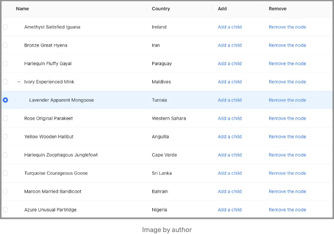

더 많은 하위 요소를 계속 추가하면, 새로 추가된 하위 요소가 화면 밖으로 벗어납니다.

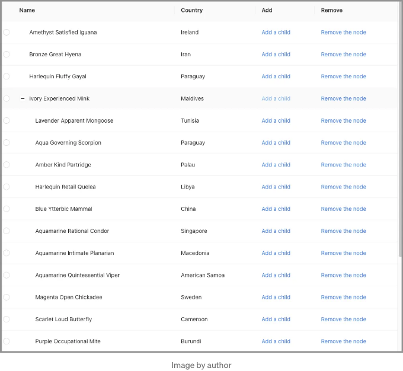

또 다른 개선이 필요합니다.

<!-- ui-log 수평형 -->
<ins class="adsbygoogle"
  style="display:block"
  data-ad-client="ca-pub-4877378276818686"
  data-ad-slot="9743150776"
  data-ad-format="auto"
  data-full-width-responsive="true"></ins>
<component is="script">
(adsbygoogle = window.adsbygoogle || []).push({});
</component>

# 단계 5: 새로 추가된 자식을 화면에 스크롤하기

자바스크립트 요소에는 scrollIntoView()라는 메서드가 있습니다. 이 메서드는 해당 요소를 볼 수 있도록 조상 컨테이너를 스크롤합니다.

이 메서드에는 세 가지 형식이 있습니다:

- scrollIntoView(): 어떤 매개변수도 필요하지 않으며 조상 컨테이너의 맨 위로 스크롤합니다.
- scrollIntoView(alignToTop): alignToTop은 부울 값입니다. true이면 조상 컨테이너의 맨 위로 스크롤하고, 그렇지 않으면 조상 컨테이너의 맨 아래로 스크롤합니다.
- scrollIntoView(scrollIntoViewOptions): scrollIntoViewOptions는 다음 속성을 가진 객체입니다:
  - behavior: 전환 애니메이션을 auto 또는 smooth 중에서 정의하며 기본 값은 auto입니다.
  - block: 수직 정렬을 start, center, end 또는 nearest 중에서 정의하며 기본 값은 start입니다.
  - inline: 수평 정렬을 start, center, end 또는 nearest 중에서 정의하며 기본 값은 nearest입니다.

<!-- ui-log 수평형 -->
<ins class="adsbygoogle"
  style="display:block"
  data-ad-client="ca-pub-4877378276818686"
  data-ad-slot="9743150776"
  data-ad-format="auto"
  data-full-width-responsive="true"></ins>
<component is="script">
(adsbygoogle = window.adsbygoogle || []).push({});
</component>

scrollIntoView(true)은 scrollIntoViewOptions({block: "start", inline: "nearest"})와 동일합니다. scrollIntoView(false)는 scrollIntoViewOptions({block: "end", inline: "nearest"})와 동일합니다.

scrollIntoView를 사용하면 새로 추가된 자식 요소를 보이도록 스크롤할 수 있습니다.

다음은 수정된 src/App.js입니다:

- 9번 줄에서 새 상태인 newRowKey가 생성됩니다.
- 12~19번 줄에서 newRowKey가 변경될 때 useEffect가 호출됩니다. 새로 추가된 행 요소를 찾습니다 (14~16번 줄) 그리고 scrollIntoView (17번 줄)를 호출하여 해당 요소가 화면에 표시되도록 스크롤합니다.
- 44번 줄에서 newRowKey가 새로 추가된 자식 요소의 키로 업데이트됩니다.
- 71번 줄에서 행 확장 변경 시 newRowKey를 지웁니다.

<!-- ui-log 수평형 -->
<ins class="adsbygoogle"
  style="display:block"
  data-ad-client="ca-pub-4877378276818686"
  data-ad-slot="9743150776"
  data-ad-format="auto"
  data-full-width-responsive="true"></ins>
<component is="script">
(adsbygoogle = window.adsbygoogle || []).push({});
</component>

yarn start을 실행하세요. 행에서 "Olive Personal Owl"에 있는 "Add a child"를 계속 클릭하면 새로 추가된 자식이 항상 보일 것입니다.

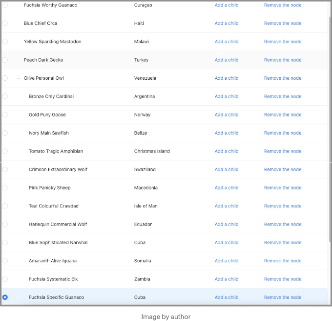

# 단계 6: 노드 삭제 작업 구현하기

자식 추가 기능이 작동합니다. 다음 단계는 노드를 삭제하는 기능을 구현하는 것입니다.

<!-- ui-log 수평형 -->
<ins class="adsbygoogle"
  style="display:block"
  data-ad-client="ca-pub-4877378276818686"
  data-ad-slot="9743150776"
  data-ad-format="auto"
  data-full-width-responsive="true"></ins>
<component is="script">
(adsbygoogle = window.adsbygoogle || []).push({});
</component>

removeRowFromTableData는 입력 목록인 데이터에서 특정 키를 가진 행을 제거하는 메소드입니다. 이 메소드에는 두 가지 사용 사례가 있습니다:

- 행에 부모가 없는 경우, 해당 행은 테이블 데이터에서 제거됩니다. 이 경우 데이터는 tableData입니다.
- 행에 부모가 있는 경우, 해당 행은 부모의 자식 목록에서 제거됩니다. 이 경우 데이터는 record.parent.children입니다.

```js
const removeRowFromTableData = (data = [], key) => {
  if (key) {
    const index = data.findIndex((item) => item.key === key);
    if (index !== -1) {
      data.splice(index, 1);
    }
  }
};
```

여기에 수정된 테이블 칼럼이 있습니다:

<!-- ui-log 수평형 -->
<ins class="adsbygoogle"
  style="display:block"
  data-ad-client="ca-pub-4877378276818686"
  data-ad-slot="9743150776"
  data-ad-format="auto"
  data-full-width-responsive="true"></ins>
<component is="script">
(adsbygoogle = window.adsbygoogle || []).push({});
</component>

- record.parent를 알기 위해 Add 열의 onClick 콜백 (라인 14–29)이 새로 추가된 자식에 대한 부모 참조를 저장합니다 (라인 21).
- Remove 열은 onCell 속성을 추가합니다 (라인 36–55). 해당 콜백인 onClick은 삭제 작업을 처리합니다. record가 부모를 가지고 있다면 부모의 자식 목록에서 제거됩니다 (라인 41). 그렇지 않으면 tableData에서 제거됩니다 (라인 46).
- 빈 children을 삭제합니다 (라인 42–44). 이는 부모 노드의 확장 아이콘을 제거합니다.
- 컴포넌트의 상태를 업데이트합니다 (라인 48–52):
  - tableData는 새 참조로 업데이트됩니다 (라인 48).
  - expandedRowKeySet은 record.key를 삭제하여 업데이트됩니다 (라인 49–50).
  - newRowKey는 undefined로 업데이트됩니다 (라인 51).
  - selectedRowKeys는 []로 업데이트됩니다 (라인 52).

yarn start를 실행하세요. 행에서 노드를 제거를 클릭하면 해당 행과 하위 항목이 제거됩니다.

# 단계 7: TreeTable 자식에 대한 각진 라인 구현

여러 부모 노드가 확장된 TreeTable이 여기 있습니다.

<!-- ui-log 수평형 -->
<ins class="adsbygoogle"
  style="display:block"
  data-ad-client="ca-pub-4877378276818686"
  data-ad-slot="9743150776"
  data-ad-format="auto"
  data-full-width-responsive="true"></ins>
<component is="script">
(adsbygoogle = window.adsbygoogle || []).push({});
</component>

```markdown
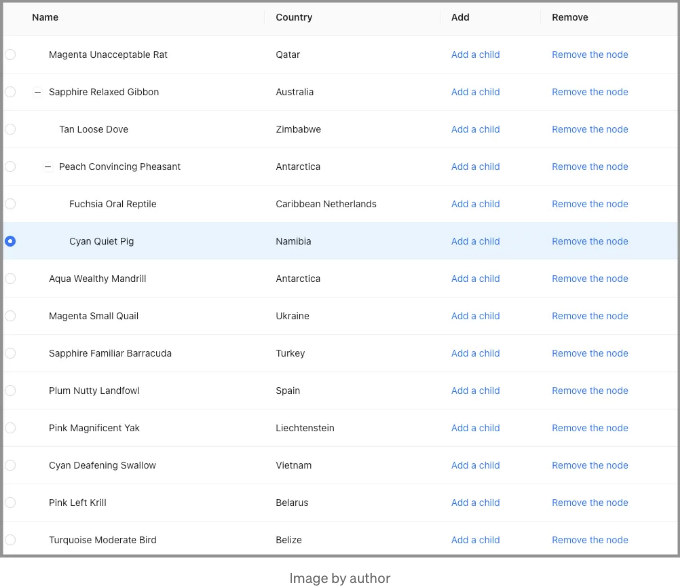

리스트가 길 경우, 부모와 자식을 쉽게 연결하기가 어려울 수 있습니다. 우리는 부모에서 자식으로 향하는 각도 있는 선을 추가하고 싶습니다.

이 아이콘은 EnterOutlined입니다.

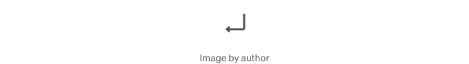
```

<!-- ui-log 수평형 -->
<ins class="adsbygoogle"
  style="display:block"
  data-ad-client="ca-pub-4877378276818686"
  data-ad-slot="9743150776"
  data-ad-format="auto"
  data-full-width-responsive="true"></ins>
<component is="script">
(adsbygoogle = window.adsbygoogle || []).push({});
</component>

우리는 x 축을 따라 뒤집어 부모와 각 자식들 간의 연관성을 보여줍니다.


다음은 src/App.js에 있는 각도 선 변경 사항입니다:

- 8~22행에서 Container가 정의되어 테이블을 60행에서 호스팅하게 됩니다. Container는 내용이 줄지 않도록 합니다. 오버플로우 부분은 숨겨지며, 충분한 공간이 없을 경우에는 타원 모양을 보여줍니다.
- 24~33행에서 아이콘인 EnterOutlined를 x 축을 따라 뒤집어 각도 선이 되도록 합니다.
- 46~51행에서 이름 열에 렌더(render)가 추가됩니다. 만약 레코드에 부모가 있다면 (48행) 이름 앞에 FlippedEnterIcon이 추가됩니다.

<!-- ui-log 수평형 -->
<ins class="adsbygoogle"
  style="display:block"
  data-ad-client="ca-pub-4877378276818686"
  data-ad-slot="9743150776"
  data-ad-format="auto"
  data-full-width-responsive="true"></ins>
<component is="script">
(adsbygoogle = window.adsbygoogle || []).push({});
</component>

yarn start을 실행해주세요. 부모-자식 관계가 각도 있는 선으로 더욱 더 명확해집니다.

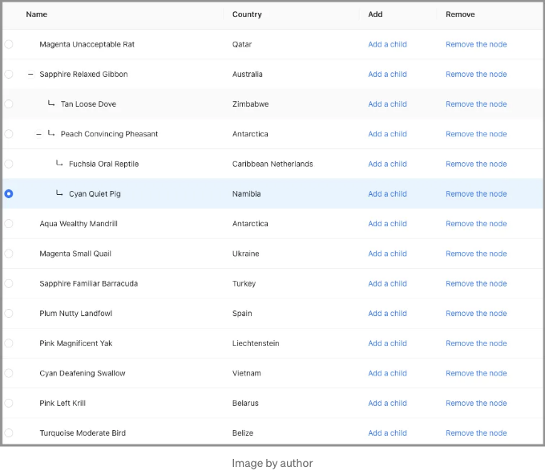

# 단계 8: TreeTable에 총 수 추가하기

TreeTable을 부분적으로 확장하면 몇 개의 행(노드)이 있는지 알기 어렵습니다. 총 개수가 표시된다면 도움이 될 것입니다.

<!-- ui-log 수평형 -->
<ins class="adsbygoogle"
  style="display:block"
  data-ad-client="ca-pub-4877378276818686"
  data-ad-slot="9743150776"
  data-ad-format="auto"
  data-full-width-responsive="true"></ins>
<component is="script">
(adsbygoogle = window.adsbygoogle || []).push({});
</component>

우리는 카운트를 계산하는 방법이 필요해요.

```js
const getTableRowCount = (data = []) =>
  data.reduce(
    (count, item) =>
      item.children ? count + getTableRowCount(item.children) + 1 : count + 1,
    0
  );
```

여기에 업데이트된 App 컴포넌트가 있어요:

- 6번 줄에서는 상태인 tableNodeCount가 생성돼요.
- 10번 줄에서는 tableData가 변경될 때 useEffect가 호출돼요. 이는 카운트를 다시 계산하고 tableNodeCount를 업데이트해요.
- 18–22번 줄에서는 Table 컴포넌트의 footer prop이 정의돼요, 여기에는 tableNodeCount가 표시돼요 (20번 줄).
- 34번 줄에서는 세로 최대 높이가 700px로 설정돼요, footer가 화면에 표시되도록 해요.

<!-- ui-log 수평형 -->
<ins class="adsbygoogle"
  style="display:block"
  data-ad-client="ca-pub-4877378276818686"
  data-ad-slot="9743150776"
  data-ad-format="auto"
  data-full-width-responsive="true"></ins>
<component is="script">
(adsbygoogle = window.adsbygoogle || []).push({});
</component>

yarn start를 실행하세요. 전체 카운트가 표시되며 트리 노드를 확장하거나 축소해도 카운트는 변경되지 않습니다.

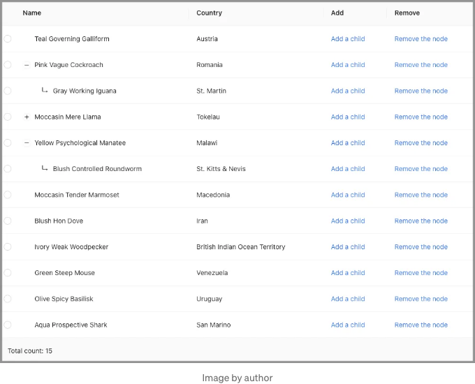

# 단계 9: 모두 열기 및 모두 닫기 버튼 구현

TreeTable에서 더 추가해야 할 사항이 있나요?

<!-- ui-log 수평형 -->
<ins class="adsbygoogle"
  style="display:block"
  data-ad-client="ca-pub-4877378276818686"
  data-ad-slot="9743150776"
  data-ad-format="auto"
  data-full-width-responsive="true"></ins>
<component is="script">
(adsbygoogle = window.adsbygoogle || []).push({});
</component>

네, 한 번 클릭으로 모든 트리 노드를 열거나 축소시킬 수 있는 "모두 열기"와 "모두 닫기" 버튼이 있으면 좋을 것 같아요.

"모두 닫기" 버튼은 클릭하면 모든 상태를 지워버려요.

```js
<ButtonAction
  onClick={() => {
    setExpandedRowKeys([]);
    setSelectedRowKeys([]);
    setNewRowKey();
  }
>
  모두 닫기
</ButtonAction>
```

"모두 열기" 버튼은 모든 부모 노드 키를 가져오는 메서드가 필요해요.

<!-- ui-log 수평형 -->
<ins class="adsbygoogle"
  style="display:block"
  data-ad-client="ca-pub-4877378276818686"
  data-ad-slot="9743150776"
  data-ad-format="auto"
  data-full-width-responsive="true"></ins>
<component is="script">
(adsbygoogle = window.adsbygoogle || []).push({});
</component>

```js
const getAllParentNodeKeys = (data = []) =>
  data.reduce(
    (list, item) =>
      item.children
        ? [...list, item.key, ...getAllParentNodeKeys(item.children)]
        : list,
    []
  );
```

다음과 같이 정의할 수 있습니다:

```js
<ButtonAction
  onClick={() => {
    setExpandedRowKeys(getAllParentNodeKeys(tableData));
    setSelectedRowKeys([]);
    setNewRowKey();
  }
>
  Open All
</ButtonAction>
```

전체 src/App.js는 다음과 같습니다:

<!-- ui-log 수평형 -->
<ins class="adsbygoogle"
  style="display:block"
  data-ad-client="ca-pub-4877378276818686"
  data-ad-slot="9743150776"
  data-ad-format="auto"
  data-full-width-responsive="true"></ins>
<component is="script">
(adsbygoogle = window.adsbygoogle || []).push({});
</component>

- 29–31번 라인에서는 작업 버튼에 왼쪽에 10px 간격을 주는 스타일을 적용합니다.
- 184–206번 라인에서는 푸터에 '모두 열기' 버튼(187–195번 라인)과 '모두 닫기' 버튼(196–204번 라인)이 포함되어 있습니다.

yarn start를 실행하세요. '모두 열기' 및 '모두 닫기' 버튼은 푸터에 있으며, 총 개수와 함께 나타납니다.

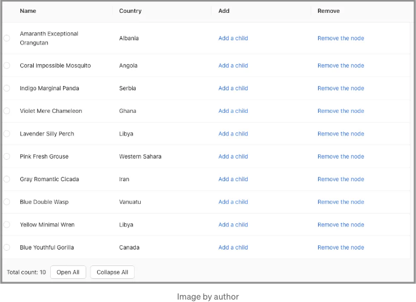

# 단계 10: 다른 파일로 분할하기

<!-- ui-log 수평형 -->
<ins class="adsbygoogle"
  style="display:block"
  data-ad-client="ca-pub-4877378276818686"
  data-ad-slot="9743150776"
  data-ad-format="auto"
  data-full-width-responsive="true"></ins>
<component is="script">
(adsbygoogle = window.adsbygoogle || []).push({});
</component>

위의 TreeTable 코드는 작동은 하지만, 관심사 분리 디자인 원칙을 위반합니다. 긴 src/App.js를 서로 다른 과제에 대응하는 독립적인 섹션들로 분리해야 합니다.

위의 src/App.js를 세 개의 파일로 분리합니다.

```js
src
├── App.js
├── TreeTable.js
└── utils.js
```

- src/App.js: TreeTable 컴포넌트를 사용하는 애플리케이션입니다.

<!-- ui-log 수평형 -->
<ins class="adsbygoogle"
  style="display:block"
  data-ad-client="ca-pub-4877378276818686"
  data-ad-slot="9743150776"
  data-ad-format="auto"
  data-full-width-responsive="true"></ins>
<component is="script">
(adsbygoogle = window.adsbygoogle || []).push({});
</component>

- src/utils.js: 도움이 되는 메소드를 제공하는 유틸 모음입니다.

- src/TreeTable: TreeTable 구현체입니다.

이 저장소에 완전한 예제가 있습니다. 라이브 데모를 보려면 Storybook 링크를 클릭해주세요.

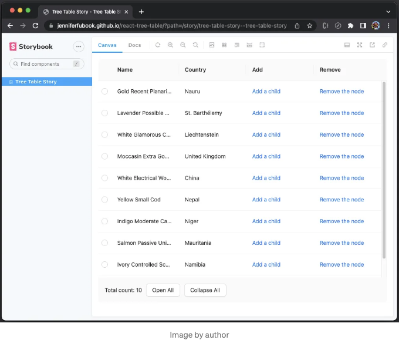

<!-- ui-log 수평형 -->
<ins class="adsbygoogle"
  style="display:block"
  data-ad-client="ca-pub-4877378276818686"
  data-ad-slot="9743150776"
  data-ad-format="auto"
  data-full-width-responsive="true"></ins>
<component is="script">
(adsbygoogle = window.adsbygoogle || []).push({});
</component>

이 문서에서는 구성 요소를 표시하는 스토리북을 설정하는 방법과 GitHub Pages를 통해 온라인으로 배포하는 방법을 설명했습니다.

# 결론

Ant Design System의 중첩 테이블 기능을 사용하여 TreeTable을 구축하는 데는 열 가지 단계가 필요합니다. TreeTable은 현재 행 아래에 자식을 추가할 수 있습니다. 자식을 추가하면 부모 노드가 자동으로 열립니다. 새로 추가된 자식은 강조 표시됩니다(라디오 선택 항목에서의 해킹) 및 보기로 스크롤됩니다. 행을 삭제하면 해당 행 및 모든 자식이 함께 삭제됩니다.

TreeTable 푸터에는 노드의 총 개수와 이러한 트리 노드가 열린 상태인지 또는 축소된 상태인지가 표시됩니다. 또한 푸터에는 모든 트리 노드를 모두 열거나 모두 축소하는 버튼이 있습니다.

<!-- ui-log 수평형 -->
<ins class="adsbygoogle"
  style="display:block"
  data-ad-client="ca-pub-4877378276818686"
  data-ad-slot="9743150776"
  data-ad-format="auto"
  data-full-width-responsive="true"></ins>
<component is="script">
(adsbygoogle = window.adsbygoogle || []).push({});
</component>

감사합니다.

```js
연락하고 싶으세요?

관심 있으시면, 웹 개발 문서 목록을 확인해보세요.
```