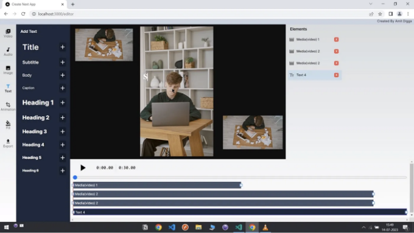

Next.js는 React 앱을 만들기 위한 놀라운 프레임워크입니다. 다양한 이점을 제공합니다. 오늘은 Next.js를 사용하여 빠르고 매력적인 웹 애플리케이션을 만드는 방법을 배울 수 있는 다섯 가지 프로젝트를 제공하려고 합니다. 이 프로젝트들은 링크와 GitHub 저장소가 포함되어 있어 편리합니다.

추가로, 이 기사 맨 아래에는 놀라운 50가지 Next.js 프로젝트 링크도 포함하였습니다.

## 1. 개발자를 위한 간단한 포트폴리오 템플릿

<!-- ui-log 수평형 -->
<ins class="adsbygoogle"
  style="display:block"
  data-ad-client="ca-pub-4877378276818686"
  data-ad-slot="9743150776"
  data-ad-format="auto"
  data-full-width-responsive="true"></ins>
<component is="script">
(adsbygoogle = window.adsbygoogle || []).push({});
</component>

전체 포트폴리오는 Typescript를 사용하여 Next.js로 구축된 React 기반의 싱글 페이지 앱입니다. 이 프로젝트는 정적으로 생성된 페이지만 사용합니다. 이 프로젝트는 next/font를 사용하여 Inter를 자동으로 최적화하고로드하며, 사용자 정의 구글 폰트입니다. 모든 프로젝트 이미지는 public/images 폴더에 있으며, 해당 프로젝트의 slug가 파일이름에 포함되어있으면 각 프로젝트에 자동으로 첨부됩니다.

Github

## 2. Next.js 14, Typescript 및 Shadcn UI를 사용하여 구축된 실시간 날씨 앱

<!-- ui-log 수평형 -->
<ins class="adsbygoogle"
  style="display:block"
  data-ad-client="ca-pub-4877378276818686"
  data-ad-slot="9743150776"
  data-ad-format="auto"
  data-full-width-responsive="true"></ins>
<component is="script">
(adsbygoogle = window.adsbygoogle || []).push({});
</component>

Cutting-edge 기술을 활용하여 완벽하게 제작된 날씨 애플리케이션입니다. Next.js 14, TypeScript, Tailwind CSS 및 Shadcn UI 라이브러리의 우아함으로 구동됩니다. 부드러운 테마 전환을 위해 React Hotkeys Hook을 사용하며 다목적 커맨드 메뉴를 제공합니다. 또한 Mapbox 지도 통합을 위해 React Map GL을 통합하고 Google Maps Places API에서 파워드되는 지능적인 장소 자동완성 제안을 제공합니다.

Github

## 3. 브라우저에서 실행되는 비디오 편집기, fabric.js 및 Next.js로 구축

<!-- ui-log 수평형 -->
<ins class="adsbygoogle"
  style="display:block"
  data-ad-client="ca-pub-4877378276818686"
  data-ad-slot="9743150776"
  data-ad-format="auto"
  data-full-width-responsive="true"></ins>
<component is="script">
(adsbygoogle = window.adsbygoogle || []).push({});
</component>

Fabric Video Editor은 브라우저에서 실행되는 비디오 편집기입니다. fabric.js, Next.js(React 프레임워크), Tailwindcss, Mobx, 그리고 typescript로 구축되었습니다. invideo.io에서 영감을 받았습니다.

Github

## 4. 웹을 위한 시각적인 딥러닝 프레임워크, WebGPU와 Next.js로 구축된

<!-- ui-log 수평형 -->
<ins class="adsbygoogle"
  style="display:block"
  data-ad-client="ca-pub-4877378276818686"
  data-ad-slot="9743150776"
  data-ad-format="auto"
  data-full-width-responsive="true"></ins>
<component is="script">
(adsbygoogle = window.adsbygoogle || []).push({});
</component>

CoViz는 ReactFlow를 이용한 노드 편집기를 특징으로 하는 사용자 인터페이스를 가지고 있습니다. 이를 통해 사용자들은 신경망 계산 그래프를 손쉽게 생성할 수 있습니다. 사용자들은 다양한 회귀 및 분류 작업 및 데이터 세트 중에서 선택할 수 있습니다. 그런 다음, 데이터의 패턴을 학습하기 위해 네트워크를 훈련시킬 수 있습니다.

Github

## 5. GPT-4와 Next.js를 이용한 개인 AGI 애플리케이션

<!-- ui-log 수평형 -->
<ins class="adsbygoogle"
  style="display:block"
  data-ad-client="ca-pub-4877378276818686"
  data-ad-slot="9743150776"
  data-ad-format="auto"
  data-full-width-responsive="true"></ins>
<component is="script">
(adsbygoogle = window.adsbygoogle || []).push({});
</component>

빅-AGI를 소개합니다! 더 나은 결과를 얻기 위해 제작된 개인용 AGI 앱입니다. 스마트한 사람들과 슈퍼히어로들을 위해 디자인된 반응형 웹 앱으로 Personas, Drawing, Code Execution, PDF imports, Voice support, data Rendering, AGI functions, chats 등 다양한 기능을 제공합니다. 놀라운 능력으로 친구들을 감탄시킬 수 있습니다. 이제 발사 준비를 완료했어요! 🚀

Github

## 보너스: 50개 이상의 프로젝트(한정 기간 무료)

<!-- ui-log 수평형 -->
<ins class="adsbygoogle"
  style="display:block"
  data-ad-client="ca-pub-4877378276818686"
  data-ad-slot="9743150776"
  data-ad-format="auto"
  data-full-width-responsive="true"></ins>
<component is="script">
(adsbygoogle = window.adsbygoogle || []).push({});
</component>

읽어 주셔서 감사합니다! 만약 더 많은 이런 프로젝트를 원하신다면 클랩(clap) 버튼을 눌러주시면 더 많은 컨텐츠를 공유할 수 있습니다.