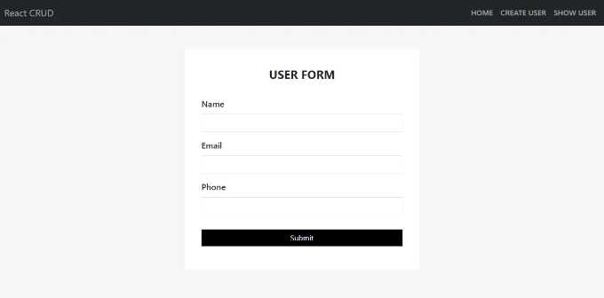
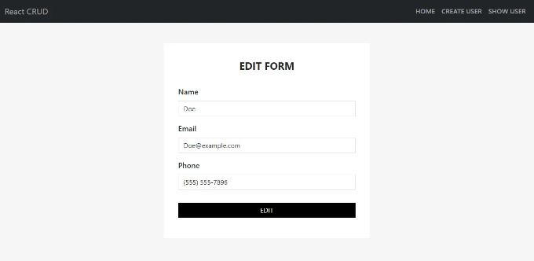
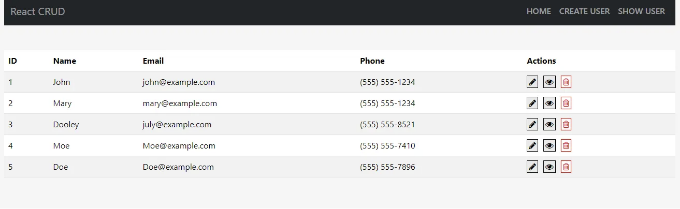

물론이죠! CRUD 작업은 많은 애플리케이션에서 기본적인 작업으로 알려진 Create, Read, Update, Delete의 약자입니다. React에서는 API와 통합하거나 로컬 상태를 관리함으로써 예외 처리와 함께 CRUD 작업을 구현할 수 있습니다.

React와 예외 처리를 다루는 CRUD 작업을 구현하는 기본 예제는 다음과 같습니다:

## 사용자 생성 [POST 호출]



<!-- ui-log 수평형 -->
<ins class="adsbygoogle"
  style="display:block"
  data-ad-client="ca-pub-4877378276818686"
  data-ad-slot="9743150776"
  data-ad-format="auto"
  data-full-width-responsive="true"></ins>
<component is="script">
(adsbygoogle = window.adsbygoogle || []).push({});
</component>

```js
import React, { useState } from 'react'
import { useNavigate } from "react-router-dom";
import Loader from '../Common/Loader';
import './User.css';

const CreateUser = () => {
    const navigate = useNavigate();
    const createUserApi = "http://localhost:3000/user"
    const [error, setError] = useState(null);
    const [isLoading, setIsLoading] = useState(false);
    const [user, setUser] = useState({
        name: "",
        email: "",
        phone: ""
    })

    const handleInput = (event) => {
        event.preventDefault();
        const { name, value } = event.target;
        console.log(name, value)
        setUser({ ...user, [name]: value });
    }

    const handleSubmit = async (event) => {
        event.preventDefault();
        console.log(user)
        try {
            setIsLoading(true);
            const response = await fetch(createUserApi, {
                method: 'POST',
                headers: {
                    'Content-Type': 'application/json',
                },
                body: JSON.stringify(user),
            });

            if (response.ok) {
                console.log('Form submitted successfully!');
                setUser({name: "", email: "", phone: ""})
                navigate('/show-user');
            } else {
                console.error('Form submission failed!');
            }

        } catch (error) {
            setError(error.message);
        } finally {
            setIsLoading(false);
        }
    }

    return (
        <div className='user-form'>
            <div className='heading'>
            {isLoading && <Loader />}
            {error && <p>Error: {error}</p>}
                <p>User Form</p>
            </div>
            <form onSubmit={handleSubmit}>
                <div className="mb-3">
                    <label htmlFor="name" className="form-label">Name</label>
                    <input type="text" className="form-control" id="name" name="name" value={user.name} onChange={handleInput} />
                </div>
                <div className="mb-3 mt-3">
                    <label htmlFor="email" className="form-label">Email</label>
                    <input type="email" className="form-control" id="email" name="email" value={user.email} onChange={handleInput} />
                </div>
                <div className="mb-3">
                    <label htmlFor="phone" className="form-label">Phone</label>
                    <input type="text" className="form-control" id="phone" name="phone" value={user.phone} onChange={handleInput} />
                </div>
                <button type="submit" className="btn btn-primary submit-btn">Submit</button>
            </form>
        </div>
    )
}

export default CreateUser
```

## 사용자 정보 수정[PUT 요청]



```js
import axios from "axios";
import React, { useEffect, useState } from "react";
import { useParams, useNavigate } from "react-router-dom";
import Loader from "../Common/Loader";
import "./User.css";

const EditUser = () => {
    const [user, setUser] = useState([]);
    const [error, setError] = useState(null);
    const [isLoading, setIsLoading] = useState(false);
    const { id } = useParams();
    const navigate = useNavigate();
    const getUserApi = "http://localhost:3000/user";

    useEffect(() => {
        getUser();
    }, []);

    const getUser = () => {
        axios
            .get(getUserApi.concat("/") + id)
            .then((item) => {
                setUser(item.data);
            })
            .catch((err) => {
                console.log(err);
            });
    };

    const handleInput = (e) => {
        e.preventDefault();
        const { name, value } = e.target;
        console.log(name, value);
        setUser({ ...user, [name]: value });
    };

    const handleSubmit = (e) => {
        e.preventDefault();

        fetch(getUserApi.concat("/") + id, {
            method: "PUT",
            headers: {
                "Content-Type": "application/json",
            },
            body: JSON.stringify(user),
        })
        .then((response) => {
            if (!response.ok) {
                throw new Error("Network response was not ok");
            }
            return response.json();
        })
        .then((data) => {
            setIsLoading(true);
            navigate("/show-user");
        })
        .catch((error) => {
            setError(error.message);
            setIsLoading(false);
        })
    };

    return (
        <div className="user-form">
            <div className="heading">
            {isLoading && <Loader />}
            {error && <p>Error: {error}</p>}
                <p>Edit Form</p>
            </div>
            <form onSubmit={handleSubmit}>
                <div className="mb-3">
                    <label htmlFor="name" className="form-label">Name</label>
                    <input
                        type="text"
                        className="form-control"
                        id="name"
                        name="name"
                        value={user.name}
                        onChange={handleInput}
                    />
                </div>
                <div className="mb-3 mt-3">
                    <label htmlFor="email" className="form-label">Email</label>
                    <input
                        type="email"
                        className="form-control"
                        id="email"
                        name="email"
                        value={user.email}
                        onChange={handleInput}
                    />
                </div>
                <div className="mb-3">
                    <label htmlFor="phone" className="form-label">Phone</label>
                    <input
                        type="text"
                        className="form-control"
                        id="phone"
                        name="phone"
                        value={user.phone}
                        onChange={handleInput}
                    />
                </div>
                <button type="submit" className="btn btn-primary submit-btn">
                    EDIT
                </button>
            </form>
        </div>
    );
};

export default EditUser;
```

<!-- ui-log 수평형 -->
<ins class="adsbygoogle"
  style="display:block"
  data-ad-client="ca-pub-4877378276818686"
  data-ad-slot="9743150776"
  data-ad-format="auto"
  data-full-width-responsive="true"></ins>
<component is="script">
(adsbygoogle = window.adsbygoogle || []).push({});
</component>

## 사용자 테이블 보기 [GET 및 DELETE 호출]



```js
import React, { useEffect, useState } from "react";
import axios from "axios";
import { Link } from "react-router-dom";
import Loader from "../Common/Loader";

const ShowUser = () => {
  const showUserApi = "http://localhost:3000/user";

  const [user, setUser] = useState([]);
  const [isLoading, setIsLoading] = useState(false);
  const [error, setError] = useState(null);

  const handelDelete = async (id) => {
    console.log("id : -", id);
    setIsLoading(true);
    try {
      const response = await fetch(showUserApi.concat("/") + id, {
        method: "DELETE",
      });
      if (!response.ok) {
        throw new Error("Failed to delete item");
      }
      setUser(user.filter((item) => item.id !== id));
    } catch (error) {
      setError(error.message);
    } finally {
      setIsLoading(false);
    }
  };

  useEffect(() => {
    getUsers();
  }, []);

  const getUsers = () => {
    axios
      .get(showUserApi)
      .then((res) => {
        setUser(res.data);
      })
      .catch((err) => {
        console.log(err);
      });
  };

  if (user.length < 0) {
    return <h1>사용자가 없습니다</h1>;
  } else {
    return (
      <div className="mt-5">
        {isLoading && <Loader />}
        {error && <p>Error: {error}</p>}
        <table className="table table-striped">
          <thead>
            <tr>
              <th>ID</th>
              <th>이름</th>
              <th>이메일</th>
              <th>전화번호</th>
              <th>작업</th>
            </tr>
          </thead>
          <tbody>
            {user?.map((item, i) => {
              return (
                <tr key={i + 1}>
                  <td>{i + 1}</td>
                  <td>{item.name}</td>
                  <td>{item.email}</td>
                  <td>{item.phone}</td>
                  <td>
                    <Link to={`/edit-user/${item.id}`}>
                      <i className="fa fa-pencil" aria-hidden="true"></i>
                    </Link>
                    <Link to={`/user/${item.id}`}>
                      <i className="fa fa-eye" aria-hidden="true"></i>
                    </Link>

                    <i
                      className="fa fa-trash-o"
                      aria-hidden="true"
                      onClick={() => handelDelete(item.id)}
                    ></i>
                  </td>
                </tr>
              );
            })}
          </tbody>
        </table>
      </div>
    );
  }
};

export default ShowUser;
```

## 개별 사용자 보기

<!-- ui-log 수평형 -->
<ins class="adsbygoogle"
  style="display:block"
  data-ad-client="ca-pub-4877378276818686"
  data-ad-slot="9743150776"
  data-ad-format="auto"
  data-full-width-responsive="true"></ins>
<component is="script">
(adsbygoogle = window.adsbygoogle || []).push({});
</component>

```js
import axios from "axios";
import React, { useEffect, useState } from "react";
import { useParams } from "react-router-dom";
import "./User.css";

const EditUser = () => {
  const [user, setUser] = useState([]);
  const { id } = useParams();
  const getUserApi = "http://localhost:3000/user";

  useEffect(() => {
    getUser();
  }, []);

  const getUser = () => {
    axios
      .get(getUserApi.concat("/") + id)
      .then((item) => {
        setUser(item.data);
      })
      .catch((err) => {
        console.log(err);
      });
  };

  return (
    <div className="user mt-5">
      ### 편집 유저

      | 이름     | 성     |
      |----------|--------|
      | 이름     | {user.name}  |
      | 이메일   | {user.email} |
      | 전화번호 | {user.phone} |
    </div>
  );
};

export default EditUser;
```

## APP.Js

```js
import "./App.css";
import CreateUser from "./components/User/CreateUser";
import ShowUser from "./components/User/ShowUser";
import { Route, Routes } from "react-router-dom";
import EditUser from "./components/User/EditUser";
import User from "./components/User/User";
import Header from "./components/Common/Header";
import Home from "./components/Layout/Home";

function App() {
  return (
    <div className="App">
      <header className="container">
        <div className="">
          <Header />
          <Routes>
            <Route path="/" element={<Home />} />
            <Route path="/edit-user/:id" element={<EditUser />} />
            <Route path="/user/:id" element={<User />} />
            <Route path="/create-user" element={<CreateUser />} />
            <Route path="/show-user" element={<ShowUser />} />
          </Routes>
        </div>
      </header>
    </div>
  );
}

export default App;
```

<!-- ui-log 수평형 -->
<ins class="adsbygoogle"
  style="display:block"
  data-ad-client="ca-pub-4877378276818686"
  data-ad-slot="9743150776"
  data-ad-format="auto"
  data-full-width-responsive="true"></ins>
<component is="script">
(adsbygoogle = window.adsbygoogle || []).push({});
</component>

```js
import React from "react";
import { Link } from "react-router-dom";
import "./Common.css";
export default function Header() {
  return (
    <div>
      <nav className="navbar navbar-expand-sm navbar-dark bg-dark">
        <div className="container-fluid">
          <Link to="/" className="navbar-brand" href="#">
            <span className="navbar-text">React CRUD</span>
          </Link>
          <button
            className="navbar-toggler"
            type="button"
            data-bs-toggle="collapse"
            data-bs-target="#mynavbar"
          >
            <span className="navbar-toggler-icon"></span>
          </button>
          <div className="collapse navbar-collapse" id="mynavbar">
            <ul className="navbar-nav ms-auto">
              <li className="nav-item">
                <Link className="nav-link" to="/">
                  홈
                </Link>
              </li>
              <li className="nav-item">
                <Link className="nav-link" to="create-user">
                  사용자 생성
                </Link>
              </li>
              <li className="nav-item">
                <Link className="nav-link" to="show-user">
                  사용자 확인
                </Link>
              </li>
            </ul>
          </div>
        </div>
      </nav>
    </div>
  );
}
```

## Index.js

```js
import React from 'react';
import ReactDOM from 'react-dom/client';
import './index.css';
import App from './App';
import reportWebVitals from './reportWebVitals';
import { BrowserRouter } from 'react-router-dom';
const root = ReactDOM.createRoot(document.getElementById('root'));
root.render(
    <BrowserRouter>
         <App />
    </BrowserRouter>
);
reportWebVitals();
```

이 코드는 useEffect를 사용하여 컴포넌트가 마운트될 때 API에서 항목을 가져오는 기본 React 컴포넌트를 설정합니다. 데이터를 가져올 동안 로딩 메시지를 표시하고 API 요청 중 발생할 수 있는 오류를 처리합니다. 또한, deleteItem 함수를 트리거하는 삭제 버튼이 있는 항목 목록을 표시합니다.

<!-- ui-log 수평형 -->
<ins class="adsbygoogle"
  style="display:block"
  data-ad-client="ca-pub-4877378276818686"
  data-ad-slot="9743150776"
  data-ad-format="auto"
  data-full-width-responsive="true"></ins>
<component is="script">
(adsbygoogle = window.adsbygoogle || []).push({});
</component>

이 예제는 항목을 가져와 Create, edit 및 delete 작업을 수행하는 간단한 예제입니다.

감사합니다!!!