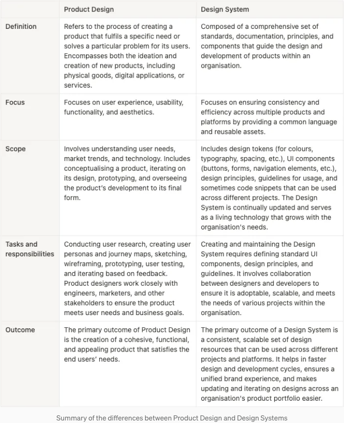

조직에서 디자인 시스템이 내부에서 구축되었지만 성숙도가 낮은 경우, 그 조직의 디지털 제품에 작업하는 제품 디자이너들이 디자인 시스템을 구축하는 경우가 흔합니다.

반면에, 성숙도가 높고 확립된 디자인 시스템을 갖춘 대규모 디자인 팀에서는 거의 항상 디자인 시스템 전담 팀이 있을 것입니다.

이러한 미묘한 차이가 왜 중요한지, 그리고 왜 Design System 디자이너와 제품 디자이너 사이의 차이점을 설명하기 시작했는지 궁금할 수 있습니다. 왜냐하면 제품 디자이너가 디자인 시스템을 만드는 것으로 보이면, 제품 디자이너와 디자인 시스템 디자이너가 동일한 것처럼 보일 수 있기 때문입니다. 하지만 이는 완전히 사실이 아닙니다.

# 제품 디자인 vs. 디자인 시스템

<!-- ui-log 수평형 -->
<ins class="adsbygoogle"
  style="display:block"
  data-ad-client="ca-pub-4877378276818686"
  data-ad-slot="9743150776"
  data-ad-format="auto"
  data-full-width-responsive="true"></ins>
<component is="script">
(adsbygoogle = window.adsbygoogle || []).push({});
</component>

우리가 처음으로 두 분야의 차이점을 명확히 해보겠습니다:

- 제품 디자인: 제품 디자인은 무엇을 제공하고 어떻게 고객 요구를 최상으로 충족시킬지를 결정하는 작업을 말합니다. 사용자 요구사항, 기능성 및 사용자 경험을 고려하여 개별 제품을 만드는 것에 초점을 두는 분야입니다.
- 디자인 시스템: 디자인 시스템은 디자인을 대규모로 관리하기 위해 사용되는 종합적인 표준 세트입니다. 재사용 가능한 구성 요소, 패턴 및 지침으로 구성되어 제품 간 디자인에서 일관성과 효율성을 보장합니다.

제품 디자인은 특정 제품을 만드는 데 초점을 맞추지만, 디자인 시스템은 여러 제품이나 플랫폼에서 일관된 디자인을 확립하는 데 중점을 둡니다.

정의상으로는, 제품 디자인과 디자인 시스템 사이에 명확한 차이가 있지만, 유사성이 있습니다. 자세히 살펴보겠습니다:

<!-- ui-log 수평형 -->
<ins class="adsbygoogle"
  style="display:block"
  data-ad-client="ca-pub-4877378276818686"
  data-ad-slot="9743150776"
  data-ad-format="auto"
  data-full-width-responsive="true"></ins>
<component is="script">
(adsbygoogle = window.adsbygoogle || []).push({});
</component>

제품 디자인과 디자인 시스템은 디자인 분야 전반에서 중요한 요소이지만, 서로 다른 목적을 가지고 있으며 디자인 프로세스의 다른 측면을 다룹니다.

이 두 분야의 차이로 인해 제품 디자이너와 디자인 시스템 디자이너의 역할도 다를 수 있습니다.

# 제품 디자이너와 디자인 시스템 디자이너의 역할 차이

<!-- ui-log 수평형 -->
<ins class="adsbygoogle"
  style="display:block"
  data-ad-client="ca-pub-4877378276818686"
  data-ad-slot="9743150776"
  data-ad-format="auto"
  data-full-width-responsive="true"></ins>
<component is="script">
(adsbygoogle = window.adsbygoogle || []).push({});
</component>

제품 디자이너와 디자인 시스템 디자이너를 구분하는 것을 더 깊이 파악하려면 그들의 역할의 복잡성, 일상적인 작업의 세세한 부분, 그리고 조직 내에서의 작업의 넓은 영향에 대해 자세히 살펴봐야 합니다.

# 제품 디자이너

## 책임 범위

- 사용자 중심 디자인 프로세스: 제품 디자이너들은 사용자 중심 디자인 프로세스에 크게 투자합니다. 이에는 광범위한 사용자 연구, 사용자 페르소나 생성, 사용자 여정 매핑, 그리고 사용자 피드백에 기반한 디자인 지속적인 반복이 포함됩니다. 그들의 목표는 실제 사용자들을 위해 실제 문제를 해결하는 것으로, 공감이 중요한 기술입니다.
- 프로토타이핑과 검증: 제품 디자이너들은 서로 다른 정확도 수준의 다양한 디자인 솔루션을 프로토타입화하는 데 상당한 시간을 투자합니다. 이것은 저정확도 스케치부터 고정확도 대화형 프로토타입까지가 포함됩니다. 이러한 프로토타입은 실제 사용자들을 통해 가설과 디자인 결정을 유효성 검사하는 사용성 테스트 세션에서 사용되어, 최종 제품이 사용 가능하고 바람직한지 확인합니다.
- 시각 및 상호작용 디자인: 제품 디자이너들은 제품을 단순히 사용 가능한 것으로 만드는 것을 넘어, 시각적으로 매력적이게 만들기(UI 디자인)와 사용자가 제품을 사용하는 것을 즐길 수 있는 원활한 상호작용 경험(UX 디자인)에도 집중합니다. 이에는 시각 디자인 원칙에 대한 예리한 시각과 HCI 이해가 필요합니다.
- 다학제적 협업: 제품 디자이너들은 엔지니어, 제품 관리자, 마케터, 그리고 아마도 고객 지원 팀과 밀접하게 협력하여, 사용자 요구 사항에 대한 공유된 이해를 조성하고 솔루션이 기술적 능력과 비즈니스 전략 내에 적합한지를 보장합니다.

<!-- ui-log 수평형 -->
<ins class="adsbygoogle"
  style="display:block"
  data-ad-client="ca-pub-4877378276818686"
  data-ad-slot="9743150776"
  data-ad-format="auto"
  data-full-width-responsive="true"></ins>
<component is="script">
(adsbygoogle = window.adsbygoogle || []).push({});
</component>

## 설계와 제품에 미치는 영향

제품 디자이너는 제품과 사용자의 상호작용에 직접적인 영향을 미치며, 사용자 만족도, 참여도, 그리고 최종적으로 시장에서의 제품 성공에 영향을 줍니다. 그들은 사용자의 요구 사항과 비즈니스 목표를 균형 있게 맞추고, 다양한 사용자 세그먼트를 위한 설계와 접근성 및 포용성을 확보하는 등 다양한 도전에 직면하게 됩니다.

# 디자인 시스템 디자이너

## 책임 범위

<!-- ui-log 수평형 -->
<ins class="adsbygoogle"
  style="display:block"
  data-ad-client="ca-pub-4877378276818686"
  data-ad-slot="9743150776"
  data-ad-format="auto"
  data-full-width-responsive="true"></ins>
<component is="script">
(adsbygoogle = window.adsbygoogle || []).push({});
</component>

- 시스템 Thinking: 디자인 시스템 디자이너들은 시스템 Thinking의 원칙을 적용하여 확장 가능하고 재사용 가능한 디자인 솔루션을 만듭니다. 그들은 단순히 구성 요소를 고립시키는 것이 아니라 모든 구성 요소가 제품 및 플랫폼 내에서 및 간에 어떻게 함께 작동할 수 있는지 고려합니다.
- 구성 요소 디자인 및 문서화: 그들의 역할 중 중요한 부분은 UI 구성 요소를 디자인하고 철저히 문서화하는 것입니다. 이 문서에는 시각적 명세 (크기, 색상, 타이포그래피) 뿐만 아니라 행동 명세 (상태, 상호 작용, 애니메이션) 및 구현을 위한 코드 지침도 포함됩니다.
- 디자인 시스템 유지 및 발전: 디지털 세계는 지속적으로 발전하기 때문에 디자인 시스템 디자이너는 디자인 시스템이 적응하고 성장하도록 보장해야 합니다. 이는 새로운 구성 요소를 추가하고 오래된 것을 폐기하며 시스템이 효율적이고 관련성을 유지하도록 하는 작업을 포함합니다.
- 대변 및 교육: 디자인 시스템을 성공적으로 구현하려면 조직 내 다양한 이해관계자들의 참여가 필요합니다. 디자인 시스템 디자이너는 종종 다른 사람들에게 디자인 시스템에 대해 교육하고 그 가치를 시연하며 디자이너와 개발자들을 어떻게 효과적으로 사용하는지에 대해 교육합니다.

## 그들이 제공하는 제품에 미치는 영향

디자인 시스템 디자이너들은 메타 수준에서 작업하여 조직 전체에 걸쳐 제품 디자인 과정에 영향을 줍니다. 이들의 작업은 디자인 및 개발 효율성 향상, 제품 간 일관성 향상 및 팀 간 협력 용이성으로 이어집니다. 그들의 도전은 종종 시스템 확장을 통해 부풀림을 방지하고 조직 전체에 채택을 확보하며 시스템을 가장 관련성 있는 디자인 및 기술 표준으로 최신 상태로 유지하는 것을 포함합니다.

# 역할에서의 중복됨

<!-- ui-log 수평형 -->
<ins class="adsbygoogle"
  style="display:block"
  data-ad-client="ca-pub-4877378276818686"
  data-ad-slot="9743150776"
  data-ad-format="auto"
  data-full-width-responsive="true"></ins>
<component is="script">
(adsbygoogle = window.adsbygoogle || []).push({});
</component>

제품 디자이너와 디자인 시스템 디자이너의 명확한 역할과 중점 영역에도 불구하고, 제품 개발 생태계 내에서 이 포지션들이 얼마나 연결되어 있는지를 보여주는 몇 가지 중첩이 존재합니다. 이러한 중첩은 주로 두 역할이 일정한 범위에서 공유하는 기술, 방법론 및 목표에 나타납니다:

## 사용자 경험에 대한 공동 관심

두 역할 모두 사용자 경험(UX)을 강화하기 위한 깊은 헌신을 가지고 있습니다. 제품 디자이너는 특정 제품을 위한 디자인 결정을 통해 직접적으로 UX를 형성하며, 디자인 시스템 디자이너는 제품 간 일관성과 사용성을 보장하는 도구 및 지침을 제공함으로써 간접적으로 UX에 영향을 미칩니다. 물론, 최종 사용자를 고려할 때입니다. 디자인 시스템의 사용자는 제품 디자이너 및 엔지니어이며, 이들의 UX도 디자인 시스템 디자이너가 고려합니다.

## 디자인 원칙 및 최선의 실천법

<!-- ui-log 수평형 -->
<ins class="adsbygoogle"
  style="display:block"
  data-ad-client="ca-pub-4877378276818686"
  data-ad-slot="9743150776"
  data-ad-format="auto"
  data-full-width-responsive="true"></ins>
<component is="script">
(adsbygoogle = window.adsbygoogle || []).push({});
</component>

두 종류의 디자이너는 디자인 원칙과 최良의 실천 방법에 대한 기본적인 이해를 바탕으로 합니다. 이에는 색상 이론, 타이포그래피, 레이아웃 및 상호작용 디자인 원칙에 대한 지식이 포함되어 있으며, 이를 통해 매력적이고 기능적으로 효과적인 디자인을 만들 수 있습니다.

## 협력과 소통

개발자, 제품 매니저 및 다른 디자이너와의 협력은 두 역할 모두에게 중요합니다. 디자인 결정을 옹호하고 피드백을 제공하며 디자인 의도가 정확히 구현되도록 하는 데 효과적인 소통 기술이 필요합니다.

## 프로토타이핑과 테스트

<!-- ui-log 수평형 -->
<ins class="adsbygoogle"
  style="display:block"
  data-ad-client="ca-pub-4877378276818686"
  data-ad-slot="9743150776"
  data-ad-format="auto"
  data-full-width-responsive="true"></ins>
<component is="script">
(adsbygoogle = window.adsbygoogle || []).push({});
</component>

제품 디자이너와 디자인 시스템 디자이너 모두 디자인 아이디어를 소통하고 테스트하는 데 프로토타이핑 도구를 사용합니다. 제품 디자이너의 경우 사용자 흐름 및 특정 제품 내 상호 작용에 중점을 두고 프로토타입을 만들지만, 디자인 시스템 디자이너는 디자인 구성 요소의 유연성과 다양한 문맥에서의 적용 가능성을 테스트하기 위해 프로토타입을 만들 수 있습니다.

## 반복과 사용자 피드백

사용자 피드백과 데이터에 기반한 반복은 두 역할 모두에서 일반적인 프로세스입니다. 제품 디자이너는 제품 디자인을 개선하여 사용자 요구를 더 잘 충족시키고, 디자인 시스템 디자이너는 컴포넌트와 가이드라인을 반복하여 다양한 제품과 신흥 비즈니스 요구에 걸맞고 효과적인지 확인할 수 있습니다.

## 접근성과 포용성에 대한 주의력

<!-- ui-log 수평형 -->
<ins class="adsbygoogle"
  style="display:block"
  data-ad-client="ca-pub-4877378276818686"
  data-ad-slot="9743150776"
  data-ad-format="auto"
  data-full-width-responsive="true"></ins>
<component is="script">
(adsbygoogle = window.adsbygoogle || []).push({});
</component>

디자인이 접근 가능하고 포괄적인지 확보하는 것은 모두의 책임입니다. 두 역할 모두 다양한 사용자를 고려하고, 설계한 제품이나 구성 요소를 최대한 많은 사람이 사용할 수 있도록 보장해야 합니다.

## 디자인 및 프로토타이핑 도구 활용

두 역할 모두 Figma 및 Sketch와 같은 디자인 및 프로토타이핑 도구에 대한 능숙함이 필요합니다. 이러한 도구는 디자인을 작성하고 프로토타입을 작성하며, 팀원들과 협업하는 데 사용됩니다.

## 디자인 일관성을 위한 대변 활동

<!-- ui-log 수평형 -->
<ins class="adsbygoogle"
  style="display:block"
  data-ad-client="ca-pub-4877378276818686"
  data-ad-slot="9743150776"
  data-ad-format="auto"
  data-full-width-responsive="true"></ins>
<component is="script">
(adsbygoogle = window.adsbygoogle || []).push({});
</component>

디자인 시스템 디자이너들은 디자인의 일관성을 보장하는 표준을 만들기 위해 직접 책임을 집니다. 한편 제품 디자이너들은 이러한 디자인 시스템을 준수하고 때로는 그 발전에 기여함으로써 자신의 작업에서 일관성을 지킵니다.

## 문서화

문서화는 두 역할 모두에게 귀중한데, 약간 다른 맥락에서 중요합니다. 제품 디자이너들은 사용자 흐름, 디자인 결정 및 사용자 조사 결과를 문서화할 수 있지만, 디자인 시스템 디자이너들은 디자인 시스템 가이드라인, 구성 요소 사용 및 모범 사례를 문서화하는 데 중점을 둡니다.

# 마지막으로

<!-- ui-log 수평형 -->
<ins class="adsbygoogle"
  style="display:block"
  data-ad-client="ca-pub-4877378276818686"
  data-ad-slot="9743150776"
  data-ad-format="auto"
  data-full-width-responsive="true"></ins>
<component is="script">
(adsbygoogle = window.adsbygoogle || []).push({});
</component>

두 역할 모두 디자인을 제공하지만, 각각의 초점과 프로세스는 명확하게 다릅니다.

제품 디자이너가 디자인 시스템을 만드는 것은 위험할 수 있습니다. 기존 사용자 요구에 일관되게 대응하고 미래 사례에 대비할 수 있도록 구축된 구성요소를 만들기 위해 시스템적 사고 방식이 필요하기 때문입니다.

그 반대의 경우도 적용됩니다. 디자인 시스템 디자이너가 최종 사용자를 위해 제품을 만드는 것은 원하는 대로 되지 않을 수 있습니다. 디자인 시스템 디자이너는 빌드한 것의 시각적 매력에 덜 관심을 가지고 있으며, 구축 중인 것이 사용자 요구를 해결하고, 구현할 엔지니어들에게 안내를 제공하며, 장래적인 필요에 대비할 수 있도록 하는 규칙과 가이드라인에 더 집중합니다.

제품 디자이너는 특정 제품을 위해 즐거운 및 기능적인 사용자 경험을 만들기에 초점을 맞추는 반면, 디자인 시스템 디자이너는 조직 전체 제품 라인에 대해 일관되고 효율적인 디자인을 가능하게 하는 인프라에 투자합니다.

<!-- ui-log 수평형 -->
<ins class="adsbygoogle"
  style="display:block"
  data-ad-client="ca-pub-4877378276818686"
  data-ad-slot="9743150776"
  data-ad-format="auto"
  data-full-width-responsive="true"></ins>
<component is="script">
(adsbygoogle = window.adsbygoogle || []).push({});
</component>

그럼에도 불구하고, 두 역할 모두 고품질의 디지털 제품과 경험을 전달하는 데 중요합니다.