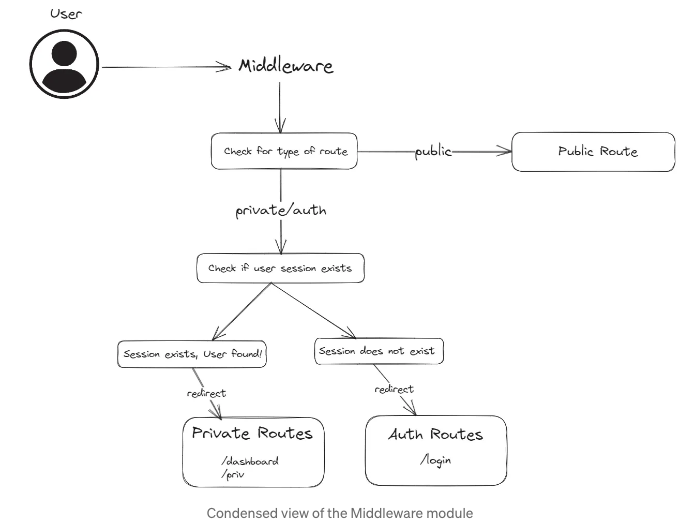
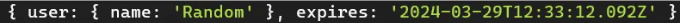
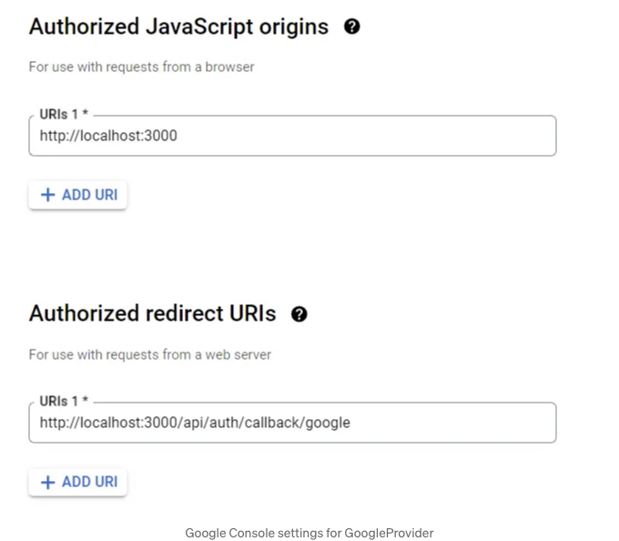

제가 작성 중인 Next.js 14에서 Next-Auth v5를 사용한 완전한 인증 구현에 관한 두 번째 블로그 파트입니다. 첫 번째 블로그를 아직 읽지 않으셨다면, 먼저 확인하는 것을 강력히 추천드립니다: https://medium.com/@nikhilc2209/client-side-form-validation-with-zod-useformstate-in-next-js-14-dc011a9c44fb

이 블로그에서는 Next-Auth v5를 사용하여 Next.js 프로젝트에서 인증 및 OAuth를 구현하는 것이 얼마나 쉬운지에 대해 이야기하겠습니다.


# Next-Auth 설정하기

<!-- ui-log 수평형 -->
<ins class="adsbygoogle"
  style="display:block"
  data-ad-client="ca-pub-4877378276818686"
  data-ad-slot="9743150776"
  data-ad-format="auto"
  data-full-width-responsive="true"></ins>
<component is="script">
(adsbygoogle = window.adsbygoogle || []).push({});
</component>

NextAuth.js는 Next.js 애플리케이션용 오픈 소스 인증 라이브러리로, 다양한 인증 공급업체를 위한 유틸리티, 미들웨어 및 전략을 제공하여 Next.js 프로젝트에서 인증 구현 프로세스를 간소화하려고 노력합니다. 개발자들에게 인증을 간편하게 만드는 데 도움이 되도록 Authentication에 대한 여러 가지 전략을 제공합니다.

## Next-Auth 설치하기

Next.js 프로젝트에 Next-Auth v5를 포함하려면 단순히 다음 명령을 실행하면 됩니다:

npm install next-auth@beta

<!-- ui-log 수평형 -->
<ins class="adsbygoogle"
  style="display:block"
  data-ad-client="ca-pub-4877378276818686"
  data-ad-slot="9743150776"
  data-ad-format="auto"
  data-full-width-responsive="true"></ins>
<component is="script">
(adsbygoogle = window.adsbygoogle || []).push({});
</component>

이 버전은 아직 베타 버전이며 본 릴리스에 포함되지 않았습니다.

# Next-Auth v4에서의 변경 사항

Next-Auth 라이브러리는 어느 정도 오랜 시간동안 사용되어 왔고 최근 Next-Auth v5가 소개된 이후에는 주요 변경 사항이 있었습니다. 이 변경 사항들은 많은 새로운 기능을 도입하였지만 발행자들은 파괴적인 변화의 수를 최소화하기 위해 최선을 다하였습니다.

공식 문서에서 이러한 변경 사항의 요약은 다음과 같습니다:

<!-- ui-log 수평형 -->
<ins class="adsbygoogle"
  style="display:block"
  data-ad-client="ca-pub-4877378276818686"
  data-ad-slot="9743150776"
  data-ad-format="auto"
  data-full-width-responsive="true"></ins>
<component is="script">
(adsbygoogle = window.adsbygoogle || []).push({});
</component>

가장 주목할 만한 변화는 대부분의 세션 관련 호출이 이제 Universal auth() 호출로 대체되어 코드를 더 읽기 쉽게 만든다는 점입니다.

# Auth 핸들러 추가

먼저, 모든 인증 관련 요청을 처리할 auth 파일을 설정해보겠습니다. src 디렉토리에 이 파일을 생성하여 어디에서든 @로 시작하는 절대 경로를 사용하여 응용 프로그램에서 쉽게 가져올 수 있도록 합니다. 아래는 auth.js 파일이어야 하는 예시입니다. 우리는 Credentials(사용자명/비밀번호)을 통해 로그인하거나 OAuth 제공자인 Google을 통해 로그인할 두 가지 옵션이 있습니다.

```js
auth.js

import NextAuth from "next-auth"
import GoogleProvider from "next-auth/providers/google"
import CredentialsProvider from "next-auth/providers/credentials";

export const {
  handlers: { GET, POST },
  auth,
} = NextAuth({
  session: { strategy: 'jwt' },

  providers: [

    CredentialsProvider({

      credentials: {
        username: { label: "사용자명", type: "text" },
        password: { label: "비밀번호", type: "password" }
      },

      async authorize(credentials) {
        // 여기에 권한 부여 로직을 작성합니다.
      }

    GoogleProvider({
      clientId: process.env.GOOGLE_CLIENT_ID,
      clientSecret: process.env.GOOGLE_CLIENT_SECRET,
    }),
   ]
})
```

<!-- ui-log 수평형 -->
<ins class="adsbygoogle"
  style="display:block"
  data-ad-client="ca-pub-4877378276818686"
  data-ad-slot="9743150776"
  data-ad-format="auto"
  data-full-width-responsive="true"></ins>
<component is="script">
(adsbygoogle = window.adsbygoogle || []).push({});
</component>

이제 우리는 인증을 위한 모든 로직이 포함된 app 디렉토리 내부에 api/auth라는 폴더를 만들 것입니다. 이 폴더 안에는 route.js라는 파일이 있는 [...nextauth]라는 하위 디렉토리를 생성합니다. 흥미로운 점은 이 네이밍 규칙이 정말 중요하다는 것인데요, 이렇게 하면 /api/auth/*로 시작하는 모든 API 요청이 [...nextauth]/route.js 파일에 작성된 코드로 처리됩니다.

참고: Next-Auth v4에서는 모든 권한 부여 로직이 [...nextauth].js 파일로 처리되었지만, v5 업그레이드 이후 권한 부여 로직을 저장소의 루트로 이동하여 어디서든 쉽게 가져올 수 있도록 했습니다.

그리고 이제 이 파일은 그 경로에 대한 GET 및 POST 요청에 대한 1줄 핸들러로 변합니다.

```js
app/api/auth/[...nextauth]/route.js

export { GET, POST } from "@/auth"
```

<!-- ui-log 수평형 -->
<ins class="adsbygoogle"
  style="display:block"
  data-ad-client="ca-pub-4877378276818686"
  data-ad-slot="9743150776"
  data-ad-format="auto"
  data-full-width-responsive="true"></ins>
<component is="script">
(adsbygoogle = window.adsbygoogle || []).push({});
</component>

# 자격 증명 제공자 설정하기

자격 증명 제공자 설정은 매우 간단합니다. 이전 블로그에서 생성한 로그인 폼을 기억하나요? 단순히 next-auth 라이브러리에서 제공하는 signIn 함수를 사용하여 폼 데이터를 전달하고 응답을 기다리기만 하면 됩니다.

```js
  const response = await signIn("credentials", { 
   username: formData.get("username"),
   password: formData.get("password"),
   redirect: false, 
  });
```

이제 방금 만든 자격 증명 제공자의 authorize 함수에서 이 요청을 처리할 수 있습니다. 이 블로그에서는 데이터베이스에 연결하지 않고, 단순히 사용자 이름 및 비밀번호를 저장하기 위해 더미.json 파일을 사용하겠습니다. authorize 함수에서 json 파일을 반복하고 사용자 이름과 비밀번호와 일치하는 자격 증명을 찾아보겠습니다.

<!-- ui-log 수평형 -->
<ins class="adsbygoogle"
  style="display:block"
  data-ad-client="ca-pub-4877378276818686"
  data-ad-slot="9743150776"
  data-ad-format="auto"
  data-full-width-responsive="true"></ins>
<component is="script">
(adsbygoogle = window.adsbygoogle || []).push({});
</component>

만약 찾으면 user.id 및 user.username과 함께 사용자 객체를 반환하고, next-auth는 auth.js에서 정의된 전략을 사용하여 세션을 만듭니다. 그렇지 않으면 자격 증명이 올바르지 않다는 것을 나타내는 null을 반환합니다.

signIn 함수와 유사하게 Next-Auth는 현재 세션을 삭제하는 signOut 함수도 제공합니다. 이렇게 함으로써 Next-Auth를 사용하여 쉽게 로그인 및 로그아웃할 수 있습니다.

또한 jwt 토큰을 사용하려면 .env 파일에서 NEXTAUTH_SECRET이라는 비밀 키를 정의해야 합니다. 이는 각 jwt 토큰이 공유되어서는 안 되는 개인 키로 서명되어야 하기 때문에 중요합니다. 이를 생성하려면 터미널로 이동하여 openssl rand -base64 32를 실행하여 무작위 32비트 base64 문자열을 생성하면 됩니다. 이를 개인 키로 사용합니다.

## 공개, 보호 및 인증 라우트 정의

<!-- ui-log 수평형 -->
<ins class="adsbygoogle"
  style="display:block"
  data-ad-client="ca-pub-4877378276818686"
  data-ad-slot="9743150776"
  data-ad-format="auto"
  data-full-width-responsive="true"></ins>
<component is="script">
(adsbygoogle = window.adsbygoogle || []).push({});
</component>

이제 로그인 페이지가 작동 중이므로 공개(public), 비공개(private), 그리고 보호(protected) 라우트를 정의할 수 있습니다. 아이디어는 매우 간단합니다:

- 공개 라우트는 누구나 항상 액세스할 수 있어야 하므로 여기에는 민감한 데이터가 없어야 하며 사용자가 이 URL을 방문하려면 확인이 필요하지 않습니다. 예: 홈페이지.
- 보호된 라우트는 인증된 사용자만 액세스할 수 있어야 하며 사용자별 또는 다른 종류의 민감한 데이터를 포함할 수 있으므로 사용자는 이를 보기 위해 로그인해야 합니다. 사용자가 로그인되어 있는지 확인하려면 세션 토큰이 유효한지 확인할 수 있습니다. 예: 사용자 대시보드 페이지.
- 인증 라우트는 사용자가 자신의 신원을 확인하기 위해 로그인 자격 증명을 제공해야 하는 로그인/등록 페이지를 가리킵니다. 이러한 페이지는 사용자가 로그인되어 있지 않은 경우에만 표시되어야 합니다. 사용자가 로그인되어 있는 경우 대시보드 페이지로 리디렉션되며, 다른 ID를 사용하여 로그인하려면 먼저 로그아웃해야 합니다. 예: 로그인 페이지.

# 미들웨어 구성 추가

Next-Auth를 사용하여 미들웨어를 추가하는 것이 좋으며 작업을 훨씬 쉽게 만들어줍니다. 구성된 미들웨어는 모든 요청이 통과하는 필터 역할을 합니다. 여기서는 어떤 요청이 어떤 유형의 라우트에 속하는지 확인하고 해당 처리를 할 수 있습니다. 아래에서 미들웨어가 작동하는 방식에 대한 개요를 살펴보겠습니다.

<!-- ui-log 수평형 -->
<ins class="adsbygoogle"
  style="display:block"
  data-ad-client="ca-pub-4877378276818686"
  data-ad-slot="9743150776"
  data-ad-format="auto"
  data-full-width-responsive="true"></ins>
<component is="script">
(adsbygoogle = window.adsbygoogle || []).push({});
</component>



```js
import { auth } from "@/auth";
import { privateRoutes, 
         authRoutes, 
         DEFAULT_REDIRECT_LOGIN_URL, 
         DEFAULT_REDIRECT_HOME_URL } from './routes';

export const config = {
  matcher: ["/((?!.+\\.[\\w]+$|_next).*)", "/", "/(api|trpc)(.*)"],
}
```

우리는 모든 비공개, 공개 및 보호된 경로를 포함하는 미들웨어를 함께 정의한 routes.js 파일도 정의합니다.

참고: 이 이상한 모습의 정규 표현식은 사실상 서버로 전송된 모든 요청과 일치하므로 모든 요청이 미들웨어 확인을 통과해야 합니다. 하지만 여기에는 비공개 경로만 정의할 수도 있지만, 이전 방법이 더 많은 제어권을 제공하며 강력히 권장됩니다.

<!-- ui-log 수평형 -->
<ins class="adsbygoogle"
  style="display:block"
  data-ad-client="ca-pub-4877378276818686"
  data-ad-slot="9743150776"
  data-ad-format="auto"
  data-full-width-responsive="true"></ins>
<component is="script">
(adsbygoogle = window.adsbygoogle || []).push({});
</component>

## 세션을 사용하여 데이터 렌더링하기

우리가 만든 세션을 사용하여 인증된 사용자의 사용자 이름/이메일과 같은 사용자별 정보를 전달할 수도 있습니다. 방금 만든 세션을 console.log()로 확인하면 우리는 다음을 볼 수 있습니다:



우리는 성공적인 로그인 시 전달한 사용자 이름과 현재 토큰의 만료 시간을 가져올 수 있습니다. 또한 auth.js의 authorize 함수에서 원하는 추가 정보를 추가할 수도 있습니다. 이 정보를 사용하여 대시보드 페이지나 다른 공개/보호된 경로에서 현재 로그인한 사용자를 표시할 수 있습니다.

<!-- ui-log 수평형 -->
<ins class="adsbygoogle"
  style="display:block"
  data-ad-client="ca-pub-4877378276818686"
  data-ad-slot="9743150776"
  data-ad-format="auto"
  data-full-width-responsive="true"></ins>
<component is="script">
(adsbygoogle = window.adsbygoogle || []).push({});
</component>

## 보호 및 인증 라우트를 위한 리디렉션 추가

우리의 자격 증명 인증을 완료하는 마지막 작업은 리디렉션 URL을 설정하는 것입니다. 이들은 미들웨어.js에서 라우트 유형 및 사용자 세션이 있는지 여부에 따라 트리거될 것입니다.

```js
// 사용자가 로그인되어 있지 않고 보호된 라우트에 액세스하려고 할 때 로그인 페이지로 리디렉트
export const DEFAULT_REDIRECT_LOGIN_URL = '/login'

// 사용자가 로그인되어 있고 로그인 페이지에 액세스하려고 할 때 대시보드로 리디렉트
export const DEFAULT_REDIRECT_HOME_URL = '/dashboard'
```

그리고 지금, 우리는 Next-Auth v5를 사용하여 자격 증명 인증을 성공적으로 구성했습니다.

<!-- ui-log 수평형 -->
<ins class="adsbygoogle"
  style="display:block"
  data-ad-client="ca-pub-4877378276818686"
  data-ad-slot="9743150776"
  data-ad-format="auto"
  data-full-width-responsive="true"></ins>
<component is="script">
(adsbygoogle = window.adsbygoogle || []).push({});
</component>

# OAuth 제공자 추가하기

마지막으로, 사용자가 자격 증명을 통해 로그인하거나 Google, Github 등의 제공자를 통해 로그인할 수 있는 옵션을 제공하기 위해 우리가 언급한 OAuth 제공자를 구성해야 합니다. Next-Auth를 사용하면OAuth를 추가하는 것은 정말 쉬운 일이에요. Next-Auth는 다양한 OAuth 옵션을 제공하지만, 이 블로그를 간결하게 유지하기 위해 GoogleProvider 설정 방법만 소개하겠습니다.

Next-Auth 공식 문서에 따르면 GoogleProvider를 설정하기 위해 GOOGLE_CLIENT_ID와 GOOGLE_CLIENT_SECRET이 필요합니다. 이러한 정보는https://console.developers.google.com/apis/credentials에서 새 프로젝트를 만들어 쉽게 생성할 수 있어요. 이 프로젝트에서 OAuth 2.0 자격 증명을 생성하고 .env 파일에 붙여넣어 노출되지 않도록 주의하세요.

개발 중에는 URI로 localhost를 사용하고 리디렉트 URI로 http://localhost:3000/api/auth/callback/google을 사용하면, 모든 OAuth 요청이 auth.js 파일에서 처리됩니다.

<!-- ui-log 수평형 -->
<ins class="adsbygoogle"
  style="display:block"
  data-ad-client="ca-pub-4877378276818686"
  data-ad-slot="9743150776"
  data-ad-format="auto"
  data-full-width-responsive="true"></ins>
<component is="script">
(adsbygoogle = window.adsbygoogle || []).push({});
</component>



이를 트리거하기 위해 로그인 페이지에서 Google OAuth를 위한 버튼을 정의하고 이를 트리거하면 이전에 사용한 signIn 함수를 다시 호출합니다. 우리는 제공자의 이름과 성공적인 로그인 시 사용자를 리다이렉션할 콜백 URL을 전달합니다.

```js
signIn("google", { callbackUrl: 'http://localhost:3000/dashboard'});
```

그러면 자격 증명을 통한 로그인을 성공적으로 구성하고 OAuth를 몇 분만에 설정했습니다! 축하해요! 🎉

<!-- ui-log 수평형 -->
<ins class="adsbygoogle"
  style="display:block"
  data-ad-client="ca-pub-4877378276818686"
  data-ad-slot="9743150776"
  data-ad-format="auto"
  data-full-width-responsive="true"></ins>
<component is="script">
(adsbygoogle = window.adsbygoogle || []).push({});
</component>


사진을 보신 여러분, 블로그를 건너뛰고 코드에만 관심 있는 분들을 위해 소스 코드를 아래에 첨부했어요.

읽어주셔서 감사합니다! 오늘도 즐거운 하루 보내세요! 😅

# 소스 코드:

<!-- ui-log 수평형 -->
<ins class="adsbygoogle"
  style="display:block"
  data-ad-client="ca-pub-4877378276818686"
  data-ad-slot="9743150776"
  data-ad-format="auto"
  data-full-width-responsive="true"></ins>
<component is="script">
(adsbygoogle = window.adsbygoogle || []).push({});
</component>


## 참고 자료:

- Next.js 문서: https://nextjs.org/docs
- Next-Auth v5: https://authjs.dev/guides/upgrade-to-v5
- jwt에 대해 알아보기: https://jwt.io/

# 쉬운 용어로 설명 🚀

<!-- ui-log 수평형 -->
<ins class="adsbygoogle"
  style="display:block"
  data-ad-client="ca-pub-4877378276818686"
  data-ad-slot="9743150776"
  data-ad-format="auto"
  data-full-width-responsive="true"></ins>
<component is="script">
(adsbygoogle = window.adsbygoogle || []).push({});
</component>

먼저 In Plain English 커뮤니티에 참여해 주셔서 감사합니다! 떠나기 전에:

- 작가를 박수와 팔로우 해주세요 👏
- 팔로우하기: X | LinkedIn | YouTube | Discord | Newsletter
- 다른 플랫폼 방문하기: Stackademic | CoFeed | Venture | Cubed
- 더 많은 콘텐츠: PlainEnglish.io