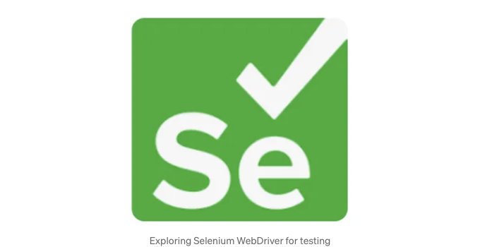
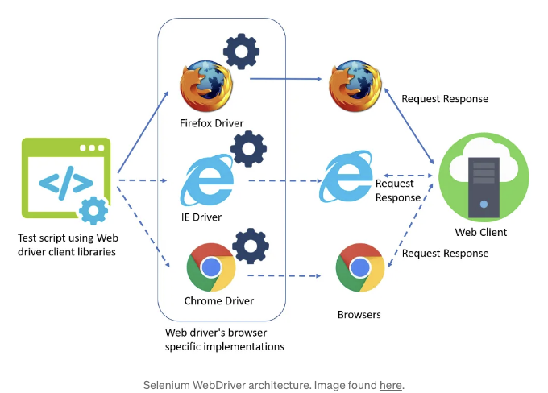

이 글은 독자가 JavaScript, Java, Maven 및 테스팅 및 품질 보증과 관련된 일반적인 원칙에 익숙하다고 가정합니다.

여기에서 귀로 듣는 기회를 받으세요! 나는 이 도구를 만들었는데, 이 도구를 사용하면 비유료 기사에 대한 음성 파일을 얻을 수 있습니다! 구현은 여기에서 찾을 수 있습니다.

# 소개

<!-- ui-log 수평형 -->
<ins class="adsbygoogle"
  style="display:block"
  data-ad-client="ca-pub-4877378276818686"
  data-ad-slot="9743150776"
  data-ad-format="auto"
  data-full-width-responsive="true"></ins>
<component is="script">
(adsbygoogle = window.adsbygoogle || []).push({});
</component>

지난 튜토리얼에서는 Mocha.js 라이브러리를 살펴보고 기본적인 React 애플리케이션을 테스트하는 데 활용했어요.

Chai와 Enzyme와 같은 추가적인 라이브러리도 사용했어요. Chai를 사용하여 테스트 케이스가 통과했는지 실패했는지를 판별하는 어설션(assertion)을 수행할 수 있었어요.

Enzyme을 사용하면 React 컴포넌트를 클론하고 도우미 함수를 사용하여 유효성을 테스트할 수 있었어요.

오늘은 Selenium WebDriver라는 또 다른 테스팅 도구를 알아보고 이를 사용하여 React 애플리케이션을 테스트할 거에요. 우리는 Java 프로그래밍 언어를 활용하고 테스트에 도움이 되는 별도의 Maven 프로젝트를 생성할 거에요.

<!-- ui-log 수평형 -->
<ins class="adsbygoogle"
  style="display:block"
  data-ad-client="ca-pub-4877378276818686"
  data-ad-slot="9743150776"
  data-ad-format="auto"
  data-full-width-responsive="true"></ins>
<component is="script">
(adsbygoogle = window.adsbygoogle || []).push({});
</component>

이 튜토리얼은 독자가 Java, Maven 및 Java 프로젝트 설정에 익숙하다고 가정합니다.

# Selenium WebDriver란?

간단히 말해서, Selenium WebDriver는 크로스 브라우저 테스트를 가능하게 합니다. 개발자가 브라우저를 사용하여 테스트 프로세스를 자동화하고 웹 애플리케이션이 의도한 대로 작동하는지 확인할 수 있도록 합니다.

Selenium WebDriver는 Java, Node.js, Python 및 C#과 같은 다양한 프로그래밍 언어를 지원하며 Firefox, Google Chrome, Safari 및 Internet Explorer와 같은 다양한 브라우저를 지원하여 자동화된 테스트를 실행할 수 있습니다.

<!-- ui-log 수평형 -->
<ins class="adsbygoogle"
  style="display:block"
  data-ad-client="ca-pub-4877378276818686"
  data-ad-slot="9743150776"
  data-ad-format="auto"
  data-full-width-responsive="true"></ins>
<component is="script">
(adsbygoogle = window.adsbygoogle || []).push({});
</component>

특정 웹 페이지에서 웹 요소에 액세스하고 해당 요소와 상호 작용하여 성능을 확인합니다. Selenium WebDriver는 페이지 요소에 액세스하고 상호 작용하는 다양한 방법을 제공합니다.

이전에 언급했듯이 Selenium WebDriver는 다양한 브라우저를 지원하지만 각 브라우저마다 해당하는 별도의 웹 드라이버가 있습니다.

테스트를 자동화하는 데 사용되는 해당 브라우저별 웹 드라이버는 실행 가능한 파일일 뿐입니다. 브라우저에서 활동이 완전히 자동화되어 보이며 실시간으로 테스트가 실행되는 것을 확인할 수 있습니다.

다양한 브라우저 웹 드라이버에 대한 추가 정보는 여기에서 찾을 수 있습니다.

<!-- ui-log 수평형 -->
<ins class="adsbygoogle"
  style="display:block"
  data-ad-client="ca-pub-4877378276818686"
  data-ad-slot="9743150776"
  data-ad-format="auto"
  data-full-width-responsive="true"></ins>
<component is="script">
(adsbygoogle = window.adsbygoogle || []).push({});
</component>

## 웹 드라이버 아키텍처

우리는 Selenium이 지원하는 웹 드라이버 아키텍처에 대해 더 자세히 살펴볼 것입니다. 다음 다이어그램은 Selenium WebDriver 테스팅 아키텍처를 보여줍니다:

이것은 우리가 이전에 살펴본 전형적인 클라이언트-서버 아키텍처입니다. Selenium WebDriver API를 사용하여 클라이언트 테스트 코드를 작성하고 페이지 요소에 액세스하고 상호 작용합니다.

<!-- ui-log 수평형 -->
<ins class="adsbygoogle"
  style="display:block"
  data-ad-client="ca-pub-4877378276818686"
  data-ad-slot="9743150776"
  data-ad-format="auto"
  data-full-width-responsive="true"></ins>
<component is="script">
(adsbygoogle = window.adsbygoogle || []).push({});
</component>

특정 브라우저에서 클라이언트 코드를 실행할 계획이 있다면 해당 브라우저 전용 웹 드라이버를 사용할 것입니다. 이전에 논의한 것처럼, 이는 테스트 프로세스를 자동화할 것입니다.

웹 드라이버 브라우저는 전형적인 브라우저의 작동 방식과 동일하게 작동합니다. 클라이언트 서버와 요청/응답을 주고받을 것입니다.

Selenium WebDriver를 사용하는 여러 이점이 있습니다. 첫 번째로, 개발자와 테스터 모두가 자동화되고 다양한 브라우저에서 실행할 수 있는 테스트 코드를 작성할 수 있습니다. 이를 통해 사용자가 어떤 브라우저를 사용하더라도 성능 메트릭이 충족됨을 보장합니다.

두 번째 이점은 개발자가 버그를 확인하고 전체 사용자 경험을 원활하게 테스트할 수 있도록 하는 것입니다.

<!-- ui-log 수평형 -->
<ins class="adsbygoogle"
  style="display:block"
  data-ad-client="ca-pub-4877378276818686"
  data-ad-slot="9743150776"
  data-ad-format="auto"
  data-full-width-responsive="true"></ins>
<component is="script">
(adsbygoogle = window.adsbygoogle || []).push({});
</component>

서로 다른 프로그래밍 언어를 지원함으로써 Selenium WebDriver는 개발자들이 Selenium WebDriver API와 상호 작용하는 데 원하는 언어로 테스트 코드를 작성할 수 있도록 유연성을 제공합니다.

# Selenium WebDriver API

Selenium WebDriver API는 포괄적이며 개발자들이 웹 페이지 동작을 원활하게 테스트할 수 있도록 합니다. 이 섹션에서는 API가 제공하는 핵심 기능 중 일부를 간단히 살펴보겠습니다.

어떤 작업을 실행하기 전에 Selenium이 제공하는 내장 WebDriver 클래스를 사용하여 웹 드라이버를 인스턴스화해야 합니다.

<!-- ui-log 수평형 -->
<ins class="adsbygoogle"
  style="display:block"
  data-ad-client="ca-pub-4877378276818686"
  data-ad-slot="9743150776"
  data-ad-format="auto"
  data-full-width-responsive="true"></ins>
<component is="script">
(adsbygoogle = window.adsbygoogle || []).push({});
</component>

우리는 사용하고 싶은 브라우저와 관련된 브라우저별 웹 드라이버 클래스를 사용합니다.

다음은 일반적인 웹 브라우저와 그에 해당하는 웹 드라이버 클래스 목록입니다:

- Mozilla Firefox — GeckoDriver
- Google Chrome — ChromeDriver
- Microsoft Edge Browser — EdgeDriver
- Microsoft Internet Explorer — InternetExplorerDriver
- Safari — SafariDriver

인스턴스화에 성공한 후에는 API에서 제공하는 핵심 기능 중 하나를 사용할 수 있습니다.

<!-- ui-log 수평형 -->
<ins class="adsbygoogle"
  style="display:block"
  data-ad-client="ca-pub-4877378276818686"
  data-ad-slot="9743150776"
  data-ad-format="auto"
  data-full-width-responsive="true"></ins>
<component is="script">
(adsbygoogle = window.adsbygoogle || []).push({});
</component>

## 대기 시간

우리는 테스트가 올바르게 통과되도록 대기 시간을 설정할 수 있습니다. 이를 통해 웹 브라우징과 관련된 다양한 뉘앙스를 고려할 수 있습니다.

페이지 로드 시간은 다양하며 때로는 예상보다 오래 걸리기도 합니다. 대기 시간 없이 테스트를 실행하면 브라우저의 변덕에 좌우될 수 있습니다. 특정 테스트를 위해 페이지가 제 시간에 로드되지 않으면 테스트가 실패할 수 있습니다.

또 다른 경우에는 페이지가 제 시간에 로드되었기 때문에 테스트가 통과할 수 있지만, 실제로는 실패할 수도 있습니다. 모든 액션 사이에 대기 시간을 일괄적으로 설정함으로써 이를 피할 수 있습니다.

<!-- ui-log 수평형 -->
<ins class="adsbygoogle"
  style="display:block"
  data-ad-client="ca-pub-4877378276818686"
  data-ad-slot="9743150776"
  data-ad-format="auto"
  data-full-width-responsive="true"></ins>
<component is="script">
(adsbygoogle = window.adsbygoogle || []).push({});
</component>

셀레니움에서는 두 가지 다른 대기 시간이 있어요:

- 암묵적 대기 — implicitlyWait() 함수를 사용하여 모든 작업 사이에 설정된 범용 대기 시간
- 명시적 대기 — 특정 작업 사이에 설정된 특정 대기 시간으로 Wait 클래스를 사용하여 수행할 수 있어요

동작을 진행하기 전에 브라우저를 매우 짧은 시간동안 대기시켜요 (시간은 초 단위로 설정돼요).

## 로케이터와 WebElement 클래스

<!-- ui-log 수평형 -->
<ins class="adsbygoogle"
  style="display:block"
  data-ad-client="ca-pub-4877378276818686"
  data-ad-slot="9743150776"
  data-ad-format="auto"
  data-full-width-responsive="true"></ins>
<component is="script">
(adsbygoogle = window.adsbygoogle || []).push({});
</component>

웨이팅 시간을 설정하는 것 외에도 Selenium WebDriver API는 웹 요소에 접근하는 다양한 방법을 제공합니다.

물론, 이는 이 테스트 도구를 사용하는 주요 측면이며, 웹 요소에 접근하고 상호 작용하는 방법이 필요합니다.

Selenium WebDriver에는 한 번 접근된 웹 요소와 상호 작용하기 위한 다양한 함수를 포함한 WebElement 클래스가 내장되어 있습니다.

우리는 인스턴스화된 웹 드라이버와 findElement() 함수를 사용하여 웹 요소에 접근합니다. 이는 WebElement 타입의 객체를 반환하며, 그것이 지원하는 다양한 함수를 사용할 수 있게 해줍니다.

<!-- ui-log 수평형 -->
<ins class="adsbygoogle"
  style="display:block"
  data-ad-client="ca-pub-4877378276818686"
  data-ad-slot="9743150776"
  data-ad-format="auto"
  data-full-width-responsive="true"></ins>
<component is="script">
(adsbygoogle = window.adsbygoogle || []).push({});
</component>

좋은 질문이에요! Selenium WebDriver API에서 제공하는 로케이터를 사용하여 페이지별 요소에 액세스합니다. 다음은 각종 로케이터의 목록입니다:

- ID — ID 속성으로 웹 요소를 찾습니다.
- Name — 클래스 이름으로 웹 요소를 찾습니다.
- CSS Selector — CSS 선택자로 웹 요소를 찾습니다.
- Tag Name — HTML 태그 이름으로 웹 요소를 찾습니다.
- XPath — 일치하는 XPath 표현식으로 웹 요소를 찾습니다.
- Link Text — 텍스트로 앵커 요소를 찾습니다.
- Partial Link Text — 텍스트 일부분으로 앵커 요소를 찾습니다. 여러 개가 일치하는 경우 첫 번째 요소가 반환됩니다.

다양한 로케이터 방법 중에서 XPath가 웹 요소를 찾는 데 많이 선택됩니다. 각 웹 요소마다 고유한 XPath 표현식이 있기 때문이에요.

다른 로케이터 방법은 특정 검색 기준에 따라 여러 웹 요소를 반환할 수 있습니다.

<!-- ui-log 수평형 -->
<ins class="adsbygoogle"
  style="display:block"
  data-ad-client="ca-pub-4877378276818686"
  data-ad-slot="9743150776"
  data-ad-format="auto"
  data-full-width-responsive="true"></ins>
<component is="script">
(adsbygoogle = window.adsbygoogle || []).push({});
</component>

내장된 추상 By 클래스에 의해 제공되는 모든 이 로케이터들입니다.

findElement() 함수는 By 유형의 객체를 가져와서 By 클래스에는 방금 살펴본 다양한 로케이터 함수가 포함되어 있습니다.

findElements() 함수를 사용하여 웹 요소들의 목록을 얻을 수도 있습니다. 여러 요소를 반환하는 검색 기준에 따라 WebElement 유형의 객체 목록을 사용하여 상호 작용할 수 있습니다.

웹 드라이버 브라우저와 DOM을 사용하여 웹 페이지 요소에 액세스합니다. HTML DOM에 익숙하지 않다면 진행하기 전에 해당 튜토리얼을 참조해 주세요.

<!-- ui-log 수평형 -->
<ins class="adsbygoogle"
  style="display:block"
  data-ad-client="ca-pub-4877378276818686"
  data-ad-slot="9743150776"
  data-ad-format="auto"
  data-full-width-responsive="true"></ins>
<component is="script">
(adsbygoogle = window.adsbygoogle || []).push({});
</component>

## 웹 요소 상호 작용

다양한 웹 요소에 액세스한 후, 다양한 방법으로 상호 작용할 수 있습니다.

Selenium WebDriver API는 웹 요소와 상호 작용하는 세 가지 다른 방법을 제공합니다:

- 클릭
- 키 입력
- 지우기

<!-- ui-log 수평형 -->
<ins class="adsbygoogle"
  style="display:block"
  data-ad-client="ca-pub-4877378276818686"
  data-ad-slot="9743150776"
  data-ad-format="auto"
  data-full-width-responsive="true"></ins>
<component is="script">
(adsbygoogle = window.adsbygoogle || []).push({});
</component>

우리는 WebElement 클래스에서 제공하는 click() 함수를 사용하여 클릭 작업을 호출할 수 있습니다.

입력 요소에 액세스했다면, sendKeys() 함수를 사용하여 샘플 입력 값을 전달할 수 있습니다. 일반적인 사용 사례는 사용자 이름과 비밀번호 입력 필드를 테스트하는 것입니다.

clear() 함수를 사용하여 요소를 지울 수 있습니다 (입력 필드 및 수정 가능한 텍스트 요소에 적용됨).

이것들은 웹 페이지 요소와 상호 작용하는 방법 중 일부입니다.

<!-- ui-log 수평형 -->
<ins class="adsbygoogle"
  style="display:block"
  data-ad-client="ca-pub-4877378276818686"
  data-ad-slot="9743150776"
  data-ad-format="auto"
  data-full-width-responsive="true"></ins>
<component is="script">
(adsbygoogle = window.adsbygoogle || []).push({});
</component>

## 웹 요소 설명

셀레니움 웹 드라이버 API는 웹 요소를 설명하는 유용한 기능을 제공함으로써 웹 요소에 액세스하고 상호작용하는 데 도움을 줍니다.

예를 들어, isDisplayed() 함수를 사용하여 특정 요소가 표시되는지를 확인할 수 있습니다.

양식을 유효성 검사할 때 isEnabled() 함수를 사용하여 특정 버튼이 활성화되어 있는지 확인할 수 있습니다.

<!-- ui-log 수평형 -->
<ins class="adsbygoogle"
  style="display:block"
  data-ad-client="ca-pub-4877378276818686"
  data-ad-slot="9743150776"
  data-ad-format="auto"
  data-full-width-responsive="true"></ins>
<component is="script">
(adsbygoogle = window.adsbygoogle || []).push({});
</component>

특정 요소가 선택되었는지를 확인할 수 있는 isSelected() 함수(폼 요소가 선택되었는지 확인)를 사용할 수 있습니다.

또한 getTagName(), getRect(), getCssValue(), getText(), 그리고 getAttribute() 함수를 사용하여 태그 이름, 위치, CSS 값, 요소 속성 및 텍스트 내용과 같이 다양한 정보를 가져올 수 있습니다.

위의 함수를 사용하여 획득한 정보가 주어진 기준과 일치하는지 확인하기 위해 테스트 코드에서 단언을 사용할 수 있습니다.

이러한 함수에 대한 자세한 정보 및 사용 방법은 여기에서 공식 Selenium WebDriver 문서를 참조하실 수 있습니다.

<!-- ui-log 수평형 -->
<ins class="adsbygoogle"
  style="display:block"
  data-ad-client="ca-pub-4877378276818686"
  data-ad-slot="9743150776"
  data-ad-format="auto"
  data-full-width-responsive="true"></ins>
<component is="script">
(adsbygoogle = window.adsbygoogle || []).push({});
</component>

## 브라우저 상호작용

대부분의 경우 Selenium WebDriver API를 사용할 때는 웹 요소에 액세스하고 상호작용하기 위해 사용합니다.

그러나 API에는 개발자가 브라우저와 상호작용할 수 있는 섹션이 있습니다.

한 가지 예는 탐색입니다. 시작할 때 웹 드라이버 브라우저가 이동해야 할 URL을 지정해야 합니다. 이를 위해 WebDriver 클래스에서 제공하는 get() 함수를 사용합니다.

<!-- ui-log 수평형 -->
<ins class="adsbygoogle"
  style="display:block"
  data-ad-client="ca-pub-4877378276818686"
  data-ad-slot="9743150776"
  data-ad-format="auto"
  data-full-width-responsive="true"></ins>
<component is="script">
(adsbygoogle = window.adsbygoogle || []).push({});
</component>

우리가 원하는 웹 페이지에 착륙했을 때 navigate() 함수를 사용하여 앞뒤로 이동할 수 있습니다.

navigate() 함수에 웹 드라이버 객체에 추가적인 함수를 연결하여 to(), forward(), back(), refresh()와 같이 요청된 탐색을 수행할 수 있습니다.

to() 함수는 웹 드라이버가 이동해야 할 URL 문자열을 지정하는 문자열 매개변수를 취합니다. 탐색에 대한 자세한 정보는 여기에서 찾을 수 있습니다.

창 경고창은 중요한 브라우저 상호작용입니다. Selenium WebDriver는 내장된 Alert 클래스를 제공함으로써 경고창에 대한 지원을 제공합니다.

<!-- ui-log 수평형 -->
<ins class="adsbygoogle"
  style="display:block"
  data-ad-client="ca-pub-4877378276818686"
  data-ad-slot="9743150776"
  data-ad-format="auto"
  data-full-width-responsive="true"></ins>
<component is="script">
(adsbygoogle = window.adsbygoogle || []).push({});
</component>

우리는 내장된 ExpectedConditions 클래스와 alertIsPresent() 함수를 사용하여 경고가 표시되는지 확인합니다.

getText() 함수를 사용하여 내용을 확인하기 위해 경고 텍스트를 가져올 수 있습니다. 게다가 accept()와 dismiss() 함수를 사용하여 경고를 확인하거나 거부할 수도 있습니다.

경고가 프롬프트인 경우 Alert 클래스는 앞에서 살펴본 sendKeys() 함수를 사용하여 사용자 입력을 지원합니다.

마지막으로, 웹 브라우저에서 작업할 때 창은 중요한 기능입니다. 세션 내에서 종종 여러 개의 탭/창을 열어 둘 수 있습니다. Selenium WebDriver API는 창을 지원합니다.

<!-- ui-log 수평형 -->
<ins class="adsbygoogle"
  style="display:block"
  data-ad-client="ca-pub-4877378276818686"
  data-ad-slot="9743150776"
  data-ad-format="auto"
  data-full-width-responsive="true"></ins>
<component is="script">
(adsbygoogle = window.adsbygoogle || []).push({});
</component>

현재 웹 드라이버가 있는 창의 ID에 접근할 수 있습니다. 이는 getWindowHandle() 함수를 사용하여 가능합니다.

getWindowHandles() 함수를 사용하여 여러 창이 열려 있는지 확인할 수도 있습니다. 이 함수는 창 ID 목록을 반환하며 그 크기가 1보다 크면 여러 창이 열려 있다는 것을 알 수 있습니다.

WebDriver 클래스에서 제공하는 switchTo() 함수를 사용하여 창 간에 전환할 수 있으며 window() 함수를 사용하여 창 ID를 제공해야 합니다.

newWindow() 함수를 사용하여 새 창/탭을 만들거나 close() 함수를 사용하여 기존 창/탭을 닫을 수도 있습니다.

<!-- ui-log 수평형 -->
<ins class="adsbygoogle"
  style="display:block"
  data-ad-client="ca-pub-4877378276818686"
  data-ad-slot="9743150776"
  data-ad-format="auto"
  data-full-width-responsive="true"></ins>
<component is="script">
(adsbygoogle = window.adsbygoogle || []).push({});
</component>

우리는 원하는대로 창 크기를 조절할 수 있어요. 예를 들어, 창을 최대화/최소화하려면 각각 maximize()/minimize() 함수를 사용해요.

마지막으로, WebDriver 클래스에서 제공하는 quit() 함수를 호출하여 전체 테스트 세션을 안전하게 종료할 수 있어요.

조금 혼란스러워 보일 수 있지만, 이 모든 것은 이 튜토리얼의 후속 섹션에서 이해가 될 거예요.

전체 자동화 테스트 프로세스를 따라가보고 셀레니움 WebDriver API가 어떻게 작동하는지 살펴볼 거에요.

<!-- ui-log 수평형 -->
<ins class="adsbygoogle"
  style="display:block"
  data-ad-client="ca-pub-4877378276818686"
  data-ad-slot="9743150776"
  data-ad-format="auto"
  data-full-width-responsive="true"></ins>
<component is="script">
(adsbygoogle = window.adsbygoogle || []).push({});
</component>

# 코드 개요

이 저장소를 클론하여 진행할 수 있습니다. 관련 디렉토리는 /demos/Demo40_Selenium_WebDriver_Testing/webapp/selenium_test 입니다.

우리는 웹 애플리케이션을 테스트하기 위해 Java를 사용하고 있습니다. 웹 애플리케이션 전체는 /webapp/src/Components에 위치해 있으며 React.js를 사용하여 구축되었습니다. 이 간단한 애플리케이션은 HomePage, Navbar 및 SearchPage 구성 요소로 구성되어 있습니다.

이러한 구성 요소를 자유롭게 탐색해보세요. 그러나 이 튜토리얼에서는 Selenium 테스트에 중점을 두고 있습니다.

<!-- ui-log 수평형 -->
<ins class="adsbygoogle"
  style="display:block"
  data-ad-client="ca-pub-4877378276818686"
  data-ad-slot="9743150776"
  data-ad-format="auto"
  data-full-width-responsive="true"></ins>
<component is="script">
(adsbygoogle = window.adsbygoogle || []).push({});
</component>

자동화 테스트 프로세스에서 브라우저로 Google Chrome을 사용할 것입니다. Google Chrome 웹 드라이버 실행 파일 위치는 /webapp/selenium_test/src/main/java/pages/chromedriver.exe에 있습니다.

## 자바와 메이븐 저장소

Node.js에는 의존성 관리를 위한 Node Package Manager가 포함되어 있습니다. Java의 동등물은 메이븐입니다. 메이븐 저장소를 통해 타사 패키지를 Java 프로젝트에 통합할 수 있습니다.

Java에서 메이븐 프로젝트를 생성해야 합니다. Eclipse IDE에 익숙하다면 쉽게 만들 수 있습니다.

<!-- ui-log 수평형 -->
<ins class="adsbygoogle"
  style="display:block"
  data-ad-client="ca-pub-4877378276818686"
  data-ad-slot="9743150776"
  data-ad-format="auto"
  data-full-width-responsive="true"></ins>
<component is="script">
(adsbygoogle = window.adsbygoogle || []).push({});
</component>

매 Maven 프로젝트는 프로젝트의 모든 종속성을 상세히 나타내는 pom.xml 파일로 구성됩니다. 이는 Node.js 프로젝트에서 발견되는 package.json 파일과 유사합니다.

패키지 및 종속성 관리에 대한 더 많은 정보를 원하시면 이 튜토리얼을 참조해주세요.

이 프로젝트의 pom.xml 파일은 /webapp/selenium_test/pom.xml에 있습니다:

이를 통해 서로 다른 Selenium 클래스를 가져와 다양한 React 컴포넌트를 테스트할 수 있습니다.

<!-- ui-log 수평형 -->
<ins class="adsbygoogle"
  style="display:block"
  data-ad-client="ca-pub-4877378276818686"
  data-ad-slot="9743150776"
  data-ad-format="auto"
  data-full-width-responsive="true"></ins>
<component is="script">
(adsbygoogle = window.adsbygoogle || []).push({});
</component>

## 홈페이지 컴포넌트 테스트

홈페이지 컴포넌트를 테스트하기 위해 /selenium_test/src/main/java/pages/HomePageTest.java에 테스트 코드가 있습니다.

구글 크롬 웹 드라이버를 사용하도록 시스템 프로퍼티를 설정하고 실행 파일의 위치를 지정합니다 (이 파일과 동일한 위치).

이전에 설명한대로 WebDriver 클래스를 사용하여 웹 드라이버 객체를 만듭니다. 암시적 대기 시간을 2초로 설정하고 화면 크기를 최대화합니다.

<!-- ui-log 수평형 -->
<ins class="adsbygoogle"
  style="display:block"
  data-ad-client="ca-pub-4877378276818686"
  data-ad-slot="9743150776"
  data-ad-format="auto"
  data-full-width-responsive="true"></ins>
<component is="script">
(adsbygoogle = window.adsbygoogle || []).push({});
</component>

리액트 애플리케이션이 이미 실행 중인 것으로 가정합니다. 먼저 테스트를 실행하기 전에 localhost:3000으로 이동하여 화면에 HomePage 컴포넌트가 표시되는지 확인합니다.

여기서, HomePage 컴포넌트의 기능을 테스트하는 두 개의 비공개 메서드를 사용하여 올바르게 표시되는지 확인합니다.

By 클래스와 tagName() 함수를 사용하여 제목 및 단락 텍스트 요소를 가져옵니다.

모든 것이 올바르다면 콘솔은 각 테스트에 대해 true를 출력해야 합니다. 마지막으로 driver.quit()를 사용하여 세션을 종료합니다.

<!-- ui-log 수평형 -->
<ins class="adsbygoogle"
  style="display:block"
  data-ad-client="ca-pub-4877378276818686"
  data-ad-slot="9743150776"
  data-ad-format="auto"
  data-full-width-responsive="true"></ins>
<component is="script">
(adsbygoogle = window.adsbygoogle || []).push({});
</component>

## 네비게이션 바 구성 요소 테스트

네비게이션 바 구성 요소를 테스트하기 위해 /selenium_test/src/main/java/pages/NavbarTest.java 에서 해당 테스트를 찾을 수 있습니다.

HomePageTest 클래스와 유사하게, 웹 드라이버를 설정하고 사용하는 프로세스는 동일합니다.

React 애플리케이션의 홈페이지로 이동하고 화면에 표시된 네비게이션 바 구성 요소에서 앵커 요소 목록을 가져옵니다.

<!-- ui-log 수평형 -->
<ins class="adsbygoogle"
  style="display:block"
  data-ad-client="ca-pub-4877378276818686"
  data-ad-slot="9743150776"
  data-ad-format="auto"
  data-full-width-responsive="true"></ins>
<component is="script">
(adsbygoogle = window.adsbygoogle || []).push({});
</component>

그들을 By 클래스와 tagName() 함수를 사용하여 태그 이름으로 가져옵니다. 리스트의 크기가 2여야 하며 각 앵커 요소의 내용을 확인합니다.

하나의 앵커 요소는 홈페이지를 가리키고, 두 번째 요소는 SearchPage 컴포넌트를 가리켜야 합니다. 그 후에는 driver.quit() 메소드를 사용하여 세션을 닫습니다.

## 검색 페이지 컴포넌트 테스트

검색 페이지 컴포넌트를 테스트하기 위해 /selenium_test/src/main/java/pages/SearchPageTest.java 파일에서 해당 테스트를 찾을 수 있습니다:

<!-- ui-log 수평형 -->
<ins class="adsbygoogle"
  style="display:block"
  data-ad-client="ca-pub-4877378276818686"
  data-ad-slot="9743150776"
  data-ad-format="auto"
  data-full-width-responsive="true"></ins>
<component is="script">
(adsbygoogle = window.adsbygoogle || []).push({});
</component>

지금까지 우리가 탐구한 것 중에서 이번에 할 테스트가 가장 포괄적이에요. 앞서 논의한 대로 Selenium WebDriver API의 주요 기능을 많이 포함하고 있어요.

설정은 이전과 동일해요. React 애플리케이션의 홈페이지로 이동하고 Search Page 앵커 요소를 찾아 선택해요.

우리는 앵커 목록의 크기(2여야 함)를 확인하고 WebDriver 클래스에서 제공하는 getCurrentURL() 함수를 사용하여 사이트의 URL을 확인해요.

그 다음으로는 제목, 단락 텍스트, 입력 필드, 버튼 웹 요소의 존재 여부를 확인해요. By 클래스와 tagName() 함수를 사용해서 이를 수행해요.

<!-- ui-log 수평형 -->
<ins class="adsbygoogle"
  style="display:block"
  data-ad-client="ca-pub-4877378276818686"
  data-ad-slot="9743150776"
  data-ad-format="auto"
  data-full-width-responsive="true"></ins>
<component is="script">
(adsbygoogle = window.adsbygoogle || []).push({});
</component>

헤드라인(h3), 이태리체(i), 입력(input), 그리고 버튼(button) 태그를 사용하여 데이터를 가져온 후, SearchPage 컴포넌트가 간단하다는 것을 확인합니다.

다음으로, 하나의 입력 필드가 존재하는지 확인하고 sendKeys() 함수를 사용하여 해당 필드에 정보를 전송합니다. 그리고 click() 함수를 사용하여 버튼 요소를 선택합니다.

이로써 알림이 표시되며, Selenium에서 제공하는 내장 Alert 클래스를 사용하여 알림을 가져올 수 있습니다.

WebDriver 클래스에서 제공하는 switchTo().alert() 함수를 사용하여 Alert 창으로 전환합니다.

<!-- ui-log 수평형 -->
<ins class="adsbygoogle"
  style="display:block"
  data-ad-client="ca-pub-4877378276818686"
  data-ad-slot="9743150776"
  data-ad-format="auto"
  data-full-width-responsive="true"></ins>
<component is="script">
(adsbygoogle = window.adsbygoogle || []).push({});
</component>

Alert 컴포넌트에서 예상하는 텍스트와 일치하도록하고 dismiss() 함수를 사용하여 닫습니다.

모든 이 테스트들은 통과하고 true를 반환해야합니다. 마지막에는 driver.quit()을 사용하여 세션을 간단히 종료합니다.

이 테스트들은 이전 테스트 결과에 종속되도록 설계되었습니다. 어떤 테스트라도 실패하면 if-else 구문에 의해 즉시 세션이 종료됩니다.

이제 이 테스트 코드에 대한 안내가 마무리되었습니다!

<!-- ui-log 수평형 -->
<ins class="adsbygoogle"
  style="display:block"
  data-ad-client="ca-pub-4877378276818686"
  data-ad-slot="9743150776"
  data-ad-format="auto"
  data-full-width-responsive="true"></ins>
<component is="script">
(adsbygoogle = window.adsbygoogle || []).push({});
</component>

# 데모 시간!

이제 전체 테스트 과정의 빠른 데모를 진행하겠습니다. 위의 저장소를 복제했다고 가정합니다. 선택한 Java IDE에서 selenium_test 폴더를 가져와야 합니다.

이 튜토리얼은 당신이 자바에 익숙하고 스스로 Maven 프로젝트를 설정하는 것을 전제로 합니다. 편의를 위해 /demos/Demo40_Selenium_WebDriver_Testing에 위치한 .jar 파일을 찾을 수 있습니다.

이것을 성공적으로 프로젝트를 실행하는 데 필요한 모든 관련 Java 코드가 포함된 zip 폴더로 생각할 수 있습니다. 이를 가져와 프로젝트 설정을 간단히 할 수 있습니다.

<!-- ui-log 수평형 -->
<ins class="adsbygoogle"
  style="display:block"
  data-ad-client="ca-pub-4877378276818686"
  data-ad-slot="9743150776"
  data-ad-format="auto"
  data-full-width-responsive="true"></ins>
<component is="script">
(adsbygoogle = window.adsbygoogle || []).push({});
</component>

어떤 테스트를 실행하기 전에 리액트 웹 애플리케이션이 실행되고 있는지 확인해야 합니다.

이를 위해서 /demos/Demo40_Selenium_WebDriver_Testing/webapp에서 npm install을 실행하여 필요한 종속성을 모두 설치했는지 확인하십시오.

그 다음에는 간단히 npm start를 실행하여 클라이언트 서버를 포트 3000에서 시작하십시오.

Java 프로젝트 내에서 src/main/java/pages 패키지로 이동하십시오. 거기에는 chromedriver.exe 파일과 함께 세 가지 서로 다른 클래스가 보일 것입니다.

<!-- ui-log 수평형 -->
<ins class="adsbygoogle"
  style="display:block"
  data-ad-client="ca-pub-4877378276818686"
  data-ad-slot="9743150776"
  data-ad-format="auto"
  data-full-width-responsive="true"></ins>
<component is="script">
(adsbygoogle = window.adsbygoogle || []).push({});
</component>

어느 클래스를 선택하고 콘솔에서 실행하세요(IDE 상단에 옵션이 있을 것입니다).

자바에서 코드의 시작점은 public static void main() 메서드입니다.

여기서 웹 드라이버가 활성화되어 새로운 구글 크롬 창을 열고 http://localhost:3000로 이동하는 것을 볼 수 있을 것입니다.

모든 것이 자동화되어 있으므로 실행 버튼을 누른 후에는 전체 프로세스를 지켜보는 것 이외에는 다른 작업을 할 필요가 없습니다.

<!-- ui-log 수평형 -->
<ins class="adsbygoogle"
  style="display:block"
  data-ad-client="ca-pub-4877378276818686"
  data-ad-slot="9743150776"
  data-ad-format="auto"
  data-full-width-responsive="true"></ins>
<component is="script">
(adsbygoogle = window.adsbygoogle || []).push({});
</component>

사용자 개입 없이 자동으로 클릭 및 글자 입력이 발생하는 것을 관찰하는 것이 정말 흥미롭습니다.

각 테스트 클래스를 개별적으로 실행해야 합니다. 이를 위해 특정 클래스를 선택하고 위쪽에서 실행을 선택할 수 있습니다.

모든 것이 완료되면 콘솔에서 결과를 확인할 수 있습니다. 모든 것이 순조롭게 진행된다면, 각각의 세 구성 요소(홈페이지, 네비게이션바, 검색 페이지)에 대한 모든 테스트 케이스에 대해 true를 볼 수 있어야 합니다.

# 결론

<!-- ui-log 수평형 -->
<ins class="adsbygoogle"
  style="display:block"
  data-ad-client="ca-pub-4877378276818686"
  data-ad-slot="9743150776"
  data-ad-format="auto"
  data-full-width-responsive="true"></ins>
<component is="script">
(adsbygoogle = window.adsbygoogle || []).push({});
</component>

우리는 Selenium WebDriver를 자세히 다루고 그 다양한 기능을 탐험했습니다.

Selenium WebDriver는 개발자와 테스터 모두에게 테스트 프로세스를 자동화하고 실시간으로 성능을 분석할 수 있는 다재다능한 도구입니다.

크로스 브라우저 기능을 지원함으로써 테스트 프로세스를 강화하고 전체 사용자 경험을 향상시킵니다. 모든 개발자와 테스터가 알아야 할 테스트 도구입니다.

우리는 WebDriver, WebElement, By와 같은 Selenium WebDriver API에서 제공되는 다양한 클래스를 살펴보았습니다.

<!-- ui-log 수평형 -->
<ins class="adsbygoogle"
  style="display:block"
  data-ad-client="ca-pub-4877378276818686"
  data-ad-slot="9743150776"
  data-ad-format="auto"
  data-full-width-responsive="true"></ins>
<component is="script">
(adsbygoogle = window.adsbygoogle || []).push({});
</component>

웹 드라이버의 다양한 유형을 살펴보고 탐색, 창 크기 조정, 그리고 동작 간의 다른 대기 시간을 설정하는 다양한 방법을 살펴보았어요.

로케이터에 초점을 맞추었고 웹 요소를 찾는 다양한 방법과 값을 보내거나 클릭하는 등의 동작을 수행하는 방법을 살펴보았어요.

우리는 Maven을 살펴보고 Java 프로그래밍 언어를 사용하여 테스트 클래스를 작성하여 테스트할 다양한 React 구성 요소를 나타내었어요.

이 튜토리얼에서 사용된 GitHub 저장소, 공식 Selenium WebDriver 문서, 그리고 Maven 저장소 링크가 아래에 첨부되어 있어요:

<!-- ui-log 수평형 -->
<ins class="adsbygoogle"
  style="display:block"
  data-ad-client="ca-pub-4877378276818686"
  data-ad-slot="9743150776"
  data-ad-format="auto"
  data-full-width-responsive="true"></ins>
<component is="script">
(adsbygoogle = window.adsbygoogle || []).push({});
</component>

- GitHub 저장소
- 공식 Selenium WebDriver 문서
- Maven 저장소

언제나 도움이 되었기를 바라며, 앞으로 더 많은 것을 기대해봅니다.

감사합니다!

# Stackademic 🎓

<!-- ui-log 수평형 -->
<ins class="adsbygoogle"
  style="display:block"
  data-ad-client="ca-pub-4877378276818686"
  data-ad-slot="9743150776"
  data-ad-format="auto"
  data-full-width-responsive="true"></ins>
<component is="script">
(adsbygoogle = window.adsbygoogle || []).push({});
</component>

위 공표를 끝까지 읽어 주셔서 감사합니다. 떠나시기 전에:

- 작가를 클래핑하고 팔로우해 주시면 감사하겠습니다! 👏
- 저희 팔로우해주세요: X | LinkedIn | YouTube | Discord
- 다른 플랫폼도 방문해주세요: In Plain English | CoFeed | Venture | Cubed
- 더 많은 컨텐츠는 Stackademic.com에서 확인해주세요