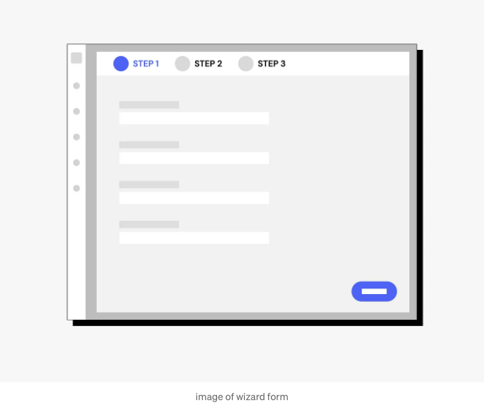
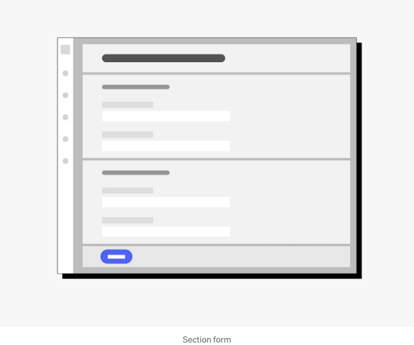
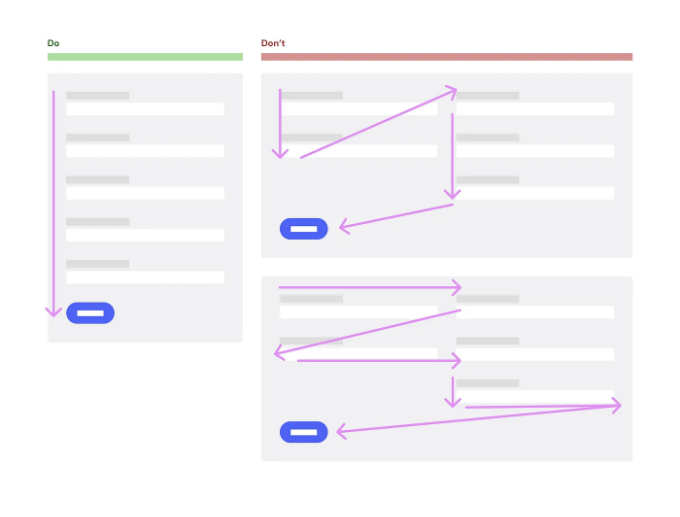
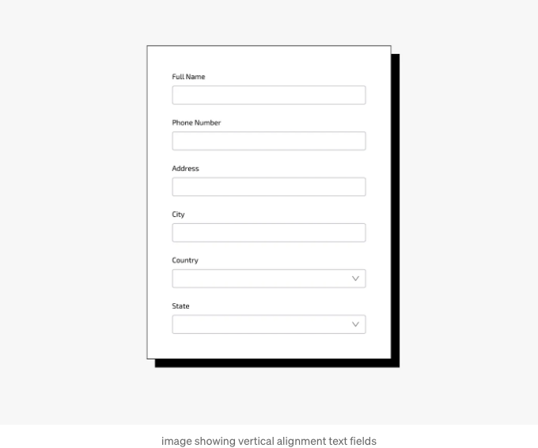
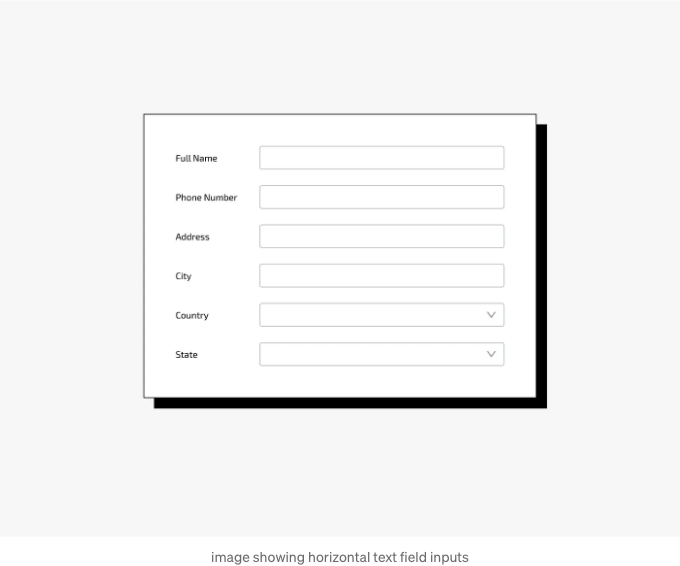
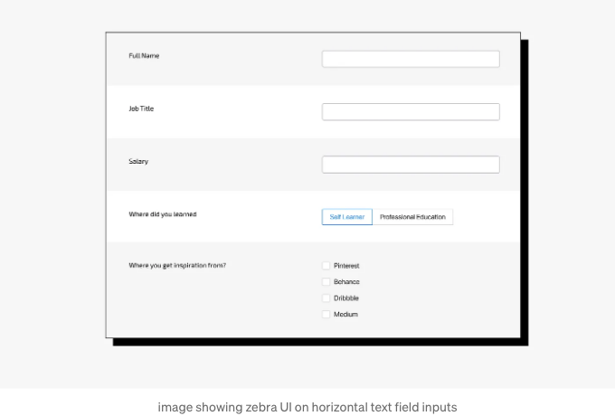
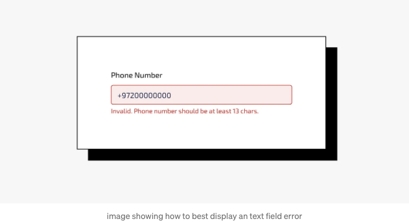
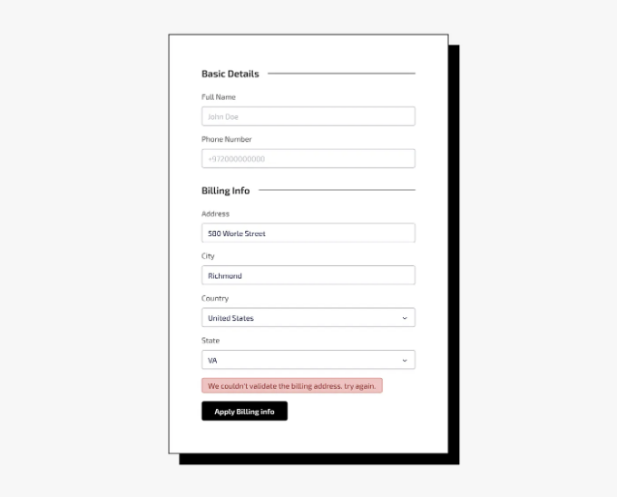

복잡한 시스템에서 폼을 디자인하는 것은 항상 간단한 작업이 아닙니다. 사용자들에게 최상의 경험을 제공하고 싶어요. 사용자들이 혼란 없이 신속하게 폼을 완료할 수 있어야 합니다.

폼의 완료율을 높이기 위해 최대한 간단하게 단순화하는 것을 항상 고민하고 있어요.

## 폼의 완료율이 낮을 때 흔한 이유:

디자인이 복잡함: 사용자들이 폼이 복잡하다고 느낀다면 완료율이 떨어질 수 있어요. 그래서 우리는 폼을 최대한 간단하고 쉽게 보이도록 만들고 싶어요.

<!-- ui-log 수평형 -->
<ins class="adsbygoogle"
  style="display:block"
  data-ad-client="ca-pub-4877378276818686"
  data-ad-slot="9743150776"
  data-ad-format="auto"
  data-full-width-responsive="true"></ins>
<component is="script">
(adsbygoogle = window.adsbygoogle || []).push({});
</component>

집중: 양식이 사용자에게 집중, 강한 사고, 시간을 요구하면 완료율도 감소할 수 있습니다. 그는 정신적 에너지를 소모하게 됩니다. 우리는 양식이 가능한 쉽고 간결하도록 만들고 싶습니다.

복잡한 시스템 양식은 종종 무언가를 만들거나 일부 정보를 제공하여 어떤 서비스를 가능하게 하는 데 사용됩니다. 양식은 그저 목적을 달성하기 위한 수단인 도구에 불과하다는 것을 기억해주세요.

이 기사에서는 (희망적으로) 양식을 처음부터 끝까지 다룰 것입니다. 그래서 끝에 도달하면 양식에 관한 모든 베스트 프랙티스를 아시게 될 것입니다. 특히 복잡한 시스템이 가질 수 있는 특이 케이스를 다룰 것입니다.

그럼 기본 사항부터 시작해보죠.

<!-- ui-log 수평형 -->
<ins class="adsbygoogle"
  style="display:block"
  data-ad-client="ca-pub-4877378276818686"
  data-ad-slot="9743150776"
  data-ad-format="auto"
  data-full-width-responsive="true"></ins>
<component is="script">
(adsbygoogle = window.adsbygoogle || []).push({});
</component>

## 양식 구성 요소

양식에는 데이터 수집이나 사용자 상호 작용을 돕는 데 사용할 수 있는 여러 구성 요소가 있습니다. 각각에는 각기 다른 모범 사례가 있습니다.

그것들은 다음을 포함합니다.

- 텍스트 필드
- 텍스트 영역
- 라디오 버튼
- 체크 상자 / 토글
- 버튼 (기본, 보조, 3순위, 링크)
- 글머리 기호 / 번호 목록
- 탐색기
- 제목 및 섹션
- 오류 구성 요소 (인라인 메시지, 토스트 메시지, 입력 오류)

<!-- ui-log 수평형 -->
<ins class="adsbygoogle"
  style="display:block"
  data-ad-client="ca-pub-4877378276818686"
  data-ad-slot="9743150776"
  data-ad-format="auto"
  data-full-width-responsive="true"></ins>
<component is="script">
(adsbygoogle = window.adsbygoogle || []).push({});
</component>

텍스트 필드에 초점을 맞출 거예요. 텍스트 필드는 가장 흔하면서도 아마도 가장 복잡한 요소일 거에요. 디자이너들이 이 부분에서 실수를 많이 하더라구요.

# 일반적인 지침

- 행동을 최소화해보세요. 타이핑하거나 결정하는 등의 작업을 포함합니다.
- 명확한 제목과 질문을 사용하세요.

# 폼 페이지 레이아웃

<!-- ui-log 수평형 -->
<ins class="adsbygoogle"
  style="display:block"
  data-ad-client="ca-pub-4877378276818686"
  data-ad-slot="9743150776"
  data-ad-format="auto"
  data-full-width-responsive="true"></ins>
<component is="script">
(adsbygoogle = window.adsbygoogle || []).push({});
</component>

처음으로 양식과 관련된 최상의 방법론에 대해 알아보기 시작했을 때, 최상의 그리고 가장 쉬운 양식 레이아웃에 대한 명확한 답변을 찾지 못했습니다. 쉬운 해답은 새 페이지에서 양식을 왼쪽에 정렬하는 것이지만 결국, 그것은 상황에 따라 다름을 깨달았습니다. 양식의 복잡도와 사용 사례에 달려 있기 때문이죠.

양식은 여러 가지 방법으로 표현할 수 있습니다. 가장 좋은 방법을 찾기 위해 몇 가지 질문을 해야 합니다.

- 양식이 얼마나 긴가요?
- 각 단계 간의 관계는 무엇인가요?
- 사용자는 중지하고 나중에 계속할 수 있나요?
- 사용자가 양식 작성을 완료하는 데 얼마나 시간이 걸릴까요?

이것들은 최상의 양식 레이아웃을 이해하는 데 도움이 되는 질문들입니다. 그래서 저는 양식 페이지 레이아웃 옵션을 개요로 설명하겠습니다. 그리고 언제 사용해야 하는지를 적어보겠습니다.

<!-- ui-log 수평형 -->
<ins class="adsbygoogle"
  style="display:block"
  data-ad-client="ca-pub-4877378276818686"
  data-ad-slot="9743150776"
  data-ad-format="auto"
  data-full-width-responsive="true"></ins>
<component is="script">
(adsbygoogle = window.adsbygoogle || []).push({});
</component>


## 페이지 내 양식

양식을 작성하는 가장 일반적인 방법 중 하나입니다. 양식이 비교적 짧고 흔하다면 이 유형의 레이아웃을 고려할 수 있습니다.

장점:

<!-- ui-log 수평형 -->
<ins class="adsbygoogle"
  style="display:block"
  data-ad-client="ca-pub-4877378276818686"
  data-ad-slot="9743150776"
  data-ad-format="auto"
  data-full-width-responsive="true"></ins>
<component is="script">
(adsbygoogle = window.adsbygoogle || []).push({});
</component>

- 비교적 빠른 완료 속도
- 쉽게 확장 가능
- 범용적
- 산업 표준

단점:

- 사용자가 화면 흐름을 놓칠 수 있음 (새 탭 열기로 극복 가능)

## 팝업 폼

<!-- ui-log 수평형 -->
<ins class="adsbygoogle"
  style="display:block"
  data-ad-client="ca-pub-4877378276818686"
  data-ad-slot="9743150776"
  data-ad-format="auto"
  data-full-width-responsive="true"></ins>
<component is="script">
(adsbygoogle = window.adsbygoogle || []).push({});
</component>

```markdown


팝업 폼은 간단하고 짧은 양식을 채우는 경우에 이점이 있습니다. 또한 제품의 여러 곳에서 양식을 작성할 수 있는 경우에도 도움이 될 수 있습니다.

장점:

- 작은 양식 (4~5 입력)
- 빠른 완료 시간
- 사용자 화면 이동을 방해하지 않음
- 다른 화면에서 프롬프트 될 수 있음
```

<!-- ui-log 수평형 -->
<ins class="adsbygoogle"
  style="display:block"
  data-ad-client="ca-pub-4877378276818686"
  data-ad-slot="9743150776"
  data-ad-format="auto"
  data-full-width-responsive="true"></ins>
<component is="script">
(adsbygoogle = window.adsbygoogle || []).push({});
</component>

단점:

- 확장성이 부족함
- 데이터 테이블에 적합하지 않음

## 마법사



<!-- ui-log 수평형 -->
<ins class="adsbygoogle"
  style="display:block"
  data-ad-client="ca-pub-4877378276818686"
  data-ad-slot="9743150776"
  data-ad-format="auto"
  data-full-width-responsive="true"></ins>
<component is="script">
(adsbygoogle = window.adsbygoogle || []).push({});
</component>

장점:

- 긴 양식에 적합합니다.
- 복잡한 양식을 단순화할 수 있습니다 (가끔).
- 복잡한 양식을 단계별로 나눌 수 있습니다.
- 각 단계에 명확한 제목이 있습니다.

단점:

- 단계가 사용자를 압도하고 완료에 동기부여를 떨어뜨릴 수 있습니다.
- 필요한 항목을 쉽게 스캔하고 확인하기 어렵습니다.
- 여러 버튼이 있어 혼란스러울 수 있습니다. 나가기, 이전, 다음, 임시 저장 등 (가끔).

<!-- ui-log 수평형 -->
<ins class="adsbygoogle"
  style="display:block"
  data-ad-client="ca-pub-4877378276818686"
  data-ad-slot="9743150776"
  data-ad-format="auto"
  data-full-width-responsive="true"></ins>
<component is="script">
(adsbygoogle = window.adsbygoogle || []).push({});
</component>

## 섹션



섹션 폼을 작성하는 것은 압도적일 수 있지만 중요한 이점이 있습니다. 사용자가 어떤 데이터를 입력해야 하는지 알 수 있습니다. 따라서, 사용자는 자신이 해야 할 일을 이해하고 폼 작성을 시작하기 전에 데이터를 미리 준비할 수 있습니다. 이는 완료율을 높이는 데 도움이 됩니다.

장점:

<!-- ui-log 수평형 -->
<ins class="adsbygoogle"
  style="display:block"
  data-ad-client="ca-pub-4877378276818686"
  data-ad-slot="9743150776"
  data-ad-format="auto"
  data-full-width-responsive="true"></ins>
<component is="script">
(adsbygoogle = window.adsbygoogle || []).push({});
</component>

- 긴 양식에 적합
- 쉽게 스캔 가능 (사용자가 무엇을 하는지 이해 가능)
- 복잡한 양식을 청크로 분할
- 복잡한 양식을 간소화 (가끔은)
- 각 양식 섹션에 명확한 제목과 지침

단점:

- 긴 양식을 보면 압도될 수 있음
- 단계별 지원이 적음

# 양식 정렬

<!-- ui-log 수평형 -->
<ins class="adsbygoogle"
  style="display:block"
  data-ad-client="ca-pub-4877378276818686"
  data-ad-slot="9743150776"
  data-ad-format="auto"
  data-full-width-responsive="true"></ins>
<component is="script">
(adsbygoogle = window.adsbygoogle || []).push({});
</component>

## 한 열 또는 여러 열?

간단히 말하면, 한 열입니다. 여러 연구에서 빠르고 혼란스럽지 않으며 완료율을 높이는 것으로 밝혀졌습니다.

아마도 이미 그 개념에 익숙할지도 모르겠지만, "왜?"를 설명하는 가장 쉬운 방법은 눈의 이동이 Z자 형태라는 점입니다. 인간으로써 우리는 (아마도) 읽는 법을 배워서 대부분의 경우에 왼쪽에서 오른쪽으로 읽습니다. 따라서 직감적으로 우리는 화면이나 종이를 왼쪽에서 오른쪽으로 스캔합니다 (마치 책을 읽는 것처럼).

아랍어나 이스라엘 국가를 위한 디자인을 할 때 기억해야 할 점은 규칙이 거꾸로 적용된다는 것입니다. 오른쪽에서 왼쪽으로 (RTL)입니다.

<!-- ui-log 수평형 -->
<ins class="adsbygoogle"
  style="display:block"
  data-ad-client="ca-pub-4877378276818686"
  data-ad-slot="9743150776"
  data-ad-format="auto"
  data-full-width-responsive="true"></ins>
<component is="script">
(adsbygoogle = window.adsbygoogle || []).push({});
</component>

알겠어요! 그래서 이를 염두에 두고, 두 개의 열로 된 양식을 디자인하는 것은 눈에게 매우 혼란스러울 수 있어요.



보면 눈이 화면을 스캔하는 방법을 잘 모르고, 어떤 순서로 양식을 작성해야 하는지 혼란스러워 할 수 있어요. 사용자는 남들과 달라요.

하지만! 입력값이 작거나 매우 익숙할 때는 항상 몇 가지 기대되는 점이 있어요. 예를 들어 신용카드 양식이나 개인 정보 양식처럼 말이에요. 사용자는 양식 유형에 익숙하고 구조를 직관적으로 이해하죠.

<!-- ui-log 수평형 -->
<ins class="adsbygoogle"
  style="display:block"
  data-ad-client="ca-pub-4877378276818686"
  data-ad-slot="9743150776"
  data-ad-format="auto"
  data-full-width-responsive="true"></ins>
<component is="script">
(adsbygoogle = window.adsbygoogle || []).push({});
</component>


# 레이블 정렬

나는 처음으로 폼을 디자인할 때 레이블 정렬이 어려웠어. 입력란을 어떻게 정렬해야 할까? 레이블을 왼쪽에 놓고 입력란을 오른쪽에 놓을까? 입력란 위에 레이블을 놓을까? 만약 플레이스홀더가 있다면 왜 레이블이 필요할까?

## 수직 정렬:

<!-- ui-log 수평형 -->
<ins class="adsbygoogle"
  style="display:block"
  data-ad-client="ca-pub-4877378276818686"
  data-ad-slot="9743150776"
  data-ad-format="auto"
  data-full-width-responsive="true"></ins>
<component is="script">
(adsbygoogle = window.adsbygoogle || []).push({});
</component>

이것은 폼을 다룰 때 핵심 요소입니다.



## 수평 정렬:



<!-- ui-log 수평형 -->
<ins class="adsbygoogle"
  style="display:block"
  data-ad-client="ca-pub-4877378276818686"
  data-ad-slot="9743150776"
  data-ad-format="auto"
  data-full-width-responsive="true"></ins>
<component is="script">
(adsbygoogle = window.adsbygoogle || []).push({});
</component>

복잡한 시스템에서는 수평으로 된 양식이 매우 인기가 있어요. 수직 정렬이 "최상의 실천 방법"이라고 여겨지지만, 복잡한 양식에는 수평 정렬이 더 어울려요. 이를 고려해야 하는 이유는 다음과 같아요:

- 사용자가 입력 양식에 오류를 범하지 않도록 속도를 늦추고 싶을 때
- 입력 내용이 익숙하지 않거나 특이할 때 (이 레이아웃은 사용자가 레이블을 더 잘 읽을 수 있게 해줄 거예요)

완료 속도는 느려질 수 있어요. 하지만, 여기서 중요한 KPI는 완료율이에요.

## 레이블은 왼쪽에 정렬할까요, 오른쪽에 정렬할까요?

<!-- ui-log 수평형 -->
<ins class="adsbygoogle"
  style="display:block"
  data-ad-client="ca-pub-4877378276818686"
  data-ad-slot="9743150776"
  data-ad-format="auto"
  data-full-width-responsive="true"></ins>
<component is="script">
(adsbygoogle = window.adsbygoogle || []).push({});
</component>


작은 레이블에는 오른쪽 정렬이 좋습니다.

오른쪽 정렬은 양식과 레이블 사이의 공간에서 일관성을 제공하고 근접 규칙을 적용할 수는 있지만 큰 단점이 있습니다.

- 눈은 항상 각 행마다 다른 지점에서 읽기 시작해야 합니다.
- 글이 너무 길 경우 뒤로 줄 바꿈이 발생합니다.

<!-- ui-log 수평형 -->
<ins class="adsbygoogle"
  style="display:block"
  data-ad-client="ca-pub-4877378276818686"
  data-ad-slot="9743150776"
  data-ad-format="auto"
  data-full-width-responsive="true"></ins>
<component is="script">
(adsbygoogle = window.adsbygoogle || []).push({});
</component>

왼쪽 정렬:

라벨이 오른쪽 정렬되어 있으면 입력과 라벨 사이의 간격이 동일해지며, 이는 입력과 라벨 간의 더 나은 연관성을 만듭니다. 게슽트 원리에서의 근접 법칙. 큰 단점은 라벨 왼쪽에 공간이 생기고 스캔하기 어려워진다는 것입니다. 눈은 항상 텍스트의 시작을 찾아서 읽어야 합니다.

짧은 라벨에 적합하며, 긴 양식에는 적합하지 않습니다.


<!-- ui-log 수평형 -->
<ins class="adsbygoogle"
  style="display:block"
  data-ad-client="ca-pub-4877378276818686"
  data-ad-slot="9743150776"
  data-ad-format="auto"
  data-full-width-responsive="true"></ins>
<component is="script">
(adsbygoogle = window.adsbygoogle || []).push({});
</component>

```markdown


Aligning to the right:

When labels are aligned to the right, the spacing between the label and the input is inconsistent. However, this format makes it easier to scan the labels. Yet, it could make it harder to find related input due to the visual distance from the label.

This format works well with long labels and long forms.
```

<!-- ui-log 수평형 -->
<ins class="adsbygoogle"
  style="display:block"
  data-ad-client="ca-pub-4877378276818686"
  data-ad-slot="9743150776"
  data-ad-format="auto"
  data-full-width-responsive="true"></ins>
<component is="script">
(adsbygoogle = window.adsbygoogle || []).push({});
</component>

```plaintext


라벨과 입력란을 연관시키는 것이 얼마나 어려운지 살펴보는 시각적 거리 문제 예시입니다.


```

<!-- ui-log 수평형 -->
<ins class="adsbygoogle"
  style="display:block"
  data-ad-client="ca-pub-4877378276818686"
  data-ad-slot="9743150776"
  data-ad-format="auto"
  data-full-width-responsive="true"></ins>
<component is="script">
(adsbygoogle = window.adsbygoogle || []).push({});
</component>

시각적 거리 문제를 해결하기 위해 "얼룩말무늬(zebra)" UI를 구현해보세요.



# 양식 완성 지원

## 툴팁 및 도움말

<!-- ui-log 수평형 -->
<ins class="adsbygoogle"
  style="display:block"
  data-ad-client="ca-pub-4877378276818686"
  data-ad-slot="9743150776"
  data-ad-format="auto"
  data-full-width-responsive="true"></ins>
<component is="script">
(adsbygoogle = window.adsbygoogle || []).push({});
</component>

사용자들이 특정 입력 요구 사항에 대해 추가적인 문맥이나 지침이 필요할 수 있습니다. 툴팁이나 도움말 텍스트를 추가하여 도와주세요.

- 입력 툴팁 아이콘 내부
- 레이블 툴팁 아이콘 옆
- 입력 아래 도움말 텍스트


<!-- ui-log 수평형 -->
<ins class="adsbygoogle"
  style="display:block"
  data-ad-client="ca-pub-4877378276818686"
  data-ad-slot="9743150776"
  data-ad-format="auto"
  data-full-width-responsive="true"></ins>
<component is="script">
(adsbygoogle = window.adsbygoogle || []).push({});
</component>

## 플레이스홀더

플레이스홀더는 입력 값이 어떻게 보일 수 있는지 사용자가 이해하는 데 도움이 되거나 일부 컨텍스트를 제공해야 합니다. 레이블로 플레이스홀더를 사용하는 것은 너무 일반적입니다. 그러지 마십시오.

그래서, 플레이스홀더는 레이블을 대체하는 것이 아닙니다. 이것이 첫 번째입니다. 그러나 디자인 규칙마다 기대도 있습니다. 예를 들어, 검색 입력란과 같이 반복적인 단일 양식인 경우에는 항상 사용할 필요가 없습니다.


<!-- ui-log 수평형 -->
<ins class="adsbygoogle"
  style="display:block"
  data-ad-client="ca-pub-4877378276818686"
  data-ad-slot="9743150776"
  data-ad-format="auto"
  data-full-width-responsive="true"></ins>
<component is="script">
(adsbygoogle = window.adsbygoogle || []).push({});
</component>

표 태그를 Markdown 형식으로 변경하세요.

<!-- ui-log 수평형 -->
<ins class="adsbygoogle"
  style="display:block"
  data-ad-client="ca-pub-4877378276818686"
  data-ad-slot="9743150776"
  data-ad-format="auto"
  data-full-width-responsive="true"></ins>
<component is="script">
(adsbygoogle = window.adsbygoogle || []).push({});
</component>

## 필수 대 선택 사항 필드

필수 필드에는 별표(*) 대신 "optional"이라는 단어를 사용하세요. 별표는 의미를 명확하게 전달하지 못할 뿐만 아니라 대부분의 필드가 필수인 경우 시각적 혼란을 초래할 수 있습니다.

# 양식 오류

## 입력 오류

<!-- ui-log 수평형 -->
<ins class="adsbygoogle"
  style="display:block"
  data-ad-client="ca-pub-4877378276818686"
  data-ad-slot="9743150776"
  data-ad-format="auto"
  data-full-width-responsive="true"></ins>
<component is="script">
(adsbygoogle = window.adsbygoogle || []).push({});
</component>

입력 오류는 입력란 아래의 힌트 텍스트로 대체할 수 있습니다. 주로 입력 형식을 확인하여 사용자가 제출 단계로 이동하고 오류를 발견하는 것을 방지하는 데 사용됩니다.



## 일반 오류

일반 오류는 특정 입력과 관련이 없는 오류를 보여줄 때 사용할 수 있습니다. 사용자의 내부 연결 끊김이나 백엔드 임시 문제가 발생한 경우입니다.

<!-- ui-log 수평형 -->
<ins class="adsbygoogle"
  style="display:block"
  data-ad-client="ca-pub-4877378276818686"
  data-ad-slot="9743150776"
  data-ad-format="auto"
  data-full-width-responsive="true"></ins>
<component is="script">
(adsbygoogle = window.adsbygoogle || []).push({});
</component>

```markdown


## 경고

대부분의 경고는 팝업 형태로 나타납니다. 사용자들이 자신의 행동의 결과에 대해 경고합니다. 이렇게 하면 사용자의 작업이 차단되고 그 행동의 결과를 알려줍니다.


```

<!-- ui-log 수평형 -->
<ins class="adsbygoogle"
  style="display:block"
  data-ad-client="ca-pub-4877378276818686"
  data-ad-slot="9743150776"
  data-ad-format="auto"
  data-full-width-responsive="true"></ins>
<component is="script">
(adsbygoogle = window.adsbygoogle || []).push({});
</component>

## 인라인 오류

위자드 폼이나 섹션 폼에서 유용하게 사용될 수 있습니다. 해당 섹션에 대한 오류나 데이터에 대한 일반적인 오류를 알려줍니다.



# 폼 버튼 배치

<!-- ui-log 수평형 -->
<ins class="adsbygoogle"
  style="display:block"
  data-ad-client="ca-pub-4877378276818686"
  data-ad-slot="9743150776"
  data-ad-format="auto"
  data-full-width-responsive="true"></ins>
<component is="script">
(adsbygoogle = window.adsbygoogle || []).push({});
</component>

폼 버튼을 다루는 것은 조금 까다로울 수 있어요. 특히 위자드 폼이거나 임시 저장 옵션이 있는 폼 같은 경우면 더 복잡해질 수 있어요.

이 주제만으로도 10분짜리 글이 될 수 있어요. 하지만 난 여러분이 쉽게 이해할 수 있도록 노력할게요.
우선 버튼을 오른쪽 정렬하는 것은 다음과 같은 경우입니다: 위자드, 팝업 폼

그리고 버튼을 왼쪽 정렬하는 것은 다음과 같은 경우입니다: 섹션 폼, 페이지 내 폼

## 결론

<!-- ui-log 수평형 -->
<ins class="adsbygoogle"
  style="display:block"
  data-ad-client="ca-pub-4877378276818686"
  data-ad-slot="9743150776"
  data-ad-format="auto"
  data-full-width-responsive="true"></ins>
<component is="script">
(adsbygoogle = window.adsbygoogle || []).push({});
</component>

복잡한 시스템을 위한 양식을 디자인하는 것은 어려울 수 있어요. 항상 표준 양식이 아니며 때로는 기술적인 제한으로 사용자 경험에 조금 타협해야 할 수도 있어요. 하지만 언제나 이런 가치 있는 사례들을 염두에 두고 사용자 중심 디자인의 의도로 디자인해주세요. 그들을 도와주세요. 이것은 복잡하고 에너지를 많이 소비하는 작업이에요. 이 기사가 도움이 되었길 바랍니다.

이 기사가 가치 있다고 생각되시나요? 공유해보세요.

저를 팔로우해주세요: Medium · Linkedin