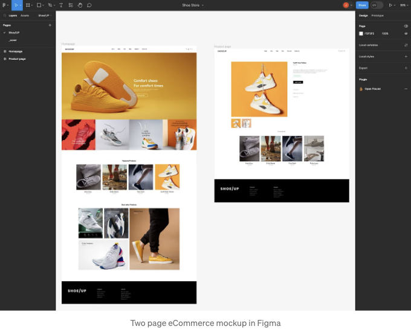
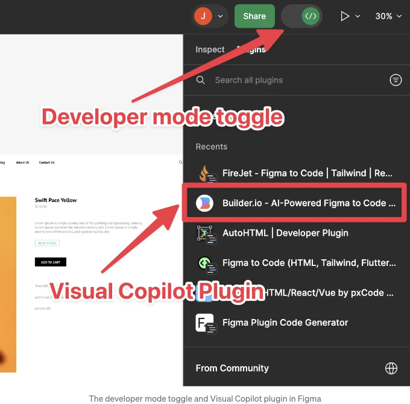
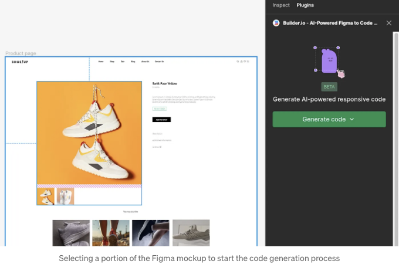
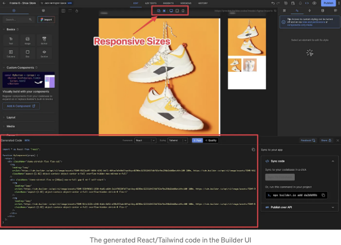
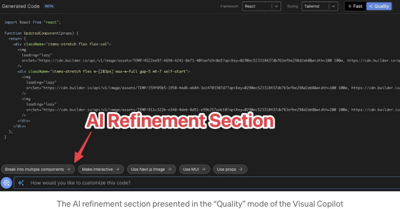
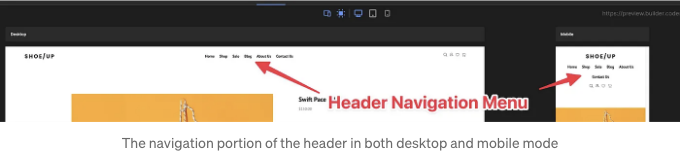
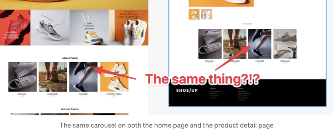

만약 AI가 웹 개발자를 대체할 것이라고 생각한다면, Figma 프로토타입을 작동하는 React 애플리케이션으로 변환해 보는 것만으로 충분합니다. Figma는 디자이너들이 꿈꾸는 UI를 만들기 위한 훌륭한 도구입니다. 그러나 그 꿈을 현실로 바꾸려면 많은 작업이 필요합니다.

모형을 변환하는 첫 번째 단계는 HTML을 생성하는 것입니다. 다행히 Figma의 개발자들은 올해 초에 "개발자 모드"를 추가하여 도움을 주었습니다. 개발자 모드는 타사 플러그인을 사용하여 Figma 모형을 코드로 변환할 수 있게 합니다. 이러한 플러그인들은 수출 품질을 높여주었습니다.

수 많은 플러그인들이 있고 그 품질은 지속적으로 향상되고 있습니다. 지금까지 찾아본 가장 좋은 플러그인은 Builder.io의 Visual Copilot입니다 (Builder CMS, Qwik, Partytown 등을 만든 사람들입니다). 이들은 지혜로운 분들이고 이 도구도 지혜로운 것입니다. 이 도구는 초기 변환이나 결과에 사용되는 사용자 정의 빌드 LLM을 사용하며, 나의 견해로는 HTML/CSS로 원하는 곳의 약 80%에 이를 수 있습니다.

홈페이지와 제품 상세 페이지를 위한 예시 모형을 살펴봅시다:

<!-- ui-log 수평형 -->
<ins class="adsbygoogle"
  style="display:block"
  data-ad-client="ca-pub-4877378276818686"
  data-ad-slot="9743150776"
  data-ad-format="auto"
  data-full-width-responsive="true"></ins>
<component is="script">
(adsbygoogle = window.adsbygoogle || []).push({});
</component>

```markdown


The mockup looks pretty good. There is the home page mockup on the right-hand side and the detail page on the left.

To start converting, we first switch to the developer mode.


```

<!-- ui-log 수평형 -->
<ins class="adsbygoogle"
  style="display:block"
  data-ad-client="ca-pub-4877378276818686"
  data-ad-slot="9743150776"
  data-ad-format="auto"
  data-full-width-responsive="true"></ins>
<component is="script">
(adsbygoogle = window.adsbygoogle || []).push({});
</component>

맨 위의 큰 토글 스위치는 디자이너 모드와 개발자 모드 사이를 이동합니다. 한 번 개발자 모드로 들어가면 플러그인 탭을 선택하고 Builder.io 플러그인을 검색합니다.

플러그인을 선택한 후에는 내보내려는 목업의 일부를 선택합니다.



원하는 만큼 선택할 수 있습니다. 작은 페이지의 경우 전체를 선택할 수 있고, 큰 페이지의 경우 각 섹션을 선택하여 구성 요소 세트를 만들기 위해 개별적으로 내보낼 수 있습니다.

<!-- ui-log 수평형 -->
<ins class="adsbygoogle"
  style="display:block"
  data-ad-client="ca-pub-4877378276818686"
  data-ad-slot="9743150776"
  data-ad-format="auto"
  data-full-width-responsive="true"></ins>
<component is="script">
(adsbygoogle = window.adsbygoogle || []).push({});
</component>

신발 히어로 섹션을 선택하고 코드 생성 버튼을 누를게요.



처리가 완료되는 몇 초 후에, 내가 내보낸 모의 구역 일부와 페이지 하단의 코드를 보여주는 Builder CMS UI로 이동해요.

만약 앱에서 Builder CMS를 사용하고 있지 않다면 그냥 여기서 코드를 복사하여 자신의 앱에 붙여넣으면 돼요.

<!-- ui-log 수평형 -->
<ins class="adsbygoogle"
  style="display:block"
  data-ad-client="ca-pub-4877378276818686"
  data-ad-slot="9743150776"
  data-ad-format="auto"
  data-full-width-responsive="true"></ins>
<component is="script">
(adsbygoogle = window.adsbygoogle || []).push({});
</component>

생성된 코드에 들어가기 전에 몇 가지 주목할 점이 있어요.

미리보기 섹션 상단에는 데스크톱, 태블릿, 모바일 미리보기 크기를 전환할 수 있는 셀렉터가 있어요. Visual Copilot은 다양한 브레이크포인트에서 작동하는 반응형 코드를 생성하며, Builder CMS는 일반적인 브레이크포인트를 미리보기할 수 있게 해줘요.

코드 섹션에는 Framework와 Styling을 선택할 수 있는 셀렉터가 있어요. React, Vue, Svelte, Angular, Qwik 등의 일반적인 프레임워크 중에서 선택할 수 있고, Tailwind, Emotion, Styled Components 등의 다양한 스타일링 옵션 중에서 선택할 수 있어요.

또한 Fast와 Quality를 전환할 수 있는 토글이 있어요. Fast 옵션은 무료이며 아주 빠릅니다. 한편, Quality 버전은 추가 GPT 패스를 실행하여 코드를 더 의미론적으로 구조화하여 결과물을 더욱 다듬으려고 하는 유료 옵션입니다.

<!-- ui-log 수평형 -->
<ins class="adsbygoogle"
  style="display:block"
  data-ad-client="ca-pub-4877378276818686"
  data-ad-slot="9743150776"
  data-ad-format="auto"
  data-full-width-responsive="true"></ins>
<component is="script">
(adsbygoogle = window.adsbygoogle || []).push({});
</component>

품질 버전은 AI 세부 조정도 가능합니다.



화면 하단에는 GPT를 사용하여 코드를 추가로 세밀하게 조정할 수 있습니다. GPT에 원하는 입력을 주면 해당하는 코드로 더 정밀하게 조정해줍니다. 또한, `img` 태그 대신 NextJS의 Image 구성 요소를 사용하는 것이 좋다는 유용한 제안도 있습니다.

마지막으로, 코드를 애플리케이션에 가져 오기 위해 사용할 복사 버튼이 있습니다.

<!-- ui-log 수평형 -->
<ins class="adsbygoogle"
  style="display:block"
  data-ad-client="ca-pub-4877378276818686"
  data-ad-slot="9743150776"
  data-ad-format="auto"
  data-full-width-responsive="true"></ins>
<component is="script">
(adsbygoogle = window.adsbygoogle || []).push({});
</component>

이 글과 관련된 비디오에서는 이 페이지 세트를 NextJS 애플리케이션으로 변환하는 전체 프로세스를 안내해 드릴 거에요. 즉, Builder CDN에서 모든 이미지를 로컬 파일로 추출하고 `img` 태그를 Image 구성 요소로 변환하는 과정도 포함돼 있어요. 이 작업에 사용할 수 있는 작은 스크립트를 만들어 두었으니 자유롭게 사용해 주세요.

이 글을 시작할 때 언급했듯이, 이 과정은 AI가 모의 디자인을 제작 애플리케이션으로 바꾸는 데 필요한 모든 작업을 수행하지 않음을 당신에게 입증할 거에요. 그런데 이 글에서는 이를 수행하는 AI 도구를 다루고 있다고 했죠. 그렇다면 맞을까요? 결과적으로 제작에 도움을 줄 일이 많이 남아 있음을 알 수 있어요.

# 항상 쉽지만은 않아요

첫 번째 문제는 이 Figma 모킹 UI들이 항상 이처럼 쉬운 것은 아니라는 점이에요. 제가 사용한 예는 합리적인 디자인이었죠. 그러나 웹 개발자들이 Figma와 사랑과 미움이 교차하는 관계를 가지는 이유는 디자이너가 아무런 제한 없이 어떤 디자인이든 만들 수 있기 때문이에요. 때문에 구현하기 어려운 디자인이 만들어질 수 있어요.

<!-- ui-log 수평형 -->
<ins class="adsbygoogle"
  style="display:block"
  data-ad-client="ca-pub-4877378276818686"
  data-ad-slot="9743150776"
  data-ad-format="auto"
  data-full-width-responsive="true"></ins>
<component is="script">
(adsbygoogle = window.adsbygoogle || []).push({});
</component>

AI 도구는 합리적인 디자인으로 많은 것을 이끌어낼 수 있지만, 더 이상 그 이상의 이상한 것들에 대해서는 어느 정도 도와줄 뿐, 구현뿐만 아니라 디자이너들과 합의하여 실현 가능한 것과 불가능한 것에 대해 협상하는 것은 모두 여러분에게 달려 있습니다.

# 반응성

제가 이야기했듯이 Visual Copilot은 잘 디자인된 모형의 반응형 레이아웃을 꽤 잘 수행합니다. 그러나 종종 UI의 모바일 버전이 데스크톱 버전과 크게 다를 때가 있습니다. 그 때 웹 개발자는 이러한 차이를 메꾸어야 할 것입니다. 예를 들어 헤더의 네비게이션 메뉴를 들어보죠:



<!-- ui-log 수평형 -->
<ins class="adsbygoogle"
  style="display:block"
  data-ad-client="ca-pub-4877378276818686"
  data-ad-slot="9743150776"
  data-ad-format="auto"
  data-full-width-responsive="true"></ins>
<component is="script">
(adsbygoogle = window.adsbygoogle || []).push({});
</component>

우리가 목업에서는 데스크톱 버전의 네비게이션 메뉴만 있었기 때문에 AI는 그것을 활용하여 매우 잘 조절되는 메뉴를 모바일 버전으로 만들었습니다. 그러나 고객이 그렇게 원하지 않을 수도 있습니다. 아마도 모바일용 햄버거 메뉴를 원할지도 모릅니다. 이 모든 것을 처리하는 것은 디자이너, 제품 매니저, 그리고 개발자에게 달려 있습니다.

# 컴포넌트 재사용

Figma 목업에서 가장 큰 문제는 재사용할 컴포넌트 지정을 드물게 한다는 것입니다. 이 재사용할 컴포넌트가 무엇인지를 명확히 지정하지 않습니다. 목업의 이 두 섹션을 살펴보세요.



<!-- ui-log 수평형 -->
<ins class="adsbygoogle"
  style="display:block"
  data-ad-client="ca-pub-4877378276818686"
  data-ad-slot="9743150776"
  data-ad-format="auto"
  data-full-width-responsive="true"></ins>
<component is="script">
(adsbygoogle = window.adsbygoogle || []).push({});
</component>

한 버전은 "주요 제품"이라고 말하고, 세부 페이지의 다른 섹션은 "관심을 끌 수도 있습니다"라고 말하는데, 두 경우 모두 아래에 있는 캐로셀 스타일의 UI는 분명히 동일해보입니다. 그래서 이러한 섹션들을 재사용할 수 있을까요? 재사용해야 할까요? 이는 제품 매니저와 디자이너와 대화를 통해서만 결정할 수 있는 선택사항입니다.

# 전체 구현

물론, 방 안의 800파운드 고릴라는 실제로 기능을 작동시킬 것입니다. 당연히, 이는 모든 데이터가 데이터 기반으로 작동하도록 연결되어야 한다는 것을 의미합니다. 그리고 실제로 고객이 신발을 구매할 수 있도록 필요한 전자상거래 기능을 통합해야 합니다. 그 위에, 접근성과 국제화가 필요합니다.

그림으로 나타난 것을 구현하는 것만으로도 부족합니다. 가끔은 우리가 보지 못하는 숨겨진 기능이 있습니다. 적은 데이터 상태나, "주요 제품"에 대한 캐로셀과 같이 모의도를 통해 렌더링되지 않지만 추정되는 기능과 같은 것들이 있습니다. 항상 네 개의 제품이 있어야 하나요? 데스크톱에서 스크롤해야 하나요? 휴대폰에서 터치 스와이프를 해야 하나요?

<!-- ui-log 수평형 -->
<ins class="adsbygoogle"
  style="display:block"
  data-ad-client="ca-pub-4877378276818686"
  data-ad-slot="9743150776"
  data-ad-format="auto"
  data-full-width-responsive="true"></ins>
<component is="script">
(adsbygoogle = window.adsbygoogle || []).push({});
</component>


# 결론

비주얼 코파일러가 코드 작성에 환상적인 시작을 제공한 후 남은 부분의 가장 큰 장점은 공학 부분입니다. 이것이 AI 도구들의 가장 큰 장점입니다. 그들은 당신을 대체하기 위해 만들어진 것이 아닙니다. 그들은 Figma 모형을 상당한 HTML 코드로 변환하는 것과 같은 귀찮은 작업들을 대신 해주기 위해 만들어진 것입니다. 그러므로 개발자로서, 당신은 자신이 가장 잘하는 일에 집중할 수 있습니다.

저는 개인적으로 UI의 모든 부분, 디자인에서 구현까지 끝없이 매혹적으로 여깁니다. 그래서, 몇 년 동안 Figma 모형과 디자이너들과 함께 일해왔습니다. 저는 항상 프로젝트가 삶을 불어넣는 것을 사랑하기 때문에, 모형에서 앱으로 가는 과정을 가속화해주는 도구를 찾고 있습니다. 당신의 작업 흐름을 가속화시키기 위해 Figma 플러그인을 시도해보는 것을 강력히 추천합니다. 그리고 Figma에서 React/Tailwind(그리고 다양한 다른 변형)으로 이동하는 플러그인을 찾고 계신다면, Visual Copilot은 그 작업을 수행하기 위해 본적이 있는 가장 좋은 플러그인입니다.

<!-- ui-log 수평형 -->
<ins class="adsbygoogle"
  style="display:block"
  data-ad-client="ca-pub-4877378276818686"
  data-ad-slot="9743150776"
  data-ad-format="auto"
  data-full-width-responsive="true"></ins>
<component is="script">
(adsbygoogle = window.adsbygoogle || []).push({});
</component>

잭 헤링턴은 주요 풀 스택 엔지니어이자 유튜버입니다. 
그는 현재 '프로페셔널 NextJS' 코스를 작성 중입니다. 
무료 뉴스레터에 가입하시고 NextJS App Router에서 상태 관리에 대한 완전히 무료 튜토리얼을 받아보세요.