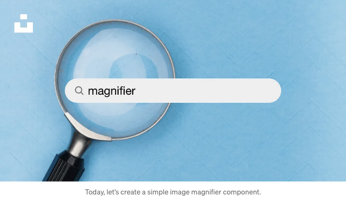
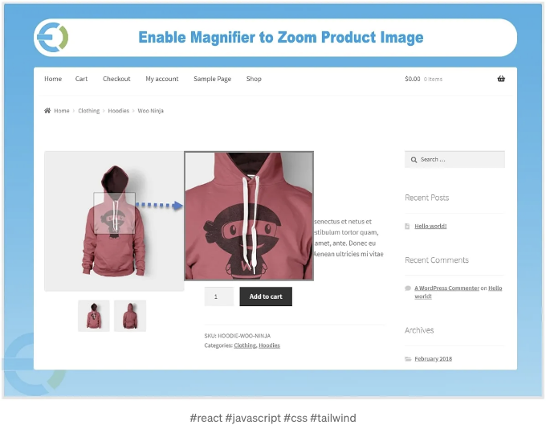

이 게시물에서는 Tailwind CSS를 사용하여 동적이고 시각적으로 매력적인 이미지 확대기를 만드는 방법을 살펴보겠습니다. 확대기는 많은 웹 애플리케이션에서 일반적인 기능으로, 특히 전자 상거래 웹 사이트에서 제품 이미지를 자세히 살펴봐야 하는 사용자가 많습니다. Tailwind CSS, 유틸리티 중심의 CSS 프레임워크로, 기능적이면서도 아름답게 디자인된 이미지 확대기를 만들어보겠습니다.

이 단계별 가이드를 따라가면 Tailwind CSS를 사용하여 이미지 확대기 컴포넌트를 만들 수 있어서 웹 애플리케이션의 사용자 경험을 향상시킬 수 있습니다. Tailwind CSS의 유틸리티 중심 접근 방식과 유연성을 통해 이미지 확대기와 같은 UI 컴포넌트를 쉽게 구축하고 사용자가 눈에 띄고 기능적인 인터페이스를 노력을 최소화하고 만들 수 있습니다. 오늘부터 Tailwind CSS를 활용하여 웹 개발 능력을 한 단계 끌어올려 보세요!



먼저 컴포넌트를 만든 다음에 그에 대해 설명하겠습니다.

<!-- ui-log 수평형 -->
<ins class="adsbygoogle"
  style="display:block"
  data-ad-client="ca-pub-4877378276818686"
  data-ad-slot="9743150776"
  data-ad-format="auto"
  data-full-width-responsive="true"></ins>
<component is="script">
(adsbygoogle = window.adsbygoogle || []).push({});
</component>

```javascript
import React, { useState } from 'react';

const ProductMagnifier = () => {
    const magnifierHeight = 100;
    const magnifieWidth = 100;
    const zoomLevel = 1.5;
    const [imgWidth, setImgWidth] = useState(0);
    const [imgHeight, setImgHeight] = useState(0);
    const [showMagnifier, setShowMagnifier] = useState(false);
    const [[x, y], setXY] = useState([0, 0]);
    
    return (
        <div className='container mx-auto px-10 lg:px-0 py-10'>
            <div className="relative h-full w-full">
                 {
                        const elem = e.currentTarget;
                        const { width, height } = elem.getBoundingClientRect();
                        setImgWidth(width);
                        setImgHeight(height);
                        setShowMagnifier(true);
                    }}
                    onMouseMove={(e) => {
                        const elem = e.currentTarget;
                        const { top, left } = elem.getBoundingClientRect();
                        const x = e.pageX - left - window.pageXOffset;
                        const y = e.pageY - top - window.pageYOffset;
                        setXY([x, y]);
                    }}
                    onMouseLeave={() => {
                        setShowMagnifier(false);
                    }}
                    alt="img"
                />

                {showMagnifier && (
                    <div
                        className="absolute pointer-events-none border border-gray-200 bg-white"
                        style={{
                            height: `${magnifierHeight}px`,
                            width: `${magnifieWidth}px`,
                            top: `${y - magnifierHeight / 2}px`,
                            left: `${x - magnifieWidth / 2}px`,
                            backgroundImage: `url('${yourphoto}')`,
                            backgroundSize: `${imgWidth * zoomLevel}px ${imgHeight * zoomLevel}px`,
                            backgroundPositionX: `${-x * zoomLevel + magnifieWidth / 2}px`,
                            backgroundPositionY: `${-y * zoomLevel + magnifierHeight / 2}px`
                        }}
                    />
                )}
            </div>
        </div>
    );
};

export default ProductMagnifier;
```

Explanation:
1. 확대경을 표시할 때 사용하는 상태

```javascript
const [showMagnifier, setShowMagnifier] = useState(false);
```

2. 해당 상태를 업데이트하는 이벤트 핸들러.```

<!-- ui-log 수평형 -->
<ins class="adsbygoogle"
  style="display:block"
  data-ad-client="ca-pub-4877378276818686"
  data-ad-slot="9743150776"
  data-ad-format="auto"
  data-full-width-responsive="true"></ins>
<component is="script">
(adsbygoogle = window.adsbygoogle || []).push({});
</component>

```js
...
     {
          setShowMagnifier(true);
        }}
        onMouseLeave={() => {
          setShowMagnifier(false);
        }}
        alt={"img"}
      />

...
```

3. Add a state that holds the x and y positions of the magnifier and update it when the mouse moves over the image.

```js
const [[x, y], setXY] = useState([0, 0]);

... 

        onMouseMove={(e) => {
            const elem = e.currentTarget;
            const { top, left } = elem.getBoundingClientRect();
            const x = e.pageX - left - window.pageXOffset;
            const y = e.pageY - top - window.pageYOffset;
            setXY([x, y]);
        }
```

4. The pageX/Y coordinates are relative to the left/top corner of the current page.
The pageXOffset/pageYOffset are the page’s scroll offsets.
The left/top coordinates represent the image’s left and top positions.```

<!-- ui-log 수평형 -->
<ins class="adsbygoogle"
  style="display:block"
  data-ad-client="ca-pub-4877378276818686"
  data-ad-slot="9743150776"
  data-ad-format="auto"
  data-full-width-responsive="true"></ins>
<component is="script">
(adsbygoogle = window.adsbygoogle || []).push({});
</component>

```js
const x = e.pageX - left - window.pageXOffset;
const y = e.pageY - top - window.pageYOffset;
setXY([x, y]);
```

5. 이제 확대경에 위치 및 기본 스타일을 적용할 수 있습니다.

```js
<div
  className="absolute pointer-events-none border border-gray-200 bg-white"
  style={{
    height: `${magnifierHeight}px`,
    width: `${magnifieWidth}px`,
    top: `${y - magnifierHeight / 2}px`,
    left: `${x - magnifieWidth / 2}px`,
    backgroundImage: `url('${yourphoto}')`,
    backgroundSize: `${imgWidth * zoomLevel}px ${imgHeight * zoomLevel}px`,
    backgroundPositionX: `${-x * zoomLevel + magnifieWidth / 2}px`,
    backgroundPositionY: `${-y * zoomLevel + magnifierHeight / 2}px`
  }}
 />
```

여기까지 입니다. 읽어 주셔서 감사합니다.

<!-- ui-log 수평형 -->
<ins class="adsbygoogle"
  style="display:block"
  data-ad-client="ca-pub-4877378276818686"
  data-ad-slot="9743150776"
  data-ad-format="auto"
  data-full-width-responsive="true"></ins>
<component is="script">
(adsbygoogle = window.adsbygoogle || []).push({});
</component>

