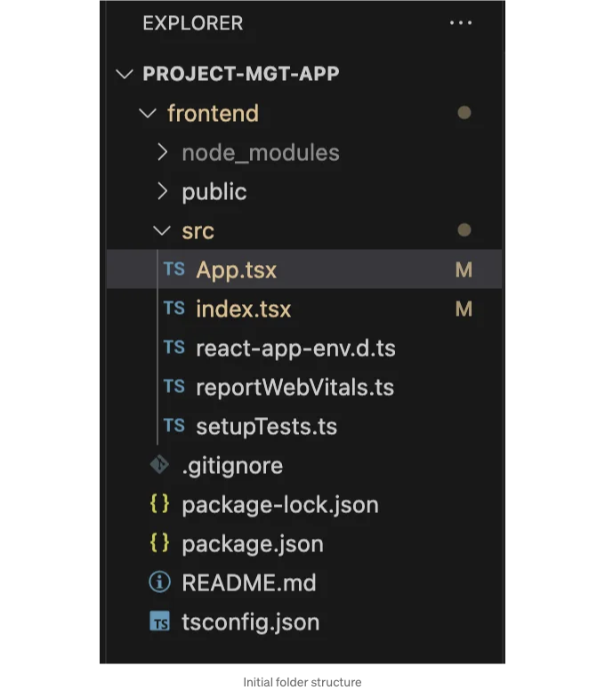
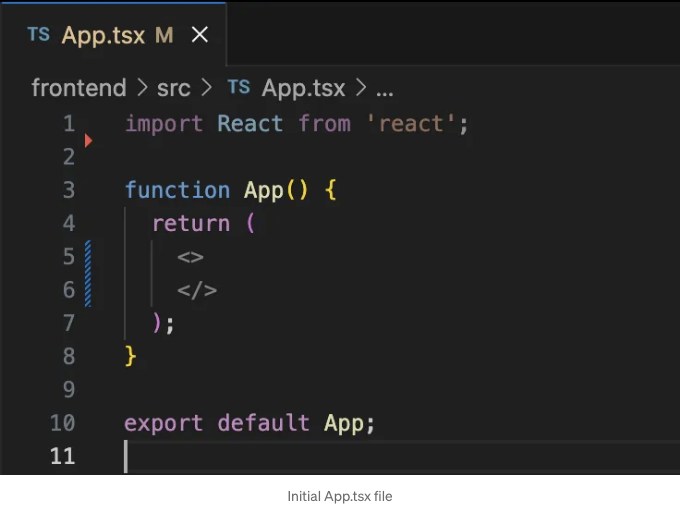
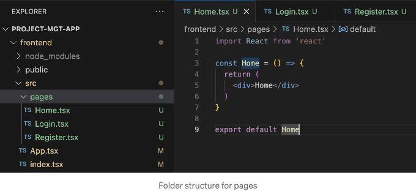
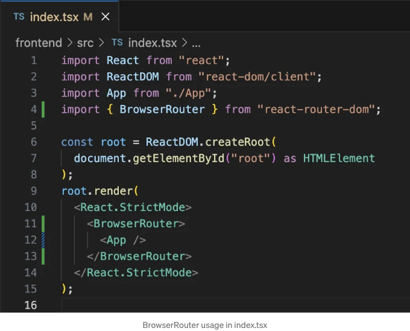
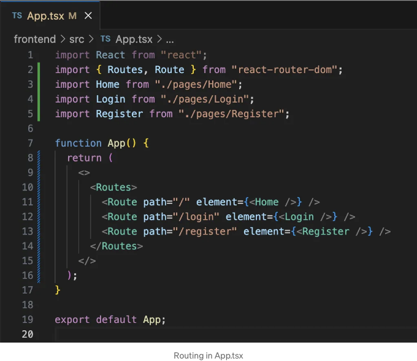
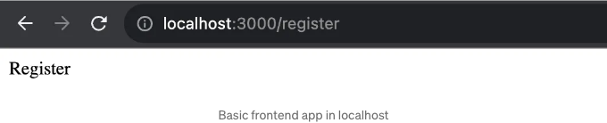
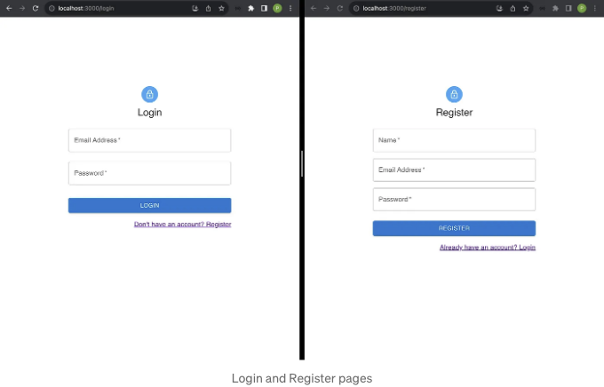

이것은 풀 스택 애플리케이션의 인증 및 권한 부여 프로세스를 구현하는 시리즈의 첫 번째 부분입니다.

여기서는 TypeScript를 사용하여 React 앱을 만들고 UI를 작성하기 위해 MUI를 사용하며 클라이언트 측 라우팅을 위해 React Router V6를 사용할 것입니다. React 앱을 만드는 데 create-react-app을 사용하고 있습니다.

## 1. React 앱 만들기

터미널을 열고 앱을 만들 폴더로 이동하세요. 아래 명령을 실행하세요. 이 명령은 TypeScript로 "frontend"라는 이름의 React 앱을 생성합니다.

<!-- ui-log 수평형 -->
<ins class="adsbygoogle"
  style="display:block"
  data-ad-client="ca-pub-4877378276818686"
  data-ad-slot="9743150776"
  data-ad-format="auto"
  data-full-width-responsive="true"></ins>
<component is="script">
(adsbygoogle = window.adsbygoogle || []).push({});
</component>

```js
npx create-react-app frontend --template typescript
```

애플리케이션을 VS Code에서 열어주세요. VS Code 터미널을 열고 아래 명령어를 실행해주세요.

```js
npm start
```

앱은 http://localhost:3000/ 에서 실행됩니다.

<!-- ui-log 수평형 -->
<ins class="adsbygoogle"
  style="display:block"
  data-ad-client="ca-pub-4877378276818686"
  data-ad-slot="9743150776"
  data-ad-format="auto"
  data-full-width-responsive="true"></ins>
<component is="script">
(adsbygoogle = window.adsbygoogle || []).push({});
</component>

저희 애플리케이션 폴더 아래 생성된 일부 파일은 필요하지 않습니다. 이 파일들 (App.css, App.test.tsx, index.css, logo.svg)을 제거하고 파일 구조를 아래와 같이 유지하십시오.



index.tsx 파일에서 index.css를 가져오는 부분을 제거하세요. App.tsx 파일을 아래와 같이 업데이트 해주세요.



<!-- ui-log 수평형 -->
<ins class="adsbygoogle"
  style="display:block"
  data-ad-client="ca-pub-4877378276818686"
  data-ad-slot="9743150776"
  data-ad-format="auto"
  data-full-width-responsive="true"></ins>
<component is="script">
(adsbygoogle = window.adsbygoogle || []).push({});
</component>

이제 앱 구현을 계속할 수 있습니다.

## 2. React Router를 사용한 클라이언트 측 라우팅

다음 명령을 실행하여 패키지를 설치하세요.

```js
npm i react-router-dom
```

<!-- ui-log 수평형 -->
<ins class="adsbygoogle"
  style="display:block"
  data-ad-client="ca-pub-4877378276818686"
  data-ad-slot="9743150776"
  data-ad-format="auto"
  data-full-width-responsive="true"></ins>
<component is="script">
(adsbygoogle = window.adsbygoogle || []).push({});
</component>

아래와 같이 pages 폴더 아래에 3개의 파일을 만들어 기본 구현을 하세요.



index.tsx 파일에서 BrowserRouter를 import하고 아래와 같이 App 컴포넌트를 감싸세요.



<!-- ui-log 수평형 -->
<ins class="adsbygoogle"
  style="display:block"
  data-ad-client="ca-pub-4877378276818686"
  data-ad-slot="9743150776"
  data-ad-format="auto"
  data-full-width-responsive="true"></ins>
<component is="script">
(adsbygoogle = window.adsbygoogle || []).push({});
</component>

App.tsx 파일에서 페이지에 대한 구성 요소를 가져와 아래와 같이 라우팅을 구현하세요.



이제 앱을 다시 시작하면(npm start), 주소 표시줄에 링크를 입력하여 각 페이지를 볼 수 있습니다.



<!-- ui-log 수평형 -->
<ins class="adsbygoogle"
  style="display:block"
  data-ad-client="ca-pub-4877378276818686"
  data-ad-slot="9743150776"
  data-ad-format="auto"
  data-full-width-responsive="true"></ins>
<component is="script">
(adsbygoogle = window.adsbygoogle || []).push({});
</component>

## 3. UI 구현 (로그인 / 회원가입)

로그인 및 회원가입 페이지에 대해 MUI 무료 템플릿을 사용 중이에요, 몇 가지 업데이트를 했어요.

첫째로, 아래 명령어를 사용하여 mui 및 종속 항목 및 아이콘을 설치하세요.

```js
npm i @mui/material @emotion/react @emotion/styled @mui/icons-material
```

<!-- ui-log 수평형 -->
<ins class="adsbygoogle"
  style="display:block"
  data-ad-client="ca-pub-4877378276818686"
  data-ad-slot="9743150776"
  data-ad-format="auto"
  data-full-width-responsive="true"></ins>
<component is="script">
(adsbygoogle = window.adsbygoogle || []).push({});
</component>

로그인 페이지를 구현하고 입력 필드 데이터를 처리하기 위해 Login.tsx에 아래 코드를 추가하세요.

```js
import { LockOutlined } from "@mui/icons-material";
import {
  Container,
  CssBaseline,
  Box,
  Avatar,
  Typography,
  TextField,
  Button,
  Grid,
} from "@mui/material";
import { useState } from "react";
import { Link } from "react-router-dom";

const Login = () => {
  const [email, setEmail] = useState("");
  const [password, setPassword] = useState("");

  const handleLogin = () => {};

  return (
    <>
      <Container maxWidth="xs">
        <CssBaseline />
        <Box
          sx={{
            marginTop: 20,
            display: "flex",
            flexDirection: "column",
            alignItems: "center",
          }}
        >
          <Avatar sx={{ margin: 1, bgcolor: "primary.light" }}>
            <LockOutlined />
          </Avatar>
          <Typography variant="h5">로그인</Typography>
          <Box sx={{ marginTop: 1 }}>
            <TextField
              margin="normal"
              required
              fullWidth
              id="email"
              label="이메일 주소"
              name="email"
              autoFocus
              value={email}
              onChange={(e) => setEmail(e.target.value)}
            />

            <TextField
              margin="normal"
              required
              fullWidth
              id="password"
              name="password"
              label="비밀번호"
              type="password"
              value={password}
              onChange={(e) => {
                setPassword(e.target.value);
              }}
            />

            <Button
              fullWidth
              variant="contained"
              sx={{ marginTop: 3, marginBottom: 2 }}
              onClick={handleLogin}
            >
              로그인
            </Button>
            <Grid container justifyContent={"flex-end"}>
              <Grid item>
                <Link to="/register">계정이 없으신가요? 회원가입</Link>
              </Grid>
            </Grid>
          </Box>
        </Box>
      </Container>
    </>
  );
};

export default Login;
```

회원가입 페이지를 구현하고 입력 필드 데이터를 처리하기 위해 Register.tsx에 아래 코드를 추가하세요.

```js
import {
  Avatar,
  Box,
  Button,
  Container,
  CssBaseline,
  Grid,
  TextField,
  Typography,
} from "@mui/material";
import { LockOutlined } from "@mui/icons-material";
import { useState } from "react";
import { Link } from "react-router-dom";

const Register = () => {
  const [name, setName] = useState("");
  const [email, setEmail] = useState("");
  const [password, setPassword] = useState("");

  const handleRegister = async () => {};

  return (
    <>
      <Container maxWidth="xs">
        <CssBaseline />
        <Box
          sx={{
            marginTop: 20,
            display: "flex",
            flexDirection: "column",
            alignItems: "center",
          }}
        >
          <Avatar sx={{ margin: 1, bgcolor: "primary.light" }}>
            <LockOutlined />
          </Avatar>
          <Typography variant="h5">회원가입</Typography>
          <Box sx={{ marginTop: 3 }}>
            <Grid container spacing={2}>
              <Grid item xs={12}>
                <TextField
                  name="name"
                  required
                  fullWidth
                  id="name"
                  label="이름"
                  autoFocus
                  value={name}
                  onChange={(e) => setName(e.target.value)}
                />
              </Grid>

              <Grid item xs={12}>
                <TextField
                  required
                  fullWidth
                  id="email"
                  label="이메일 주소"
                  name="email"
                  value={email}
                  onChange={(e) => setEmail(e.target.value)}
                />
              </Grid>
              <Grid item xs={12}>
                <TextField
                  required
                  fullWidth
                  name="password"
                  label="비밀번호"
                  type="password"
                  id="password"
                  value={password}
                  onChange={(e) => setPassword(e.target.value)}
                />
              </Grid>
            </Grid>
            <Button
              fullWidth
              variant="contained"
              sx={{ marginTop: 3, marginBottom: 2 }}
              onClick={handleRegister}
            >
              회원가입
            </Button>
            <Grid container justifyContent="flex-end">
              <Grid item>
                <Link to="/login">이미 계정이 있으신가요? 로그인</Link>
              </Grid>
            </Grid>
          </Box>
        </Box>
      </Container>
    </>
  );
};

export default Register;
```

<!-- ui-log 수평형 -->
<ins class="adsbygoogle"
  style="display:block"
  data-ad-client="ca-pub-4877378276818686"
  data-ad-slot="9743150776"
  data-ad-format="auto"
  data-full-width-responsive="true"></ins>
<component is="script">
(adsbygoogle = window.adsbygoogle || []).push({});
</component>

다음은 UI가 업데이트됩니다.



로그인 / 등록 버튼을 클릭하면 handleLogin() / handleRegister() 함수가 호출됩니다. 아직 이 함수들 내부에는 아무 것도 포함되어 있지 않습니다.

양식 필드를 유효성 검사하고, 유효성 검사가 실패하면 오류 메시지를 표시해야 합니다. 유효성 검사가 성공하면 이 기능을 처리하기 위해 백엔드로 API 요청을 시작해야 합니다.

<!-- ui-log 수평형 -->
<ins class="adsbygoogle"
  style="display:block"
  data-ad-client="ca-pub-4877378276818686"
  data-ad-slot="9743150776"
  data-ad-format="auto"
  data-full-width-responsive="true"></ins>
<component is="script">
(adsbygoogle = window.adsbygoogle || []).push({});
</component>

저를 따라오세요! 궁금한 점이 있으면 댓글로 알려주세요!

## 다음 단계

애플리케이션의 상태 관리에 Redux Toolkit을 사용하고, API 요청 (로그인, 등록, 로그아웃, 프로필)을 시작하기 위해 Axios를 사용할 것입니다.

다음으로는 오류/성공 메시지 알림을 중앙에서 처리할 것입니다 (Redux Toolkit 및 MUI를 사용하여 메시지 UI 구성).

<!-- ui-log 수평형 -->
<ins class="adsbygoogle"
  style="display:block"
  data-ad-client="ca-pub-4877378276818686"
  data-ad-slot="9743150776"
  data-ad-format="auto"
  data-full-width-responsive="true"></ins>
<component is="script">
(adsbygoogle = window.adsbygoogle || []).push({});
</component>

그 다음으로, 사용자가 로그인했는지 여부에 따라 리다이렉트와 보호된 경로로 프론트엔드 코드를 업데이트할 거에요 (인증된 사용자인지 아닌지).

백엔드는 TypeScript로 Express를 사용하여 구현하고, 데이터베이스로 MongoDB를 사용할 거에요.

마지막으로, 프론트엔드와 백엔드 애플리케이션에 대한 권한 부여를 처리할 거에요. 역할 기반 액세스 제어를 사용할 거에요.

그런 다음에 애플리케이션에 더 많은 기능을 계속 추가할 거에요.