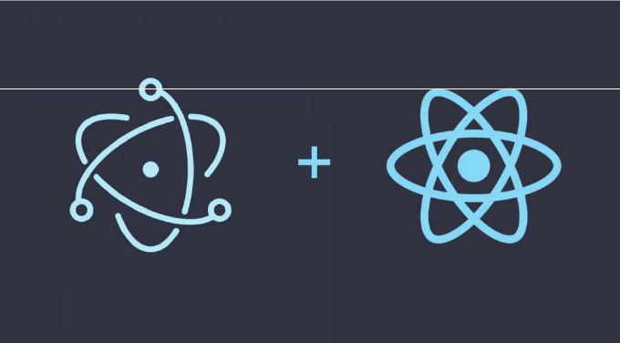

일렉트론은 HTML, CSS 및 JavaScript와 같은 웹 기술을 사용하여 크로스 플랫폼 데스크탑 애플리케이션을 구축할 수 있게 하는 인기있는 프레임워크입니다. 일렉트론과 React를 결합하여 사용자 인터페이스를 구축하기 위한 강력한 JavaScript 라이브러리를 사용하면 Windows, macOS 및 Linux에서 네이티브 애플리케이션처럼 느껴지고 동작하는 기능이 풍부한 데스크톱 애플리케이션을 만들 수 있습니다.

이 튜토리얼에서는 일렉트론과 React를 사용하여 간단한 데스크톱 애플리케이션을 만드는 과정을 안내해 드리겠습니다. 개발 환경 설정, 기본적인 React 애플리케이션 생성, 일렉트론 통합, 다른 플랫폼용 배포 가능한 패키지 빌드 등을 다룰 것입니다.

# 준비물

<!-- ui-log 수평형 -->
<ins class="adsbygoogle"
  style="display:block"
  data-ad-client="ca-pub-4877378276818686"
  data-ad-slot="9743150776"
  data-ad-format="auto"
  data-full-width-responsive="true"></ins>
<component is="script">
(adsbygoogle = window.adsbygoogle || []).push({});
</component>

시작하기 전에 시스템에 다음 소프트웨어가 설치되어 있는지 확인해주세요:

- Node.js와 npm (Node Package Manager): 시스템에 Node.js와 npm을 설치하려면 공식 웹사이트(https://nodejs.org/)를 방문하여 운영 체제에 맞는 설치 지침을 따르세요.

## 단계 1: 새로운 리액트 애플리케이션 설정하기

create-react-app을 사용하여 새로운 리액트 애플리케이션을 설정하는 것으로 시작해봅시다.

<!-- ui-log 수평형 -->
<ins class="adsbygoogle"
  style="display:block"
  data-ad-client="ca-pub-4877378276818686"
  data-ad-slot="9743150776"
  data-ad-format="auto"
  data-full-width-responsive="true"></ins>
<component is="script">
(adsbygoogle = window.adsbygoogle || []).push({});
</component>

- 터미널이나 명령 프롬프트를 열고 새로운 React 애플리케이션을 생성하려면 다음 명령을 실행하세요:

```js
npx create-react-app electron-react-app
```

2. 설치가 완료되면 새로 생성된 프로젝트 디렉토리로 이동하세요:

```js
cd electron-react-app
```

<!-- ui-log 수평형 -->
<ins class="adsbygoogle"
  style="display:block"
  data-ad-client="ca-pub-4877378276818686"
  data-ad-slot="9743150776"
  data-ad-format="auto"
  data-full-width-responsive="true"></ins>
<component is="script">
(adsbygoogle = window.adsbygoogle || []).push({});
</component>

3. 모든 것이 올바르게 설정되었는지 확인하려면 개발 서버를 실행하세요:

```js
npm start
```

이제 브라우저에서 http://localhost:3000 에서 React 애플리케이션이 실행되는 것을 볼 수 있어요.

# 단계 2: 일렉트론 설치하기

<!-- ui-log 수평형 -->
<ins class="adsbygoogle"
  style="display:block"
  data-ad-client="ca-pub-4877378276818686"
  data-ad-slot="9743150776"
  data-ad-format="auto"
  data-full-width-responsive="true"></ins>
<component is="script">
(adsbygoogle = window.adsbygoogle || []).push({});
</component>

다음으로, Electron을 설치하고 React 애플리케이션이 Electron과 함께 작동하도록 구성할 것입니다.

- 터미널에서 Ctrl+C를 눌러 개발 서버를 중지합니다.
- npm을 사용하여 Electron 및 electron-builder를 개발 의존성으로 설치합니다:

```js
npm i -D electron electron-is-dev

npm install electron electron-builder --save-dev
```

이 명령은 우리의 Electron 앱이 개발 중인지 아니면 프로덕션 환경에 있는지 확인하는 데 사용되는 유용한 npm 패키지인 electron-is-dev도 함께 설치했습니다. electron을 개발 의존성으로 설치하기 위해 -D 플래그를 사용했습니다.

<!-- ui-log 수평형 -->
<ins class="adsbygoogle"
  style="display:block"
  data-ad-client="ca-pub-4877378276818686"
  data-ad-slot="9743150776"
  data-ad-format="auto"
  data-full-width-responsive="true"></ins>
<component is="script">
(adsbygoogle = window.adsbygoogle || []).push({});
</component>

# 단계 3: Electron 구성

이제 React 애플리케이션을 실행하기 위해 Electron을 구성할 것입니다.

- 프로젝트의 루트 디렉토리에서 electron.js라는 새 파일을 만듭니다. 이 파일은 Electron 애플리케이션의 주 진입점으로 사용됩니다.
- 즐겨 사용하는 코드 편집기에서 electron.js를 열고 아래 코드를 추가합니다:

```js
// electron.js
const { app, BrowserWindow } = require('electron');
const path = require('path');
const isDev = require('electron-is-dev');

let mainWindow;

function createWindow() {
  mainWindow = new BrowserWindow({
    width: 800,
    height: 600,
    webPreferences: {
      nodeIntegration: true,
    },
  });

  const startURL = isDev
    ? 'http://localhost:3000'
    : `file://${path.join(__dirname, '../build/index.html')}`;

  mainWindow.loadURL(startURL);

  mainWindow.on('closed', () => (mainWindow = null));
}

app.on('ready', createWindow);

app.on('window-all-closed', () => {
  if (process.platform !== 'darwin') {
    app.quit();
  }
});

app.on('activate', () => {
  if (mainWindow === null) {
    createWindow();
  }
});
```

<!-- ui-log 수평형 -->
<ins class="adsbygoogle"
  style="display:block"
  data-ad-client="ca-pub-4877378276818686"
  data-ad-slot="9743150776"
  data-ad-format="auto"
  data-full-width-responsive="true"></ins>
<component is="script">
(adsbygoogle = window.adsbygoogle || []).push({});
</component>

이 코드는 주된 Electron 애플리케이션 창을 설정하고, 개발 모드인 경우 개발 서버에서 React 애플리케이션을 로드하거나, 제품 모드인 경우 빌드 디렉토리에서 로드합니다.

# 단계 4: package.json 업데이트

Electron이 메인 엔트리 파일 및 빌드 디렉토리를 인지하도록 하려면 package.json 파일을 수정해야 합니다.

- package.json 파일을 열고 다음 줄을 JSON 객체 내부에 추가하세요:

<!-- ui-log 수평형 -->
<ins class="adsbygoogle"
  style="display:block"
  data-ad-client="ca-pub-4877378276818686"
  data-ad-slot="9743150776"
  data-ad-format="auto"
  data-full-width-responsive="true"></ins>
<component is="script">
(adsbygoogle = window.adsbygoogle || []).push({});
</component>

```js
// package.json
{
  // ...
  "electron": "electron .",
  "dist": "electron-builder",
  "main": "electron.js",

  "build": {
    "appId": "com.example.myapp",
    "productName": "My Electron App",
    "directories": {
      "output": "dist"
    }
  },

  // ...
}
```

"main" 필드는 일렉트론의 진입점을 지정하며, "build" 섹션은 electron-builder를 위한 구성 옵션을 제공하며, 이는 appId, productName 및 배포를 위한 출력 디렉토리를 포함합니다.

# 단계 5: 일렉트론 실행

이제 일렉트론 애플리케이션을 테스트해 봅시다.

<!-- ui-log 수평형 -->
<ins class="adsbygoogle"
  style="display:block"
  data-ad-client="ca-pub-4877378276818686"
  data-ad-slot="9743150776"
  data-ad-format="auto"
  data-full-width-responsive="true"></ins>
<component is="script">
(adsbygoogle = window.adsbygoogle || []).push({});
</component>

- React 애플리케이션의 개발 서버를 시작하려면 다음을 실행하세요:

```js
npm start
```

2. 별도의 터미널이나 명령 프롬프트에서 Electron 애플리케이션을 실행하세요:

```js
npm run electron
```

<!-- ui-log 수평형 -->
<ins class="adsbygoogle"
  style="display:block"
  data-ad-client="ca-pub-4877378276818686"
  data-ad-slot="9743150776"
  data-ad-format="auto"
  data-full-width-responsive="true"></ins>
<component is="script">
(adsbygoogle = window.adsbygoogle || []).push({});
</component>

이제 독립적인 Electron 창 내에서 React 애플리케이션이 실행되는 것을 확인할 수 있어요.

# 단계 6: 배포용 패키지 빌드

Electron 애플리케이션을 패키지화하여 사용자에게 배포하려면, 플랫폼별 배포용 패키지를 생성해야 합니다. electron-builder를 사용하면 이 과정을 간단하게 할 수 있어요.

- 패키지 빌드를 진행하기 전에 실행 중인 Electron 애플리케이션과 React 개발 서버를 중지해 주세요.
- 현재 플랫폼용 패키지를 빌드하려면, 다음 명령어를 실행하세요:

<!-- ui-log 수평형 -->
<ins class="adsbygoogle"
  style="display:block"
  data-ad-client="ca-pub-4877378276818686"
  data-ad-slot="9743150776"
  data-ad-format="auto"
  data-full-width-responsive="true"></ins>
<component is="script">
(adsbygoogle = window.adsbygoogle || []).push({});
</component>

```js
npm run build
```

이 명령어는 dist 디렉토리에 배포 가능한 패키지를 생성합니다.

여러 플랫폼을 위한 패키지를 빌드하려면 다음 명령어를 사용할 수 있습니다:

```js
npm run dist
```

<!-- ui-log 수평형 -->
<ins class="adsbygoogle"
  style="display:block"
  data-ad-client="ca-pub-4877378276818686"
  data-ad-slot="9743150776"
  data-ad-format="auto"
  data-full-width-responsive="true"></ins>
<component is="script">
(adsbygoogle = window.adsbygoogle || []).push({});
</component>

위 명령은 dist 디렉토리에 Windows, macOS 및 Linux용 패키지를 생성합니다.

축하합니다! Electron과 React를 사용하여 데스크톱 애플리케이션을 성공적으로 만들었습니다. 이제 여러 플랫폼의 사용자에게 애플리케이션을 배포할 수 있습니다.

# 결론

Electron과 React는 크로스플랫폼 데스크톱 애플리케이션을 구축하기 위한 강력한 조합을 제공합니다. 이 튜토리얼을 따라와 React 애플리케이션을 설정하고 Electron과 통합하며 배포를 위해 패키징하는 방법을 배웠습니다.

<!-- ui-log 수평형 -->
<ins class="adsbygoogle"
  style="display:block"
  data-ad-client="ca-pub-4877378276818686"
  data-ad-slot="9743150776"
  data-ad-format="auto"
  data-full-width-responsive="true"></ins>
<component is="script">
(adsbygoogle = window.adsbygoogle || []).push({});
</component>

이 튜토리얼은 기본 사항만 다루었으며, Electron과 React를 활용하여 정교한 데스크톱 애플리케이션을 개발할 수 있는 방법이 더 많이 있습니다. 프로젝트에 대한 더 고급 기능과 가능성을 발견하려면 Electron과 React 문서를 탐색해보세요. 즐거운 코딩 하세요!